# DevVerse CS Blog -- Architecture Document

This document provides a comprehensive technical reference for the DevVerse CS Blog, a Next.js application that serves computer science and software engineering articles written in MDX. It covers the full system architecture, rendering pipeline, RAG-powered chat, authentication, data flow, and deployment.

---

## Table of Contents

1. [System Overview](#1-system-overview)
2. [Content Pipeline](#2-content-pipeline)
3. [Rendering Architecture](#3-rendering-architecture)
4. [RAG Chat System](#4-rag-chat-system)
5. [Authentication and User Data](#5-authentication-and-user-data)
6. [Component Architecture](#6-component-architecture)
7. [Data Flow](#7-data-flow)
8. [API Routes](#8-api-routes)
9. [Build and Deploy](#9-build-and-deploy)
10. [Key Invariants](#10-key-invariants)

---

## 1. System Overview

DevVerse is a statically-generated technical blog built on the Next.js App Router. Articles are authored in MDX and compiled at build time into React components. The application integrates with three external services: Supabase for authentication, favorites, and analytics; Pinecone for vector-based article search; and Google Gemini for embeddings and answer generation.

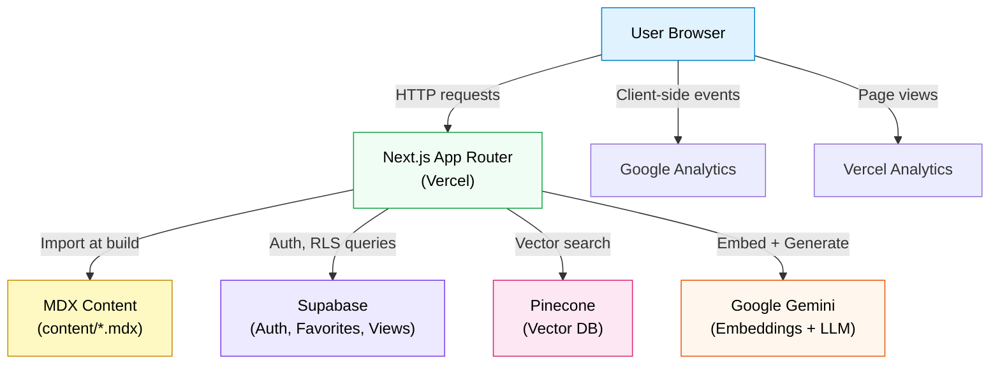

### Key Design Decisions

- **MDX as canonical content source.** Articles live as `.mdx` files in the `content/` directory. There is no CMS or database-backed content store.
- **Static generation with ISR.** Article pages use `generateStaticParams()` for SSG. The home page uses `revalidate = 60` for Incremental Static Regeneration.
- **Hybrid RAG retrieval.** The chat system combines Pinecone vector search with a local lexical fallback (`lib/rag-local.ts`), deduplicating and re-ranking results.
- **Supabase for user-facing data.** Authentication, favorites, and view counts are handled through Supabase with Row Level Security.
- **No server-side rendering at request time for articles.** All article pages are statically generated and served from the CDN edge.

---

## 2. Content Pipeline

### Article Lifecycle

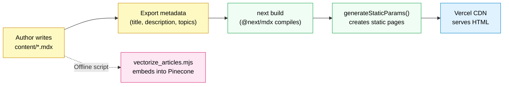

### Article Metadata Contract

Every MDX file must include a literal `export const metadata = { ... };` object at the top of the file. The following fields are expected:

```javascript
export const metadata = {
  title: "Article Title",
  description: "A brief summary of the article.",
  topics: ["Web Development", "Next.js"],
};
```

The article body must contain:
- `### Author: Name` -- author attribution line
- `> Date: YYYY-MM-DD` -- publication date in a blockquote
- A top-level `#` heading as the first heading in the body

### Content Parsers

Three independent modules parse MDX content using the same regex-based extraction patterns. They do not share a single parser implementation, so changes to the metadata contract must be updated in all three locations simultaneously.

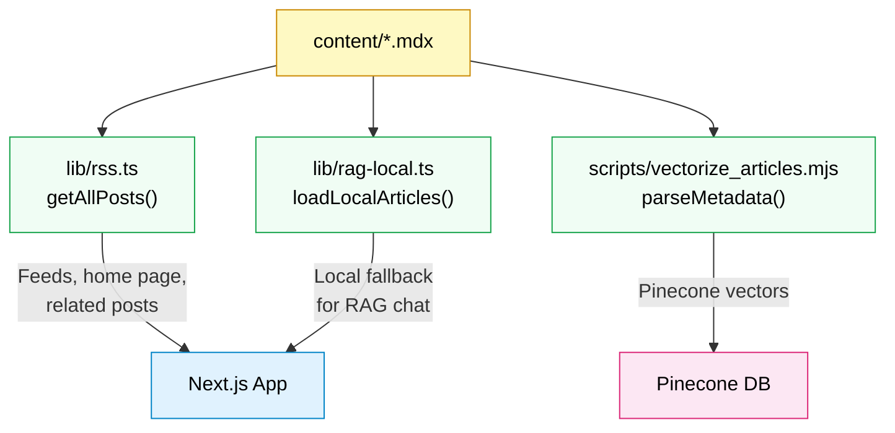

Each parser extracts metadata using the same regex: `/export const metadata = \{([\s\S]*?)\};/`. Title, description, and topics are then parsed with individual field-level regexes. The body is extracted starting from the first `#` character in the file.

### Chunking Strategy

Both `lib/rag-local.ts` and `scripts/vectorize_articles.mjs` chunk article bodies by splitting on double newlines (paragraph boundaries) with a maximum chunk length of 1200 characters. When a single paragraph exceeds the limit, it is split at word boundaries.

---

## 3. Rendering Architecture

### Request Flow

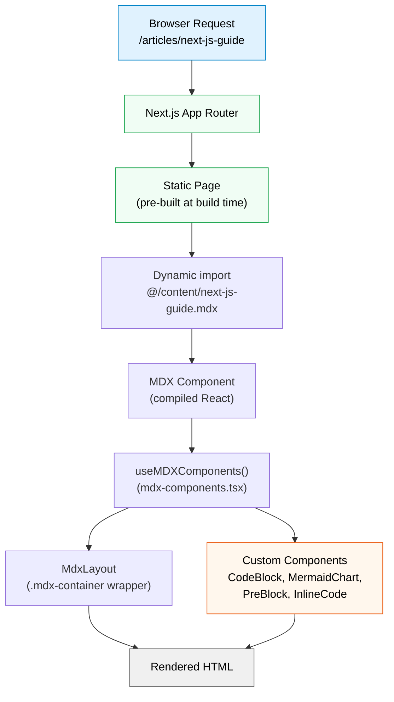

### MDX Component Interception

The `mdx-components.tsx` file defines a `useMDXComponents()` hook that overrides default HTML elements rendered by MDX. The most significant interception is in the `pre` element handler:

1. When a `<pre>` contains a child with `className="language-mermaid"`, the content is routed to `MermaidChart` for client-side diagram rendering.
2. When a `<pre>` contains a child with any other language className, it is routed to `CodeBlock` for syntax highlighting.
3. Plain `<pre>` blocks without a language class go to `PreBlock` for basic dark/light mode styling.
4. Inline `<code>` without a className is handled by `InlineCode`.

### Mermaid Rendering Pipeline

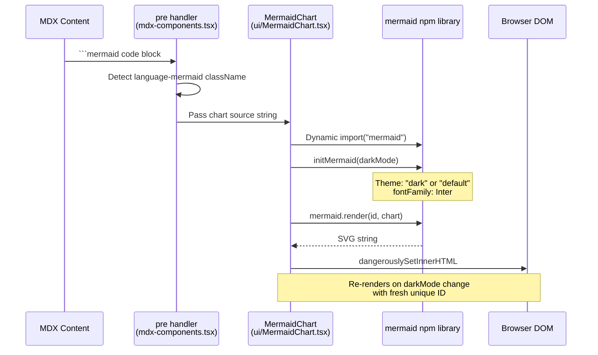

The `MermaidChart` component dynamically imports the `mermaid` library on the client side. It initializes mermaid with a theme matching the current dark mode state (read from `DarkModeContext`). A unique ID is generated for each render because mermaid requires unique element IDs. When dark mode toggles, the chart re-renders with the updated theme.

### Dark Mode Chain

The dark mode system uses a four-stage chain to prevent flash of unstyled content (FOUC):

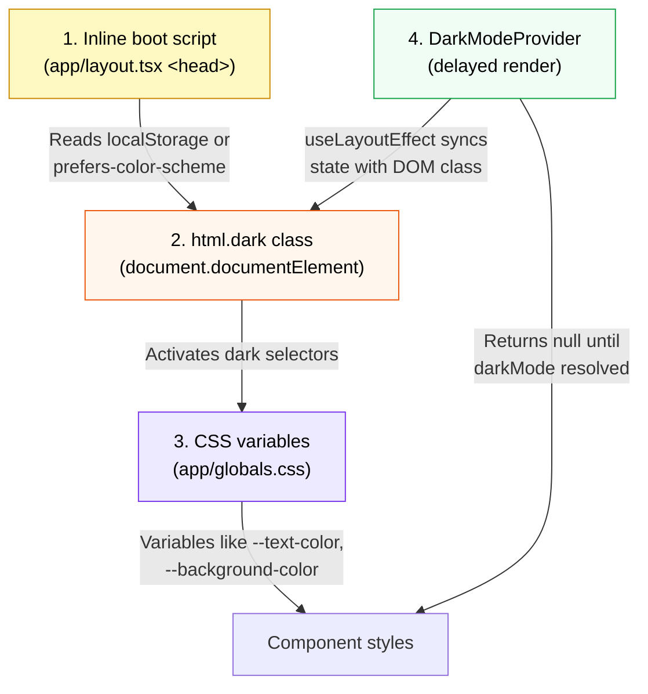

**Stage 1:** An inline `<script>` in `layout.tsx` runs before hydration. It reads `localStorage.getItem('darkMode')` and falls back to `window.matchMedia('(prefers-color-scheme: dark)')`. If dark mode is detected, it immediately adds the `dark` class to `<html>`.

**Stage 2:** The `dark` class on `<html>` activates CSS selectors like `html.dark { background-color: #121212 }` directly in the `<style>` tag in `<head>`, preventing a white flash.

**Stage 3:** CSS variables defined in `globals.css` respond to `html.dark` and provide `--text-color`, `--background-color`, `--container-background`, etc.

**Stage 4:** `DarkModeProvider` uses `useLayoutEffect` to read localStorage, toggle the class, and expose `darkMode`/`setDarkMode` via context. It renders `null` (no children) until the initial value is resolved, preventing a hydration mismatch.

---

## 4. RAG Chat System

### End-to-End Chat Flow

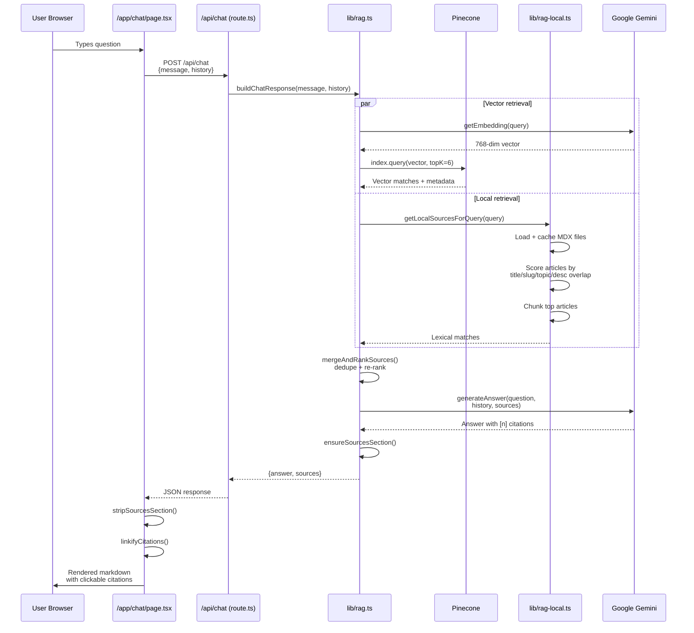

### Vectorization Pipeline

The offline vectorization script (`scripts/vectorize_articles.mjs`) processes all MDX files and upserts their embeddings into Pinecone.

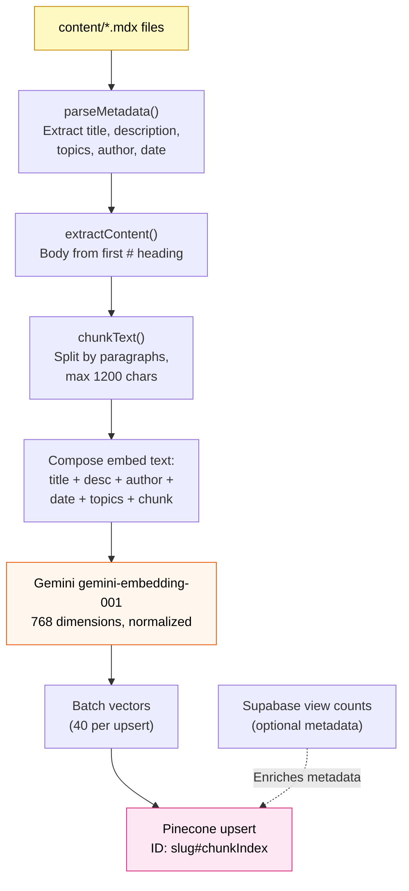

Each vector is stored with metadata including `slug`, `title`, `description`, `topics`, `author`, `date`, `readingMinutes`, `views`, `url`, `chunkIndex`, and `content`. Before inserting new vectors for an article, the script deletes up to 200 old vector IDs for that slug to prevent orphan chunks from previous runs.

The script supports resumption after rate limiting with `--skip=N` or `--from=slug` flags, and uses exponential backoff with server-provided retry delay parsing.

### Local Fallback System

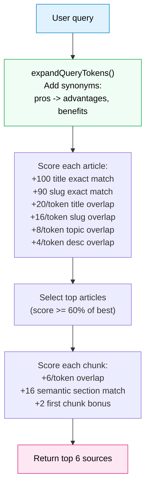

The local fallback (`lib/rag-local.ts`) operates without any external API calls. It loads all MDX files from disk (cached in memory after first load), tokenizes both the query and article content, expands query tokens with a synonym dictionary (e.g., "pros" expands to "advantages, benefits, strengths, upsides"), and returns chunk-level results scored by lexical overlap.

### Citation Pipeline

The citation system spans backend and frontend:

1. **Backend** (`lib/rag.ts`): The prompt instructs Gemini to cite sources with bracket notation like `[1]`. The `ensureSourcesSection()` function guarantees a `Sources:` footer listing each citation.
2. **Frontend** (`lib/chat-citations.ts`):
   - `stripSourcesSection()` removes the `Sources:` footer from display text.
   - `linkifyCitations()` converts `[1]` patterns into markdown links like `[1](#source-msgId-1)`.
   - `getCitationNumberFromHref()` extracts the source number from a citation link href.
3. **Chat UI** (`app/chat/page.tsx`): Citation links become clickable buttons that scroll the corresponding source card into view using `element.scrollIntoView()`.

---

## 5. Authentication and User Data

### Supabase Auth Flow

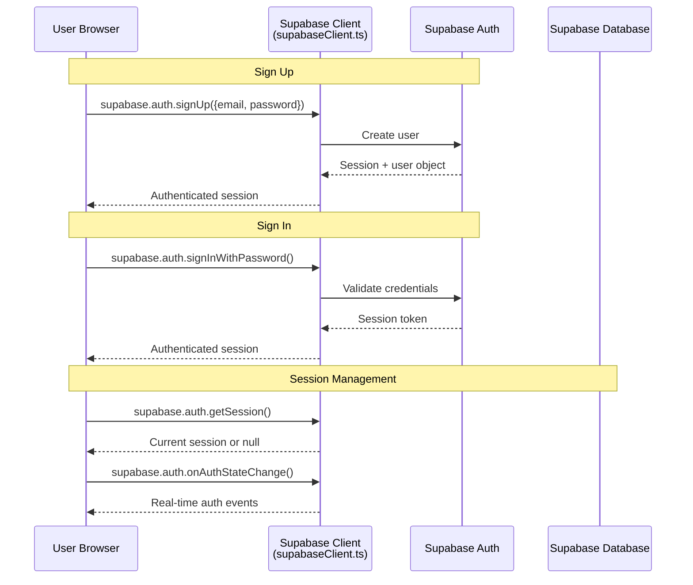

The Supabase client (`supabase/supabaseClient.ts`) is a browser-only singleton created with the anon key. The service role key (`SUPABASE_SERVICE_ROLE_KEY`) is only used in two server-side API routes: `/api/verify-email` and `/api/reset-password`.

### Favorites System

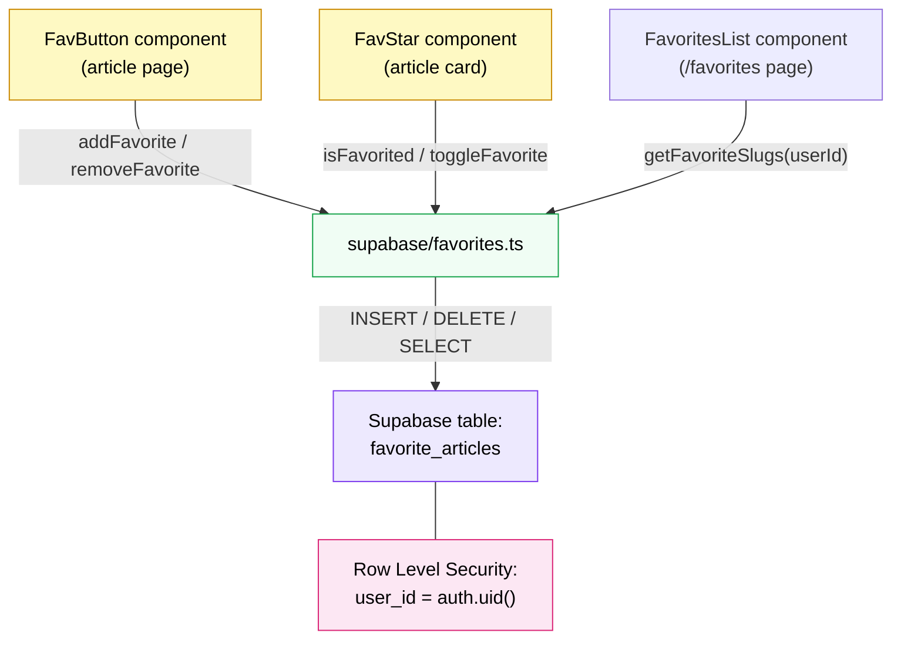

The `favorite_articles` table stores `(user_id, article_slug)` pairs. Row Level Security ensures users can only read and modify their own favorites. The `FavButton` component appears on article pages as a floating star button, while `FavStar` appears inline on article cards. Both require an authenticated session.

### View Count System

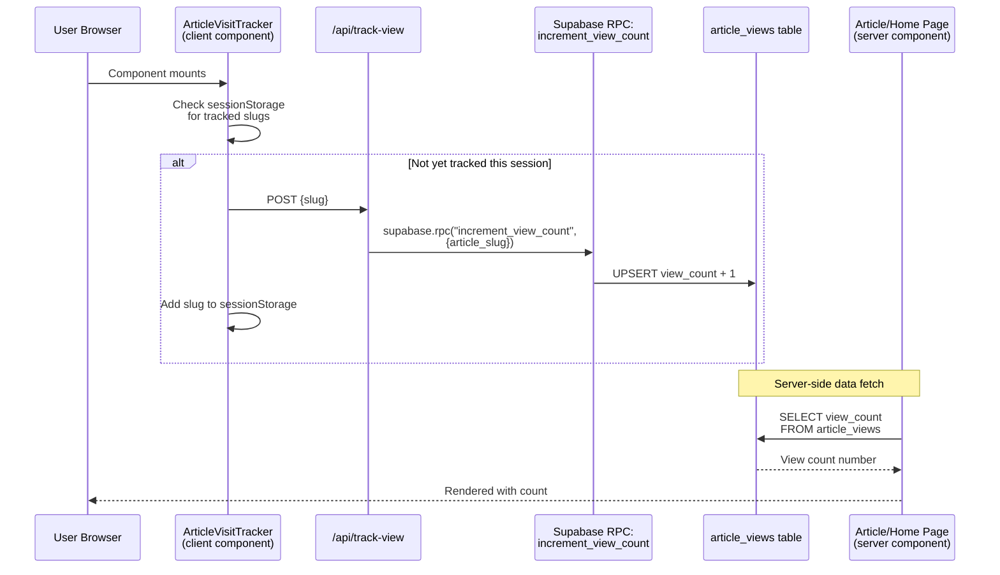

View tracking uses a dual mechanism:

1. **Client-side tracking:** `ArticleVisitTracker` fires a POST to `/api/track-view` once per session per article (tracked via `sessionStorage`). It also stores visit history in `localStorage` for up to 50 articles.
2. **Server-side display:** Article pages and the home page fetch view counts directly from Supabase at render time using the anon key. The home page uses ISR (60s revalidation) to keep counts fresh.

The view count increment uses a Supabase RPC function (`increment_view_count`) that performs an atomic upsert, avoiding race conditions.

---

## 6. Component Architecture

### Layout Hierarchy

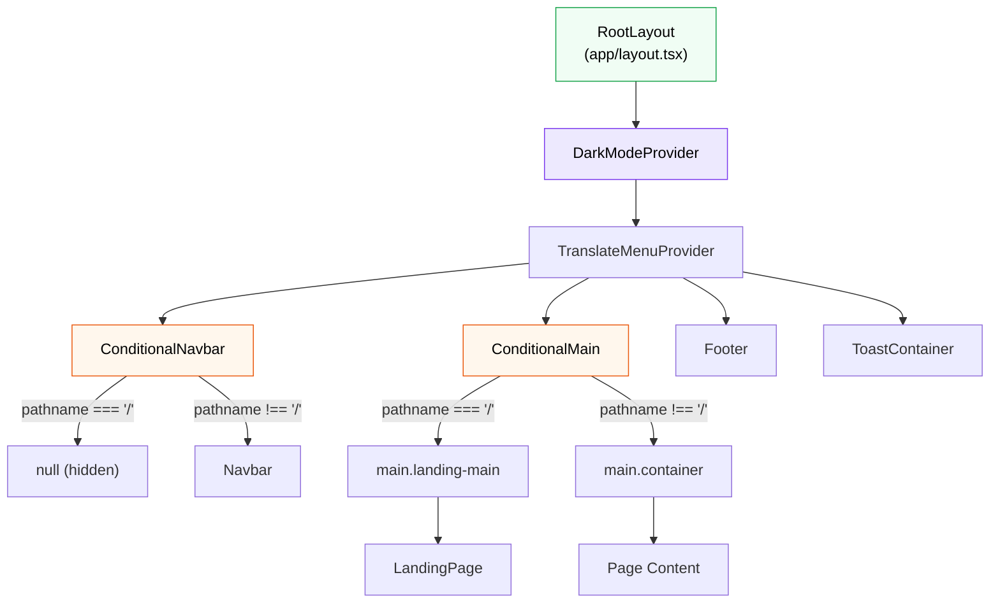

The root layout wraps all pages in a consistent shell: `DarkModeProvider` -> `TranslateMenuProvider` -> `ConditionalNavbar` + `ConditionalMain` + `Footer`. The conditional components use `usePathname()` to differentiate the landing page (`/`) from all other routes. The landing page hides the navbar and uses a distinct `landing-main` CSS class.

### InteractiveCard Anatomy

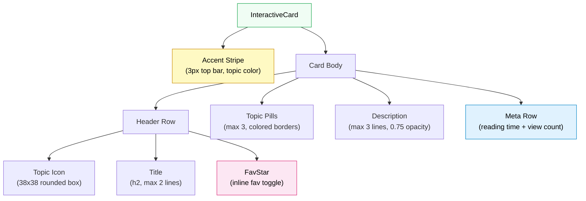

The `InteractiveCard` component renders each article in the home page grid. Key design details:

- **Accent color** is derived from the first topic using a lookup table (`TOPIC_COLORS`) or a deterministic hash-based hue fallback.
- **Icon** is selected from `TOPIC_ICONS` by iterating through the article's topics until a match is found; defaults to `FiCode`.
- **Hover effect** translates the card up by 5px and deepens the box shadow.
- **CSS custom property** `--card-accent` is set on the card element for hover border color.

### ArticleMeta Portal Pattern

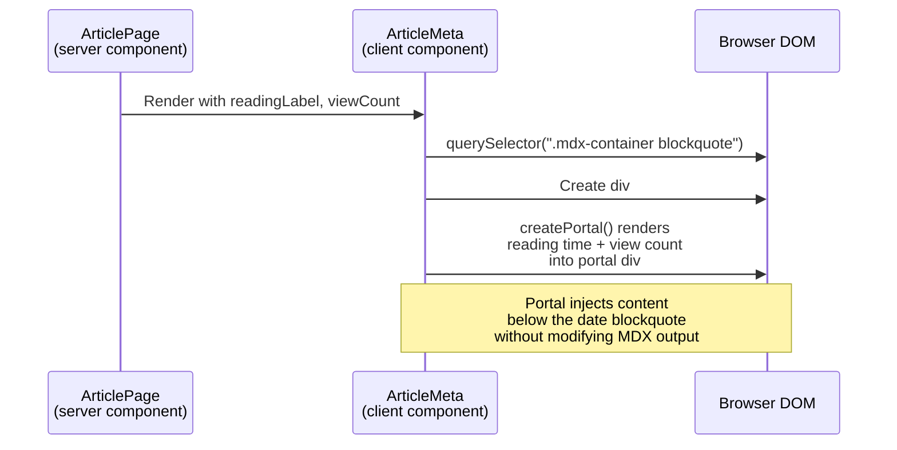

`ArticleMeta` uses React's `createPortal` to inject reading time and view count into the MDX-rendered article body. It locates the first `<blockquote>` inside `.mdx-container` (which holds the `> Date: YYYY-MM-DD` line) and inserts a portal div immediately after it. This allows server-rendered metadata to appear inline without altering the MDX compilation pipeline.

### Tooltip System

The `Tooltip` component also uses `createPortal`, rendering the tooltip content directly into `document.body`. This avoids z-index and overflow clipping issues that would occur if tooltips were rendered within their parent component's DOM tree. Positioning is calculated using `getBoundingClientRect()` on the trigger element, with support for four positions: top, bottom, left, and right.

---

## 7. Data Flow

### Home Page Data Flow

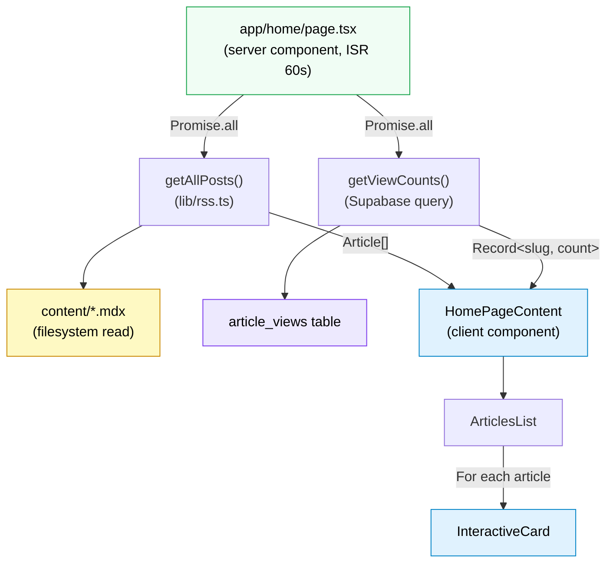

The home page (`/home`) is a server component that fetches articles and view counts in parallel using `Promise.all`. Articles are sorted alphabetically by title (case-insensitive with numeric awareness). The data is passed to `HomePageContent`, a client component that handles search, filtering, and animated rendering via `ArticlesList` and `InteractiveCard`.

### Article Page Data Flow

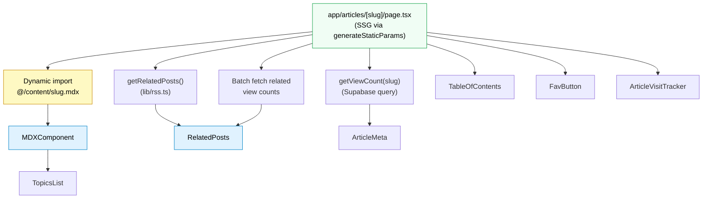

### Related Posts Scoring Algorithm

The `getRelatedPosts()` function in `lib/rss.ts` uses a multi-signal scoring approach to rank related articles:

| Signal | Weight | Description |
|--------|--------|-------------|
| Topic overlap | x3 per shared topic | Strongest signal. Each shared topic adds 3 points. |
| Title similarity | x2 Jaccard | Jaccard similarity of tokenized titles, doubled. |
| Description similarity | x1 Jaccard | Jaccard similarity of tokenized descriptions. |
| Content similarity | x1 Jaccard | Jaccard similarity of first 2000 characters of body content. |
| Reading time proximity | +0.5 or +0.2 | Bonus if reading times are within 3 or 6 minutes respectively. |
| Recency bonus | +0.3 | Bonus for articles published within the last 90 days. |

All tokens are lowercased, stripped of non-alphanumeric characters, filtered to length > 2, and cleaned of common stop words. Ties are broken by publication date (newer first). If fewer than `minCount` (default 4) related posts are found, recent articles backfill the remaining slots.

---

## 8. API Routes

| Route | Method | Purpose | Auth Required | Key Details |
|-------|--------|---------|--------------|-------------|
| `/api/chat` | POST | RAG-powered chat | No | Accepts `{message, history}`. Returns `{answer, sources}`. Uses `buildChatResponse()` from `lib/rag.ts`. Runtime: Node.js. |
| `/api/track-view` | POST | Increment article view count | No | Accepts `{slug}`. Calls Supabase RPC `increment_view_count`. Idempotency managed client-side via sessionStorage. |
| `/api/rss` | GET | RSS 2.0 feed | No | Generates XML via `generateRSSFeed()`. Cached for 1 hour (`max-age=3600`). |
| `/api/atom` | GET | Atom feed | No | Generates Atom XML via `generateAtomFeed()`. Cached for 1 hour. |
| `/api/verify-email` | POST | Check if email exists | No (but uses service role) | **Sensitive.** Uses `auth.admin.listUsers({perPage: 1000})` to enumerate users. Service role key required. |
| `/api/reset-password` | POST | Reset user password | No (but uses service role) | **Sensitive.** Finds user by email via `listUsers`, then calls `updateUserById`. Service role key required. |

### Security Considerations

The `/api/verify-email` and `/api/reset-password` routes use the `SUPABASE_SERVICE_ROLE_KEY` and enumerate all users (up to 1000). These routes have no authentication or rate limiting at the application level. Changes to these routes require careful consideration of abuse potential and the 1000-user ceiling.

---

## 9. Build and Deploy

### CI/CD Pipeline

```mermaid
graph LR
    Push["Git Push / PR<br/>to master"]
    Format["1. Format & Lint<br/>(Prettier + ESLint)"]
    Test["2. Run Tests<br/>(Jest)"]
    Coverage["3. Generate Coverage<br/>(upload artifact)"]
    Docker["4. Build & Push<br/>Docker Image<br/>(GHCR)"]
    Deploy["5. Deploy<br/>(Vercel + Supabase)"]
    Done["6. All Done"]

    Push --> Format
    Format --> Test
    Test --> Coverage
    Coverage --> Docker
    Docker --> Deploy
    Deploy --> Done

    style Push fill:#e0f2fe,stroke:#0284c7,color:#000
    style Format fill:#fef9c3,stroke:#ca8a04,color:#000
    style Test fill:#f0fdf4,stroke:#16a34a,color:#000
    style Coverage fill:#ede9fe,stroke:#7c3aed,color:#000
    style Docker fill:#fff7ed,stroke:#ea580c,color:#000
    style Deploy fill:#fce7f3,stroke:#db2777,color:#000
```

The CI/CD pipeline runs on GitHub Actions for every push or pull request to `master`. The six sequential stages are:

1. **Format and Lint:** Runs Prettier (`npm run format`) and ESLint (`npm run lint`). Note that `npm run lint` is aliased to `npm run format`, so it mutates files rather than performing read-only linting.
2. **Tests:** Runs the Jest test suite.
3. **Coverage:** Generates coverage reports and uploads them as artifacts.
4. **Docker:** Builds the Docker image and pushes to GitHub Container Registry (`ghcr.io`).
5. **Deploy:** Connects to Supabase and deploys to Vercel (currently placeholder steps).
6. **Complete:** Final status check.

### Sitemap Generation

Sitemap generation runs as a postbuild step (`next-sitemap`). The configuration in `next-sitemap.config.js` reads `SITE_URL` (not `NEXT_PUBLIC_SITE_URL`) and generates entries for all article slugs via `additionalPaths`. Each article path is set to weekly change frequency with 0.7 priority.

### Docker Configuration

The Dockerfile uses `node:18-bullseye-slim` as the base image, installs dependencies with `npm install`, copies the project, and starts the development server with `npm run dev`. Note that this runs the dev server, not a production build -- CI does not prove a production build is healthy through the Docker image.

### Build Configuration

The Next.js configuration (`next.config.mjs`) uses `@next/mdx` with three plugins:

- `remarkGfm` -- GitHub Flavored Markdown (tables, strikethrough, autolinks)
- `remarkMath` -- LaTeX math expression parsing
- `rehypeKatex` -- KaTeX rendering for math expressions

Page extensions include `.mdx` alongside standard JS/TS extensions, allowing MDX files to be imported as pages and components.

---

## 10. Key Invariants

These invariants are derived from the project's CLAUDE.md and represent contracts that must be preserved across all changes.

### Route Structure

- **`/` is the landing page.** It intentionally hides the navbar via `ConditionalNavbar`. Uses the `landing-main` CSS class instead of `container`.
- **`/home` is the article index.** It shows the navbar and article grid. The split between `/` and `/home` must be preserved.

### MDX Container Structure

- The `.mdx-container` class wrapping and the article heading structure (h2, h3) must be preserved. `TableOfContents` depends on querying `h2` and `h3` elements inside `.mdx-container`.
- `ArticleMeta` depends on finding a `blockquote` inside `.mdx-container` to position its portal.

### Dark Mode Chain

The four-stage dark mode chain (inline boot script -> `html.dark` class -> CSS variables -> `DarkModeProvider`) must be preserved in its current order. Breaking any stage can cause FOUC or hydration mismatches.

### Chat Citation Format

The chat response formatting must stay aligned across the backend and frontend:
- The answer body uses bracket citations (`[1]`, `[2]`, etc.).
- The backend appends a `Sources:` section.
- The frontend strips the `Sources:` section and links citations to the `sources` array.

### MDX Content Contract

The metadata contract (`export const metadata = { ... };` with `title`, `description`, and `topics` as literal string/array fields) must be preserved. Changes to this contract require updating all three parsers simultaneously:
- `lib/rss.ts`
- `lib/rag-local.ts`
- `scripts/vectorize_articles.mjs`

Additionally, `### Author: ...` and `> Date: YYYY-MM-DD` patterns in article content must be preserved, as they are parsed by the same modules.

### Environment Variable Split

Two distinct site URL variables serve different purposes:
- `SITE_URL` is read by `next-sitemap.config.js` for sitemap generation.
- `NEXT_PUBLIC_SITE_URL` is read by feed generators and local RAG for constructing article URLs.

### Data Boundaries

- The Supabase anon client belongs in browser-facing helpers only.
- `SUPABASE_SERVICE_ROLE_KEY` must stay server-only and is restricted to `/api/verify-email` and `/api/reset-password`.

### Content Staleness

Content edits can make Pinecone vectors stale. After MDX or RAG chunking changes, the vectorization script (`npm run vectorize:articles`) should be re-run to keep the vector index in sync.
