# DevVerse Computer Science & Software Engineering Blog

A modern, high-performance full-stack blog built with [Next.js](https://nextjs.org/), featuring 50+ in-depth articles with Mermaid diagrams, an AI-powered RAG chatbot, Supabase-backed view tracking, MDX content, PWA support, and a rich ecosystem of libraries including Pinecone, Google Gemini, Framer Motion, KaTeX, and more.

<p align="center">
  <a href="https://devverse-swe.vercel.app" target="_blank" rel="noopener">
    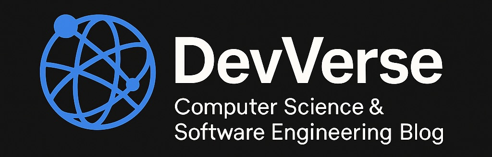
  </a>
</p>

<p align="center" style="cursor: pointer;">
  <strong>Visit DevVerse:</strong><br/>
  <a href="https://devverse-swe.vercel.app" target="_blank" rel="noopener">
    
  </a>
</p>

<div align="center">
  
  
  
  
  
  
  
  
  
  
  
  
  
  
  
  
  
  
  
  
  
  
  
  
  
  
  
  
</div>

## Table of Contents

- [Overview](#overview)
- [Live Application](#live-application)
- [Features](#features)
- [RAG Chat & Vectorization](#rag-chat--vectorization)
- [Mermaid Diagram Support](#mermaid-diagram-support)
- [Article View Counts](#article-view-counts)
- [Project Structure](#project-structure)
- [Prerequisites](#prerequisites)
- [Getting Started](#getting-started)
  - [Local Development](#local-development)
  - [Environment Variables](#environment-variables)
  - [Docker & Docker Compose](#docker--docker-compose)
  - [Using VS Code Dev Containers](#using-vs-code-dev-containers)
- [Available Scripts](#available-scripts)
- [Dependencies](#dependencies)
- [Dev Dependencies](#dev-dependencies)
- [Backend (Supabase)](#backend-supabase)
  - [Available Next.js API Routes](#available-nextjs-api-routes)
- [Docker & Dev Container Configuration](#docker--dev-container-configuration)
- [Testing](#testing)
- [RSS and Atom and JSON Feeds](#rss-and-atom-and-json-feeds)
- [GitHub Actions CI Pipeline](#github-actions-ci-pipeline)
- [Contributing](#contributing)
  - [Add more MDX content](#add-more-mdx-content)
- [License](#license)
- [Further Reading](#further-reading)

## Overview

This repository hosts a Next.js-based blog that uses MDX to write rich, interactive content. The app combines server-side rendering, static site generation, and client-side rendering to deliver fast and SEO-friendly pages. It also includes modern features such as PWA support, image optimization, and seamless animations using Framer Motion.

The blog currently features **50 comprehensive articles** covering a wide range of topics in computer science and software engineering -- from agentic AI and LLM observability to distributed systems, database design, and frontend frameworks. Every article includes **Mermaid diagrams** (600+ charts across the library), code examples, and proper heading structure for table-of-contents navigation.

An **AI-powered RAG chatbot** allows readers to ask questions about any article. It uses Pinecone as a vector database and Google Gemini for embeddings and answer generation, with bracket-style citations linking back to source articles.

View counts are tracked per article via a Supabase-backed system, with session-deduplicated tracking and server-rendered counts displayed on article cards and detail pages.

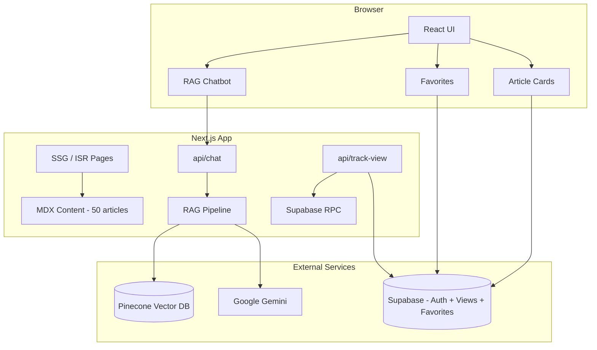
```mermaid
graph TD
    subgraph Browser
        UI[React UI] --> CARDS[Article Cards]
        UI --> CHAT[RAG Chatbot]
        UI --> FAV[Favorites]
    end
    subgraph Next.js App
        SSG[SSG / ISR Pages] --> MDX[MDX Content - 50 articles]
        API_CHAT[api/chat] --> RAG[RAG Pipeline]
        API_VIEW[api/track-view] --> SUPA_RPC[Supabase RPC]
    end
    subgraph External Services
        PINE[(Pinecone Vector DB)]
        GEMINI[Google Gemini]
        SUPA[(Supabase - Auth + Views + Favorites)]
    end
    CHAT --> API_CHAT
    RAG --> PINE
    RAG --> GEMINI
    CARDS --> SUPA
    FAV --> SUPA
    API_VIEW --> SUPA
```

To add more content, simply create new MDX files in the `content` directory and follow the existing structure. The blog is designed to be scalable, maintainable, and extensible, making it a great platform for sharing knowledge and insights within the tech community.

Feel free to contribute your own articles, improve the existing content, or customize the blog to suit your needs. Refer to the [Contributing](#contributing) section for guidelines on how to contribute to this project.

> [!NOTE]
> All articles are written in MDX and stored in the `content` directory. The Next.js app compiles these MDX files into static pages at build time, while also extracting metadata for features like the article list, related posts, and the RAG chatbot. Articles must have substantial content (not just a placeholder) and should include proper headings (`h1`, `h2`, `h3`) + Mermaid diagrams to be considered valid for the main article library.

## Live Application

The blog is deployed on Vercel and can be accessed at **[https://devverse-swe.vercel.app/](https://devverse-swe.vercel.app/).**

Feel free to explore the content and features of the blog!

> [!NOTE]
> The Supabase BaaS might be down sometimes due to inactivity. Please [let me know](mailto:hoangson091104@gmail.com) in that case so that I can get it back up ASAP!

### Landing Page

<p align="center">
  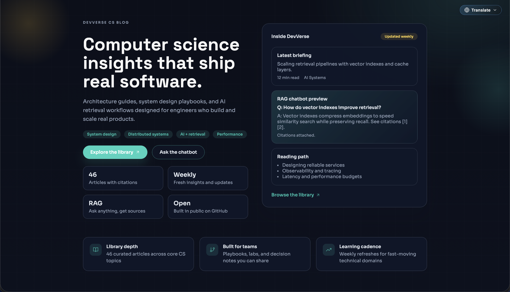
</p>

### Home Page

<p align="center">
  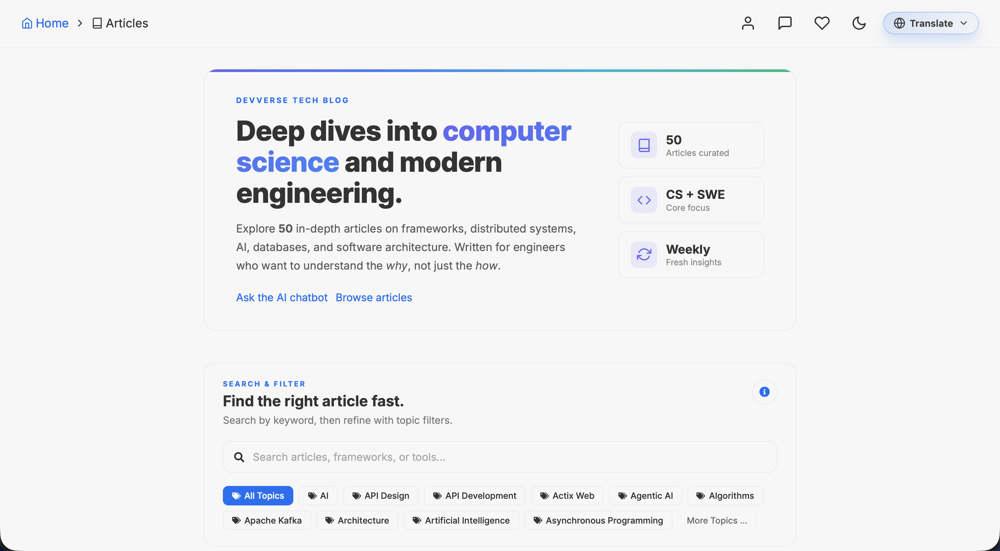
</p>

### Article List

<p align="center">
  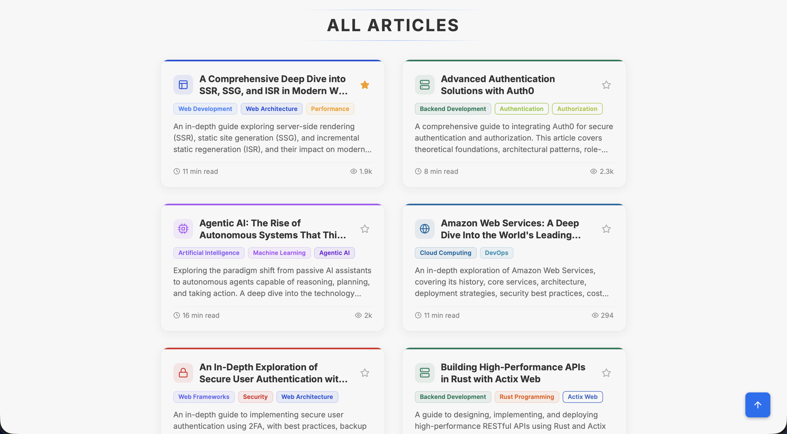
</p>

### Article Page

<p align="center">
  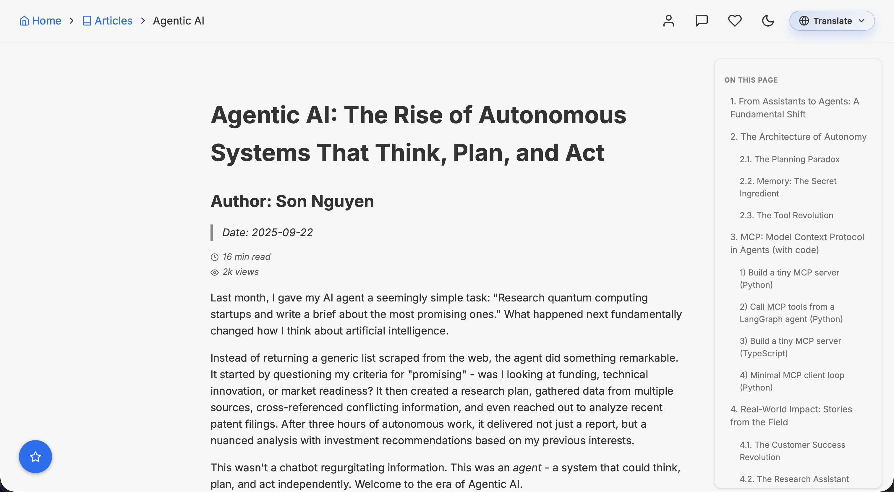
</p>

### Favorites Page

<p align="center">
  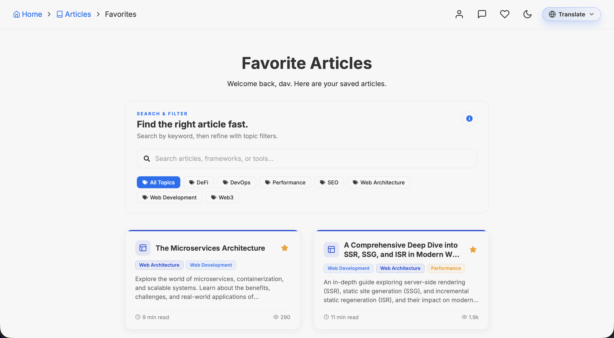
</p>

### Chat Page

<p align="center">
  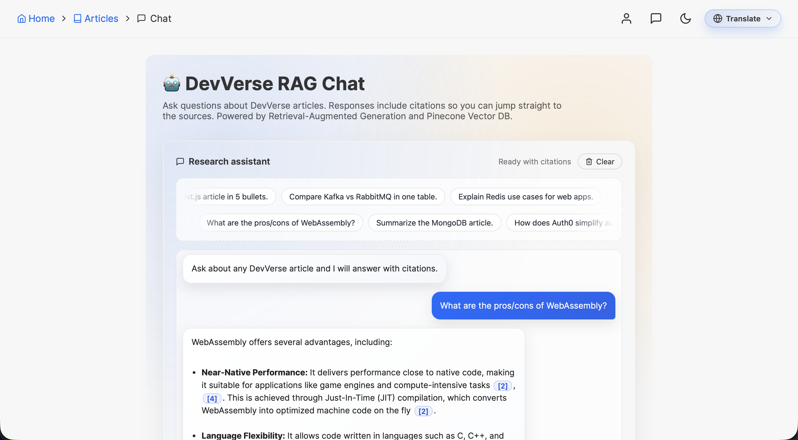
</p>

### Login Page

<p align="center">
  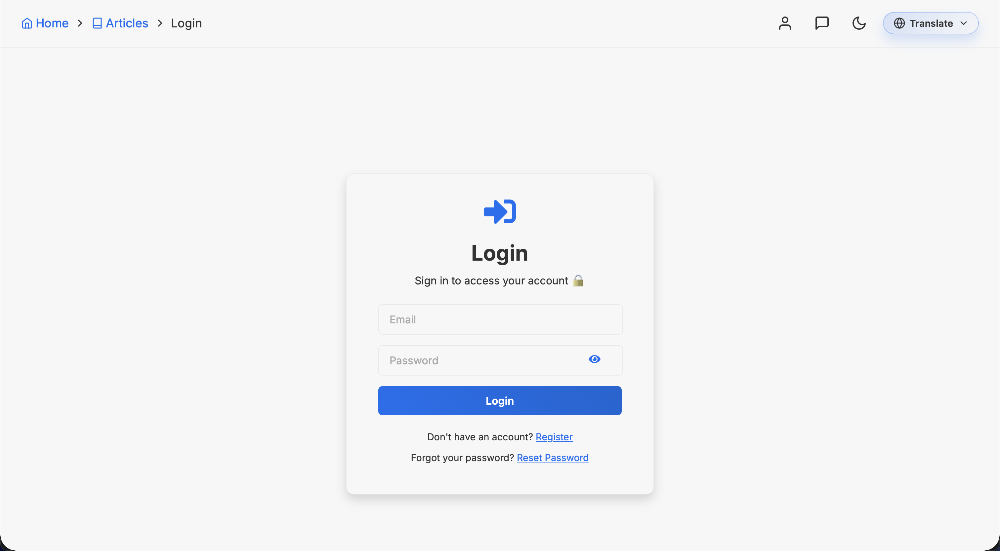
</p>

### Register Page

<p align="center">
  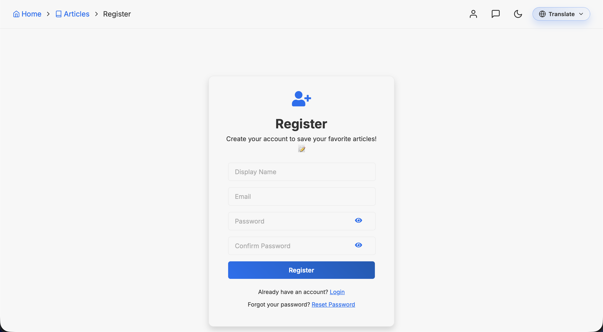
</p>

### Reset Password Page

<p align="center">
  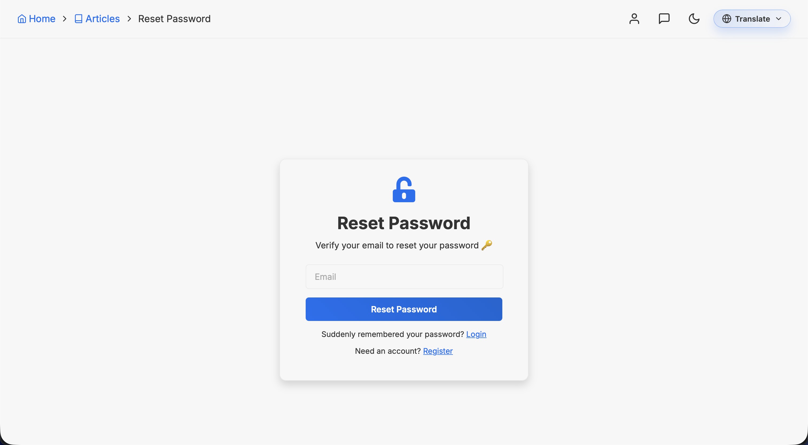
</p>

**and many more pages...**

## Features

DevVerse is packed with modern dev & user-centric features to enhance both the developer and user experience:

### Content & Rendering

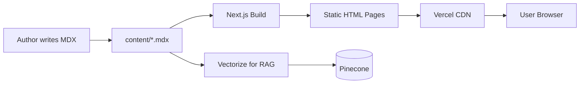
```mermaid
graph LR
    AUTHOR[Author writes MDX] --> CONTENT[content/*.mdx]
    CONTENT --> BUILD[Next.js Build]
    BUILD --> SSG[Static HTML Pages]
    SSG --> CDN[Vercel CDN]
    CDN --> BROWSER[User Browser]
    CONTENT --> VECTOR[Vectorize for RAG]
    VECTOR --> PINE[(Pinecone)]
```

- **50 Comprehensive Articles:** In-depth coverage of computer science and software engineering topics, from agentic AI to zero-trust security.
- **MDX Integration:** Write content in MDX, mixing Markdown with React components for interactive posts.
- **Mermaid Diagram Support:** 600+ Mermaid charts across 50 articles, rendered client-side via the `mermaid` npm package with full dark mode awareness. See [Mermaid Diagram Support](#mermaid-diagram-support).
- **Mathematics Rendering:** Render mathematical equations using [KaTeX](https://katex.org/), [rehype-katex](https://github.com/remarkjs/rehype-katex), and [remark-math](https://github.com/remarkjs/remark-math).
- **Syntax-Highlighted Code Blocks:** Code examples with language-aware syntax highlighting via `react-syntax-highlighter`.
- **Table of Contents:** Auto-generated from `h2` and `h3` headings within each article.
- **SEO Optimization:** Server-side rendering, static generation, meta tags, structured data, and auto-generated sitemaps for improved search engine visibility.
- **RSS & Atom Feeds:** Syndication feeds auto-generated from MDX content for easy subscription.
- **Image Optimization:** Next.js Image component for optimized loading and responsive images.
- **PWA Support:** Offline capabilities and installability via `next-pwa`.
- **Animations:** Smooth page transitions and interactive elements powered by Framer Motion.
- **Dark Mode:** User-toggleable dark mode with a boot script to prevent flash of unstyled content.
- **User Authentication:** Registration, login, password reset, and email verification powered by Supabase Auth.
- **Favorites System:** Users can add articles to their favorites for easy access, with a dedicated favorites page and search/filter support.
- **View Counts:** Supabase-backed view tracking with session-deduplicated counts displayed on article cards and detail pages. See [Article View Counts](#article-view-counts).
- **Responsive Design:** Mobile-friendly layout with a focus on readability and usability across devices.
- **Containerized Development:** Docker and Docker Compose configurations for an isolated development environment, along with VS Code Dev Container support for seamless setup.
- **Linting & Formatting:** ESLint and Prettier configurations for consistent code quality and style across the project.
- **GitHub Actions CI Pipeline:** Automated testing and linting on every push and pull request to maintain code quality.
- **Comprehensive Documentation:** Detailed README with setup instructions, architectural overview, and contribution guidelines.

### AI-Powered Chat

- **RAG Chatbot:** AI-powered chatbot using Pinecone vector database and Google Gemini for embeddings and answer generation. Includes bracket-style citations linking to source articles. See [RAG Chat & Vectorization](#rag-chat--vectorization).
- **Local Fallback:** Lexical search fallback (`lib/rag-local.ts`) when vector search is unavailable.
- **Article Vectorization:** Offline pipeline (`npm run vectorize:articles`) to embed and upsert articles into Pinecone with enriched metadata (author, date, views, reading time).
- **Contextual Answers:** Gemini generates answers with relevant article chunks as context, improving accuracy and relevance.
- **Citation Linking:** Bracket-style citations (e.g., `[1]`) in chat responses link back to source articles for easy reference.
- **Chat History:** Maintains conversation history for more coherent multi-turn interactions.
- **Graceful Degradation:** If RAG components are unavailable (e.g., missing API keys), the chatbot gracefully falls back to a local lexical search method without breaking the UI.

### UI & Navigation

- **Great Landing Page:** Gradient accent hero, two-column layout, stat cards with icons, and CTA buttons for exploring articles or chatting with the AI.
- **Enhanced Article Cards:** Colored accent stripes, topic-specific icons, topic pills, view counts, favorite stars, and reading time -- all visible on every card.
- **Favorites on Cards:** Star icon on every article card (not just the detail page), with portal-based tooltips for logged-in users.
- **Custom Tooltip System:** Styled portal-based tooltips replacing browser defaults, used across the navbar, article cards, and favorite buttons.
- **Enhanced Related Articles:** 6-signal scoring algorithm with "show more" pagination:

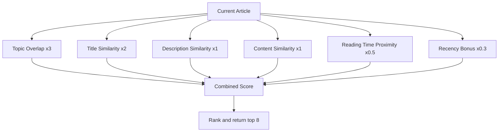
```mermaid
graph TD
    ARTICLE[Current Article] --> T[Topic Overlap x3]
    ARTICLE --> TI[Title Similarity x2]
    ARTICLE --> D[Description Similarity x1]
    ARTICLE --> C[Content Similarity x1]
    ARTICLE --> R[Reading Time Proximity x0.5]
    ARTICLE --> RE[Recency Bonus x0.3]
    T --> SCORE[Combined Score]
    TI --> SCORE
    D --> SCORE
    C --> SCORE
    R --> SCORE
    RE --> SCORE
    SCORE --> RANK[Rank and return top 8]
```
- **Topics Section Redesign:** Tag icon, colored pills with arrow indicators, and click-to-filter navigation to the home page.
- **Breadcrumb Navigation:** Articles link on the chat, favorites, and auth pages for consistent navigation.
- **Enhanced Search & Filtering:** Search bar with cleaner topic pills, available on both the home page and the favorites page.
- **ArticleMeta Component:** Portal-based reading time and view count display rendered right below each article's date line.
- **Google Translate Integration:** Navbar button with a constrained popup for translating the site into 100+ languages.

### Analytics & Tracking

- **Article View Counts:** Supabase-backed view tracking with session-deduplicated counts. Displayed on article cards and article detail pages. See [Article View Counts](#article-view-counts).
- **View Count Tracking API:** `/api/track-view` endpoint that atomically increments view counts via a Supabase RPC function, deduplicated per session via `sessionStorage`.

### Platform & Infrastructure

- **Next.js Framework:** Built with Next.js 15 for robust SSR, SSG, and CSR.
- **Progressive Web App (PWA):** Enhanced offline capabilities with [next-pwa](https://github.com/shadowwalker/next-pwa).
- **Animation:** Smooth animations with [Framer Motion](https://www.framer.com/motion/).
- **Code Splitting & Performance:** Automatic code splitting and image optimization for improved performance.
- **User Authentication:** Secure user authentication with [Supabase Auth](https://supabase.io/docs/guides/auth), including registration, login, password reset, and email verification.
- **User Profiles:** User profile management with avatar upload (authenticated users only).
- **Favorites System:** Add articles to favorites for easy access, with a dedicated favorites page and search/filter support.
- **Containerized Development:** Docker and Docker Compose configurations for an isolated development environment.
- **Dev Containers:** VS Code Dev Container configuration for a seamless setup.
- **Responsive Design:** Mobile-friendly layout with responsive design.
- **Dark Mode:** Toggle between light and dark themes, with a boot script preventing flash of unstyled content:

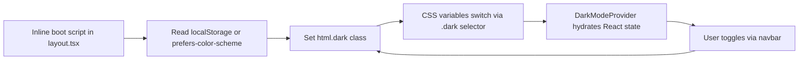
```mermaid
graph LR
    BOOT[Inline boot script in layout.tsx] --> CHECK[Read localStorage or prefers-color-scheme]
    CHECK --> CLASS[Set html.dark class]
    CLASS --> CSS[CSS variables switch via .dark selector]
    CSS --> PROVIDER[DarkModeProvider hydrates React state]
    PROVIDER --> TOGGLE[User toggles via navbar]
    TOGGLE --> CLASS
```
- **SEO-Friendly:** Optimized for search engines with meta tags, structured data, SSR, SSG, and auto-generated sitemaps.
- **RSS, Atom, and JSON Feeds:** Syndication feeds auto-generated from MDX content.
- **Linting & Formatting:** ESLint and Prettier configurations for consistent code quality.

## RAG Chat & Vectorization

DevVerse includes an AI-powered chatbot that lets readers ask questions about any article in the blog.

### How it works

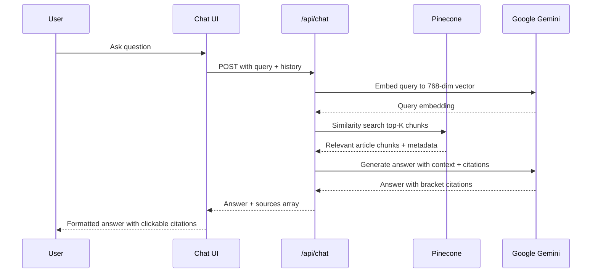
```mermaid
sequenceDiagram
    participant User
    participant ChatUI as Chat UI
    participant API as /api/chat
    participant Pine as Pinecone
    participant Gemini as Google Gemini

    User->>ChatUI: Ask question
    ChatUI->>API: POST with query + history
    API->>Gemini: Embed query to 768-dim vector
    Gemini-->>API: Query embedding
    API->>Pine: Similarity search top-K chunks
    Pine-->>API: Relevant article chunks + metadata
    API->>Gemini: Generate answer with context + citations
    Gemini-->>API: Answer with bracket citations
    API-->>ChatUI: Answer + sources array
    ChatUI-->>User: Formatted answer with clickable citations
```

1. **Vectorization:** The `scripts/vectorize_articles.mjs` script reads all 50 MDX articles, chunks them, generates 768-dimensional embeddings via Google Gemini's embedding model, and upserts them into a Pinecone index (`devverse-articles`). Each vector includes enriched metadata: title, author, date, topics, reading time, and URL.

2. **Retrieval:** When a user asks a question, the `/api/chat` route embeds the query, performs a vector similarity search against the Pinecone index, and retrieves the most relevant article chunks.

3. **Generation:** The retrieved chunks, along with conversation history, are passed to Google Gemini's generative model, which produces an answer with bracket-style citations (e.g., `[1]`, `[2]`).

4. **Citations:** The UI parses the citations and links them to the source articles, displayed as clickable references below each response.

5. **Fallback:** If vector search is unavailable (e.g., missing API keys), a local lexical fallback (`lib/rag-local.ts`) performs TF-IDF-style scoring against the raw MDX files.

### Running the vectorization pipeline

```bash
# Requires PINECONE_API_KEY and GEMINI_API_KEY in .env or .env.local
npm run vectorize:articles
```

This command reads all `.mdx` files in `content/`, chunks and embeds them, and upserts the vectors into Pinecone. Re-run this after adding or modifying articles.

### Required environment variables

```bash
PINECONE_API_KEY=your_pinecone_api_key
GEMINI_API_KEY=your_gemini_api_key
PINECONE_INDEX=devverse-articles        # optional, defaults to "devverse-articles"
```

## Mermaid Diagram Support

All 50 articles include Mermaid diagrams (600+ charts total) to visualize architectures, workflows, data flows, and decision trees. Mermaid charts are rendered client-side using the `mermaid` npm package via a custom `MermaidChart` component (`ui/MermaidChart.tsx`).

### Key features

- **Dark mode aware:** Diagrams automatically switch between the `default` and `dark` Mermaid themes based on the site's dark mode state.
- **Lazy initialization:** The Mermaid library is dynamically imported and initialized only when a diagram is first encountered.
- **Error boundaries:** If a diagram fails to render, a styled error message with the raw source is shown instead of crashing the page.
- **Supported diagram types:** Flowcharts, sequence diagrams, Gantt charts, class diagrams, state diagrams, ER diagrams, pie charts, and more.

### Rendering Pipeline


```mermaid
graph LR
    MDX[MDX Article] --> COMPILER[Next.js MDX Compiler]
    COMPILER --> PRE[pre element with language-mermaid]
    PRE --> INTERCEPT[mdx-components.tsx intercepts]
    INTERCEPT --> MERMAID[MermaidChart Component]
    MERMAID --> IMPORT[Dynamic import mermaid lib]
    IMPORT --> INIT[Initialize with theme - light or dark]
    INIT --> RENDER[mermaid.render produces SVG]
    RENDER --> DOM[Inject SVG into DOM]
```

### Usage in MDX

Mermaid diagrams are written as fenced code blocks with the `mermaid` language tag inside MDX files. The custom MDX components layer (`mdx-components.tsx`) detects the language and renders a `MermaidChart` component instead of a static code block.

## Article View Counts

Each article's view count is tracked via Supabase and displayed on both article cards and article detail pages.

### Architecture

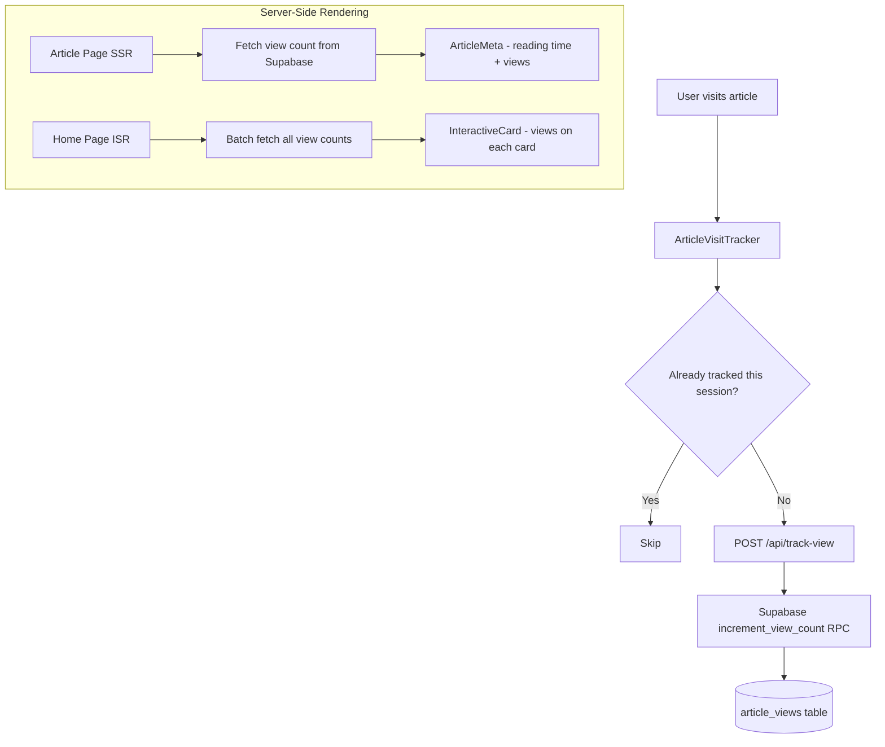
```mermaid
graph TD
    VISIT[User visits article] --> TRACKER[ArticleVisitTracker]
    TRACKER --> DEDUP{Already tracked this session?}
    DEDUP -->|Yes| SKIP[Skip]
    DEDUP -->|No| POST[POST /api/track-view]
    POST --> RPC[Supabase increment_view_count RPC]
    RPC --> DB[(article_views table)]

    subgraph Server-Side Rendering
        PAGE[Article Page SSR] --> FETCH[Fetch view count from Supabase]
        HOME[Home Page ISR] --> BATCH[Batch fetch all view counts]
        FETCH --> META[ArticleMeta - reading time + views]
        BATCH --> CARDS[InteractiveCard - views on each card]
    end
```

- **Database:** An `article_views` table in Supabase stores the `slug`, `view_count`, and `updated_at` for each article. The table is created via `supabase/article_views.sql`, which also includes an `increment_view_count` RPC function for atomic upserts and seed data for all 50 articles.
- **Tracking:** The `ArticleVisitTracker` component fires a `POST /api/track-view` request when a user opens an article. The request is deduplicated per session using `sessionStorage` to avoid inflating counts on page refreshes.
- **Display:** The `ViewCount` component fetches and displays the count on article cards. The `ArticleMeta` component uses a React portal to inject the reading time and view count directly below the article date in the MDX layout.
- **Batch loading:** The home page fetches all view counts in a single query (`getAllViewCounts`) and passes them down to article cards via props.

## Project Structure

```
devverse-cs-swe-blog/
├── app/
│   ├── globals.css                # Global CSS styles and dark mode variables
│   ├── page.tsx                   # Landing page (/)
│   ├── layout.tsx                 # Root layout with dark mode boot script
│   ├── not-found.tsx              # 404 page component
│   ├── home/
│   │   └── page.tsx               # Article index page (/home)
│   ├── chat/
│   │   ├── page.tsx               # RAG chatbot page (/chat)
│   │   └── chat.module.css        # Chat page styles
│   ├── favorites/
│   │   └── page.tsx               # Favorites page (/favorites)
│   ├── api/
│   │   ├── chat/
│   │   │   └── route.ts           # RAG chat API (Pinecone + Gemini)
│   │   ├── track-view/
│   │   │   └── route.ts           # View count increment endpoint
│   │   ├── rss/
│   │   │   └── route.ts           # RSS feed endpoint
│   │   ├── atom/
│   │   │   └── route.ts           # Atom feed endpoint
│   │   ├── reset-password/
│   │   │   └── route.ts           # Password reset API route
│   │   └── verify-email/
│   │       └── route.ts           # Email verification API route
│   ├── auth/
│   │   ├── login/
│   │   │   └── page.tsx           # Login page
│   │   ├── register/
│   │   │   └── page.tsx           # Register page
│   │   └── reset/
│   │       └── page.tsx           # Reset password page
│   ├── articles/[slug]/
│   │   └── page.tsx               # Dynamic article pages
│   └── feed.json/
│       └── route.ts               # JSON feed endpoint
├── components/
│   ├── ArticleContent.tsx         # Article content renderer with MDX
│   ├── ArticleMeta.tsx            # Portal-based reading time + view count below article date
│   ├── ArticlesList.tsx           # Article list with search, filtering, and pagination
│   ├── ArticleVisitTracker.tsx    # Session-deduplicated view tracking component
│   ├── BackToTopButton.tsx        # Scroll-to-top button
│   ├── ConditionalMain.tsx        # Conditional main wrapper
│   ├── ConditionalNavbar.tsx      # Conditional navbar (hidden on landing page)
│   ├── CustomProgressBar.tsx      # Route transition progress bar
│   ├── FavButton.tsx              # Favorite button on article detail pages
│   ├── FavoritesList.tsx          # Favorites list with search and filtering
│   ├── FavStar.tsx                # Star icon on article cards with portal tooltip
│   ├── Footer.tsx                 # Site footer
│   ├── HomePageContent.tsx        # Home page hero, stats, and article grid
│   ├── InteractiveCard.tsx        # Article card with accent stripe, icons, pills, views, star
│   ├── LandingPage.tsx            # Landing page hero with gradient, stats, and CTAs
│   ├── Loading.tsx                # Loading spinner
│   ├── MdxLayout.tsx              # MDX layout wrapper
│   ├── Navbar.tsx                 # Navigation bar with tooltips
│   ├── RelatedPosts.tsx           # 6-signal related articles with show more
│   ├── RouteProgress.tsx          # NProgress route progress bar
│   ├── RSSButton.tsx              # RSS feed button
│   ├── TableOfContents.tsx        # Auto-generated TOC from h2/h3 headings
│   ├── Tooltip.tsx                # Reusable portal-based tooltip component
│   ├── TopicsList.tsx             # Redesigned topics section with colored pills
│   ├── TranslateMenu.tsx          # Google Translate popup trigger
│   ├── TranslateMenuProvider.tsx  # Context provider for translate menu state
│   ├── TriggerReload.tsx          # Reload trigger utility
│   ├── UserMenu.tsx               # User menu dropdown
│   └── ViewCount.tsx              # View count display component for cards
├── ui/
│   ├── CodeBlock.tsx              # Syntax-highlighted code block
│   ├── InlineCode.tsx             # Inline code component
│   ├── MermaidChart.tsx           # Dark-mode-aware Mermaid diagram renderer
│   ├── PreBlock.tsx               # Preformatted block (routes mermaid to MermaidChart)
│   └── InteractiveCard.css        # Card styles
├── lib/
│   ├── articles.ts                # MDX module metadata loader (used by favorites)
│   ├── chat-citations.ts          # Citation parsing/linking for chat UI
│   ├── jsonfeed.ts                # JSON feed generator
│   ├── rag.ts                     # Pinecone + Gemini RAG pipeline
│   ├── rag-local.ts               # Local lexical fallback for chat retrieval
│   └── rss.ts                     # RSS/Atom feed generator and MDX parser
├── supabase/
│   ├── supabaseClient.ts          # Supabase browser client configuration
│   ├── auth.ts                    # Authentication helper functions
│   ├── avatar.ts                  # Avatar upload/download functions
│   ├── favorites.ts               # Favorites CRUD operations
│   ├── profile.ts                 # Profile management functions
│   ├── views.ts                   # View count queries (single, batch, all)
│   ├── article_views.sql          # View count table, RPC function, and seed data
│   ├── articles.sql               # Articles table schema
│   ├── favorites.sql              # Favorites table schema
│   ├── profiles.sql               # Profiles table schema
│   └── devverse_full_schema.sql   # Complete database schema reference
├── scripts/
│   ├── vectorize_articles.mjs     # Pinecone vectorization pipeline
│   ├── generate_sitemap.js        # Sitemap generator
│   └── check_content_contract.py  # MDX content contract validator
├── utils/
│   └── getAllPosts.js             # Function to fetch all MDX posts
├── provider/
│   └── DarkModeProvider.tsx       # Dark mode context with delayed render
├── content/                       # 50 MDX articles (canonical content source)
├── public/                        # Static files (images, fonts, PWA manifest, etc.)
├── images/                        # Screenshots for README
├── tests/                         # Jest test suite
├── mocks/                         # Jest mocks
├── .devcontainer/
│   └── devcontainer.json          # VS Code Dev Container configuration
├── Dockerfile                     # Docker image configuration
├── docker-compose.yml             # Docker Compose for containerized development
├── package.json                   # Project manifest with scripts and dependencies
├── tsconfig.json                  # TypeScript configuration
├── next.config.mjs                # Next.js configuration with MDX, KaTeX, and GFM plugins
├── next-sitemap.config.js         # Sitemap generation configuration
├── mdx-components.tsx             # Custom MDX components (routes mermaid to MermaidChart)
├── tailwind.config.js             # Tailwind CSS configuration
├── jest.config.js                 # Jest configuration
├── babel.jest.js                  # Babel configuration for Jest
└── (... and more)
```

## Prerequisites

- [Node.js](https://nodejs.org/) (v18 or higher recommended)
- [npm](https://www.npmjs.com/)
- [Docker](https://www.docker.com/) & [Docker Compose](https://docs.docker.com/compose/) (for containerized development)
- [Visual Studio Code](https://code.visualstudio.com/) (optional, for using Dev Containers)

## Getting Started

### Local Development

1. **Clone the Repository:**

   ```bash
   git clone https://github.com/hoangsonww/DevVerse-SWE-Blog.git
   cd DevVerse-CS-SWE-Blog
   ```

2. **Install Dependencies:**

   ```bash
   npm install
   ```

3. **Set Up Environment Variables:**

   Create a `.env.local` file in the root directory. See [Environment Variables](#environment-variables) for the full list.

4. **Run the Development Server:**

   ```bash
   npm run dev
   ```

   Open [http://localhost:3000](http://localhost:3000) in your browser to view the app.

### Environment Variables

Create a `.env` or `.env.local` file in the project root with the following variables:

```bash
# Supabase (required for auth, favorites, view counts)
NEXT_PUBLIC_SUPABASE_URL=your_supabase_url
NEXT_PUBLIC_SUPABASE_ANON_KEY=your_supabase_anon_key
SUPABASE_SERVICE_ROLE_KEY=your_supabase_service_role_key

# RAG Chat (required for AI chatbot)
PINECONE_API_KEY=your_pinecone_api_key
GEMINI_API_KEY=your_gemini_api_key
PINECONE_INDEX=devverse-articles

# Site URL (used by feeds and local RAG)
NEXT_PUBLIC_SITE_URL=https://devverse-swe.vercel.app
SITE_URL=https://devverse-swe.vercel.app
```

> [!NOTE]
> The app runs without the RAG environment variables -- the chatbot will gracefully fall back to local lexical search. Supabase variables are needed for auth, favorites, and view tracking.

### Docker & Docker Compose

A `docker-compose.yml` file is provided to facilitate containerized development.

1. **Build and Start the Container:**

   ```bash
   docker-compose up
   ```

2. **Access the App:**

   The application will be available at [http://localhost:3000](http://localhost:3000).

### Using VS Code Dev Containers

If you use Visual Studio Code, you can open the project in a Dev Container:

1. Install the [Remote - Containers extension](https://marketplace.visualstudio.com/items?itemName=ms-vscode-remote.remote-containers).
2. Open the Command Palette (`Ctrl+Shift+P` or `Cmd+Shift+P` on macOS) and select **"Remote-Containers: Reopen in Container"**.
3. VS Code will build and attach to the container using the configuration in `.devcontainer/devcontainer.json`.

## Available Scripts

- **`npm run dev`** -- Runs the Next.js development server.
- **`npm run build`** -- Builds the application for production (also generates the sitemap via `postbuild`).
- **`npm run start`** -- Starts the production server.
- **`npm run vectorize:articles`** -- Runs the Pinecone vectorization pipeline to embed and upsert all MDX articles. Requires `PINECONE_API_KEY` and `GEMINI_API_KEY`.
- **`npm run format`** -- Runs Prettier in write mode across all source files.
- **`npm run lint`** -- Alias for `npm run format` (runs Prettier, not ESLint).
- **`npm run test`** -- Runs the Jest test suite.
- **`npm run test:watch`** -- Runs Jest in watch mode.
- **`npm run coverage`** -- Runs Jest with coverage reporting.

## Dependencies

### Core Framework

- **Next.js (v15):** The core framework powering the application with SSR, SSG, and App Router.
- **React & React-Dom:** Essential libraries for building user interfaces.
- **TypeScript:** Static typing for robust development.

### Content & Rendering

- **@mdx-js/loader & @mdx-js/react:** Tools for integrating MDX content with React.
- **mermaid:** Client-side rendering of Mermaid diagrams (flowcharts, sequence diagrams, etc.).
- **KaTeX, rehype-katex, remark-math:** Enable mathematical rendering within MDX content.
- **remark-gfm:** Adds support for GitHub Flavored Markdown (tables, strikethrough, etc.).
- **react-syntax-highlighter:** Syntax highlighting for code blocks.
- **react-markdown:** Markdown rendering for chat responses.

### AI & Vector Search

- **@pinecone-database/pinecone:** Pinecone vector database client for RAG retrieval.
- **@google/generative-ai:** Google Gemini client for embeddings and generative responses.

### Backend & Auth

- **@supabase/supabase-js:** Supabase client for authentication, database, and storage.

### UI & Interaction

- **Tailwind CSS:** Utility-first CSS framework for styling.
- **Framer Motion:** Smooth page transitions and component animations.
- **react-icons:** Icon library (Feather, Font Awesome, etc.).
- **react-toastify:** Toast notifications.
- **lucide-react:** Additional icon set.
- **nprogress:** Progress bar for route transitions.

### Feeds & SEO

- **rss:** RSS feed generation.
- **next-pwa:** Progressive web app capabilities.
- **next-sitemap:** Automatic sitemap generation.
- **@vercel/analytics:** Vercel analytics integration.

## Dev Dependencies

- **TypeScript & @types/node:** Enable static typing for robust development.
- **@types/react & @types/react-dom:** Type definitions for React.
- **@types/nprogress:** Type definitions for nprogress.
- **@types/react-syntax-highlighter:** Type definitions for syntax highlighter.
- **@types/rss:** Type definitions for RSS.
- **Jest & babel-jest & ts-jest:** Testing framework with Babel and TypeScript support.
- **@babel/core, @babel/preset-env, @babel/preset-typescript:** Babel toolchain for Jest.

## Backend (Supabase)

The blog uses [Supabase](https://supabase.io/) for user authentication, file storage, database services, and article view tracking. To set up the backend services, follow these steps:

1. **Create a Supabase Account:**

   Sign up for a free account on [Supabase](https://supabase.io/).

2. **Create a New Project:**

    Create a new project in the Supabase dashboard.

3. **Set Up Authentication:**

    Enable authentication in the project settings.

4. **Create a `.env` (or `.env.local`) File:**

    Create a `.env` (or `.env.local`) file in the root directory of the project with the following environment variables:

    ```bash
    NEXT_PUBLIC_SUPABASE_URL=YOUR_SUPABASE_URL
    NEXT_PUBLIC_SUPABASE_ANON_KEY=YOUR_SUPABASE_ANON_KEY
    SUPABASE_SERVICE_ROLE_KEY=YOUR_SUPABASE_SERVICE_ROLE_KEY
    ```

    Replace `YOUR_SUPABASE_URL` and `YOUR_SUPABASE_ANON_KEY` with your Supabase project URL and anonymous key, respectively. Also, replace `YOUR_SUPABASE_SERVICE_ROLE_KEY` with your Supabase service role key, obtained from the project settings.

5. **Set Up Database:**

    Create the necessary tables in the Supabase dashboard by running the following SQL. You can also find individual migration files in the `supabase/` directory.

    ```sql
    -- Core tables
    CREATE TABLE IF NOT EXISTS articles (
      id UUID PRIMARY KEY DEFAULT uuid_generate_v4(),
      title TEXT NOT NULL,
      slug TEXT NOT NULL,
      content TEXT NOT NULL,
      author TEXT NOT NULL,
      created_at TIMESTAMPTZ DEFAULT now()
    );

    CREATE TABLE IF NOT EXISTS profiles (
      id UUID PRIMARY KEY
      REFERENCES auth.users(id) ON DELETE CASCADE,
      avatar_url TEXT,
      updated_at TIMESTAMPTZ DEFAULT now()
    );

    CREATE TABLE IF NOT EXISTS favorite_articles (
      id SERIAL PRIMARY KEY,
      user_id UUID
      REFERENCES auth.users(id) ON DELETE CASCADE,
      article_slug TEXT NOT NULL,
      created_at TIMESTAMPTZ DEFAULT now(),
      UNIQUE (user_id, article_slug)
    );

    -- Article view counts (see supabase/article_views.sql for full migration with RPC + seed)
    CREATE TABLE IF NOT EXISTS article_views (
      slug        TEXT PRIMARY KEY,
      view_count  BIGINT NOT NULL DEFAULT 0,
      updated_at  TIMESTAMPTZ NOT NULL DEFAULT now()
    );
    ```

    For the complete view count setup including the atomic increment RPC function and seed data for all 50 articles, run the full `supabase/article_views.sql` migration in the SQL editor. For a more complex and full-fledged schema, visit `supabase/devverse_full_schema.sql`.

6. **Set Up Storage:**

    Enable storage in the project settings to store images and other files.

7. **Set Up User Roles:**

    Create a new service role in the project settings with the following permissions:

    - `articles: select, insert, update, delete`
    - `storage: create, read, update, delete`
    - `article_views: select, insert, update`

    This role will be used to access the articles, storage, and view count services from the blog.

    Or, for development purposes, you can use the `public` role with the same permissions, or just allow all permissions for simplicity (not recommended for production).

8. **Run the Application:**

    Start the development server using `npm run dev` and test the user authentication, article services, and view tracking.

### Available Next.js API Routes

The Next.js API routes are as follows:

- **`/api/chat`**
  - **Method:** POST
  - **Body:** `{ message: string, history?: Array<{ role: "user" | "assistant", content: string }> }`
  - **Description:** RAG chatbot endpoint. Embeds the user query, retrieves relevant article chunks from Pinecone, and generates an answer with citations using Google Gemini. Falls back to local lexical search when vector search is unavailable.

- **`/api/track-view`**
  - **Method:** POST
  - **Body:** `{ slug: string }`
  - **Description:** Atomically increments the view count for an article via a Supabase RPC function. Called by the `ArticleVisitTracker` component, which deduplicates per session using `sessionStorage`.

- **`/api/reset-password`**
  - **Method:** POST
  - **Body:** `{ email: string, password: string }`
  - **Description:** Resets the user's password without sending a confirmation email. This bypasses the default Supabase flow for development convenience.

- **`/api/verify-email`**
  - **Method:** POST
  - **Body:** `{ email: string }`
  - **Description:** Verifies the user's email address. Used as the first step in the password reset flow.

- **`/api/rss`**
  - **Method:** GET
  - **Description:** Returns the RSS 2.0 feed generated from all MDX articles.

- **`/api/atom`**
  - **Method:** GET
  - **Description:** Returns the Atom feed generated from all MDX articles.

- **`/feed.json`**
  - **Method:** GET
  - **Description:** Returns the JSON Feed generated from all MDX articles.

The password reset flow is: First, call `/api/verify-email` to verify the user's email address exists. Then, call `/api/reset-password` to reset the user's password associated with that email address.

All other routes are standard Supabase routes for user authentication and profile/favorites management.

## Docker & Dev Container Configuration

### Dockerfile

```Dockerfile
FROM node:18-bullseye-slim
WORKDIR /app
COPY package*.json ./
RUN npm install
COPY . .
EXPOSE 3000
CMD ["npm", "run", "dev"]
```

### docker-compose.yml

```yaml
version: '3.8'

services:
  app:
    build:
      context: .
      dockerfile: Dockerfile
    ports:
      - "3000:3000"
    volumes:
      - .:/app:cached
    command: npm run dev
    environment:
      - NODE_ENV=development
```

### .devcontainer/devcontainer.json

```json
{
  "name": "devverse-cs-swe-blog",
  "build": {
    "dockerfile": "Dockerfile",
    "context": ".."
  },
  "settings": {
    "terminal.integrated.shell.linux": "/bin/bash",
    "editor.formatOnSave": true
  },
  "extensions": [
    "dbaeumer.vscode-eslint",
    "esbenp.prettier-vscode",
    "ms-vscode.vscode-typescript-next",
    "eamodio.gitlens"
  ],
  "postCreateCommand": "npm install",
  "remoteUser": "node",
  "forwardPorts": [3000]
}
```

## Testing

This project uses [Jest](https://jestjs.io/) for testing. The test suite covers API routes, content parsing, citation logic, and utility functions.

```bash
# Run all tests
npm run test

# Run tests in watch mode
npm run test:watch

# Run tests with coverage
npm run coverage
```

For constrained environments (CI, low-memory), use:

```bash
env JEST_USE_WATCHMAN=0 npm test -- --runInBand --watchman=false
```

Test files are located in the `tests/` directory:

- `articles.spec.js` -- Article metadata and loading
- `getAllPosts.spec.js` -- Post fetching utility
- `reset-password.spec.js` -- Password reset API
- `verify-user.spec.js` -- Email verification API
- `rag-local.spec.js` -- Local RAG fallback logic
- `chat-citations.spec.js` -- Citation parsing and linking

## RSS and Atom and JSON Feeds

The blog supports RSS, Atom, and JSON feeds for syndication. You can access the feeds at the following URLs:

- RSS: `/api/rss` (e.g., https://devverse-swe.vercel.app/api/rss)
- Atom: `/api/atom` (e.g., https://devverse-swe.vercel.app/api/atom)
- JSON: `/feed.json` (e.g., https://devverse-swe.vercel.app/feed.json)

These feeds are automatically generated based on the MDX content in the `content` directory. You can subscribe to the feeds using your favorite feed reader to stay updated with the latest articles.

## GitHub Actions CI Pipeline

This project includes a GitHub Actions CI pipeline to ensure code quality and consistency. The pipeline runs the following checks on every push and pull request:

- **Linting:** Runs ESLint to check for code quality and style issues.
- **Testing:** Runs Jest tests to ensure the application behaves as expected.
- **Type Checking:** Runs TypeScript type checking to catch type errors.
- **Build:** Builds the Next.js application to ensure it compiles correctly.
- **Docker Build:** Builds the Docker image to ensure it can be built successfully.
- **Docker Image Push:** Pushes the Docker image to the GitHub Container Registry.
- **Deployment:** Deploys the application to Vercel if all checks pass.
- **Sitemap Generation:** Generates a sitemap for the application.
- and more...

You can view the CI pipeline in the [Actions tab](https://github.com/hoangsonww/DevVerse-SWE-Blog/actions). Click on any workflow run to see the details of the checks performed (and the cool charts and graphs!).

<p align="center">
  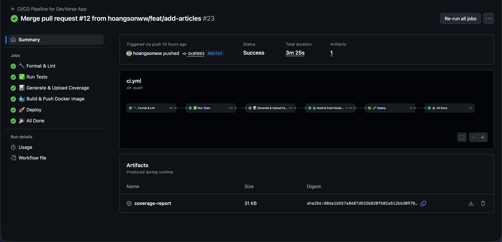
</p>

## Contributing

Contributions are welcome! Please follow these guidelines when contributing:

1. Fork the repository and create your feature branch (`git checkout -b feature/your-feature`).
2. Commit your changes (`git commit -m 'Add some feature'`).
3. Push your branch (`git push origin feature/your-feature`).
4. Open a pull request with a detailed description of your changes.

Ensure that your code adheres to our coding standards and includes tests where applicable.

### Add more MDX content

To add more MDX content, create a new `.mdx` file in the `content` directory. Each article should follow this structure:

```mdx
export const metadata = {
  title: "Your Article Title",
  description: "A brief description of the article.",
  topics: ["Topic1", "Topic2", "Topic3"],
};

# Your Article Title

### Author: Your Name

> Date: YYYY-MM-DD

Article content here...

## Section Heading

Content with Mermaid diagrams:

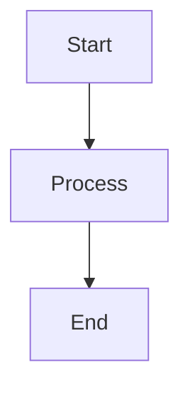
```mermaid
graph TD
    A[Start] --> B[Process]
    B --> C[End]
```

After adding or modifying articles, consider re-running `npm run vectorize:articles` to update the Pinecone index for the RAG chatbot.

We welcome contributions that expand the content and cover a wide range of topics in computer science and software engineering! I hope this project can serve as a platform for sharing knowledge and insights within the tech community.

### Requirements for new articles

**All new articles must have:**
- Substantial original content (at least 1000 words)
- Proper metadata (title, description, topics)
- Relevant topics and tags for discoverability
- Accurate reading time estimation
- Proper formatting and structure (headings, lists, etc.)
- Relevant and high-quality content that provides value to readers interested in computer science and software engineering topics.
- Clear writing and formatting examples, diagrams, and practical insights are highly encouraged to maintain the quality and value of the blog.
- Adherence to the existing content style and structure for consistency.
- At least 5 Mermaid charts + several blocks of code snippets to illustrate concepts and provide visual explanations.
- A unique slug generated from the title (e.g., "my-new-article" for "My New Article") for URL routing.
- Proper attribution for any external sources or references used in the article.
- Compliance with the project's code of conduct and contribution guidelines.
- Can be AI-assisted but must include substantial human-written content and insights to ensure originality and value for readers.
- All contributions will be reviewed by the maintainers to ensure they meet the quality standards and align with the blog's focus on computer science and software engineering topics.

## License

This project is licensed under the [MIT License](LICENSE).

## Further Reading

- **Next.js Documentation:** [https://nextjs.org/docs](https://nextjs.org/docs)
- **MDX Documentation:** [https://mdxjs.com/](https://mdxjs.com/)
- **Supabase Documentation:** [https://supabase.io/docs](https://supabase.io/docs)
- **Pinecone Documentation:** [https://docs.pinecone.io/](https://docs.pinecone.io/)
- **Google Gemini API:** [https://ai.google.dev/](https://ai.google.dev/)
- **Mermaid Documentation:** [https://mermaid.js.org/](https://mermaid.js.org/)
- **Docker Documentation:** [https://docs.docker.com/](https://docs.docker.com/)
- **VS Code Dev Containers:** [https://code.visualstudio.com/docs/remote/containers](https://code.visualstudio.com/docs/remote/containers)

Reach out to me at [@hoangsonww](https://github.com/hoangsonww) for any questions or feedback. I'd love to hear from you!

---

*This project is powered by Next.js and serves as a testament to the framework's capabilities in building modern, scalable, and high-performance web applications. Happy coding!*

[Back to top](#devverse-computer-science--software-engineering-blog)
