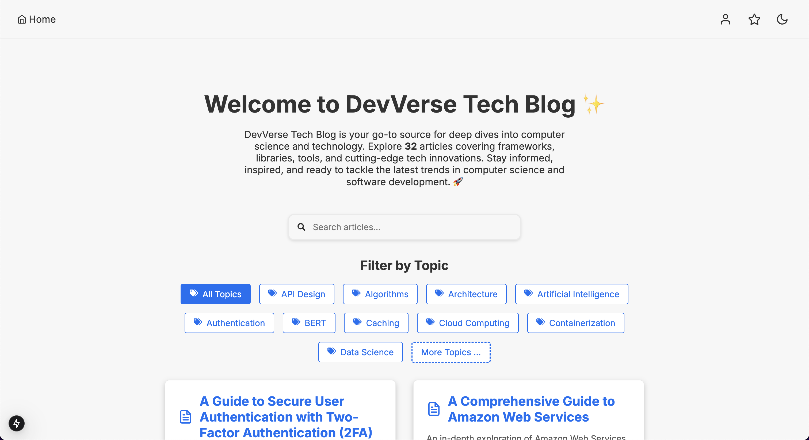

# DevVerse Computer Science & Software Engineering Blog

A modern, high-performance full-stack app built with [Next.js](https://nextjs.org/), leveraging MDX for content, PWA capabilities, and a rich ecosystem of libraries including Supabase, Framer Motion, KaTeX, and more. This project is designed for scalability, maintainability, and an excellent developer experience.

<p align="center">
  <strong>Visit DevVerse:</strong><br/>
  <a href="https://devverse-swe.vercel.app" target="_blank" rel="noopener">
    
  </a>
</p>

<div align="center">
  
  
  
  
  
  
  
  
  
  
  
  
  
  
  
</div>

## Table of Contents

- [Overview](#overview)
- [Live Application](#live-application)
- [Features](#features)
- [Project Structure](#project-structure)
- [Prerequisites](#prerequisites)
- [Getting Started](#getting-started)
  - [Local Development](#local-development)
  - [Docker & Docker Compose](#docker--docker-compose)
  - [Using VS Code Dev Containers](#using-vs-code-dev-containers)
- [Available Scripts](#available-scripts)
- [Dependencies](#dependencies)
- [Dev Dependencies](#dev-dependencies)
- [Backend (Supabase)](#backend-supabase)
  - [Available Next.js API Routes](#available-nextjs-api-routes)
- [Docker & Dev Container Configuration](#docker--dev-container-configuration)
- [Contributing](#contributing)
  - [Add more MDX content](#add-more-mdx-content)
- [License](#license)
- [Further Reading](#further-reading)

## Overview

This repository hosts a Next.js-based blog that uses MDX to write rich, interactive content. The app combines server-side rendering, static site generation, and client-side rendering to deliver fast and SEO-friendly pages. It also includes modern features such as PWA support, image optimization, and seamless animations using Framer Motion.

The blog covers a wide range of topics in computer science and software engineering, providing educational content, tutorials, and insights for developers of all levels. The content is written in MDX, allowing for a mix of Markdown and React components to create engaging posts. Additionally, this architecture also allows for easy addition or modification of content without compromising performance or modifying any code.

To add more content, we can simply create new MDX files in the `content` directory, following the existing structure. The blog is designed to be scalable, maintainable, and extensible, making it a great platform for sharing knowledge and insights within the tech community.

Feel free to contribute your own articles, improve the existing content, or customize the blog to suit your needs. Let's build a vibrant community around computer science and software engineering! Refer to the [Contributing](#contributing) section for guidelines on how to contribute to this project.

## Live Application

The blog is deployed on Vercel and can be accessed at [https://devverse-swe.vercel.app/](https://devverse-swe.vercel.app/).

The backup deployment is available on Netlify at [https://devverse-swe.netlify.app](https://devverse-swe.netlify.app).

Feel free to explore the content and features of the blog! 🚀

### Home Page

<p align="center">
  
</p>

### Home Page - Dark Mode

<p align="center">
  
</p>

### Article Page

<p align="center">
  
</p>

### Favorites Page

<p align="center">
  
</p>

**and many more pages...**

## Features

- **Next.js Framework:** Built with Next.js for robust SSR, SSG, and CSR.
- **MDX Integration:** Write content in MDX, mixing Markdown with React components.
- **Progressive Web App (PWA):** Enhanced offline capabilities with [next-pwa](https://github.com/shadowwalker/next-pwa).
- **Animation:** Smooth animations with [Framer Motion](https://www.framer.com/motion/).
- **Mathematics Rendering:** Render mathematical equations using [KaTeX](https://katex.org/), [rehype-katex](https://github.com/remarkjs/rehype-katex), and [remark-math](https://github.com/remarkjs/remark-math).
- **Code Splitting & Performance:** Automatic code splitting and image optimization for improved performance.
- **Containerized Development:** Docker and Docker Compose configurations for an isolated development environment.
- **Dev Containers:** VS Code Dev Container configuration for a seamless setup.
- **User Authentication:** User authentication with JWT tokens.
- **User Registration/Sign-In:** User registration and sign-in functionality.
- **Favorites:** Add articles to favorites for easy access (authenticated users only).
- **Responsive Design:** Mobile-friendly layout with responsive design.
- **Dark Mode:** Toggle between light and dark themes.
- **SEO-Friendly:** Optimized for search engines with meta tags and structured data, with SSR and SSG.
- **Linting & Formatting:** ESLint and Prettier configurations for consistent code quality.

## Project Structure

```
devverse-cs-swe-blog/
├── app/
│   ├── globals.css         # Global CSS styles
│   ├── page.tsx            # Main page component
│   ├── layout.tsx          # Layout component
│   ├── not-found.tsx       # 404 page component
│   ├── favorites/
│   │   ├── page.tsx        # Favorites page component
│   ├── api/
│   │   ├── reset-password/ 
│   │   │   ├── route.ts    # Reset password API route
│   │   ├── favorites/
│   │   │   ├── route.ts    # Favorites API route
│   ├── auth/
│   │   ├── login/
│   │   │   ├── page.tsx    # Login page component
│   │   ├── register/
│   │   │   ├── page.tsx    # Register page component
│   │   ├── reset/
│   │   │   ├── page.tsx    # Reset password page component
│   └── articles/[slug]
│       └── page.tsx        # Dynamic topic pages
├── components/             # Reusable React components
│   ├── ArticleList.tsx     # Component for displaying a list of articles
│   ├── ArticleContent.tsx  # Article content component
│   ├── FavoritesList.tsx   # Component for displaying a list of favorite articles
│   ├── FavButton.tsx       # Favorite button component
│   ├── Footer.tsx          # Footer component
│   ├── HomePageContent.tsx # Home page content component
│   ├── Navbar.tsx          # Navbar component
│   ├── InteractiveCard.tsx # Interactive card component
│   ├── Loading.tsx         # Loading spinner component
│   ├── MdxLayout.tsx       # Layout component for MDX content
│   ├── (...)               # Other components
│   └── RouteProgress.tsx   # Route progress bar component
├── utils/                  # Utility functions and constants
│   └── getAllPosts.js      # Function to fetch all MDX posts
├── ui/                     # UI components and styles
│   ├── CodeBlock.tsx       # Code block component
│   ├── InlineCode.tsx      # Inline code component
│   └── PreBlock.tsx        # Preformatted block component
├── supabase/               # Supabase client configuration and queries
│   ├── supabaseClient.ts   # Supabase client configuration
│   ├── auth.ts             # Authentication functions
│   ├── avatar.ts           # Avatar functions
│   ├── favorites.ts        # Favorites functions
│   ├── profile.ts          # Profile functions
│   └── (other sql files for database setup)
├── public/                 # Static files (images, fonts, etc.)
├── content/                # MDX content for blog posts
├── .devcontainer/          # VS Code Dev Container configuration
│   └── devcontainer.json
├── images/                 # Images for README
├── Dockerfile              # Docker image configuration for the app
├── docker-compose.yml      # Docker Compose file for containerized development
├── package.json            # Project manifest with scripts and dependencies
├── tsconfig.json           # TypeScript configuration
├── next.config.js          # Next.js configuration
├── next-sitemap.config.js  # Next.js sitemap configuration
├── mdx-components.tsx      # Custom MDX components
├── tailwind.config.js      # Tailwind CSS configuration
├── README.md               # This documentation file
└── (... and more)
```

## Prerequisites

- [Node.js](https://nodejs.org/) (v14 or higher recommended)
- [npm](https://www.npmjs.com/)
- [Docker](https://www.docker.com/) & [Docker Compose](https://docs.docker.com/compose/) (for containerized development)
- [Visual Studio Code](https://code.visualstudio.com/) (optional, for using Dev Containers)

## Getting Started

### Local Development

1. **Clone the Repository:**

   ```bash
   git clone https://github.com/hoangsonww/DevVerse-SWE-Blog.git
   cd DevVerse-CS-SWE-Blog
   ```

2. **Install Dependencies:**

   ```bash
   npm install
   ```

3. **Run the Development Server:**

   ```bash
   npm run dev
   ```

   Open [http://localhost:3000](http://localhost:3000) in your browser to view the app.

### Docker & Docker Compose

A `docker-compose.yml` file is provided to facilitate containerized development.

1. **Build and Start the Container:**

   ```bash
   docker-compose up
   ```

2. **Access the App:**

   The application will be available at [http://localhost:3000](http://localhost:3000).

### Using VS Code Dev Containers

If you use Visual Studio Code, you can open the project in a Dev Container:

1. Install the [Remote - Containers extension](https://marketplace.visualstudio.com/items?itemName=ms-vscode-remote.remote-containers).
2. Open the Command Palette (`Ctrl+Shift+P` or `Cmd+Shift+P` on macOS) and select **"Remote-Containers: Reopen in Container"**.
3. VS Code will build and attach to the container using the configuration in `.devcontainer/devcontainer.json`.

## Available Scripts

- **`npm run dev`**  
  Runs the Next.js development server.

- **`npm run build`**  
  Builds the application for production.

- **`npm run start`**  
  Starts the production server.

## Dependencies

- **Next.js:** The core framework powering the application.
- **Tailwind CSS:** Utility-first CSS framework for styling.
- **@supabase/supabase-js:** Supabase client for user authentication.
- **React & React-Dom:** Essential libraries for building user interfaces.
- **@mdx-js/loader & @mdx-js/react:** Tools for integrating MDX content with React.
- **next-pwa:** Adds progressive web app capabilities.
- **Framer Motion:** Provides smooth animations.
- **KaTeX, rehype-katex, remark-math:** Enable mathematical rendering within MDX content.
- **nprogress:** A progress bar for route transitions.
- **remark-gfm:** Adds support for GitHub Flavored Markdown.
- **and more...**

## Dev Dependencies

- **TypeScript & @types/node:** Enable static typing for robust development.
- **@types/nprogress:** Provides type definitions for nprogress.
- **@types/react & @types/react-dom:** Type definitions for React.
- **@types/tailwindcss:** Type definitions for Tailwind CSS.
- **and more...**

## Backend (Supabase)

The blog uses [Supabase](https://supabase.io/) for user authentication, file storage, and database services. To set up the backend services, follow these steps:

1. **Create a Supabase Account:**

   Sign up for a free account on [Supabase](https://supabase.io/).

2. **Create a New Project:**

    Create a new project in the Supabase dashboard.

3. **Set Up Authentication:**

    Enable authentication in the project settings.

4. **Create a `.env` (or `.env.local`) File:**

    Create a `.env` (or `.env.local`) file in the root directory of the project with the following environment variables:

    ```bash
    NEXT_PUBLIC_SUPABASE_URL=YOUR_SUPABASE_URL
    NEXT_PUBLIC_SUPABASE_ANON_KEY=YOUR_SUPABASE_ANON_KEY
    SUPABASE_SERVICE_ROLE_KEY=YOUR_SUPABASE_SERVICE_ROLE_KEY
    ```

    Replace `YOUR_SUPABASE_URL` and `YOUR_SUPABASE_ANON_KEY` with your Supabase project URL and anonymous key, respectively. Also, replace `YOUR_SUPABASE_SERVICE_ROLE_KEY` with your Supabase service role key, obtained from the project settings.

5. **Set Up Database:**

    Create 3 new tables in the Supabase dashboard with the following schema:

    ```sql
    CREATE TABLE IF NOT EXISTS articles (
      id UUID PRIMARY KEY DEFAULT uuid_generate_v4(),
      title TEXT NOT NULL,
      slug TEXT NOT NULL,
      content TEXT NOT NULL,
      author TEXT NOT NULL,
      created_at TIMESTAMPTZ DEFAULT now()
    );

    CREATE TABLE IF NOT EXISTS profiles (
      id UUID PRIMARY KEY
      REFERENCES auth.users(id) ON DELETE CASCADE,
      avatar_url TEXT,
      updated_at TIMESTAMPTZ DEFAULT now()
    );

    CREATE TABLE IF NOT EXISTS favorite_articles (
      id SERIAL PRIMARY KEY,
      user_id UUID
      REFERENCES auth.users(id) ON DELETE CASCADE,
      article_slug TEXT NOT NULL,
      created_at TIMESTAMPTZ DEFAULT now(),
      UNIQUE (user_id, article_slug)
    );
    ```

    You may copy the above SQL queries and run them in the SQL editor in the Supabase dashboard. This will create the necessary tables for the bare-bones blog. For a more complex and full-fledged blog, visit the `supabase/` directory for more SQL files & queries.

6. **Set Up Storage:**

    Enable storage in the project settings to store images and other files.

7. **Set Up User Roles:**

    Create a new service role in the project settings with the following permissions:

    - `articles: select, insert, update, delete`
    - `storage: create, read, update, delete`

    This role will be used to access the articles and storage services from the blog.

    Or, for development purposes, you can use the `public` role with the same permissions, or just allow all permissions for simplicity (not recommended for production).

8. **Run the Application:**

    Start the development server using `npm run dev` and test the user authentication and article services.

### Available Next.js API Routes

Because, in order to reset password with Supabase, it requires sending a confirmation email to the user, which is not implemented in this project since it requires setting up a custom SMTP server.

However, for an application this size, I overrode the default Supabase reset password API route to allow users to reset their password without the need for a confirmation email. This is not recommended for production applications, but it is a quick and easy way to test the reset password functionality.

The Next.js API routes are as follows:

- **`/api/reset-password`**  
  - **Method:** POST
  - **Body:** `{ email: string, password: string }`
  - **Description:** Resets the user's password without sending a confirmation email.

- **`/api/verify-email`**  
  - **Method:** POST
  - **Body:** `{ email: string }`
  - **Description:** Verifies the user's email address.

The flow is: First, call the `/api/verify-email` route to verify the user's email address. Then, call the `/api/reset-password` route to reset the user's password associated with that email address.

All other routes are standard Supabase routes for user authentication and profile/favorites management.

## Docker & Dev Container Configuration

### Dockerfile

```Dockerfile
FROM node:18-bullseye-slim
WORKDIR /app
COPY package*.json ./
RUN npm install
COPY . .
EXPOSE 3000
CMD ["npm", "run", "dev"]
```

### docker-compose.yml

```yaml
version: '3.8'

services:
  app:
    build:
      context: .
      dockerfile: Dockerfile
    ports:
      - "3000:3000"
    volumes:
      - .:/app:cached
    command: npm run dev
    environment:
      - NODE_ENV=development
```

### .devcontainer/devcontainer.json

```json
{
  "name": "devverse-cs-swe-blog",
  "build": {
    "dockerfile": "Dockerfile",
    "context": ".."
  },
  "settings": {
    "terminal.integrated.shell.linux": "/bin/bash",
    "editor.formatOnSave": true
  },
  "extensions": [
    "dbaeumer.vscode-eslint",
    "esbenp.prettier-vscode",
    "ms-vscode.vscode-typescript-next",
    "eamodio.gitlens"
  ],
  "postCreateCommand": "npm install",
  "remoteUser": "node",
  "forwardPorts": [3000]
}
```

## Contributing

Contributions are welcome! Please follow these guidelines when contributing:

1. Fork the repository and create your feature branch (`git checkout -b feature/your-feature`).
2. Commit your changes (`git commit -m 'Add some feature'`).
3. Push your branch (`git push origin feature/your-feature`).
4. Open a pull request with a detailed description of your changes.

Ensure that your code adheres to our coding standards and includes tests where applicable.

### Add more MDX content

To add more MDX content, create a new `.mdx` file in the `content` directory. You can use the existing files as a template.

We welcome contributions that expand the content and cover a wide range of topics in computer science and software engineering! I hope this project can serve as a platform for sharing knowledge and insights within the tech community.

## License

This project is licensed under the [MIT License](LICENSE).

## Further Reading and Resources

- **Next.js Documentation:** [https://nextjs.org/docs](https://nextjs.org/docs)
- **MDX Documentation:** [https://mdxjs.com/](https://mdxjs.com/)
- **Supabase Documentation:** [https://supabase.io/docs](https://supabase.io/docs)
- **Next.js Blog:** Explore real-world examples and case studies on the official Next.js blog.
- **Docker Documentation:** [https://docs.docker.com/](https://docs.docker.com/)
- **VS Code Dev Containers:** [https://code.visualstudio.com/docs/remote/containers](https://code.visualstudio.com/docs/remote/containers)

Reach out to me at [@hoangsonww](https://github.com/hoangsonww) for any questions or feedback. I'd love to hear from you!

---

*This project is powered by Next.js and serves as a testament to the framework's capabilities in building modern, scalable, and high-performance web applications. Happy coding!* 🚀

[🔝 Back to top](#devverse-computer-science--software-engineering-blog)
