import MdxLayout from "@/components/MdxLayout";

export const metadata = {
  title:
    "An In-Depth Exploration of Secure User Authentication with Two-Factor Authentication (2FA)",
  description:
    "An in-depth guide to implementing secure user authentication using 2FA, with best practices, backup options, advanced security considerations, and more.",
  topics: [
    "Web Frameworks",
    "Security",
    "Web Architecture",
    "User Authentication",
    "Web Development",
  ],
};

export default function AuthenticationArticle({ children }) {
  return <MdxLayout>{children}</MdxLayout>;
}

# A Guide to Secure User Authentication with Two-Factor Authentication

### Author: Son Nguyen

> Date: 2024-12-31

In today’s digital era, protecting user accounts has never been more critical. With sophisticated cyber attacks on the rise, relying solely on passwords for authentication is no longer sufficient. Two-Factor Authentication (2FA) introduces an additional layer of security by requiring users to provide a second verification factor, drastically reducing the risk of unauthorized access - even if passwords are compromised. In this extensive guide, we’ll dive into the inner workings of 2FA, provide detailed implementation examples with code for both backend and frontend systems, and discuss best practices to ensure robust security and a smooth user experience.

---

## 1. Introduction to Two-Factor Authentication (2FA)

Two-Factor Authentication enhances traditional authentication by combining two independent credentials:

- **Something You Know:** Your password or PIN.
- **Something You Have:** A mobile device, hardware token, or an authenticator app that generates time-based one-time passwords (TOTP).
- **(Optionally) Something You Are:** Biometrics, such as fingerprints or facial recognition.

This multi-factor approach creates an additional barrier against cyber attacks like phishing, brute-force, or credential stuffing. Even if a malicious actor obtains a user’s password, the absence of the second factor renders the stolen credentials useless.

The following diagram shows a typical 2FA login flow:

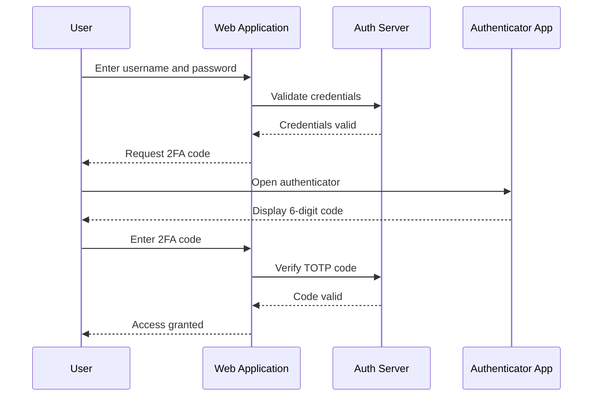

---

## 2. Understanding 2FA and Its Benefits

### 2.1 Why 2FA is Essential

- **Mitigates Risks:** A compromised password does not automatically lead to an account breach.
- **Regulatory Compliance:** Many industries now mandate multi-factor authentication.
- **User Confidence:** Enhances trust by showing commitment to security.

### 2.2 Types of 2FA Methods

1. **TOTP (Time-based One-Time Passwords):**

- Generated by apps like Google Authenticator or Authy.
- Changes every 30 seconds.

2. **SMS-Based Verification:**

- A code is sent to the user’s mobile via SMS.
- Easier to implement, but susceptible to SIM-swapping attacks.

3. **Push Notification-Based Authentication:**

- The user receives a push notification on a registered mobile app and approves the login attempt.

4. **Hardware Tokens:**

- Physical devices (e.g., YubiKey) that generate or transmit one-time codes.

5. **Biometrics:**

- Uses fingerprints, facial recognition, or iris scanning as the second factor.

This guide will focus on a popular and secure method: TOTP-based 2FA.

The following diagram compares the security level and implementation complexity of each 2FA method:

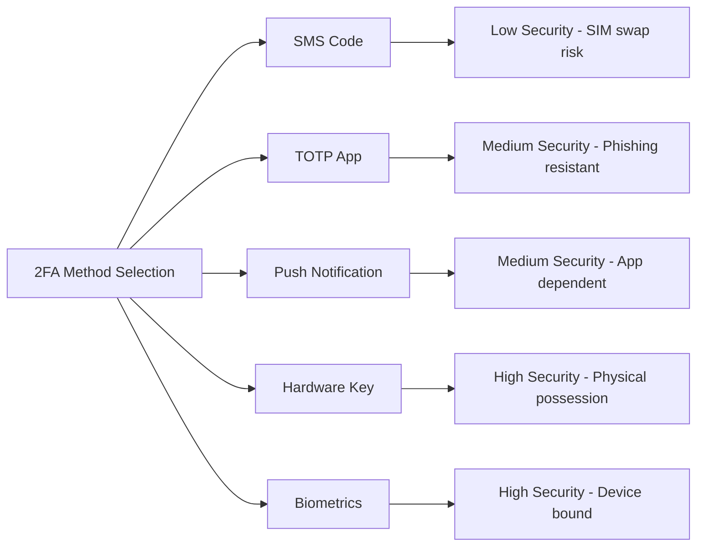

---

## 3. Architectural Overview of a 2FA System

A typical 2FA system involves both backend and frontend components:

- **Backend:**
- **User Enrollment:** Generating and storing a secret key per user.
- **QR Code Generation:** To help users easily set up their authenticator app.
- **Verification Endpoints:** To validate the TOTP entered by the user.
- **Backup and Recovery:** Generating backup codes and handling device loss.

- **Frontend:**
- **Enrollment UI:** Displaying QR codes and instructions.
- **Verification UI:** A user-friendly form for entering TOTP codes.
- **Error Handling:** Providing feedback on invalid tokens or expired codes.

The 2FA enrollment state machine shows the transitions a user goes through when enabling 2FA:

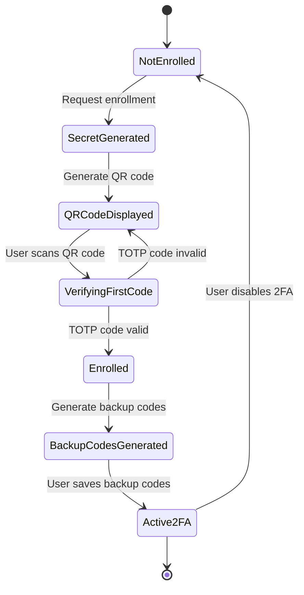

Below, we detail the implementation with comprehensive code examples.

---

## 4. Backend Implementation with Node.js and Express

### 4.1 Setting Up TOTP with Speakeasy and QR Code Generation

We’ll use the popular [speakeasy](https://github.com/speakeasyjs/speakeasy) library for TOTP generation and verification, along with [qrcode](https://github.com/soldair/node-qrcode) to generate QR codes for easy enrollment.

#### 4.1.1 Installation

```bash
npm install express speakeasy qrcode body-parser
```

#### 4.1.2 Code: Enroll and Verify 2FA

```javascript
// server.js
const express = require("express");
const bodyParser = require("body-parser");
const speakeasy = require("speakeasy");
const qrcode = require("qrcode");

const app = express();
app.use(bodyParser.json());

// Simulated user database
const users = {}; // In production, use a proper database

// Endpoint to enroll user in 2FA
app.post("/api/enroll-2fa", (req, res) => {
  const { userId } = req.body;
  if (!userId) return res.status(400).json({ error: "Missing userId" });

  // Generate a secret key for TOTP
  const secret = speakeasy.generateSecret({
    length: 20,
    name: `MyApp (${userId})`,
  });
  users[userId] = { secret: secret.base32, is2FAEnabled: false };

  // Generate QR code for the secret (otpauth URL)
  qrcode.toDataURL(secret.otpauth_url, (err, data_url) => {
    if (err)
      return res.status(500).json({ error: "Failed to generate QR code" });
    res.json({ userId, qrCode: data_url, secret: secret.base32 });
  });
});

// Endpoint to verify TOTP code during enrollment or login
app.post("/api/verify-2fa", (req, res) => {
  const { userId, token } = req.body;
  if (!userId || !token)
    return res.status(400).json({ error: "Missing parameters" });

  const user = users[userId];
  if (!user) return res.status(404).json({ error: "User not found" });

  const verified = speakeasy.totp.verify({
    secret: user.secret,
    encoding: "base32",
    token,
    window: 1, // Allows a 30-second grace period
  });

  if (verified) {
    // Mark 2FA as enabled upon successful verification
    users[userId].is2FAEnabled = true;
    res.json({ success: true, message: "2FA verified successfully." });
  } else {
    res
      .status(401)
      .json({ success: false, message: "Invalid or expired token." });
  }
});

// Endpoint to generate backup codes (example implementation)
app.post("/api/generate-backup-codes", (req, res) => {
  const { userId } = req.body;
  if (!userId) return res.status(400).json({ error: "Missing userId" });

  // Generate an array of random backup codes
  const backupCodes = Array.from({ length: 5 }, () =>
    Math.random().toString(36).substring(2, 10).toUpperCase(),
  );
  // In production, store encrypted backup codes associated with the user
  users[userId].backupCodes = backupCodes;
  res.json({ userId, backupCodes });
});

// Start the server
const PORT = process.env.PORT || 3001;
app.listen(PORT, () => {
  console.log(`2FA server listening on port ${PORT}`);
});
```

### 4.2 Securing Your Endpoints

- **Rate Limiting:** Use libraries like `express-rate-limit` to prevent brute-force attacks.
- **HTTPS:** Ensure all communications are secured with HTTPS.
- **Environment Variables:** Store secrets and sensitive configurations securely.

---

## 5. Frontend Implementation with React

### 5.1 2FA Enrollment Component

This component displays a QR code for users to scan with an authenticator app.

```jsx
import React, { useState } from "react";
import axios from "axios";

export default function TwoFactorEnrollment({ userId }) {
  const [qrCode, setQrCode] = useState("");
  const [secret, setSecret] = useState("");
  const [error, setError] = useState("");
  const [verified, setVerified] = useState(false);
  const [token, setToken] = useState("");

  const enroll2FA = async () => {
    try {
      const response = await axios.post("/api/enroll-2fa", { userId });
      setQrCode(response.data.qrCode);
      setSecret(response.data.secret);
    } catch (err) {
      setError("Failed to enroll in 2FA. Please try again.");
    }
  };

  const verify2FA = async () => {
    try {
      const response = await axios.post("/api/verify-2fa", { userId, token });
      if (response.data.success) {
        setVerified(true);
      }
    } catch (err) {
      setError("Verification failed. Please check your token.");
    }
  };

  return (
    <div>
      <h2>Two-Factor Authentication Enrollment</h2>
      {!qrCode ? (
        <button onClick={enroll2FA}>Enable 2FA</button>
      ) : (
        <div>
          <p>Scan the QR code with your authenticator app:</p>
          
          <p>
            If you cannot scan, use this secret: <code>{secret}</code>
          </p>
          <div style={{ marginTop: "1rem" }}>
            <input
              type="text"
              placeholder="Enter the code from your app"
              value={token}
              onChange={(e) => setToken(e.target.value)}
              style={{ padding: "0.5rem", fontSize: "1rem" }}
            />
            <button
              onClick={verify2FA}
              style={{ marginLeft: "1rem", padding: "0.5rem 1rem" }}
            >
              Verify
            </button>
          </div>
        </div>
      )}
      {verified && (
        <p style={{ color: "green" }}>2FA is now enabled on your account!</p>
      )}
      {error && <p style={{ color: "red" }}>{error}</p>}
    </div>
  );
}
```

### 5.2 2FA Verification During Login

For users who already have 2FA enabled, prompt them to enter their TOTP code on login.

```jsx
import React, { useState } from "react";
import axios from "axios";

export default function TwoFactorVerification({ userId, onSuccess }) {
  const [token, setToken] = useState("");
  const [error, setError] = useState("");

  const verifyCode = async () => {
    try {
      const response = await axios.post("/api/verify-2fa", { userId, token });
      if (response.data.success) {
        onSuccess();
      }
    } catch (err) {
      setError("Invalid token. Please try again.");
    }
  };

  return (
    <div>
      <h2>Enter Your 2FA Code</h2>
      <input
        type="text"
        placeholder="2FA Code"
        value={token}
        onChange={(e) => setToken(e.target.value)}
        style={{ padding: "0.5rem", fontSize: "1rem" }}
      />
      <button
        onClick={verifyCode}
        style={{ marginLeft: "1rem", padding: "0.5rem 1rem" }}
      >
        Verify
      </button>
      {error && <p style={{ color: "red" }}>{error}</p>}
    </div>
  );
}
```

---

## 6. Best Practices for Secure 2FA Implementation

### 6.1 Secure Storage and Transmission

- **Store Secrets Securely:** Never expose your TOTP secret keys in client-side code. Save them securely on the server using encryption.
- **HTTPS Everywhere:** Ensure that all API requests are made over HTTPS to protect data in transit.

### 6.2 Backup and Recovery

- **Backup Codes:** Generate a set of one-time backup codes that users can store securely in case they lose access to their primary 2FA device.
- **Recovery Process:** Implement a robust recovery process that verifies the user's identity before disabling 2FA.

The backup code recovery flow shows how a user regains access when their primary 2FA device is unavailable:

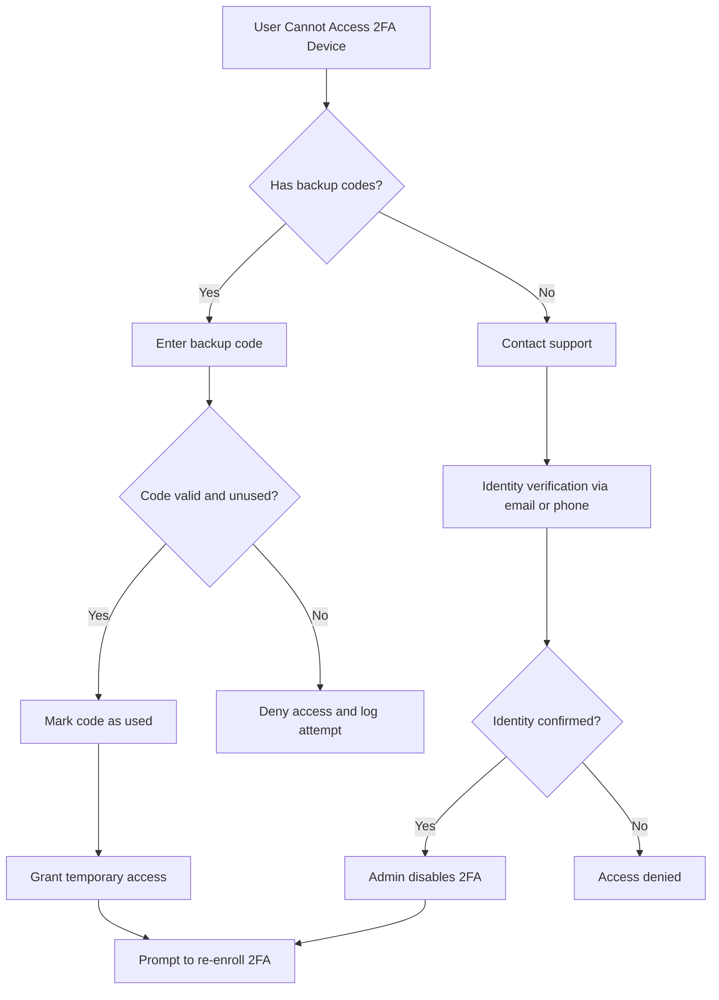

#### Example: Generating Backup Codes (Server-Side)

```javascript
// This snippet was included earlier in the /api/generate-backup-codes endpoint.
// Example function for generating backup codes:
function generateBackupCodes(count = 5) {
  return Array.from({ length: count }, () =>
    Math.random().toString(36).substring(2, 10).toUpperCase(),
  );
}
```

### 6.3 Rate Limiting and Monitoring

- **Rate Limit Verification Attempts:** Use middleware like `express-rate-limit` to block excessive failed verification attempts.
- **Audit Logs:** Maintain detailed logs of 2FA enrollment and verification events for security audits and anomaly detection.

### 6.4 User Experience Considerations

- **Clear Instructions:** Educate users on how to set up and use 2FA.
- **Graceful Fallbacks:** Provide alternative methods (backup codes or support channels) in case users lose access to their 2FA device.
- **Responsive Design:** Ensure the 2FA UI works seamlessly across different devices and screen sizes.

---

## 7. Advanced Topics

### 7.1 Push Notification-Based 2FA

While this guide focuses on TOTP, push notifications provide a modern alternative:

- **Workflow:** A push notification is sent to a user’s mobile app, and the user simply approves the login attempt.
- **Implementation:** Requires a dedicated mobile app and integration with services like Firebase Cloud Messaging (FCM).

The following sequence diagram shows how TOTP codes are generated using a shared secret and a time window:

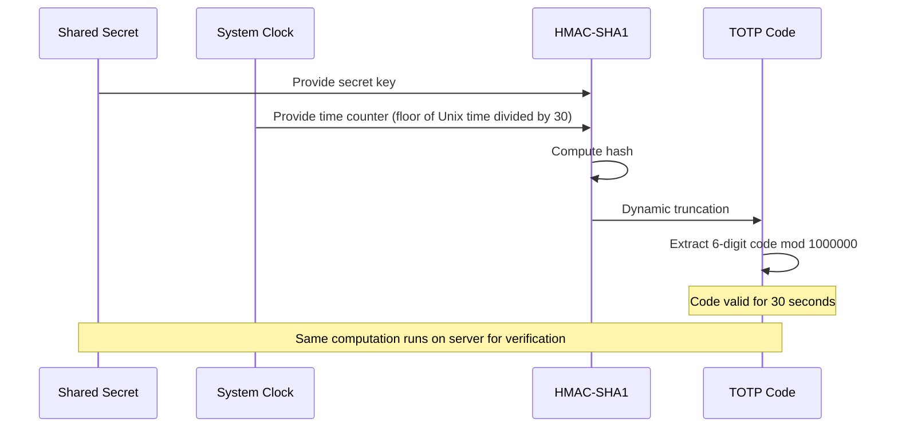

### 7.2 Hardware Tokens and Biometric Integration

For environments demanding the highest security:

- **Hardware Tokens:** Devices like YubiKey offer physical security keys for authentication.
- **Biometrics:** Modern devices support fingerprint or facial recognition as part of the 2FA process, though privacy and fallback mechanisms must be carefully considered.

---

## 8. WebAuthn and Passkeys

WebAuthn (Web Authentication) is a W3C standard that enables passwordless authentication using public-key cryptography. The user's private key never leaves their device - a passkey stored in a platform authenticator (Touch ID, Face ID, Windows Hello) or hardware key (YubiKey) signs a server challenge.

### 8.1 Why Passkeys Are Phishing-Resistant

Traditional TOTP codes can be intercepted by real-time phishing proxies. WebAuthn signatures are cryptographically bound to the origin (`rpId`), so a challenge signed for `bank.com` is invalid at `bank-phish.com`.

### 8.2 Registration Flow

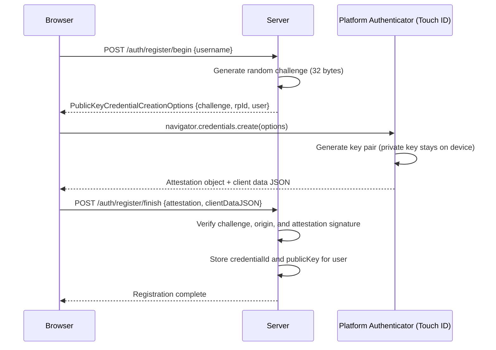

### 8.3 Server-Side WebAuthn with SimpleWebAuthn (Node.js)

```javascript
const {
  generateRegistrationOptions,
  verifyRegistrationResponse,
  generateAuthenticationOptions,
  verifyAuthenticationResponse,
} = require("@simplewebauthn/server");

const RP_NAME = "My App";
const RP_ID = "example.com"; // Must match the domain serving the app
const ORIGIN = `https://${RP_ID}`;

// Registration: Step 1 - generate options for the browser
app.post("/auth/register/begin", async (req, res) => {
  const { username } = req.body;
  const user = await getUserByUsername(username);

  const options = await generateRegistrationOptions({
    rpName: RP_NAME,
    rpID: RP_ID,
    userID: user.id,
    userName: user.email,
    userDisplayName: user.name,
    attestationType: "none",
    authenticatorSelection: {
      residentKey: "preferred", // Create a discoverable credential
      userVerification: "preferred", // Require biometric or PIN
    },
    excludeCredentials: user.credentials.map((cred) => ({
      id: cred.credentialID,
      type: "public-key",
    })),
  });

  // Store challenge temporarily in session (expires in 60 seconds)
  req.session.registrationChallenge = options.challenge;
  res.json(options);
});

// Registration: Step 2 - verify the authenticator response
app.post("/auth/register/finish", async (req, res) => {
  const { username, attestationResponse } = req.body;
  const user = await getUserByUsername(username);

  const verification = await verifyRegistrationResponse({
    response: attestationResponse,
    expectedChallenge: req.session.registrationChallenge,
    expectedOrigin: ORIGIN,
    expectedRPID: RP_ID,
  });

  if (!verification.verified) {
    return res.status(400).json({ error: "Registration verification failed" });
  }

  const { credentialID, credentialPublicKey, counter } =
    verification.registrationInfo;

  // Persist credential alongside the user record
  await saveCredential(user.id, {
    credentialID: Buffer.from(credentialID),
    credentialPublicKey: Buffer.from(credentialPublicKey),
    counter,
    transports: attestationResponse.response.transports ?? [],
  });

  delete req.session.registrationChallenge;
  res.json({ verified: true });
});
```

### 8.4 Authentication Flow with an Existing Passkey

```javascript
// Authentication: Step 1 - generate challenge
app.post("/auth/login/begin", async (req, res) => {
  const { username } = req.body;
  const user = await getUserByUsername(username);

  const options = await generateAuthenticationOptions({
    rpID: RP_ID,
    userVerification: "preferred",
    allowCredentials: user.credentials.map((cred) => ({
      id: cred.credentialID,
      type: "public-key",
      transports: cred.transports,
    })),
  });

  req.session.authChallenge = options.challenge;
  res.json(options);
});

// Authentication: Step 2 - verify signature
app.post("/auth/login/finish", async (req, res) => {
  const { username, assertionResponse } = req.body;
  const user = await getUserByUsername(username);
  const credential = user.credentials.find(
    (c) => c.credentialID.toString("base64url") === assertionResponse.id,
  );

  const verification = await verifyAuthenticationResponse({
    response: assertionResponse,
    expectedChallenge: req.session.authChallenge,
    expectedOrigin: ORIGIN,
    expectedRPID: RP_ID,
    authenticator: {
      credentialID: credential.credentialID,
      credentialPublicKey: credential.credentialPublicKey,
      counter: credential.counter,
      transports: credential.transports,
    },
  });

  if (!verification.verified) {
    return res.status(401).json({ error: "Authentication failed" });
  }

  // Update the counter to prevent replay attacks
  await updateCredentialCounter(
    credential.credentialID,
    verification.authenticationInfo.newCounter,
  );

  delete req.session.authChallenge;
  req.session.userId = user.id;
  res.json({ verified: true });
});
```

---

User-facing 2FA with TOTP or passkeys does not translate directly to service-to-service APIs. For APIs, the equivalent security posture uses mTLS, short-lived tokens, and IP allowlisting.

### 8.5. Short-Lived JWT with Rotating Refresh Tokens

```javascript
const jwt = require("jsonwebtoken");
const crypto = require("crypto");

const ACCESS_TOKEN_TTL = "15m"; // Very short-lived
const REFRESH_TOKEN_TTL_DAYS = 7;

function issueTokenPair(userId) {
  const accessToken = jwt.sign(
    { sub: userId, type: "access" },
    process.env.JWT_ACCESS_SECRET,
    { expiresIn: ACCESS_TOKEN_TTL, algorithm: "RS256" },
  );

  // Refresh token is a random opaque string; map to userId in DB
  const refreshToken = crypto.randomBytes(48).toString("base64url");
  const expiresAt = new Date(Date.now() + REFRESH_TOKEN_DAYS * 86400000);

  return { accessToken, refreshToken, expiresAt };
}

app.post("/auth/token/refresh", async (req, res) => {
  const { refreshToken } = req.body;
  const stored = await db.refreshTokens.findOne({
    token: refreshToken,
    revoked: false,
  });

  if (!stored || stored.expiresAt < new Date()) {
    return res.status(401).json({ error: "Invalid or expired refresh token" });
  }

  // Rotate: revoke old token, issue new pair (refresh token rotation)
  await db.refreshTokens.updateOne(
    { _id: stored._id },
    { $set: { revoked: true } },
  );
  const newPair = issueTokenPair(stored.userId);
  await db.refreshTokens.insertOne({
    token: newPair.refreshToken,
    userId: stored.userId,
    expiresAt: newPair.expiresAt,
    revoked: false,
  });

  res.json({
    accessToken: newPair.accessToken,
    refreshToken: newPair.refreshToken,
  });
});
```

The following diagram shows the full API authentication flow, including token rotation and the gateway's rate-limiting and IP-allowlist enforcement:

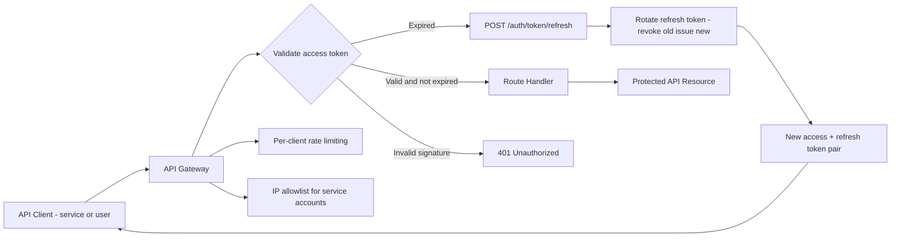

---

Organizations handling sensitive user data must align their authentication systems with regulatory frameworks.

### 8.6. SOC 2 Type II MFA Requirements

SOC 2 Trust Service Criteria CC6.1 and CC6.8 require:

- **All privileged accounts** (admin, infrastructure, CI/CD pipelines) must use MFA.
- MFA must be enforced at the identity provider level, not just the application layer, to prevent bypass via password reset flows.
- Evidence of MFA enforcement must be continuously collected for the audit period (typically 6 or 12 months).

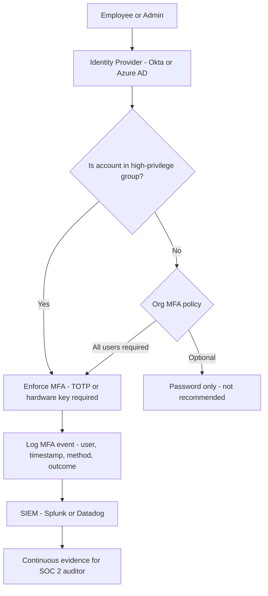

### 8.7. HIPAA Authentication Controls

HIPAA Security Rule (45 CFR 164.312) specifies:

- **164.312(d) - Person or Entity Authentication:** Verify the identity of any person seeking access to ePHI.
- **164.312(a)(2)(iii) - Automatic Logoff:** Sessions must time out after a period of inactivity (typically 15 minutes for clinical systems).
- **164.312(b) - Audit Controls:** Log all access to ePHI, including authentication events, login failures, and session terminations.

Implementation checklist for HIPAA-compliant 2FA:

- Enforce 2FA for all staff accessing ePHI - no exceptions for convenience.
- Hardware tokens (FIDO2/WebAuthn) are preferred over SMS for covered entities after NIST SP 800-63B guidance.
- Store authentication logs for a minimum of 6 years.
- Implement automatic session revocation when a user's role changes or employment is terminated.

The controls required by each framework map to a common set of FIDO2-based implementations:

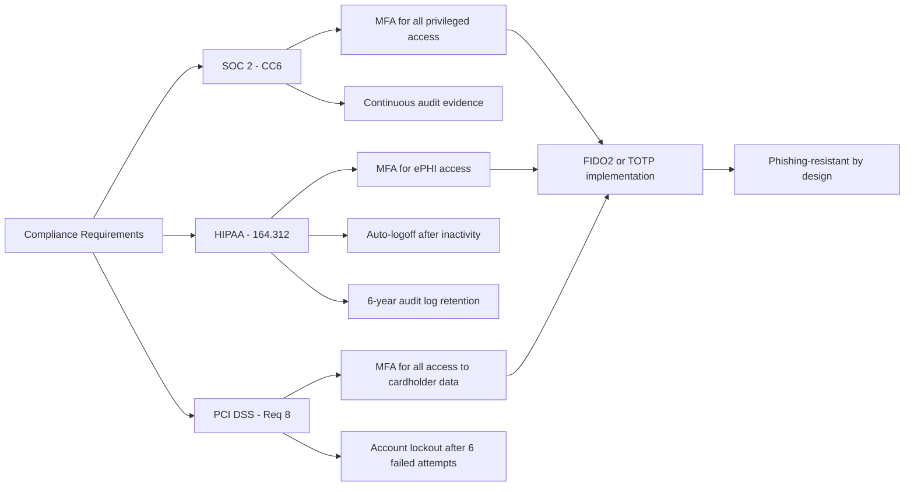

---

## 9. Rate Limiting and Brute-Force Protection

Every 2FA endpoint must be guarded against brute-force and enumeration attacks. The following diagram shows the layered defense strategy:

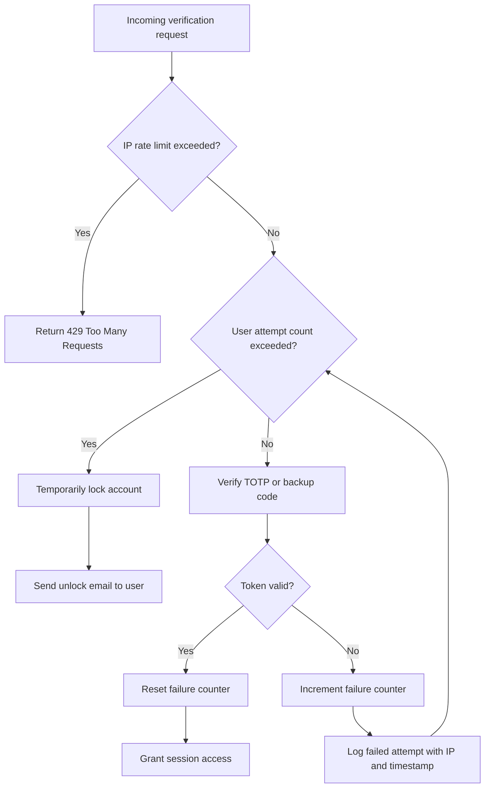

---

## 10. 2FA Token Lifecycle

A TOTP token is valid for a narrow time window. The diagram below shows the full lifecycle from generation to expiry:

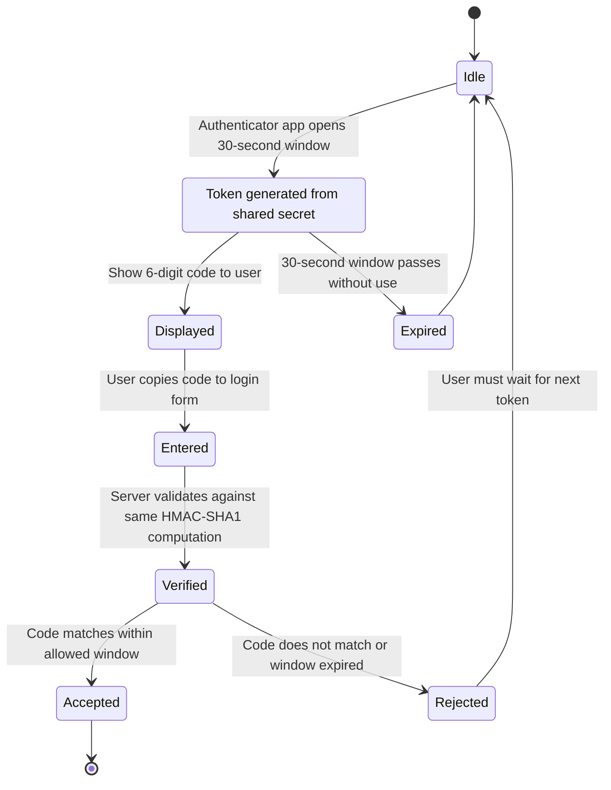

---

## 11. 2FA System Component Diagram

The key classes and their relationships in a typical 2FA backend implementation:

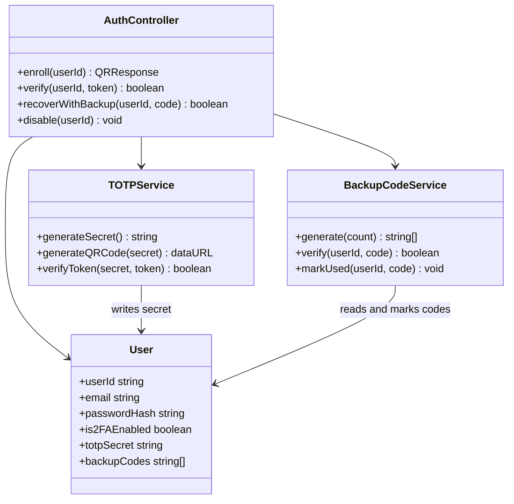

---

## 12. SMS vs TOTP Attack Surface Comparison

Understanding the attack surface of each common 2FA method helps teams make informed security decisions:

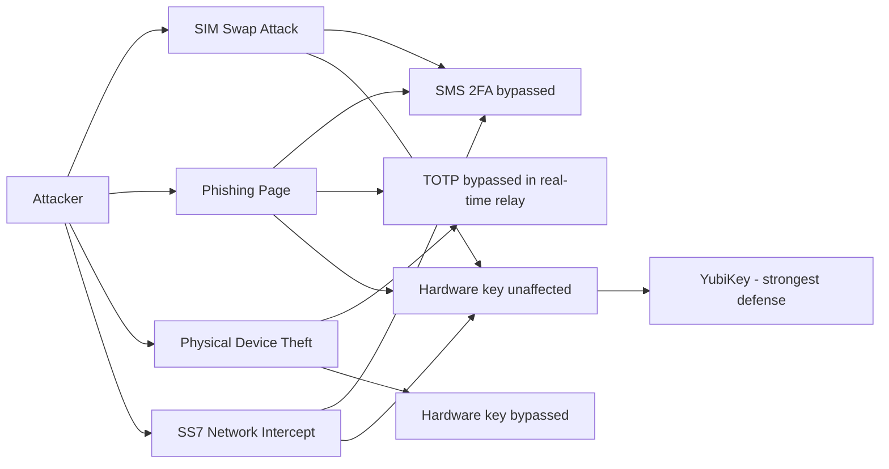

---

## 13. Conclusion

Implementing Two-Factor Authentication is a critical step in fortifying your user authentication process. By combining a traditional password with a dynamic, time-based code, you create a much more secure environment for your users. This guide provided an in-depth look at 2FA - from the underlying principles and benefits to comprehensive backend and frontend implementations with detailed code examples.

Adopting best practices - such as secure secret storage, rate limiting, backup codes, and robust error handling - ensures that your 2FA implementation not only enhances security but also delivers a seamless user experience. As cyber threats continue to evolve, integrating 2FA into your authentication strategy will help build trust and protect both user data and your organization's reputation.

---

## 14. Further Reading & Resources

- **Libraries and Tools:**
  - [Speakeasy (Node.js)](https://github.com/speakeasyjs/speakeasy)
  - [qrcode (Node.js)](https://github.com/soldair/node-qrcode)
- **Security Best Practices:**
  - [OWASP Authentication Cheat Sheet](https://cheatsheetseries.owasp.org/cheatsheets/Authentication_Cheat_Sheet.html)
  - [NIST Digital Identity Guidelines](https://pages.nist.gov/800-63-3/)
- **User Experience:**
  - [Smashing Magazine on 2FA UX](https://www.smashingmagazine.com/)

By leveraging these resources and following the detailed guidelines and examples provided in this article, you can build a robust, secure, and user-friendly 2FA system for your website or web app.
