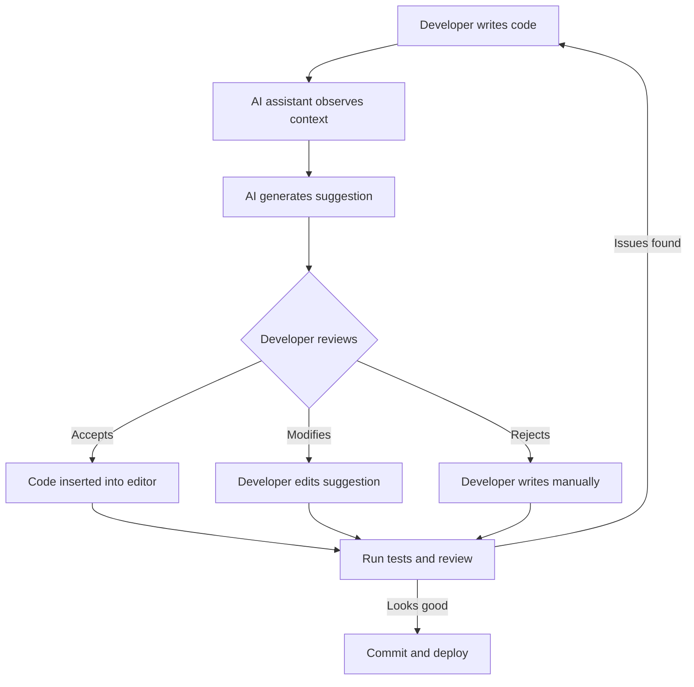
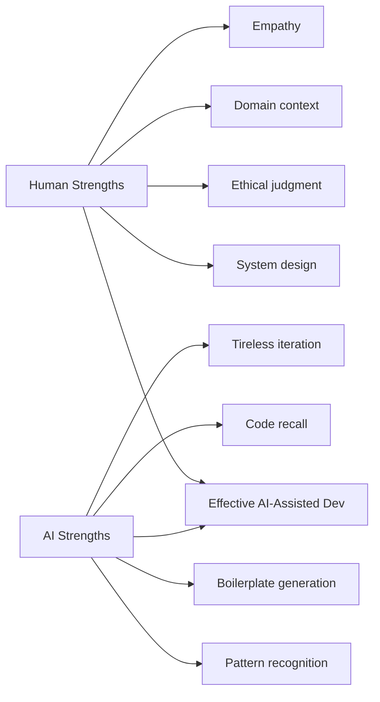
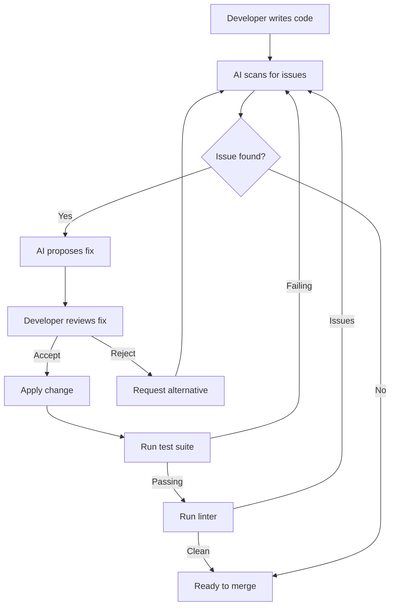
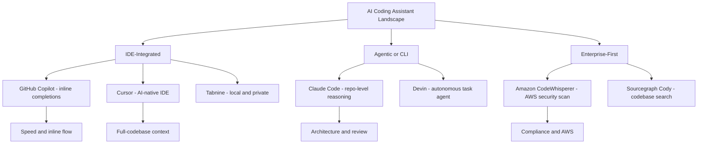
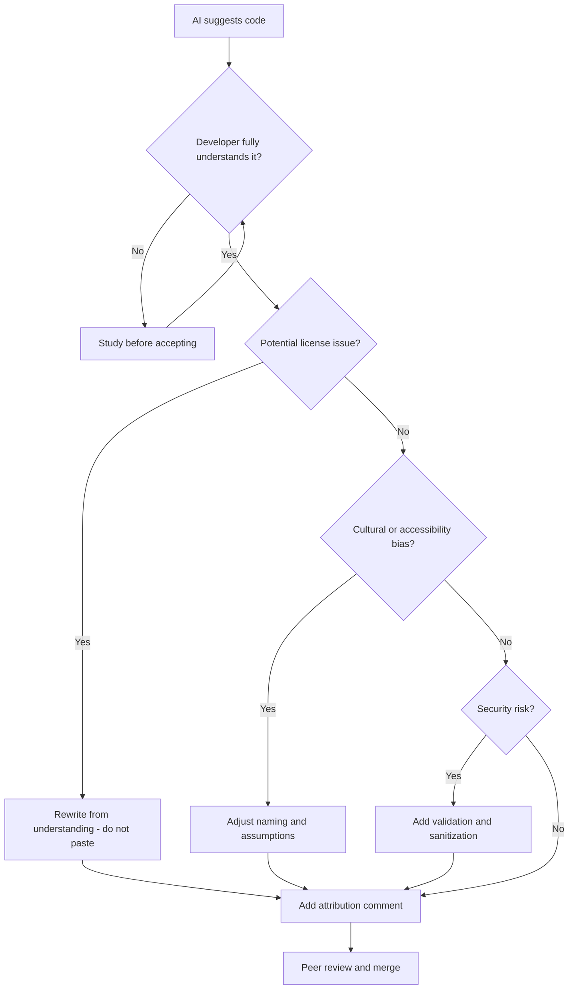
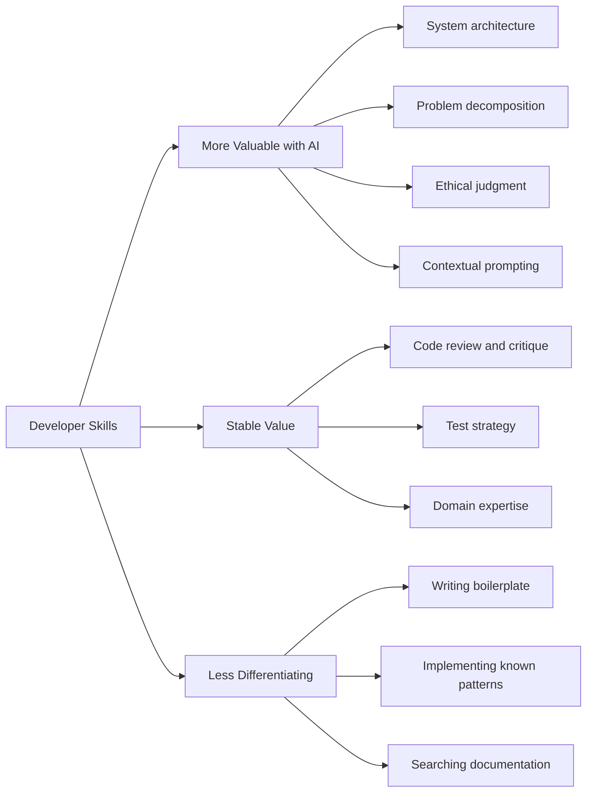
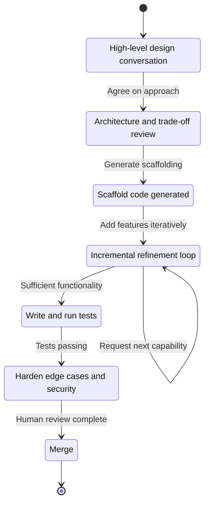
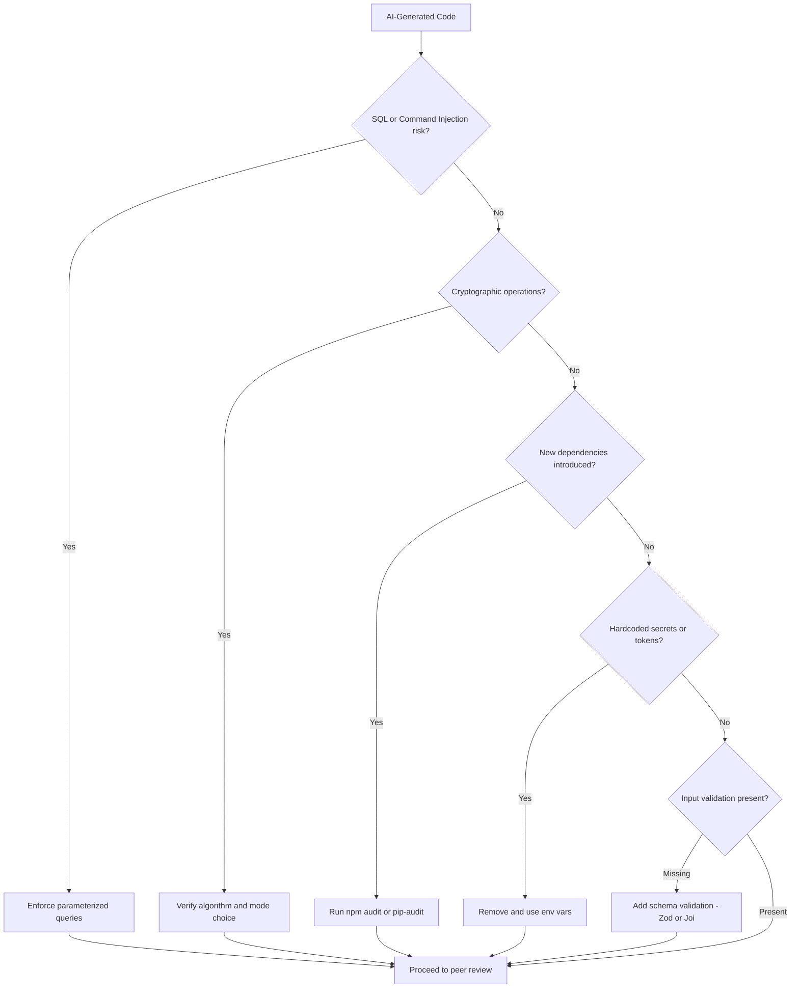
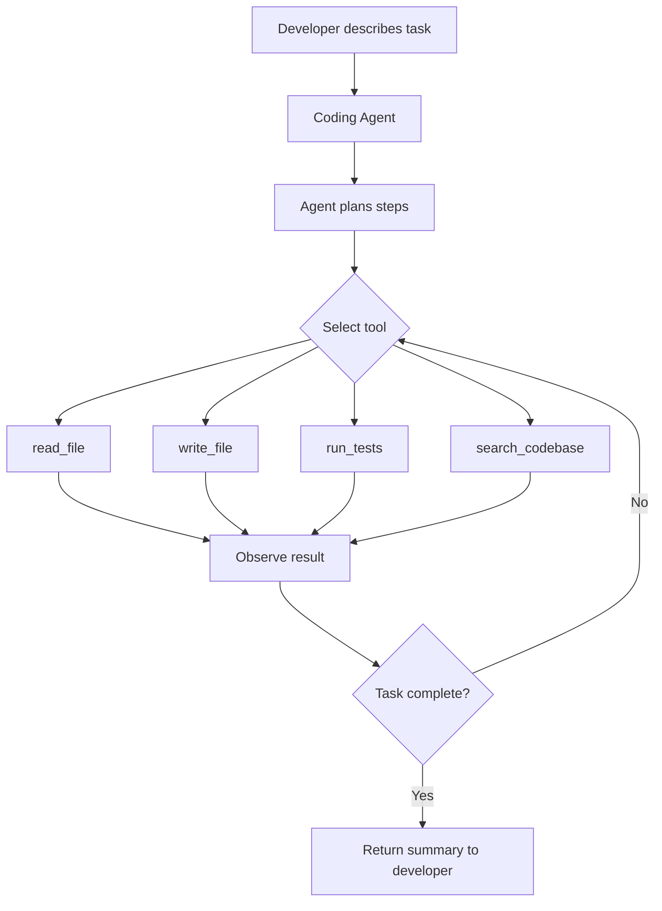

import MdxLayout from "@/components/MdxLayout";

export const metadata = {
  title:
    "The Rise of AI Coding Assistants: How Claude Code, Copilot, and Others Are Reshaping Development",
  description:
    "A thoughtful exploration of AI coding assistants, their impact on developer productivity, the ethical questions they raise, and what they mean for the future of programming.",
  topics: [
    "Artificial Intelligence",
    "Software Engineering",
    "Developer Tools",
    "LLM Engineering",
    "Productivity",
  ],
};

export default function AICodingAssistantsArticle({ children }) {
  return <MdxLayout>{children}</MdxLayout>;
}

# The Rise of AI Coding Assistants: How Claude Code, Copilot, and Others Are Reshaping Development

### Author: Son Nguyen

> Date: 2025-09-30

It was 2 AM, and I was stuck on a particularly gnarly bug in a distributed system. After hours of debugging, I turned to Claude Code - not for the answer, but for a fresh perspective. Within minutes, it pointed out a race condition I'd completely overlooked. That moment crystallized something I'd been thinking about for months: AI coding assistants aren't just tools anymore; they're becoming genuine collaborators in the development process.

---

## 1. The Unexpected Journey from Autocomplete to AI Partner



Remember when IntelliSense felt revolutionary? That little dropdown suggesting method names seemed like magic in the early 2000s. Fast forward to today, and we have AI assistants that can architect entire systems, debug complex issues, and even question our design decisions.

The transformation didn't happen overnight. It's been a gradual evolution from simple pattern matching to sophisticated reasoning engines. But somewhere along the way - perhaps when GitHub Copilot first autocompleted an entire function correctly, or when Claude Code explained why my approach might lead to technical debt - we crossed a threshold. These tools stopped being mere conveniences and started being creative partners.

### 1.1. The Current Landscape: More Than Just Code Completion

Today's AI coding assistants fall into distinct categories, each with its own philosophy:

**Claude Code** approaches problems like a thoughtful senior developer. It doesn't just write code; it reasons through problems, considers edge cases, and often suggests alternative approaches you hadn't considered. I've found it particularly valuable for architectural decisions and code reviews.

**GitHub Copilot** feels like having a junior developer who's read every repository on GitHub. It's incredibly fast at pattern recognition and excels at boilerplate generation. When you're writing your tenth REST endpoint of the day, Copilot becomes invaluable.

**Cursor** takes a different approach entirely - it's not just an assistant but a complete IDE built around AI-first principles. It understands your entire codebase context, making it feel less like you're prompting an AI and more like you're pair programming with someone who knows your project intimately.

**Amazon CodeWhisperer** brings enterprise considerations to the forefront, with built-in security scanning and AWS optimization suggestions. It's the cautious, security-minded member of the team.

---

## 2. The Day AI Became My Pair Programming Partner

Let me share a recent experience that changed my perspective on AI assistance. I was building a real-time collaborative editor - think Google Docs but for code. The complexity was overwhelming: operational transformation algorithms, conflict resolution, WebSocket management, and state synchronization across clients.

Instead of diving straight into implementation, I started a conversation with Claude Code:

```javascript
// My initial prompt wasn't code - it was a discussion:
"I need to implement collaborative editing. Should I use CRDTs or
operational transformation? What are the trade-offs for a small team
with limited resources?"

// Claude's response included not just an answer, but a learning opportunity:
"For a small team, I'd recommend starting with operational transformation (OT)
because... [detailed explanation]. However, here's a simple CRDT implementation
to understand the alternative:"

class SimpleCRDT {
  constructor(siteId) {
    this.siteId = siteId;
    this.vector = [];
    this.counter = 0;
  }

  insert(position, character) {
    // Generate unique identifier
    const id = [this.siteId, this.counter++];

    // Position between existing characters
    const fractionalIndex = this.generateIndex(position);

    return {
      id,
      char: character,
      position: fractionalIndex
    };
  }

  // ... more implementation
}
```

What struck me wasn't the code itself, but how the AI framed it as part of a larger discussion about system design trade-offs. It wasn't just answering; it was teaching.

---

## 3. The Productivity Paradox: Moving Faster While Thinking Deeper

There's an interesting paradox I've noticed since integrating AI assistants into my workflow. I'm writing code faster than ever, but I'm spending more time thinking about architecture and design. The mundane tasks that used to eat up hours - writing boilerplate, implementing standard patterns, creating test cases - now happen almost instantly. This liberation from the mechanical aspects of coding has freed me to focus on the creative and strategic elements.

Consider this typical scenario from last week. I needed to implement rate limiting for an API. Previously, this would have taken me an hour or two to research the best approach, implement it, and write tests. With AI assistance:

```python
# I described what I needed:
"Implement token bucket rate limiting with Redis backend,
supporting different limits per user tier"

# Within seconds, I had a working implementation:
class TokenBucketRateLimiter:
    def __init__(self, redis_client):
        self.redis = redis_client
        self.limits = {
            'free': {'capacity': 100, 'refill_rate': 1},
            'pro': {'capacity': 1000, 'refill_rate': 10},
            'enterprise': {'capacity': 10000, 'refill_rate': 100}
        }

    async def allow_request(self, user_id, tier='free'):
        limit = self.limits[tier]
        key = f"rate_limit:{user_id}"

        # Lua script for atomic operation
        lua_script = """
        local key = KEYS[1]
        local capacity = tonumber(ARGV[1])
        local refill_rate = tonumber(ARGV[2])
        local now = tonumber(ARGV[3])

        local bucket = redis.call('HMGET', key, 'tokens', 'last_refill')
        local tokens = tonumber(bucket[1]) or capacity
        local last_refill = tonumber(bucket[2]) or now

        -- Calculate new tokens
        local elapsed = now - last_refill
        tokens = math.min(capacity, tokens + elapsed * refill_rate)

        if tokens >= 1 then
            tokens = tokens - 1
            redis.call('HMSET', key, 'tokens', tokens, 'last_refill', now)
            redis.call('EXPIRE', key, 3600)
            return 1
        end
        return 0
        """

        return await self.redis.eval(
            lua_script, 1, key,
            limit['capacity'],
            limit['refill_rate'],
            time.time()
        ) == 1
```

But here's the crucial part: instead of just accepting this code, I spent the time I saved discussing with the AI about why Lua scripts ensure atomicity, exploring alternative algorithms like sliding window, and understanding the trade-offs. The AI became a sounding board for ideas rather than just a code generator.

---

## 4. The Ethical Tightrope: Attribution, Ownership, and Responsibility

As these tools become more powerful, we're walking an increasingly complex ethical tightrope. Last month, a colleague discovered that Copilot had suggested code that was nearly identical to a function from a GPL-licensed project. The suggestion was accepted without realizing the licensing implications. This incident sparked a team-wide discussion about AI and intellectual property.

The questions we grappled with were profound:

- Who owns AI-generated code?
- How do we ensure we're not inadvertently violating licenses?
- What's our responsibility when AI suggests code that might be derived from copyrighted sources?
- How do we maintain attribution and respect for original authors?

We developed a set of guidelines that I believe every team using AI should consider:

### 1. The Attribution Principle

We now add comments to significant AI-generated code blocks:

```javascript
// AI-Assisted Implementation (Claude Code, 2025-09-22)
// Human Review: [Developer Name]
// Modified from original suggestion to add error handling and logging
```

### 2. The Review Imperative

No AI-generated code goes into production without human review. We treat AI suggestions like we would code from a new team member - with careful scrutiny and validation.

### 3. The Learning Commitment

We use AI to accelerate learning, not to bypass it. When AI suggests an unfamiliar pattern or algorithm, we take time to understand it fully before implementation.

---

## 5. The Bias We Don't Talk About

There's an uncomfortable truth about AI coding assistants that our industry needs to address: they can perpetuate and amplify biases present in their training data. I noticed this firsthand when working on a user management system. The AI consistently suggested database schemas with fields like "firstName" and "lastName" - a Western-centric assumption about how names work.

This might seem trivial, but it reflects a deeper issue. These models are trained on existing code, which means they learn our industry's historical biases and assumptions. They might suggest:

- Variable names that aren't inclusive
- Examples that assume certain cultural contexts
- Architectural patterns that favor certain use cases over others

As developers, we have a responsibility to recognize and correct these biases. I've started maintaining a personal checklist:

- Are the suggested variable names culturally neutral?
- Do the examples consider international users?
- Is the code accessible to users with disabilities?
- Does the implementation consider diverse use cases?

---

## 6. The Human Elements That AI Can't Replace

Despite the impressive capabilities of AI assistants, I've identified several areas where human judgment remains irreplaceable:

### 6.1. Creative Problem Solving

While AI can suggest solutions based on patterns it's seen, true innovation - the "aha!" moments that lead to breakthrough solutions - still comes from human creativity. AI can help you implement a distributed cache, but it won't invent Redis.

### 6.2. Ethical Decision Making

AI can flag potential ethical issues, but the nuanced decisions about user privacy, data handling, and feature implications require human values and judgment. When we decided to implement end-to-end encryption in our chat application, the technical implementation was straightforward with AI help, but the decision to prioritize user privacy over certain features was fundamentally human.

### 6.3. Understanding Context and Constraints

AI doesn't know your team's specific constraints, your company's technical debt, or why you chose PostgreSQL over MongoDB three years ago. These contextual factors that influence every technical decision are uniquely human knowledge.

### 6.4. Empathy and User Understanding

The best software isn't just technically sound; it understands and serves human needs. AI can help implement features, but understanding why a user might prefer one workflow over another requires human empathy and experience.

---

## 7. Practical Strategies for AI-Assisted Development



Through months of experimentation, I've developed strategies for effectively working with AI assistants:

### 1. The Conversation Approach

Instead of asking for code directly, start with a discussion:

```
"I'm building a notification system that needs to handle email, SMS, and push
notifications. What architectural patterns would you recommend, and what are
the trade-offs of each?"
```

This approach yields more thoughtful, comprehensive solutions than simply asking for implementation code.

### 2. Incremental Refinement

Start with a high-level solution and iteratively refine:

```
Initial: "Create a user authentication system"
Refined: "Add OAuth support for Google and GitHub"
Further: "Implement refresh token rotation for security"
Final: "Add rate limiting and account lockout after failed attempts"
```

### 3. The Teaching Test

If you can't explain to a colleague why the AI-generated code works, you shouldn't use it. This simple rule has saved me from numerous bugs and security issues.

### 4. Contextual Prompting

Provide context about your specific situation:

```
"We're a small startup with 3 developers. We need a simple but scalable solution
for handling file uploads. We're using AWS and have a budget constraint. What's
the most pragmatic approach?"
```

---

## 8. The AI Code Review Feedback Loop

One of the most powerful workflows is using AI for iterative code review. Unlike a one-shot suggestion, a feedback loop allows the assistant to refine its output based on test results, linting, and human commentary.



---

## 9. Evolution of AI Coding Tools

The journey from simple autocomplete to agentic collaboration spans roughly two decades of incremental breakthroughs.


---

## 10. The Future We're Building Together

As I write this, I'm simultaneously excited and contemplative about where we're heading. The next generation of AI assistants will likely be able to:

- Understand entire codebases and suggest architectural improvements
- Automatically fix bugs based on error reports
- Generate comprehensive test suites that actually catch edge cases
- Participate in code reviews with meaningful feedback
- Learn from your team's specific patterns and preferences

But with these capabilities come responsibilities. We're not just users of these tools; we're shaping how they develop and how our industry evolves with them.

### 10.1. The Skills That Matter More Than Ever

Ironically, as AI becomes better at writing code, certain human skills become more valuable:

1. **System Design**: Understanding how components fit together at scale
2. **Problem Decomposition**: Breaking complex problems into manageable pieces
3. **Critical Thinking**: Evaluating AI suggestions and understanding trade-offs
4. **Communication**: Explaining technical concepts to both humans and AI
5. **Ethics and Empathy**: Ensuring technology serves humanity positively

---

## 11. A Personal Reflection: Embracing the Change

Six months ago, I was skeptical. I worried that AI assistants would make developers lazy, that we'd lose our edge, that the craft I love would become mechanized. But my experience has been the opposite. These tools have rekindled my curiosity and pushed me to tackle more ambitious projects.

Last week, I built a proof-of-concept for a distributed system that would have taken me months to implement alone. With AI assistance, I had a working prototype in days. But more importantly, I understood every line of code, every architectural decision, and every trade-off made.

The key insight? AI assistants don't replace the need for engineering expertise - they amplify it. They're like having a incredibly well-read colleague who never gets tired, never judges your questions, and is always ready to explore ideas with you.

---

## 12. AI Assistant Landscape: Tool Comparison

The following diagram maps the major AI coding assistants by their primary integration model and key strength:



---

## 13. Ethical Decision Framework for AI-Generated Code

When AI suggests code that raises intellectual property, bias, or quality concerns, this framework guides the review decision:



---

## 14. Developer Skill Shift in the AI Era

AI coding assistants shift the value of individual skills. The diagram below shows which skills become more valuable and which become less differentiating:



---

## 15. Incremental Refinement Workflow

The conversation approach to AI-assisted development follows an iterative cycle from high-level design down to production-ready code:



---

## 16. Prompt Engineering for Code Generation

The quality of AI-generated code is directly proportional to the quality of the prompt. Generic requests produce generic code; precisely scoped prompts with contextual constraints produce production-ready output.

### 16.1. The CRISPE Framework for Code Prompts

A structured prompt framework that consistently improves output quality:

- **C**ontext: what is the system / codebase / language
- **R**ole: ask the AI to behave as an expert in a specific domain
- **I**nstructions: the exact task with constraints
- **S**pecifics: edge cases, performance requirements, error handling expectations
- **P**roduction readiness: logging, observability, security, test coverage
- **E**xample: provide input/output examples where possible

```
Context: We are building a TypeScript Express.js API backed by PostgreSQL via
the `pg` library. Connection pooling is managed by `pg-pool`. Errors must be
logged with `winston` and never leak stack traces to the client.

Role: You are a senior backend engineer specializing in Node.js reliability
and security.

Instructions: Write a `getUserById` repository function.

Specifics:
- Input: `userId: string` (UUID format)
- Returns: `Promise<User | null>` where User is defined in `types/user.ts`
- Must validate UUID format before querying (throw 400 on invalid format)
- Must handle database connection errors with a 503 response hint in the error
- Must prevent SQL injection via parameterized queries only

Production readiness:
- Add structured winston log entries on error with `userId` redacted in the log
- Return null (not an error) when the user does not exist

Example: getUserById("550e8400-e29b-41d4-a716-446655440000") -> User object
         getUserById("not-a-uuid") -> throws ValidationError
```

This level of specificity consistently produces code that requires minimal editing before merging.

### 16.2. Iterative Prompt Patterns

```javascript
// Pattern 1: Scaffolding first, then hardening
// Step 1 - get working logic
"Write a function that batches an array into chunks of size n"

// Step 2 - add robustness
"Now add input validation, handle edge cases (n=0, empty array, n > array.length),
and add JSDoc with parameter types and examples"

// Step 3 - add observability
"Add timing instrumentation using performance.now() so callers can measure
how long large batch operations take"

// Pattern 2: Explain then implement
"Explain what a bloom filter is and when it outperforms a Set for membership
testing. Then implement one in TypeScript with configurable size and hash count,
including a false positive rate calculator."

// Pattern 3: Review then rewrite
"Here is my existing rate limiter implementation: [paste code]
Review it for correctness, thread safety, and edge cases.
Then rewrite it addressing the issues you found."
```

---

## 17. Evaluating AI Code Quality: Metrics and Methods

Accepting AI-generated code without measurement is a liability. These metrics provide objective signal on whether AI assistance is improving or degrading code health.

### 17.1. Defect Injection Rate

Track the percentage of bugs found in code review or in production that originated in AI-assisted commits versus human-only commits. Most teams using disciplined review report comparable or lower defect rates for AI-assisted code, but this only holds when the review process is enforced.

```python
# Simplified git analysis script to tag commit origins
import subprocess
import re

def analyze_ai_commits(repo_path: str) -> dict:
    """Analyze commits for AI attribution comments and correlate with bug fixes."""
    result = subprocess.run(
        ["git", "log", "--pretty=format:%H %s", "--all"],
        cwd=repo_path, capture_output=True, text=True
    )
    commits = result.stdout.strip().split("\n")
    ai_commits   = [c for c in commits if "AI-Assisted" in c or "Copilot" in c]
    bug_fix_sha  = [c.split()[0] for c in commits if re.search(r"fix|bug|hotfix", c, re.I)]

    return {
        "total_commits":   len(commits),
        "ai_commits":      len(ai_commits),
        "bug_fix_commits": len(bug_fix_sha),
    }
```

### 17.2. Cyclomatic Complexity Tracking

AI models tend to generate deeply nested conditionals when not explicitly instructed otherwise. Tracking cyclomatic complexity over time reveals drift.

```bash
# Install complexity checker
pip install radon

# Check complexity of AI-assisted module
radon cc src/ai_generated/ -s -a

# Target: average complexity grade B (5-10) or better
# Grade A: 1-5  (simple)
# Grade B: 6-10 (moderate, acceptable)
# Grade C: 11-15 (complex, warrants refactor)
```

### 17.3. Test Coverage Delta

Measure whether AI-generated code comes with adequate test coverage before and after the AI writes tests on request.

```bash
# Run Jest with coverage and output to JSON for tracking
npx jest --coverage --coverageReporters=json-summary

# Parse summary.json to track coverage over time
node -e "
const s = require('./coverage/coverage-summary.json').total;
console.log(JSON.stringify({
  lines: s.lines.pct,
  branches: s.branches.pct,
  functions: s.functions.pct,
}));
"
```

### 17.4. Security Scan on AI Output

Run static analysis immediately after accepting AI-generated code, before any commit:

```bash
# Python: Bandit security linter
pip install bandit
bandit -r src/ -ll  # report medium and high severity only

# JavaScript/TypeScript: Semgrep
semgrep --config=p/nodejs-security src/

# Dependency vulnerabilities
npm audit --audit-level=high
```

---

## 18. Security Risks of AI-Generated Code

AI coding assistants introduce a specific class of security risks that differ from traditional developer mistakes. Understanding them enables better review processes.

### 18.1. Risk 1: Training Data Poisoning via Insecure Patterns

AI models learn from public repositories, which contain significant amounts of insecure code. The model reproduces patterns it has seen frequently, including antipatterns like SQL string concatenation, hardcoded secrets, and missing input validation.

```javascript
// AI may suggest this pattern (INSECURE - SQL injection risk)
const query = `SELECT * FROM users WHERE id = ${userId}`;

// The secure version the reviewer must enforce
const query = "SELECT * FROM users WHERE id = $1";
const result = await db.query(query, [userId]);
```

### 18.2. Risk 2: Dependency Confusion and Supply Chain

AI assistants sometimes hallucinate package names that do not exist on npm or PyPI. Attackers register malicious packages with these names, a technique called dependency confusion.

```bash
# Before running npm install on AI-suggested packages, verify they exist
npm view <package-name> version

# Check download count as a basic legitimacy signal
npm view <package-name> downloads
```

### 18.3. Risk 3: Subtle Cryptographic Misuse

Cryptographic implementations require precise parameter choices. AI often generates syntactically valid but cryptographically weak code.

```python
# AI may suggest (INSECURE - ECB mode reveals patterns)
from Crypto.Cipher import AES
cipher = AES.new(key, AES.MODE_ECB)

# The correct choice for most use cases
from Crypto.Cipher import AES
from Crypto.Random import get_random_bytes
nonce  = get_random_bytes(16)
cipher = AES.new(key, AES.MODE_GCM, nonce=nonce)
ciphertext, tag = cipher.encrypt_and_digest(plaintext)
```

### 18.4. Security Review Checklist for AI Code



---

## 19. Building a Custom Coding Agent

When off-the-shelf assistants don't fit specialized workflows - internal frameworks, proprietary APIs, custom code style guides - building a lightweight coding agent with the Anthropic SDK gives full control over context, tools, and output format.

### 19.1. Minimal Coding Agent with Tool Use

```python
import anthropic
import subprocess
import os

client = anthropic.Anthropic()

tools = [
    {
        "name": "read_file",
        "description": "Read the contents of a file in the project",
        "input_schema": {
            "type": "object",
            "properties": {
                "path": {"type": "string", "description": "Relative path to the file"}
            },
            "required": ["path"],
        },
    },
    {
        "name": "run_tests",
        "description": "Run the Jest test suite and return the output",
        "input_schema": {
            "type": "object",
            "properties": {
                "pattern": {"type": "string", "description": "Test file pattern, e.g. 'src/utils'"}
            },
            "required": [],
        },
    },
    {
        "name": "write_file",
        "description": "Write content to a file",
        "input_schema": {
            "type": "object",
            "properties": {
                "path":    {"type": "string"},
                "content": {"type": "string"},
            },
            "required": ["path", "content"],
        },
    },
]

def handle_tool_call(tool_name: str, tool_input: dict) -> str:
    if tool_name == "read_file":
        with open(tool_input["path"]) as f:
            return f.read()
    if tool_name == "run_tests":
        pattern = tool_input.get("pattern", "")
        result = subprocess.run(
            ["npx", "jest", pattern, "--no-coverage"],
            capture_output=True, text=True, timeout=60
        )
        return result.stdout + result.stderr
    if tool_name == "write_file":
        with open(tool_input["path"], "w") as f:
            f.write(tool_input["content"])
        return f"Written {len(tool_input['content'])} chars to {tool_input['path']}"
    return "Unknown tool"

def run_agent(task: str) -> str:
    messages = [{"role": "user", "content": task}]
    while True:
        response = client.messages.create(
            model="claude-opus-4-5",
            max_tokens=4096,
            tools=tools,
            messages=messages,
        )
        messages.append({"role": "assistant", "content": response.content})

        if response.stop_reason == "end_turn":
            text_blocks = [b.text for b in response.content if hasattr(b, "text")]
            return "\n".join(text_blocks)

        tool_results = []
        for block in response.content:
            if block.type == "tool_use":
                result = handle_tool_call(block.name, block.input)
                tool_results.append({
                    "type": "tool_result",
                    "tool_use_id": block.id,
                    "content": result,
                })
        messages.append({"role": "user", "content": tool_results})

# Example invocation
output = run_agent(
    "Read src/utils/formatCurrency.ts, write a complete Jest test file for it "
    "covering edge cases, save it to src/utils/formatCurrency.test.ts, "
    "then run the tests and report whether they pass."
)
print(output)
```

### 19.2. Agent Architecture



---

## 20. Conclusion: The Collaborative Future

As I finish writing this at 3 AM (yes, the irony isn't lost on me), I'm struck by how natural it feels to have AI as part of my development process. It's not about AI versus humans; it's about AI with humans, creating a synergy that pushes the boundaries of what we can build.

The developers who will thrive in this new era aren't those who resist AI or those who blindly depend on it, but those who learn to dance with it - leveraging its strengths while maintaining their critical thinking, creativity, and ethical grounding.

AI coding assistants are tools, powerful ones, but tools nonetheless. Like any tool, their value lies not in the tool itself but in how we choose to use it. As we stand at this inflection point in software development history, we have the opportunity - and responsibility - to shape how these tools evolve and how our profession adapts.

The code we write today with AI assistance isn't just building applications; it's building the future of how software will be created. Let's make sure it's a future where technology amplifies the best of human creativity, judgment, and values.

_What's your experience with AI coding assistants? Have they changed how you approach development? I'd love to hear your thoughts and experiences as we navigate this transformation together._

---

## 21. Resources for Your Journey

### 21.1. Getting Started

- **Claude Code**: [claude.ai](https://claude.ai) - Best for complex reasoning and architectural discussions
- **GitHub Copilot**: [copilot.github.com](https://copilot.github.com) - Ideal for IDE integration and rapid development
- **Cursor**: [cursor.so](https://cursor.so) - Perfect for those wanting an AI-native development environment

### 21.2. Learning More

- "The Pragmatic Programmer" (20th Anniversary Edition) - Still relevant, now more than ever
- "A Philosophy of Software Design" by John Ousterhout - Essential reading for the AI era
- Online communities: r/experienceddevs, HackerNews, Dev.to

### 21.3. Staying Grounded

Remember: AI is a powerful ally, but your creativity, judgment, and values are what make great software. Use AI to eliminate friction, not to eliminate thinking.

The journey continues, and I'm excited to see where we go from here. Are you?
