import MdxLayout from "@/components/MdxLayout";

export const metadata = {
  title: "Agentic AI: The Rise of Autonomous Systems That Think, Plan, and Act",
  description:
    "Exploring the paradigm shift from passive AI assistants to autonomous agents capable of reasoning, planning, and taking action. A deep dive into the technology reshaping how we build intelligent systems.",
  topics: [
    "Artificial Intelligence",
    "Machine Learning",
    "Agentic AI",
    "LLM Engineering",
    "System Design",
  ],
};

export default function AgenticAIArticle({ children }) {
  return <MdxLayout>{children}</MdxLayout>;
}

# Agentic AI: The Rise of Autonomous Systems That Think, Plan, and Act

### Author: Son Nguyen

> Date: 2025-09-22

Last month, I gave my AI agent a seemingly simple task: "Research quantum computing startups and write a brief about the most promising ones." What happened next fundamentally changed how I think about artificial intelligence.

Instead of returning a generic list scraped from the web, the agent did something remarkable. It started by questioning my criteria for "promising" - was I looking at funding, technical innovation, or market readiness? It then created a research plan, gathered data from multiple sources, cross-referenced conflicting information, and even reached out to analyze recent patent filings. After three hours of autonomous work, it delivered not just a report, but a nuanced analysis with investment recommendations based on my previous interests.

This wasn't a chatbot regurgitating information. This was an _agent_ - a system that could think, plan, and act independently. Welcome to the era of Agentic AI.

---

## 1. From Assistants to Agents: A Fundamental Shift

The difference between traditional AI assistants and agentic systems isn't just incremental - it's fundamental. Think of it this way: ChatGPT is like a brilliant colleague you can consult. An agentic AI system is like hiring an entire team that works while you sleep.

Traditional AI assistants excel at answering questions. You prompt, they respond. It's a conversation, but you're always driving. Agentic AI flips this dynamic. You set an objective, and the agent figures out how to achieve it - planning its approach, using tools, learning from mistakes, and adapting its strategy.

I first experienced this shift while building a research agent for a venture capital firm. The initial requirement was simple: automate the due diligence process. But what we built was something far more profound - an agent that could:

- Autonomously identify relevant companies based on investment thesis
- Investigate their technology, team, and market position
- Generate detailed competitive analyses
- Flag potential risks and opportunities
- Even draft initial investment memos

The key insight? We didn't program these specific behaviors. We gave the agent goals, tools, and the ability to reason about how to use them. The sophisticated behaviors emerged from these simple principles.

The following diagram illustrates the core agent loop that powers autonomous systems:

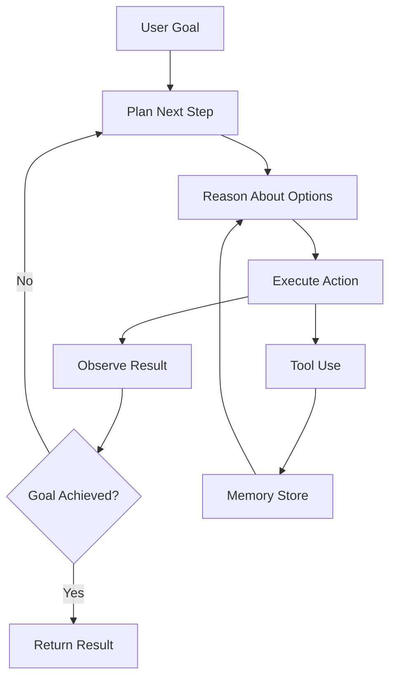

---

## 2. The Architecture of Autonomy

Building truly agentic systems requires rethinking how we structure AI applications. After months of experimentation with various approaches, I've identified several key patterns that separate true agents from simple automation.

### 2.1. The Planning Paradox

Early in my journey with agentic systems, I made a classic mistake: over-planning. I built an agent that would create elaborate 20-step plans before taking any action. It was impressive to watch it think, but it rarely completed tasks successfully. Reality is messy, and plans need to adapt.

The breakthrough came when I switched to what I call "intentional wandering" - the agent maintains a clear goal but makes decisions step-by-step, constantly reassessing based on what it learns. Like a detective following leads rather than a robot executing instructions.

Here's a simplified example of how this works in practice:

```python
# Instead of rigid planning:
plan = ["Step 1: Research topic", "Step 2: Write draft", "Step 3: Edit"]

# Adaptive reasoning:
while not goal_achieved:
    context = assess_current_situation()
    next_action = reason_about_best_action(context, goal)
    result = execute_action(next_action)
    learn_from_result(result)
```

This approach seems less efficient on paper, but it's remarkably robust in practice. The agent can recover from errors, incorporate new information, and even discover better approaches than originally conceived.

#### Code: Minimal step-wise planner with LangGraph (Python)

```python
# pip install langgraph langchain langchain-openai langgraph-checkpoint-sqlite
from typing import TypedDict, List
from langgraph.graph import StateGraph, START, END, MessagesState
from langgraph.prebuilt import ToolNode
from langchain.chat_models import init_chat_model
from langgraph.checkpoint.sqlite import SqliteSaver

# --- State ---
class MyState(MessagesState):
    goal: str

# --- Tools (toy) ---
def search(query: str) -> str:
    return f"Top snippets for '{query}' ..."

def write_outline(topic: str) -> str:
    return f"- Intro to {topic}\n- Key players\n- Risks\n- Outlook"

tools = [
    {
        "name": "search",
        "description": "Web search for factual lookup",
        "input_schema": {"type": "object", "properties": {"query": {"type": "string"}}, "required": ["query"]},
        "function": search,
    },
    {
        "name": "write_outline",
        "description": "Create a brief outline for a topic",
        "input_schema": {"type": "object", "properties": {"topic": {"type": "string"}}, "required": ["topic"]},
        "function": write_outline,
    },
]

# --- Model ---
model = init_chat_model("anthropic:claude-3-5-sonnet-latest")
model_with_tools = model.bind_tools(tools)

# --- Nodes ---
async def call_model(state: MyState):
    """Reason about next best action given current messages and goal."""
    response = await model_with_tools.ainvoke(state["messages"] + [{"role": "system", "content": f"Goal: {state['goal']}"}])
    return {"messages": [response]}

def should_continue(state: MyState):
    last = state["messages"][-1]
    return "tools" if getattr(last, "tool_calls", None) else END

tool_node = ToolNode(tools)

# --- Graph ---
builder = StateGraph(MyState)
builder.add_node("call_model", call_model)
builder.add_node("tools", tool_node)
builder.add_edge(START, "call_model")
builder.add_conditional_edges("call_model", should_continue)
builder.add_edge("tools", "call_model")

# Persist working memory/checkpoints
checkpointer = SqliteSaver.from_conn_string("planner_memory.sqlite")
graph = builder.compile(checkpointer=checkpointer)

# --- Run ---
result = graph.invoke({"messages": [{"role": "user", "content": "Research QC startups"}], "goal": "Pick 3 startups for a memo"})
print(result["messages"][-1].content)
```

### 2.2. Memory: The Secret Ingredient

What really brings an agent to life is memory - not just storing information, but organizing and retrieving it intelligently.

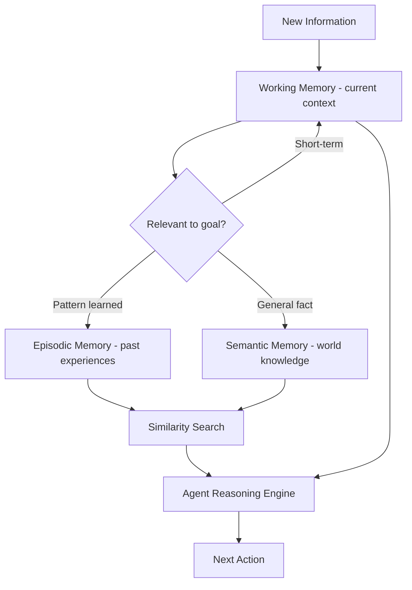

I learned this lesson the hard way when an early agent kept making the same mistakes repeatedly, like a goldfish swimming in circles.

The solution wasn't just adding a database. It was creating three distinct types of memory:

**Working Memory**: Like human short-term memory, this holds the immediate context. What am I doing right now? What did I just learn? This keeps the agent focused without overwhelming it with history.

**Episodic Memory**: Stories of past experiences. When the agent faces a familiar situation, it can recall "Last time I encountered this, here's what worked and what didn't." This is where learning happens.

**Semantic Memory**: General knowledge and facts. This is the agent's understanding of the world, constantly updated but more stable than episodic memories.

The magic happens when these memories interact. An agent working on a coding task might recall (episodic) that last time it had a similar bug, checking the logs helped. It knows (semantic) that Python errors usually provide stack traces. And it maintains (working) the current error message and what it's already tried.

#### Code: A simple three-tier memory scaffold (Python)

```python
# pip install langchain langchain-openai faiss-cpu
from dataclasses import dataclass, field
from typing import List, Dict, Any
from langchain_openai import OpenAIEmbeddings
from langchain_community.vectorstores import FAISS

@dataclass
class WorkingMemory:
    kv: Dict[str, Any] = field(default_factory=dict)

@dataclass
class EpisodicMemory:
    embeddings: Any = field(default_factory=OpenAIEmbeddings)
    store: Any = field(default=None)

    def __post_init__(self):
        self.store = FAISS.from_texts(["seed"], self.embeddings)

    def add(self, text: str, metadata: dict):
        self.store.add_texts([text], metadatas=[metadata])

    def recall(self, query: str, k: int = 3):
        return self.store.similarity_search(query, k=k)

@dataclass
class SemanticMemory:
    facts: Dict[str, str] = field(default_factory=dict)

    def upsert(self, key: str, value: str):
        self.facts[key] = value

    def get(self, key: str, default=None):
        return self.facts.get(key, default)

class MemorySystem:
    def __init__(self):
        self.working = WorkingMemory()
        self.episodic = EpisodicMemory()
        self.semantic = SemanticMemory()

    def note_failure(self, task: str, reason: str):
        self.episodic.add(f"Failed {task}: {reason}", {"type": "failure"})

    def note_success(self, task: str, outcome: str):
        self.episodic.add(f"Succeeded {task}: {outcome}", {"type": "success"})

    def suggest_next_step(self, query: str) -> str:
        memories = self.episodic.recall(query, k=1)
        hint = memories[0].page_content if memories else "No prior"
        return f"Based on memory: {hint}"
```

### 2.3. The Tool Revolution

Perhaps the most exciting development in agentic AI is tool use. Early language models could only generate text. Modern agents can interact with the world - searching the web, writing code, querying databases, even controlling other software.

But here's what most people miss: the revolution isn't just that AI can use tools. It's that AI can figure out _which_ tools to use and _how_ to combine them creatively.

I once watched my agent solve a problem I hadn't anticipated. Tasked with analyzing startup metrics, it encountered data in a poorly formatted PDF. Instead of failing, it:

1. Used an OCR tool to extract text
2. Wrote Python code to clean the data
3. Imported it into a spreadsheet
4. Generated visualizations
5. Analyzed trends

No human told it to do this. It reasoned through the problem and assembled a solution from available tools.

#### Code: Defining and binding tools (Python)

```python
from typing import TypedDict
from langchain.chat_models import init_chat_model

def ocr_pdf(path: str) -> str:
    # ... run OCR (pytesseract or service)
    return "raw text from pdf"

def clean_csv(text: str) -> str:
    # ... return cleaned CSV
    return "col1,col2\n1,2"

def summarize(csv_text: str) -> str:
    # ... compute stats
    return "Top 3 trends: ..."

tools = [
  {
    "name": "ocr_pdf",
    "description": "Extract text from a PDF path",
    "input_schema": {"type":"object","properties":{"path":{"type":"string"}},"required":["path"]},
    "function": ocr_pdf
  },
  {
    "name": "clean_csv",
    "description": "Clean raw text into normalized CSV",
    "input_schema": {"type":"object","properties":{"text":{"type":"string"}},"required":["text"]},
    "function": clean_csv
  },
  {
    "name": "summarize",
    "description": "Summarize CSV into insights",
    "input_schema": {"type":"object","properties":{"csv_text":{"type":"string"}},"required":["csv_text"]},
    "function": summarize
  }
]

model = init_chat_model("anthropic:claude-3-5-sonnet-latest").bind_tools(tools)
response = model.invoke("Find insights from ./metrics.pdf")
print(response.content)
```

---

## 3. MCP: Model Context Protocol in Agents (with code)

_Add interoperable, secure tool access to your agents via MCP - so they can connect to local/remote tool servers without bespoke glue code._

### 1) Build a tiny MCP server (Python)

```python
# pip install mcp
# save as math_server.py
from mcp.server.fastmcp import FastMCP

mcp = FastMCP("MathTools")

@mcp.tool()
def add(a: int, b: int) -> int:
    "Add two integers"
    return a + b

@mcp.tool()
def multiply(a: int, b: int) -> int:
    "Multiply two integers"
    return a * b

if __name__ == "__main__":
    # stdio works great for local development
    mcp.run(transport="stdio")
```

### 2) Call MCP tools from a LangGraph agent (Python)

```python
# pip install langgraph langchain langchain-openai langchain-mcp-adapters
from langchain_mcp_adapters.client import MultiServerMCPClient
from langgraph.prebuilt import create_react_agent
from langchain.chat_models import init_chat_model

# Connect to one or more MCP servers
client = MultiServerMCPClient({
  "math": {
    "command": "python",
    "args": ["/abs/path/to/math_server.py"],  # update path!
    "transport": "stdio",
  }
})

tools = await client.get_tools()
model = init_chat_model("anthropic:claude-3-5-sonnet-latest")
agent = create_react_agent(model, tools)

out = await agent.ainvoke({"messages":[{"role":"user","content":"What's (3 + 5) * 12?"}]})
print(out["messages"][-1].content)
```

### 3) Build a tiny MCP server (TypeScript)

```ts
// npm i mcp-socket @modelcontextprotocol/sdk zod
// save as slug_server.ts
import { z } from "zod";
import { Server } from "@modelcontextprotocol/sdk/server/index.js";

const server = new Server({
  name: "SlugServer",
  version: "1.0.0",
});

server.tool(
  "slugify",
  {
    type: "object",
    properties: { text: { type: "string" } },
    required: ["text"],
  },
  async ({ text }) => {
    const slug = text
      .trim()
      .toLowerCase()
      .replace(/[^a-z0-9]+/g, "-")
      .replace(/^-+|-+$/g, "");
    return { content: [{ type: "text", text: slug }] };
  },
);

// Run over stdio
server.start();
```

### 4) Minimal MCP client loop (Python)

```python
# pip install mcp anthropic python-dotenv
import asyncio, sys
from contextlib import AsyncExitStack
from mcp import ClientSession, StdioServerParameters
from mcp.client.stdio import stdio_client
from anthropic import Anthropic

async def main(server_path: str):
    exit_stack = AsyncExitStack()
    stdio = await exit_stack.enter_async_context(stdio_client(
        StdioServerParameters(command="node", args=[server_path])
    ))
    read, write = stdio
    async with exit_stack:
        async with ClientSession(read, write) as session:
            await session.initialize()
            tools = (await session.list_tools()).tools
            tool_specs = [{"name": t.name, "description": t.description, "input_schema": t.inputSchema} for t in tools]
            claude = Anthropic()
            msgs = [{"role":"user","content":"slugify: 'Hello World! A demo.'"}]
            resp = claude.messages.create(model="claude-3-5-sonnet-20241022", max_tokens=300, tools=tool_specs, messages=msgs)
            # (Handle tool_use -> call via session.call_tool(...) -> send tool_result -> continue)
            print(resp)

if __name__ == "__main__":
    asyncio.run(main("./slug_server.js"))
```

> With MCP in place, you can swap servers in and out (local or remote) without changing your agent core. This is ideal for enterprise tool governance and cross-app interoperability.

---

## 4. Real-World Impact: Stories from the Field

The true test of any technology is real-world application. Here are three stories that illustrate the transformative potential of agentic AI:

### 4.1. The Customer Success Revolution

A SaaS company implemented an agentic system for customer success. Traditional chatbots could answer FAQs, but this agent did something different. It monitored user behavior, identified struggling customers before they complained, and proactively reached out with personalized assistance.

One memorable case: the agent noticed a customer repeatedly accessing documentation about API rate limits. It analyzed their usage patterns, realized they were approaching limits, and automatically:

- Sent a personalized email explaining optimization strategies
- Created a custom dashboard showing their API usage
- Scheduled a call with the engineering team
- Prepared a detailed brief for the human representative

Customer churn dropped 30%. But more importantly, customers felt _understood_ in a way that traditional automation never achieved.

#### Code: Proactive watcher (Python, skeleton)

```python
import asyncio, datetime as dt
from typing import Dict, Any

async def fetch_product_metrics(account_id: str) -> Dict[str, Any]:
    # query warehouse (e.g., Snowflake) for rate-limit signals
    return {"rate_limit_pct": 0.91}

async def notify(account_id: str, content: str):
    # send via email/slack/ticket
    ...

async def run_watcher():
    while True:
        for account_id in ["acme", "globex", "initech"]:
            m = await fetch_product_metrics(account_id)
            if m["rate_limit_pct"] > 0.85:
                await notify(account_id, f"You're at {m['rate_limit_pct']*100:.0f}% of limit; here are optimizations...")
        await asyncio.sleep(300)

asyncio.run(run_watcher())
```

### 4.2. The Research Assistant That Became a Collaborator

In my own work, I use an agent I call "Darwin" (because it constantly evolves its approach). What started as a simple research assistant has become something more - a genuine thinking partner.

Last week, I asked Darwin to help me understand a complex paper on neurosymbolic AI. Instead of just summarizing, it:

- Identified concepts I might not understand based on my previous queries
- Found simpler explanations and built up to the complex ideas
- Created visual diagrams to illustrate key concepts
- Generated example code to demonstrate practical applications
- Even challenged some of the paper's assumptions with counter-examples

The interaction felt less like using a tool and more like collaborating with a knowledgeable colleague who happens to work at superhuman speed.

#### Code: “Teacher mode” prompt wrapper

```python
SYSTEM = """You are a patient teacher. Build from simple to complex.
Given a paper excerpt, produce:
1) prerequisite concepts (with brief refreshers),
2) step-by-step explanation,
3) a runnable example."""
```

### 4.3. The Code Review That Prevented Disaster

A startup I advise implemented an agentic code review system. Unlike static analysis tools, this agent understood context, intent, and implications. During a routine review, it flagged something subtle - not a bug, but a architectural decision that would make the system hard to scale.

The agent didn't just identify the problem. It:

- Traced through the codebase to understand why the decision was made
- Researched similar systems to find proven alternatives
- Created a detailed migration plan
- Even estimated the technical debt if left unaddressed

That catch potentially saved months of refactoring down the line. But what impressed me most was the agent's ability to understand not just code, but the business implications of technical decisions.

#### Code: Context-aware PR reviewer (TypeScript, sketch)

```ts
// npm i @langchain/langgraph @langchain/core @langchain/openai
import { StateGraph, START, END, Annotation } from "@langchain/langgraph";
import { ChatOpenAI } from "@langchain/openai";

type ReviewState = {
  files: { path: string; diff: string }[];
  comments: string[];
};
const model = new ChatOpenAI({ model: "gpt-4o-mini" });

async function reviewNode(state: ReviewState) {
  const prompt = `Given these diffs, identify scalability and operability risks, propose alternatives:\n${state.files.map((f) => f.diff).join("\n")}`;
  const res = await model.invoke(prompt);
  return { comments: [...state.comments, res.content as string] };
}

const g = new StateGraph<ReviewState>()
  .addNode("review", reviewNode)
  .addEdge(START, "review")
  .addEdge("review", END)
  .compile();

const result = await g.invoke({
  files: [{ path: "db.ts", diff: "..." }],
  comments: [],
});
console.log(result.comments.at(-1));
```

---

## 5. The Ethical Tightrope

With great power comes great responsibility, and agentic AI raises profound ethical questions that we're only beginning to grapple with.

### 5.1. The Accountability Challenge

When an autonomous agent makes a decision, who's responsible? This isn't theoretical - I faced this dilemma when an agent I built made an unexpected recommendation that turned out to be brilliant but could have been disastrous.

The agent was analyzing market data and recommended a contrarian investment strategy. Its reasoning was sound but counterintuitive. If it had been wrong, who would bear responsibility? The developer who built it? The user who deployed it? The agent itself?

We're entering uncharted territory where the line between tool and decision-maker blurs. My approach: treat agents like junior employees. They can research, analyze, and recommend, but humans must own critical decisions. This isn't just about legal liability - it's about maintaining human agency in an age of artificial intelligence.

### 5.2. The Transparency Imperative

One of my agents once rejected a seemingly perfect job candidate. When pressed for reasoning, it revealed a troubling pattern - the agent had learned to associate certain universities with success, inadvertently encoding bias.

This highlighted a critical need: agents must be able to explain their reasoning in human terms. Not just "I calculated a probability of 0.7" but "I prioritized this because..." and "I'm concerned about that because..."

Building transparent agents isn't just about fairness - it's about trust. If we're going to rely on these systems for important decisions, we need to understand how they think.

### 5.3. The Automation Paradox

There's an uncomfortable truth about agentic AI: it's going to eliminate some jobs while creating others. But the transformation is more nuanced than simple replacement.

I've seen junior analysts worry about being replaced by agents. But the successful ones learned to work _with_ agents, becoming dramatically more productive. One analyst told me, "I used to spend 80% of my time gathering data and 20% thinking. Now it's reversed."

The key is viewing agents not as replacements but as amplifiers. They handle the mechanical, freeing humans for the creative, strategic, and interpersonal.

---

## 6. Building Your First Agent: Lessons Learned

If you're intrigued by agentic AI and want to start building, here are hard-won lessons from my journey:

### 6.1. Start Simple, Think Big

Your first agent doesn't need to be AGI. Start with a focused problem. My first successful agent did one thing: summarize daily industry news. But building it taught me principles that scaled to much more complex systems.

Choose a task that's:

- Repetitive enough to benefit from automation
- Complex enough to require some reasoning
- Forgiving enough that mistakes won't be catastrophic

#### Code: “Hello, Agent” news summarizer (Python)

```python
# pip install langchain langgraph langchain-openai
from langchain.tools import Tool
from langchain.chat_models import init_chat_model
from langgraph.prebuilt import create_react_agent

def search_news(topic: str) -> str:
    # Replace with real search API call
    return f"Headlines about {topic}: ..."

summarizer_tools = [Tool.from_function(name="search_news", func=search_news, description="Search recent news", args_schema=None)]
model = init_chat_model("openai:gpt-4o-mini")
agent = create_react_agent(model, summarizer_tools)

res = agent.invoke({"messages":[{"role":"user","content":"Summarize today's AI safety headlines"}]})
print(res["messages"][-1].content)
```

#### Code: “Hello, Agent” (TypeScript + LangGraph.js)

```ts
// npm i @langchain/langgraph @langchain/core @langchain/openai
import { StateGraph, START, END } from "@langchain/langgraph";
import { ChatOpenAI } from "@langchain/openai";

type S = { topic: string; answer: string };
const model = new ChatOpenAI({ model: "gpt-4o-mini" });

async function answerNode(s: S) {
  const r = await model.invoke(`Give me a 3-bullet summary on: ${s.topic}`);
  return { answer: String(r.content) };
}

const g = new StateGraph<S>()
  .addNode("answer", answerNode)
  .addEdge(START, "answer")
  .addEdge("answer", END)
  .compile();

console.log(await g.invoke({ topic: "agent safety patterns", answer: "" }));
```

### 6.2. Embrace Failure as a Feature

Agents will fail, often in surprising ways. Instead of trying to prevent all failures, build systems that fail gracefully and learn from mistakes.

I once had an agent get stuck in a loop, repeatedly trying the same failed approach. Instead of seeing this as a bug, I realized it was an opportunity. Now my agents maintain a "failure memory" - tracking what doesn't work and why. They've become more robust through failure than they ever could through success alone.

#### Code: “Failure memory” pattern

```python
class FailureMemory:
    def __init__(self): self.failures = []
    def record(self, task, reason): self.failures.append((task, reason))
    def disallow(self, task): return [r for t, r in self.failures if t == task]

fm = FailureMemory()
fm.record("fetch_patents", "Rate limited; backoff required")
if fm.disallow("fetch_patents"):
    print("Switching to cached patent DB...")
```

### 6.3. The Human-in-the-Loop Sweet Spot

Pure autonomy sounds appealing, but the most effective agents maintain a thoughtful balance with human oversight. Not constant supervision, but strategic checkpoints.

Think of it like teaching someone to drive. At first, you're actively coaching. Gradually, you intervene less. Eventually, they only check in for major decisions. This progressive autonomy lets agents grow while maintaining safety.

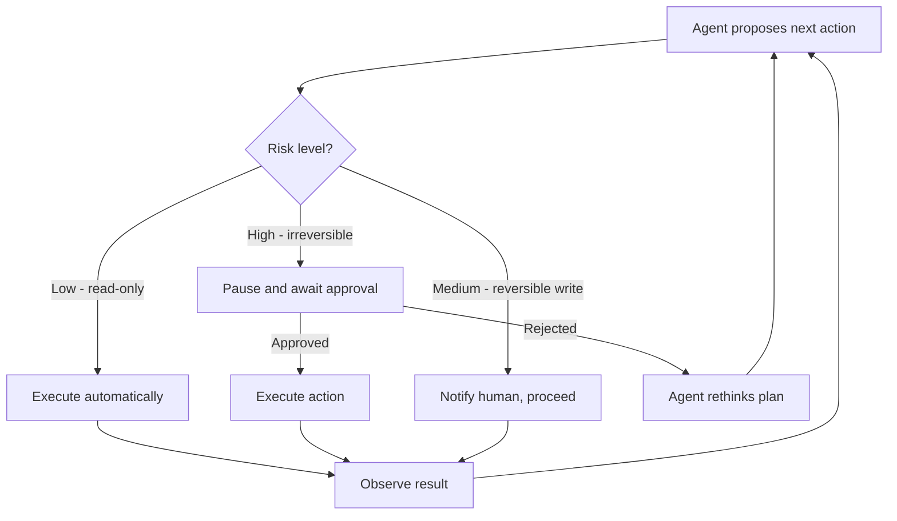

#### Code: Insert human approval checkpoint (Python)

```python
from langgraph.checkpoint.sqlite import SqliteSaver

def requires_approval(state) -> bool:
    return "wire transfer" in (state.get("action_plan") or "").lower()

def await_approval():
    # e.g., Slack button or dashboard toggle
    input("Approve? [enter] ")

if requires_approval(state):
    await_approval()
```

### 6.4. Tool Selection Decision Tree

When an agent faces a task, it must reason through which tool is appropriate before acting.

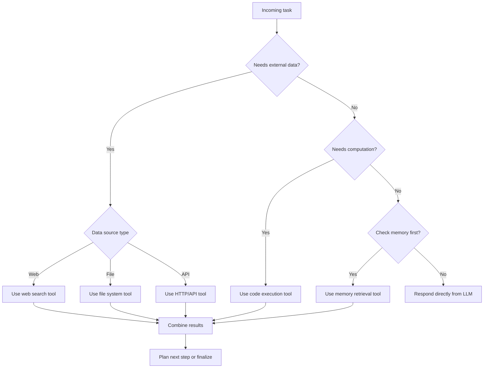

### 6.5. Tools Make the Agent

An agent without tools is just a chatbot with ambition. The real power comes from giving agents ways to interact with the world. Start with basic tools:

- Web search for information gathering
- File system access for data persistence
- API calls for integrations
- Code execution for complex calculations

But here's the secret: the best tools are often the simplest. A well-designed search tool beats a dozen specialized functions.

---

## 7. The Future We're Building

As I write this, we're at an inflection point. The technology for truly agentic systems exists today, but we're just scratching the surface of what's possible.

### 7.1. The Near Future: Specialized Agents

In the next year, I expect to see an explosion of specialized agents. Not general-purpose AI, but expert systems for specific domains:

- Legal agents that can draft contracts and identify risks
- Financial agents that manage portfolios and execute trades
- Research agents that conduct literature reviews and generate hypotheses
- Creative agents that don't just generate content but develop campaigns

These won't replace professionals but will dramatically amplify their capabilities. Imagine a doctor with an agent that's read every medical paper, a lawyer with perfect recall of case law, or a developer with an agent that understands every line of code in a million-line codebase.

### 7.2. The Medium Term: Agent Societies

The really interesting future isn't individual agents but agent ecosystems. I'm already experimenting with multi-agent systems where specialized agents collaborate on complex tasks.

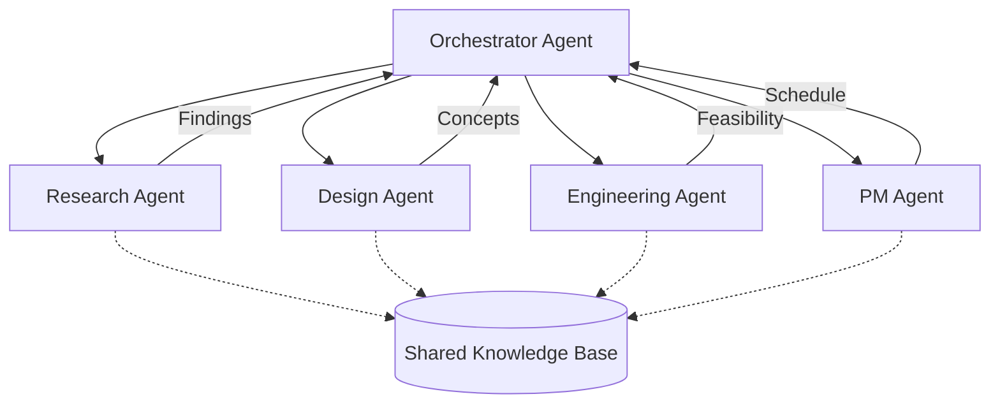

Picture this: a product development team of agents. The market researcher agent identifies opportunities. The designer agent creates concepts. The engineering agent evaluates feasibility. The project manager agent coordinates everything. They negotiate, debate, and iterate - much like a human team but at digital speed.

This isn't science fiction. I have a prototype system where agents with different "personalities" and expertise collaborate on writing projects. The results are fascinating - they challenge each other, build on ideas, and sometimes produce insights none would have reached alone.

### 7.3. The Long Game: Augmented Humanity

The ultimate promise of agentic AI isn't replacing human intelligence but augmenting it. Imagine having a team of expert agents as thought partners, each enhancing different aspects of your cognition.

Your memory agent recalls everything you've ever learned. Your creativity agent generates novel combinations of ideas. Your analytical agent spots patterns you'd miss. Your empathy agent helps understand other perspectives.

This isn't about becoming cyborgs. It's about having AI collaborators so seamlessly integrated into our workflows that they feel like extensions of our own thinking.

---

## 8. A Personal Reflection: What This Means for Us

Six months ago, I was skeptical about agentic AI. Not about the technology - I knew that was coming - but about whether we were ready for it. Would we use it wisely? Would it make us dependent? Would we lose something essentially human in the process?

My experience has been surprisingly optimistic. Working with agents hasn't made me less creative or thoughtful. If anything, it's pushed me to think bigger and more ambitiously. When you're freed from mundane tasks, you have space for the work that matters.

But it's also challenged me. Agents force you to be clear about your goals, rigorous in your thinking, and explicit about your values. You can't hide behind busy work when an agent can do it better. You have to focus on what only humans can do: create meaning, make value judgments, and connect with other humans.

The developers and organizations that will thrive in this new era aren't those with the most sophisticated agents, but those who best understand how to dance with them - maintaining the balance between automation and human judgment, efficiency and empathy, capability and responsibility.

---

## 9. Start Your Journey

If you're ready to explore agentic AI, here are concrete next steps:

### 9.1. For Developers

- **Start with LangGraph**: Build your first stateful agent with clear planning and execution phases
- **Experiment with Memory**: Implement simple episodic memory using vector databases
- **Master Tool Use**: Create custom tools and teach agents when to use them
- **Join the Community**: The agentic AI space is collaborative - share your learnings

#### Quick setup snippets

```bash
# Python
pip install langgraph langchain langchain-openai langgraph-checkpoint-sqlite langchain-mcp-adapters

# TypeScript
npm i @langchain/langgraph @langchain/core @langchain/openai
```

### 9.2. For Organizations

- **Identify Repetitive Workflows**: Look for tasks that require judgment but follow patterns
- **Start Small**: Pilot an agent for a single, well-defined process
- **Measure Impact**: Track not just efficiency but quality and innovation metrics
- **Invest in Understanding**: This technology is strategic - ensure leadership understands it

### 9.3. For Everyone

- **Stay Curious**: This field evolves daily - maintain a learning mindset
- **Think Ethically**: Consider implications before implementing
- **Share Experiences**: We're all learning together
- **Dream Big**: The limits are further than you think

For a deep dive into implementation, check out my [Agentic AI Pipeline](https://github.com/hoangsonww/Agentic-AI-Pipeline) project, where theory meets practice.

---

## 10. MCP Architecture: Server-Client Communication

The Model Context Protocol defines a clean boundary between agent logic and tool servers. The following diagram shows how an agent runtime connects to multiple MCP servers:

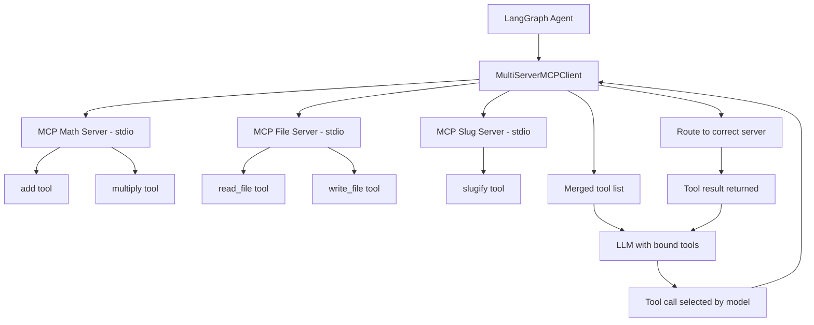

---

## 11. Agent Failure and Recovery State Machine

Production agents must handle failure gracefully. This state machine shows how a well-designed agent recovers from errors without human intervention:

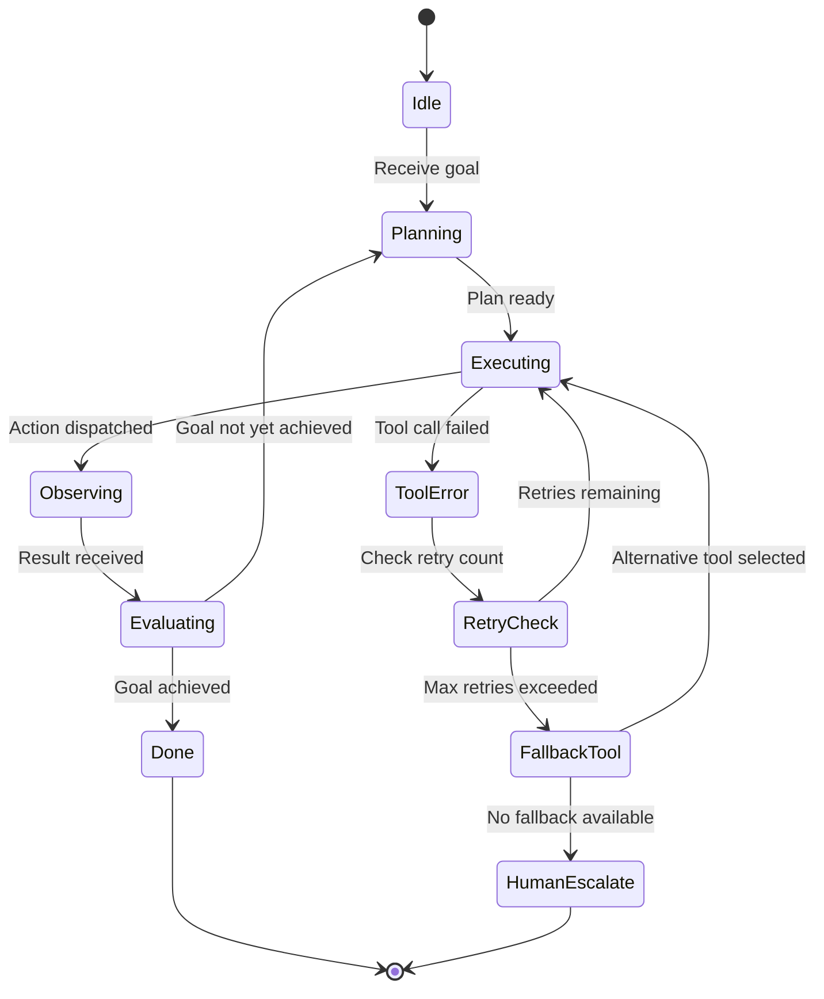

---

## 12. Agentic System Class Relationships

The key components of a LangGraph-based agentic system and how they relate to each other:

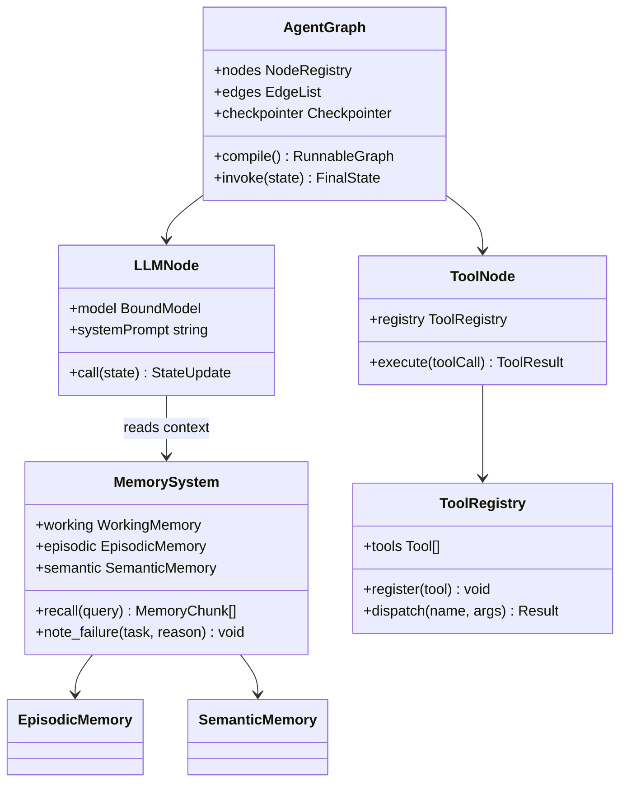

---

## 13. Autonomy Spectrum: From Assistant to Fully Autonomous

Agentic systems exist on a spectrum based on how much human oversight they require:

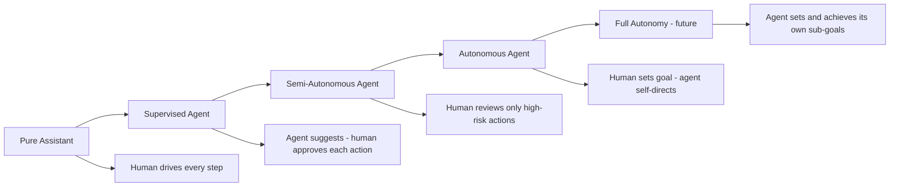

The agentic revolution isn't coming - it's here. The question is: what will you build with it?

---

## 14. Agent Evaluation Frameworks

Shipping an agentic system to production without evaluation infrastructure is flying blind. Unlike traditional software where unit tests catch regressions deterministically, agents fail probabilistically: they may succeed 9 times and fail on the 10th in subtle ways that are hard to detect without structured evaluation.

### 14.1. Why Evaluation is Different for Agents

Standard metrics like accuracy apply to classification tasks. Agents need to be evaluated on multi-step trajectories, not just final outputs. A correct final answer reached through a broken sequence of tool calls is not a reliable agent.

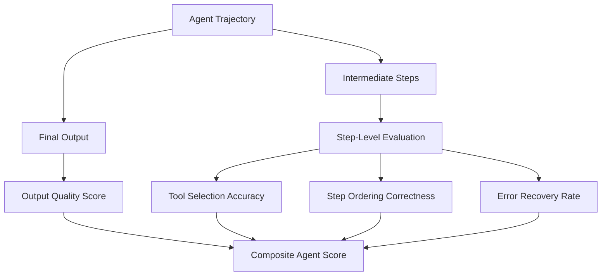

### 14.2. LangSmith Evaluation Pipeline

```python
from langsmith import Client
from langsmith.evaluation import evaluate, LangChainStringEvaluator

client = Client()

# Define your agent as a callable target
def run_agent(inputs: dict) -> dict:
    result = my_agent.invoke({"task": inputs["question"]})
    return {"output": result["final_answer"]}

# Evaluators: correctness, helpfulness, hallucination
evaluators = [
    LangChainStringEvaluator("cot_qa"),        # chain-of-thought QA correctness
    LangChainStringEvaluator("criteria", config={"criteria": "helpfulness"}),
    LangChainStringEvaluator("labeled_score_string"),
]

# Run evaluation against a golden dataset
results = evaluate(
    run_agent,
    data="agent-golden-dataset-v1",  # Dataset stored in LangSmith
    evaluators=evaluators,
    experiment_prefix="prod-agent-v2.3",
    metadata={"model": "claude-3-5-sonnet", "temperature": 0.0},
)

print(f"Average correctness: {results.aggregate_metrics['cot_qa/score']:.2f}")
```

### 14.3. Trajectory-Level Evaluation

Evaluate not just the final answer but whether the agent reached it the right way.

```python
from typing import List

def evaluate_trajectory(
    trajectory: List[dict],
    expected_tools: List[str],
) -> dict:
    """
    Check that the agent called the expected tools in roughly the right order.
    """
    actual_tools = [
        step["tool"] for step in trajectory if step.get("type") == "tool_call"
    ]

    # Tool coverage: did the agent use all required tools?
    coverage = len(set(expected_tools) & set(actual_tools)) / len(expected_tools)

    # Hallucination check: did the agent call tools that don't exist?
    valid_tools = {"search", "read_file", "write_file", "run_tests", "get_schema"}
    hallucinated = [t for t in actual_tools if t not in valid_tools]

    # Efficiency: how many extra steps beyond the minimum needed?
    extra_steps = max(0, len(actual_tools) - len(expected_tools))

    return {
        "tool_coverage": coverage,
        "hallucinated_tools": hallucinated,
        "extra_steps": extra_steps,
        "trajectory_score": coverage * (1 - 0.1 * extra_steps),
    }
```

---

## 15. Cost Management for Production Agents

Agent costs can spiral unexpectedly. A single agent loop that calls a 200K-token model 15 times per task, with 5,000 concurrent users, produces a bill that surprises most teams on first invoice. Cost management is an engineering concern from day one.

### 15.1. Token Cost Attribution

```python
import time
from dataclasses import dataclass, field
from typing import List

@dataclass
class TokenUsage:
    model: str
    input_tokens: int
    output_tokens: int
    cached_input_tokens: int = 0
    timestamp: float = field(default_factory=time.time)

    @property
    def cost_usd(self) -> float:
        # Approximate pricing (verify against provider)
        pricing = {
            "claude-sonnet-4-5": (0.003, 0.015),      # input, output per 1K tokens
            "claude-3-5-haiku-20241022": (0.0008, 0.004),
            "gpt-4o": (0.0025, 0.01),
            "gpt-4o-mini": (0.00015, 0.0006),
        }
        inp_price, out_price = pricing.get(self.model, (0.001, 0.005))
        billed_input = self.input_tokens - self.cached_input_tokens
        return (billed_input / 1000 * inp_price) + (self.output_tokens / 1000 * out_price)


class CostAwareAgent:
    """Wraps an agent with cost tracking and circuit breakers."""

    def __init__(self, agent, cost_limit_usd: float = 0.50):
        self.agent = agent
        self.cost_limit = cost_limit_usd
        self.usage_log: List[TokenUsage] = []

    @property
    def total_cost(self) -> float:
        return sum(u.cost_usd for u in self.usage_log)

    def run(self, task: str) -> str:
        if self.total_cost > self.cost_limit:
            raise RuntimeError(
                f"Cost limit ${self.cost_limit} exceeded. "
                f"Current spend: ${self.total_cost:.4f}"
            )

        result = self.agent.invoke({"task": task})
        usage = TokenUsage(
            model=result["model"],
            input_tokens=result["usage"]["input_tokens"],
            output_tokens=result["usage"]["output_tokens"],
            cached_input_tokens=result["usage"].get("cache_read_input_tokens", 0),
        )
        self.usage_log.append(usage)
        return result["output"]
```

### 15.2. Cost Optimization Strategies

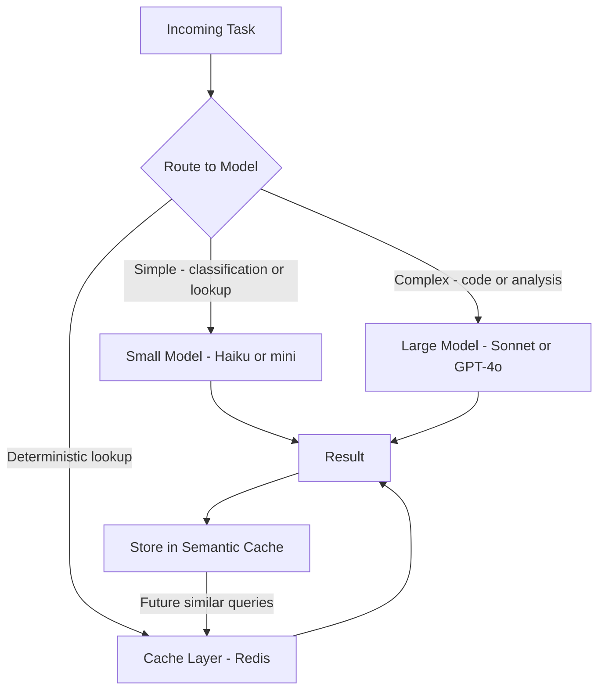

Key strategies to reduce agent spend in production:

1. **Model routing**: Use a cheap model to classify task complexity, then route to the appropriate tier. Most tasks are simple enough for a small model.
2. **Prompt caching**: Anthropic and OpenAI both offer cache pricing for repeated system prompts. A 10K-token system prompt cached across 1,000 runs saves roughly $0.03 per 1,000 requests.
3. **Semantic caching**: Store (query embedding, response) pairs. When a new query is semantically similar to a cached one, return the cached response directly.
4. **Context trimming**: Compress conversation history before each LLM call. Sending 15K tokens of history when 3K would suffice wastes money on every turn.
5. **Early termination**: Detect when the agent is looping and has not made progress in N steps. Bail out and escalate rather than burning tokens indefinitely.

---

## 16. Agent Security and Sandboxing

Agents that can execute code, write files, and call external APIs are powerful. They are also dangerous if not properly sandboxed. Prompt injection, tool abuse, and runaway automation are real production risks.

### 16.1. Threat Model

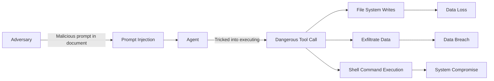

### 16.2. Defense: Tool Allowlisting and Capability Separation

```python
from functools import wraps
from typing import Callable, Set

ALLOWED_TOOLS: Set[str] = {"read_file", "search_docs", "run_tests"}
PRIVILEGED_TOOLS: Set[str] = {"write_file", "execute_shell", "send_email"}

def require_confirmation(tool_fn: Callable):
    """Decorator: privileged tools require explicit human approval."""
    @wraps(tool_fn)
    def wrapper(*args, **kwargs):
        print(f"\nPrivileged tool called: {tool_fn.__name__}")
        print(f"Arguments: {args}, {kwargs}")
        approval = input("Approve? (yes/no): ").strip().lower()
        if approval != "yes":
            raise PermissionError(f"Tool {tool_fn.__name__} denied by operator.")
        return tool_fn(*args, **kwargs)
    return wrapper


def sandbox_tool_call(tool_name: str, args: dict, context: dict) -> dict:
    """
    Enforce tool allowlist and validate arguments before execution.
    Returns the tool result or an error dict.
    """
    if tool_name not in ALLOWED_TOOLS | PRIVILEGED_TOOLS:
        return {"error": f"Unknown tool: {tool_name}. Not in registry."}

    # Path traversal protection for file operations
    if "path" in args:
        import os
        safe_root = "/workspace"
        resolved = os.path.realpath(os.path.join(safe_root, args["path"]))
        if not resolved.startswith(safe_root):
            return {"error": "Path traversal attempt blocked."}

    # Rate limiting per tool
    if context.get(f"{tool_name}_calls", 0) > 20:
        return {"error": f"Rate limit exceeded for tool {tool_name}."}

    return {"approved": True}
```

### 16.3. Defense: Code Execution Sandboxing

When agents need to run code, always execute it in an isolated container with no network access, strict CPU and memory limits, and no access to the host filesystem.

```python
import subprocess
import tempfile
import os

def execute_code_sandboxed(code: str, timeout_seconds: int = 10) -> dict:
    """
    Execute Python code in a restricted Docker container.
    Returns stdout, stderr, and exit code.
    """
    with tempfile.NamedTemporaryFile(suffix=".py", mode="w", delete=False) as f:
        f.write(code)
        script_path = f.name

    try:
        result = subprocess.run(
            [
                "docker", "run",
                "--rm",                          # auto-remove container
                "--network", "none",             # no network access
                "--memory", "128m",              # 128MB memory limit
                "--cpus", "0.5",                 # half a CPU core
                "--read-only",                   # read-only filesystem
                "-v", f"{script_path}:/code.py:ro",
                "python:3.12-slim",
                "python", "/code.py",
            ],
            capture_output=True,
            text=True,
            timeout=timeout_seconds,
        )
        return {
            "stdout": result.stdout,
            "stderr": result.stderr,
            "returncode": result.returncode,
        }
    except subprocess.TimeoutExpired:
        return {"error": "Execution timed out", "returncode": -1}
    finally:
        os.unlink(script_path)

---

## 17. Conclusion: The Journey Ahead

Agentic AI represents a fundamental shift in how we interact with artificial intelligence. We're moving from a world where AI answers our questions to one where AI takes action on our behalf. This transition is both exciting and sobering.

The technology is powerful, but it's not magic. Agents are tools - sophisticated, capable, sometimes surprising tools - but tools nonetheless. Their value comes not from replacing human intelligence but from amplifying it.

As you consider incorporating agentic AI into your work or life, remember this: the goal isn't to automate everything. It's to automate the right things, freeing humans to do what we do best - create, connect, and care.

The future isn't about humans versus agents. It's about humans with agents, building things we never could alone. And that future? It's already here. The question isn't whether to embrace it, but how to shape it.

_What role will you play in this agentic future? What would you build if you had a tireless, intelligent collaborator? The possibilities are limited only by our imagination and our wisdom in pursuing them._
```
