import MdxLayout from "@/components/MdxLayout";

export const metadata = {
  title:
    "Amazon Web Services: A Deep Dive Into the World's Leading Cloud Platforms",
  description:
    "An in-depth exploration of Amazon Web Services, covering its history, core services, architecture, deployment strategies, security best practices, cost optimization, and real-world use cases, with a focus on clarity and accessibility.",
  topics: [
    "Cloud Computing",
    "DevOps",
    "Scalability",
    "System Design",
    "Security",
  ],
};

export default function AWSContent({ children }) {
  return <MdxLayout>{children}</MdxLayout>;
}

# Mastering AWS: A Deep Guide to Amazon Web Services

### Author: Son Nguyen

> Date: 2024-09-30

Amazon Web Services (AWS) is the leading cloud platform in the world, providing a wide range of cloud services that power everything from startups to global enterprises. Whether you're just getting started with cloud computing or looking to deepen your expertise, this comprehensive guide will walk you through everything you need to know about AWS. We’ll cover its history, core services, architecture, security, cost optimization, deployment strategies, and real-world use cases - all in detailed, accessible language.

---

## 1. Introduction

AWS has transformed the way organizations deploy and manage their IT infrastructure. It offers an extensive suite of cloud services that allow you to build, deploy, and scale applications quickly and efficiently. Some of the key benefits include:

- **Scalability:** Easily adjust resources to meet demand.
- **Reliability:** Benefit from a global infrastructure designed for high availability.
- **Security:** Leverage robust security practices and tools.
- **Cost Efficiency:** Pay only for what you use, with flexible pricing models.

In this guide, we aim to provide you with a clear and detailed understanding of AWS, its services, and how you can harness its power for your own projects.

---

## 2. History and Overview of AWS

### 2.1. The Origins of AWS

Launched in 2006, AWS was one of the first cloud platforms to offer on-demand computing resources over the internet. Initially, it started with simple storage and compute services and has since evolved into a comprehensive suite of cloud solutions.

### 2.2. AWS Today

Today, AWS is used by millions of customers worldwide, ranging from startups to Fortune 500 companies. Its services cover computing, storage, databases, networking, machine learning, analytics, Internet of Things (IoT), and much more. AWS continually innovates and expands its service portfolio, keeping it at the forefront of cloud computing.

---

## 3. Core AWS Services

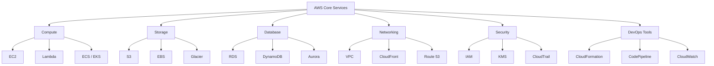

AWS offers hundreds of services. Here we focus on the core categories:

### 3.1 Compute Services

- **Amazon EC2 (Elastic Compute Cloud):**
  Provides resizable compute capacity in the cloud. Use EC2 to launch virtual servers (instances) and configure them to suit your needs.

**Example Use Case:** Hosting web servers, running batch processing jobs, or supporting high-performance computing.

- **AWS Lambda:**
  A serverless computing service that runs code in response to events. You pay only for the compute time you consume.

**Example Use Case:** Real-time file processing, data transformation, and backend services without managing servers.

- **Amazon ECS and EKS:**
  Container services that let you run Docker containers. ECS is AWS’s native service, while EKS provides managed Kubernetes.

### 3.2 Storage Services

- **Amazon S3 (Simple Storage Service):**
  An object storage service that offers industry-leading scalability, data availability, and security.

**Example Use Case:** Storing backup files, static website hosting, or data lakes for big data analytics.

- **Amazon EBS (Elastic Block Store):**
  Provides block-level storage volumes for use with EC2 instances.

**Example Use Case:** Persistent storage for databases or applications running on EC2.

- **Amazon Glacier:**
  Low-cost archival storage designed for data that is infrequently accessed.

### 3.3 Database Services

- **Amazon RDS (Relational Database Service):**
  A managed service for relational databases like MySQL, PostgreSQL, Oracle, and SQL Server.

**Example Use Case:** Running web applications that require a relational database without the hassle of database administration.

- **Amazon DynamoDB:**
  A fully managed NoSQL database service offering fast and predictable performance.

**Example Use Case:** Applications with high throughput requirements, such as gaming or real-time bidding platforms.

- **Amazon Aurora:**
  A high-performance, MySQL- and PostgreSQL-compatible relational database.

### 3.4 Networking and Content Delivery

- **Amazon VPC (Virtual Private Cloud):**
  Enables you to launch AWS resources in a logically isolated network.

**Example Use Case:** Creating secure network environments for sensitive applications.

- **Amazon CloudFront:**
  A content delivery network (CDN) that securely delivers data, videos, and applications to users globally.

**Example Use Case:** Reducing latency for website users across different regions.

- **Amazon Route 53:**
  A scalable Domain Name System (DNS) service that routes end users to internet applications.

### 3.5 Security, Identity, and Compliance

- **AWS IAM (Identity and Access Management):**
  Controls access to AWS services and resources securely.

**Example Use Case:** Defining user roles and permissions for a large team.

- **AWS KMS (Key Management Service):**
  Manages encryption keys used to secure your data.

**Example Use Case:** Encrypting sensitive data stored in S3 or RDS.

- **AWS CloudTrail:**
  Provides logging and monitoring of account activity across your AWS infrastructure.

### 3.6 DevOps and Management Tools

- **AWS CloudFormation:**
  Automates the deployment of AWS resources using templates.

**Example Use Case:** Creating and managing infrastructure as code.

- **Amazon CloudWatch:**
  Monitors AWS resources and applications in real-time.

**Example Use Case:** Setting alarms and dashboards to track performance and health.

- **AWS CodeDeploy, CodePipeline, and CodeBuild:**
  Provide services to automate application deployments, continuous integration, and continuous delivery.

### 3.7 Other Noteworthy Services

- **Machine Learning and AI:**
  Services like Amazon SageMaker, Rekognition, and Comprehend enable machine learning model building, image recognition, and natural language processing.
- **Analytics:**
  Tools such as Amazon Redshift, Athena, and EMR support big data processing and analysis.
- **Internet of Things (IoT):**
  AWS IoT Core helps connect and manage devices at scale.

---

## 4. AWS Global Infrastructure and Architecture

### 4.1. Global Network of Data Centers

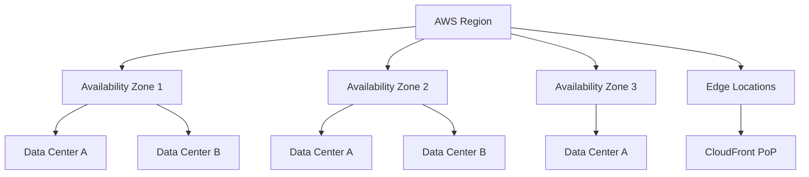

AWS operates in multiple **Regions** around the globe. Each Region contains multiple **Availability Zones (AZs)** - physically separated data centers that offer redundancy and high availability. Additionally, AWS has numerous **Edge Locations** for content delivery via CloudFront.

### 4.2. Designing Resilient Architectures

- **High Availability:**
  Distribute applications across multiple AZs to protect against individual data center failures.
- **Scalability:**
  Use services like Auto Scaling for EC2 to automatically adjust capacity based on demand.
- **Fault Tolerance:**
  Implement strategies like load balancing, redundancy, and backup solutions to ensure continuous operation.

### 4.3. Deployment Strategies

- **Serverless Architectures:**
  Build applications using AWS Lambda, API Gateway, and managed databases for a fully serverless environment.
- **Containerization:**
  Deploy applications using Docker containers orchestrated by Amazon ECS or EKS.
- **Microservices:**
  Break applications into small, independent services that communicate via APIs.

---

## 5. AWS Security Best Practices

### 5.1. Shared Responsibility Model

AWS operates under a shared responsibility model:

- **AWS's Responsibility:**
  Security of the cloud (hardware, software, networking, and facilities).
- **Customer's Responsibility:**
  Security in the cloud (data, identity, application-level controls).

The following diagram shows how the VPC networking layer isolates resources inside an AWS region:

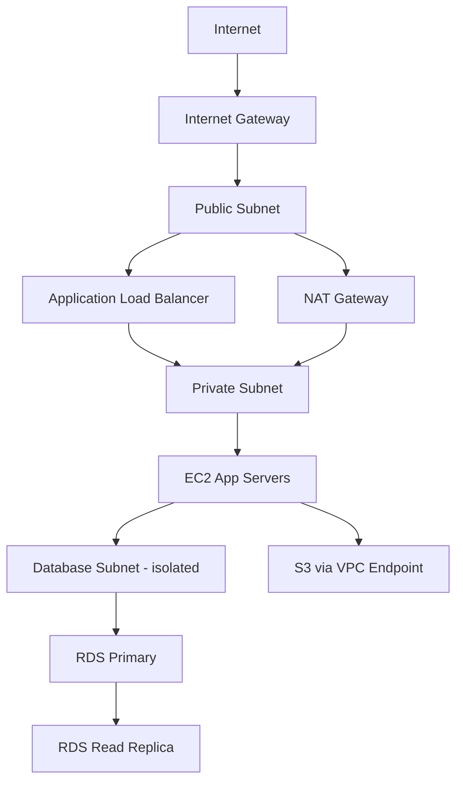

### 5.2. Security Tools and Techniques

- **Identity and Access Management (IAM):**
  Use IAM roles, policies, and multi-factor authentication (MFA) to secure access.
- **Encryption:**
  Encrypt data at rest and in transit using services like KMS and SSL/TLS.
- **Network Security:**
  Configure security groups, network ACLs, and VPC configurations to control traffic.
- **Monitoring and Logging:**
  Enable CloudTrail, CloudWatch, and AWS Config to monitor resource activity and compliance.

---

## 6. Auto-Scaling Sequence

The following diagram shows how EC2 Auto Scaling responds to a traffic spike:

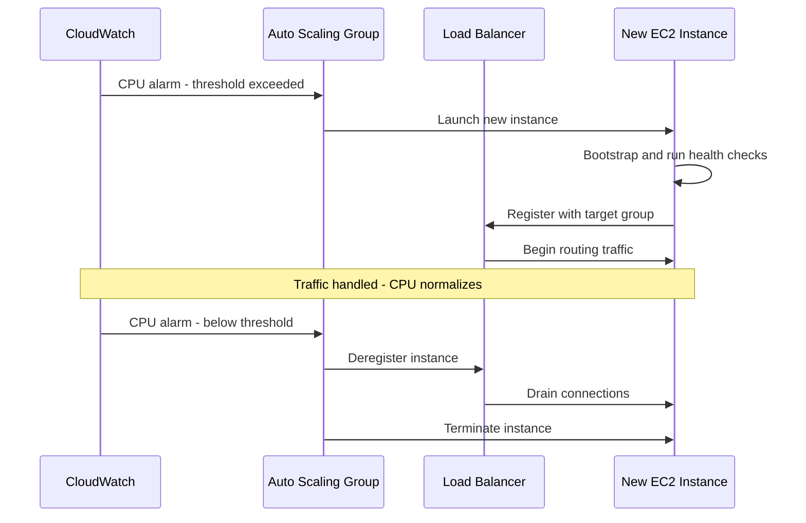

---

## 7. Cost Optimization Strategies

AWS offers flexible pricing models, but cost control requires careful planning:

- **Pay-as-You-Go:**
  Only pay for the services you use.
- **Reserved Instances and Savings Plans:**
  Commit to a usage level for a lower hourly rate.
- **Spot Instances:**
  Utilize spare capacity at a discount, ideal for fault-tolerant workloads.
- **Cost Management Tools:**
  Use AWS Cost Explorer, Budgets, and Trusted Advisor to monitor and optimize spending.

---

## 8. Real-World Use Cases and Case Studies

### 8.1. Enterprise Applications

Large enterprises use AWS to run mission-critical applications with high availability, scalability, and security. For example, companies in finance, healthcare, and retail leverage AWS for processing large volumes of data, ensuring regulatory compliance, and improving customer experiences.

### 8.2. Startups and Innovation

Startups benefit from AWS’s flexible and scalable services, allowing them to innovate rapidly without significant upfront capital expenditure. AWS accelerates product development cycles and enables startups to scale quickly as they grow.

### 8.3. Serverless and Microservices

Organizations are increasingly adopting serverless architectures and microservices to improve agility and reduce operational overhead. AWS Lambda, combined with API Gateway and DynamoDB, is a popular choice for building scalable, event-driven applications.

### 8.4. Global Content Delivery

Content providers use Amazon CloudFront and S3 to deliver high-quality content to users worldwide with minimal latency. This is critical for streaming services, e-commerce, and media companies.

---

## 9. Getting Started with AWS

### 9.1. AWS Free Tier

New users can take advantage of the AWS Free Tier, which provides free usage of many AWS services for 12 months. This is an excellent way to experiment and learn without incurring significant costs.

### 9.2. Learning Resources

- **Official AWS Documentation:**
  Comprehensive guides, tutorials, and best practices are available on the [AWS Documentation site](https://aws.amazon.com/documentation/).
- **Online Courses:**
  Platforms like Coursera, Udemy, and A Cloud Guru offer in-depth AWS training.
- **Certifications:**
  AWS certifications validate your expertise and can boost your career prospects.
- **Community and Forums:**
  Engage with the AWS community through forums, meetups, and Stack Overflow for support and networking.

### 9.3. Tools for Managing AWS

- **AWS Management Console:**
  A web-based interface to manage AWS services.
- **AWS CLI:**
  Command-line tools to automate and manage AWS resources.
- **SDKs:**
  Software Development Kits for various programming languages (Python, Java, JavaScript, etc.) to interact with AWS services programmatically.

---

## 10. AWS Well-Architected Framework Pillars

The AWS Well-Architected Framework provides a consistent approach for evaluating cloud architectures across five pillars:

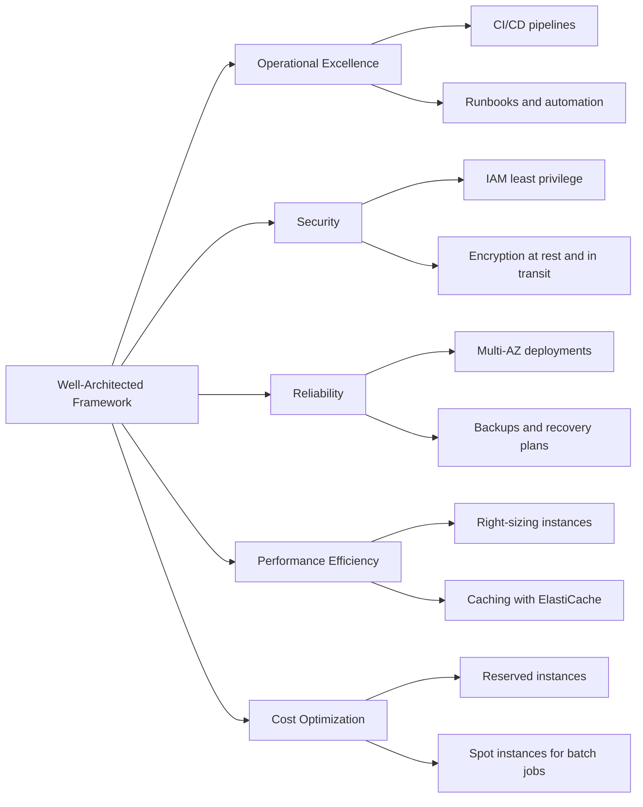

---

## 11. Advanced Topics in AWS

### 11.1. DevOps and Automation

AWS offers robust tools to implement DevOps practices:

- **Infrastructure as Code:**
  Use AWS CloudFormation or Terraform to provision and manage your infrastructure in a reproducible manner.
- **Continuous Integration/Continuous Deployment (CI/CD):**
  Leverage AWS CodePipeline, CodeBuild, and CodeDeploy to automate application deployments.
- **Monitoring and Logging:**
  Set up comprehensive monitoring with CloudWatch and logging with CloudTrail to maintain operational excellence.

### 11.2. Machine Learning and Analytics

AWS provides powerful services for building intelligent applications:

- **Amazon SageMaker:**
  A fully managed service for building, training, and deploying machine learning models.
- **AWS Analytics Services:**
  Utilize Redshift for data warehousing, Athena for interactive querying, and EMR for big data processing.

### 11.3. Serverless Architectures

Embrace the serverless paradigm to reduce operational overhead:

- **AWS Lambda:**
  Run code in response to events without provisioning servers.
- **API Gateway:**
  Build scalable APIs to serve your backend logic.
- **Event-Driven Architectures:**
  Integrate services using SNS, SQS, and EventBridge to build loosely coupled, scalable systems.

---

### 9.1 Cost Optimization in Depth

AWS bills can spiral without deliberate architecture decisions. The following strategies provide concrete savings with practical implementation steps.

### 11.4. Right-Sizing EC2 Instances

The single highest-impact cost action for most teams is running EC2 instances that are significantly over-provisioned. AWS Compute Optimizer analyzes CloudWatch metrics and recommends the optimal instance type.

```bash
# Enable Compute Optimizer across your account
aws compute-optimizer update-enrollment-status \
  --status Active \
  --include-member-accounts

# List EC2 recommendations (output to JSON for analysis)
aws compute-optimizer get-ec2-instance-recommendations \
  --account-ids 123456789012 \
  --output json \
  | jq '.instanceRecommendations[] | {instanceId: .instanceId, currentType: .currentInstanceType, recommendedType: .recommendationOptions[0].instanceType, estimatedSavings: .recommendationOptions[0].estimatedMonthlySavings.value}'
```

### 11.5. Reserved Instance vs Savings Plan Decision Tree

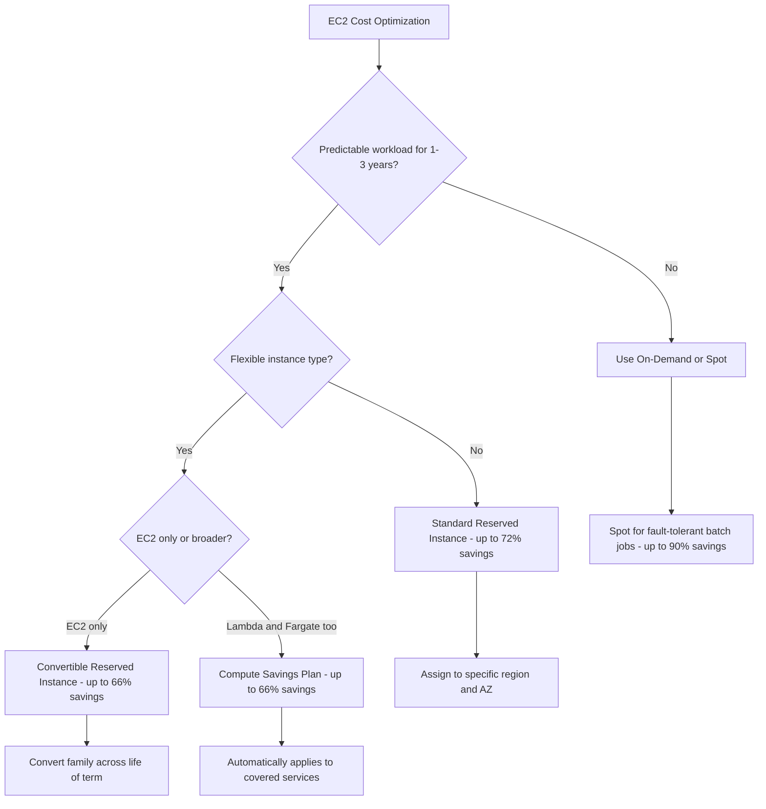

### 11.6. S3 Cost Optimization with Intelligent-Tiering

For large object stores with unpredictable access patterns, S3 Intelligent-Tiering automatically moves objects between access tiers based on usage, with no retrieval fees.

```python
import boto3

s3 = boto3.client("s3")

# Enable Intelligent-Tiering on a bucket with optional archiving tiers
s3.put_bucket_intelligent_tiering_configuration(
    Bucket="my-data-lake-bucket",
    Id="EntireBucketConfig",
    IntelligentTieringConfiguration={
        "Id":     "EntireBucketConfig",
        "Status": "Enabled",
        "Tierings": [
            {"Days": 90,  "AccessTier": "ARCHIVE_ACCESS"},
            {"Days": 180, "AccessTier": "DEEP_ARCHIVE_ACCESS"},
        ],
    },
)
```

### 11.7. Lambda Cost Optimization

Lambda charges per 1ms of execution time and per GB of memory. Over-allocating memory is common; AWS Lambda Power Tuning (an open source Step Functions state machine) finds the optimal memory configuration.

```bash
# Deploy Lambda Power Tuning via SAR
aws serverless-application-model deploy \
  --application-id arn:aws:serverlessrepo:us-east-1:451282441545:applications/aws-lambda-power-tuning \
  --semantic-version 4.3.4

# Invoke the state machine with your function ARN
aws stepfunctions start-execution \
  --state-machine-arn arn:aws:states:us-east-1:123456789012:stateMachine:powerTuningMachine \
  --input '{"lambdaARN":"arn:aws:lambda:us-east-1:123456789012:function:my-function","num":10,"payload":{},"powerValues":[128,256,512,1024,1536,2048]}'
```

### 11.8. Cost Tagging Strategy

Without consistent resource tagging, cost attribution by team, product, or environment is impossible. Enforce tagging at deployment time using an AWS Config rule or SCP.

```json
{
  "Version": "2012-10-17",
  "Statement": [
    {
      "Sid": "DenyUntaggedResources",
      "Effect": "Deny",
      "Action": [
        "ec2:RunInstances",
        "rds:CreateDBInstance",
        "lambda:CreateFunction"
      ],
      "Resource": "*",
      "Condition": {
        "Null": {
          "aws:RequestTag/team": "true",
          "aws:RequestTag/environment": "true",
          "aws:RequestTag/cost-center": "true"
        }
      }
    }
  ]
}
```

---

The Well-Architected Framework is not just a reference document. AWS provides a structured review tool that produces a prioritized list of improvement items for any workload, and running it regularly is how well-run teams keep architectural debt visible and actionable.

### 11.9. Running a Well-Architected Review

```bash
# Create a workload in the AWS Well-Architected Tool
aws wellarchitected create-workload \
  --workload-name "my-ecommerce-platform" \
  --description "B2C e-commerce platform on AWS" \
  --environment PRODUCTION \
  --aws-regions us-east-1 us-west-2 \
  --pillar-priorities operationalExcellence security reliability performanceEfficiency costOptimization

# List milestones after answering questions in the console
aws wellarchitected list-milestones \
  --workload-id <workload-id>

# Export the full lens review to JSON for tracking
aws wellarchitected get-lens-review \
  --workload-id <workload-id> \
  --lens-alias wellarchitected \
  --output json > review-$(date +%Y%m%d).json
```

### 11.10. Reviewing High-Risk Items Programmatically

```python
import boto3
import json

wa = boto3.client("wellarchitected", region_name="us-east-1")

def list_high_risk_issues(workload_id: str, lens_alias: str = "wellarchitected"):
    review = wa.get_lens_review(workloadId=workload_id, lensAlias=lens_alias)
    pillar_summaries = review["LensReview"]["PillarReviewSummaries"]
    high_risk_items = []
    for pillar in pillar_summaries:
        if pillar["RiskCounts"].get("HIGH", 0) > 0:
            high_risk_items.append({
                "pillar":     pillar["PillarName"],
                "high_risks": pillar["RiskCounts"]["HIGH"],
                "medium_risks": pillar["RiskCounts"].get("MEDIUM", 0),
            })
    return sorted(high_risk_items, key=lambda x: x["high_risks"], reverse=True)

issues = list_high_risk_issues("wrkld-12345abcde")
for issue in issues:
    print(f"{issue['pillar']}: {issue['high_risks']} high, {issue['medium_risks']} medium risk items")
```

### 11.11. Well-Architected Review Cadence

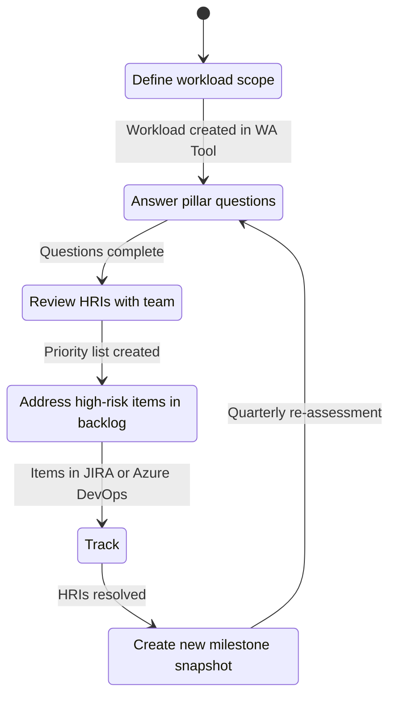

---

Disaster recovery planning is another architectural decision that should happen before a failure forces it. AWS provides four DR strategies at progressively lower RTO/RPO and higher cost, and choosing the right tier depends on the business continuity requirements of each workload.

### 11.12. The Four DR Tiers

| Strategy                 | RTO       | RPO       | Cost       | Description                                             |
| ------------------------ | --------- | --------- | ---------- | ------------------------------------------------------- |
| Backup & Restore         | Hours     | Hours     | Low        | Restore from S3/Glacier snapshots                       |
| Pilot Light              | 10-30 min | Minutes   | Low-Medium | Core services always on in DR region, scale on failover |
| Warm Standby             | Minutes   | Seconds   | Medium     | Scaled-down but running copy in DR region               |
| Multi-Site Active/Active | Seconds   | Near-zero | High       | Full capacity in multiple regions simultaneously        |

### 11.13. Pilot Light Implementation with Route 53 Failover

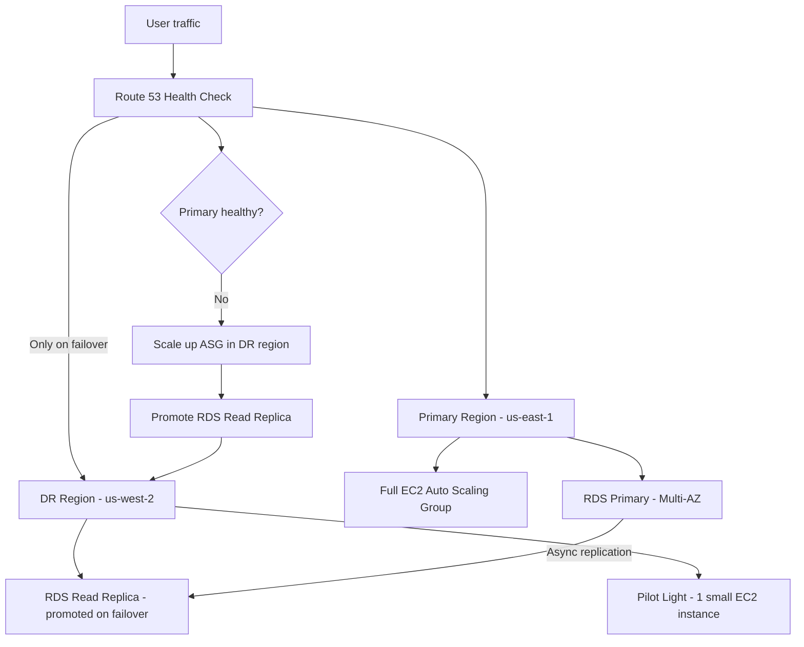

```bash
# Create Route 53 health check for primary endpoint
aws route53 create-health-check \
  --caller-reference "primary-$(date +%s)" \
  --health-check-config '{
    "IPAddress":        "52.10.20.30",
    "Port":             443,
    "Type":             "HTTPS",
    "ResourcePath":     "/health",
    "FailureThreshold": 3,
    "RequestInterval":  10
  }'

# Create failover routing policy record
aws route53 change-resource-record-sets \
  --hosted-zone-id Z1234ABCDE \
  --change-batch '{
    "Changes": [{
      "Action": "CREATE",
      "ResourceRecordSet": {
        "Name":          "api.example.com",
        "Type":          "A",
        "SetIdentifier": "primary",
        "Failover":      "PRIMARY",
        "HealthCheckId": "abc-123-health-check-id",
        "AliasTarget": {
          "HostedZoneId": "Z1234567890",
          "DNSName":      "primary-alb.us-east-1.elb.amazonaws.com",
          "EvaluateTargetHealth": true
        }
      }
    }]
  }'
```

---

### 11.14. Serverless Patterns Deep Dive

Serverless on AWS extends far beyond simple Lambda functions. Production serverless architectures combine Lambda with Step Functions, EventBridge, SQS, SNS, and DynamoDB Streams to build robust event-driven systems.

### 11.15. Fan-Out Pattern with SNS and SQS

Publish an event to SNS, which fans out to multiple SQS queues. Each queue drives a Lambda consumer independently, providing parallel processing with per-consumer dead-letter queues.

```python
import boto3
import json

sns = boto3.client("sns")
sqs = boto3.client("sqs")

# Publish order created event
def publish_order_created(order: dict) -> str:
    response = sns.publish(
        TopicArn="arn:aws:sns:us-east-1:123456789012:order-events",
        Message=json.dumps(order),
        MessageAttributes={
            "eventType": {
                "DataType": "String",
                "StringValue": "ORDER_CREATED",
            }
        },
    )
    return response["MessageId"]

# Lambda consumer for the fulfillment queue
def fulfillment_handler(event, context):
    for record in event["Records"]:
        body  = json.loads(record["body"])
        order = json.loads(body["Message"])
        process_fulfillment(order)
```

### 11.16. Step Functions for Long-Running Workflows

Lambda functions have a 15-minute execution limit. Step Functions orchestrate multi-step, long-running workflows with built-in retry logic, error handling, and state persistence.

```json
{
  "Comment": "Order processing workflow",
  "StartAt": "ValidateOrder",
  "States": {
    "ValidateOrder": {
      "Type": "Task",
      "Resource": "arn:aws:lambda:us-east-1:123456789012:function:validate-order",
      "Retry": [
        {
          "ErrorEquals": ["Lambda.ServiceException"],
          "IntervalSeconds": 2,
          "MaxAttempts": 3
        }
      ],
      "Catch": [{ "ErrorEquals": ["States.ALL"], "Next": "OrderFailed" }],
      "Next": "ChargePayment"
    },
    "ChargePayment": {
      "Type": "Task",
      "Resource": "arn:aws:lambda:us-east-1:123456789012:function:charge-payment",
      "Next": "SendConfirmation"
    },
    "SendConfirmation": {
      "Type": "Task",
      "Resource": "arn:aws:lambda:us-east-1:123456789012:function:send-confirmation",
      "End": true
    },
    "OrderFailed": {
      "Type": "Task",
      "Resource": "arn:aws:lambda:us-east-1:123456789012:function:notify-failure",
      "End": true
    }
  }
}
```

### 11.17. Serverless Architecture Overview

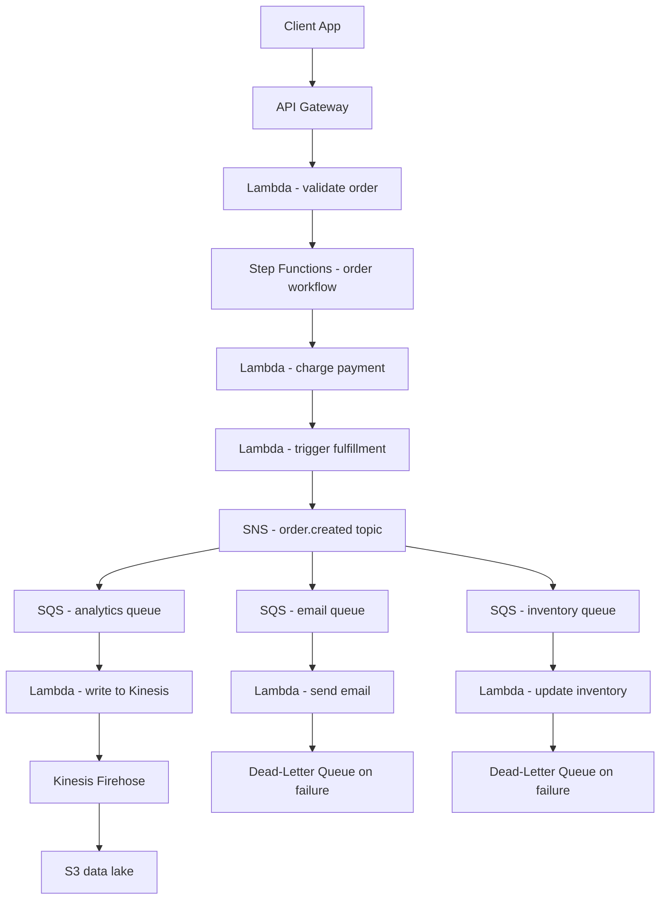

---

## 12. Serverless Request Flow

The following diagram shows how a serverless API request flows through AWS Lambda, API Gateway, and downstream services:

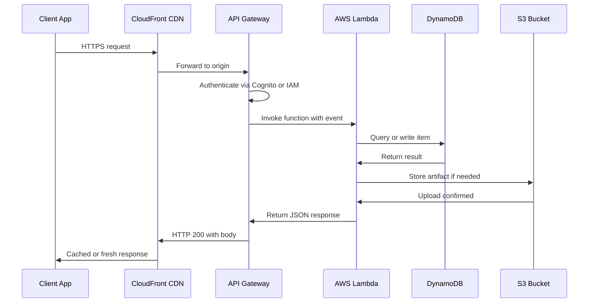

---

## 13. AWS IAM Permission Evaluation Flow

IAM evaluates every API call through a series of checks before granting or denying access:

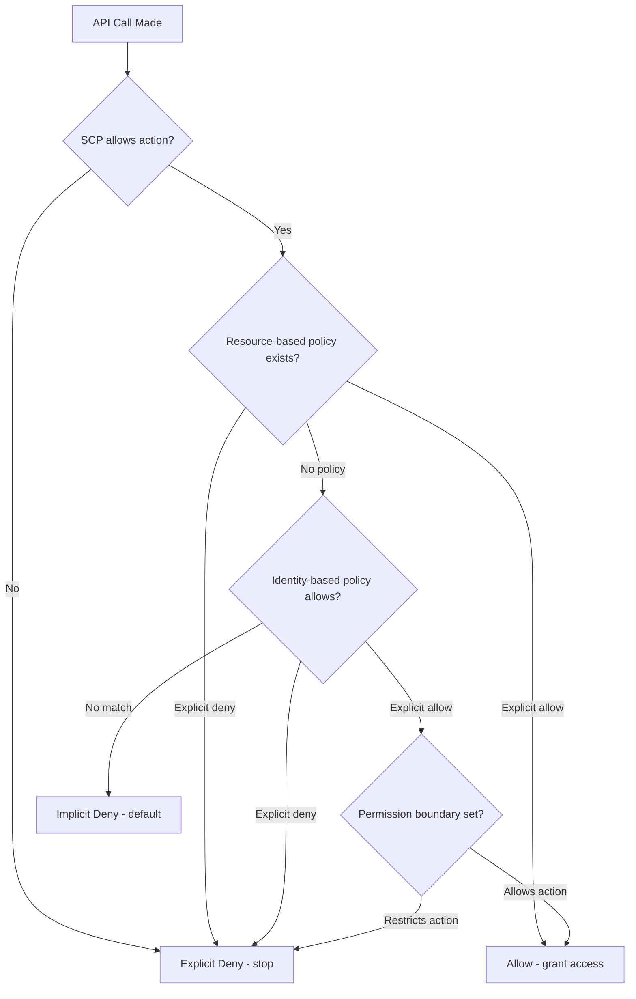

---

## 14. AWS CI/CD Pipeline with CodePipeline

A typical AWS-native CI/CD pipeline connecting source control through to production deployment:

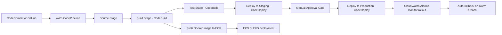

---

## 15. Conclusion

AWS continues to lead the way in cloud computing by offering a vast and evolving portfolio of services that empower businesses and developers alike. With AWS, you can build highly scalable, secure, and cost-effective applications tailored to your needs. This guide has provided an extensive overview of AWS - from its core services and global architecture to security best practices, cost optimization, and advanced deployment strategies.

Armed with this knowledge, you are well-prepared to dive into the AWS ecosystem, experiment with its services, and build solutions that drive innovation. Whether you are an aspiring cloud professional or an experienced engineer looking to optimize your infrastructure, AWS provides the tools and flexibility to help you succeed in a dynamic digital landscape.

_This comprehensive guide is intended to serve as your ultimate resource for mastering AWS. By understanding its core services, deployment strategies, security practices, and advanced topics, you can unlock the full potential of AWS for your projects. Happy cloud computing and best of luck on your journey to mastering Amazon Web Services!_

---

## 16. S3 Storage Class Transition Lifecycle

S3 objects can automatically transition between storage classes based on age, reducing cost for infrequently accessed data:

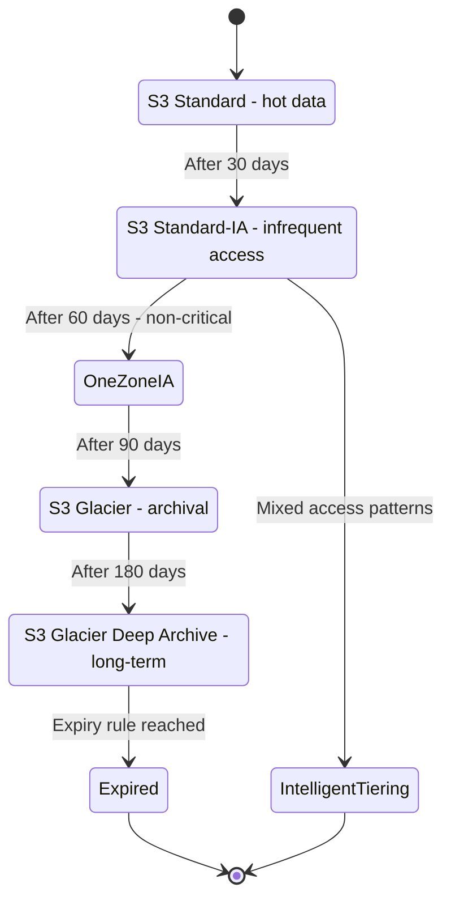
