import MdxLayout from "@/components/MdxLayout";

export const metadata = {
  title: "Building Scalable Event-Driven Microservices with Apache Kafka",
  description:
    "A guide to designing, implementing, and scaling event-driven backend systems using Apache Kafka, with architecture patterns, data modeling, producer/consumer implementations, and more.",
  topics: [
    "Backend Development",
    "Microservices",
    "Apache Kafka",
    "Event-Driven Architecture",
    "Scalability",
  ],
};

export default function KafkaMicroservicesArticle({ children }) {
  return <MdxLayout>{children}</MdxLayout>;
}

# Building Scalable Event-Driven Microservices with Apache Kafka: Patterns and Best Practices

### Author: Son Nguyen

> Date: 2025-04-08

Event-driven architectures are now at the heart of modern backend development, especially for systems that require high throughput, real-time processing, and scalable decoupling between components. Apache Kafka, a distributed streaming platform, has emerged as a cornerstone technology for these systems. In this article, we provide an exhaustive exploration of Kafka’s role in building robust event-driven microservices. We dive into architectural patterns, key theoretical concepts, data modeling strategies, advanced producer and consumer implementations, reliability techniques, monitoring, integration, and deployment best practices. Additionally, we present a full, practical example application that demonstrates how to build an order processing microservice system using Kafka.

---

## 1. Introduction

### 1.1. The Evolution of Backend Architectures

Traditional monolithic systems often struggle with scaling and agility. Event-driven architectures offer several advantages:

- **Loose Coupling:** Services communicate asynchronously by exchanging events, reducing direct dependencies.
- **Scalability:** Systems can absorb fluctuations in load by distributing processing across multiple components.
- **Resilience:** Failure isolation ensures that issues in one service do not cascade system-wide.
- **Real-Time Processing:** Near-instantaneous processing of event streams enables timely decision-making.

### 1.2. Apache Kafka’s Role in Modern Systems

Apache Kafka has become a key component in the event-driven ecosystem due to:

- **High Throughput and Low Latency:** Kafka can process millions of messages per second.
- **Durability and Fault Tolerance:** With data replication and distributed architecture, Kafka ensures data safety and reliable message delivery.
- **Flexible Integration:** Kafka acts as a central message bus that integrates with various processing frameworks and storage systems.

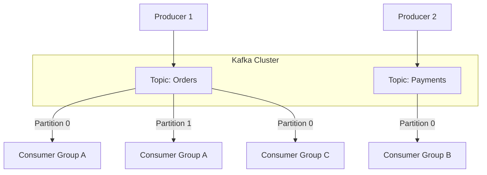

---

## 2. Theoretical Foundations and Architectural Patterns

### 2.1. Core Concepts

Event-driven systems revolve around several fundamental components:

- **Event Producers:** Generate events based on system actions (e.g., an order placed).
- **Event Consumers:** Process events and trigger downstream business logic.
- **Event Streams and Topics:** A durable, ordered log where events are published and from which consumers subscribe. Topics act as channels for different types of events.

### 2.2. Common Architectural Patterns

Key architectural patterns for Kafka-based systems include:

- **Message Broker Pattern:** Decouples producers and consumers by centralizing message passing.
- **Event Sourcing:** Captures state changes as a sequence of events for auditability and state reconstruction.
- **CQRS (Command Query Responsibility Segregation):** Separates the processing of commands (writes) and queries (reads) to optimize performance.
- **Log Compaction:** Retains the latest value for a message key, enabling state rebuilding and handling evolving data.

The following diagram illustrates the CQRS pattern with Kafka as the event backbone:

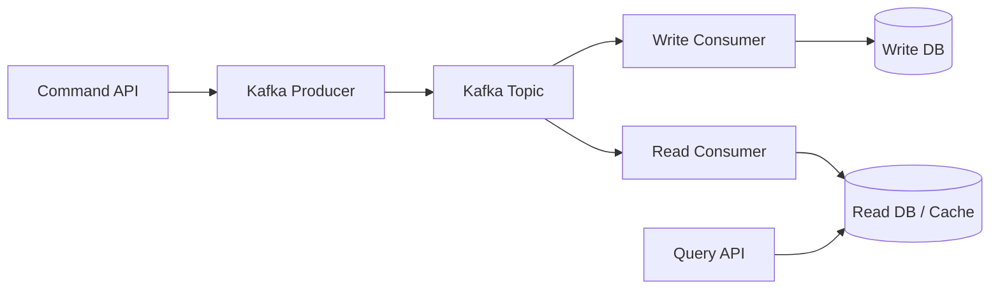

### 2.3. Data Modeling and Schema Management

Successful event-driven systems require:

- **Structured Data Serialization:** Formats like Avro, JSON, or Protobuf help serialize messages consistently.
- **Schema Registry:** Tools like the Confluent Schema Registry allow versioning and evolution of message schemas with minimal disruption.
- **Message Keys for Partitioning:** Defining proper keys ensures that related messages are routed to the same partition, preserving order.

---

## 3. Implementing Kafka-Based Microservices

### 3.1. Environment Setup

Before diving into code, ensure that:

- Apache Kafka is installed and running (locally or via a cloud service).
- Relevant libraries are installed. For Python, you might use:
  ```bash
  pip install kafka-python Flask
  ```

### 3.2. Producer Implementation

Producers are responsible for publishing messages (events) to Kafka topics. Consider this Python example that sends order events:

```python
# file: order_service.py
from flask import Flask, request, jsonify
from kafka import KafkaProducer
import json
import time
import os

app = Flask(__name__)

# Kafka configuration (adjust KAFKA_BROKER as needed)
KAFKA_BROKER = os.environ.get("KAFKA_BROKER", "localhost:9092")
producer = KafkaProducer(
    bootstrap_servers=[KAFKA_BROKER],
    value_serializer=lambda v: json.dumps(v).encode('utf-8'),
)

ORDER_TOPIC = "orders"

@app.route("/order", methods=["POST"])
def create_order():
    data = request.json
    order_id = int(time.time() * 1000)  # Simple unique ID based on timestamp
    order = {
        "order_id": order_id,
        "customer": data.get("customer"),
        "items": data.get("items"),
        "total": data.get("total"),
        "timestamp": time.time()
    }
    # Send order event to Kafka
    producer.send(ORDER_TOPIC, order)
    producer.flush()
    return jsonify({"status": "Order created", "order": order}), 201

if __name__ == "__main__":
    app.run(port=5000, debug=True)
```

### 3.3. Consumer Implementation

Consumers subscribe to Kafka topics and process incoming events. In this example, a consumer listens for order events and processes them:

```python
# file: notification_service.py
from kafka import KafkaConsumer
import json
import os

KAFKA_BROKER = os.environ.get("KAFKA_BROKER", "localhost:9092")

consumer = KafkaConsumer(
    "orders",
    bootstrap_servers=[KAFKA_BROKER],
    auto_offset_reset="earliest",
    value_deserializer=lambda m: json.loads(m.decode("utf-8")),
    group_id="order-notifications"
)

print("Starting Notification Service...")

for message in consumer:
    order = message.value
    print(f"Received Order: {order}")
    # Example: Notify customer (in practice, integrate with an email/SMS service)
    print(f"Notifying customer {order['customer']} for Order ID {order['order_id']}")
```

### 3.4. Containerization and Deployment Considerations

For production deployments:

- **Containerize** your microservices using Docker.
- **Orchestrate** deployments with Kubernetes to manage scaling and fault tolerance.
- **Implement CI/CD** pipelines to automate testing and deployment.

---

## 4. Advanced Reliability and Performance Techniques

### 4.1. Ensuring Durability and Exactly-Once Delivery

Key configurations to enhance reliability include:

- **Replication Factor:** Set higher replication for critical topics.
- **Idempotent Producers:** Enable idempotence to avoid duplicate event processing.
- **Transactional Messaging:** For workflows requiring exactly-once semantics, use Kafka’s transactional APIs.

The following sequence diagram illustrates exactly-once delivery using Kafka transactions:

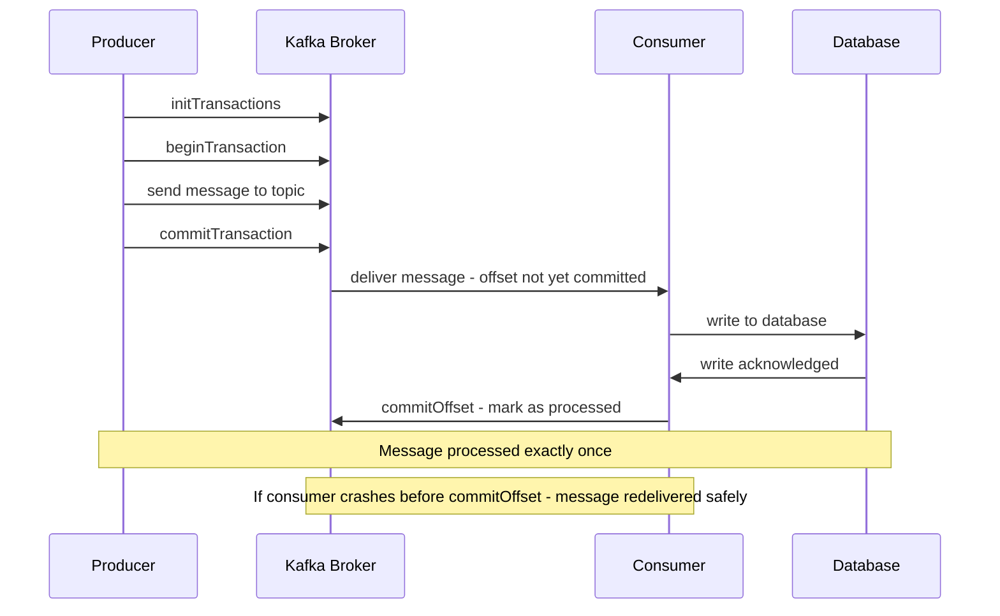

### 4.2. Scaling Consumers and Managing Backpressure

- **Consumer Groups:** Distribute processing across multiple consumers.
- **Partitioning Strategy:** Use meaningful keys to maintain data locality.
- **Monitoring Consumer Lag:** Tools like Kafka Manager help track processing delays.

Consumer group rebalancing happens automatically when consumers join or leave. The diagram below shows the partition reassignment process:

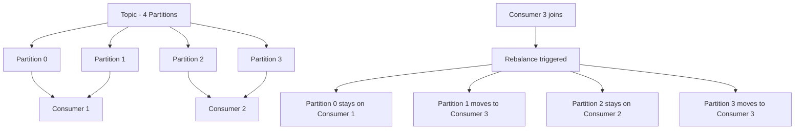

### 4.3. Performance Tuning

- **Batching and Compression:** Adjust producer batch sizes and enable compression (gzip or snappy) for high throughput.
- **Retention Policies:** Tune log retention based on storage and compliance requirements.

---

## 5. Integration, Monitoring, and Continuous Delivery

### 5.1. Stream Processing Topology

For real-time analytics, Kafka Streams enables stateful transformations using a processing topology:

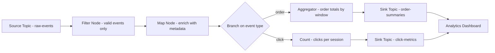

### 5.1. Integrating Microservices

Integrate your Kafka-based services with other backend components:

- **API Gateways:** Route requests to appropriate microservices.
- **Service Meshes:** Employ Istio or Linkerd for secure and observable inter-service communication.
- **Data Pipelines:** Integrate with stream processing frameworks like Apache Flink for real-time analytics.

### 5.2. Observability and Monitoring

Implement robust monitoring with:

- **Dashboards:** Use Grafana and Prometheus to visualize throughput, latency, and consumer lag.
- **Logging:** Aggregate logs with ELK Stack or Fluentd.
- **Alerting:** Set up alerts for critical metrics to ensure quick incident response.

### 5.3. Continuous Integration and Deployment (CI/CD)

- **Automated Testing:** Write integration tests that simulate Kafka interactions.
- **Rolling Updates and Blue/Green Deployments:** Deploy changes with minimal downtime while ensuring system stability.

---

## 6. Full Example Application: Order Processing System

To illustrate the complete workflow, let’s build a simplified order processing system with two microservices:

- **Order Service:** A REST API that accepts orders and publishes them to Kafka.
- **Notification Service:** A consumer that listens for order events and processes them (e.g., sending notifications).

### 6.1. Application Structure

The application consists of the following files:

- `order_service.py` – The Flask-based producer microservice.
- `notification_service.py` – The Kafka consumer microservice.
- `requirements.txt` – List of Python dependencies.

### 6.2. Complete Code

#### File: `order_service.py`

```python
from flask import Flask, request, jsonify
from kafka import KafkaProducer
import json
import time
import os

app = Flask(__name__)

# Kafka broker configuration
KAFKA_BROKER = os.environ.get("KAFKA_BROKER", "localhost:9092")

# Initialize Kafka Producer with JSON serializer
producer = KafkaProducer(
    bootstrap_servers=[KAFKA_BROKER],
    value_serializer=lambda v: json.dumps(v).encode('utf-8'),
)

ORDER_TOPIC = "orders"

@app.route("/order", methods=["POST"])
def create_order():
    data = request.json
    order_id = int(time.time() * 1000)
    order = {
        "order_id": order_id,
        "customer": data.get("customer"),
        "items": data.get("items"),
        "total": data.get("total"),
        "timestamp": time.time()
    }
    # Send order event to Kafka
    producer.send(ORDER_TOPIC, order)
    producer.flush()
    return jsonify({"status": "Order created", "order": order}), 201

if __name__ == "__main__":
    app.run(port=5000, debug=True)
```

#### File: `notification_service.py`

```python
from kafka import KafkaConsumer
import json
import os

# Kafka broker configuration
KAFKA_BROKER = os.environ.get("KAFKA_BROKER", "localhost:9092")

# Initialize Kafka Consumer with JSON deserializer
consumer = KafkaConsumer(
    "orders",
    bootstrap_servers=[KAFKA_BROKER],
    auto_offset_reset="earliest",
    value_deserializer=lambda m: json.loads(m.decode("utf-8")),
    group_id="order-notifications"
)

print("Starting Notification Service...")

# Process incoming order events
for message in consumer:
    order = message.value
    print(f"Received Order: {order}")
    # Simulate processing the order (e.g., notify customer, update database)
    print(f"Notifying customer {order['customer']} for Order ID {order['order_id']}")
```

#### File: `requirements.txt`

```
Flask==2.2.2
kafka-python==2.0.2
```

### 6.3. Running the Application

1. **Start Kafka:**
   Ensure you have Kafka running on `localhost:9092`. You can use Docker for a quick setup:

```bash
docker run -d --name zookeeper -p 2181:2181 confluentinc/cp-zookeeper:latest
docker run -d --name kafka -p 9092:9092 --link zookeeper:zookeeper \
    -e KAFKA_ZOOKEEPER_CONNECT=zookeeper:2181 \
    -e KAFKA_ADVERTISED_LISTENERS=PLAINTEXT://localhost:9092 \
    confluentinc/cp-kafka:latest
```

2. **Run Order Service:**
   In one terminal, navigate to the project directory and run:

```bash
python order_service.py
```

This starts the API on port 5000.

3. **Run Notification Service:**
   In another terminal, run:

```bash
python notification_service.py
```

The consumer will start listening for order events.

4. **Test Order Creation:**
   Use a tool like curl or Postman to send a POST request:

```bash
curl -X POST -H "Content-Type: application/json" \
-d '{"customer": "Alice", "items": ["widget", "gadget"], "total": 59.99}' \
http://localhost:5000/order
```

You should see confirmation from the order service and corresponding output in the notification service's terminal.

---

## 7. Kafka Connect Deep Dive

Kafka Connect is a framework for reliably streaming data between Kafka and external systems (databases, cloud storage, search engines) without writing custom producer/consumer code.

### 7.1 Connect Architecture

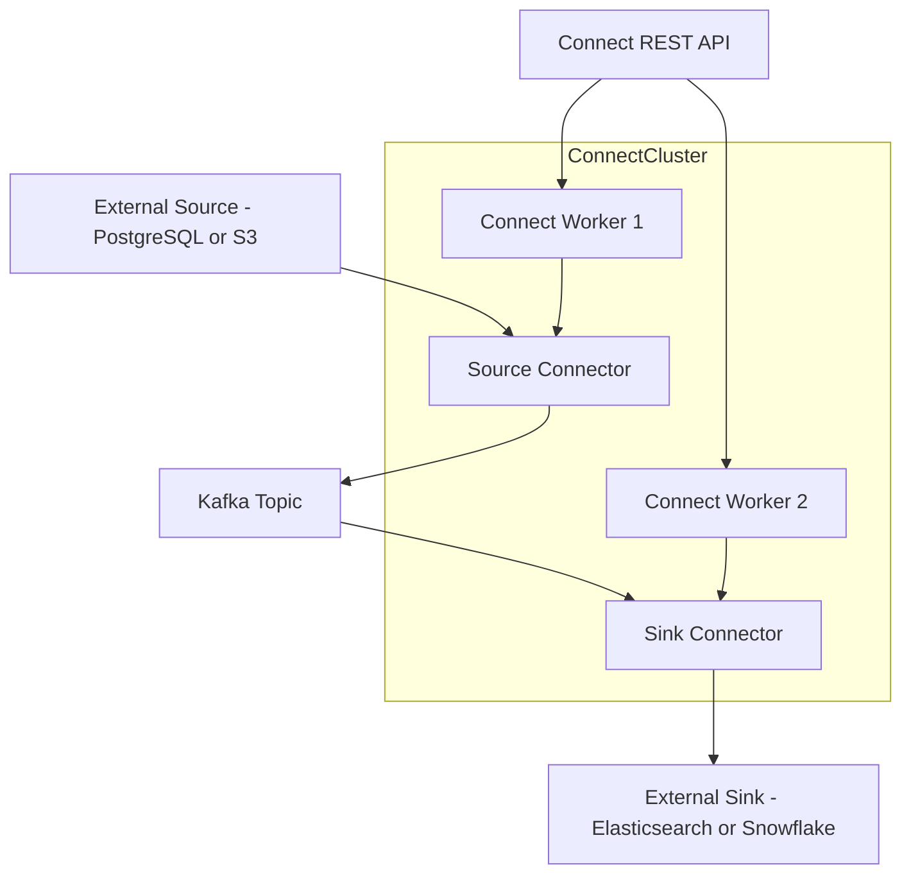

### 7.2 Deploying the Debezium PostgreSQL Source Connector

Debezium captures row-level changes from the PostgreSQL write-ahead log (WAL) and streams them as Kafka events, enabling zero-downtime database migrations and event sourcing:

```bash
# Deploy Debezium PostgreSQL connector via Kafka Connect REST API
curl -X POST http://localhost:8083/connectors \
  -H "Content-Type: application/json" \
  -d '{
    "name": "postgres-source-connector",
    "config": {
      "connector.class": "io.debezium.connector.postgresql.PostgresConnector",
      "database.hostname": "postgres",
      "database.port": "5432",
      "database.user": "debezium",
      "database.password": "dbz",
      "database.dbname": "ecommerce",
      "database.server.name": "ecommerce",
      "table.include.list": "public.orders,public.inventory",
      "plugin.name": "pgoutput",
      "slot.name": "debezium_slot",
      "publication.name": "dbz_publication",
      "transforms": "unwrap",
      "transforms.unwrap.type": "io.debezium.transforms.ExtractNewRecordState",
      "transforms.unwrap.add.fields": "op,ts_ms",
      "key.converter": "org.apache.kafka.connect.json.JsonConverter",
      "value.converter": "org.apache.kafka.connect.json.JsonConverter"
    }
  }'
```

### 7.3 Elasticsearch Sink Connector

```bash
curl -X POST http://localhost:8083/connectors \
  -H "Content-Type: application/json" \
  -d '{
    "name": "elasticsearch-sink-connector",
    "config": {
      "connector.class": "io.confluent.connect.elasticsearch.ElasticsearchSinkConnector",
      "tasks.max": "2",
      "topics": "ecommerce.public.orders",
      "connection.url": "http://elasticsearch:9200",
      "type.name": "_doc",
      "key.ignore": "false",
      "schema.ignore": "true",
      "behavior.on.malformed.documents": "warn",
      "behavior.on.null.values": "delete",
      "flush.timeout.ms": "10000"
    }
  }'
```

---

At-least-once delivery is the Kafka default; achieving exactly-once requires both idempotent producers and transactional consumers. The pattern is commonly called the "read-process-write" transaction.

### 7.4. Transactional Producer and Consume-Transform-Produce

```python
from kafka import KafkaProducer, KafkaConsumer
from kafka.errors import KafkaError
import json, os

KAFKA_BROKER = os.environ.get("KAFKA_BROKER", "localhost:9092")
TRANSACTIONAL_ID = "order-enrichment-service-1"

# Idempotent transactional producer
producer = KafkaProducer(
    bootstrap_servers=[KAFKA_BROKER],
    enable_idempotence=True,
    transactional_id=TRANSACTIONAL_ID,
    acks="all",
    retries=2147483647,
    max_in_flight_requests_per_connection=5,
    value_serializer=lambda v: json.dumps(v).encode("utf-8"),
)
producer.init_transactions()

consumer = KafkaConsumer(
    "orders",
    bootstrap_servers=[KAFKA_BROKER],
    group_id="order-enrichment-group",
    auto_offset_reset="earliest",
    enable_auto_commit=False,  # Manual commit inside transaction
    isolation_level="read_committed",  # Only read committed messages
    value_deserializer=lambda m: json.loads(m.decode("utf-8")),
)

def enrich_order(order):
    """Add tax calculation and fulfillment region to order."""
    order["tax"] = round(order["total"] * 0.08, 2)
    order["region"] = "us-east-1" if order.get("zipCode", "00000") < "50000" else "us-west-2"
    return order

for message in consumer:
    order = message.value
    enriched = enrich_order(order)

    try:
        producer.begin_transaction()
        # Write enriched order to output topic
        producer.send("orders-enriched", enriched)
        # Commit the consumer offset as part of the same transaction
        producer.send_offsets_to_transaction(
            {message.partition: message.offset + 1 for _ in [message]},
            consumer.config["group_id"]
        )
        producer.commit_transaction()
    except KafkaError as e:
        producer.abort_transaction()
        print(f"Transaction aborted: {e}")
```

The sequence below traces the atomicity guarantee through the full consume-transform-produce cycle:

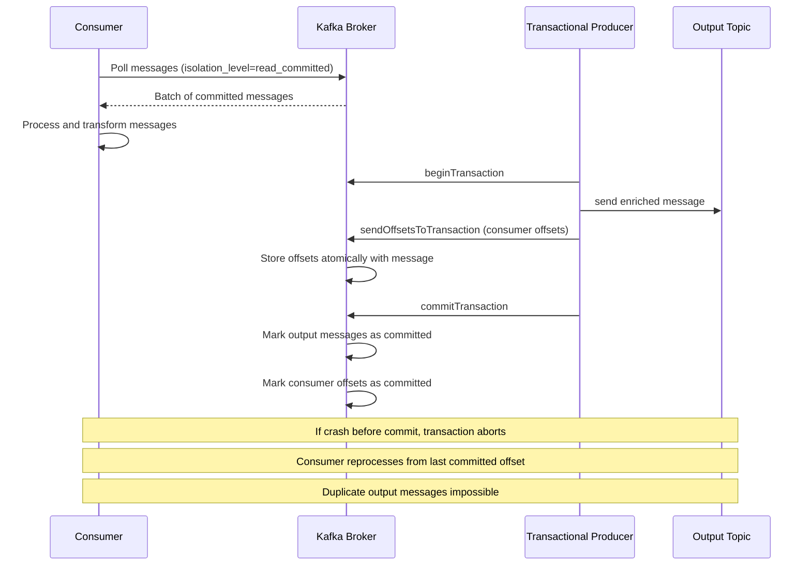

---

Kafka Streams is a client library for building stateful stream processing applications. Windowing is essential for aggregations over time-bounded slices of an event stream.

### 7.5. Tumbling Window Aggregation

```java
import org.apache.kafka.streams.*;
import org.apache.kafka.streams.kstream.*;
import java.time.Duration;
import java.util.Properties;

public class OrderWindowAggregator {
    public static void main(String[] args) {
        Properties props = new Properties();
        props.put(StreamsConfig.APPLICATION_ID_CONFIG, "order-window-aggregator");
        props.put(StreamsConfig.BOOTSTRAP_SERVERS_CONFIG, "localhost:9092");

        StreamsBuilder builder = new StreamsBuilder();

        KStream<String, Order> orders = builder.stream("orders",
            Consumed.with(Serdes.String(), new JsonSerde<>(Order.class)));

        // Tumbling window: non-overlapping 5-minute buckets
        KTable<Windowed<String>, Long> orderCountByRegion = orders
            .selectKey((k, order) -> order.getRegion())
            .groupByKey()
            .windowedBy(TimeWindows.ofSizeWithNoGrace(Duration.ofMinutes(5)))
            .count(Materialized.as("order-count-store"));

        orderCountByRegion.toStream()
            .map((windowedRegion, count) -> KeyValue.pair(
                windowedRegion.key(),
                new RegionSummary(windowedRegion.key(), count, windowedRegion.window().startTime())
            ))
            .to("order-region-summaries", Produced.with(Serdes.String(), new JsonSerde<>(RegionSummary.class)));

        KafkaStreams streams = new KafkaStreams(builder.build(), props);
        streams.start();
        Runtime.getRuntime().addShutdownHook(new Thread(streams::close));
    }
}
```

The four standard window types each suit a different class of aggregation problem:

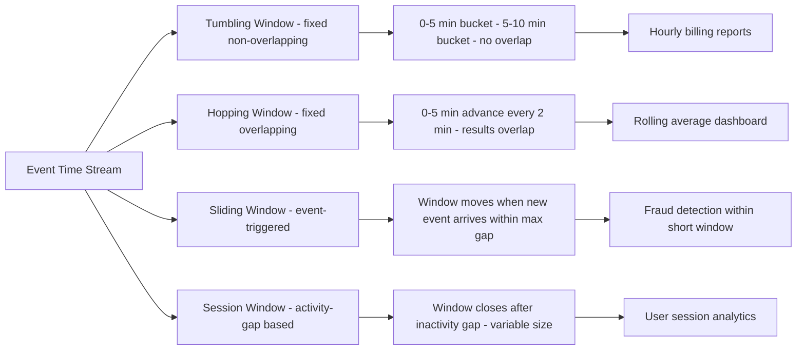

---

In a microservices environment, producers and consumers evolve independently. The Schema Registry enforces compatibility rules so consumers never break when producers update their event schemas.

### 7.6. Avro Schema Registration and Evolution

```python
from confluent_kafka import Producer
from confluent_kafka.schema_registry import SchemaRegistryClient
from confluent_kafka.schema_registry.avro import AvroSerializer
from confluent_kafka.serialization import SerializationContext, MessageField

SCHEMA_REGISTRY_URL = "http://localhost:8081"
KAFKA_BROKER = "localhost:9092"

# Version 1 of the Order schema
ORDER_SCHEMA_V1 = """
{
  "type": "record",
  "name": "Order",
  "namespace": "com.example.ecommerce",
  "fields": [
    {"name": "orderId", "type": "long"},
    {"name": "customerId", "type": "string"},
    {"name": "total", "type": "double"}
  ]
}
"""

# Version 2 adds an optional field with a default - backward compatible
ORDER_SCHEMA_V2 = """
{
  "type": "record",
  "name": "Order",
  "namespace": "com.example.ecommerce",
  "fields": [
    {"name": "orderId", "type": "long"},
    {"name": "customerId", "type": "string"},
    {"name": "total", "type": "double"},
    {"name": "currency", "type": "string", "default": "USD"}
  ]
}
"""

schema_registry_conf = {"url": SCHEMA_REGISTRY_URL}
schema_registry_client = SchemaRegistryClient(schema_registry_conf)

# Register v2 schema - registry checks backward compatibility automatically
from confluent_kafka.schema_registry import Schema
schema_id = schema_registry_client.register_schema(
    "orders-value",
    Schema(ORDER_SCHEMA_V2, "AVRO")
)
print(f"Registered schema ID: {schema_id}")
```

The compatibility mode chosen for each topic determines which schema changes are safe to make without redeploying consumers:

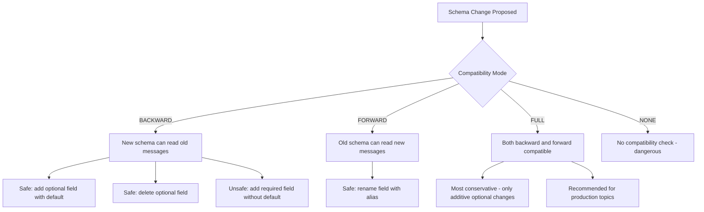

---

## 8. Kafka Topic Anatomy

Understanding how a Kafka topic is physically organized helps with partition key design and consumer group assignments:

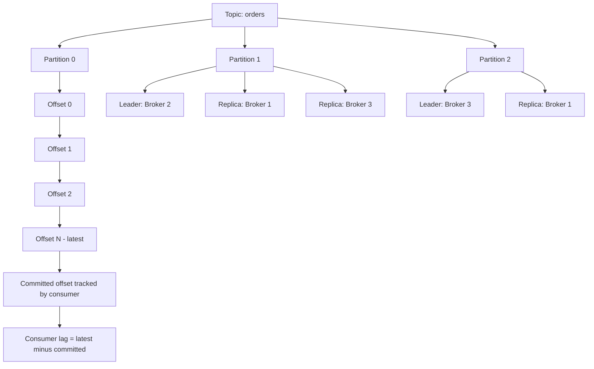

---

## 9. Producer Configuration Decision Tree

Choosing the right producer reliability settings depends on the use case:

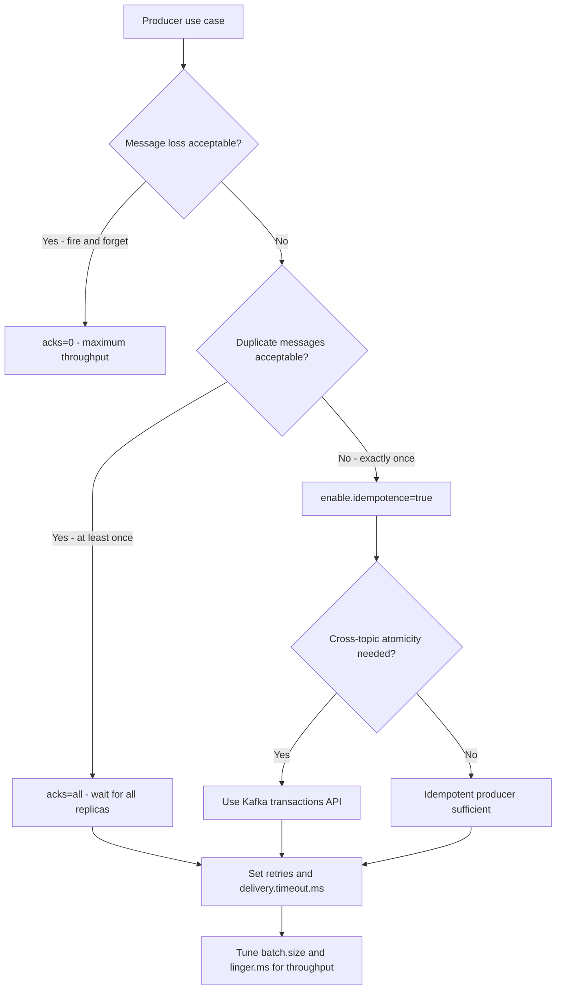

---

## 10. Event-Driven Microservices Interaction

The following sequence shows how multiple microservices interact through Kafka topics in the order processing system:

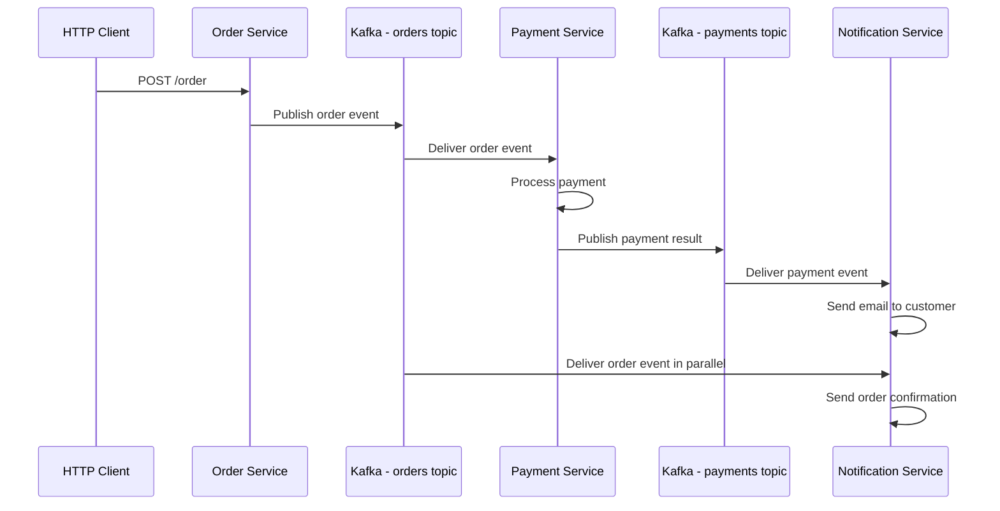

---

## 11. Kafka Cluster Component Relationships

Key components of a Kafka cluster and how they relate at the system level:

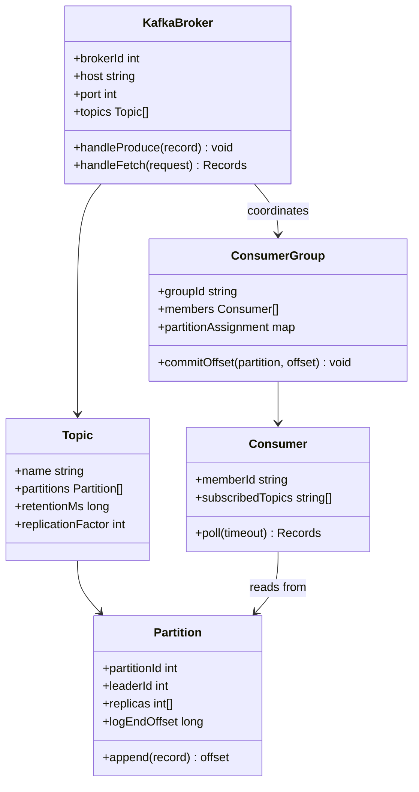

---

## 12. Conclusion

Apache Kafka provides a robust foundation for building scalable, event-driven backend systems. By leveraging effective architectural patterns, reliable data modeling, and advanced performance tuning, you can construct microservices that decouple processing and handle high-throughput environments. This article detailed the theoretical concepts, implementation strategies, and operational practices involved in building Kafka-based systems. The full example application demonstrated a complete order processing system, serving as a practical reference to jump-start your own projects.

---

## 13. Further Resources

- **Apache Kafka Documentation:** [https://kafka.apache.org/documentation/](https://kafka.apache.org/documentation/)
- **Confluent Resources:** [https://www.confluent.io/resources/](https://www.confluent.io/resources/)
- **Kafka Streams and KSQL:** Explore advanced stream processing techniques.
- **Docker & Kubernetes Documentation:** For containerization and orchestration best practices.
- **Observability Tools:** Learn more about Prometheus, Grafana, and the ELK Stack for monitoring.

Embrace event-driven microservices with Apache Kafka to unlock unparalleled scalability and flexibility in your backend systems. Continue to explore, experiment, and innovate in this dynamic domain. Happy coding and architecting robust distributed systems!
