import MdxLayout from "@/components/MdxLayout";

export const metadata = {
  title: "Advanced Authentication Solutions with Auth0",
  description:
    "A comprehensive guide to integrating Auth0 for secure authentication and authorization. This article covers theoretical foundations, architectural patterns, role-based access control, and more.",
  topics: [
    "Backend Development",
    "Authentication",
    "Security",
    "Web Development",
    "API Design",
  ],
};

export default function Auth0Article({ children }) {
  return <MdxLayout>{children}</MdxLayout>;
}

# Implementing Advanced Authentication Solutions with Auth0: Strategies and Best Practices

### Author: Son Nguyen

> Date: 2025-03-08

Modern applications increasingly rely on robust authentication and authorization mechanisms to protect user data and ensure secure interactions. Auth0 has emerged as a leader in providing a flexible, scalable, and feature-rich authentication-as-a-service platform. This article offers an exhaustive exploration of integrating Auth0 into your applications. We dive deep into theoretical foundations, core identity management concepts, architectural patterns, multi-factor authentication (MFA), role-based access control (RBAC), API security, and advanced best practices. Additionally, a full example application demonstrates how to secure both frontend and backend components using Auth0.

---

## 1. Introduction

### 1.1. The Importance of Robust Authentication

Securing applications is no longer just about protecting data - it's about building trust with users. Strong authentication and authorization systems ensure that:

- **Only Authorized Users Gain Access:** Prevent unauthorized access through secure login processes.
- **User Data Remains Confidential:** Protect sensitive information with robust identity verification.
- **Compliance Requirements Are Met:** Support privacy regulations (e.g., GDPR, HIPAA) with secure identity management.
- **Enhanced User Experience:** Provide seamless sign-in options such as social logins and single sign-on (SSO).

### 1.2. Why Auth0?

Auth0 provides a complete suite of identity management solutions that empower developers to focus on application logic rather than building and maintaining authentication systems. Key benefits include:

- **Out-of-the-Box Security Features:** MFA, anomaly detection, and passwordless authentication.
- **Scalability:** Easily handle millions of users across distributed environments.
- **Extensibility:** Integrate with various programming languages and frameworks.
- **Compliance and Best Practices:** Built-in features to support regulatory and industry standards.

---

## 2. Theoretical Foundations and Core Concepts in Identity Management

### 2.1. Authentication vs. Authorization

- **Authentication:** Confirms a user's identity - typically through login credentials, social logins, or biometric data.
- **Authorization:** Determines what an authenticated user is permitted to do. This often involves role-based access control (RBAC) and permissions management.

### 2.2. Key Terms and Concepts

- **Identity Provider (IdP):** A service (such as Auth0) that authenticates and manages user identities.
- **Tokens:** Secure data structures (e.g., JSON Web Tokens or JWTs) used to carry claims between parties.
- **Single Sign-On (SSO):** Allows users to authenticate once and access multiple applications securely.
- **Multi-Factor Authentication (MFA):** Adds an extra layer of security by requiring additional forms of verification.
- **OAuth 2.0 and OpenID Connect (OIDC):** Protocols that underpin modern authentication and authorization systems.

### 2.3. Architectural Patterns for Secure Identity Management

- **Centralized Authentication:** Use an Identity Provider (Auth0) to manage all user identities and credentials.
- **Token-Based Authorization:** Utilize JWTs to manage session state and authorize API requests without maintaining session data on the server.
- **Microservices Security:** Protect distributed architectures by validating tokens at the API gateway level and in each microservice.

---

## 3. Integrating Auth0 in Your Application

### 3.1. Overview of Auth0 Integration Flow

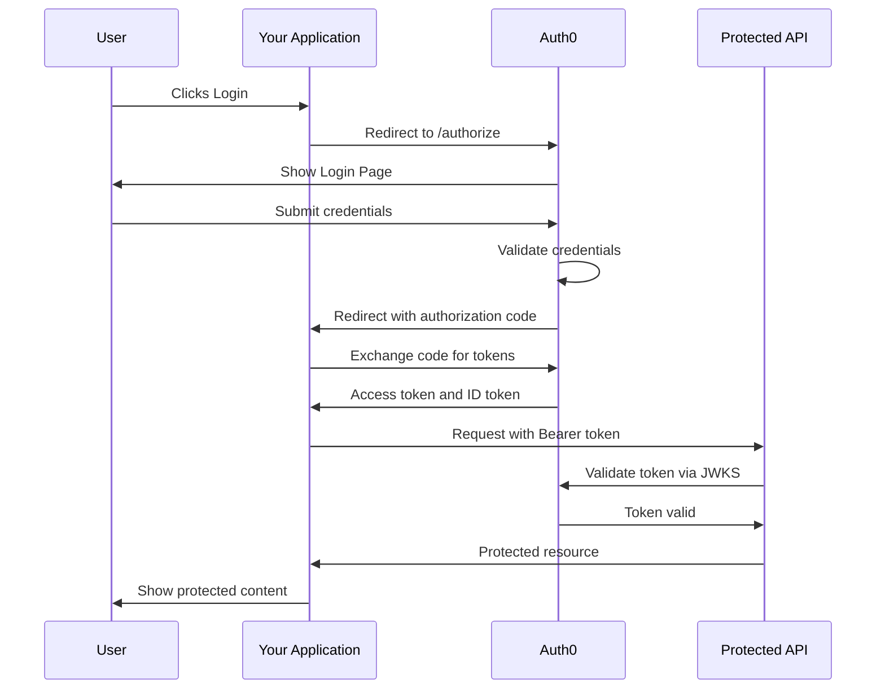

Integrating Auth0 typically involves:

- **Configuring an Auth0 Application:** Set up application settings, including allowed callback URLs and logout URLs.
- **Implementing the Login Flow:** Redirect users to Auth0's hosted login page or embed customizable login forms.
- **Token Management:** Securely manage access tokens and ID tokens for authenticated sessions.
- **Securing APIs:** Validate tokens on every API request to ensure the user is authorized.

### 3.2. Best Practices for Authentication with Auth0

- **Implement MFA:** Enhance security by enabling multi-factor authentication for high-risk scenarios.
- **Use Refresh Tokens:** Maintain long-lived sessions securely without forcing frequent re-logins.
- **Adopt RBAC:** Leverage Auth0's role-based access control capabilities to manage fine-grained user permissions.
- **Regularly Audit and Rotate Secrets:** Maintain security best practices by periodically updating your client secrets and keys.
- **Monitor for Suspicious Activity:** Use Auth0’s anomaly detection and logging to keep track of potentially malicious activities.

---

## 4. Full Example Application: Securing a Node.js API with Auth0

Below is a complete example application that demonstrates how to secure a Node.js API using Auth0 for authentication and authorization. This example uses Express for the API, along with middleware to validate JWTs issued by Auth0.

### 4.1. Application Structure

The application consists of the following files:

- `server.js` – The main API server.
- `auth.js` – Authentication middleware to validate JWTs.
- `package.json` – Contains project dependencies.
- `README.md` – (Optional) Documentation for running the app.

### 4.2. Complete Code

#### File: `server.js`

```javascript
const express = require("express");
const jwt = require("express-jwt");
const jwksRsa = require("jwks-rsa");
const bodyParser = require("body-parser");
require("dotenv").config();

const app = express();
const PORT = process.env.PORT || 3000;

app.use(bodyParser.json());

// Auth0 configuration
const authConfig = {
  domain: process.env.AUTH0_DOMAIN,
  audience: process.env.AUTH0_AUDIENCE,
};

// Authentication middleware. When used, the
// Access Token must exist and be verified against
// the Auth0 JSON Web Key Set
const checkJwt = jwt({
  // Dynamically provide a signing key based on the kid in the header and the signing keys provided by the JWKS endpoint.
  secret: jwksRsa.expressJwtSecret({
    cache: true,
    rateLimit: true,
    jwksRequestsPerMinute: 5,
    jwksUri: `https://${authConfig.domain}/.well-known/jwks.json`,
  }),
  // Validate the audience and the issuer.
  audience: authConfig.audience,
  issuer: `https://${authConfig.domain}/`,
  algorithms: ["RS256"],
});

// Public route
app.get("/public", (req, res) => {
  res.json({
    message:
      "Hello from a public endpoint! You don't need to be authenticated to see this.",
  });
});

// Private route - accessible only with valid JWT
app.get("/private", checkJwt, (req, res) => {
  res.json({
    message:
      "Hello from a private endpoint! You need to be authenticated to see this.",
  });
});

// Role-based route example
app.get("/admin", checkJwt, (req, res) => {
  // In a real application, you'd check for roles in req.user (set by Auth0 rules)
  if (
    req.user &&
    req.user.permissions &&
    req.user.permissions.includes("admin:access")
  ) {
    res.json({ message: "Hello from an admin endpoint!" });
  } else {
    res
      .status(403)
      .json({ message: "Forbidden: You don't have access to this resource." });
  }
});

app.listen(PORT, () => {
  console.log(`Server is running on port ${PORT}`);
});
```

#### File: `auth.js`

_Note: In this example, authentication logic is integrated directly in the server file using express-jwt middleware for simplicity. For larger applications, you may separate authentication helpers into a dedicated file._

#### File: `.env`

```
PORT=3000
AUTH0_DOMAIN=your-auth0-domain.auth0.com
AUTH0_AUDIENCE=your-auth0-api-identifier
```

#### File: `package.json`

```json
{
  "name": "auth0-secured-api",
  "version": "1.0.0",
  "description": "A Node.js API secured with Auth0",
  "main": "server.js",
  "scripts": {
    "start": "node server.js"
  },
  "dependencies": {
    "body-parser": "^1.20.0",
    "dotenv": "^10.0.0",
    "express": "^4.18.1",
    "express-jwt": "^7.7.5",
    "jwks-rsa": "^2.0.5"
  }
}
```

### 4.3. Running the Application

1. **Configure Auth0:**

- In your Auth0 dashboard, create a new API with an identifier (e.g., `https://myapi.example.com`).
- Note your Auth0 domain and update the `.env` file accordingly.

2. **Install Dependencies:**
   In your project directory, run:

```bash
npm install
```

3. **Run the Server:**
   Start your API server:

```bash
npm start
```

4. **Test the Endpoints:**

- Access the public endpoint by navigating to `http://localhost:3000/public` in your browser.
- For the private and admin endpoints, obtain a valid JWT (using Auth0’s login flow or tools like Postman) and include it in the Authorization header as a Bearer token.

---

## 5. Best Practices and Advanced Authentication Techniques

### 5.1. Multi-Factor Authentication (MFA)

Enhance security by enabling MFA in your Auth0 tenant. This can be configured to require additional verification methods like SMS codes or authenticator apps.

The following sequence diagram shows the MFA enrollment flow for a new user:

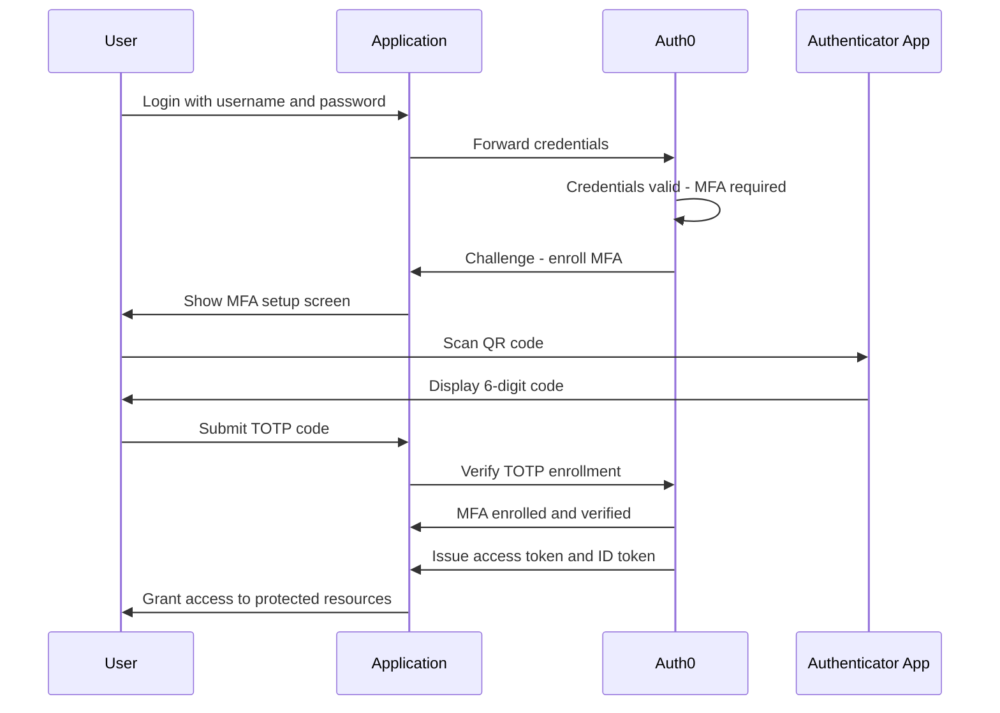

### 5.2. Role-Based Access Control (RBAC)

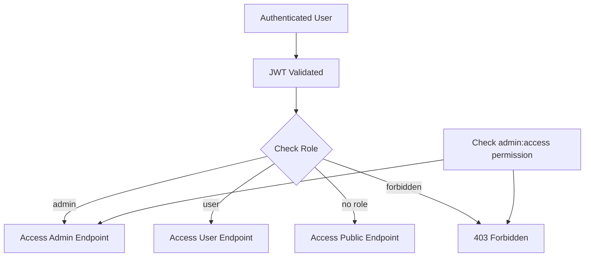

Leverage Auth0’s RBAC features:

- **Define Roles:** Assign roles to users (e.g., admin, user).
- **Set Permissions:** Define granular permissions within each role.
- **Enforce Checks:** Validate permissions within your application (as shown in the `/admin` endpoint).

### 5.3. Secure Token Management

- **Use HTTPS:** Always transmit tokens over secure channels.
- **Short-Lived Tokens:** Set a reasonable expiration time for access tokens and use refresh tokens where applicable.
- **Token Revocation:** Implement mechanisms to revoke tokens if needed.

The token refresh flow ensures sessions stay alive without forcing re-authentication:

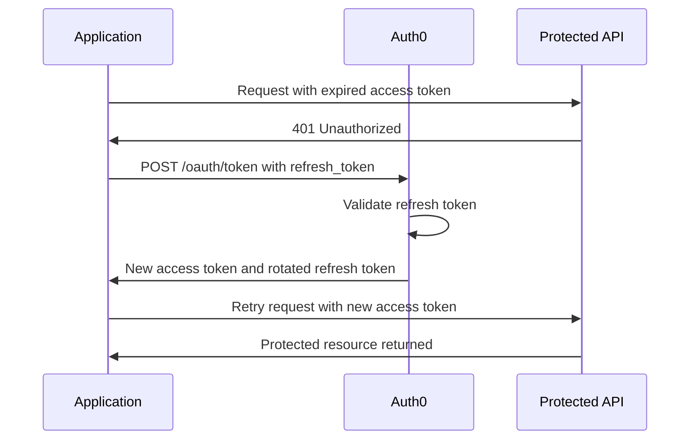

### 5.3.1. Social Login Federation

Auth0 simplifies social login by federating identity across providers:

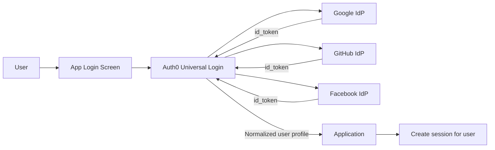

### 5.4. Monitoring and Logging

- **Activity Logs:** Use Auth0’s logging features to monitor authentication activities and detect anomalies.
- **Error Handling:** Provide clear error messages (without leaking sensitive information) and ensure your API gracefully handles invalid tokens.

### 5.5. Continuous Integration and Security Audits

- **Automated Testing:** Write tests to verify authentication flows and access controls.
- **Security Reviews:** Periodically audit your authentication implementation for vulnerabilities.

---

### 5.6. B2B Multi-Tenant Auth with Auth0 Organizations

Auth0 Organizations is the purpose-built feature for B2B SaaS products. It lets each of your customers (organizations) have their own identity connections, member management, and branding — all within a single Auth0 tenant.

### 5.7. Creating an Organization via the Management API

```javascript
// scripts/provision-organization.js
const { ManagementClient } = require("auth0");

const management = new ManagementClient({
  domain: process.env.AUTH0_DOMAIN,
  clientId: process.env.AUTH0_MGMT_CLIENT_ID,
  clientSecret: process.env.AUTH0_MGMT_CLIENT_SECRET,
});

async function provisionOrganization(tenantName, adminEmail) {
  // Create the organization
  const org = await management.organizations.create({
    name: tenantName.toLowerCase().replace(/\s+/g, "-"),
    display_name: tenantName,
    branding: {
      logo_url: `https://cdn.example.com/logos/${tenantName}.png`,
      colors: { primary: "#0066cc", page_background: "#ffffff" },
    },
  });

  // Enable username/password connection for this org
  await management.organizations.addEnabledConnection(org.id, {
    connection_id: process.env.AUTH0_DB_CONNECTION_ID,
    assign_membership_on_login: false,
  });

  // Invite the admin user
  await management.organizations.createInvitation(org.id, {
    inviter: { name: "DevVerse Platform" },
    invitee: { email: adminEmail },
    client_id: process.env.AUTH0_CLIENT_ID,
    roles: ["org:admin"],
    send_invitation_email: true,
  });

  console.log(`Organization created: ${org.id}`);
  return org;
}
```

### 5.8. Protecting Routes by Organization Membership

```javascript
// middleware/org-check.js
const { ManagementClient } = require("auth0");

function requireOrgMembership(requiredOrgSlug) {
  return async (req, res, next) => {
    const orgId = req.auth?.org_id; // present in token when user logs in via org

    if (!orgId) {
      return res
        .status(403)
        .json({ error: "No organization context in token" });
    }

    // Optionally verify the org slug matches the route
    if (requiredOrgSlug) {
      const management = new ManagementClient({
        /* ... */
      });
      const org = await management.organizations.get({ id: orgId });
      if (org.name !== requiredOrgSlug) {
        return res.status(403).json({ error: "Organization mismatch" });
      }
    }

    req.orgId = orgId;
    next();
  };
}
```

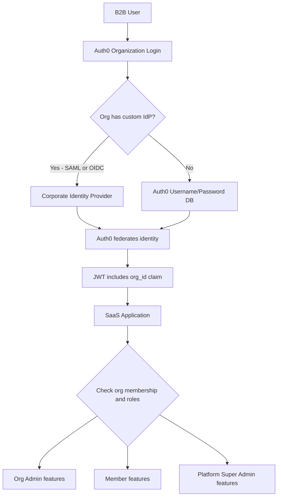

---

### 5.7. Machine-to-Machine Auth (Client Credentials Flow)

Backend services, CI/CD pipelines, and cron jobs need to call APIs without a human user. The OAuth 2.0 Client Credentials flow is the correct solution — the service authenticates using its own credentials, not a user’s tokens.

### 5.8. Creating an M2M Application in Auth0

```javascript
// In Auth0 Dashboard: Applications > Create Application > Machine to Machine
// Then grant it access to your API with specific scopes

// server-to-server API call
const { ManagementClient } = require("auth0");

async function getAccessToken() {
  const response = await fetch(
    `https://${process.env.AUTH0_DOMAIN}/oauth/token`,
    {
      method: "POST",
      headers: { "Content-Type": "application/json" },
      body: JSON.stringify({
        grant_type: "client_credentials",
        client_id: process.env.AUTH0_M2M_CLIENT_ID,
        client_secret: process.env.AUTH0_M2M_CLIENT_SECRET,
        audience: process.env.AUTH0_API_AUDIENCE,
      }),
    },
  );

  const { access_token, expires_in } = await response.json();
  return { access_token, expires_in };
}

// Cache the token and refresh before expiry
class M2MTokenCache {
  constructor() {
    this.token = null;
    this.expiresAt = 0;
  }

  async getToken() {
    if (Date.now() < this.expiresAt - 60_000) {
      return this.token; // still valid with 60s buffer
    }

    const { access_token, expires_in } = await getAccessToken();
    this.token = access_token;
    this.expiresAt = Date.now() + expires_in * 1000;
    return this.token;
  }
}

const tokenCache = new M2MTokenCache();

// Use in outgoing HTTP calls
async function callInternalAPI(endpoint, body) {
  const token = await tokenCache.getToken();
  return fetch(`https://internal-api.example.com${endpoint}`, {
    method: "POST",
    headers: {
      Authorization: `Bearer ${token}`,
      "Content-Type": "application/json",
    },
    body: JSON.stringify(body),
  });
}
```

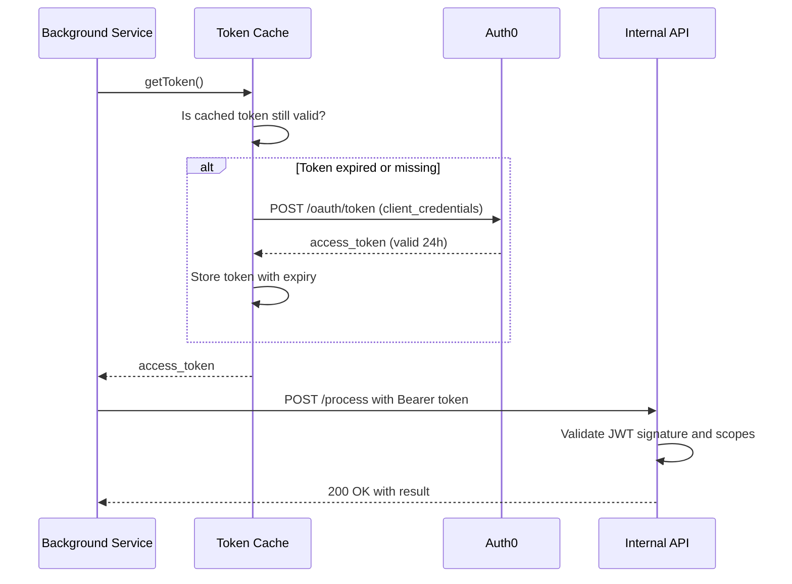

---

### 5.8. Custom Database Connections

Auth0’s Custom Database Connections allow you to authenticate users from your own existing database without migrating credentials to Auth0. You provide JavaScript scripts for login, user search, and creation; Auth0 executes them in a sandboxed environment.

```javascript
// Auth0 Dashboard: Authentication > Database > Create DB Connection > Custom Database
// Login script
function login(email, password, callback) {
  const bcrypt = require("bcrypt");
  const mysql = require("mysql");

  const connection = mysql.createConnection({
    host: configuration.DB_HOST,
    user: configuration.DB_USER,
    password: configuration.DB_PASSWORD,
    database: configuration.DB_NAME,
  });

  connection.connect();

  const query =
    "SELECT id, email, password_hash, name FROM users WHERE email = ?";
  connection.query(query, [email], (err, results) => {
    connection.end();

    if (err) return callback(err);
    if (results.length === 0)
      return callback(new WrongUsernameOrPasswordError(email));

    const user = results[0];
    bcrypt.compare(password, user.password_hash, (bcryptErr, isValid) => {
      if (bcryptErr || !isValid) {
        return callback(new WrongUsernameOrPasswordError(email));
      }

      callback(null, {
        user_id: `legacy|${user.id}`,
        email: user.email,
        name: user.name,
      });
    });
  });
}
```

Enable **Import Users** mode to transparently migrate users to Auth0’s database the first time they log in, so you can sunset your legacy auth system incrementally.

---

## 6. JWT Structure and Validation

A JSON Web Token carries three base64url-encoded segments. The following diagram shows how a token is constructed and validated:

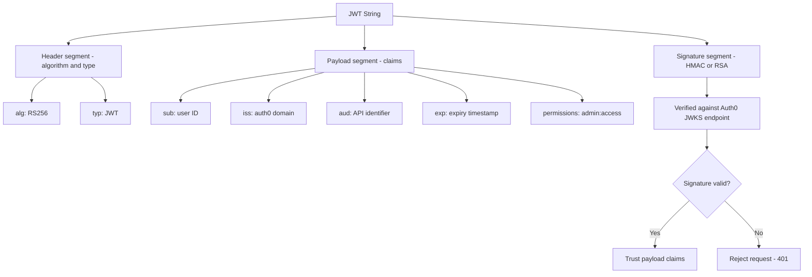

---

## 7. Auth0 Tenant Architecture

A production Auth0 setup typically separates tenants by environment and uses custom domains for branding:

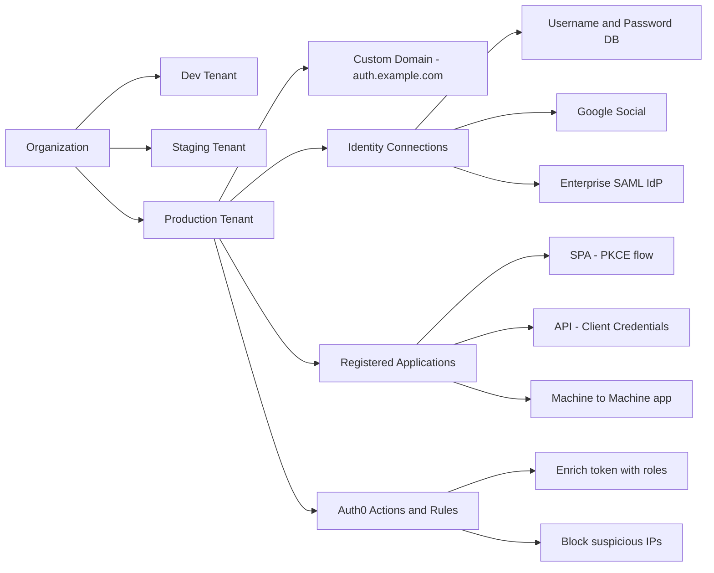

---

## 8. PKCE Authorization Code Flow

Single-page applications and mobile apps use PKCE to protect the authorization code flow without a client secret:

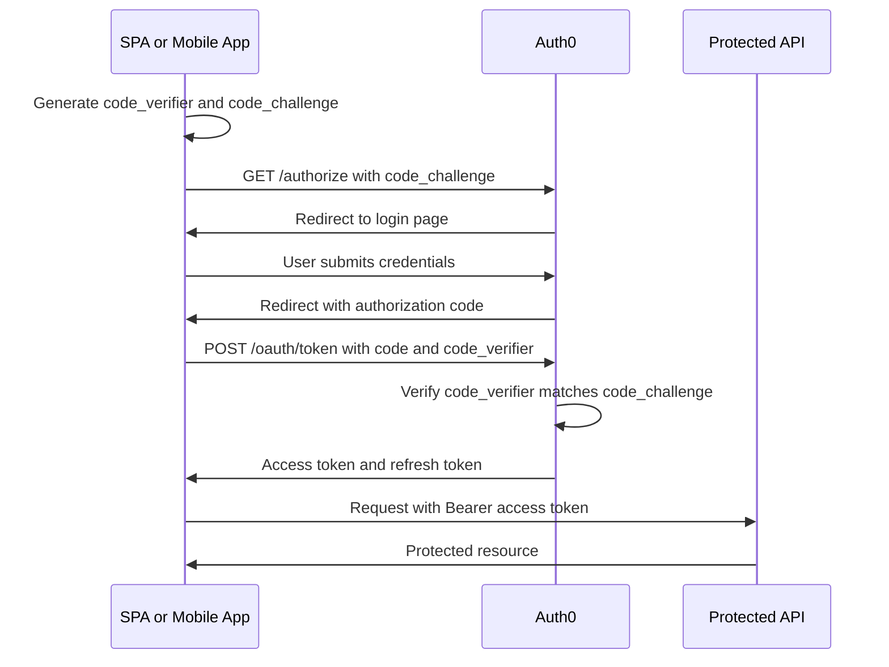

---

## 9. Auth0 Actions Pipeline

Auth0 Actions replace legacy Rules and Hooks. The following shows when each trigger fires during a login:

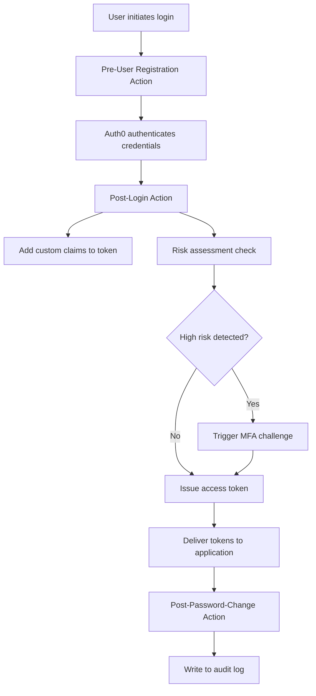

---

## 10. Conclusion

Integrating Auth0 into your applications provides a robust and scalable solution for managing authentication and authorization. This guide has delved into the theoretical concepts behind secure identity management, detailed best practices for configuring Auth0, and provided a full example application demonstrating secure API endpoints in Node.js. By leveraging advanced features such as MFA, RBAC, and continuous monitoring, you can build secure applications that meet today’s high security standards.

**Key Takeaways:**

- Use Auth0 Organizations for any B2B SaaS product — it handles per-tenant IdP federation, member management, and branding out of the box.
- Machine-to-machine services must use the Client Credentials flow and cache the token (refreshing 60 seconds before expiry) to avoid rate-limiting Auth0’s token endpoint.
- Custom Database Connections let you validate credentials against your existing database while migrating users transparently to Auth0 over time.
- Always use PKCE for SPAs and mobile apps — never use the implicit flow, which exposes tokens in URL fragments and browser history.
- Auth0 Actions (Post-Login trigger) are the correct place to enrich tokens with custom claims — avoid putting sensitive data in the `id_token` if it is exposed to the browser.
- Separate tenants by environment (dev / staging / prod) and use custom domains in production so your branding is consistent and you can rotate tenant secrets without affecting other environments.

---

## 11. Further Resources

- **Auth0 Documentation:** [https://auth0.com/docs](https://auth0.com/docs)
- **Auth0 Quickstarts:** Explore sample implementations for various platforms.
- **OAuth 2.0 and OpenID Connect:** Deep dive into the protocols underpinning modern authentication.
- **Security Best Practices for APIs:** Learn more about securing APIs with JWT and other standards.
- **Auth0 Community Forum:** Engage with other developers and share insights.

Embrace robust authentication and authorization using Auth0 to protect your applications and user data. Continue to explore, experiment, and implement industry best practices. Happy coding and secure developing!
