import MdxLayout from "@/components/MdxLayout";

export const metadata = {
  title: "Fine-Tuning BERT for Sentiment Analysis: A Deep Dive",
  description:
    "An exhaustive guide on fine-tuning the BERT transformer model for sentiment analysis tasks, covering data preparation, model configuration, hyperparameter tuning, and advanced techniques.",
  topics: [
    "Artificial Intelligence",
    "Machine Learning",
    "Natural Language Processing",
    "BERT",
    "Sentiment Analysis",
  ],
};

export default function AIFineTuningArticle({ children }) {
  return <MdxLayout>{children}</MdxLayout>;
}

# Fine-Tuning BERT for Sentiment Analysis: A Deep Dive

### Author: Son Nguyen

> Date: 2025-03-08

In recent years, transformer-based architectures have revolutionized Natural Language Processing (NLP). Among these, **BERT** (Bidirectional Encoder Representations from Transformers) has emerged as a groundbreaking model for understanding language context. Fine-tuning BERT for sentiment analysis has enabled state-of-the-art performance on tasks such as classifying movie reviews, product feedback, and social media posts.

This article provides an exhaustive exploration of the process of fine-tuning BERT for sentiment analysis. We cover every step in detail - from data preparation and model configuration to hyperparameter tuning, training strategies, evaluation, and advanced techniques such as model interpretability. Whether you are new to NLP or an experienced practitioner, this guide will serve as a deep reference for building robust sentiment analysis systems using BERT.

---

## 1. Introduction

### 1.1. The Importance of Sentiment Analysis

Sentiment analysis is a subfield of NLP that focuses on identifying and extracting subjective information from text. It is widely used in various industries for:

- **Customer Feedback:** Understanding consumer opinions from reviews and surveys.
- **Social Media Monitoring:** Tracking public sentiment on brands, products, or political events.
- **Market Analysis:** Gauging public perception to inform business strategies.
- **Content Moderation:** Automatically filtering harmful or inappropriate content.

### 1.2. The Role of Transfer Learning with BERT

BERT has transformed the landscape of NLP by allowing models to be pre-trained on large text corpora and then fine-tuned on specific tasks. The key benefits include:

- **Reduced Need for Labeled Data:** Fine-tuning leverages the general language understanding from pre-training.
- **Improved Performance:** Models like BERT achieve higher accuracy on sentiment classification tasks.
- **Versatility:** BERT can be adapted to various domains with minimal changes to the architecture.

---

## 2. Overview of BERT Architecture

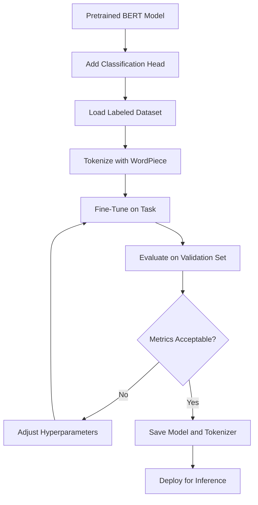

### 2.1. BERT’s Transformer Architecture

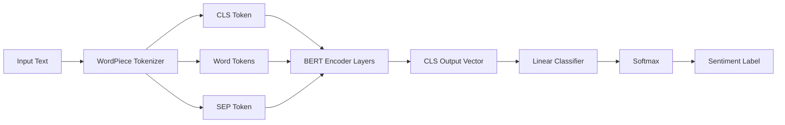

BERT is based on the transformer model, which uses self-attention mechanisms to capture contextual relationships between words in a sentence. Key architectural features include:

- **Bidirectional Encoding:** Unlike traditional models that process text unidirectionally, BERT reads text from both left and right simultaneously.
- **Multi-Head Attention:** Enables the model to focus on different parts of a sentence concurrently.
- **Layered Structure:** Typically consists of 12 layers (for BERT-base) or 24 layers (for BERT-large), each contributing to a deep contextual understanding.

### 2.2. Pre-Training Objectives

BERT is pre-trained using two primary objectives:

- **Masked Language Modeling (MLM):** Randomly masks tokens in a sentence and trains the model to predict them.
- **Next Sentence Prediction (NSP):** Trains the model to determine if one sentence logically follows another.

These objectives equip BERT with a robust understanding of language semantics and syntactic relationships.

The diagram below compares the pre-training and fine-tuning phases:

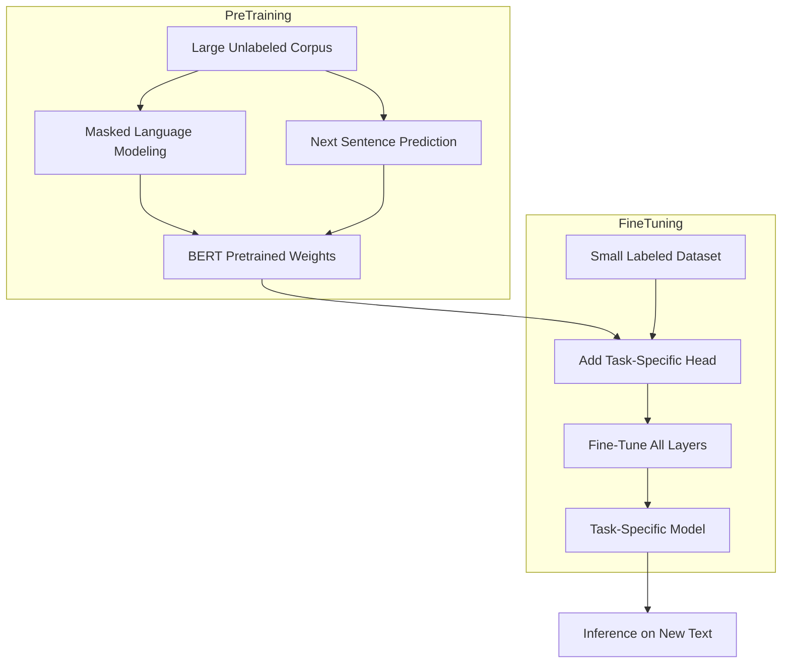

### 2.3. Tokenization

Before fine-tuning, text must be tokenized using BERT’s WordPiece tokenizer:

- **Input IDs:** Numerical representations of tokens.
- **Attention Masks:** Binary masks indicating real tokens versus padding.
- **Special Tokens:** Such as `[CLS]` for classification and `[SEP]` for separating sentences.

---

## 3. Data Preparation for Sentiment Analysis

### 3.1. Selecting a Dataset

Popular datasets for sentiment analysis include:

- **IMDb Reviews:** For movie review classification.
- **SST-2 (Stanford Sentiment Treebank):** For fine-grained sentiment analysis.
- **Amazon Reviews:** For product sentiment classification.

### 3.2. Preprocessing Steps

1. **Cleaning:** Remove unwanted characters, lowercasing, and handling HTML tags if necessary.
2. **Tokenization:** Use the BERT tokenizer to convert sentences to input IDs and attention masks.
3. **Padding and Truncation:** Ensure all sequences have a consistent length.

#### Example: Tokenizing Data

```python
from transformers import BertTokenizer

tokenizer = BertTokenizer.from_pretrained("bert-base-uncased")

def tokenize_function(example):
    return tokenizer(
        example["sentence"],
        padding="max_length",
        truncation=True,
        max_length=128  # Adjust based on your dataset
    )
```

### 2.4. Self-Attention Mechanism

BERT's power comes from multi-head self-attention, which lets every token attend to every other token in the sequence simultaneously:

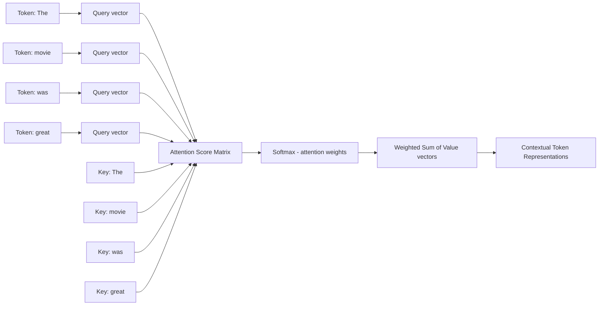

### 3.3. Data Augmentation Techniques

To increase the robustness of your model:

- **Synonym Replacement:** Replace words with their synonyms.
- **Back-Translation:** Translate text to another language and back to introduce variability.
- **Noise Injection:** Introduce slight spelling variations or grammatical alterations.

---

## 4. Fine-Tuning Strategies and Hyperparameter Tuning

### 4.1. Hyperparameter Selection

Key hyperparameters to tune during fine-tuning include:

- **Learning Rate:** Typically set between 2e-5 and 5e-5.
- **Batch Size:** Common values are 16 or 32; adjust based on available GPU memory.
- **Epochs:** Fine-tuning often requires 2 to 4 epochs, though this may vary based on dataset size.
- **Weight Decay:** Helps regularize the model and prevent overfitting (commonly around 0.01).

### 4.2. Regularization Techniques

- **Dropout:** Introduce dropout layers (usually 0.1 to 0.3) to reduce overfitting.
- **Early Stopping:** Monitor validation loss and halt training when performance degrades.
- **Gradient Clipping:** Prevent gradients from exploding by capping them at a threshold.

### 4.3. Advanced Training Techniques

- **Learning Rate Warm-Up:** Gradually increase the learning rate at the beginning of training.
- **Layer Freezing:** Freeze lower layers of BERT to focus fine-tuning on the higher-level representations.
- **Mixed Precision Training:** Utilize lower precision (e.g., FP16) to speed up training and reduce memory usage.

---

## 5. Implementation: Fine-Tuning with Hugging Face Transformers

Below is an in-depth example using the Hugging Face Transformers library to fine-tune BERT for sentiment analysis.

### 5.1. Setting Up the Environment

Ensure you have installed the necessary packages:

```bash
pip install transformers datasets torch
```

### 5.2. Loading and Tokenizing the Dataset

```python
from transformers import BertTokenizer, BertForSequenceClassification, Trainer, TrainingArguments
from datasets import load_dataset

# Load the SST-2 dataset from the GLUE benchmark
dataset = load_dataset("glue", "sst2")

tokenizer = BertTokenizer.from_pretrained("bert-base-uncased")

def tokenize_function(examples):
    return tokenizer(examples["sentence"], padding="max_length", truncation=True, max_length=128)

tokenized_datasets = dataset.map(tokenize_function, batched=True)
```

### 5.3. Model Configuration and Training

```python
model = BertForSequenceClassification.from_pretrained("bert-base-uncased", num_labels=2)

training_args = TrainingArguments(
    output_dir="./results",
    evaluation_strategy="epoch",
    learning_rate=2e-5,
    per_device_train_batch_size=16,
    per_device_eval_batch_size=16,
    num_train_epochs=3,
    weight_decay=0.01,
    warmup_steps=500,
    logging_dir="./logs",
    logging_steps=50,
    load_best_model_at_end=True,
    metric_for_best_model="accuracy",
)

def compute_metrics(eval_pred):
    from sklearn.metrics import accuracy_score, precision_recall_fscore_support
    logits, labels = eval_pred
    predictions = logits.argmax(axis=-1)
    acc = accuracy_score(labels, predictions)
    precision, recall, f1, _ = precision_recall_fscore_support(labels, predictions, average="binary")
    return {"accuracy": acc, "precision": precision, "recall": recall, "f1": f1}

from transformers import Trainer

trainer = Trainer(
    model=model,
    args=training_args,
    train_dataset=tokenized_datasets["train"],
    eval_dataset=tokenized_datasets["validation"],
    compute_metrics=compute_metrics,
)

# Start the fine-tuning process
trainer.train()

# Evaluate the model on the validation set
eval_results = trainer.evaluate()
print(f"Evaluation results: {eval_results}")
```

### 5.4. Saving and Deploying the Model

After fine-tuning, save your model and tokenizer for future use or deployment:

```python
model.save_pretrained("./fine-tuned-bert-sst2")
tokenizer.save_pretrained("./fine-tuned-bert-sst2")
```

---

## 6. Evaluation Metrics and Error Analysis

### 6.1. Common Evaluation Metrics

- **Accuracy:** Percentage of correctly classified instances.
- **Precision:** Ratio of true positives to predicted positives.
- **Recall:** Ratio of true positives to actual positives.
- **F1 Score:** The harmonic mean of precision and recall.
- **Confusion Matrix:** Visual representation of prediction errors.

### 6.2. Conducting Error Analysis

Performing a detailed error analysis can help identify weaknesses in your model:

- **Analyze Misclassified Examples:** Determine if certain types of text (e.g., sarcastic comments) are consistently misclassified.
- **Examine Class Imbalance:** Ensure that the dataset is balanced or apply techniques like oversampling or weighted loss.
- **Use Visualization Tools:** Leverage confusion matrices and ROC curves to visualize model performance.

### 6.3. Model Interpretability

Techniques like LIME (Local Interpretable Model-agnostic Explanations) or SHAP (SHapley Additive exPlanations) can be used to explain predictions:

- **LIME:** Perturbs the input and observes changes in prediction to determine feature importance.
- **SHAP:** Computes contribution scores for each feature, offering insight into model behavior.

---

## 7. Advanced Topics and Future Directions

### 7.0. Model Compression Decision Tree

Before deploying fine-tuned BERT, evaluate whether compression is necessary based on your inference environment:

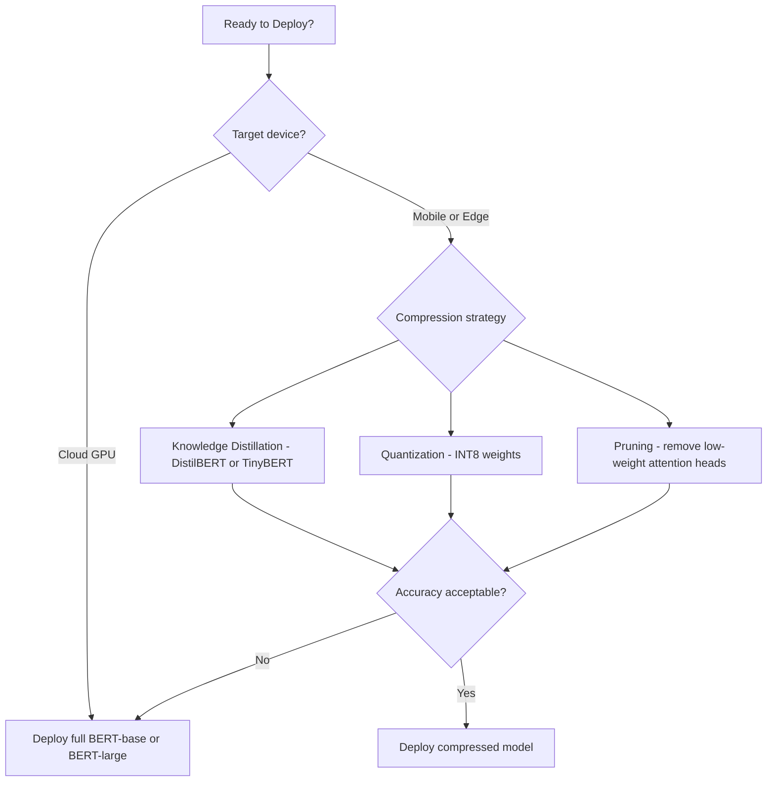

### 7.1. Domain Adaptation and Further Pre-Training

When working in specialized domains (e.g., legal, medical), consider further pre-training BERT on domain-specific corpora before fine-tuning on sentiment analysis data.

### 7.2. Model Compression and Distillation

To deploy models in production environments with limited resources:

- **Distillation:** Transfer knowledge from a large model (teacher) to a smaller one (student).
- **Quantization:** Reduce the precision of model weights to speed up inference.

### 7.3. Multimodal Sentiment Analysis

Incorporate other data types such as images or audio alongside text to develop richer sentiment analysis systems. This approach leverages multiple modalities to improve prediction accuracy.

### 7.4. Continuous Learning and Model Updates

Deploy pipelines that periodically re-train or update models as new data becomes available, ensuring that your system remains robust in dynamic environments.

---

## 8. Best Practices for Fine-Tuning BERT

- **Data Quality:** Prioritize high-quality, annotated data. Use data cleaning and augmentation techniques as needed.
- **Hyperparameter Optimization:** Use grid search or Bayesian optimization to systematically tune learning rates, batch sizes, and other parameters.
- **Monitoring Training:** Utilize logging and visualization tools (e.g., TensorBoard) to track training progress and debug issues.
- **Experimentation:** Maintain detailed experiment logs to compare different model configurations and training regimes.
- **Deployment Considerations:** Optimize your model for inference speed and memory footprint if deploying in production.

---

### 8.1 BERT for Named Entity Recognition

BERT’s bidirectional context makes it equally powerful for sequence labeling tasks like Named Entity Recognition (NER), where the model must classify each token in a sentence into categories such as `PERSON`, `ORG`, `LOC`, or `O` (outside any entity).

### 8.2. Architecture Change for NER

Instead of pooling the `[CLS]` vector, we project every token’s hidden state through a linear classification head. The output shape becomes `(batch_size, sequence_length, num_labels)`.

```python
from transformers import BertForTokenClassification, BertTokenizerFast
import torch

label_list = ["O", "B-PER", "I-PER", "B-ORG", "I-ORG", "B-LOC", "I-LOC"]
id2label  = {i: l for i, l in enumerate(label_list)}
label2id  = {l: i for i, l in enumerate(label_list)}

model = BertForTokenClassification.from_pretrained(
    "bert-base-cased",
    num_labels=len(label_list),
    id2label=id2label,
    label2id=label2id,
)
tokenizer = BertTokenizerFast.from_pretrained("bert-base-cased")
```

### 8.3. Handling Sub-Word Tokens in NER Labels

WordPiece splits words like `"Washington"` into `["Washington"]` but `"PyTorch"` into `["Py", "##Torch"]`. Label alignment must set continuation sub-words to `-100` so they are ignored in loss computation.

```python
def align_labels_with_tokens(labels, word_ids):
    new_labels = []
    current_word = None
    for word_id in word_ids:
        if word_id is None:
            new_labels.append(-100)
        elif word_id != current_word:
            current_word = word_id
            new_labels.append(labels[word_id])
        else:
            # Sub-word continuation: ignore in loss
            label = labels[word_id]
            # Convert B- tag to I- for sub-word pieces
            if label % 2 == 1:
                label += 1
            new_labels.append(label)
    return new_labels
```

### 8.4. NER Inference Example

```python
sentence = "Elon Musk founded SpaceX in Hawthorne, California."
inputs = tokenizer(sentence, return_tensors="pt", return_offsets_mapping=True)
with torch.no_grad():
    logits = model(**{k: v for k, v in inputs.items() if k != "offset_mapping"}).logits

predictions = logits.argmax(dim=-1)[0].tolist()
tokens      = tokenizer.convert_ids_to_tokens(inputs["input_ids"][0])
for token, pred in zip(tokens, predictions):
    if token not in ("[CLS]", "[SEP]"):
        print(f"{token:<20} {id2label[pred]}")
# Elon                 B-PER
# Musk                 I-PER
# founded              O
# Space                B-ORG
# ##X                  I-ORG
```

### 8.5. NER vs Sentiment: Architecture Comparison

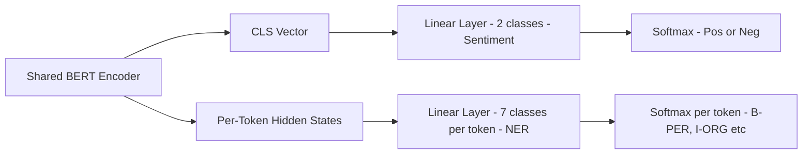

---

Beyond single-label sentiment, BERT adapts naturally to multi-label tasks where an input may carry several emotion categories simultaneously.

### 8.6. Multi-Label Classification with BERT

Standard sentiment analysis is a multi-class problem (one label per input). Multi-label classification assigns one or more labels simultaneously - for example, tagging a review as both `angry` and `disappointed`.

The key change is replacing `CrossEntropyLoss` with `BCEWithLogitsLoss` and interpreting outputs with a sigmoid threshold rather than argmax.

```python
import torch
import torch.nn as nn
from transformers import BertModel

class BertMultiLabel(nn.Module):
    def __init__(self, num_labels: int, dropout: float = 0.1):
        super().__init__()
        self.bert    = BertModel.from_pretrained("bert-base-uncased")
        self.dropout = nn.Dropout(dropout)
        self.clf     = nn.Linear(self.bert.config.hidden_size, num_labels)

    def forward(self, input_ids, attention_mask, labels=None):
        outputs    = self.bert(input_ids=input_ids, attention_mask=attention_mask)
        pooled     = self.dropout(outputs.pooler_output)
        logits     = self.clf(pooled)
        loss = None
        if labels is not None:
            loss = nn.BCEWithLogitsLoss()(logits, labels.float())
        return {"loss": loss, "logits": logits}

# Training loop snippet
THRESHOLD = 0.5
model = BertMultiLabel(num_labels=6)
optimizer = torch.optim.AdamW(model.parameters(), lr=2e-5)

for batch in train_loader:
    out = model(**batch)
    out["loss"].backward()
    optimizer.step()
    optimizer.zero_grad()

# Inference
with torch.no_grad():
    logits = model(input_ids, attention_mask)["logits"]
    probs  = torch.sigmoid(logits)
    preds  = (probs > THRESHOLD).int()
```

### 8.7. Multi-Label Evaluation Metrics

For multi-label tasks, per-label precision, recall, and F1 are computed independently and then averaged:

```python
from sklearn.metrics import classification_report
import numpy as np

label_names = ["joy", "anger", "sadness", "fear", "surprise", "disgust"]
print(classification_report(
    y_true.numpy(),
    y_pred.numpy(),
    target_names=label_names,
    zero_division=0,
))
```

---

When production latency budgets are tight, knowledge distillation compresses the fine-tuned BERT into a smaller student model with acceptable accuracy trade-offs.

### 8.8. Knowledge Distillation: Compressing BERT with DistilBERT

Production deployments often cannot afford BERT-base’s 110M parameters and ~65ms per-inference latency on CPU. Knowledge distillation transfers the "soft" probability distribution learned by a large teacher model into a smaller student model, preserving most accuracy at a fraction of the cost.

### 8.9. Distillation Loss

The student is trained on a combination of the hard label cross-entropy loss and a KL-divergence loss against the teacher’s soft probabilities:

```python
import torch
import torch.nn.functional as F

def distillation_loss(
    student_logits: torch.Tensor,
    teacher_logits: torch.Tensor,
    true_labels:    torch.Tensor,
    temperature:    float = 4.0,
    alpha:          float = 0.5,
) -> torch.Tensor:
    # Soft targets from teacher
    soft_targets   = F.softmax(teacher_logits / temperature, dim=-1)
    soft_student   = F.log_softmax(student_logits / temperature, dim=-1)
    distill_loss   = F.kl_div(soft_student, soft_targets, reduction="batchmean") * (temperature ** 2)

    # Hard labels
    hard_loss = F.cross_entropy(student_logits, true_labels)

    return alpha * distill_loss + (1.0 - alpha) * hard_loss
```

### 8.10. DistilBERT Fine-Tuning on Distillation Objective

```python
from transformers import (
    BertForSequenceClassification,
    DistilBertForSequenceClassification,
)

teacher = BertForSequenceClassification.from_pretrained("./fine-tuned-bert-sst2")
teacher.eval()

student = DistilBertForSequenceClassification.from_pretrained(
    "distilbert-base-uncased", num_labels=2
)

optimizer = torch.optim.AdamW(student.parameters(), lr=3e-5)

for batch in train_loader:
    with torch.no_grad():
        teacher_out = teacher(**batch)

    student_out = student(**batch)
    loss = distillation_loss(
        student_logits=student_out.logits,
        teacher_logits=teacher_out.logits,
        true_labels=batch["labels"],
    )
    loss.backward()
    optimizer.step()
    optimizer.zero_grad()
```

### 8.11. Size, Speed, and Accuracy Trade-offs

| Model      | Parameters | CPU Inference (ms) | SST-2 Accuracy |
| ---------- | ---------- | ------------------ | -------------- |
| BERT-large | 340M       | ~320ms             | 94.9%          |
| BERT-base  | 110M       | ~65ms              | 93.5%          |
| DistilBERT | 66M        | ~25ms              | 91.3%          |
| TinyBERT   | 14M        | ~8ms               | 88.1%          |

### 8.12. Distillation Pipeline

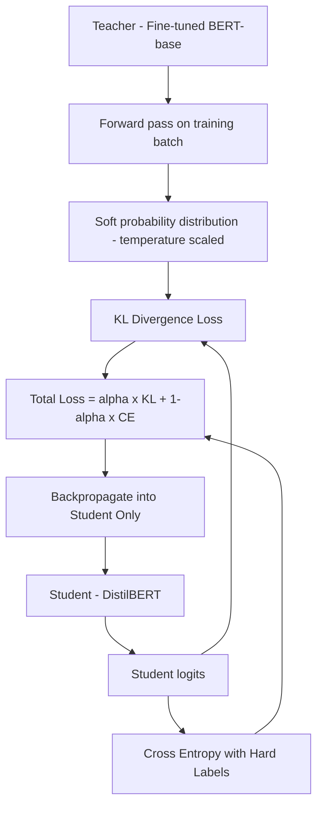

---

Choosing the right architecture matters as much as the training strategy. BERT and GPT represent two fundamentally different training philosophies, and the task at hand should drive the selection.

### 8.13. BERT vs GPT: Choosing the Right Architecture

Choosing between them depends on your specific downstream task.

| Dimension              | BERT (Encoder-Only)                 | GPT (Decoder-Only)              |
| ---------------------- | ----------------------------------- | ------------------------------- |
| Pre-training objective | Masked Language Modeling + NSP      | Causal Language Modeling        |
| Context direction      | Bidirectional                       | Left-to-right only              |
| Best for               | Classification, NER, QA             | Text generation, completion     |
| Fine-tuning style      | Add task head, fine-tune all layers | Prompt engineering or fine-tune |
| Token representation   | Full context per token              | Tokens only see past context    |
| Model size (base)      | 110M params                         | 117M params (GPT-2)             |

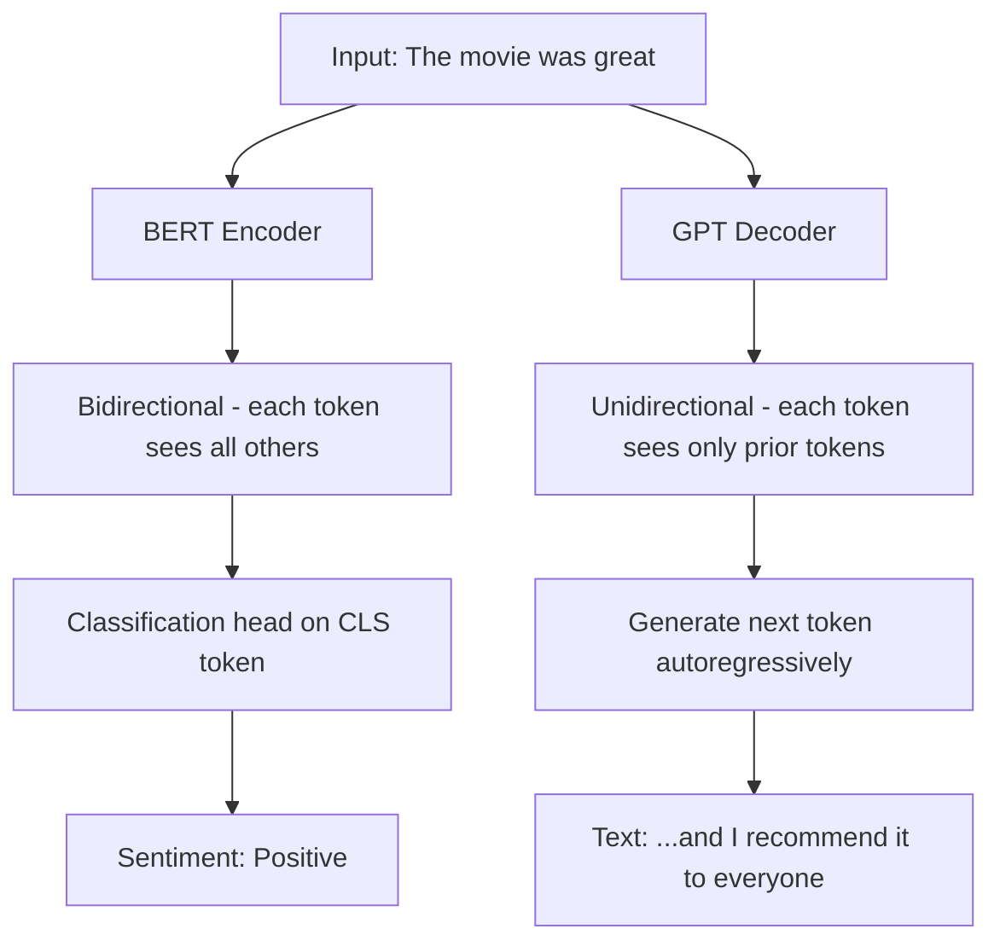

**When to use BERT:** You have labeled examples for classification, NER, question answering, or semantic similarity. BERT’s bidirectional attention produces richer token representations for understanding tasks.

**When to use GPT:** You need generative capabilities, summarization, or can leverage zero-shot or few-shot prompting without labeled training data.

---

## 9. Training Loop State Machine

The fine-tuning training loop cycles through epochs and evaluates at each checkpoint:

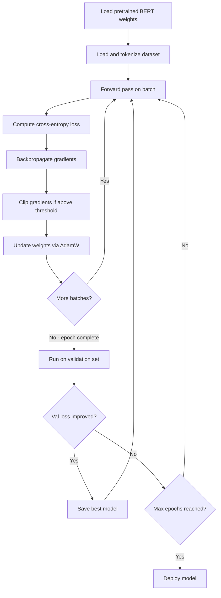

---

## 10. Sentiment Analysis Inference Pipeline

After fine-tuning, deploying BERT for production inference follows this pipeline:

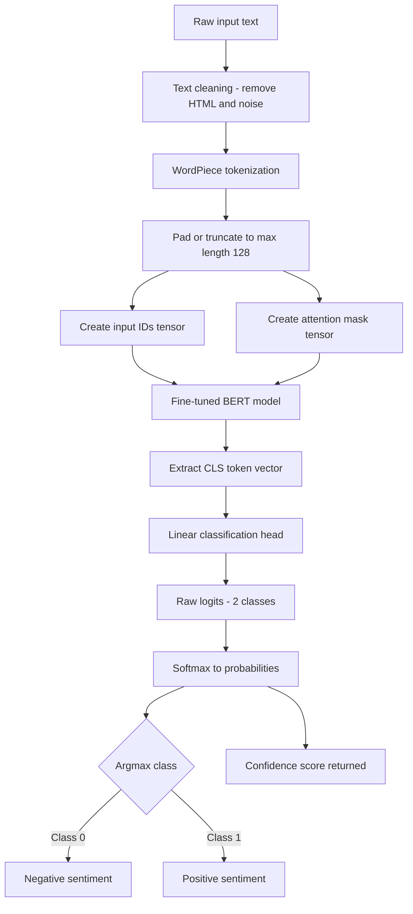

---

## 11. BERT Variants Comparison

Several BERT variants trade model size for speed and accuracy. This diagram maps the key trade-offs:

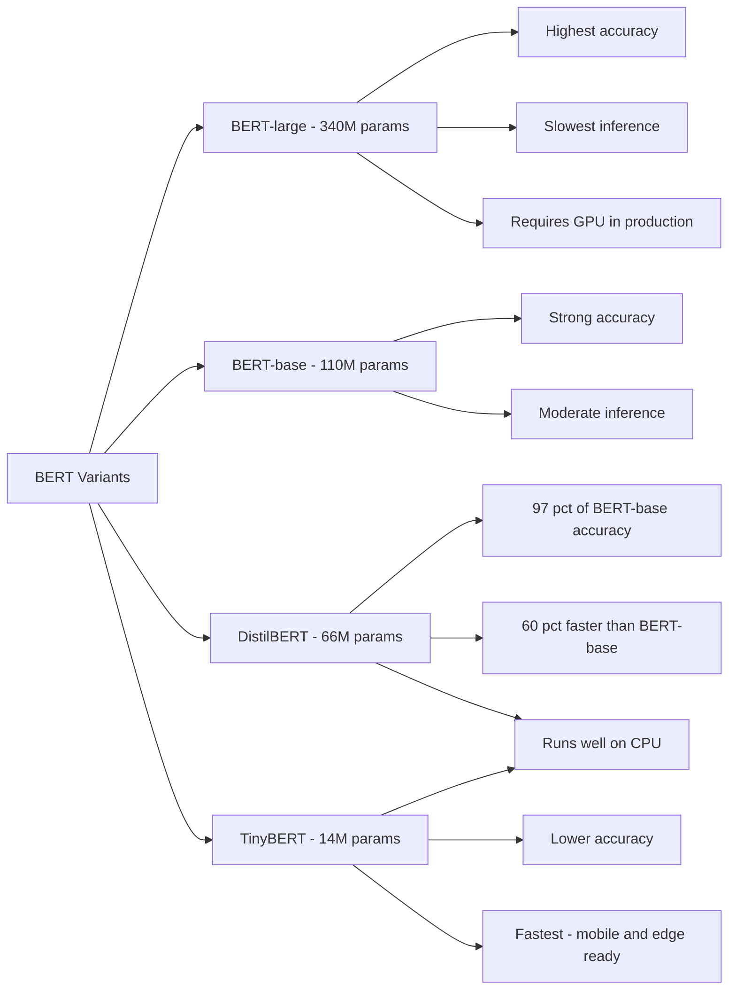

---

## 12. Evaluation Metrics Relationships

The standard classification metrics for sentiment analysis and how they relate to the confusion matrix:

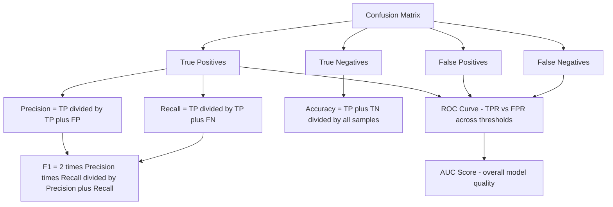

---

## 13. Conclusion

Fine-tuning BERT for sentiment analysis is a powerful method for building state-of-the-art NLP systems. By carefully preparing your data, selecting appropriate hyperparameters, and employing robust training and evaluation practices, you can leverage BERT's deep contextual understanding to achieve excellent performance on sentiment classification tasks. As the field continues to evolve, integrating advanced techniques such as model interpretability, domain adaptation, and continuous learning will further enhance your applications.

---

## 14. Further Resources

- **Hugging Face Transformers Documentation:** [https://huggingface.co/transformers](https://huggingface.co/transformers)
- **BERT Research Paper:** ["BERT: Pre-training of Deep Bidirectional Transformers for Language Understanding"](https://arxiv.org/abs/1810.04805)
- **LIME Documentation:** [https://github.com/marcotcr/lime](https://github.com/marcotcr/lime)
- **SHAP Documentation:** [https://github.com/slundberg/shap](https://github.com/slundberg/shap)
- **NLP Courses and Tutorials:** Explore courses on Coursera, edX, or Udemy to further your understanding of transformer models and fine-tuning strategies.

Happy coding, and may your journey into fine-tuning transformer models lead to robust and insightful sentiment analysis solutions!
