import MdxLayout from "@/components/MdxLayout";

export const metadata = {
  title:
    "Compound Engineering: How to Build AI Systems That Get Smarter Every Time You Use Them",
  description:
    "An in-depth exploration of compound engineering, an AI-native philosophy where each unit of work makes subsequent work easier through planning, review, and systematic knowledge capture.",
  topics: [
    "Artificial Intelligence",
    "Software Engineering",
    "Agentic AI",
    "DevOps",
    "Productivity",
  ],
};

export default function CompoundEngineeringArticle({ children }) {
  return <MdxLayout>{children}</MdxLayout>;
}

# Compound Engineering: How to Build AI Systems That Get Smarter Every Time You Use Them

### Author: Son Nguyen

> Date: 2026-03-22

Most AI agent systems today are stateless. Each session starts from zero. The agent re-reads the codebase, re-discovers project conventions, re-makes the same mistakes, and requires the same context setup overhead every single time. Session 100 costs exactly as much effort as session 1.

Compound engineering flips this. It is an AI-native engineering philosophy where each unit of work makes subsequent work easier, not harder. Instead of features adding complexity, they teach the system new capabilities. Over 20 sessions, a well-compounded system can reach 1.7x the performance of its first session. A poorly compounded one actually degrades below baseline.

This article breaks down every aspect of compound engineering: the core loop, the maturity model, the beliefs you need to adopt, the failure modes to watch for, and the practical techniques that make it all work.

---

## 1. The Problem With Stateless Agents

Traditional AI-assisted development treats each session as an isolated event. The agent has no memory of previous successes, no record of past failures, and no accumulated wisdom from the work it has already done.

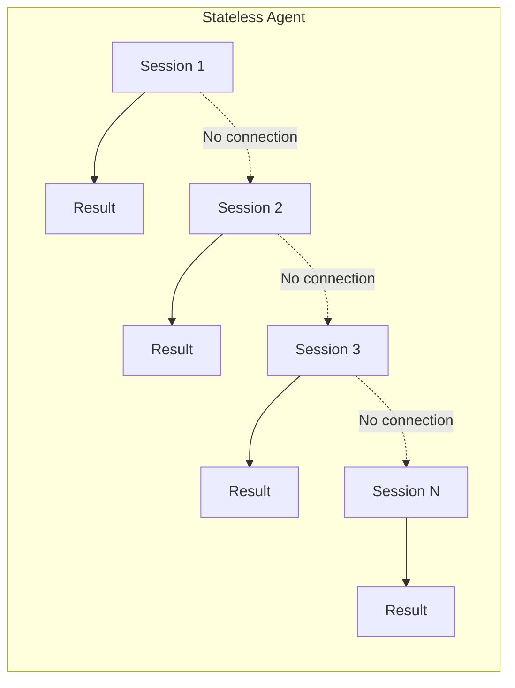

Every session begins with the same overhead: reading the codebase, discovering conventions, understanding architecture. This creates a flat productivity curve where session 100 is no more efficient than session 1.

Compare this with a compound system where knowledge accumulates across sessions:

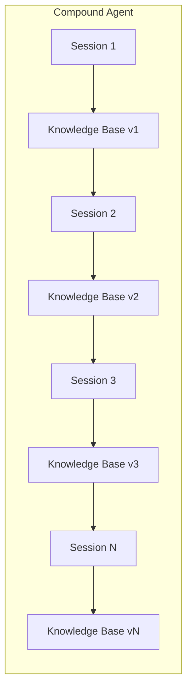

In a compound system, each session reads the accumulated knowledge and writes back what it learned. The system gets smarter, faster, and more reliable over time.

---

## 2. The Plan-Work-Review-Compound Loop

The core mechanism of compound engineering is a four-phase execution cycle that replaces the traditional write-test-ship loop.

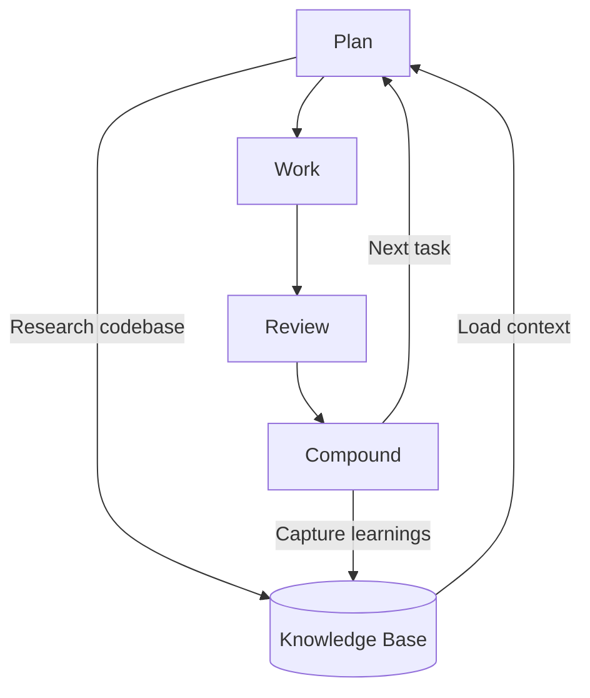

### 2.1. Phase 1: Plan

Before the agent writes a single line of code, it produces an explicit plan document. It researches the codebase, examines prior solutions, consults external references, designs the approach, and validates the plan against known constraints. This is not overhead. It is the highest-leverage phase.

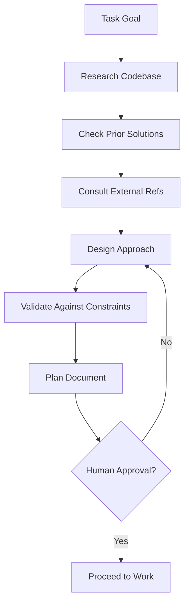

Planning and review together consume roughly 80 percent of the effort. Execution is the easy part.

### 2.2. Phase 2: Work

The agent executes against the plan. It sets up isolation through git worktrees, implements the solution, runs validations, and tracks progress against the plan. This is the only phase where code gets written.

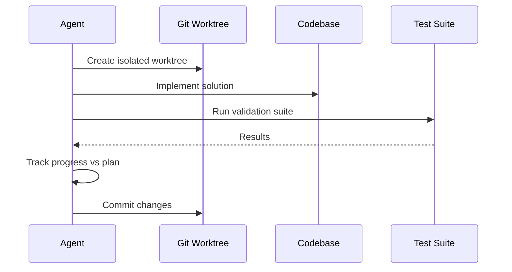

### 2.3. Phase 3: Review

A separate agent pass, or multiple specialized review agents running in parallel, critiques the output against explicit quality rubrics.

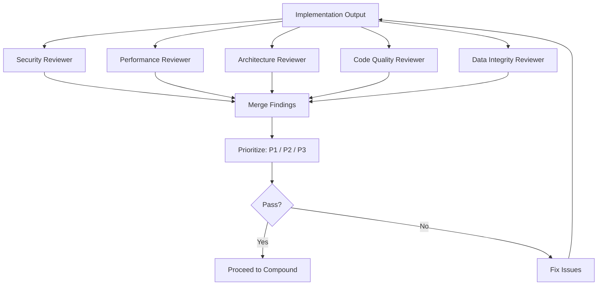

Each reviewer scores independently and flags issues by priority. Security reviewers check for OWASP patterns. Performance reviewers look for N+1 queries and unnecessary allocations. Architecture reviewers evaluate coupling and cohesion. Code quality reviewers enforce simplicity. Data integrity reviewers verify correctness.

### 2.4. Phase 4: Compound

This is the phase that makes the whole system work, and the one most teams skip. After review passes, the system asks: "What did we learn? How do we make sure we never have to solve this exact problem from scratch again?"

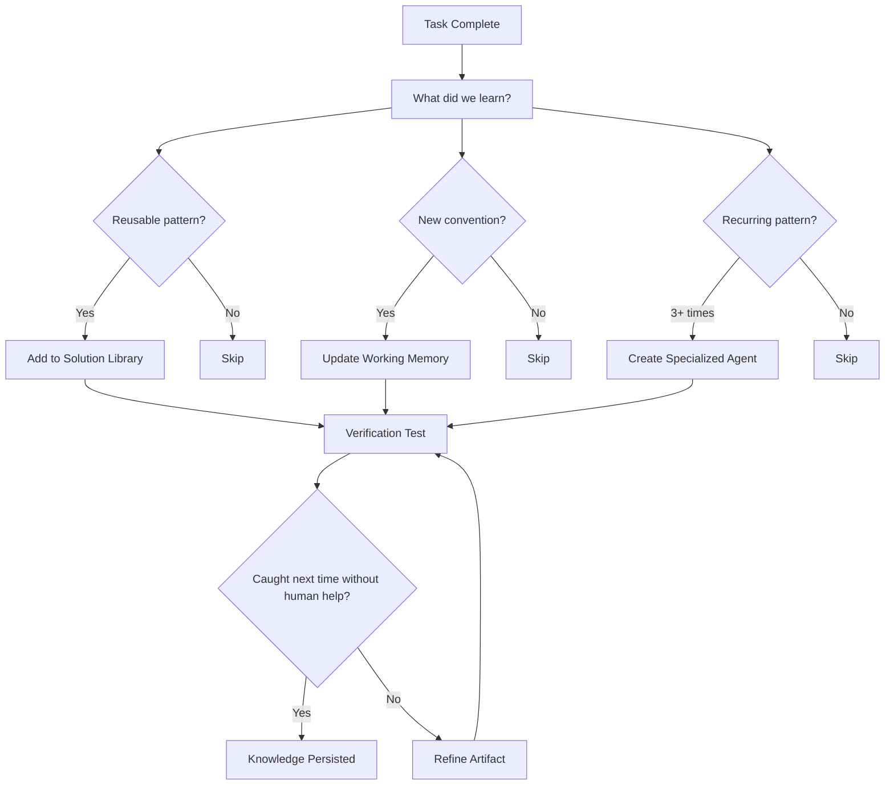

Successful patterns get captured into solution libraries. New conventions get written to the working memory file. If a pattern recurs three times, it might warrant a new specialized agent. The verification test: "Would the system catch this next time without human intervention?"

---

## 3. The 50/50 Rule

Compound engineering proposes that roughly half your engineering effort should go to building features and the other half to improving the system itself.

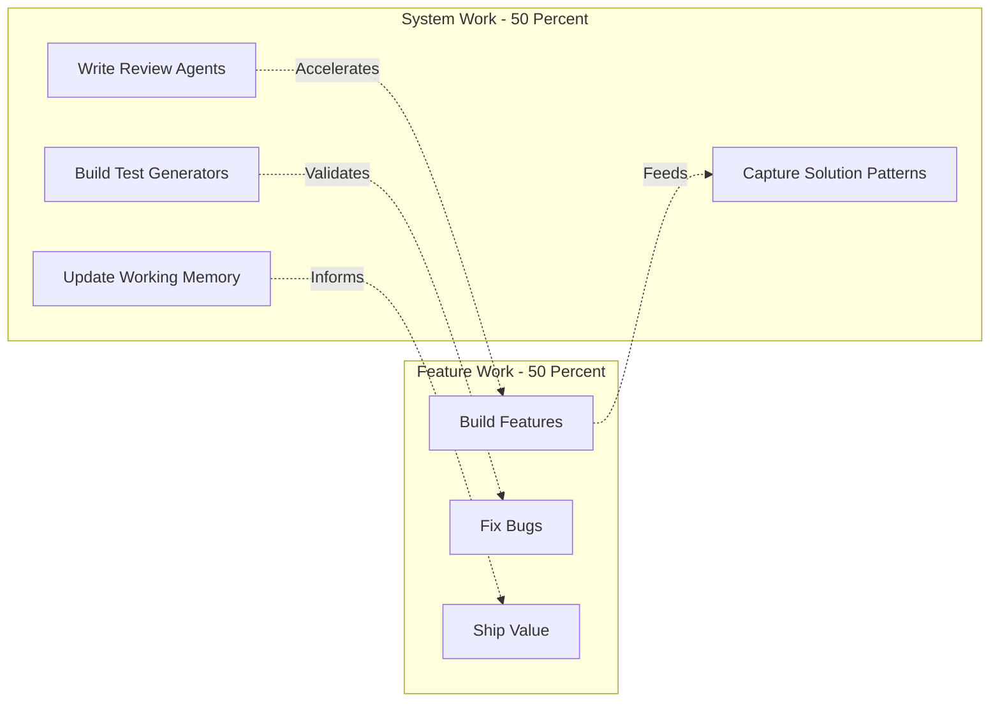

This feels counterintuitive. "I am spending half my time not shipping?" But the math works out: each improvement accelerates every future session, creating exponential returns over time. A team that invests in compounding for six months ships more total value than a team that ships features 100 percent of the time, because the compounding team is accelerating while the pure-feature team runs at constant speed.

---

## 4. Eight Beliefs to Let Go

Compound engineering requires abandoning assumptions that made sense in a pre-AI world:

| Old Belief                                 | New Reality                                                                     |
| ------------------------------------------ | ------------------------------------------------------------------------------- |
| Code must be hand-written                  | Good code is what matters, not who typed it                                     |
| Every line requires manual review          | Automated review agents catch issues more consistently                          |
| Solutions must originate from the engineer | Engineers add taste and judgment; AI researches approaches                      |
| Code is the primary artifact               | A system that produces good code is more valuable than any single piece of code |
| Writing code is the core job function      | Shipping value is the core job function                                         |
| First attempts should be good              | Expect a 95 percent garbage rate on first attempts and iterate fast             |
| Code is self-expression                    | Code belongs to the team, the product, and the users                            |
| More typing equals more learning           | Understanding matters more than muscle memory                                   |

---

## 5. Six Beliefs to Adopt

### 5.1 Extract Taste Into the System

Your judgment about "good code" should not live only in your head. Write it into working memory files, encode it as review agents, capture it as skills. If you leave the team, the system should still know what good looks like.

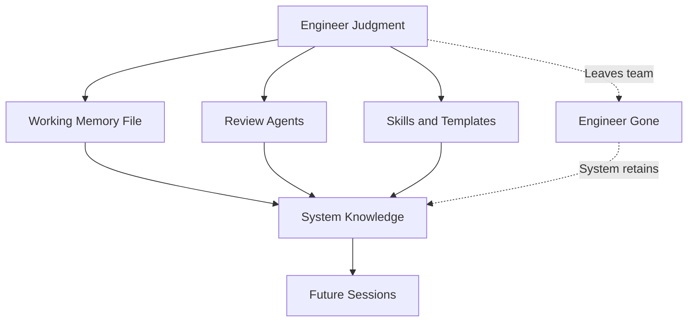

### 5.2 Trust the Process, Build Safety Nets

Do not manually review every line. Build automated verification that catches regressions. Trust the compound loop.

### 5.3 Make Your Environment Agent-Native

The agent needs to run tests, lint code, access logs, create branches, and deploy to staging. If any of these require human intervention, you have a bottleneck.

### 5.4 Parallelization Is Your Friend

Fourteen review agents running in parallel finish faster than one senior engineer doing a sequential review, and they are more consistent.

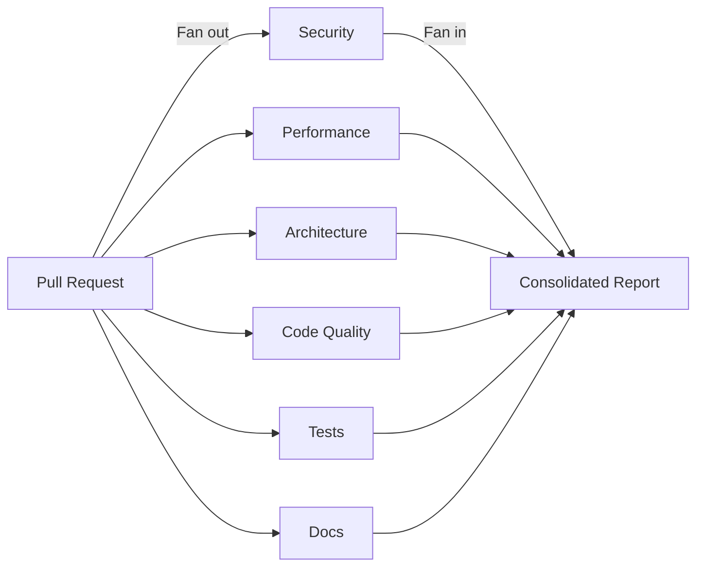

### 5.5 Plans Are the New Code

A well-written plan document is more valuable than the code it produces, because the plan can be reused and adapted while the code is specific to one context.

### 5.6 The 50/50 Rule Is Non-Negotiable

Half features, half system improvement. Every sprint, every week, every month.

---

## 6. The Five Stages of AI-Native Development

Compound engineering sits at Stage 3 and beyond of a maturity model:

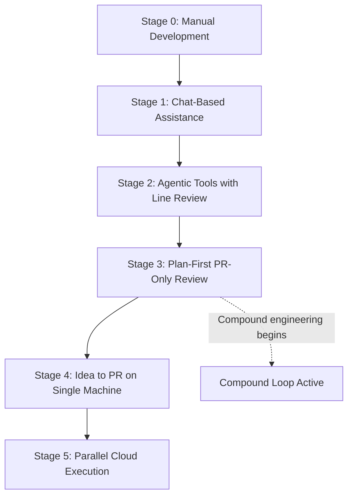

- **Stage 0: Manual development.** No AI. Pure human coding.
- **Stage 1: Chat-based assistance.** Copy-paste code snippets from ChatGPT. The model is a search engine replacement.
- **Stage 2: Agentic tools with line-by-line review.** Tools like Copilot and Cursor generate code inline, but the engineer reviews every change manually.
- **Stage 3: Plan-first, PR-only review.** Compound engineering begins here. The engineer reviews plans and final PRs, not individual lines. The agent handles execution autonomously.
- **Stage 4: Idea to PR on a single machine.** Full pipeline automation. The engineer describes what they want and the system produces a complete, reviewed PR.
- **Stage 5: Parallel cloud execution.** Multiple agents work on different features simultaneously across cloud infrastructure.

Most teams are at Stage 1 or 2. The jump to Stage 3 is where the compound effect kicks in and productivity starts to genuinely diverge.

---

## 7. The Effort Distribution Model

A key insight of compound engineering is that AI inverted where leverage lives in the development process.

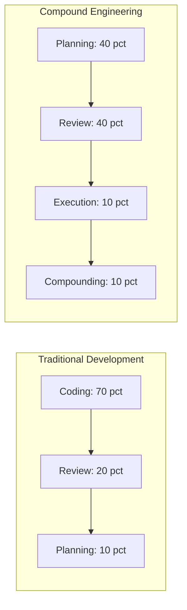

Planning plus review equals 80 percent of effort. Execution plus compounding equals 20 percent. AI did not make engineers obsolete. It inverted where the leverage is: less keystrokes, more critical thinking.

---

## 8. Compound Contamination: The Hidden Risk

There is a failure mode that catches teams off guard. If you run the compound loop without quality gates in the Review phase, low-quality artifacts accumulate in your knowledge base alongside good ones.

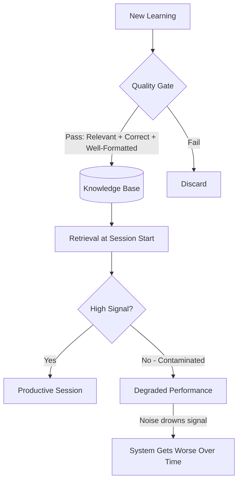

Over time, retrieval precision degrades because the system can no longer distinguish signal from noise. We call this **compound contamination**: the system's own learning loop becomes its vulnerability.

The fix is straightforward: every artifact must pass a quality gate before being persisted. This can be as simple as a secondary LLM call that scores on relevance, correctness, and format with a minimum threshold. The cost is negligible, fractions of a cent per gate. The consequence of skipping it is a system that gets worse the more you use it.

### 8.1. Quality Gate Implementation

```typescript
interface QualityScore {
  relevance: number; // 0-1: Is this useful for future sessions?
  correctness: number; // 0-1: Is this factually accurate?
  format: number; // 0-1: Is this well-structured?
}

async function qualityGate(artifact: string): Promise<boolean> {
  const score = await llm.evaluate(artifact, {
    prompt: `Score this artifact on relevance, correctness, and format (0-1 each).
             Return JSON: { relevance, correctness, format }`,
  });

  const threshold = 0.7;
  return (
    score.relevance >= threshold &&
    score.correctness >= threshold &&
    score.format >= threshold
  );
}

async function compoundPhase(learnings: string[]): Promise<void> {
  for (const learning of learnings) {
    const passes = await qualityGate(learning);
    if (passes) {
      await knowledgeBase.persist(learning);
    } else {
      console.log("Artifact rejected by quality gate:", learning);
    }
  }
}
```

---

## 9. The Compound Flywheel in Practice

When all the pieces come together, compound engineering creates a self-reinforcing flywheel:

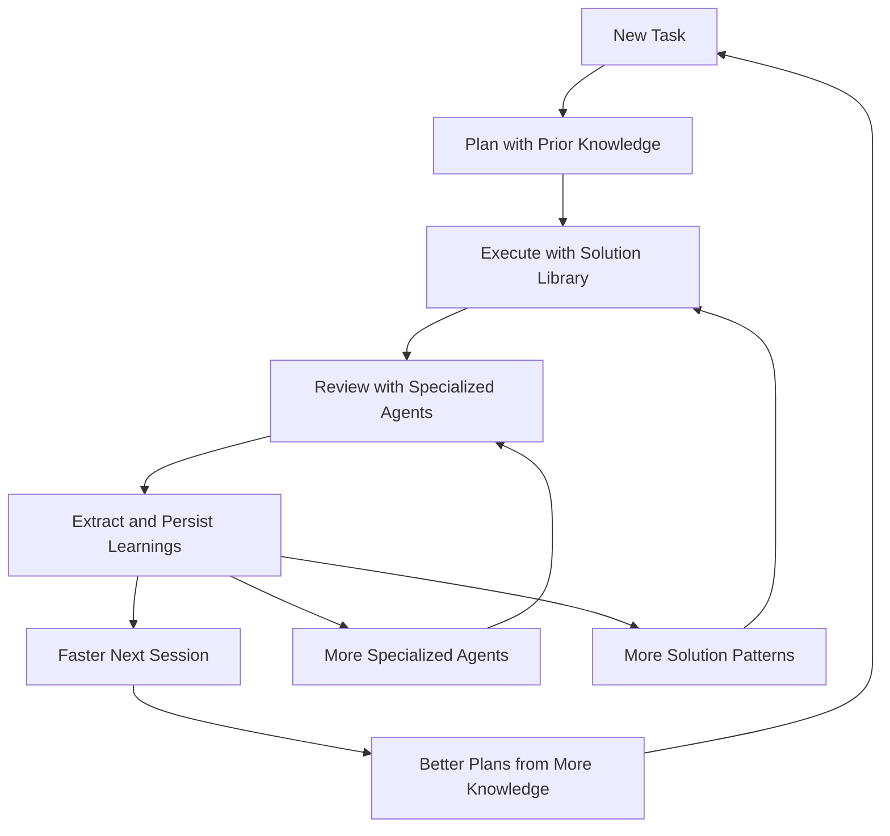

Each rotation of the flywheel:

- Makes planning faster because more prior solutions exist
- Makes execution faster because solution patterns can be reused
- Makes review more thorough because specialized agents accumulate
- Makes compounding more valuable because the knowledge base grows

After 20 sessions, the system is not just incrementally better. It is qualitatively different from where it started.

---

## 10. Practical Implementation Guide

### 10.1. Step 1: Set Up Working Memory

Create a persistent file (like `CLAUDE.md` or `AGENTS.md`) that the agent reads at session start. Start with project conventions, key architectural decisions, and common pitfalls.

### 10.2. Step 2: Implement the Plan Phase

Before any coding task, require the agent to produce a written plan. Review the plan, not the code. Approve or reject the approach before execution begins.

### 10.3. Step 3: Build Review Agents

Start with two or three focused reviewers: security, performance, and code quality. Run them in parallel after every implementation. Expand the set as you discover recurring issue categories.

### 10.4. Step 4: Automate the Compound Phase

After each successful task, have the agent ask itself:

- Did I discover a new pattern that could be reused?
- Did I encounter a convention that should be documented?
- Did I make a mistake that should be prevented in the future?

Persist the answers through a quality gate.

### 10.5. Step 5: Measure Compounding

Track these metrics across sessions:

- **Time to first useful output** (should decrease)
- **Review rejection rate** (should decrease)
- **Knowledge base utilization** (percentage of tasks that reference prior knowledge)
- **Agent autonomy rate** (percentage of tasks completed without human course-correction)

---

## 11. Why This Matters

The gap between a team at Stage 2 (line-by-line AI review) and a team at Stage 3-plus (compound loops running) will widen exponentially. The compounding team ships faster every month. The non-compounding team's productivity is flat. Over a year, the difference is not 2x. It is an order of magnitude.

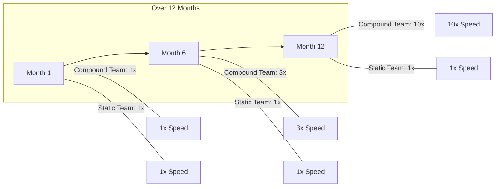

The key insight is simple but profound: AI did not make engineers obsolete. It inverted where the leverage is. Less keystrokes, more critical thinking. Less typing, more teaching the system. Less individual heroics, more systematic improvement.

The teams that understand this and invest in compounding will define the next era of software engineering. The ones that keep treating AI as a faster typewriter will wonder why they fell behind.

---

## 12. Compound Engineering in Practice: A Case Study

Theory is easy; implementation reveals the real challenges. Here is how a small platform team applied compound engineering to a data API service over six weeks.

**Context**: A team of four engineers maintains a Python FastAPI service that powers a financial dashboard. They started using Claude Code for development at week zero. By week two they had finished Stage 2 (agentic tools, line-by-line review). The goal was Stage 3 by week six.

### 12.1. Week 1-2: Baseline Measurement

Before investing in compound infrastructure, they measured where time was going:

- 35% of time spent re-reading codebase to understand conventions
- 25% of time on review cycles (most issues found manually)
- 20% of time on repetitive scaffolding (new endpoints follow an identical pattern)
- 20% on actual novel problem-solving

This baseline revealed three high-leverage targets: codify conventions into working memory, automate endpoint scaffolding, and build a review agent for the most common issue category (missing input validation).

### 12.2. Week 3: Working Memory and Solution Library

```markdown
# AGENTS.md (working memory file, loaded at every session start)

---

## Project Conventions

- All endpoints return { data, error, meta } shape. Never return raw objects.
- Input validation uses Pydantic v2 models, not manual isinstance checks.
- All DB queries go through the repository layer (app/repositories/). Never query the DB directly in a route handler.
- Auth middleware is injected via `Depends(get_current_user)` - never parse tokens manually.

---

## Common Pitfalls (learned from past failures)

- **N+1 queries**: Forgetting `.options(selectinload(...))` in SQLAlchemy relationships caused 400ms p99 in prod (2025-01-14).
- **Missing pagination**: The `/transactions` endpoint crashed under load because a list endpoint returned all rows (fixed with `limit/offset`, 2025-01-22).

---

## Solution Library References

- New CRUD endpoint: see `solutions/crud_endpoint_template.py`
- Adding a background task: see `solutions/background_task_pattern.py`
- Writing integration tests: see `solutions/integration_test_scaffold.py`
```

### 12.3. Week 4: Automated Review Agent

```python
# review_agents/validation_reviewer.py
VALIDATION_REVIEW_PROMPT = """
You are a strict FastAPI code reviewer specializing in input validation.
Review the following route handler and identify any issues:

1. Are all request body fields validated with Pydantic models?
2. Are query parameters validated (type hints + Query() with constraints)?
3. Are path parameters validated with proper types?
4. Is there any raw `request.json()` or `request.body()` without parsing?

Code to review:
{code}

Return a JSON array of findings:
[{"severity": "P1|P2|P3", "line": <int>, "issue": "<description>", "fix": "<suggestion>"}]
If no issues, return [].
"""

async def run_validation_review(changed_files: list[str]) -> list[dict]:
    findings = []
    for filepath in changed_files:
        if not filepath.endswith(".py") or "/routes/" not in filepath:
            continue
        code = Path(filepath).read_text()
        result = await llm.ainvoke(
            VALIDATION_REVIEW_PROMPT.format(code=code)
        )
        findings.extend(json.loads(result.content))
    return findings
```

### 12.4. Week 5-6: Results

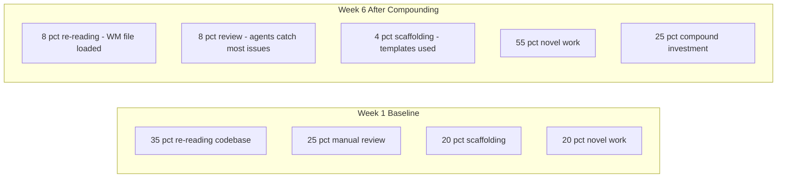

Novel problem-solving time went from 20% to 55% of total time. The validation review agent caught 73% of validation issues before human review. Time to first useful output on a new endpoint dropped from 45 minutes to 12 minutes.

---

## 13. The Metrics Dashboard: Measuring Compound Progress

You cannot improve what you do not measure. A compound engineering metrics dashboard tracks the health of the flywheel across sessions.

### 13.1 Core Metrics to Track

```typescript
interface CompoundMetrics {
  // Session efficiency
  timeToFirstOutput: number; // minutes: target < 10
  sessionSetupOverhead: number; // minutes: target < 5 (WM loading time)

  // Knowledge base health
  knowledgeBaseUtilization: number; // % of tasks that referenced prior KB: target > 60%
  kbEntryCount: number; // total entries: should grow monotonically
  kbEvictionRate: number; // % rejected by quality gate: target 10-20%

  // Review quality
  reviewRejectionRate: number; // % of PRs with P1 findings: target < 5%
  agentCaughtVsHumanCaught: number; // ratio: target > 3:1

  // Autonomy
  agentAutonomyRate: number; // % tasks needing no course-correction: target > 75%
  humanEscalationRate: number; // % tasks escalated to human: target < 10%
}
```

### 13.2 Session Telemetry

```python
# Emit metrics at the end of each compound phase
import time
import json
from pathlib import Path

class SessionTelemetry:
    def __init__(self, session_id: str):
        self.session_id = session_id
        self.start_time = time.time()
        self.events: list[dict] = []

    def record(self, event_type: str, data: dict):
        self.events.append({
            "timestamp": time.time() - self.start_time,
            "type": event_type,
            **data,
        })

    def emit(self, metrics_file: str = ".compound-metrics.jsonl"):
        summary = {
            "session_id": self.session_id,
            "duration_minutes": (time.time() - self.start_time) / 60,
            "kb_hits": sum(1 for e in self.events if e["type"] == "kb_hit"),
            "review_findings": sum(1 for e in self.events if e["type"] == "review_finding"),
            "compound_artifacts_added": sum(
                1 for e in self.events if e["type"] == "kb_write" and e.get("passed_gate")
            ),
        }
        with open(metrics_file, "a") as f:
            f.write(json.dumps(summary) + "\n")
```

### 13.3 The Knowledge Base Schema

A well-structured knowledge base is queryable, not just a flat text dump. Structure entries with typed categories so the agent can load only what is relevant to the current task.

```typescript
interface KnowledgeBaseEntry {
  id: string;
  category:
    | "convention"
    | "solution_pattern"
    | "pitfall"
    | "agent_definition"
    | "architecture_decision";
  title: string;
  content: string;
  tags: string[]; // for semantic search
  relevantPaths?: string[]; // file paths this entry applies to
  addedAt: string; // ISO timestamp
  usageCount: number; // how often retrieved
  qualityScore: number; // 0-1, from quality gate
}

// Example entries
const kb: KnowledgeBaseEntry[] = [
  {
    id: "conv-001",
    category: "convention",
    title: "API response shape",
    content:
      "All endpoints return { data, error, meta }. Never return raw objects.",
    tags: ["api", "fastapi", "response"],
    relevantPaths: ["app/routes/"],
    addedAt: "2025-01-15T10:00:00Z",
    usageCount: 47,
    qualityScore: 0.98,
  },
  {
    id: "pit-003",
    category: "pitfall",
    title: "SQLAlchemy N+1 with relationships",
    content:
      "Always use selectinload() for relationship loading. Lazy loading in FastAPI causes N+1 queries under async context.",
    tags: ["sqlalchemy", "performance", "database", "async"],
    relevantPaths: ["app/repositories/"],
    addedAt: "2025-01-14T14:30:00Z",
    usageCount: 23,
    qualityScore: 0.95,
  },
];
```

---

## 14. Anti-Patterns Catalog

Compound engineering has failure modes as specific as its success patterns. Knowing the anti-patterns is as important as knowing the practices.

### 14.1. Anti-Pattern 1: The Knowledge Graveyard

Artifacts are added to the knowledge base but never retrieved. The graveyard forms when entries are too broad ("best practices for Python"), poorly tagged, or simply not surfaced to the agent at session start.

**Fix**: Run a weekly query against your knowledge base for entries with zero usage in the last 14 days. Either delete them, refine their tags, or rewrite them to be more specific and actionable.

### 14.2. Anti-Pattern 2: The Reviewing Bottleneck

Teams invest in compound infrastructure but still manually review every line of generated code. This defeats the purpose entirely. The value of review agents is replacing line-level review, not supplementing it.

**Fix**: Define explicit trust boundaries. Trust agents for: following established patterns, adding new endpoints that match the solution library, and refactoring to known conventions. Require human review for: new security boundaries, schema migrations, public API surface changes, and anything marked P1 by the security review agent.

### 14.3. Anti-Pattern 3: Compound Without Measure

Teams run the compound loop for months but never measure whether it is working. Without metrics, they cannot tell if the knowledge base is helping or accumulating noise.

**Fix**: Instrument from session one. Even a simple spreadsheet tracking "time to first output" and "agent autonomy rate" per week will reveal whether compounding is working.

### 14.4. Anti-Pattern 4: The Plan-Skip

Under deadline pressure, teams skip the planning phase and jump straight to execution. This consistently produces output that requires more review cycles, not fewer, because the execution is misaligned with constraints.

**Fix**: Make planning time-boxed and non-negotiable. A 15-minute planning session prevents a 2-hour rework cycle. Time-box it if the team resists.

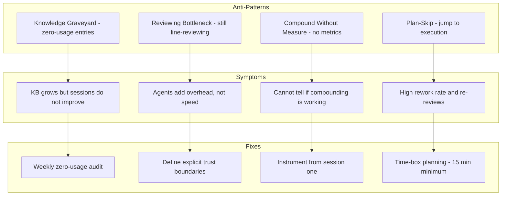
