import MdxLayout from "@/components/MdxLayout";

export const metadata = {
  title: "Context Engineering: Why Your AI Agent Forgets What You Just Told It",
  description:
    "A deep dive into context engineering for AI agents, covering attention budgets, context rot, retrieval strategies, compaction techniques, and practical patterns for building agents that maintain instruction fidelity across long sessions.",
  topics: [
    "Artificial Intelligence",
    "Agentic AI",
    "LLM Engineering",
    "RAG",
    "System Design",
  ],
};

export default function ContextEngineeringArticle({ children }) {
  return <MdxLayout>{children}</MdxLayout>;
}

# Context Engineering: Why Your AI Agent Forgets What You Just Told It

### Author: Son Nguyen

> Date: 2026-03-22

Every developer who has built an LLM-powered agent has hit the same wall: the agent works great for five turns, then slowly starts ignoring instructions, hallucinating, or repeating itself. The model did not get dumber. You ran out of context.

Context engineering is the discipline of managing what information an AI agent sees at any given moment. It is the natural evolution of prompt engineering. Where prompt engineering asks "how do I write a good prompt?", context engineering asks "how do I manage the entire information state, including system instructions, tools, retrieved documents, conversation history, and external data, across a multi-turn agent session that might run for 50-plus turns?"

This article breaks down the theory and practice of context engineering: why context degrades, how to measure it, five retrieval strategies, practical techniques for managing context windows, and the architectural patterns that separate demo agents from production agents.

---

## 1. The Core Problem

LLMs process information through a fixed-size context window. Everything the model needs to reason about, from system instructions to conversation history to tool results, must fit within this window. As the session progresses and more tokens accumulate, the model's ability to attend to earlier information degrades.

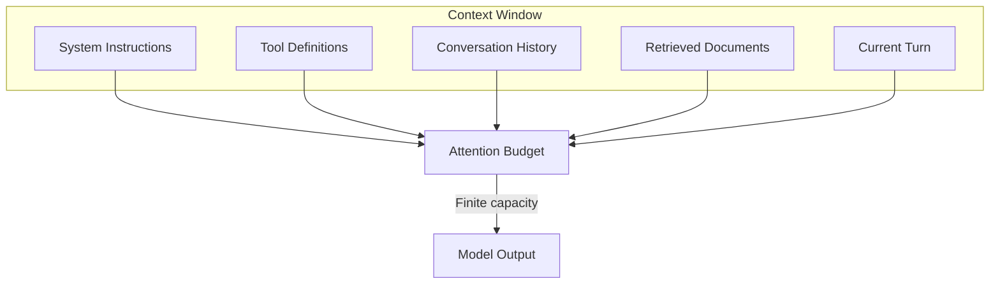

The guiding principle of context engineering is deceptively simple: **find the smallest possible set of high-signal tokens that maximize the likelihood of the desired outcome**.

---

## 2. Attention Budget and Context Rot

LLMs have a finite attention budget. Every token in the context window competes for the model's attention. As the window fills up, recall accuracy degrades, a phenomenon called **context rot**.

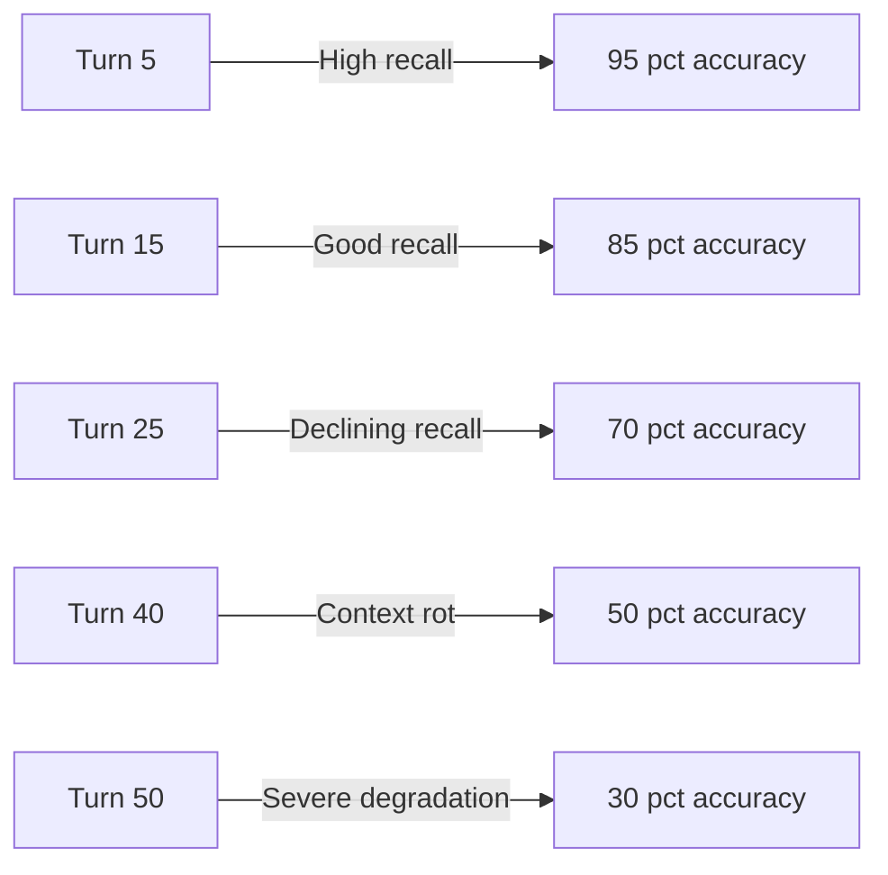

The math is brutal: transformer self-attention creates n-squared pairwise relationships between tokens. Double the context length and you quadruple the number of token relationships the model has to reason over. The result is **attention weight diffusion**: the model spreads its focus thinner and thinner across an ever-growing field of tokens.

### 2.1. How Context Rot Manifests

In practice, context rot looks like this:

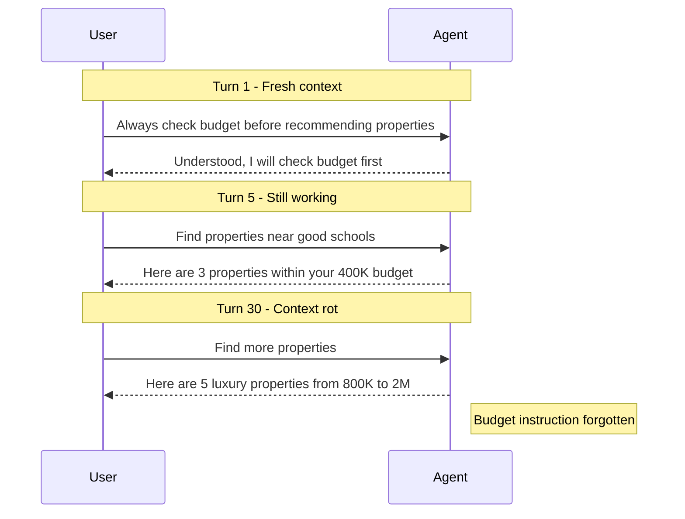

Your carefully written system prompt that says "always check the budget before recommending a property" gets gradually drowned out by 40 turns of conversation history, retrieved documents, and tool call results. By turn 30, the agent has functionally forgotten the instruction, not because the tokens are gone, but because the model can no longer effectively attend to them.

---

## 3. The Context Hierarchy

Not all context is created equal. Effective context engineering requires understanding the different types of context and their relative importance.

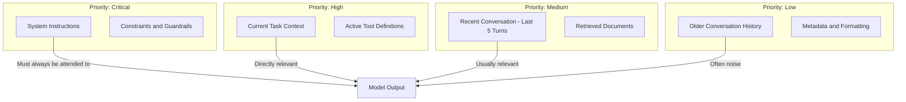

The hierarchy matters because when you need to trim context, you should remove low-priority tokens first. System instructions and constraints should never be summarized or removed. Task context should be preserved. Older conversation history is the first candidate for compaction.

---

## 4. Five Context Retrieval Strategies

Not all context needs to be loaded upfront. Different strategies suit different situations:

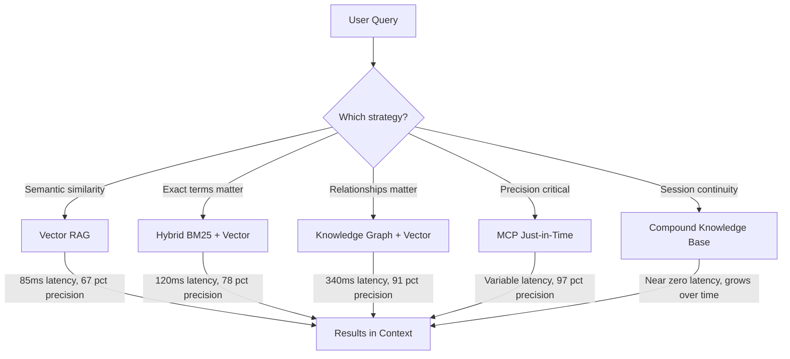

### 4.1. Strategy 1: Pure Vector RAG

Embed your documents, query a vector database at inference time, inject the top-k results into context. Fast at sub-100ms, but purely semantic. It cannot reason about relationships between entities. Works well for document Q&A but struggles with relational queries like "which properties near good schools are under $400K?"

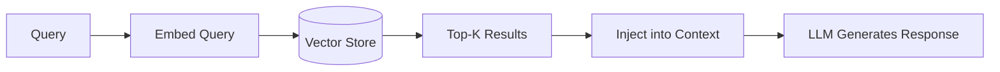

### 4.2. Strategy 2: Hybrid BM25 + Dense Vector

Combine keyword search (BM25) with semantic embedding search. Captures both exact-match and meaning-based relevance. Useful when exact terminology matters as much as semantic similarity, such as legal documents or government content.

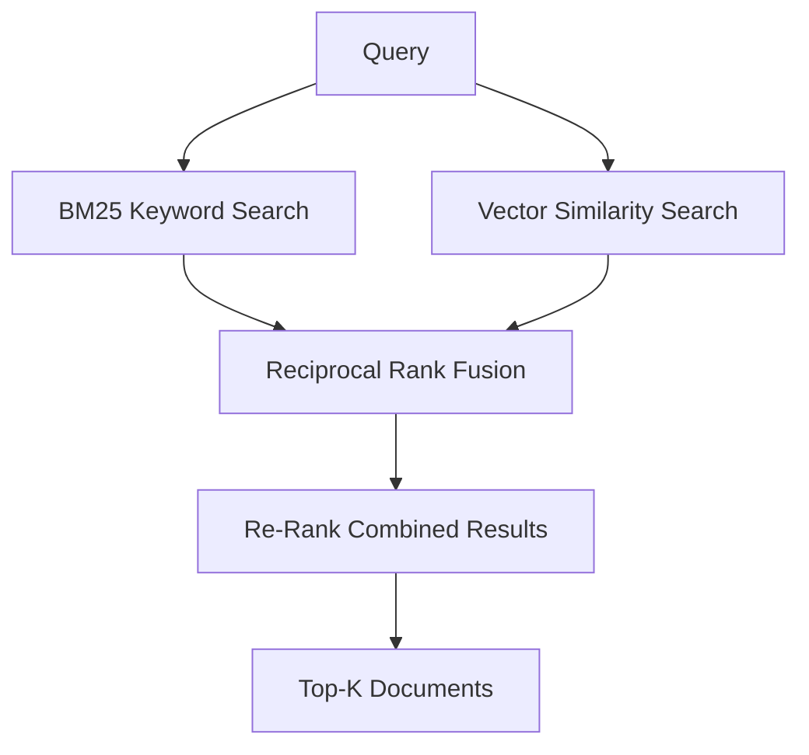

### 4.3. Strategy 3: Knowledge Graph + Vector

Use a graph database for structural relationships and a vector store for semantic similarity. This pattern enables traversal of complex relationships that pure embeddings cannot capture: property to neighborhood to amenity to school district, for example.

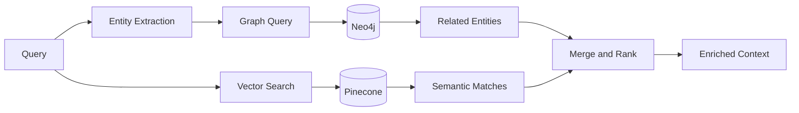

Precision jumps from roughly 67 percent to roughly 91 percent on relational queries, but at higher latency: about 340ms versus 85ms for pure vector.

### 4.4. Strategy 4: MCP Just-in-Time

Load nothing upfront. Instead, expose tools via the Model Context Protocol that the agent calls on demand. Context precision is near-perfect at roughly 97 percent because every token was explicitly requested. The tradeoff is latency, since a complex analysis might require 8-14 sequential tool calls.

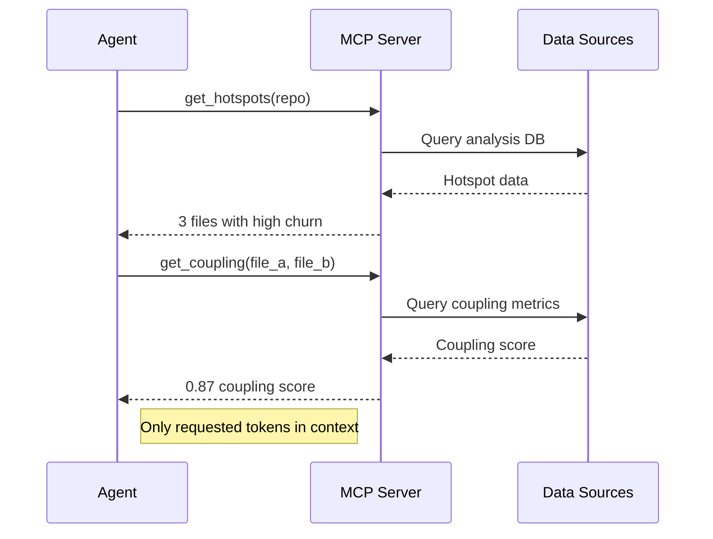

### 4.5. Strategy 5: Compound Knowledge Base

A persistent, growing collection of working memory files, solution libraries, and structured notes that are loaded at session start and updated at session end. This is context that improves over time, bridging context engineering and compound engineering.

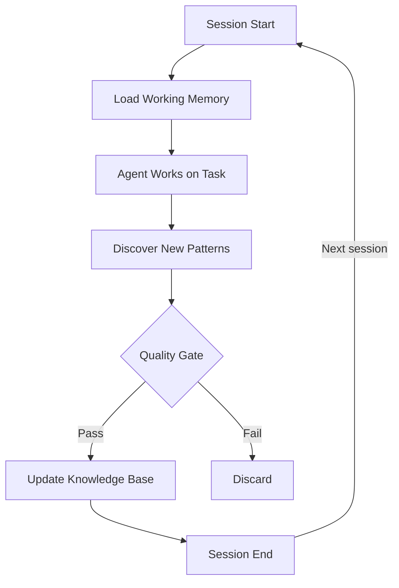

---

## 5. Strategy Comparison

| Strategy                 | Latency  | Precision       | Best For                           |
| ------------------------ | -------- | --------------- | ---------------------------------- |
| Pure Vector RAG          | ~85ms    | ~67%            | Document Q&A, semantic search      |
| Hybrid BM25 + Vector     | ~120ms   | ~78%            | Mixed keyword and semantic queries |
| Knowledge Graph + Vector | ~340ms   | ~91%            | Relational queries, connected data |
| MCP Just-in-Time         | Variable | ~97%            | Precision-critical analysis        |
| Compound Knowledge Base  | ~0ms     | Grows over time | Session continuity, team knowledge |

---

## 6. Practical Context Management Techniques

### 6.1 Context Compaction

Summarize conversation history when approaching the context limit. Preserve architectural decisions, unresolved issues, and implementation details. Discard redundant tool outputs.

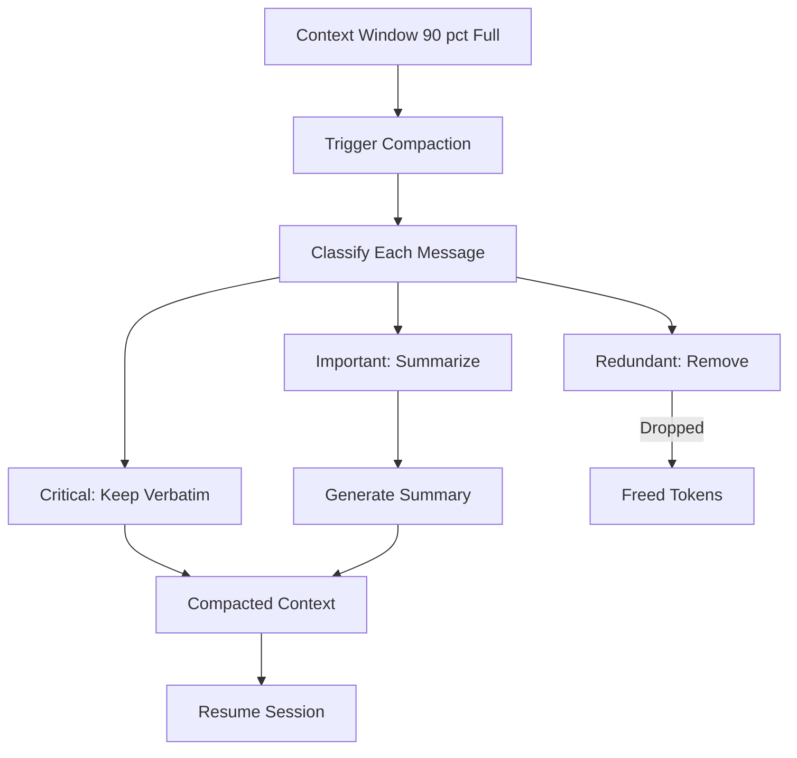

A good compaction strategy can extend effective session length from 15 turns to 50-plus turns.

### 6.2 Progressive Disclosure

Do not pre-load everything. Let agents discover context through exploration. File sizes suggest complexity, naming conventions hint at purpose, timestamps proxy relevance.

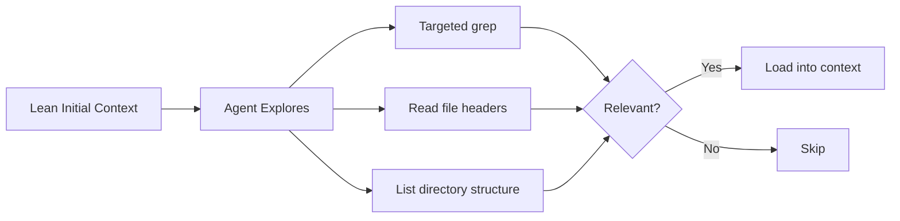

This approach keeps the baseline context lean while making rich data accessible on demand.

### 6.3 Just-in-Time Retrieval

Store lightweight identifiers such as file paths, query templates, and URLs in the prompt and hydrate them on demand via tool calls.

### 6.4 Tool Schema Hygiene

Every tool schema consumes tokens. If a human cannot tell which of two tools to use for a given task, neither can the agent. Eliminate overlapping tools, write crystal-clear descriptions, and keep the total tool count minimal.

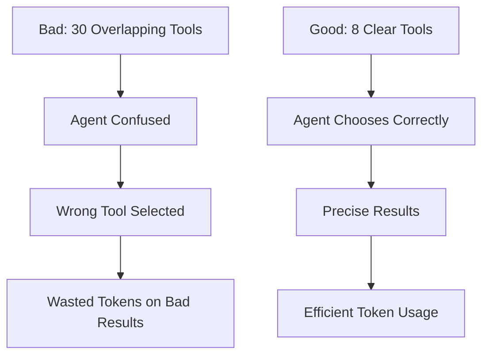

### 6.5 Sub-Agent Architectures

Specialized sub-agents handle focused tasks with clean, minimal contexts. Each sub-agent might explore extensively, reading 10K-plus tokens of code, but returns a condensed summary of 1-2K tokens to the parent. This is divide-and-conquer for context management.

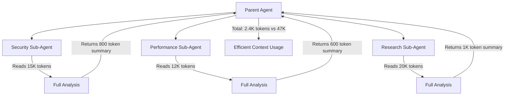

---

## 7. The Context Budget Framework

Managing context is like managing memory in systems programming. Allocate deliberately, free aggressively, and never assume the runtime will clean up after you.

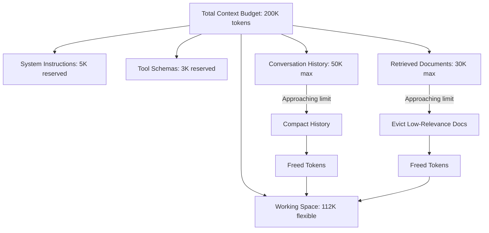

### 7.1. Budget Allocation Rules

1. **System instructions** get a fixed, non-negotiable allocation. They are re-injected after every compaction.
2. **Tool schemas** should be pruned to only the tools relevant for the current task phase.
3. **Conversation history** should be compacted progressively. The most recent 3-5 turns stay verbatim; older turns get summarized.
4. **Retrieved documents** should be evicted when no longer relevant to the active task.
5. **Working space** is the flexible buffer that grows and shrinks based on the current operation.

---

## 8. Measuring Context Health

You cannot improve what you do not measure. Track these metrics:

| Metric                       | What It Tells You                              | Target               |
| ---------------------------- | ---------------------------------------------- | -------------------- |
| Instruction recall at turn N | Is the agent following system instructions?    | Above 90% at turn 30 |
| Context utilization ratio    | How much of the context window is high-signal? | Above 60%            |
| Retrieval precision          | Are retrieved documents relevant to the query? | Above 80%            |
| Compaction loss              | Did summarization lose critical information?   | Below 5% info loss   |
| Tool selection accuracy      | Is the agent picking the right tool?           | Above 95%            |

---

## 9. Anti-Patterns to Avoid

### 9.1. The Kitchen Sink

Loading everything into context "just in case." This floods the attention budget with low-signal tokens and accelerates context rot.

### 9.2. The Static System Prompt

A 10,000-token system prompt that never changes regardless of the task phase. Most of those tokens are irrelevant at any given moment.

### 9.3. The Unbounded History

Never compacting conversation history. By turn 20, the agent is spending more attention on old, irrelevant exchanges than on the current task.

### 9.4. The Monolithic Agent

One agent tries to handle everything with one massive context. Sub-agent architectures are almost always more effective for complex tasks.

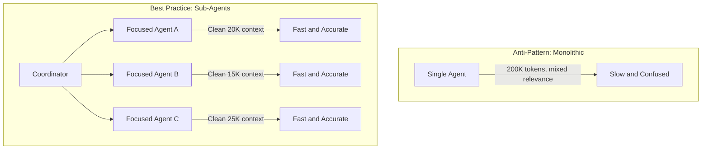

---

## 10. From Prompt Engineering to Context Engineering

The evolution from prompt engineering to context engineering reflects the growing sophistication of AI systems:

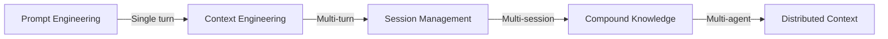

- **Prompt engineering** optimizes a single prompt for a single response.
- **Context engineering** manages the full information state across a multi-turn session.
- **Session management** preserves context across session boundaries.
- **Compound knowledge** builds persistent knowledge that improves across sessions.
- **Distributed context** coordinates context across multiple parallel agents.

---

## 11. Why This Matters Now

As agents move from simple chatbots to long-running autonomous systems, managing codebases, monitoring infrastructure, and onboarding employees, context engineering becomes the difference between a demo and a product.

An agent that degrades after 10 turns is a toy. An agent that maintains instruction fidelity at turn 50 is a tool you can trust with real work.

Context is not free. Treat it like memory in a systems programming language: allocate deliberately, free aggressively, and never assume the runtime will clean up after you.

The developers and teams who master context engineering will build agents that work reliably in production. Everyone else will keep wondering why their agents "forget" what they were told.

---

## 12. Token Counting and Budget Planning

You cannot manage what you cannot measure. Token counting lets you predict context utilization before making LLM calls, prevent over-limit errors, and make precise decisions about what to trim.

### 12.1 Counting Tokens Accurately

```python
import tiktoken  # works for OpenAI models
import anthropic

# OpenAI token counting
def count_tokens_openai(text: str, model: str = "gpt-4o") -> int:
    enc = tiktoken.encoding_for_model(model)
    return len(enc.encode(text))

# Anthropic token counting (uses the API for accuracy)
def count_tokens_anthropic(messages: list, model: str = "claude-sonnet-4-5") -> int:
    client = anthropic.Anthropic()
    response = client.messages.count_tokens(
        model=model,
        messages=messages,
        system="You are a helpful assistant.",
    )
    return response.input_tokens

# Practical: count a conversation before sending
def will_exceed_limit(messages: list, model: str, limit: int) -> bool:
    token_count = count_tokens_anthropic(messages, model)
    print(f"Current token count: {token_count} / {limit}")
    return token_count > limit * 0.9  # warn at 90% of limit
```

### 12.2 Context Window Comparison Across Models

Choosing the right model for your context requirements significantly affects cost and performance. Larger context windows are not always better; they are more expensive and can increase context rot.

| Model                     | Context Window | Best For                                 |
| ------------------------- | -------------- | ---------------------------------------- |
| claude-sonnet-4-5         | 200K tokens    | Long codebase analysis, document review  |
| claude-3-5-haiku-20241022 | 200K tokens    | High-throughput, cost-sensitive tasks    |
| gpt-4o                    | 128K tokens    | General agentic tasks                    |
| gpt-4o-mini               | 128K tokens    | Simple classification, routing           |
| gemini-2.0-flash          | 1M tokens      | Massive document corpora                 |
| llama-3.3-70b             | 128K tokens    | Self-hosted, privacy-sensitive workloads |

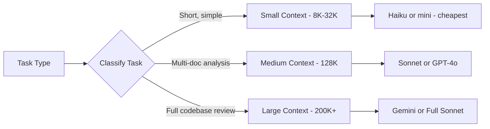

### 12.3 Implementing a Context Manager Class

A `ContextManager` class encapsulates all context lifecycle operations: adding messages, counting tokens, triggering compaction, and enforcing the budget hierarchy.

```python
from dataclasses import dataclass, field
from typing import List, Literal
import tiktoken

MessageRole = Literal["system", "user", "assistant", "tool"]

@dataclass
class Message:
    role: MessageRole
    content: str
    priority: int = 5  # 1=critical, 10=disposable

@dataclass
class ContextManager:
    model: str = "gpt-4o"
    max_tokens: int = 128_000
    compaction_threshold: float = 0.80  # compact at 80% full

    _messages: List[Message] = field(default_factory=list)
    _enc: tiktoken.Encoding = field(init=False)

    def __post_init__(self):
        self._enc = tiktoken.encoding_for_model(self.model)

    def count(self, text: str) -> int:
        return len(self._enc.encode(text))

    @property
    def total_tokens(self) -> int:
        return sum(self.count(m.content) for m in self._messages)

    @property
    def utilization(self) -> float:
        return self.total_tokens / self.max_tokens

    def add(self, role: MessageRole, content: str, priority: int = 5) -> None:
        self._messages.append(Message(role=role, content=content, priority=priority))
        if self.utilization > self.compaction_threshold:
            self._compact()

    def _compact(self) -> None:
        """Remove low-priority messages first, then summarize medium-priority ones."""
        # Sort by priority descending (higher priority = keep)
        self._messages.sort(key=lambda m: m.priority, reverse=True)

        # Drop disposable messages until under threshold
        while self.utilization > self.compaction_threshold and self._messages:
            lowest = self._messages[-1]
            if lowest.priority >= 3:  # never drop critical messages
                break
            self._messages.pop()

        print(f"Compacted: {self.total_tokens} tokens ({self.utilization:.0%} utilization)")

    def to_api_messages(self) -> List[dict]:
        return [{"role": m.role, "content": m.content} for m in self._messages]


# Usage
ctx = ContextManager(model="gpt-4o", max_tokens=128_000)
ctx.add("system", "You are a senior code reviewer.", priority=1)  # critical
ctx.add("user", "Review this PR for security issues.", priority=3)
ctx.add("assistant", "I found three potential SQL injection vectors...", priority=5)
ctx.add("tool", "<large tool result>", priority=8)  # disposable if needed
```

---

## 13. RAG Evaluation Metrics

Retrieval-Augmented Generation is only as good as its retrieval. An agent with perfect reasoning but poor retrieval produces confident, well-reasoned wrong answers. Measuring RAG quality requires evaluating both the retrieval component and the generation component independently.

### 13.1 The RAGAS Framework

RAGAS (Retrieval Augmented Generation Assessment) provides four core metrics:

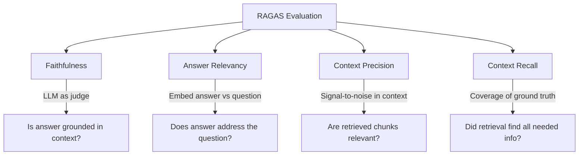

```python
from ragas import evaluate
from ragas.metrics import (
    faithfulness,
    answer_relevancy,
    context_precision,
    context_recall,
)
from datasets import Dataset

# Evaluation dataset: questions, contexts, answers, ground truths
eval_data = {
    "question": [
        "What is the refund policy for digital products?",
        "How do I reset my password?",
    ],
    "contexts": [
        ["Digital products are non-refundable after download. Exceptions apply for technical failures."],
        ["To reset your password, click 'Forgot password' on the login page and follow the email link."],
    ],
    "answer": [
        "Digital products cannot be refunded once downloaded.",
        "Click 'Forgot password' on the login screen.",
    ],
    "ground_truth": [
        "Digital products are non-refundable after download, except for technical failures.",
        "Use the 'Forgot password' link on the login page to receive a reset email.",
    ],
}

dataset = Dataset.from_dict(eval_data)
results = evaluate(
    dataset=dataset,
    metrics=[faithfulness, answer_relevancy, context_precision, context_recall],
)

print(results)
# {'faithfulness': 0.93, 'answer_relevancy': 0.89,
#  'context_precision': 0.85, 'context_recall': 0.91}
```

### 13.2 Interpreting RAG Metrics

| Metric            | Low Score Means                                 | Fix                                       |
| ----------------- | ----------------------------------------------- | ----------------------------------------- |
| Faithfulness      | Agent is hallucinating beyond retrieved context | Tighten system prompt; lower temperature  |
| Answer Relevancy  | Answers drift from the question                 | Improve query decomposition               |
| Context Precision | Too much noise in retrieved chunks              | Tune similarity threshold; use reranking  |
| Context Recall    | Missing relevant information                    | Increase top-K; improve chunking strategy |

### 13.3 Continuous RAG Evaluation in CI

```yaml
# .github/workflows/rag-eval.yml
name: RAG Evaluation

on:
  push:
    paths:
      - "lib/rag*.ts"
      - "scripts/vectorize_articles.mjs"

jobs:
  evaluate:
    runs-on: ubuntu-latest
    steps:
      - uses: actions/checkout@v4
      - name: Set up Python
        uses: actions/setup-python@v5
        with:
          python-version: "3.12"
      - name: Install evaluation deps
        run: pip install ragas langchain openai datasets
      - name: Run RAG evaluation
        env:
          OPENAI_API_KEY: ${{ secrets.OPENAI_API_KEY }}
          PINECONE_API_KEY: ${{ secrets.PINECONE_API_KEY }}
        run: python scripts/evaluate_rag.py
      - name: Assert quality thresholds
        run: python scripts/assert_rag_thresholds.py --faithfulness 0.85 --precision 0.80
```

This pipeline runs on every change to the RAG or vectorization code, ensuring that a retrieval improvement does not accidentally degrade faithfulness, and that a chunking change does not tank context recall.
