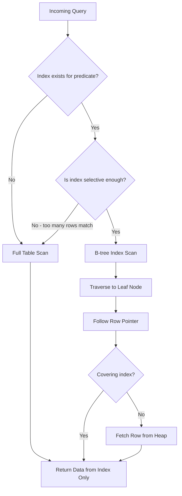
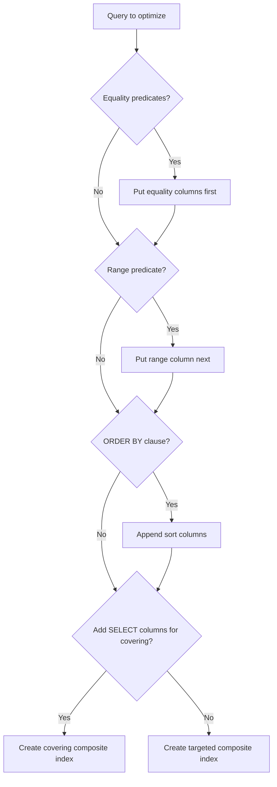
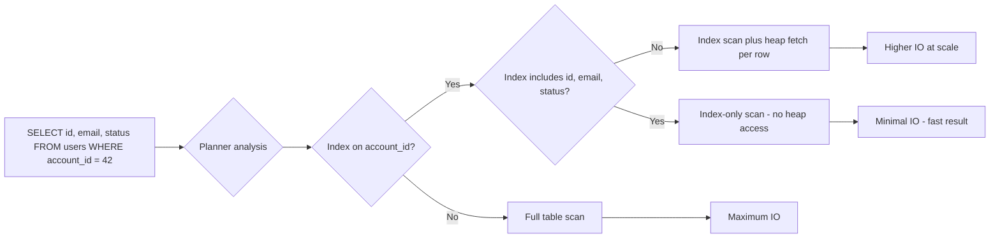
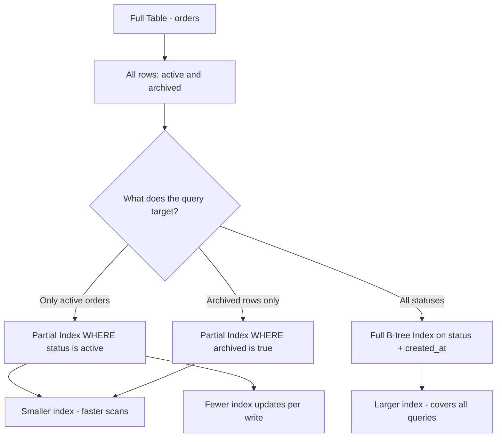
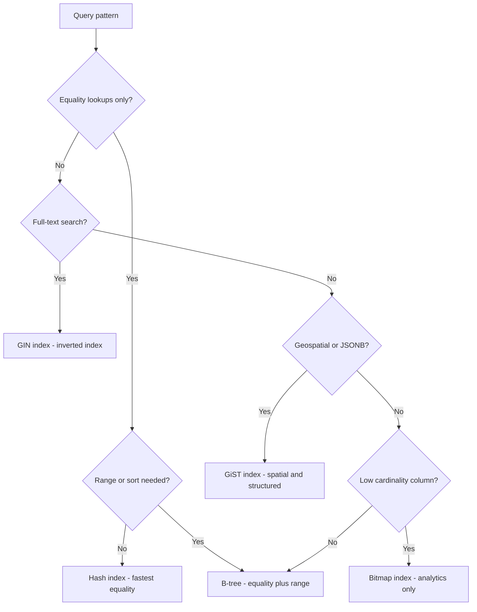
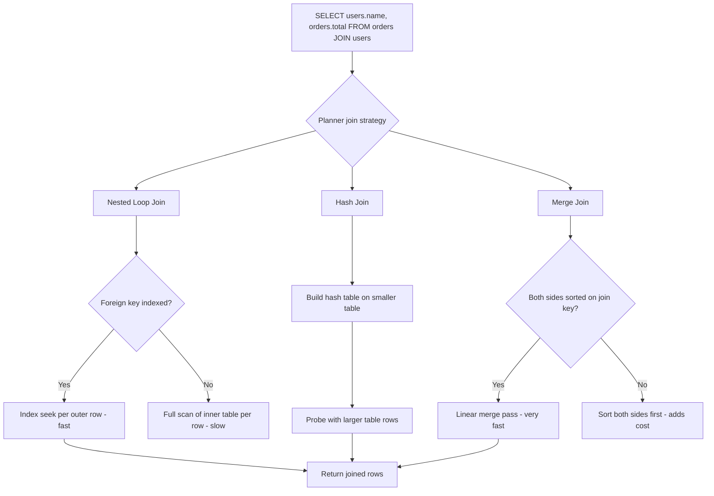
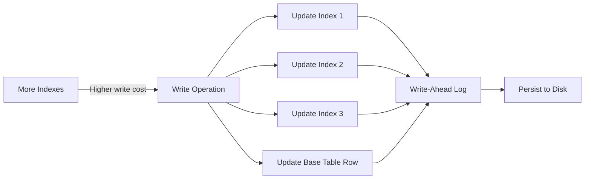
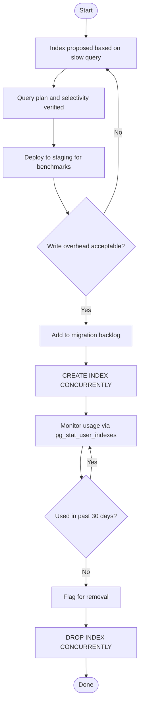
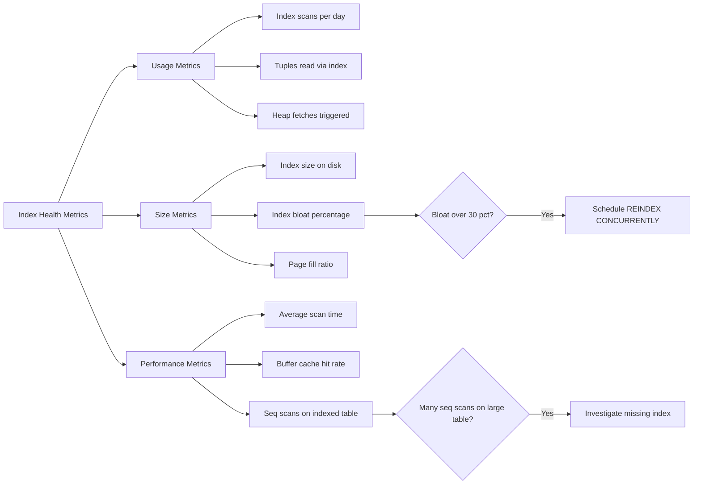
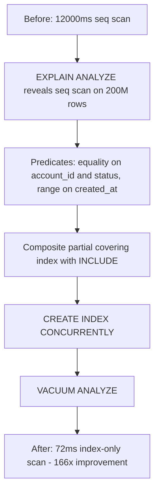

import MdxLayout from "@/components/MdxLayout";

export const metadata = {
  title: "Database Index Design: From Theory to Production Performance",
  description:
    "A detailed guide to choosing and operating database indexes, covering data access patterns, index types, maintenance, and real-world tradeoffs.",
  topics: ["Databases", "Performance", "System Design", "Backend"],
};

export default function DatabaseIndexDesignArticle({ children }) {
  return <MdxLayout>{children}</MdxLayout>;
}

# Database Index Design: From Theory to Production Performance

### Author: Son Nguyen

> Date: 2024-12-05

Indexes are the main lever for speeding up database queries, but they also add write overhead, storage cost, and operational complexity. Getting index design right requires understanding how queries access data, how the database planner makes decisions, and how indexes behave under production workloads. This article covers everything from foundational theory to advanced PostgreSQL techniques with real optimization case studies.

---

## 1. Foundations: Access Patterns and Selectivity

### 1.1. Start with Access Patterns

Indexes should be derived from how the application actually queries data, not from the schema alone:

- Identify the top queries by latency and frequency from your slow query log.
- Map filtering predicates, join keys, and sort clauses for each query.
- Separate read-heavy endpoints from write-heavy workflows — indexes help reads but hurt writes.
- Profile under realistic concurrency, not just single-query benchmarks.

Treat indexes as an optimization for specific queries, not a general-purpose boost.

### 1.2. Cardinality, Selectivity, and Data Distribution

Index effectiveness depends on data distribution:

- **High cardinality** columns (user IDs, UUIDs) are excellent index keys because each value maps to few rows.
- **Low cardinality** columns (boolean flags, status enums with 3 values) rarely benefit from standalone indexes.
- **Skewed distributions** can make indexes unreliable — if 90% of rows have `status = 'active'`, an index on `status` helps the 10% of queries for other values but not the majority.

Use `EXPLAIN ANALYZE` and column statistics (`pg_stats`) to validate selectivity before adding indexes. A good rule of thumb: an index is useful when the query touches less than 10-15% of the table rows.

### 1.3. How the Query Planner Decides

Understanding the planner's decision process is essential for predicting whether your index will actually be used:



The planner estimates the cost of each access path (sequential scan, index scan, bitmap scan) and picks the cheapest one. Even if an index exists, the planner may ignore it if the estimated selectivity is too low.

---

## 2. B-tree Indexes

### 2.1. When B-trees Shine

B-trees are the default index type in PostgreSQL, MySQL, and most relational databases because they support the broadest range of operations:

- **Equality lookups:** `WHERE id = 42`
- **Range scans:** `WHERE created_at >= '2025-01-01'`
- **Prefix matching:** `WHERE name LIKE 'Alice%'` (but not `LIKE '%Alice'`)
- **Ordered results:** `ORDER BY created_at DESC` without an explicit sort step
- **MIN/MAX aggregations:** The planner can jump directly to the first or last leaf node

B-trees work best when queries align with the index order and the predicate is selective. They struggle with pattern matching in the middle of strings and with low-cardinality equality checks where a bitmap scan is cheaper.

### 2.2. Composite Indexes and Column Ordering

Composite indexes are powerful but easy to misuse. The **leftmost prefix rule** means the index is useful only when the query includes the leading columns:

- `INDEX (account_id, created_at)` helps queries that filter by `account_id` alone or by `account_id + created_at`.
- It does **not** help queries that only filter by `created_at`.
- Column order should match: equality predicates first, then range predicates, then sort columns.

The following diagram shows the decision process for ordering columns in a composite index:



### 2.3. Covering Indexes and Index-Only Scans

A covering index includes all columns a query needs, allowing the database to satisfy the query entirely from the index without accessing the heap table. This eliminates the most expensive part of a normal index scan: random I/O to fetch each matching row.



In PostgreSQL, index-only scans depend on the **visibility map**. The visibility map tracks which heap pages contain only tuples visible to all transactions. If VACUUM has not run recently, the visibility map is stale and the planner falls back to heap fetches even when a covering index exists.

```sql
-- Check whether a query is actually getting IOS or falling back to heap fetches
EXPLAIN (ANALYZE, BUFFERS, FORMAT TEXT)
SELECT id, status, amount
FROM orders
WHERE account_id = 42;

-- Index Only Scan using idx_orders_covering on orders
--   Heap Fetches: 0          <- Zero is ideal
--   Heap Fetches: 8412       <- High value means VACUUM hasn't run

-- Fix: run targeted VACUUM and check autovacuum settings
VACUUM (ANALYZE) orders;
```

---

## 3. Specialized Index Types

### 3.1. Partial and Filtered Indexes

Partial indexes target only a subset of rows, reducing index size and write overhead:



Partial indexes are powerful when access patterns focus on a small slice of data. For example, if 95% of queries filter by `status = 'active'` and only 5% of rows are active, a partial index is dramatically smaller and faster than a full index.

### 3.2. Expression Indexes

Standard B-tree indexes store raw column values. Expression indexes store the result of an arbitrary expression, enabling the planner to use an index when queries filter on derived values:

```sql
-- Without expression index: full table scan even though email is indexed
EXPLAIN SELECT * FROM users WHERE lower(email) = 'alice@example.com';
-- Seq Scan on users (cost=0.00..3240.00 rows=100 width=200)

-- Create an expression index on the lowercased email
CREATE INDEX idx_users_email_lower ON users (lower(email));

-- Now the planner uses the index
EXPLAIN SELECT * FROM users WHERE lower(email) = 'alice@example.com';
-- Index Scan using idx_users_email_lower (cost=0.43..8.45 rows=1 width=200)

-- Expression index on a JSONB field
CREATE INDEX idx_events_user_id ON events ((payload->>'user_id'));

-- Expression index for date truncation in reporting queries
CREATE INDEX idx_orders_year_month ON orders (date_trunc('month', created_at));
```

The key constraint: the query predicate must exactly match the index expression. The planner will not canonicalize expressions for you.

### 3.3. Hash, GIN, GiST, and Bitmap Indexes

Different workloads benefit from specialized index types:



- **Hash indexes:** O(1) equality lookups, but no range or sort support and limited WAL replication in older PostgreSQL versions.
- **GIN (Generalized Inverted Index):** Ideal for full-text search (`tsvector`), JSONB containment (`@>`), and array overlap (`&&`).
- **GiST (Generalized Search Tree):** Spatial queries (PostGIS), range types, and nearest-neighbor searches.
- **Bitmap indexes:** Common in analytical databases (not PostgreSQL natively, but PostgreSQL uses bitmap scans internally when combining multiple indexes).

---

## 4. Indexes for Joins and Foreign Keys

### 4.1. Why Join Indexes Matter

Join performance depends heavily on index alignment. The planner chooses between nested loop, hash join, and merge join strategies based on table sizes and available indexes:



### 4.2. Practical Guidelines

- **Always index foreign keys** used in joins — PostgreSQL does not create these automatically.
- Match index order to the join predicate.
- For many-to-many relationships, index both sides of the junction table.
- Avoid unnecessary composite indexes when a single-column index on the FK is sufficient.

---

## 5. Write Amplification and Maintenance

### 5.1. The Cost of Every Index

Every index adds work on inserts, updates, and deletes. A single write operation must update the base table row plus every index that references the modified columns:



On write-heavy tables, each additional index can degrade insert throughput by 5-15%. Validate with write-heavy benchmarks before deploying new indexes to production.

### 5.2. Index Bloat and VACUUM

PostgreSQL's MVCC model means deleted or updated rows leave dead tuples in the index. Over time, index bloat increases the index size on disk and degrades scan performance. VACUUM and autovacuum reclaim this space, but misconfigured autovacuum settings can let bloat grow unchecked.

```sql
-- Check index bloat using pgstattuple
SELECT
  indexrelname,
  pg_size_pretty(pg_relation_size(indexrelid)) AS index_size,
  100 - (avg_leaf_density) AS bloat_pct
FROM pgstattuple_index('idx_orders_account')
JOIN pg_stat_user_indexes USING (indexrelid);

-- If bloat exceeds 30%, schedule a rebuild
REINDEX CONCURRENTLY idx_orders_account;
```

---

## 6. Index Lifecycle and Governance

### 6.1. From Proposal to Retirement

Managing indexes as production assets means tracking them from initial planning through eventual removal:



### 6.2. Governance Practices

- Add indexes via controlled migrations with backfill windows.
- Always use `CREATE INDEX CONCURRENTLY` to avoid locking the table.
- Monitor index usage with `pg_stat_user_indexes`; drop unused indexes after a verification period.
- Document index intent so future teams understand why each index exists.
- Treat indexes as product assets with owners and SLOs, just like APIs.

---

## 7. Monitoring Index Health

### 7.1. Key Metrics to Track

Effective index governance requires tracking these metrics in production:



### 7.2. Production SQL Queries for Index Health

These queries should run nightly and feed a health dashboard:

```sql
-- 1. Find unused indexes (candidates for removal)
SELECT
  schemaname, tablename, indexname,
  pg_size_pretty(pg_relation_size(indexrelid)) AS index_size,
  idx_scan
FROM pg_stat_user_indexes
WHERE idx_scan = 0
ORDER BY pg_relation_size(indexrelid) DESC;

-- 2. Find indexes with high heap fetch ratios (need INCLUDE columns)
SELECT
  indexrelname, idx_scan, idx_tup_read, idx_tup_fetch,
  round(100.0 * idx_tup_fetch / nullif(idx_tup_read, 0), 2) AS heap_fetch_pct
FROM pg_stat_user_indexes
WHERE idx_scan > 100
ORDER BY heap_fetch_pct DESC NULLS LAST
LIMIT 20;

-- 3. Find tables where sequential scans dominate (potential missing index)
SELECT
  relname AS tablename, seq_scan, idx_scan, n_live_tup,
  round(seq_scan * 100.0 / nullif(seq_scan + idx_scan, 0), 2) AS seq_scan_pct
FROM pg_stat_user_tables
WHERE seq_scan > 0 AND n_live_tup > 10000
ORDER BY seq_scan DESC
LIMIT 20;
```

---

## 8. Real-World Optimization Case Study

### 8.1. The Problem

An e-commerce platform has a `line_items` table with 200 million rows. A reporting query aggregating revenue by product is taking 12 seconds. The target is under 100ms.

```sql
-- Problematic query: 12 seconds
SELECT
  product_id,
  sum(quantity)                  AS units_sold,
  sum(unit_price * quantity)     AS revenue
FROM line_items
WHERE
  account_id = $1
  AND status = 'completed'
  AND created_at >= $2
  AND created_at < $3
GROUP BY product_id
ORDER BY revenue DESC
LIMIT 20;
```

### 8.2. Diagnosing with EXPLAIN ANALYZE

```sql
EXPLAIN (ANALYZE, BUFFERS)
SELECT product_id, sum(quantity), sum(unit_price * quantity)
FROM line_items
WHERE account_id = 123 AND status = 'completed'
  AND created_at BETWEEN '2025-01-01' AND '2025-02-01'
GROUP BY product_id ORDER BY 3 DESC LIMIT 20;

-- Seq Scan on line_items
-- (actual time=11432.000..11897.000 rows=19200 loops=1)
-- Buffers: shared read=1208000
```

The planner is doing a full sequential scan on 200M rows — no usable index exists.

### 8.3. Designing the Solution

The fix combines three indexing techniques:

1. **Composite column order:** Equality columns (`account_id`, `status`) first, range column (`created_at`) next.
2. **Partial index:** `WHERE status = 'completed'` excludes non-completed rows from the index entirely.
3. **Covering index with INCLUDE:** Add `product_id`, `quantity`, and `unit_price` to enable an index-only scan.

```sql
CREATE INDEX CONCURRENTLY idx_lineitems_account_revenue
  ON line_items (account_id, status, created_at)
  INCLUDE (product_id, quantity, unit_price)
  WHERE status = 'completed';
```

### 8.4. The Result

```sql
EXPLAIN (ANALYZE, BUFFERS)
-- same query as above
-- Index Only Scan using idx_lineitems_account_revenue on line_items
-- (actual time=0.412..72.000 rows=19200 loops=1)
-- Heap Fetches: 0
-- Buffers: shared hit=412
```

**12,000ms reduced to 72ms — a 166x improvement.** The key decisions: composite column order matching equality and range predicates, a partial index to reduce index size, and `INCLUDE` columns to enable an index-only scan.



---

## 9. Common Pitfalls and Checklist

### 9.1. Pitfalls to Avoid

- **Indexing low-selectivity columns** (status flags, booleans) as standalone indexes.
- **Creating redundant indexes** that overlap — `(a, b)` already covers queries on `(a)`.
- **Ignoring index bloat** and fragmentation on high-write tables.
- **Using indexes to mask bad queries** — indexes should reinforce good query design, not hide inefficient patterns.
- **Not testing under write load** — an index that helps reads may tank write throughput.
- **Forgetting to VACUUM** after bulk loads, causing index-only scans to degrade.

### 9.2. Production Checklist

- Build indexes from the highest-cost queries in your slow query log.
- Use composite indexes for multi-column predicates, following equality-range-sort order.
- Consider partial indexes when queries consistently filter to a small subset of rows.
- Use `INCLUDE` columns for high-frequency queries to enable index-only scans.
- Validate with `EXPLAIN ANALYZE` on realistic data volumes and concurrency.
- Monitor with `pg_stat_user_indexes` — drop unused indexes after a 30-day observation window.
- Schedule `REINDEX CONCURRENTLY` when bloat exceeds 30%.
- Revisit index strategy after product changes, traffic shifts, or major data growth.

---

## 10. Conclusion

Database index design is an empirical discipline. The right index for a workload cannot be determined from schema diagrams alone — it emerges from query execution plans, real data distributions, and production traffic patterns. Start by identifying the highest-cost queries, design indexes that match their exact predicate and sort structure, validate with `EXPLAIN ANALYZE` on representative data, and govern the index set as a production asset.

The PostgreSQL-specific features covered here — expression indexes, covering indexes with `INCLUDE`, partial index filters, and `pg_stat_user_indexes` queries — give teams the instruments to diagnose, improve, and maintain query performance at scale. The monitoring queries in section 7 should run nightly and feed a health dashboard that flags bloat, unused indexes, and tables with missing indexes before they become incidents.

---

## 11. Further Reading

- [PostgreSQL Index Types Documentation](https://www.postgresql.org/docs/current/indexes-types.html)
- [Use The Index, Luke — A Guide to Database Indexing](https://use-the-index-luke.com/)
- [pgMustard — EXPLAIN ANALYZE Visualization](https://www.pgmustard.com/)
- [Citus Blog — Index Maintenance and Bloat](https://www.citusdata.com/blog/)
- [Markus Winand — SQL Performance Explained](https://sql-performance-explained.com/)
