import MdxLayout from "@/components/MdxLayout";

export const metadata = {
  title: "Optimizing Databases: Indexing, Caching, and More",
  description:
    "An in-depth guide on database optimization techniques, covering indexing, caching, query optimization, sharding, connection pooling, and other best practices for achieving high performance and scalability.",
  topics: ["Databases", "Caching"],
};

export default function DatabaseOptimizationArticle({ children }) {
  return <MdxLayout>{children}</MdxLayout>;
}

# Optimizing Databases: Indexing, Caching, Sharding, and More

### Author: Son Nguyen

> Date: 2024-01-15

In today's data-driven world, the performance of your database can be the single most critical factor determining the success of your applications. Optimizing your database involves a blend of smart design choices, efficient queries, proper hardware configurations, and a variety of caching and indexing strategies. In this comprehensive guide, we explore a wide range of optimization techniques - from basic indexing and caching to advanced topics like sharding, connection pooling, and query refactoring. Whether you're managing a small website or a large-scale enterprise system, these best practices will help you achieve faster queries, higher throughput, and better scalability.

---

## 1. Introduction

As data volumes and application complexity grow, databases can quickly become performance bottlenecks if not properly tuned. Slow queries, high latency, and inefficient resource usage can lead to poor user experiences and increased operational costs. Optimizing databases is not a one-time task; it’s an ongoing process that involves continually refining your schema, queries, and server configurations. This guide provides a deep dive into various optimization techniques that can help you reduce query latency, enhance scalability, and improve overall system performance.

The following diagram shows how a query flows through various optimization layers:

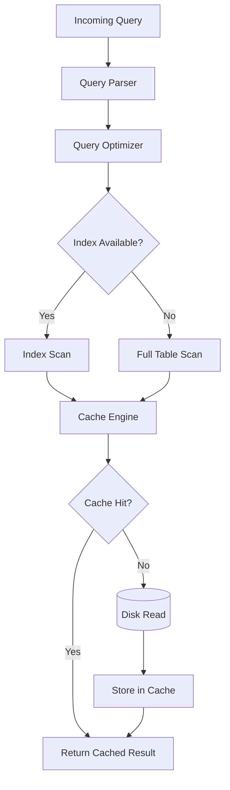

---

## 2. Indexing

Indexes are the cornerstone of database optimization. They allow the database engine to quickly locate data without scanning entire tables.

### Why Index?

- **Faster Data Retrieval:**
  Indexes significantly speed up read operations, especially on large tables.
- **Efficient Filtering:**
  Indexes are essential for queries that filter data using WHERE clauses, JOIN conditions, and ORDER BY statements.

### Best Practices

- **Targeted Indexing:**
  Create indexes on columns that are frequently used in search conditions or as part of join operations.
- **Avoid Over-Indexing:**
  Each index consumes additional storage and can slow down write operations. Balance your indexing strategy to optimize both reads and writes.
- **Monitor and Maintain:**
  Regularly analyze query performance using tools like `EXPLAIN` and adjust indexes accordingly.

### Example

```sql
-- Create an index on the 'email' column in the 'users' table
CREATE INDEX idx_users_email ON users(email);
```

---

## 3. Caching

Caching is an effective technique to reduce the number of direct database queries by storing frequently accessed data in memory.

### Caching Strategies

- **In-Memory Caching:**
  Use tools like Redis or Memcached to cache query results, session data, or even entire pages.
- **Application-Level Caching:**
  Leverage caching mechanisms within your application (e.g., Node.js libraries) to store temporary data.
- **Query Result Caching:**
  Some databases offer built-in caching for frequently executed queries.

### Benefits

- **Reduced Database Load:**
  By serving repeated requests from cache, you can dramatically reduce the workload on your primary database.
- **Improved Response Times:**
  Data retrieval from memory is significantly faster than disk reads.
- **Cost-Effective Scalability:**
  Caching helps you scale by reducing the need for more powerful (and expensive) database hardware.

### Example (Using Redis in Node.js)

```js
const redis = require("redis");
const client = redis.createClient();

client.on("error", (error) => {
  console.error("Redis error:", error);
});

// Try to get cached data
client.get("users", (err, cachedData) => {
  if (cachedData) {
    console.log("Data from cache:", JSON.parse(cachedData));
  } else {
    // Fallback to a database query (simulate with dummy data)
    const data = [
      { id: 1, name: "Alice" },
      { id: 2, name: "Bob" },
    ];
    // Cache the result for 1 hour
    client.setex("users", 3600, JSON.stringify(data));
    console.log("Data from DB:", data);
  }
});
```

---

## 4. Query Optimization

Optimizing your SQL queries and database design is crucial for minimizing execution time and resource consumption.

### Techniques

- **Selective Column Retrieval:**
  Avoid using `SELECT *`. Instead, retrieve only the columns you need.
- **Optimized Joins:**
  Use proper join types and ensure the joined columns are indexed.
- **Query Refactoring:**
  Simplify complex queries by breaking them into smaller, more manageable parts.
- **Execution Plan Analysis:**
  Use tools like `EXPLAIN` to understand how your queries are executed and identify bottlenecks.

### Example

```sql
-- Instead of:
SELECT * FROM orders WHERE customer_id = 123;

-- Use:
SELECT order_id, order_date, total FROM orders WHERE customer_id = 123;
```

---

## 5. Partitioning and Sharding

For large databases, splitting data into smaller, more manageable pieces can significantly improve performance and scalability.

### Partitioning

- **Definition:**
  Partitioning divides a table into smaller segments based on specific criteria (e.g., date ranges, geographic regions).
- **Benefits:**
  Improves query performance by scanning only relevant partitions and simplifies maintenance tasks.

### Sharding

- **Definition:**
  Sharding distributes data across multiple servers or clusters, ensuring no single server becomes a bottleneck.
- **Considerations:**
  Choose a sharding key that evenly distributes data and minimizes cross-shard queries.

The following decision tree helps choose a sharding strategy based on data access patterns:

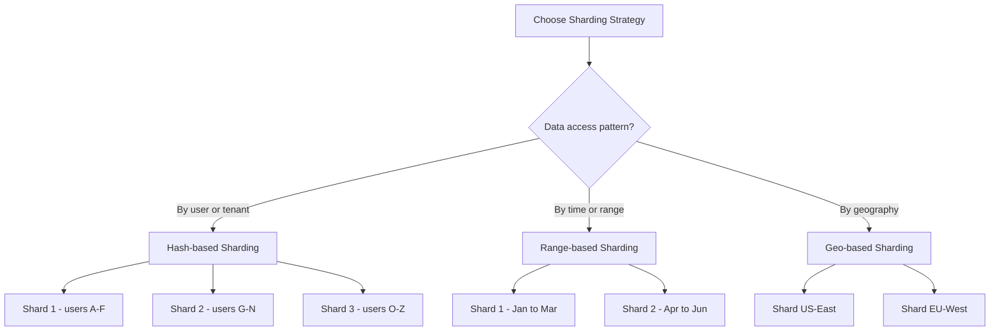

---

## 6. Connection Pooling

Connection pooling helps manage database connections by reusing existing connections rather than establishing new ones for every query.

### Benefits

- **Reduced Overhead:**
  Reusing connections lowers the cost associated with opening and closing connections.
- **Improved Throughput:**
  Multiple queries can be handled concurrently, boosting overall performance.
- **Stability:**
  Efficient connection management prevents connection exhaustion, ensuring consistent performance.

The following diagram illustrates how connection pooling works between application instances and the database:

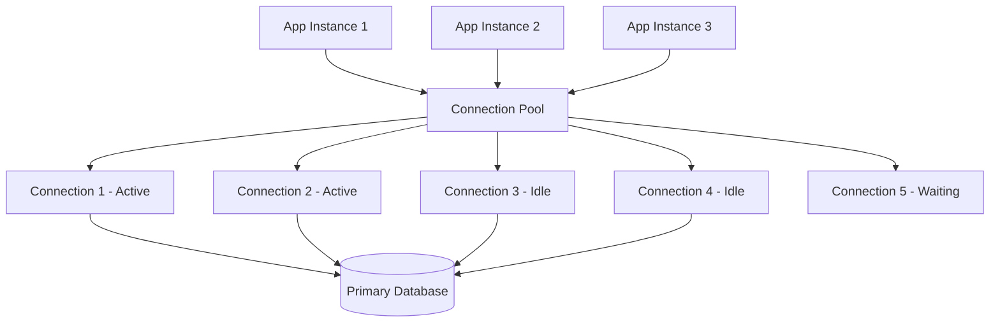

### Example (Using PostgreSQL in Node.js)

```js
const { Pool } = require("pg");
const pool = new Pool({
  connectionString: process.env.DATABASE_URL,
  max: 20,
  idleTimeoutMillis: 30000,
  connectionTimeoutMillis: 2000,
});

pool.query("SELECT NOW()", (err, res) => {
  console.log(err, res);
  pool.end();
});
```

---

## 7. Denormalization and Data Modeling

While normalization is important for reducing data redundancy, denormalization can be beneficial in read-heavy environments.

The stages of query execution show how the database engine processes a query from parse to result delivery:

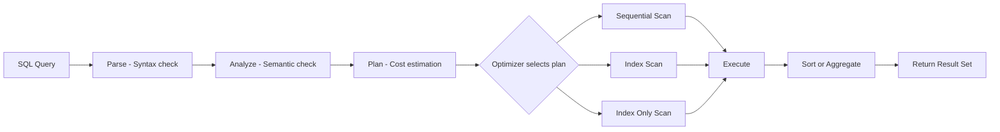

### Considerations

- **Trade-Off:**
  Denormalization increases redundancy but reduces the need for complex joins, leading to faster read performance.
- **Hybrid Approaches:**
  Use a combination of normalized and denormalized data models to balance consistency and performance.

---

## 8. Hardware and Configuration Optimizations

Beyond software optimizations, proper hardware configuration and system tuning are essential.

### Strategies

- **Memory and Buffer Settings:**
  Allocate sufficient memory and tune cache sizes to maximize performance.
- **Disk I/O:**
  Use SSDs and optimize disk configurations to reduce latency.
- **Network Optimization:**
  In distributed environments, optimize network settings to minimize latency.
- **Database-Specific Tuning:**
  Leverage database-specific configurations (e.g., PostgreSQL’s work_mem, MySQL’s innodb_buffer_pool_size) for optimal performance.

---

## 9. Monitoring and Maintenance

Regular monitoring and maintenance are vital to sustaining optimal database performance.

### Tools and Techniques

- **Performance Monitoring:**
  Use tools like Prometheus, Grafana, or database-specific monitoring systems to track key metrics.
- **Index Maintenance:**
  Periodically rebuild or reorganize indexes to ensure they remain efficient.
- **Query Logging:**
  Analyze slow query logs to identify and optimize underperforming queries.
- **Regular Backups:**
  Schedule routine backups and performance audits to catch issues before they escalate.

The following diagram shows the multi-layer caching architecture from CDN down to the database:

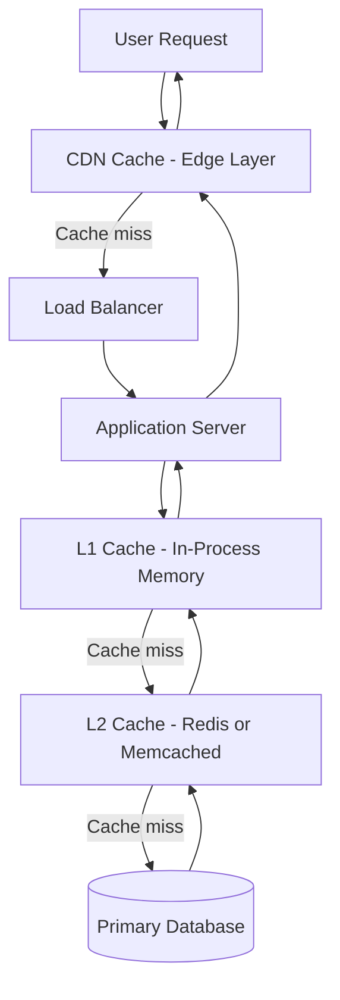

---

## 10. Index Types and Selection

Choosing the right index type for each workload is as important as deciding which columns to index:

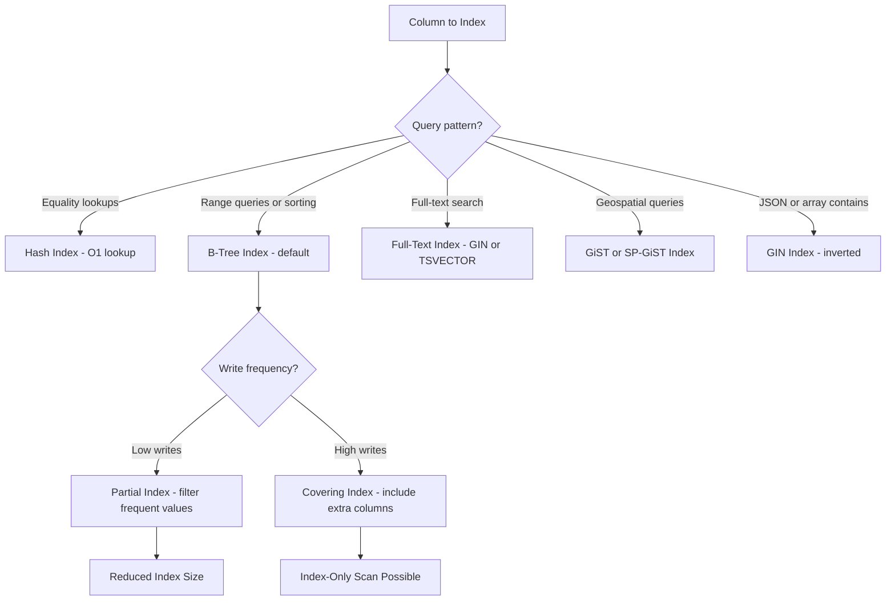

---

## 11. Read Replica and Primary Routing

Offloading reads to replicas reduces pressure on the primary and enables horizontal read scaling:

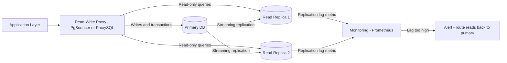

---

## 12. Slow Query Diagnosis Workflow

Tracking and resolving slow queries follows a repeatable investigative cycle:

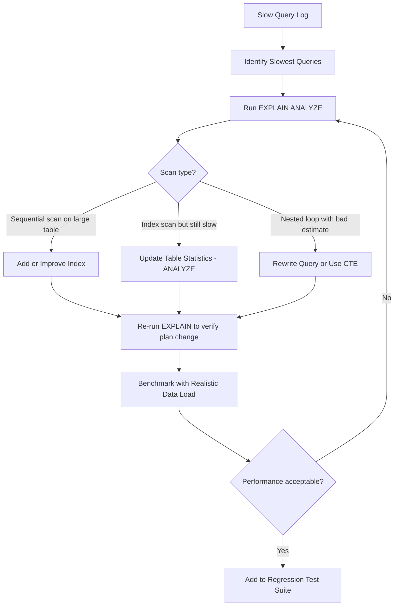

---

## 13. Database Normalization Forms

Normal forms define how to remove redundancy from a relational schema step by step:

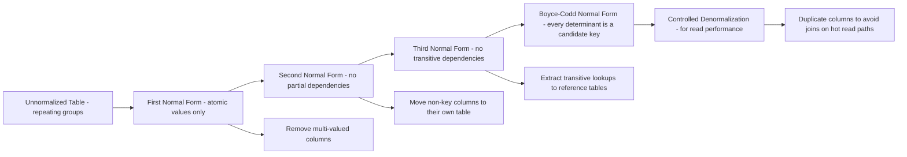

---

## 14. EXPLAIN ANALYZE Deep Dive

`EXPLAIN ANALYZE` is the most powerful diagnostic tool available in PostgreSQL. It executes the query and annotates each plan node with actual timing and row count data, letting you compare the planner's estimates against reality.

```sql
-- Always wrap in a transaction when running on production to prevent side effects
BEGIN;

EXPLAIN (ANALYZE, BUFFERS, FORMAT TEXT)
  SELECT
    o.order_id,
    o.order_date,
    c.email,
    SUM(oi.quantity * oi.unit_price) AS total
  FROM orders o
  JOIN customers c  ON c.customer_id = o.customer_id
  JOIN order_items oi ON oi.order_id = o.order_id
  WHERE o.order_date >= NOW() - INTERVAL '30 days'
    AND c.region = 'US-EAST'
  GROUP BY o.order_id, o.order_date, c.email
  ORDER BY total DESC
  LIMIT 50;

ROLLBACK;
```

A sample output and how to read it:

```
Sort  (cost=4821.33..4821.46 rows=50 width=72)
      (actual time=38.201..38.210 rows=50 loops=1)
  Sort Key: (sum(...)) DESC
  Sort Method: top-N heapsort  Memory: 30kB
  ->  HashAggregate  (cost=4818.12..4819.12 rows=50 width=72)
                     (actual time=38.089..38.155 rows=50 loops=1)
        Batches: 1  Memory Usage: 40kB
        ->  Hash Join  (cost=120.44..4710.55 rows=10757 width=28)
                       (actual time=1.823..35.114 rows=11203 loops=1)
              Hash Cond: (oi.order_id = o.order_id)
              ->  Seq Scan on order_items oi   <-- WARNING: sequential scan
                  (cost=0.00..3840.00 rows=240000 width=16)
                  (actual time=0.012..18.342 rows=240000 loops=1)
```

Key signals to look for:

- **Rows estimate vs. actual:** A large discrepancy (e.g., estimated 5, actual 50000) means stale statistics. Run `ANALYZE table_name;`.
- **Sequential Scan on large table:** If `rows` is large, add an index on the filtered/joined column.
- **Nested Loop with large outer row count:** Consider rewriting as a hash join or adding a covering index.
- **Sort Method: external merge:** The query is spilling to disk. Increase `work_mem` for this session.

```sql
-- Fix for the sequential scan above
CREATE INDEX CONCURRENTLY idx_order_items_order_id
  ON order_items (order_id);

-- Fix for stale stats causing poor estimates
ANALYZE customers;
ANALYZE orders;
```

---

## 15. Materialized Views

A materialized view stores the result of a query physically on disk. It trades staleness for query speed — ideal for pre-aggregating expensive reports.

```sql
-- Create a materialized view for daily revenue by region
CREATE MATERIALIZED VIEW mv_daily_revenue AS
  SELECT
    DATE_TRUNC('day', o.order_date) AS day,
    c.region,
    SUM(oi.quantity * oi.unit_price) AS revenue,
    COUNT(DISTINCT o.order_id)        AS orders
  FROM orders o
  JOIN customers   c  ON c.customer_id  = o.customer_id
  JOIN order_items oi ON oi.order_id    = o.order_id
  GROUP BY 1, 2
WITH DATA;

-- Index the materialized view for fast dashboard queries
CREATE INDEX idx_mv_daily_revenue_day_region
  ON mv_daily_revenue (day, region);

-- Refresh options
REFRESH MATERIALIZED VIEW mv_daily_revenue;                -- blocks reads
REFRESH MATERIALIZED VIEW CONCURRENTLY mv_daily_revenue;  -- non-blocking, needs unique index
```

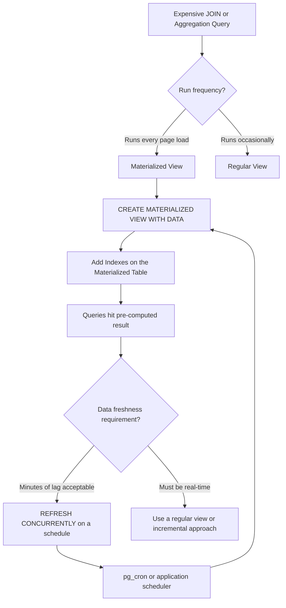

---

## 16. Vacuum, Autovacuum, and Table Bloat

PostgreSQL's MVCC model never overwrites rows in place — it writes new versions. Dead tuples from updates and deletes accumulate until `VACUUM` reclaims them. Without regular vacuuming, tables balloon and index scans slow down.

```sql
-- See per-table vacuum status
SELECT
  relname                                          AS table,
  n_dead_tup,
  n_live_tup,
  ROUND(n_dead_tup::numeric / NULLIF(n_live_tup, 0) * 100, 1) AS dead_pct,
  last_autovacuum,
  last_analyze
FROM pg_stat_user_tables
ORDER BY n_dead_tup DESC
LIMIT 20;
```

Tuning autovacuum for high-write tables:

```sql
-- Override autovacuum thresholds per table
ALTER TABLE orders SET (
  autovacuum_vacuum_scale_factor    = 0.01,  -- vacuum when 1% of rows are dead (default 0.2)
  autovacuum_analyze_scale_factor   = 0.005, -- analyze when 0.5% changed
  autovacuum_vacuum_cost_delay      = 2      -- ms delay between cost-limit bursts (default 20)
);
```

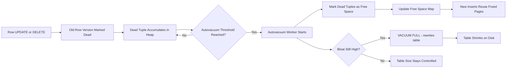

### Detecting Index Bloat

```sql
-- Estimate index bloat using pgstattuple (requires the extension)
SELECT
  schemaname,
  tablename,
  indexname,
  pg_size_pretty(pg_relation_size(indexrelid)) AS index_size,
  idx_scan,
  idx_tup_read,
  idx_tup_fetch
FROM pg_stat_user_indexes
ORDER BY pg_relation_size(indexrelid) DESC
LIMIT 10;

-- Rebuild a bloated index without locking reads
REINDEX INDEX CONCURRENTLY idx_users_email;
```

---

## 17. Real Query Optimization Case Study

This is a before-and-after walkthrough of a slow reporting query on an e-commerce schema with 50 million order rows.

**Before (12,300 ms):**

```sql
SELECT
  DATE_TRUNC('month', o.created_at) AS month,
  p.category,
  SUM(oi.qty * oi.price)            AS revenue
FROM orders o
  JOIN order_items oi ON oi.order_id = o.id
  JOIN products    p  ON p.id        = oi.product_id
WHERE o.status = 'completed'
GROUP BY 1, 2
ORDER BY 1, 2;
```

`EXPLAIN ANALYZE` showed two sequential scans: one on `orders` (50M rows) filtering by `status`, and one on `order_items` (200M rows).

**Fixes applied:**

```sql
-- 1. Partial index: only index rows where status = 'completed'
CREATE INDEX CONCURRENTLY idx_orders_completed_created_at
  ON orders (created_at)
  WHERE status = 'completed';

-- 2. Covering index on order_items to avoid heap fetches
CREATE INDEX CONCURRENTLY idx_order_items_covering
  ON order_items (order_id) INCLUDE (qty, price, product_id);

-- 3. Rewrite using a CTE for clarity and planner hints
WITH completed AS (
  SELECT id, created_at
  FROM orders
  WHERE status = 'completed'
    AND created_at >= '2023-01-01'  -- add time bound to limit scan
)
SELECT
  DATE_TRUNC('month', c.created_at) AS month,
  p.category,
  SUM(oi.qty * oi.price)            AS revenue
FROM completed c
  JOIN order_items oi ON oi.order_id  = c.id
  JOIN products    p  ON p.id         = oi.product_id
GROUP BY 1, 2
ORDER BY 1, 2;
```

**After (340 ms):** A 36x improvement purely from indexing strategy and a minimal query rewrite — no hardware changes required.

---

## 18. Conclusion

Optimizing databases is a multi-faceted endeavor that involves careful planning and continuous improvement. By applying strategies such as effective indexing, robust caching, query optimization, partitioning, connection pooling, and hardware tuning, you can dramatically enhance the performance and scalability of your database systems. Regular monitoring and proactive maintenance further ensure that your databases continue to meet the demands of modern applications.

The most impactful optimizations — partial indexes, covering indexes, materialized views, and well-tuned autovacuum — are all zero-downtime changes that can be applied to live production databases. Start with `EXPLAIN ANALYZE` to find the actual bottleneck, apply the targeted fix, then verify the plan changed. Repeat this cycle and you will see compounding improvements.

Implementing these best practices will help you create a resilient, high-performance infrastructure capable of handling increasing data loads and complex query requirements. Remember, optimization is an ongoing process - continuous monitoring and iterative improvements are key to sustained success.

---

## 19. Further Reading and Resources

- **Indexing Best Practices:**
  - [PostgreSQL Indexing](https://www.postgresql.org/docs/current/indexes.html)
  - [MySQL Indexing](https://dev.mysql.com/doc/refman/8.0/en/optimization-indexes.html)
- **Caching Strategies:**
  - [Redis Documentation](https://redis.io/documentation)
  - [Memcached Overview](https://www.memcached.org/)
- **Query Optimization:**
  - [SQL Performance Explained](https://sql-performance-explained.com/)
- **Database Tuning Books:**
  - _High Performance MySQL_
  - _PostgreSQL: Up and Running_
- **Monitoring Tools:**
  - [Prometheus](https://prometheus.io/)
  - [Grafana](https://grafana.com/)

---

_This guide provides a comprehensive overview of database optimization techniques. Use these strategies to ensure your databases deliver the performance and scalability required by modern, data-intensive applications._
