import MdxLayout from "@/components/MdxLayout";

export const metadata = {
  title: "Design Patterns in Software Engineering",
  description:
    "A comprehensive guide to classical and modern software design patterns, covering creational, structural, and behavioral patterns with TypeScript examples and architectural diagrams.",
  topics: [
    "Software Engineering",
    "Design Patterns",
    "Architecture",
    "Backend",
  ],
};

export default function DesignPatternsArticle({ children }) {
  return <MdxLayout>{children}</MdxLayout>;
}

# Design Patterns in Software Engineering

### Author: Son Nguyen

> Date: 2026-03-22

Design patterns are reusable solutions to problems that occur repeatedly in software design. They are not finished designs that can be transformed directly into code, but rather templates describing how to solve a problem in many different situations. Understanding design patterns helps engineers communicate more effectively, write more maintainable code, and avoid reinventing the wheel when confronting well-known architectural challenges.

This article covers the three major pattern families — creational, structural, and behavioral — with TypeScript implementations, Mermaid diagrams, and practical guidance on choosing the right pattern for a given situation.

---

## 1. The History and Purpose of Design Patterns

The concept of design patterns was popularized in 1994 by the book "Design Patterns: Elements of Reusable Object-Oriented Software," written by the "Gang of Four" (Erich Gamma, Richard Helm, Ralph Johnson, and John Vlissides). The book catalogued 23 patterns organized into three categories.

Before patterns had names and accepted structures, engineers solved similar problems independently, producing wildly varying solutions. Naming a pattern — "Factory Method," "Observer," "Strategy" — gives teams a shared vocabulary. When a senior engineer says "let's use an Observer here," every engineer familiar with the canon immediately understands the structure, the intent, and the trade-offs.

Patterns solve three recurring concerns:

1. **Encapsulating variation** — Identify what changes and isolate it so the rest of the system does not need to change.
2. **Programming to interfaces, not implementations** — Depend on abstractions rather than concrete classes.
3. **Favoring composition over inheritance** — Build flexible object structures by combining simple objects rather than relying on deep inheritance hierarchies.

---

## 2. Pattern Categories Overview

The Gang of Four organized patterns into three buckets based on their purpose.

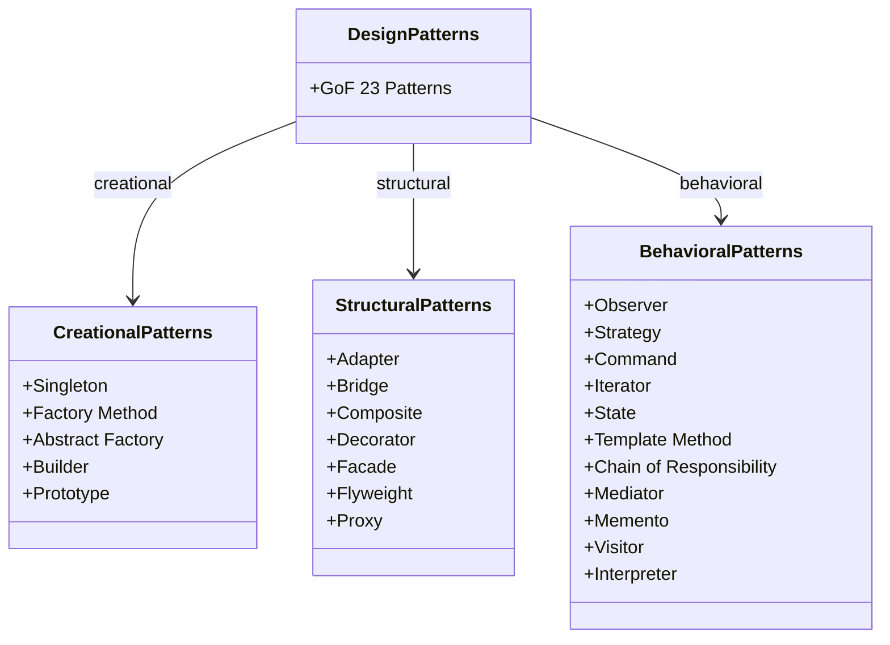

**Creational patterns** deal with object creation mechanisms. They try to create objects in a way that is suitable for the situation, abstracting the instantiation process.

**Structural patterns** deal with how objects and classes are composed to form larger structures. They make it easier to build relationships between entities.

**Behavioral patterns** deal with communication between objects — who talks to whom, and how responsibility is assigned and passed around.

---

## 3. Creational Patterns

### 3.1 Singleton Pattern

The Singleton ensures that a class has only one instance and provides a global access point to it. It is appropriate when exactly one object is needed to coordinate actions across the system — for example, a configuration registry, a thread pool, or a logging service.

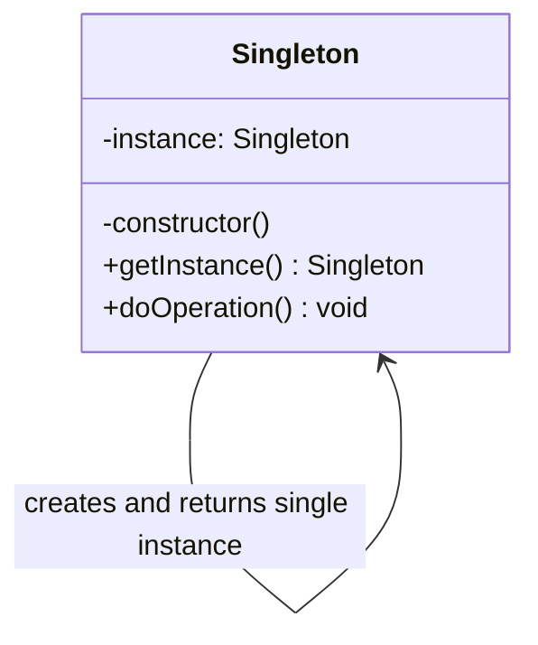

**TypeScript implementation:**

```typescript
class ConfigRegistry {
  private static instance: ConfigRegistry;
  private config: Record<string, string> = {};

  private constructor() {
    // Private constructor prevents direct instantiation
  }

  static getInstance(): ConfigRegistry {
    if (!ConfigRegistry.instance) {
      ConfigRegistry.instance = new ConfigRegistry();
    }
    return ConfigRegistry.instance;
  }

  set(key: string, value: string): void {
    this.config[key] = value;
  }

  get(key: string): string | undefined {
    return this.config[key];
  }
}

// Usage
const registry = ConfigRegistry.getInstance();
registry.set("API_URL", "https://api.example.com");

const sameRegistry = ConfigRegistry.getInstance();
console.log(sameRegistry.get("API_URL")); // "https://api.example.com"
console.log(registry === sameRegistry); // true
```

**When to use:** Shared resources with a single global access point — loggers, config stores, connection pools.

**Caution:** Singletons introduce global state, which makes testing harder and can create hidden dependencies between modules. Consider dependency injection as a more testable alternative.

---

### 3.2 Factory Method Pattern

The Factory Method defines an interface for creating an object, but lets subclasses decide which class to instantiate. The factory method lets a class defer instantiation to subclasses.

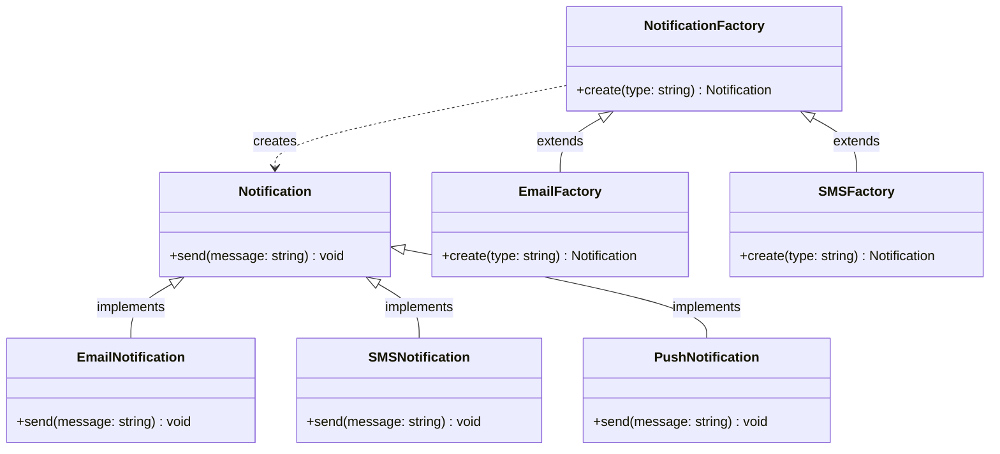

**TypeScript implementation:**

```typescript
interface Notification {
  send(message: string): void;
}

class EmailNotification implements Notification {
  constructor(private readonly address: string) {}

  send(message: string): void {
    console.log(`Email to ${this.address}: ${message}`);
  }
}

class SMSNotification implements Notification {
  constructor(private readonly phone: string) {}

  send(message: string): void {
    console.log(`SMS to ${this.phone}: ${message}`);
  }
}

class PushNotification implements Notification {
  constructor(private readonly deviceId: string) {}

  send(message: string): void {
    console.log(`Push to device ${this.deviceId}: ${message}`);
  }
}

type NotificationType = "email" | "sms" | "push";

interface NotificationConfig {
  type: NotificationType;
  target: string;
}

function createNotification(config: NotificationConfig): Notification {
  switch (config.type) {
    case "email":
      return new EmailNotification(config.target);
    case "sms":
      return new SMSNotification(config.target);
    case "push":
      return new PushNotification(config.target);
    default:
      throw new Error(`Unknown notification type: ${config.type}`);
  }
}

// Usage
const notifier = createNotification({
  type: "email",
  target: "user@example.com",
});
notifier.send("Your order has shipped!");
```

**When to use:** When you need to decouple the creation of objects from the code that uses them, and when the exact type of object to create may vary at runtime.

---

### 3.3 Builder Pattern

The Builder separates the construction of a complex object from its representation so that the same construction process can create different representations. It is valuable when an object has many optional parameters or when the construction sequence matters.

**TypeScript implementation:**

```typescript
interface QueryOptions {
  table: string;
  conditions: string[];
  columns: string[];
  limit?: number;
  offset?: number;
  orderBy?: string;
  orderDirection?: "ASC" | "DESC";
}

class QueryBuilder {
  private options: QueryOptions = {
    table: "",
    conditions: [],
    columns: ["*"],
  };

  from(table: string): QueryBuilder {
    this.options.table = table;
    return this;
  }

  select(...columns: string[]): QueryBuilder {
    this.options.columns = columns;
    return this;
  }

  where(condition: string): QueryBuilder {
    this.options.conditions.push(condition);
    return this;
  }

  limit(n: number): QueryBuilder {
    this.options.limit = n;
    return this;
  }

  offset(n: number): QueryBuilder {
    this.options.offset = n;
    return this;
  }

  orderBy(column: string, direction: "ASC" | "DESC" = "ASC"): QueryBuilder {
    this.options.orderBy = column;
    this.options.orderDirection = direction;
    return this;
  }

  build(): string {
    const {
      table,
      conditions,
      columns,
      limit,
      offset,
      orderBy,
      orderDirection,
    } = this.options;

    let query = `SELECT ${columns.join(", ")} FROM ${table}`;

    if (conditions.length > 0) {
      query += ` WHERE ${conditions.join(" AND ")}`;
    }
    if (orderBy) {
      query += ` ORDER BY ${orderBy} ${orderDirection ?? "ASC"}`;
    }
    if (limit !== undefined) {
      query += ` LIMIT ${limit}`;
    }
    if (offset !== undefined) {
      query += ` OFFSET ${offset}`;
    }

    return query;
  }
}

// Usage
const query = new QueryBuilder()
  .from("users")
  .select("id", "name", "email")
  .where("active = true")
  .where("age > 18")
  .orderBy("name", "ASC")
  .limit(20)
  .offset(40)
  .build();

console.log(query);
// SELECT id, name, email FROM users WHERE active = true AND age > 18 ORDER BY name ASC LIMIT 20 OFFSET 40
```

**When to use:** When constructing an object that requires many steps, or when you need to produce different variations of an object using the same construction code.

---

## 4. Structural Patterns

### 4.1 Decorator Pattern

The Decorator attaches additional responsibilities to an object dynamically. Decorators provide a flexible alternative to subclassing for extending functionality, because you can mix and match behaviors at runtime by stacking decorators.

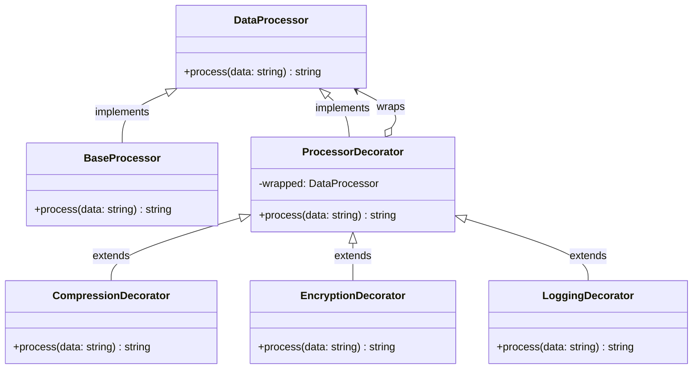

**TypeScript implementation:**

```typescript
interface DataProcessor {
  process(data: string): string;
}

class BaseProcessor implements DataProcessor {
  process(data: string): string {
    return data;
  }
}

abstract class ProcessorDecorator implements DataProcessor {
  constructor(protected readonly wrapped: DataProcessor) {}

  process(data: string): string {
    return this.wrapped.process(data);
  }
}

class CompressionDecorator extends ProcessorDecorator {
  process(data: string): string {
    const processed = this.wrapped.process(data);
    return `[compressed:${processed}]`;
  }
}

class EncryptionDecorator extends ProcessorDecorator {
  process(data: string): string {
    const processed = this.wrapped.process(data);
    return `[encrypted:${processed}]`;
  }
}

class LoggingDecorator extends ProcessorDecorator {
  process(data: string): string {
    console.log(`Processing: ${data}`);
    const result = this.wrapped.process(data);
    console.log(`Result: ${result}`);
    return result;
  }
}

// Usage — stack decorators at runtime
const pipeline: DataProcessor = new LoggingDecorator(
  new EncryptionDecorator(new CompressionDecorator(new BaseProcessor())),
);

pipeline.process("user-sensitive-data");
// Logs input, compresses, encrypts, logs output
```

**When to use:** When you need to add behavior to individual objects without affecting other objects of the same class, and when subclassing would create an explosion of combinations.

---

### 4.2 Adapter Pattern

The Adapter converts the interface of a class into another interface that clients expect. It lets classes work together that could not otherwise because of incompatible interfaces.

```typescript
// Existing legacy payment processor with an incompatible interface
class LegacyPaymentProcessor {
  processPayment(amount: number, cardNumber: string): boolean {
    console.log(`Legacy: Processing $${amount} on card ${cardNumber}`);
    return true;
  }
}

// Target interface that the rest of the application expects
interface ModernPaymentGateway {
  charge(payload: { amountCents: number; token: string }): Promise<boolean>;
}

// Adapter bridges the gap
class LegacyPaymentAdapter implements ModernPaymentGateway {
  constructor(private readonly legacy: LegacyPaymentProcessor) {}

  async charge(payload: {
    amountCents: number;
    token: string;
  }): Promise<boolean> {
    const amount = payload.amountCents / 100;
    return this.legacy.processPayment(amount, payload.token);
  }
}

// Usage — the caller uses the modern interface without knowing about legacy
const gateway: ModernPaymentGateway = new LegacyPaymentAdapter(
  new LegacyPaymentProcessor(),
);

await gateway.charge({ amountCents: 4999, token: "tok_visa_4242" });
```

---

### 4.3 Facade Pattern

The Facade provides a simplified interface to a complex subsystem. It does not encapsulate the subsystem — the subsystem's classes remain accessible — but the facade offers a higher-level interface that makes the subsystem easier to use.

```typescript
// Complex subsystem components
class AudioCodec {
  decode(file: string): Buffer {
    console.log(`Decoding audio: ${file}`);
    return Buffer.from([]);
  }
}

class VideoCodec {
  decode(file: string): Buffer {
    console.log(`Decoding video: ${file}`);
    return Buffer.from([]);
  }
}

class SubtitleParser {
  parse(file: string): string[] {
    console.log(`Parsing subtitles: ${file}`);
    return [];
  }
}

class AudioOutput {
  play(buffer: Buffer): void {
    console.log("Playing audio...");
  }
}

class VideoOutput {
  render(buffer: Buffer): void {
    console.log("Rendering video...");
  }
}

// Facade — single entry point for playing a video file
class MediaPlayerFacade {
  private audioCodec = new AudioCodec();
  private videoCodec = new VideoCodec();
  private subtitleParser = new SubtitleParser();
  private audioOutput = new AudioOutput();
  private videoOutput = new VideoOutput();

  playFile(filePath: string, subtitlePath?: string): void {
    const audio = this.audioCodec.decode(filePath);
    const video = this.videoCodec.decode(filePath);

    if (subtitlePath) {
      const subtitles = this.subtitleParser.parse(subtitlePath);
      console.log(`Loaded ${subtitles.length} subtitle lines`);
    }

    this.videoOutput.render(video);
    this.audioOutput.play(audio);
  }
}

// Usage — caller only interacts with the facade
const player = new MediaPlayerFacade();
player.playFile("/videos/movie.mp4", "/subtitles/movie.en.vtt");
```

---

## 5. Behavioral Patterns

### 5.1 Observer Pattern

The Observer defines a one-to-many dependency between objects. When one object (the Subject) changes state, all its dependents (Observers) are notified and updated automatically. This is the backbone of event systems, reactive programming, and the publish/subscribe model.

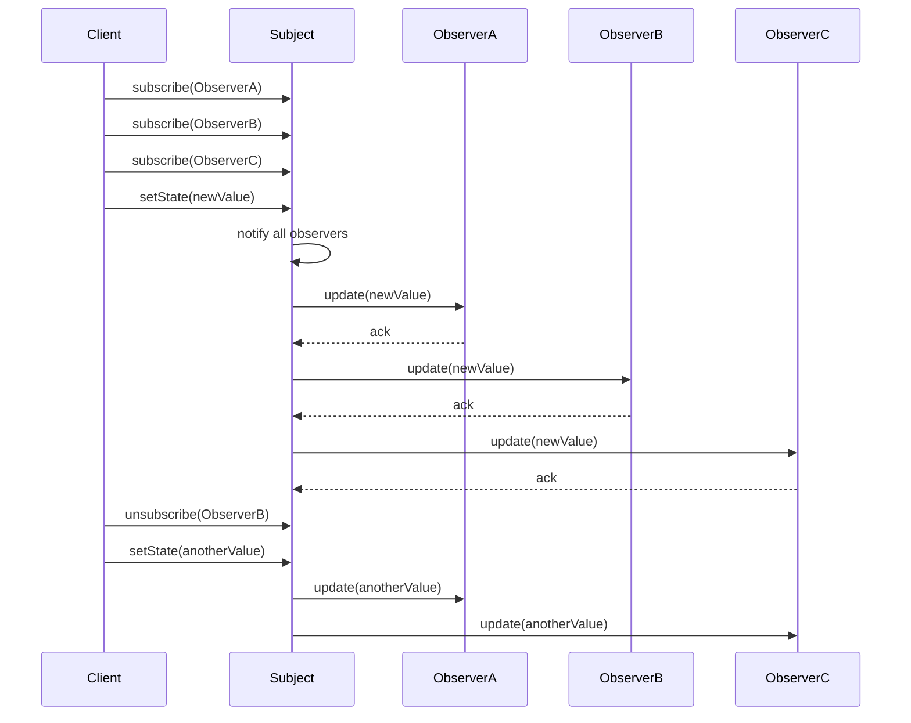

**TypeScript implementation:**

```typescript
type EventHandler<T> = (event: T) => void;

class EventEmitter<T> {
  private handlers: Set<EventHandler<T>> = new Set();

  subscribe(handler: EventHandler<T>): () => void {
    this.handlers.add(handler);
    return () => this.handlers.delete(handler);
  }

  emit(event: T): void {
    this.handlers.forEach((handler) => handler(event));
  }
}

interface StockTick {
  symbol: string;
  price: number;
  timestamp: Date;
}

class StockFeed {
  private priceUpdated = new EventEmitter<StockTick>();

  get onPriceUpdate() {
    return this.priceUpdated.subscribe.bind(this.priceUpdated);
  }

  updatePrice(symbol: string, price: number): void {
    this.priceUpdated.emit({ symbol, price, timestamp: new Date() });
  }
}

// Usage
const feed = new StockFeed();

const unsubscribeAlert = feed.onPriceUpdate((tick) => {
  if (tick.price > 200) {
    console.log(`ALERT: ${tick.symbol} reached $${tick.price}`);
  }
});

const unsubscribeLogger = feed.onPriceUpdate((tick) => {
  console.log(
    `[LOG] ${tick.symbol}: $${tick.price} at ${tick.timestamp.toISOString()}`,
  );
});

feed.updatePrice("AAPL", 185);
feed.updatePrice("AAPL", 205); // triggers alert

unsubscribeAlert(); // stop alerts
feed.updatePrice("AAPL", 210); // only logger fires
```

**When to use:** When changes in one object trigger changes in others and you do not know in advance how many objects need to change, and when the relationship between producers and consumers should be loosely coupled.

---

### 5.2 Strategy Pattern

The Strategy defines a family of algorithms, encapsulates each one, and makes them interchangeable. The Strategy pattern lets the algorithm vary independently from the clients that use it.

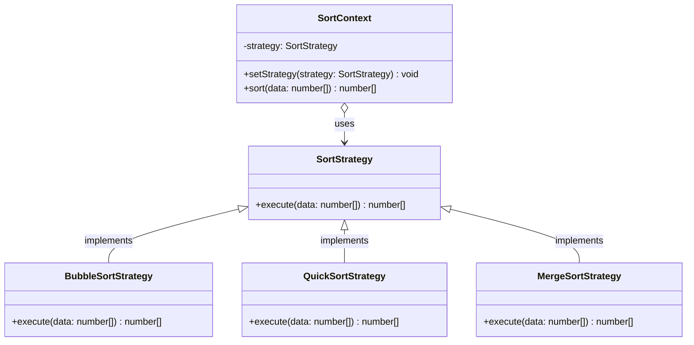

**TypeScript implementation:**

```typescript
interface CompressionStrategy {
  compress(data: Buffer): Buffer;
  decompress(data: Buffer): Buffer;
  name: string;
}

class GzipStrategy implements CompressionStrategy {
  name = "gzip";

  compress(data: Buffer): Buffer {
    console.log("Compressing with gzip...");
    return data; // simplified for illustration
  }

  decompress(data: Buffer): Buffer {
    console.log("Decompressing with gzip...");
    return data;
  }
}

class BrotliStrategy implements CompressionStrategy {
  name = "brotli";

  compress(data: Buffer): Buffer {
    console.log("Compressing with brotli...");
    return data;
  }

  decompress(data: Buffer): Buffer {
    console.log("Decompressing with brotli...");
    return data;
  }
}

class ZstdStrategy implements CompressionStrategy {
  name = "zstd";

  compress(data: Buffer): Buffer {
    console.log("Compressing with zstd...");
    return data;
  }

  decompress(data: Buffer): Buffer {
    console.log("Decompressing with zstd...");
    return data;
  }
}

class FileCompressor {
  constructor(private strategy: CompressionStrategy) {}

  setStrategy(strategy: CompressionStrategy): void {
    this.strategy = strategy;
    console.log(`Switched to ${strategy.name} compression`);
  }

  compress(data: Buffer): Buffer {
    return this.strategy.compress(data);
  }

  decompress(data: Buffer): Buffer {
    return this.strategy.decompress(data);
  }
}

// Usage — swap strategies based on file type or environment
const compressor = new FileCompressor(new GzipStrategy());
compressor.compress(Buffer.from("large file content"));

// Switch to brotli for web assets
compressor.setStrategy(new BrotliStrategy());
compressor.compress(Buffer.from("web asset content"));
```

**When to use:** When you need to switch between different variants of an algorithm at runtime, and when you want to isolate the algorithm's implementation from the code that uses it.

---

### 5.3 State Pattern

The State allows an object to alter its behavior when its internal state changes. The object will appear to change its class. It is a clean alternative to large `if/else` or `switch` blocks that branch on an internal status field.

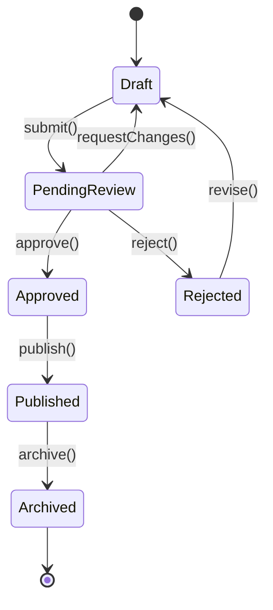

**TypeScript implementation:**

```typescript
interface DocumentState {
  name: string;
  submit(): void;
  approve(): void;
  reject(): void;
  publish(): void;
}

class Document {
  private state: DocumentState;
  public title: string;

  constructor(title: string) {
    this.title = title;
    this.state = new DraftState(this);
  }

  transitionTo(state: DocumentState): void {
    console.log(
      `[${this.title}] Transition: ${this.state.name} -> ${state.name}`,
    );
    this.state = state;
  }

  get currentState(): string {
    return this.state.name;
  }

  submit(): void {
    this.state.submit();
  }
  approve(): void {
    this.state.approve();
  }
  reject(): void {
    this.state.reject();
  }
  publish(): void {
    this.state.publish();
  }
}

class DraftState implements DocumentState {
  name = "Draft";
  constructor(private doc: Document) {}

  submit(): void {
    this.doc.transitionTo(new PendingReviewState(this.doc));
  }
  approve(): void {
    console.log("Cannot approve a draft — submit it first.");
  }
  reject(): void {
    console.log("Cannot reject a draft.");
  }
  publish(): void {
    console.log("Cannot publish a draft.");
  }
}

class PendingReviewState implements DocumentState {
  name = "PendingReview";
  constructor(private doc: Document) {}

  submit(): void {
    console.log("Already under review.");
  }
  approve(): void {
    this.doc.transitionTo(new ApprovedState(this.doc));
  }
  reject(): void {
    this.doc.transitionTo(new DraftState(this.doc));
  }
  publish(): void {
    console.log("Cannot publish — waiting for approval.");
  }
}

class ApprovedState implements DocumentState {
  name = "Approved";
  constructor(private doc: Document) {}

  submit(): void {
    console.log("Already approved.");
  }
  approve(): void {
    console.log("Already approved.");
  }
  reject(): void {
    console.log("Cannot reject an approved document.");
  }
  publish(): void {
    this.doc.transitionTo(new PublishedState(this.doc));
  }
}

class PublishedState implements DocumentState {
  name = "Published";
  constructor(private doc: Document) {}

  submit(): void {
    console.log("Cannot resubmit a published document.");
  }
  approve(): void {
    console.log("Already published.");
  }
  reject(): void {
    console.log("Cannot reject a published document.");
  }
  publish(): void {
    console.log("Already published.");
  }
}

// Usage
const doc = new Document("Q1 Engineering Report");
doc.submit(); // Draft -> PendingReview
doc.approve(); // PendingReview -> Approved
doc.publish(); // Approved -> Published
doc.submit(); // No-op: Cannot resubmit a published document
```

---

### 5.4 Command Pattern

The Command encapsulates a request as an object, allowing you to parameterize clients with different requests, queue or log operations, and support undoable operations.

```typescript
interface Command {
  execute(): void;
  undo(): void;
}

class TextEditor {
  private content = "";
  private history: Command[] = [];

  executeCommand(command: Command): void {
    command.execute();
    this.history.push(command);
  }

  undoLast(): void {
    const command = this.history.pop();
    if (command) {
      command.undo();
    }
  }

  getContent(): string {
    return this.content;
  }

  setContent(content: string): void {
    this.content = content;
  }
}

class InsertTextCommand implements Command {
  private previousContent = "";

  constructor(
    private editor: TextEditor,
    private text: string,
    private position: number,
  ) {}

  execute(): void {
    this.previousContent = this.editor.getContent();
    const content = this.editor.getContent();
    const newContent =
      content.slice(0, this.position) +
      this.text +
      content.slice(this.position);
    this.editor.setContent(newContent);
  }

  undo(): void {
    this.editor.setContent(this.previousContent);
  }
}

// Usage
const editor = new TextEditor();
editor.setContent("Hello World");

const cmd = new InsertTextCommand(editor, " Beautiful", 5);
editor.executeCommand(cmd);
console.log(editor.getContent()); // "Hello Beautiful World"

editor.undoLast();
console.log(editor.getContent()); // "Hello World"
```

---

## 6. MVC, MVP, and MVVM Architecture Patterns

Model-View-Controller and its siblings are architectural patterns — higher-level than the Gang of Four patterns — that organize the entire structure of a user-facing application.

### 6.1 MVC Data Flow

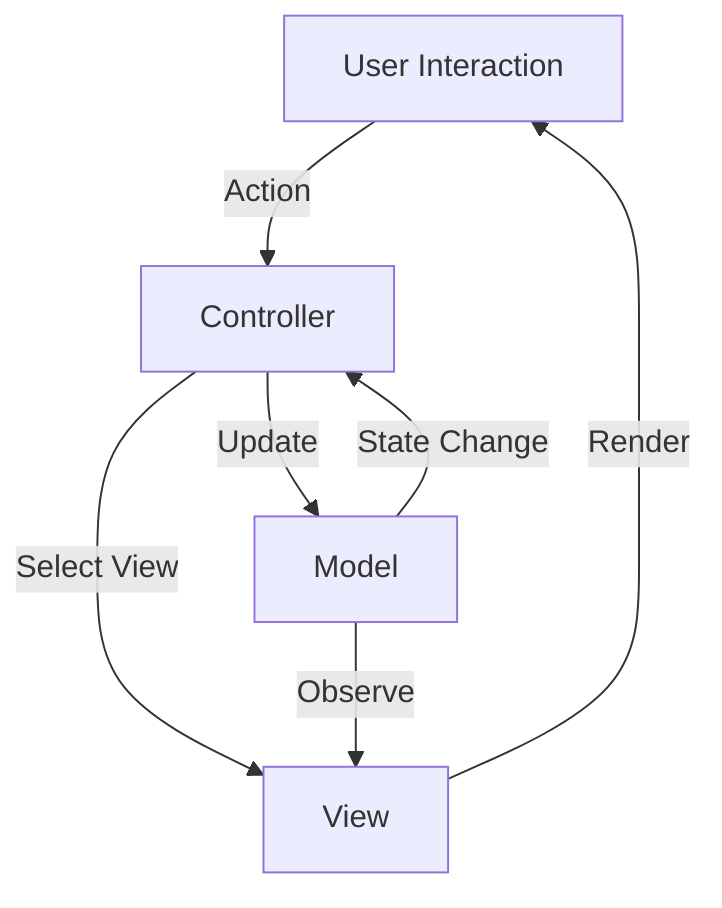

- **Model:** Holds application data and business logic. It is completely independent of the user interface.
- **View:** Renders the model data and sends user actions to the controller.
- **Controller:** Mediates between Model and View. It interprets user input and updates the model accordingly.

MVC is the pattern underlying most web frameworks — Rails, Django, Laravel, and ASP.NET MVC all follow this structure.

### 6.2 MVVM Data Flow

In MVVM (Model-View-ViewModel), the ViewModel exposes data streams and commands that the View binds to declaratively. There is no direct line from View to Model — the ViewModel acts as a full intermediary and exposes observable state.

```typescript
// Simplified MVVM ViewModel using reactive state
class UserProfileViewModel {
  private _name = "";
  private _email = "";
  private listeners: Array<() => void> = [];

  get name(): string {
    return this._name;
  }
  get email(): string {
    return this._email;
  }

  subscribe(listener: () => void): () => void {
    this.listeners.push(listener);
    return () => {
      this.listeners = this.listeners.filter((l) => l !== listener);
    };
  }

  private notify(): void {
    this.listeners.forEach((l) => l());
  }

  async loadUser(id: string): Promise<void> {
    // Simulate fetch
    const user = await fetch(`/api/users/${id}`).then((r) => r.json());
    this._name = user.name;
    this._email = user.email;
    this.notify();
  }
}
```

---

## 7. Microservices Design Patterns

Beyond the Gang of Four, modern distributed systems have their own pattern vocabulary. These patterns address concerns unique to microservices: fault tolerance, service discovery, data consistency, and inter-service communication.

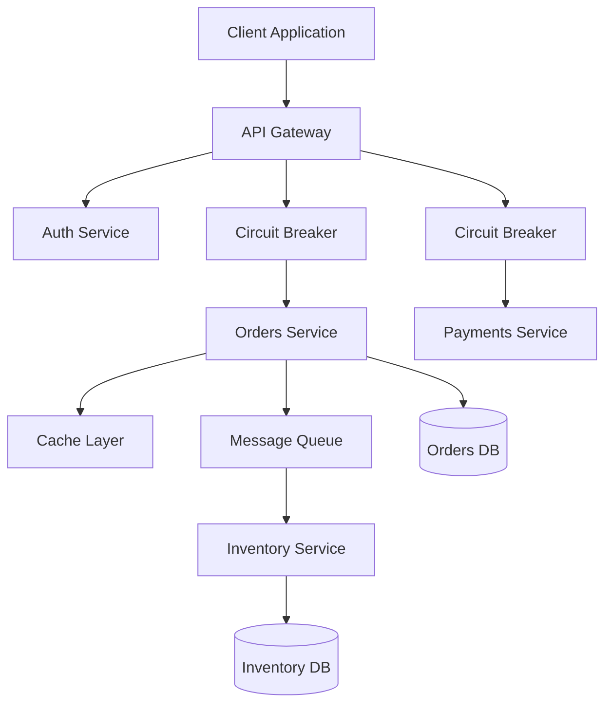

### 7.1 API Gateway

The API Gateway is a single entry point for all client requests. It handles cross-cutting concerns such as authentication, rate limiting, SSL termination, and request routing. Without an API Gateway, every client would need to know the address of each service, and every service would need to implement its own auth, CORS, and rate-limiting logic.

**Responsibilities:**

- Route requests to the appropriate downstream service.
- Aggregate responses from multiple services into a single response.
- Handle authentication and authorization centrally.
- Apply rate limiting, circuit breaking, and caching.
- Transform request/response formats (e.g., REST to gRPC).

### 7.2 Circuit Breaker

The Circuit Breaker prevents a network or service failure from cascading. It wraps calls to an external service and monitors for failures. When failures exceed a threshold, the circuit "opens" and subsequent calls fail fast without attempting the call. After a cooldown, the circuit enters a "half-open" state to test if the downstream service has recovered.

```typescript
enum CircuitState {
  Closed = "CLOSED",
  Open = "OPEN",
  HalfOpen = "HALF_OPEN",
}

class CircuitBreaker<T> {
  private state = CircuitState.Closed;
  private failureCount = 0;
  private lastFailureTime = 0;

  constructor(
    private readonly threshold: number = 5,
    private readonly resetTimeoutMs: number = 30_000,
  ) {}

  async call(fn: () => Promise<T>): Promise<T> {
    if (this.state === CircuitState.Open) {
      const elapsed = Date.now() - this.lastFailureTime;
      if (elapsed < this.resetTimeoutMs) {
        throw new Error("Circuit is OPEN — call rejected");
      }
      this.state = CircuitState.HalfOpen;
    }

    try {
      const result = await fn();
      this.onSuccess();
      return result;
    } catch (error) {
      this.onFailure();
      throw error;
    }
  }

  private onSuccess(): void {
    this.failureCount = 0;
    this.state = CircuitState.Closed;
  }

  private onFailure(): void {
    this.failureCount++;
    this.lastFailureTime = Date.now();
    if (this.failureCount >= this.threshold) {
      this.state = CircuitState.Open;
      console.warn("Circuit OPENED after repeated failures");
    }
  }

  getState(): CircuitState {
    return this.state;
  }
}

// Usage
const breaker = new CircuitBreaker(3, 10_000);

async function fetchInventory(itemId: string): Promise<number> {
  return breaker.call(async () => {
    const response = await fetch(`/api/inventory/${itemId}`);
    if (!response.ok) throw new Error("Inventory service unavailable");
    const data = await response.json();
    return data.quantity;
  });
}
```

### 7.3 Saga Pattern

The Saga pattern manages distributed transactions across multiple services without two-phase commit. A saga is a sequence of local transactions, each publishing an event that triggers the next step. If a step fails, compensating transactions are run in reverse to undo the completed steps.

```typescript
interface SagaStep<T> {
  execute(context: T): Promise<void>;
  compensate(context: T): Promise<void>;
}

class SagaOrchestrator<T> {
  private steps: SagaStep<T>[] = [];
  private completed: number[] = [];

  addStep(step: SagaStep<T>): SagaOrchestrator<T> {
    this.steps.push(step);
    return this;
  }

  async execute(context: T): Promise<void> {
    for (let i = 0; i < this.steps.length; i++) {
      try {
        await this.steps[i].execute(context);
        this.completed.push(i);
      } catch (error) {
        console.error(`Saga step ${i} failed. Running compensations...`);
        await this.compensate(context);
        throw error;
      }
    }
  }

  private async compensate(context: T): Promise<void> {
    for (const stepIndex of [...this.completed].reverse()) {
      try {
        await this.steps[stepIndex].compensate(context);
      } catch (err) {
        console.error(`Compensation for step ${stepIndex} also failed:`, err);
      }
    }
  }
}
```

---

## 8. Event-Driven Architecture Patterns

Event-driven systems communicate through events rather than direct calls. Producers emit events without knowing who consumes them. Consumers react to events without knowing who produced them.

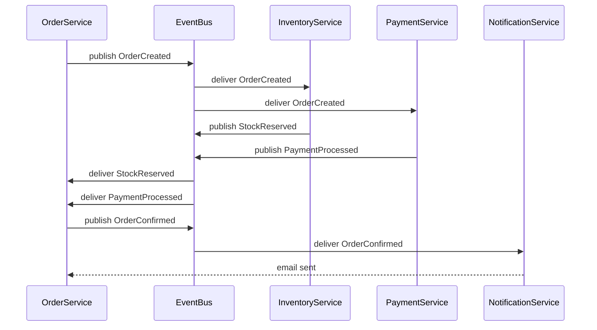

### 8.1 Event Sourcing

In Event Sourcing, the state of an application is determined not by a current snapshot but by a sequence of events. Rather than saving the current state of an entity, you save every event that changed it. The current state is derived by replaying events from the beginning (or from a snapshot checkpoint).

**Benefits:**

- Complete audit trail — you know exactly what happened and when.
- Easy to rebuild projections by replaying events with different logic.
- Natural fit for event-driven and CQRS architectures.

**Trade-offs:**

- Querying current state requires replaying or maintaining projections.
- Event schemas must evolve carefully — old events are immutable.
- Storage grows with history rather than being replaced.

### 8.2 CQRS (Command Query Responsibility Segregation)

CQRS separates the write model (commands that change state) from the read model (queries that return data). This separation allows independent scaling, different data models optimized for reads vs. writes, and cleaner code that is not compromised by serving both concerns simultaneously.

```typescript
// Write side — command model
interface CreateOrderCommand {
  customerId: string;
  items: Array<{ productId: string; quantity: number }>;
}

class OrderCommandHandler {
  async handle(command: CreateOrderCommand): Promise<string> {
    // Validate, apply business rules, persist event
    const orderId = `ord_${Date.now()}`;
    const event = {
      type: "OrderCreated",
      orderId,
      customerId: command.customerId,
      items: command.items,
      createdAt: new Date().toISOString(),
    };
    await this.eventStore.append("orders", event);
    return orderId;
  }

  private eventStore = {
    append: async (stream: string, event: unknown) => {
      console.log(`Appended to ${stream}:`, event);
    },
  };
}

// Read side — query model (denormalized projection)
interface OrderSummary {
  orderId: string;
  customerName: string;
  itemCount: number;
  status: string;
  createdAt: string;
}

class OrderQueryHandler {
  async getOrdersByCustomer(customerId: string): Promise<OrderSummary[]> {
    // Query the read-optimized projection store
    return [];
  }
}
```

---

## 9. Choosing the Right Pattern

Selecting the appropriate pattern requires understanding both the problem and the trade-offs each pattern introduces. The decision tree below provides a structured starting point.

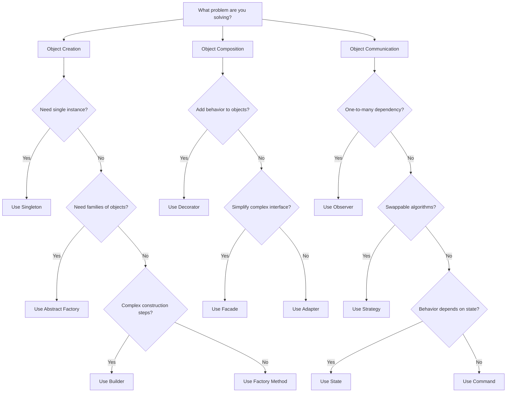

### 9.1. Pattern Applicability Quick Reference

| Problem                           | Pattern          | Key Benefit                      |
| --------------------------------- | ---------------- | -------------------------------- |
| Need one shared instance          | Singleton        | Controlled global access         |
| Vary object creation              | Factory Method   | Decoupled instantiation          |
| Create object families            | Abstract Factory | Consistent product sets          |
| Complex step-by-step construction | Builder          | Readable construction API        |
| Add behaviors without subclassing | Decorator        | Runtime composition              |
| Simplify complex subsystem        | Facade           | Reduced coupling for clients     |
| Incompatible interfaces           | Adapter          | Interface translation            |
| Notify multiple objects           | Observer         | Loose producer-consumer coupling |
| Swap algorithms at runtime        | Strategy         | Isolated algorithm variations    |
| State-dependent behavior          | State            | Eliminates branching on status   |
| Encapsulate requests              | Command          | Undo/redo, queuing               |
| Avoid N-to-N coupling             | Mediator         | Centralized coordination         |

---

## 10. Anti-Patterns and Common Mistakes

Understanding design patterns is incomplete without understanding what happens when they are misapplied.

### 10.1 Singleton Overuse

The Singleton is the most abused pattern in object-oriented code. It introduces global mutable state, makes dependencies implicit (callers access state through a global rather than a declared parameter), and makes unit testing extremely difficult because the singleton's state bleeds across tests.

**Prefer dependency injection:** Instead of `ConfigRegistry.getInstance()` scattered throughout the codebase, declare the registry as a constructor parameter. This makes the dependency visible, allows test injection of a mock, and removes the global state problem.

### 10.2 Factory Complexity Creep

Factory hierarchies have a tendency to grow without bounds. When you find yourself with `ConcreteFactoryForRegionAWithFeatureFlagBEnabled`, it is a signal that the factory is solving a configuration problem with code. Consider replacing complex factory trees with a registration/lookup approach — a map from type string to constructor function.

### 10.3 Observer Memory Leaks

In long-lived applications, observers frequently cause memory leaks because subscribers are added but never removed. Always return an unsubscribe function from your subscribe method, and always call it in cleanup hooks (React `useEffect` cleanup, Angular `ngOnDestroy`, etc.).

### 10.4 Strategy Pattern with Only One Strategy

If a system has a strategy interface but only ever instantiates one concrete strategy, the pattern adds overhead without benefit. Patterns should be introduced when the variation they encapsulate actually exists or is concretely anticipated — not speculatively.

### 10.5 Pattern Fetishism

Perhaps the deepest anti-pattern is applying patterns for their own sake. Patterns add indirection, and indirection has a cost in readability and maintainability. A simple `if/else` is better than a State Machine when there are only two states. A direct function call is clearer than a Command when there is no need for queuing or undo. Apply patterns when they solve a real problem, not to demonstrate familiarity with the catalogue.

---

## 11. Patterns in Modern Frontend Development

Design patterns did not stay confined to backend systems. Frontend frameworks have adopted and adapted many of the same ideas.

### 11.1 Container and Presentational Components (React)

This is essentially a variation of the Strategy pattern applied to React. Presentational components receive props and render UI. Container components hold state, fetch data, and pass results down. The separation makes presentational components reusable and easily tested in isolation.

### 11.2 Higher-Order Components

Higher-Order Components (HOCs) in React are a direct application of the Decorator pattern. A HOC takes a component and returns a new component with additional props or behavior injected — adding authentication checks, analytics tracking, or data fetching without modifying the wrapped component.

### 11.3 Custom Hooks as Strategy Objects

React custom hooks can be thought of as Strategy objects. Instead of selecting a strategy via an interface and class hierarchy, you select behavior by which hook you compose into a component. `useLocalStorage`, `useRemoteState`, and `useOptimisticState` are three strategies for managing the same form input value.

### 11.4 Flux/Redux as Command + Observer

Redux's architecture is a direct combination of the Command pattern (actions are command objects) and the Observer pattern (subscribers are notified on every state change). The reducer is a pure function that applies a command to the current state and returns the new state — a variation on the Event Sourcing idea.

---

## 12. Patterns in Distributed Systems

At the distributed systems level, several patterns from the microservices world map directly back to GoF ideas.

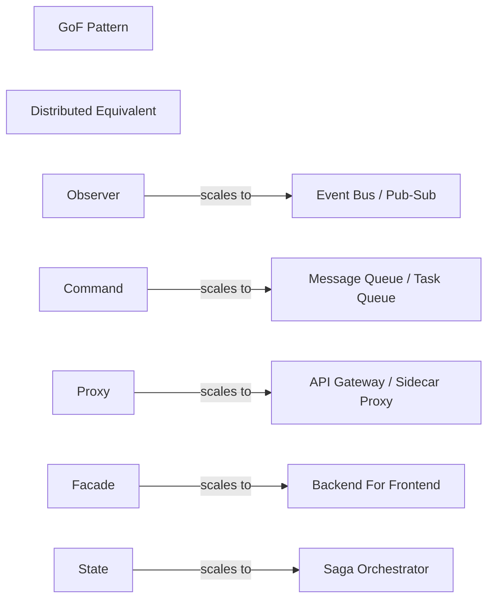

The Observer pattern becomes a message broker when the number of producers and consumers grows beyond a single process. The Command pattern becomes a durable message queue when commands must survive process restarts. The Proxy pattern becomes a service mesh sidecar when applied at the network layer across dozens of services.

---

## 13. Testing Design-Pattern-Heavy Code

Good pattern usage actually improves testability, but only when the patterns are applied correctly.

### 13.1. Testing Factories

Test that the factory produces the correct type for each input, and that it throws a descriptive error for unknown inputs. Do not test the concrete products through the factory — test each product independently.

### 13.2. Testing Observers

Test the Subject by subscribing a mock observer, triggering a state change, and asserting the mock was called with the correct argument. Test that unsubscribing stops notifications.

### 13.3. Testing Strategy

Pass a mock strategy to the context and assert the context delegates to it. Test each concrete strategy independently. This proves that the context correctly delegates without being coupled to any specific algorithm.

### 13.4. Testing State Machines

Write one test per state transition. Assert that valid transitions succeed and invalid transitions throw or produce a no-op, depending on your design choice. This makes every path through the state machine auditable and documented.

### 13.5. Testing with Dependency Injection Instead of Singleton

Replace `getInstance()` calls with constructor injection. In tests, inject a fresh instance with no prior state. In production, use a DI container to ensure only one instance is created.

---

## 14. Key Takeaways

- Design patterns are a shared vocabulary for communicating solutions to recurring design problems. Their value is as much in communication as in the code itself.

- The three categories — creational, structural, and behavioral — map to three distinct design concerns: object creation, object composition, and object communication.

- Creational patterns (Singleton, Factory, Builder, Prototype, Abstract Factory) isolate and abstract the instantiation process.

- Structural patterns (Decorator, Adapter, Facade, Proxy, Composite, Bridge, Flyweight) organize relationships between objects and classes.

- Behavioral patterns (Observer, Strategy, State, Command, Iterator, Mediator, and others) define how objects communicate and distribute responsibility.

- Modern distributed systems have their own pattern catalogue (API Gateway, Circuit Breaker, Saga, CQRS, Event Sourcing) that builds on and extends the GoF foundation.

- Patterns should be applied when they solve a real, present problem. Applying them speculatively or as a credential-display exercise produces overengineered, harder-to-read code.

- Good pattern usage improves testability by making dependencies explicit and algorithms swappable. Poor pattern usage — especially Singleton overuse and deep inheritance hierarchies — makes testing harder.

- Learn patterns through implementation, not memorization. Implement each pattern from scratch in a language you know well. That exercise builds the intuition for when a pattern fits and when it does not.
