import MdxLayout from "@/components/MdxLayout";

export const metadata = {
  title: "Docker and Kubernetes: A Guide to Containerization and Orchestration",
  description:
    "A comprehensive, detailed guide on Docker and Kubernetes. Learn everything from building Docker images and managing containers to orchestrating applications on Kubernetes.",
  topics: ["Docker", "Containerization", "DevOps"],
};

export default function DockerKubernetesContent({ children }) {
  return <MdxLayout>{children}</MdxLayout>;
}

# Mastering Docker and Kubernetes: An Ultimate Guide to Containerization and Orchestration

### Author: Son Nguyen

> Date: 2025-01-27

In today’s cloud-native world, containerization and orchestration are the cornerstones of modern application development and deployment. Docker provides the means to package and run applications in isolated, reproducible containers, while Kubernetes automates the deployment, scaling, and management of these containers across clusters of machines. This guide is an exhaustive resource that covers everything from the basics to advanced techniques for both Docker and Kubernetes. We include detailed code examples, configuration files, and step-by-step tutorials to help you get started and master these technologies.

---

## 1. Introduction

Containerization and orchestration are at the heart of modern DevOps practices. Docker standardizes how applications are built, shipped, and run, while Kubernetes provides a robust platform for automating the deployment and management of containerized applications. This guide is designed to be a comprehensive reference, complete with in-depth tutorials, practical examples, and advanced techniques.

The following diagram shows the high-level relationship between Docker and Kubernetes in a typical deployment pipeline:

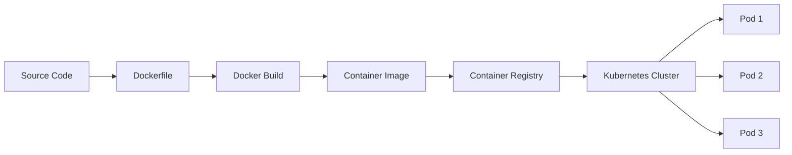

---

## 2. Docker: Containerization Made Detailed

### 2.1. What is Docker?

Docker is an open-source platform designed to simplify the process of building, running, and distributing applications within containers. Containers encapsulate an application with all its dependencies, ensuring that it runs uniformly across different computing environments.

**Key Benefits:**

- **Portability:** Run the same container on development machines, on-premise servers, or in the cloud.
- **Isolation:** Each container runs in its own environment, avoiding conflicts with other applications.
- **Efficiency:** Containers share the host OS kernel, leading to lower overhead compared to traditional VMs.

### 2.2. Building a Docker Image: Step-by-Step

Let’s build a simple Node.js application and containerize it using Docker.

#### 2.1.1 Sample Node.js Application

Create a file named `app.js`:

```javascript
// app.js
const express = require("express");
const app = express();
const port = 3000;

app.get("/", (req, res) => {
  res.send("Hello from Dockerized Node.js app!");
});

app.listen(port, () => {
  console.log(`App listening on port ${port}`);
});
```

Create a `package.json`:

```json
{
  "name": "docker-node-app",
  "version": "1.0.0",
  "main": "app.js",
  "scripts": {
    "start": "node app.js"
  },
  "dependencies": {
    "express": "^4.17.1"
  }
}
```

#### 2.1.2 Writing the Dockerfile

Create a file named `Dockerfile` in the project root:

```dockerfile
# Use a lightweight Node.js base image
FROM node:14-alpine

# Set the working directory in the container
WORKDIR /app

# Copy dependency definitions
COPY package*.json ./

# Install dependencies
RUN npm install

# Copy application source code
COPY . .

# Expose the port the app runs on
EXPOSE 3000

# Define the command to run the app
CMD ["npm", "start"]
```

#### 2.1.3 Building and Running the Docker Image

Open a terminal and run:

```bash
# Build the image with a tag
docker build -t docker-node-app .

# Run the container, mapping port 3000 to the host
docker run -p 3000:3000 docker-node-app
```

Access your app at [http://localhost:3000](http://localhost:3000).

### 2.3. Managing Containers: Essential Docker Commands

- **List running containers:**

```bash
docker ps
```

- **View container logs:**

```bash
docker logs <container-id>
```

- **Stop a container:**

```bash
docker stop <container-id>
```

- **Remove a container:**

```bash
docker rm <container-id>
```

- **Remove an image:**

```bash
docker rmi docker-node-app
```

### 2.4. Advanced Docker Topics

#### Multi-Stage Builds

Multi-stage builds allow you to create lean production images by using multiple build stages in your Dockerfile.

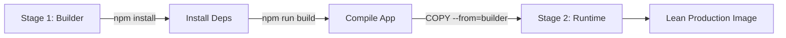

```dockerfile
# Stage 1: Build the application
FROM node:14-alpine as builder
WORKDIR /app
COPY package*.json ./
RUN npm install
COPY . .
RUN npm run build  # Assume you have a build script

# Stage 2: Create the production image
FROM node:14-alpine
WORKDIR /app
COPY --from=builder /app .
EXPOSE 3000
CMD ["npm", "start"]
```

#### Docker Compose for Multi-Container Applications

Docker Compose helps manage multi-container applications with a single YAML file.

Create a `docker-compose.yml`:

```yaml
version: "3.8"
services:
  web:
    build: .
    ports:
      - "3000:3000"
  redis:
    image: "redis:alpine"
```

Start the services with:

```bash
docker-compose up
```

Docker supports several networking modes that control how containers communicate with each other and the host:

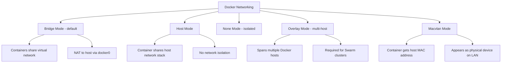

#### Volume Management and Networking

- **Volumes:** Persist data and share it between containers.

```bash
docker run -v mydata:/data my-image
```

- **Networking:** Connect containers together using Docker networks.

```bash
docker network create my-network
docker run --network my-network --name container1 my-image
docker run --network my-network --name container2 my-image
```

---

## 3. Kubernetes: Orchestration in Depth

### 3.1. Understanding Kubernetes Architecture

Kubernetes is a powerful platform for container orchestration. Its core components include:

- **Master Node:** Manages the cluster and schedules workloads.
- **Worker Nodes:** Run containerized applications inside pods.
- **Pods:** The smallest deployable unit containing one or more containers.
- **Deployments:** Manage a set of identical pods, ensuring desired state and handling updates.
- **Services:** Provide stable network endpoints to access pods.

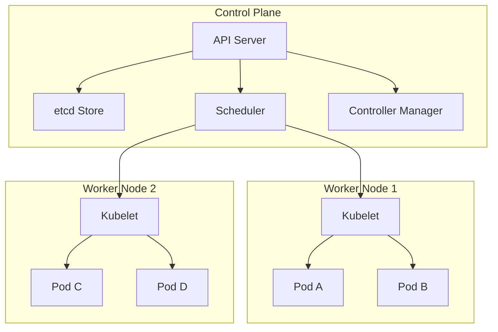

### 3.2. Setting Up a Local Kubernetes Cluster

For local experimentation, you can use **Minikube** or **kind**.

#### 3.2.1 Using Minikube

1. **Install Minikube:**
   Follow [Minikube installation instructions](https://minikube.sigs.k8s.io/docs/start/).

2. **Start the Cluster:**

```bash
minikube start
```

3. **Verify with kubectl:**

```bash
kubectl get nodes
```

#### 3.2.2 Installing kubectl

Download and install `kubectl` as per the [official guide](https://kubernetes.io/docs/tasks/tools/).

### 3.3. Deploying Applications on Kubernetes

We’ll deploy the Dockerized Node.js app from earlier.

#### 3.3.1 Creating a Deployment YAML

Create `deployment.yaml`:

```yaml
apiVersion: apps/v1
kind: Deployment
metadata:
  name: docker-node-app-deployment
spec:
  replicas: 3
  selector:
    matchLabels:
      app: docker-node-app
  template:
    metadata:
      labels:
        app: docker-node-app
    spec:
      containers:
        - name: docker-node-app-container
          image: docker-node-app:latest # Ensure the image is available locally or in a registry
          ports:
            - containerPort: 3000
```

#### 3.3.2 Creating a Service YAML

Create `service.yaml`:

```yaml
apiVersion: v1
kind: Service
metadata:
  name: docker-node-app-service
spec:
  type: NodePort # For local testing; use LoadBalancer in production
  selector:
    app: docker-node-app
  ports:
    - port: 80
      targetPort: 3000
      nodePort: 30080
```

#### 3.3.3 Applying the Kubernetes Configurations

Deploy the app with:

```bash
kubectl apply -f deployment.yaml
kubectl apply -f service.yaml
```

Check the status of pods:

```bash
kubectl get pods
```

Access the service (for Minikube):

```bash
minikube service docker-node-app-service
```

### 3.4. Advanced Kubernetes Topics

#### Scaling, Rolling Updates, and Self-healing

- **Scaling:** Easily scale the number of pod replicas.

```bash
kubectl scale deployment docker-node-app-deployment --replicas=5
```

- **Rolling Updates:** Update your application without downtime by modifying the deployment YAML and applying it.

```bash
kubectl apply -f deployment.yaml
```

- **Self-healing:** Kubernetes automatically restarts failed pods.

#### Helm: Package Management for Kubernetes

A Helm chart organizes all Kubernetes manifests and configuration into a well-defined directory structure:

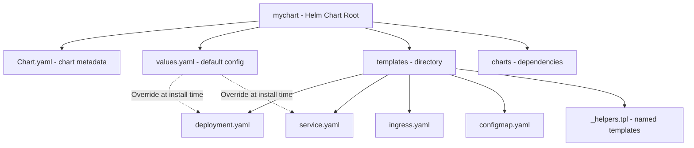

Helm is a package manager that simplifies deploying applications.

1. **Install Helm:**
   Follow [Helm installation instructions](https://helm.sh/docs/intro/install/).

2. **Create a Helm Chart:**

```bash
helm create mychart
```

3. **Customize Chart Templates:**
   Edit the generated YAML files in the `templates/` directory to suit your application.

4. **Deploy Using Helm:**

```bash
helm install my-release mychart
```

A Kubernetes rolling update replaces pods incrementally to maintain availability throughout the deployment:

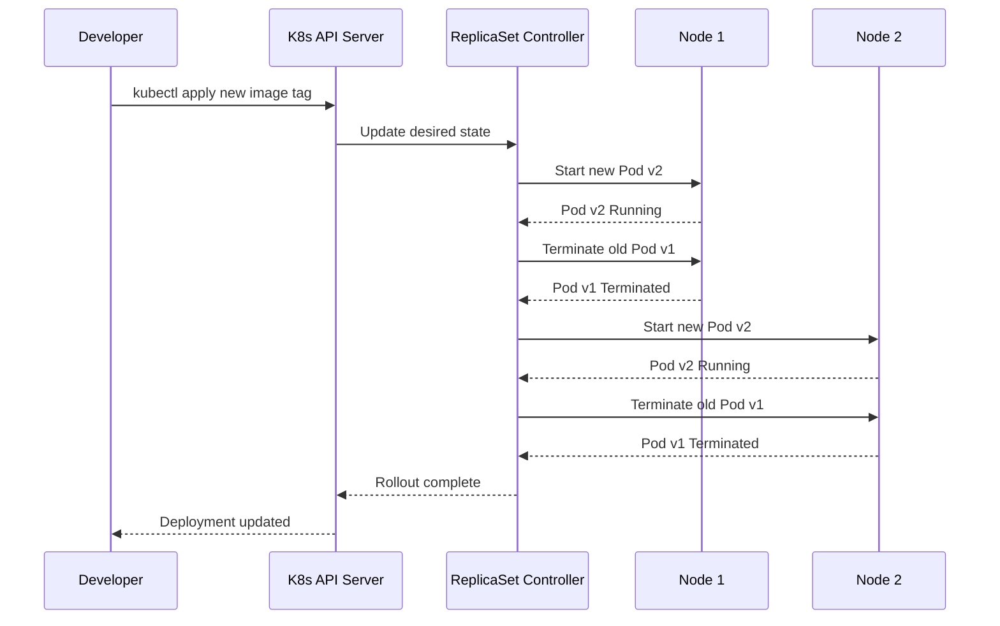

The Kubernetes pod lifecycle diagram shows all the states a pod moves through from scheduling to termination:

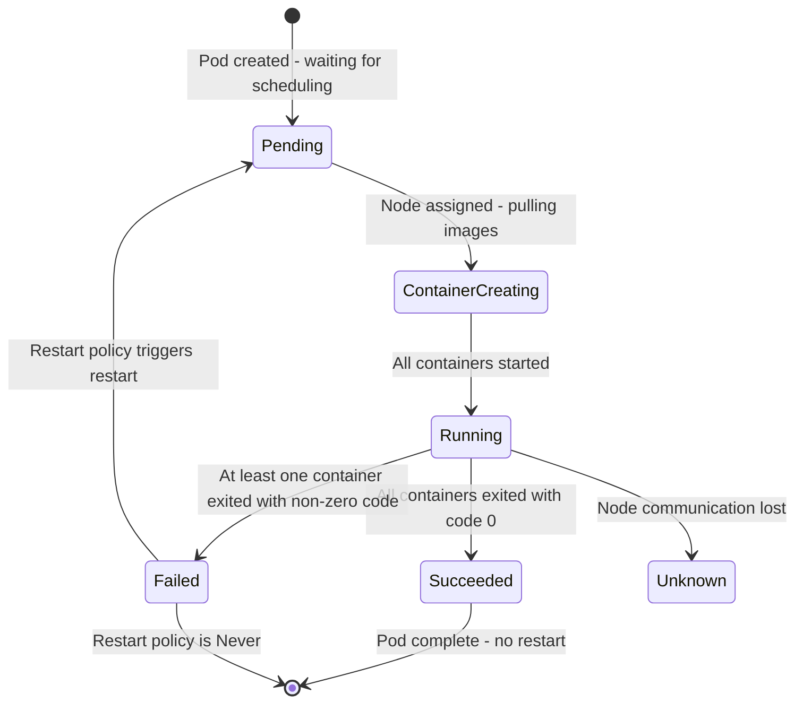

#### Ingress Controllers

Ingress controllers manage external access to your services.

1. **Install an Ingress Controller (e.g., NGINX):**

```bash
kubectl apply -f https://raw.githubusercontent.com/kubernetes/ingress-nginx/controller-v1.2.0/deploy/static/provider/cloud/deploy.yaml
```

2. **Create an Ingress Resource:**

```yaml
apiVersion: networking.k8s.io/v1
kind: Ingress
metadata:
  name: docker-node-app-ingress
spec:
  rules:
    - host: myapp.local
      http:
        paths:
          - path: /
            pathType: Prefix
            backend:
              service:
                name: docker-node-app-service
                port:
                  number: 80
```

3. **Test Ingress:**
   Update your local hosts file to map `myapp.local` to the Minikube IP.

---

## 4. Best Practices and Tips

### 4.1. Docker Best Practices

- **Use Minimal Base Images:**
  Use Alpine or distroless images to reduce vulnerabilities and image size.
- **Multi-Stage Builds:**
  Separate build and runtime environments.
- **Leverage Docker Compose:**
  Simplify multi-container management.
- **Security:**
  Run containers as non-root users and scan images for vulnerabilities.

The Horizontal Pod Autoscaler control loop measures resource metrics and adjusts replica count to meet the target utilization:

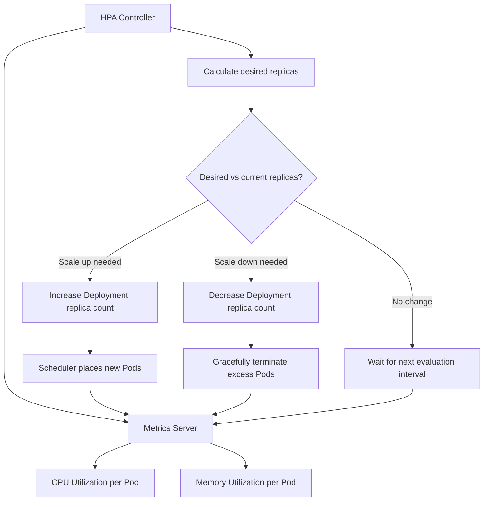

### 4.2. Kubernetes Best Practices

- **Resource Requests and Limits:**
  Define CPU and memory constraints to optimize cluster utilization.
- **Health Probes:**
  Configure liveness and readiness probes to ensure application health.
- **Namespace Management:**
  Use namespaces to organize resources and apply RBAC.
- **Configuration as Code:**
  Version control all Kubernetes YAML files for traceability.
- **Monitoring and Logging:**
  Use Prometheus, Grafana, and ELK/EFK stacks for real-time insights.

---

## 5. Additional Resources and Learning

### 5.1. Docker

- **Official Docker Documentation:** [docs.docker.com](https://docs.docker.com/)
- **Docker Hub:** Explore container images at [hub.docker.com](https://hub.docker.com/)
- **Tutorials and Courses:** Udemy, Coursera, and freeCodeCamp offer excellent Docker training.

### 5.2. Kubernetes

- **Kubernetes Official Documentation:** [kubernetes.io/docs](https://kubernetes.io/docs/)
- **Interactive Labs:** Katacoda and Play with Kubernetes provide hands-on tutorials.
- **Certifications:** Consider the Certified Kubernetes Administrator (CKA) or Developer (CKAD) for advanced learning.
- **Community and Forums:** Engage on Slack channels, Stack Overflow, and local meetups.

Kubernetes supports several Service types that expose workloads differently depending on whether access is internal, external, or cloud-native:

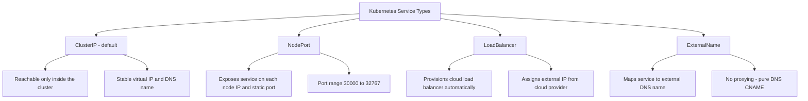

Container resource requests and limits govern how the scheduler places pods and how the kubelet enforces CPU and memory boundaries:

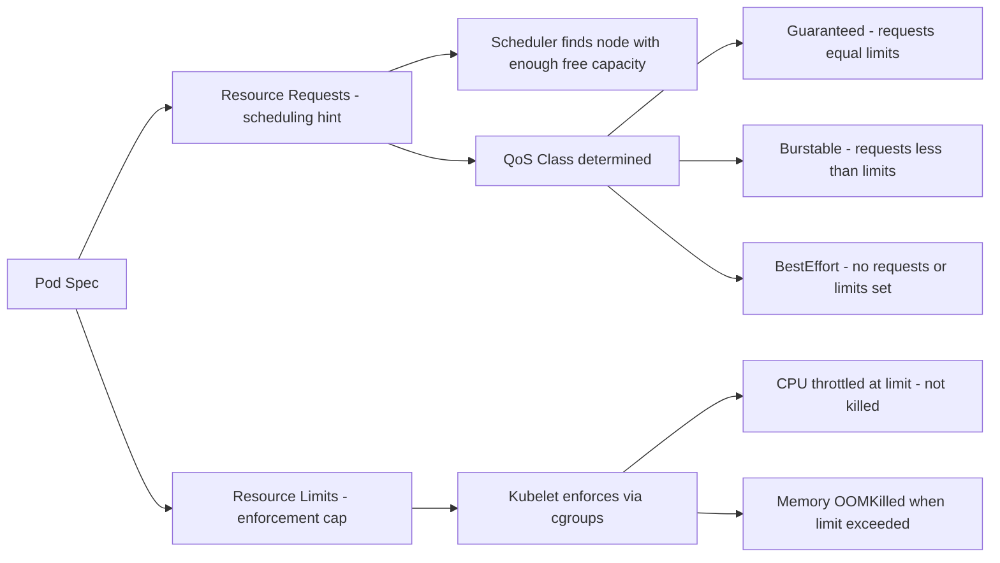

---

## 6. Kubernetes Operators and Custom Resources

Operators extend Kubernetes to manage stateful applications using domain-specific knowledge encoded in Go controllers. They watch custom resources and reconcile the actual cluster state toward the desired state.

### 6.1 Custom Resource Definition

```yaml
# crd-database.yaml - defines a new "Database" resource kind
apiVersion: apiextensions.k8s.io/v1
kind: CustomResourceDefinition
metadata:
  name: databases.example.com
spec:
  group: example.com
  versions:
    - name: v1alpha1
      served: true
      storage: true
      schema:
        openAPIV3Schema:
          type: object
          properties:
            spec:
              type: object
              required: ["engine", "version", "storage"]
              properties:
                engine:
                  type: string
                  enum: ["postgres", "mysql", "mongodb"]
                version:
                  type: string
                storage:
                  type: string
                  pattern: "^[0-9]+(Gi|Mi)$"
                replicas:
                  type: integer
                  minimum: 1
                  maximum: 5
            status:
              type: object
              properties:
                phase:
                  type: string
                endpoint:
                  type: string
  scope: Namespaced
  names:
    plural: databases
    singular: database
    kind: Database
```

### 6.2 Reconcile Loop Pattern

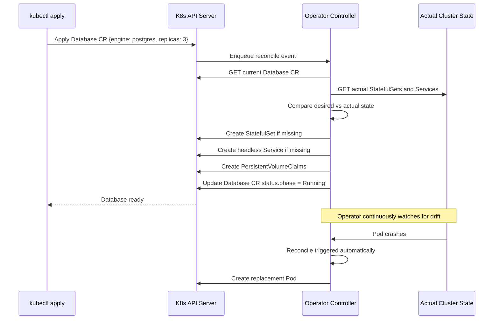

### 6.3 Custom Resource Usage

```yaml
# my-database.yaml - create a postgres cluster using the Operator
apiVersion: example.com/v1alpha1
kind: Database
metadata:
  name: orders-db
  namespace: production
spec:
  engine: postgres
  version: "15.3"
  storage: "20Gi"
  replicas: 3
```

```bash
kubectl apply -f my-database.yaml
kubectl get databases -n production
kubectl describe database orders-db -n production
```

---

## 7. Service Mesh with Istio

A service mesh adds observability, traffic management, and mutual TLS to service-to-service communication without any application code changes. Istio injects an Envoy sidecar proxy into each pod.

The following diagram shows how the Envoy sidecar proxies in the data plane communicate through mutual TLS, while istiod in the control plane pushes xDS configuration, manages certificates, and validates mesh config:

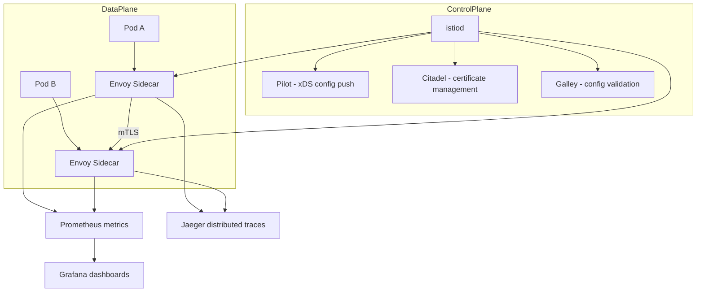

### 7.1. Traffic Management with VirtualService

```yaml
# Canary deployment: route 5% of traffic to v2 while testing
apiVersion: networking.istio.io/v1alpha3
kind: VirtualService
metadata:
  name: orders-service
spec:
  hosts:
    - orders-service
  http:
    - match:
        - headers:
            x-canary-user:
              exact: "true"
      route:
        - destination:
            host: orders-service
            subset: v2
          weight: 100
    - route:
        - destination:
            host: orders-service
            subset: v1
          weight: 95
        - destination:
            host: orders-service
            subset: v2
          weight: 5
---
apiVersion: networking.istio.io/v1alpha3
kind: DestinationRule
metadata:
  name: orders-service
spec:
  host: orders-service
  trafficPolicy:
    connectionPool:
      tcp:
        maxConnections: 100
      http:
        http2MaxRequests: 1000
        pendingHttpRequests: 100
    outlierDetection:
      consecutiveErrors: 5
      interval: 10s
      baseEjectionTime: 30s
  subsets:
    - name: v1
      labels:
        version: v1
    - name: v2
      labels:
        version: v2
```

---

## 8. GitOps with ArgoCD

GitOps uses a Git repository as the single source of truth for cluster state. ArgoCD watches the repository and continuously reconciles the cluster to match the declared manifests.

### 8.1. ArgoCD Application Definition

```yaml
# argocd-app.yaml
apiVersion: argoproj.io/v1alpha1
kind: Application
metadata:
  name: orders-service
  namespace: argocd
spec:
  project: default
  source:
    repoURL: https://github.com/example/k8s-manifests.git
    targetRevision: HEAD
    path: apps/orders-service/overlays/production
  destination:
    server: https://kubernetes.default.svc
    namespace: production
  syncPolicy:
    automated:
      prune: true # Remove resources that are no longer in Git
      selfHeal: true # Revert manual kubectl changes automatically
    syncOptions:
      - CreateNamespace=true
      - PrunePropagationPolicy=foreground
    retry:
      limit: 3
      backoff:
        duration: 5s
        factor: 2
        maxDuration: 3m
```

### 8.2. GitOps Workflow

The following sequence diagram shows the full GitOps cycle from a developer code push through CI image build to ArgoCD reconciling the cluster:

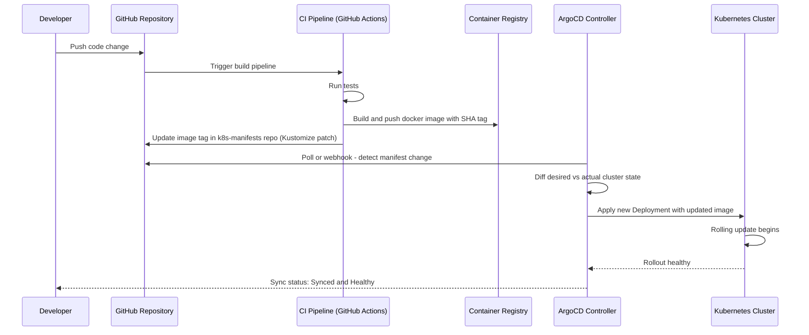

### 8.3. GitOps Benefits and Tradeoffs

The following diagram summarizes the key benefits and tradeoffs to weigh when adopting a GitOps workflow with ArgoCD:

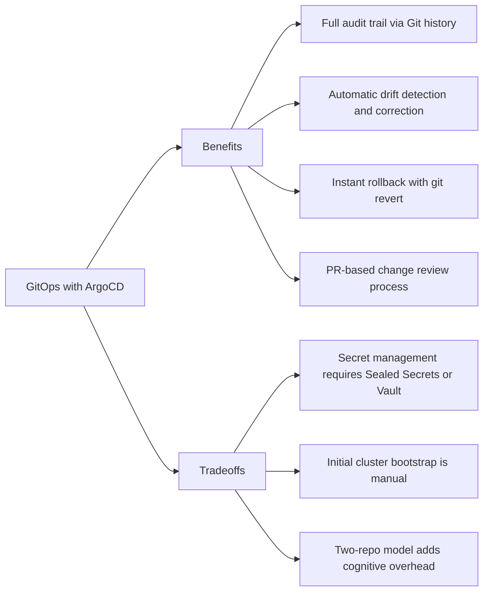

---

## 9. Cost Optimization and Pod Disruption Budgets

### 9.1. Pod Disruption Budgets

Pod Disruption Budgets (PDBs) prevent too many pods from being unavailable simultaneously during voluntary disruptions such as node drains, cluster upgrades, or autoscaler scale-downs.

```yaml
# Guarantee at least 2 pods are always available during disruptions
apiVersion: policy/v1
kind: PodDisruptionBudget
metadata:
  name: orders-service-pdb
  namespace: production
spec:
  minAvailable: 2 # Use integer or percentage, e.g., "80%"
  selector:
    matchLabels:
      app: orders-service
```

```yaml
# Alternatively, cap maximum unavailable pods at 1
apiVersion: policy/v1
kind: PodDisruptionBudget
metadata:
  name: orders-service-pdb-strict
spec:
  maxUnavailable: 1
  selector:
    matchLabels:
      app: orders-service
```

### 9.2. Kubernetes Cost Optimization Strategies

The following diagram outlines the major cost optimization levers in Kubernetes, spanning right-sizing, spot nodes, scheduling policies, and storage tiering:

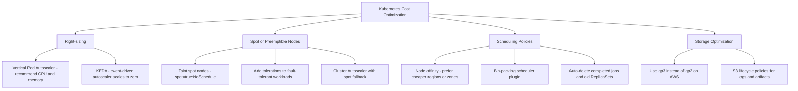

### 9.3. Vertical Pod Autoscaler Configuration

```yaml
apiVersion: autoscaling.k8s.io/v1
kind: VerticalPodAutoscaler
metadata:
  name: orders-service-vpa
  namespace: production
spec:
  targetRef:
    apiVersion: apps/v1
    kind: Deployment
    name: orders-service
  updatePolicy:
    updateMode: "Auto" # Or "Off" to only generate recommendations without applying
  resourcePolicy:
    containerPolicies:
      - containerName: orders-service
        minAllowed:
          cpu: 50m
          memory: 64Mi
        maxAllowed:
          cpu: "2"
          memory: 2Gi
        controlledResources: ["cpu", "memory"]
```

---

## 10. Conclusion

Docker and Kubernetes are transformative technologies in the modern development landscape. Docker enables you to build portable, reproducible application containers, while Kubernetes orchestrates these containers to run at scale with high availability and resilience. This guide has provided an in-depth exploration of both platforms, from basic containerization and image management with Docker to sophisticated orchestration techniques using Kubernetes, Helm, and Ingress.

By following the detailed tutorials and best practices outlined here, you can build a solid foundation in containerization and orchestration. Continue to experiment with different configurations, stay current with the latest developments, and leverage community resources to refine your skills further.

---

_This ultimate guide is intended to serve as a comprehensive resource for mastering Docker and Kubernetes. Whether you are just starting out or looking to deepen your expertise, we hope this article provides the detailed insights and practical examples needed to excel in the world of containerization and orchestration. Happy coding and best of luck on your cloud-native journey!_
