import MdxLayout from "@/components/MdxLayout";

export const metadata = {
  title: "Edge Computing: Designing Low-Latency Systems at the Network Edge",
  description:
    "Learn how to design edge-first architectures, balance data placement, and deliver low-latency experiences across distributed regions.",
  topics: [
    "Distributed Systems",
    "Cloud Computing",
    "Networking",
    "Performance",
  ],
};

export default function EdgeComputingArticle({ children }) {
  return <MdxLayout>{children}</MdxLayout>;
}

# Edge Computing: Designing Low-Latency Systems at the Network Edge

### Author: Son Nguyen

> Date: 2024-11-02

Edge computing brings computation closer to users by moving logic, storage, and caching to regional or on-device locations. It can reduce latency, improve resiliency, and unlock new real-time experiences. This guide covers the architectural decisions and tradeoffs that make edge systems succeed.

---

## 1. Edge versus centralized cloud

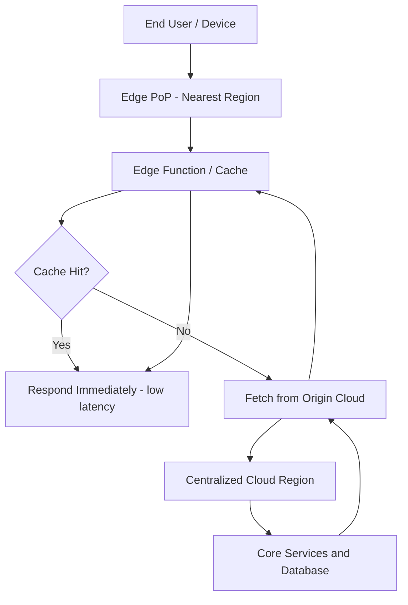

Centralized clouds optimize for scale and operational simplicity. Edge systems optimize for:

- **Lower latency** by reducing physical distance.
- **Local resiliency** when connectivity is degraded.
- **Data sovereignty** by keeping sensitive data in-region.

The right model depends on latency budgets, data compliance, and operational maturity.

---

## 2. Core building blocks

A typical edge stack includes:

- **Global routing** (Anycast, DNS-based routing, or global load balancers).
- **Edge compute** (serverless edge functions, lightweight containers).
- **Regional caches** for static and dynamic content.
- **Control plane** for configuration, rollout, and telemetry.

Treat the edge as a tier, not a replacement, for your core platform.

---

## 3. Edge compute models

Edge compute comes in multiple flavors:

- **CDN edge functions:** fast cold starts, limited execution time.
- **Regional serverless:** more power, slightly higher latency.
- **Dedicated edge clusters:** highest control, highest cost.

Choose a model based on runtime limits, data locality, and maintenance overhead.

---

## 4. Data placement strategy

Not all data belongs at the edge. Classify data into:

- **Hot data:** cacheable or quickly recomputed values.
- **Warm data:** replicated datasets updated in the background.
- **Cold data:** centralized, strongly consistent sources of truth.

Use TTLs, change feeds, and streaming replication to balance freshness and cost.

The following diagram illustrates the data sync pipeline between edge nodes and the central cloud:

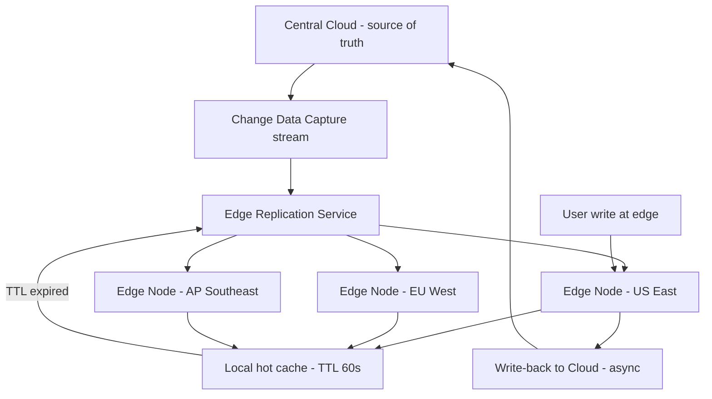

---

## 5. Consistency and conflict handling

Edge environments are inherently distributed. Plan for:

- Eventual consistency when replicating mutable state.
- Conflict resolution strategies (last-write-wins, CRDTs, or application rules).
- Read-repair and backfill pipelines for late updates.

Design user experiences that tolerate slight delays when consistency is relaxed.

---

## 6. Routing and latency budgets

Routing decisions determine perceived performance:

- Send read-heavy traffic to the nearest PoP.
- Route write-heavy traffic to centralized services.
- Split reads and writes when consistency is required.

Define explicit latency budgets per request so teams can validate whether the edge is actually helping.

The CDN request routing diagram below shows how Anycast and DNS-based routing directs users to the nearest PoP:

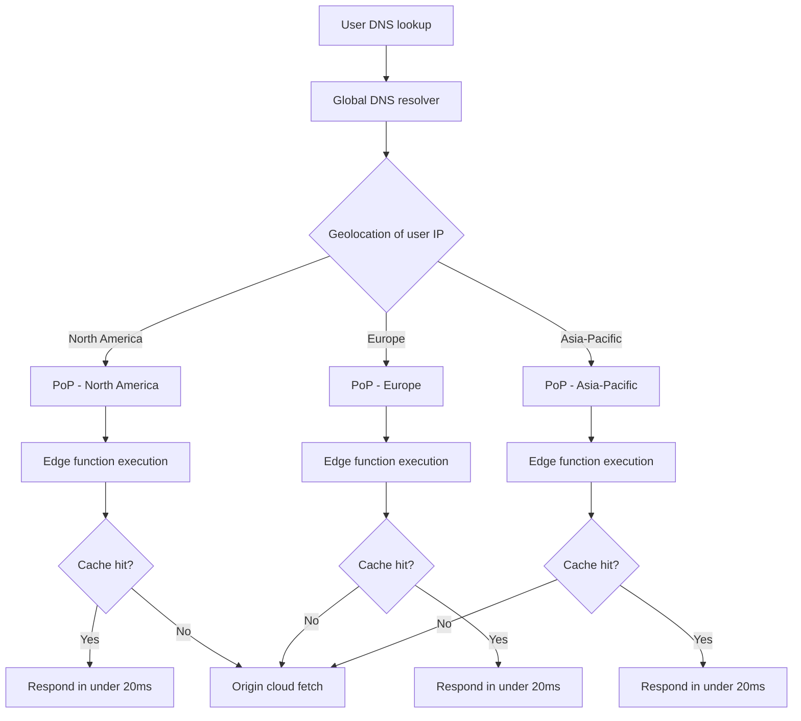

---

## 7. Observability at the edge

Distributed footprints require strong telemetry. Focus on:

- **Latency percentiles** per region and per edge PoP.
- **Cache hit ratios** and origin fetch rates.
- **Error budgets** for edge-specific failures.
- **Replayable logs** for debugging region-specific issues.

Instrument every edge function with consistent trace IDs.

---

## 8. Security and compliance

Edge deployments expand your attack surface. Protect them with:

- Mutual TLS between edge and core services.
- Signed configuration bundles and immutability guarantees.
- Local data minimization and regional access controls.

Treat edge nodes as semi-trusted and design for rapid revocation.

---

## 9. Cost modeling

Edge traffic can be expensive without governance. Watch for:

- Per-request pricing on edge runtimes.
- Data egress fees from regional caches.
- Over-replication of warm datasets.

Track cost per region and build budgets into product planning.

---

## 10. Failure modes and fallbacks

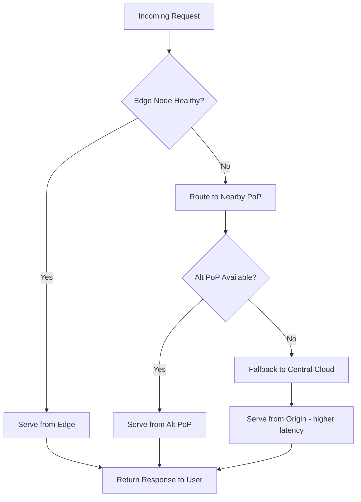

Edge systems need explicit fallback paths:

- If edge compute fails, route to centralized services.
- If a region is degraded, fail over to a nearby PoP.
- If data is stale, show cached content with freshness indicators.

Failover playbooks should be tested just like database failovers.

---

## 11. Edge Function Execution Lifecycle

Edge functions have a distinct lifecycle compared to traditional server processes. Understanding startup behavior is critical for performance:

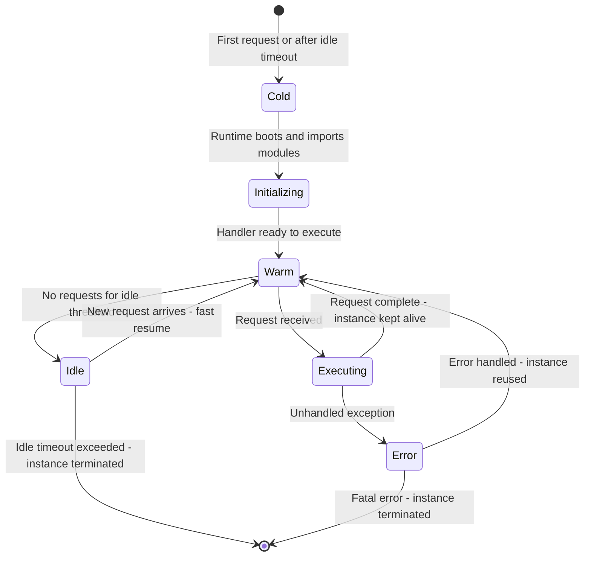

---

## 12. Deployment and rollout strategy

Shipping to the edge requires careful rollouts:

- Canary by region or traffic segment.
- Use feature flags for progressive exposure.
- Build a rapid rollback path to centralized services.

Treat edge rollouts like multi-region deployments, because they are.

---

## 13. Use cases that benefit most

Edge-first architectures shine when:

- Interactive experiences need sub-50ms latency.
- IoT devices require local processing when offline.
- Media processing, personalization, and A/B tests must be regional.
- Compliance requires data residency guarantees.

---

## 14. Edge Security Model

Edge nodes sit outside the trusted core network. The security model must treat them as semi-trusted by design:

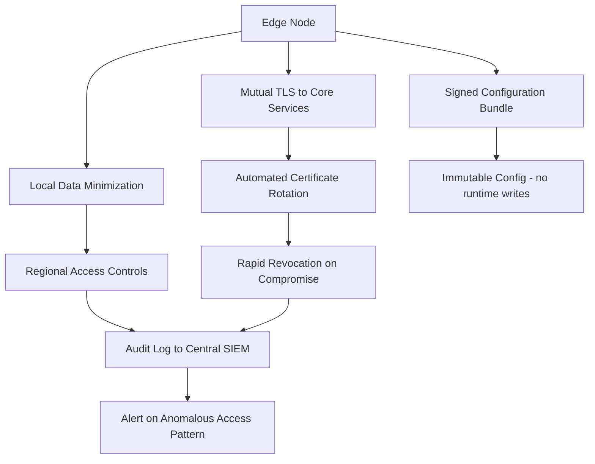

---

## 15. Edge Deployment Rollout Sequence

Progressive rollout prevents a bad edge deployment from reaching all regions simultaneously:

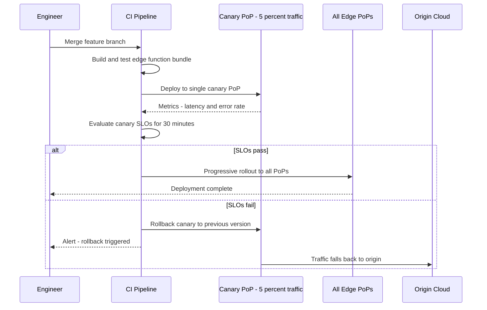

---

## 16. IoT and Offline-First Edge Pattern

IoT devices that operate in connectivity-degraded environments need a local-first processing model:

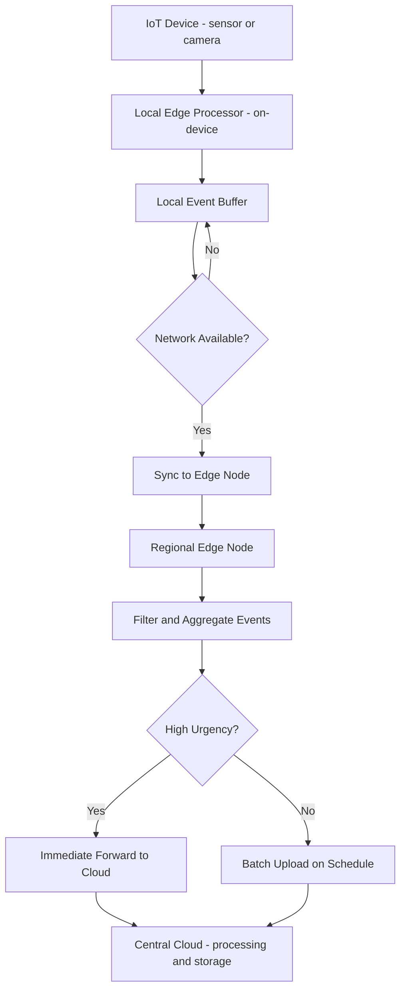

---

## 17. Cost Attribution Model

Tracking edge costs by dimension is essential for preventing runaway spend:

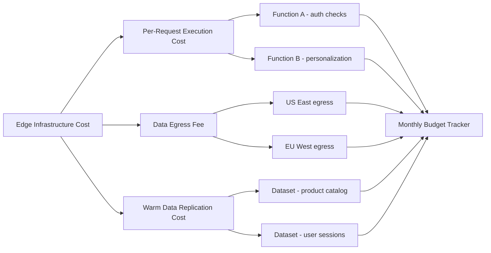

---

## 18. Delivery checklist

- Define latency budgets and regional SLAs early.
- Separate stateless edge logic from stateful core services.
- Build a rollout mechanism with canaries per region.
- Track edge costs by function, region, and traffic class.
- Plan for fallback to centralized services when the edge fails.

Edge computing is powerful when paired with clear data boundaries, resilient control planes, and rigorous observability.

---

## 19. Edge databases: Turso and Cloudflare D1

Traditional cloud databases are centralized by design, creating latency mismatches when edge compute needs to read mutable state. Edge databases bring distributed SQLite replicas to edge PoPs, keeping reads local while funneling writes to a primary.

### Turso: distributed SQLite with libSQL

Turso is built on libSQL (a fork of SQLite) and replicates databases to hundreds of edge locations. Reads are served from the nearest replica; writes are forwarded to the primary region.

```typescript
// turso-edge.ts: read from the nearest edge replica
import { createClient } from "@libsql/client";

const db = createClient({
  url: process.env.TURSO_DATABASE_URL!, // libsql://your-db.turso.io
  authToken: process.env.TURSO_AUTH_TOKEN!,
});

// This read resolves from the nearest replica - typically under 5ms
export async function getProduct(productId: string) {
  const result = await db.execute({
    sql: "SELECT id, name, price, stock FROM products WHERE id = ?",
    args: [productId],
  });
  return result.rows[0] ?? null;
}

// Write goes to primary - higher latency but strongly consistent
export async function decrementStock(productId: string, quantity: number) {
  await db.execute({
    sql: `UPDATE products
          SET stock = stock - ?
          WHERE id = ? AND stock >= ?`,
    args: [quantity, productId, quantity],
  });
}
```

### Cloudflare D1 with Workers

Cloudflare D1 embeds a SQLite database per Cloudflare Worker, co-located with the edge function execution.

```typescript
// cloudflare-worker.ts: D1 query inside a Cloudflare Worker
export interface Env {
  DB: D1Database;
  CACHE: KVNamespace;
}

export default {
  async fetch(request: Request, env: Env): Promise<Response> {
    const url = new URL(request.url);
    const slug = url.pathname.slice(1);

    // Check KV cache first - sub-millisecond
    const cached = await env.CACHE.get(`article:${slug}`);
    if (cached) {
      return new Response(cached, {
        headers: { "Content-Type": "application/json", "X-Cache": "HIT" },
      });
    }

    // Miss: query D1 (co-located SQLite)
    const article = await env.DB.prepare(
      "SELECT title, content, published_at FROM articles WHERE slug = ?",
    )
      .bind(slug)
      .first();

    if (!article) {
      return new Response("Not Found", { status: 404 });
    }

    const body = JSON.stringify(article);

    // Store in KV for 5 minutes
    await env.CACHE.put(`article:${slug}`, body, { expirationTtl: 300 });

    return new Response(body, {
      headers: { "Content-Type": "application/json", "X-Cache": "MISS" },
    });
  },
};
```

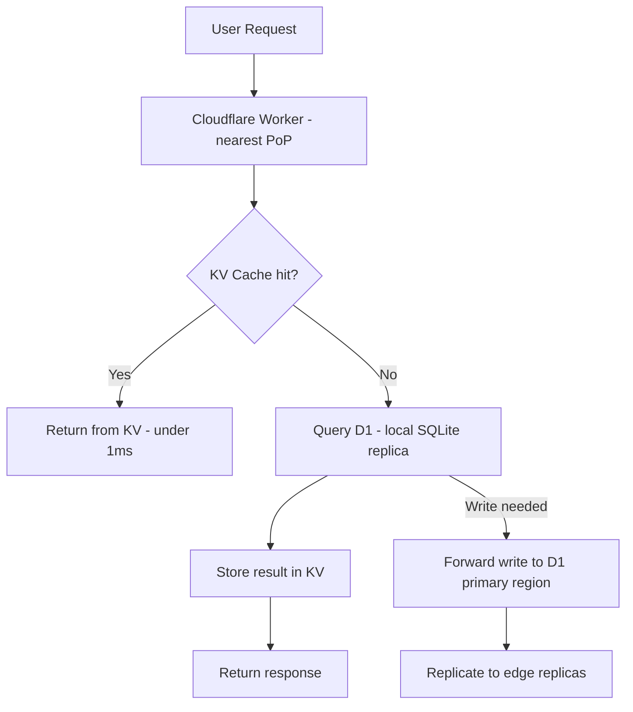

### Edge database tradeoffs

| Dimension          | Turso              | Cloudflare D1      | Traditional Cloud DB       |
| ------------------ | ------------------ | ------------------ | -------------------------- |
| Read latency       | 2-10ms             | 1-5ms              | 20-100ms                   |
| Write latency      | 50-200ms           | 50-150ms           | 5-50ms                     |
| SQL compatibility  | SQLite subset      | SQLite subset      | Full Postgres or MySQL     |
| Global replicas    | 500+               | 300+               | Multi-region (3-5 regions) |
| Strong consistency | Primary reads only | Primary reads only | Configurable               |
| Max DB size        | 9GB per DB         | 10GB per DB        | Unlimited                  |

---

## 20. Edge caching strategies with code

Caching is the most impactful edge optimization. The challenge is matching cache keys, TTLs, and invalidation strategies to real data volatility.

### Cloudflare Workers: cache API patterns

```typescript
// edge-cache.ts: layered edge cache with stale-while-revalidate
export default {
  async fetch(
    request: Request,
    env: Env,
    ctx: ExecutionContext,
  ): Promise<Response> {
    const cacheKey = new Request(request.url, {
      headers: { "Cache-Control": "max-age=60" },
    });
    const cache = caches.default;

    // Check the Cloudflare edge cache
    let response = await cache.match(cacheKey);

    if (response) {
      const age = Date.now() - Date.parse(response.headers.get("Date") ?? "0");
      const ttl = parseInt(response.headers.get("X-TTL") ?? "60") * 1000;

      if (age < ttl) {
        return response; // Fresh cache hit
      }

      // Stale: serve stale, revalidate in background
      ctx.waitUntil(revalidate(request, env, cache, cacheKey));
      return addHeader(response, "X-Cache-Status", "stale");
    }

    // Cache miss: fetch from origin
    const freshResponse = await fetchFromOrigin(request, env);
    ctx.waitUntil(cache.put(cacheKey, freshResponse.clone()));

    return addHeader(freshResponse, "X-Cache-Status", "miss");
  },
};

async function revalidate(
  request: Request,
  env: Env,
  cache: Cache,
  cacheKey: Request,
): Promise<void> {
  const fresh = await fetchFromOrigin(request, env);
  await cache.put(cacheKey, fresh);
}

function addHeader(response: Response, key: string, value: string): Response {
  const headers = new Headers(response.headers);
  headers.set(key, value);
  return new Response(response.body, { status: response.status, headers });
}
```

### Cache key design

Poorly designed cache keys either cause too many misses (defeating the purpose) or over-sharing (causing users to see each other's data).

```typescript
// cache-key.ts: construct cache keys that balance hit rate and correctness
function buildCacheKey(request: Request, userId: string | null): string {
  const url = new URL(request.url);

  // Strip UTM and tracking parameters - they should not create new cache entries
  const trackingParams = [
    "utm_source",
    "utm_medium",
    "utm_campaign",
    "fbclid",
    "gclid",
  ];
  trackingParams.forEach((p) => url.searchParams.delete(p));

  // Sort remaining params for canonical key
  url.searchParams.sort();

  // Public pages: cache by URL only
  if (!userId || url.pathname.startsWith("/public/")) {
    return url.toString();
  }

  // User-specific pages: include user tier (not full user ID, to maintain hit rate)
  // This caches one variant per tier rather than one per user
  const userTier = getUserTier(userId); // e.g., "free", "pro", "enterprise"
  return `${url.toString()}:tier:${userTier}`;
}
```

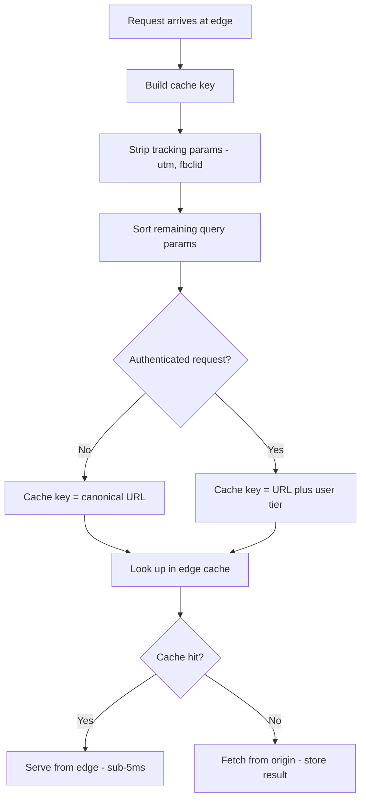

---

## 21. Edge AI inference

Running small ML models at the edge reduces round-trip latency for inference-heavy features like content classification, spam detection, sentiment scoring, and personalization. Cloudflare Workers AI, Vercel AI SDK with edge runtime, and ONNX on Deno Deploy all enable sub-10ms inference without a round-trip to a GPU cluster.

```typescript
// Cloudflare Workers AI: text classification at the edge
export interface Env {
  AI: Ai;
}

export default {
  async fetch(request: Request, env: Env): Promise<Response> {
    const { text } = await request.json<{ text: string }>();

    // Run text classification on Cloudflare's edge GPU network
    const result = await env.AI.run("@cf/huggingface/distilbert-sst-2-int8", {
      text,
    });

    // result: [{ label: "POSITIVE", score: 0.92 }, { label: "NEGATIVE", score: 0.08 }]
    const topLabel = result.sort((a, b) => b.score - a.score)[0];

    return Response.json({
      sentiment: topLabel.label,
      confidence: topLabel.score,
      // Total inference time at edge: 8-15ms vs 80-200ms to central GPU
    });
  },
};
```

### Edge AI deployment considerations

| Model Size             | Edge Runtime                | Latency  | Use Case                                |
| ---------------------- | --------------------------- | -------- | --------------------------------------- |
| Under 50MB (distilled) | Cloudflare Workers AI       | 5-20ms   | Classification, embeddings, sentiment   |
| 50-200MB (quantized)   | Deno Deploy, Fastly Compute | 15-50ms  | NER, intent detection, small generation |
| 200MB+                 | Regional serverless         | 50-200ms | Summarization, moderate generation      |
| 1B+ parameters         | Central GPU cluster         | 200ms-2s | Full LLM generation                     |

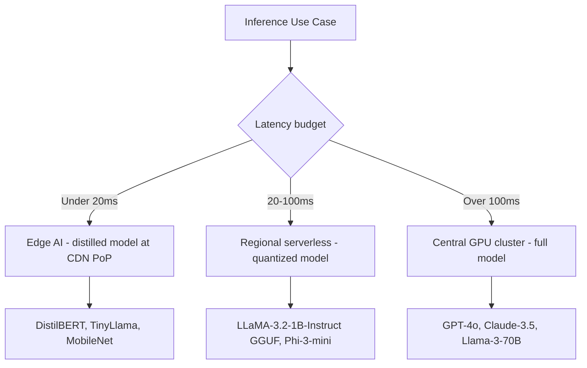

---

## 22. Conclusion

Edge computing has matured from a CDN cache optimization into a full application execution tier. The combination of globally distributed serverless runtimes, edge-native databases, and on-device AI inference unlocks latency profiles that were impossible with centralized cloud architectures even five years ago.

The critical success factors remain consistent across every edge use case: keep stateless logic at the edge and stateful sources of truth in centralized systems, design explicit cache key strategies, instrument every PoP with consistent telemetry, and build fallback paths to origin before deploying. The edge is not a replacement for the cloud - it is a specialized tier that makes the last mile between your infrastructure and your users as fast as physics allows.
