import MdxLayout from "@/components/MdxLayout";

export const metadata = {
  title:
    "End-to-End Data Pipeline Architecture: From Ingestion to Production ML",
  description:
    "A deeply detailed guide covering data ingestion, transformation, feature engineering, model training, deployment, and best practices for a robust, scalable data pipeline.",
  topics: ["Data Science", "Machine Learning", "DevOps", "MLOps"],
};

export default function DataPipelineArticle({ children }) {
  return <MdxLayout>{children}</MdxLayout>;
}

# End-to-End Data Pipeline: From Ingestion to Production ML

### Author: Son Nguyen

> Date: 2025-03-01

Building a modern, **end-to-end data pipeline** requires far more than simply extracting data and training a model. Today’s applications demand a seamless flow from raw data ingestion, through **distributed processing**, **feature engineering**, and **model training**, to **deployment** and **frontend consumption** - all while ensuring reliability, scalability, and maintainability. In this extensive guide, we’ll dissect an architecture (inspired by the attached diagram) that illustrates how to design and implement a robust pipeline. We’ll explore **data ingestion**, **transformation**, **model training**, **backend integration**, **frontend consumption**, and the crucial **DevOps** practices that tie everything together.

---

## 1. Architecture Overview

A well-designed pipeline typically includes four main layers, as seen in the referenced diagram:

1. **AI/ML Layer**:

- **Data Processing Pipeline**: Ingest, clean, and transform data using frameworks like **Spark**, **Pandas**, **Airflow**, etc.
- **Model Training Pipeline**: Use tools such as **MLflow**, **ONNX**, **scikit-learn**, or **TensorFlow** to experiment, track, and produce production-ready models.

2. **Backend Layer**:

- **Microservices** or **API services** (e.g., **Django**, **Flask**, **Node.js**) containerized with **Docker** and orchestrated with **Kubernetes** or similar tools.
- **Databases** or **data storage** solutions that serve the application’s read/write needs.

3. **Frontend Layer**:

- **React**, **Redux**, **Webpack** (or **Vite**) to build user-facing applications.
- Integration with APIs to fetch and display real-time or near real-time insights.

4. **DevOps & Tools**:

- **CI/CD** (Jenkins, GitHub Actions, GitLab CI) for automated build, test, and deployment.
- **Infrastructure as Code** (Terraform, AWS CloudFormation) for consistent environments.
- **Monitoring & Logging** (Prometheus, Grafana, ELK Stack) to ensure reliability and performance.

This architecture enforces separation of concerns, allowing each layer to scale independently and evolve without disrupting the entire ecosystem.

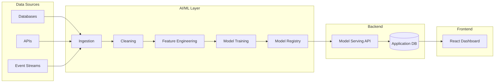

---

## 2. Data Ingestion

### 2.1 Sources and Formats

**Data ingestion** typically involves gathering data from multiple sources:

- **Transactional Databases** (MySQL, PostgreSQL, DynamoDB)
- **NoSQL Stores** (MongoDB, Cassandra)
- **Data Lakes** (AWS S3, Azure Data Lake, Google Cloud Storage)
- **Streaming Systems** (Apache Kafka, AWS Kinesis)
- **Third-Party APIs** or **Webhooks**
- **Flat Files** (CSV, JSON, Parquet) in on-premises or cloud storage

**Key Challenges**:

- **Varying Data Formats**: CSV, JSON, Avro, Parquet - each has different compression and serialization nuances.
- **Schema Evolution**: Over time, schemas may change (adding columns, changing data types).
- **Throughput & Latency**: Large volumes of data may require parallel ingestion or streaming ingestion for near real-time updates.

### 2.2 Batch vs. Streaming Ingestion

1. **Batch Ingestion**:

- Typically scheduled (e.g., hourly, daily).
- Good for large volumes of data where real-time is not critical.
- Often orchestrated via tools like **Apache Airflow**, **Luigi**, or **Cron** jobs.

2. **Streaming Ingestion**:

- Data flows in real-time (seconds or milliseconds of latency).
- Ideal for IoT sensors, clickstream data, or financial transaction feeds.
- Technologies: **Apache Kafka**, **Apache Flink**, **AWS Kinesis**, **Spark Structured Streaming**.

The following diagram compares ETL and ELT approaches and when to use each:

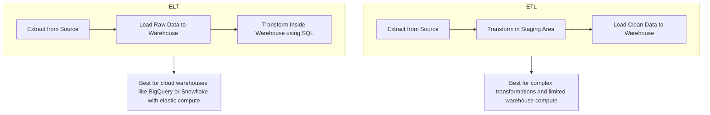

### 2.3 Best Practices for Data Ingestion

- **Use a Schema Registry** (Confluent Schema Registry, for example) to handle evolving data schemas without breaking downstream consumers.
- **Partition Data** by date, region, or other logical segments for efficient queries.
- **Implement Fault Tolerance** with exactly-once or at-least-once semantics in streaming systems.
- **Metadata Tracking**: Tools like **Hive Metastore** or **AWS Glue Data Catalog** help track data lineage, table schemas, and partitioning.

---

## 3. Data Transformation & Processing (AI/ML Layer)

### 3.1 Data Cleaning and Normalization

- **Deduplication**: Remove duplicate records.
- **Handling Missing Values**: Impute or drop missing data based on domain logic.
- **Data Validation**: Check for out-of-range or invalid values.
- **Normalization**: Standardize numeric columns to reduce skew.

**Example (Pandas)**:

```python
import pandas as pd

df = pd.read_csv("raw_data.csv")

# Drop rows with null values in critical columns
df = df.dropna(subset=["user_id", "event_timestamp"])

# Convert timestamp column to datetime
df["event_timestamp"] = pd.to_datetime(df["event_timestamp"])

# Basic outlier removal
df = df[df["purchase_amount"] < 10000]
```

### 3.2 Transformation Frameworks

1. **Apache Spark**:

- **Distributed**: Handles massive datasets by parallelizing operations across clusters.
- **Rich Ecosystem**: Spark SQL, Spark MLlib, Spark Streaming, and Spark GraphX.
- **Common Use**: ETL, data wrangling, large-scale machine learning.

2. **Pandas / Dask**:

- **Single-Machine or Small Clusters**: Great for prototyping, data exploration, or smaller scale.
- **Pandas API on Spark**: Some versions of Spark allow Pandas-like syntax at scale.

3. **SQL-Based Transformations**:

- **dbt** (Data Build Tool) for analytics engineering.
- **In-Warehouse Transformations** (Snowflake, BigQuery, Redshift).

### 3.3 Orchestration

**Workflows** can be orchestrated with:

- **Apache Airflow**: DAG-based approach, supports scheduling, retries, and complex dependency management.
- **Luigi**: Python-based pipeline orchestration from Spotify.
- **Prefect**: Modern, Pythonic workflow orchestration with dynamic tasks.

**Orchestration Best Practices**:

- **Idempotency**: Each run should yield consistent results, allowing for restarts.
- **Retry Mechanisms**: Automate retries upon transient failures (network issues, temporary data unavailability).
- **Monitoring**: Track job status, logs, and metrics in a centralized dashboard.

---

## 4. Feature Engineering (AI/ML Layer)

### 4.1 Feature Extraction

- **Categorical Encoding**: One-hot, label encoding, or target encoding for non-numeric features.
- **Text Processing**: Tokenization, stopword removal, TF-IDF, or word embeddings for textual data.
- **Time-Series**: Rolling windows, lag features, or frequency domain transformations.
- **Images**: Convolutional neural network (CNN) preprocessing, resizing, normalization.

### 4.2 Feature Stores

A **feature store** centralizes the definition, storage, and serving of features:

- **Consistency**: Ensures the same feature logic is applied for both training and inference.
- **Reusability**: Different models can reuse existing features.
- **Examples**: Tecton, Feast, AWS SageMaker Feature Store.

The feature store architecture shows how features flow from computation to both training and real-time serving:

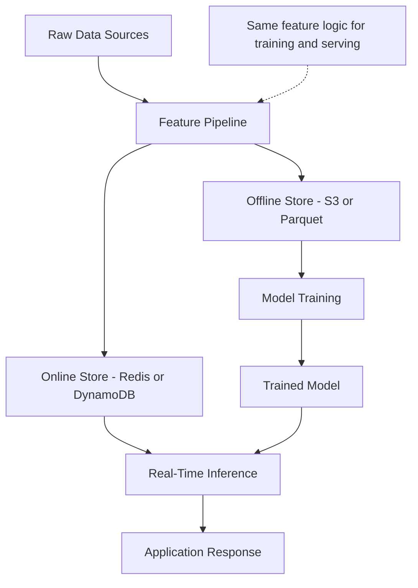

### 4.3 Data Versioning

- **Git-like Data Repositories**: Tools such as DVC (Data Version Control) or LakeFS for storing data lineage.
- **Immutable Data Buckets**: Store each dataset version in a separate S3 path or object store with timestamped naming.
- **Why It Matters**: Reproducible experiments and audits require consistent data snapshots.

---

## 5. Model Training Pipeline (AI/ML Layer)

### 5.1 Experimentation and Tracking

- **MLflow**: Logs hyperparameters, metrics, and artifacts (models, plots).
- **Weights & Biases**: Offers a collaborative interface for experiment comparison, model versioning.
- **ClearML**: Open-source suite for experiment management.

```python
import mlflow
import mlflow.sklearn
from sklearn.ensemble import RandomForestClassifier

mlflow.set_experiment("purchase_prediction")

with mlflow.start_run(run_name="baseline-rf"):
    model = RandomForestClassifier(n_estimators=100, max_depth=10)
    model.fit(X_train, y_train)
    accuracy = model.score(X_test, y_test)

    mlflow.log_param("n_estimators", 100)
    mlflow.log_param("max_depth", 10)
    mlflow.log_metric("accuracy", accuracy)

    mlflow.sklearn.log_model(model, "rf_model")
```

### 5.2 Hyperparameter Tuning

- **Grid Search**, **Random Search**, **Bayesian Optimization**, or **Hyperopt** for advanced tuning.
- **Parallelization**: Tools like **Spark MLlib**, **Ray Tune**, or **Dask** can scale hyperparameter searches.

### 5.3 Model Validation

- **Cross-Validation**: K-fold or stratified sampling to ensure robust metrics.
- **Metrics**: Accuracy, Precision/Recall, F1-score, AUC for classification; RMSE, MAE for regression.
- **Drift Detection**: Monitor data distribution changes over time (concept drift, data drift).

### 5.4 Model Packaging and Registry

- **Packaging**: Serialize models to **ONNX**, **joblib**, or **pickle**.
- **Registry**: MLflow Model Registry, AWS SageMaker Model Registry, or custom solutions for version control and promotion stages (Staging → Production → Archived).

The model training pipeline illustrates the stages from raw experiment to a production-ready model:

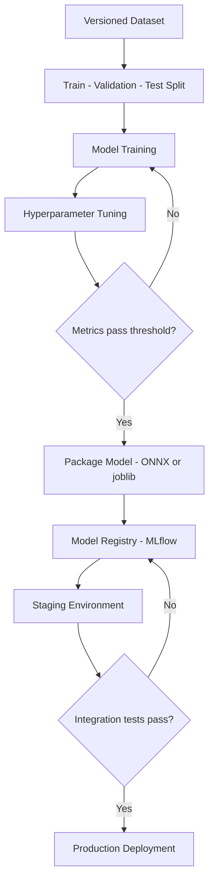

---

## 6. Model Deployment

### 6.1 Batch Inference

- **Periodic Jobs**: Use Spark or Python scripts to process large datasets and write predictions to a data store.
- **Use Cases**: Generating offline recommendations, risk scores, or daily analytics.
- **Tools**: Airflow or cron-based scheduling to trigger batch inference.

### 6.2 Real-Time (Online) Inference

- **Serving Endpoints**: Expose a REST/GraphQL API or a gRPC endpoint for low-latency predictions.
- **Serverless**: AWS Lambda, Google Cloud Functions for ephemeral scaling.
- **Microservice**: Containerize a Flask/FastAPI/TorchServe application behind a load balancer (e.g., AWS ALB, NGINX Ingress on Kubernetes).

### 6.3 Canary and Blue-Green Deployments

- **Canary**: Route a small percentage of traffic to the new model version. If metrics are good, gradually increase traffic.
- **Blue-Green**: Keep two production environments (blue and green). Deploy the new model to green; switch traffic from blue to green once validated.

---

## 7. Backend Layer

### 7.1 Microservices and APIs

- **Service Separation**: Authentication, user profiles, data ingestion, ML inference can each be separate microservices.
- **Communication**: REST, gRPC, or messaging (RabbitMQ, Kafka).
- **Example**: A **Django** app for user management, a **Node.js** service for real-time notifications, a **Flask** service for ML inference.

### 7.2 Containerization

**Docker** is the de facto standard:

```bash
# Example Dockerfile
FROM python:3.10-slim
WORKDIR /app
COPY requirements.txt .
RUN pip install --no-cache-dir -r requirements.txt
COPY . .
CMD ["python", "manage.py", "runserver", "0.0.0.0:8000"]
```

- **Image Tagging**: Tag images with version numbers or Git commit SHAs for traceability.
- **Security**: Use minimal base images (e.g., `python:3.10-slim`) to reduce attack surface.

### 7.3 Container Orchestration

- **Kubernetes**: Most popular choice for large-scale deployments.
- **Docker Swarm**: Simpler alternative for smaller setups.
- **Helm Charts**: Package and deploy complex Kubernetes apps with versioned configuration.

---

## 8. Frontend Layer

### 8.1 Frameworks

- **React**: Popular library for building interactive UIs.
- **Redux** or **Context API**: Manages global state for data fetched from APIs.
- **Next.js** or **Gatsby**: For server-side rendering (SSR) or static site generation if needed.

### 8.2 Data Fetching and State Management

- **REST or GraphQL** calls to backend.
- **Redux Thunk** or **Redux Saga** for async data fetching.
- **React Query** or **SWR**: Simplify caching and background refetching of data.

### 8.3 Build & Deployment

- **Webpack** or **Vite**: Bundles your React code for production.
- **CI/CD Integration**: Automated tests (Jest, React Testing Library), linting (ESLint), then deployment to hosting (Vercel, Netlify, AWS S3 + CloudFront).
- **Containerization**: Optionally serve your built frontend via Nginx or Apache in a Docker container.

---

## 9. DevOps and Tools

### 9.1 CI/CD

- **Git-Based Workflows**: Each commit triggers a pipeline that builds, tests, and (optionally) deploys the app.
- **Tools**: Jenkins, GitHub Actions, GitLab CI, CircleCI.
- **Stages**:

The CI/CD pipeline for ML models extends the standard software pipeline with model-specific validation steps:

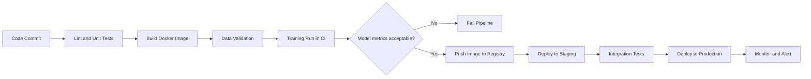

1. **Build**: Compile code, run linters, build Docker images.
2. **Test**: Unit tests, integration tests, coverage reports.
3. **Deploy**: Push images to a registry, deploy to staging or production.

```yaml
# Example GitHub Actions Workflow
name: CI

on:
  push:
    branches: ["main"]

jobs:
  build-test-deploy:
    runs-on: ubuntu-latest
    steps:
      - uses: actions/checkout@v2
      - name: Set up Node
        uses: actions/setup-node@v2
        with:
          node-version: 16
      - name: Install dependencies
        run: npm install
      - name: Run tests
        run: npm test
      - name: Build
        run: npm run build
      - name: Docker build and push
        run: |
          docker build -t my-app:latest .
          docker tag my-app:latest my-registry/my-app:latest
          docker push my-registry/my-app:latest
```

### 9.2 Infrastructure as Code (IaC)

- **Terraform**: Cloud-agnostic approach to provisioning AWS, Azure, or GCP resources.
- **AWS CloudFormation** or **Azure Resource Manager**: Vendor-specific templates.
- **Benefits**: Version control, repeatable deployments, automated environment creation.

### 9.3 Observability and Monitoring

1. **Metrics**:

- **Prometheus** for metrics collection, **Grafana** for visualization.
- Track CPU, memory, request latency, error rates.

2. **Logging**:

- **ELK Stack** (Elasticsearch, Logstash, Kibana) or **Splunk**.
- Centralize logs from containers, microservices, and cluster events.

3. **Tracing**:

- **Jaeger** or **Zipkin** for distributed tracing, helps pinpoint slow services in microservice architectures.

4. **Alerting**:

- **PagerDuty**, **Opsgenie**, or **Slack** integration for real-time alerts when metrics exceed thresholds.

---

## 10. Security and Compliance

### 10.1 Data Security

- **Encryption**: At-rest (disk encryption, S3 SSE) and in-transit (TLS/SSL).
- **Access Control**: IAM roles, security groups, and role-based access control (RBAC) in Kubernetes.
- **Secrets Management**: HashiCorp Vault, AWS Secrets Manager, or Kubernetes Secrets.

### 10.2 Compliance

- **GDPR / CCPA**: For user data privacy in the EU or California.
- **HIPAA**: Healthcare data handling in the U.S.
- **SOC 2**: Security, availability, and confidentiality for service organizations.

### 10.3 Vulnerability Scanning

- **Container Scans**: Tools like **Trivy** or **Anchore** to detect vulnerabilities in Docker images.
- **Dependency Scans**: GitHub Dependabot, Snyk, or npm audit to find insecure libraries.

---

## 11. Advanced Topics in MLOps

### 11.1 Model Drift and Retraining

- **Data Drift**: Input data distribution changes over time (e.g., user behavior shift).
- **Concept Drift**: Underlying relationship between features and target changes.
- **Solution**: Automated triggers to retrain the model when drift thresholds exceed certain levels.

### 11.2 A/B Testing and Shadow Deployment

- **A/B Testing**: Compare a new model’s performance (Model B) with the current production model (Model A) on a subset of traffic.
- **Shadow Deployment**: New model receives traffic in parallel but doesn’t affect user-facing results, used purely for monitoring.

### 11.3 Feature Store Integration

- **Consistency**: Guarantee the same feature transformations at training time and inference time.
- **Low-Latency Serving**: Some feature stores provide in-memory or Redis-based serving for real-time predictions.

---

## 12. Data Quality Gate

A data quality gate ensures bad data is stopped before it corrupts downstream models or analytics:

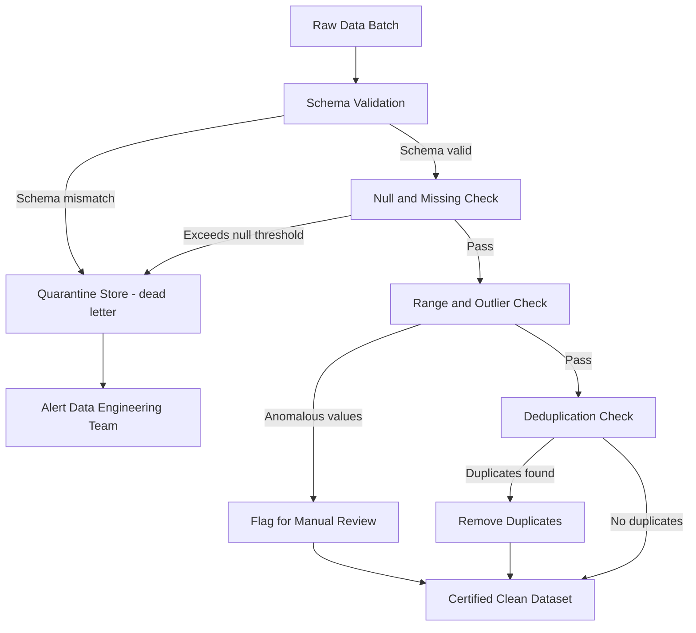

---

## 13. Microservice Communication Patterns

The backend layer uses multiple communication strategies depending on latency and reliability requirements:

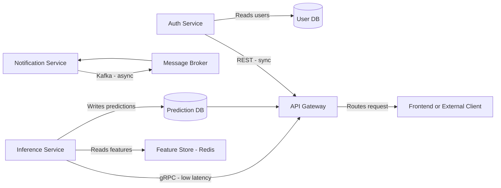

---

## 14. Model Drift Detection and Retraining Loop

Automated drift detection and retraining closes the model lifecycle loop in production:

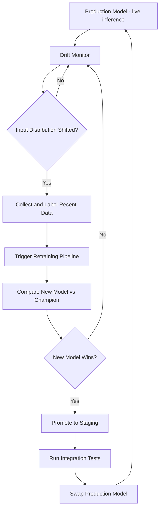

---

## 15. Canary Deployment for ML Models

Canary deployment allows gradual traffic shifting to validate new models before full promotion:

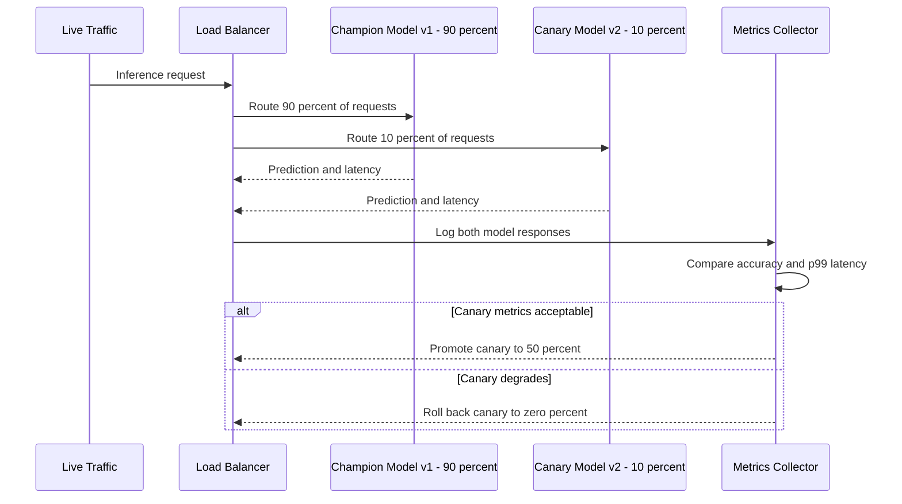

---

## 16. Putting It All Together: A Sample Workflow

1. **Data Ingestion**: Airflow schedules a daily batch ingestion job from MySQL and a continuous stream from Kafka.
2. **Data Processing**: Spark jobs clean and transform the data, storing results in Parquet format in S3.
3. **Feature Engineering**: Additional transformations in Python or Spark MLlib; relevant features are registered in a feature store.
4. **Model Training**: A data scientist runs hyperparameter tuning on a RandomForest model using MLflow for experiment tracking.
5. **Model Registry**: The best-performing model is promoted to “Staging,” then “Production.”
6. **Deployment**:

- **Batch**: A nightly job uses the production model to score the entire dataset.
- **Real-Time**: A Flask-based microservice loads the model at startup and provides inference via a REST API.

7. **Backend Integration**: Django-based microservice orchestrates user auth, data queries, and merges inference results for the frontend.
8. **Frontend**: A React app fetches predictions from the Django service, displaying insights on a dashboard.
9. **DevOps**: GitHub Actions builds Docker images, runs tests, and deploys them to a Kubernetes cluster managed by Terraform.
10. **Monitoring & Logging**: Prometheus scrapes metrics from each microservice; alerts are configured for high latency or error spikes.

---

## 17. Data Mesh Architecture

As data platforms grow, a single centralized data platform team becomes a bottleneck. **Data mesh** decentralizes ownership: each business domain owns its own data as a product, with the platform team providing self-serve infrastructure.

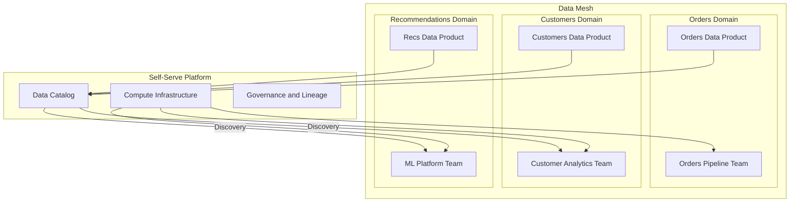

The four pillars of data mesh are domain ownership, data as a product, self-serve data infrastructure, and federated computational governance. Each domain team treats its datasets as first-class products with SLAs, documentation, and versioned contracts.

### 14.1 Data Contracts

A data contract is a formal agreement between a data producer and its consumers specifying schema, semantics, SLA, and quality guarantees. When the producer changes the schema without updating the contract, downstream consumers break silently. Contracts prevent this.

```yaml
# data-contract.yaml - Orders domain
apiVersion: datacontract.com/v0.9.2
id: orders-daily-v2
info:
  title: Orders Daily Snapshot
  owner: orders-team@company.com
  version: 2.1.0
  sla:
    freshness: 2 hours
    availability: 99.5%

models:
  orders:
    fields:
      order_id:
        type: string
        required: true
        unique: true
      customer_id:
        type: string
        required: true
      total_amount:
        type: number
        minimum: 0
      created_at:
        type: timestamp
        required: true
    quality:
      - type: not_null
        columns: [order_id, customer_id, created_at]
      - type: freshness
        column: created_at
        warn_after: 1h
        error_after: 3h
```

```python
# Validate a dataset against its contract using soda-core
from soda.scan import Scan

scan = Scan()
scan.set_data_source_name("orders_warehouse")
scan.add_configuration_yaml_file("soda_config.yaml")
scan.add_sodacl_yaml_str("""
checks for orders:
  - missing_count(order_id) = 0
  - min(total_amount) >= 0
  - freshness(created_at) < 2h
""")
scan.execute()
print(scan.get_scan_results())
```

### 14.2 Real-Time Feature Serving

The gap between training-time features and inference-time features is a common source of model degradation. A real-time feature serving system eliminates training-serving skew by computing and serving features through the same code path.

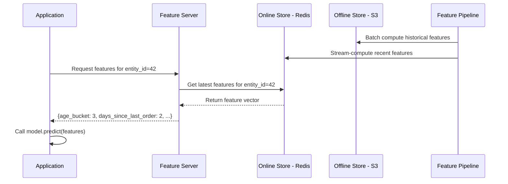

```python
# Feature serving with Feast
from feast import FeatureStore
from datetime import datetime

store = FeatureStore(repo_path=".")

# Real-time lookup - hits the online store (Redis)
feature_vector = store.get_online_features(
    features=[
        "customer_features:days_since_last_order",
        "customer_features:lifetime_value",
        "customer_features:preferred_category",
    ],
    entity_rows=[{"customer_id": "cust_42"}],
).to_dict()

print(feature_vector)
# {"days_since_last_order": [2], "lifetime_value": [1450.0], ...}
```

---

## 18. Data Quality Monitoring with Great Expectations

Catching bad data at ingestion prevents corrupted models and misleading analytics. **Great Expectations** (GX) is the most widely adopted open-source data quality framework. It lets you define expectations as code, run validations in your pipeline, and publish data documentation automatically.

### 15.1 Defining Expectations

```python
import great_expectations as gx

context = gx.get_context()

# Define a validator for a Pandas DataFrame
df = pd.read_parquet("s3://data-lake/orders/2025-03-01.parquet")
validator = context.sources.pandas_default.read_dataframe(df)

# Expectations are assertions about data shape and content
validator.expect_column_to_exist("order_id")
validator.expect_column_values_to_not_be_null("order_id")
validator.expect_column_values_to_be_unique("order_id")
validator.expect_column_values_to_not_be_null("customer_id")
validator.expect_column_values_to_be_between(
    column="total_amount",
    min_value=0,
    max_value=100_000,
)
validator.expect_column_values_to_match_strftime_format(
    column="created_at",
    strftime_format="%Y-%m-%d %H:%M:%S",
)

results = validator.validate()
print(f"Success: {results.success}")
print(f"Failures: {results.statistics[‘unsuccessful_expectations’]}")
```

### 15.2 Data Quality Gate in Airflow

Integrate GX validations as an Airflow task so that downstream tasks only run if data quality passes.

```python
from airflow import DAG
from airflow.operators.python import PythonOperator, BranchPythonOperator
from datetime import datetime, timedelta

def run_data_quality_check(**context):
    import great_expectations as gx
    ctx = gx.get_context()
    checkpoint = ctx.get_checkpoint("orders_daily_checkpoint")
    result = checkpoint.run()
    if not result.success:
        raise ValueError(f"Data quality check failed: {result}")

with DAG("orders_pipeline", start_date=datetime(2025, 1, 1), schedule="@daily") as dag:
    ingest = PythonOperator(task_id="ingest_orders", python_callable=ingest_orders_fn)
    quality_gate = PythonOperator(
        task_id="data_quality_check",
        python_callable=run_data_quality_check,
    )
    transform = PythonOperator(task_id="transform_orders", python_callable=transform_fn)
    train = PythonOperator(task_id="retrain_model", python_callable=train_fn)

    ingest >> quality_gate >> transform >> train
```

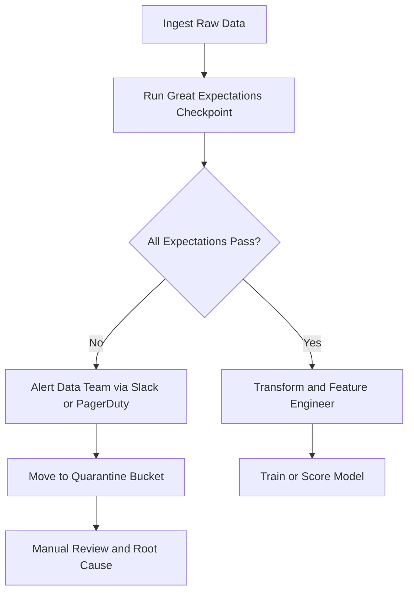

### 15.3 Data Observability Metrics

Beyond schema validation, modern data observability platforms monitor five pillars: freshness, volume, distribution, schema, and lineage. Tools like Monte Carlo, Bigeye, and open-source alternatives like Elementary track these automatically.

| Pillar       | What to Monitor                      | Alert Condition                |
| ------------ | ------------------------------------ | ------------------------------ |
| Freshness    | Time since last update               | Stale beyond SLA threshold     |
| Volume       | Row count per batch                  | Drop or spike above baseline   |
| Distribution | Column statistics (mean, nulls)      | Drift from historical baseline |
| Schema       | Column names and types               | Unexpected addition or removal |
| Lineage      | Upstream and downstream dependencies | Upstream failure propagation   |

---

## 19. Conclusion

Building a **truly end-to-end data pipeline** is a complex endeavor that touches on data engineering, software development, machine learning, and DevOps. By carefully **segmenting** your architecture into a data processing layer, model training pipeline, backend microservices, and a frontend layer - then wrapping it all in robust DevOps practices - you create a **modular**, **scalable**, and **maintainable** ecosystem.

**Key Takeaways**:

1. **Plan for Scale and Complexity**: Use distributed tools (Spark, Kubernetes) and orchestrators (Airflow, Terraform) early.
2. **Version Everything**: Code, data, models, infrastructure - versioning ensures reproducibility and easier rollback.
3. **Automate CI/CD**: Consistent, automated deployments reduce human error and accelerate development.
4. **Monitor and Alert**: Visibility into performance metrics, logs, and distributed traces is crucial for diagnosing issues quickly.
5. **Security and Compliance**: Encrypt data, control access, and regularly scan for vulnerabilities.
6. **Iterate Continuously**: Data pipelines are never "finished." Regularly refine ingestion, transformation, modeling, and deployment strategies.

By following the best practices outlined here, you'll be well on your way to designing a data pipeline that not only meets current needs but also adapts to future requirements - handling ever-growing data volumes, new data sources, evolving ML models, and more sophisticated user-facing applications.

---

## 20. Further Reading & Resources

- **Data Engineering**:

  - [The Data Engineering Cookbook](https://github.com/andkret/Cookbook)
  - [Apache Spark Documentation](https://spark.apache.org/docs/latest/)
  - [Apache Airflow](https://airflow.apache.org/)

- **MLOps**:

  - [Google Cloud's MLOps Whitepaper](https://cloud.google.com/architecture/mlops-continuous-delivery-and-automation-pipelines-in-machine-learning)
  - [MLflow Docs](https://mlflow.org/docs/latest/index.html)
  - [Feast (Feature Store)](https://docs.feast.dev/)

- **Backend & Microservices**:

  - [Django Docs](https://docs.djangoproject.com/en/)
  - [Flask Docs](https://flask.palletsprojects.com/en/latest/)
  - [Node.js Docs](https://nodejs.org/en/docs/)

- **Frontend**:

  - [React](https://reactjs.org/)
  - [Redux](https://redux.js.org/)
  - [Next.js](https://nextjs.org/)

- **DevOps**:
  - [Docker](https://docs.docker.com/)
  - [Kubernetes](https://kubernetes.io/docs/home/)
  - [Terraform](https://developer.hashicorp.com/terraform/docs)
  - [Prometheus & Grafana](https://prometheus.io/docs/introduction/overview/)

By integrating these tools and following these strategies, you'll have a powerful, end-to-end data pipeline capable of driving real-time insights and unlocking the full potential of your organization's data.
