import MdxLayout from "@/components/MdxLayout";

export const metadata = {
  title: "Event-Driven Architecture: Building Resilient, Scalable Systems",
  description:
    "A practical guide to event-driven architecture, covering core concepts, delivery guarantees, topology patterns, and operational best practices.",
  topics: ["System Design", "Distributed Systems", "Architecture", "Backend"],
};

export default function EventDrivenArchitectureArticle({ children }) {
  return <MdxLayout>{children}</MdxLayout>;
}

# Event-Driven Architecture: Building Resilient, Scalable Systems

### Author: Son Nguyen

> Date: 2024-10-18

Event-driven architecture (EDA) lets systems communicate through immutable events rather than direct requests. This shift enables looser coupling, better scalability, and more resilient workflows, but it also introduces new operational and data consistency challenges. This article breaks down the building blocks, design decisions, and the operational guardrails that make EDA successful in production.

---

## 1. Core concepts

EDA revolves around a few fundamental pieces:

- **Event producers** emit events when something meaningful occurs.
- **Event brokers** route and buffer events (Kafka, Pulsar, SNS/SQS).
- **Event consumers** subscribe and react to events asynchronously.
- **Event payloads** represent facts that already happened.

An event should be immutable, timestamped, and easy to reason about without requiring side-channel state. Think of events as historical records, not commands.

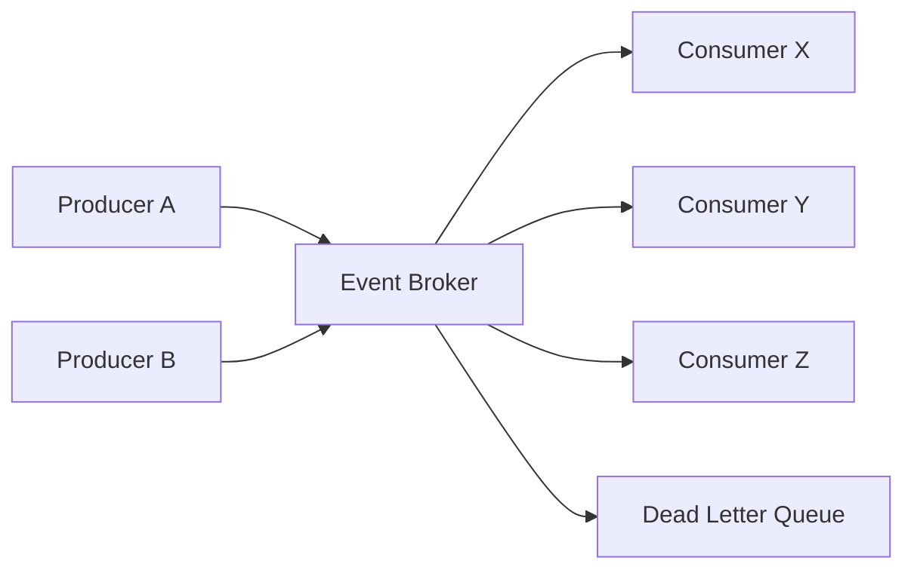

---

## 2. Event modeling and domain boundaries

Well-modeled events mirror domain reality:

- Use business verbs and nouns: `billing.invoice_paid`, `identity.user_verified`.
- Avoid imperative naming like `charge_card`.
- Include the minimum required fields for downstream consumers.

Keep domain boundaries explicit. Avoid one mega-topic that mixes unrelated events, which makes governance, access control, and ownership ambiguous.

---

## 3. Delivery semantics and idempotency

Your system behavior depends on how reliably events are delivered:

- **At-most-once:** Lowest latency, but events can be dropped.
- **At-least-once:** Events may be duplicated; consumers must be idempotent.
- **Exactly-once:** Hard to achieve end-to-end and typically limited to a platform boundary.

In practice, build consumers that tolerate duplicates and out-of-order delivery using idempotency keys, deduplication tables, and natural idempotency (same input produces the same output).

---

## 4. Topology patterns

Common EDA patterns include:

- **Publish/subscribe:** Multiple consumers receive the same event.
- **Event streams:** Ordered event logs that can be replayed and reprocessed.
- **CQRS:** Write-side emits events, read-side builds optimized views.
- **Saga workflows:** Coordinated long-running processes with compensation.

Choose a topology based on the required ordering guarantees and replay needs. If you must support replays and auditing, event streams become the default architecture.

The CQRS pattern separates the write path from the read path via events:

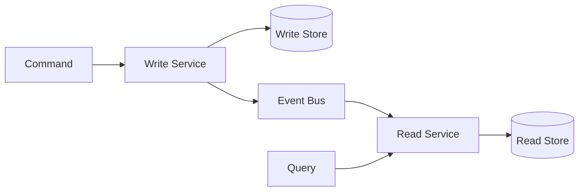

A saga workflow coordinates long-running transactions with compensation:

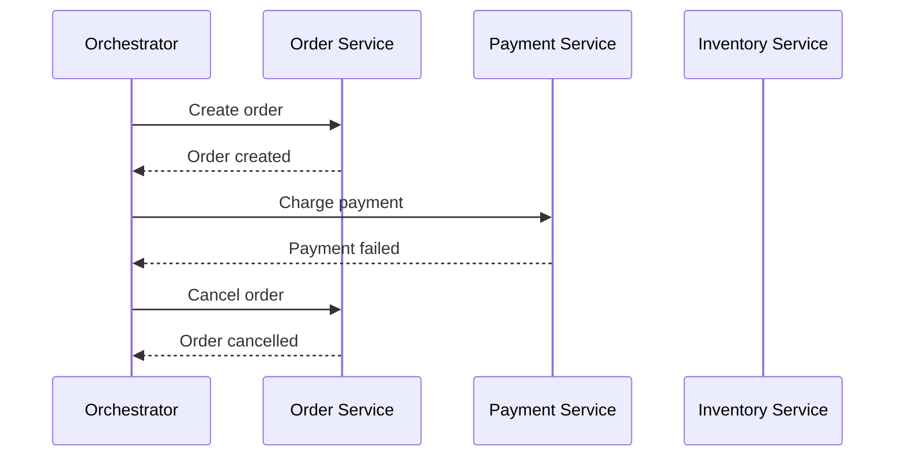

Event store replay allows downstream systems to rebuild state or catch up after a failure by re-reading the durable log:

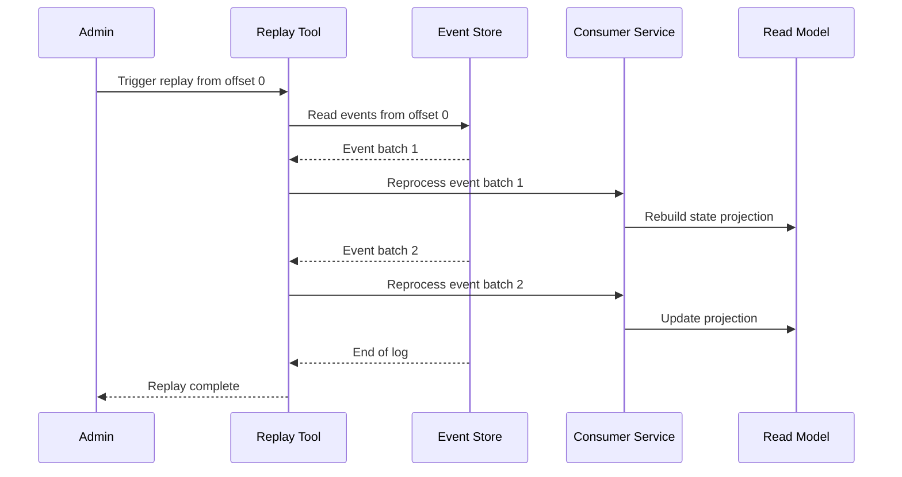

---

## 5. Schema design and versioning

Event payloads are APIs that evolve over time. Use explicit versioning and compatibility rules:

- Define schemas with JSON Schema, Avro, or Protobuf.
- Use a schema registry to validate producers and consumers.
- Prefer backward-compatible changes (additive fields) to avoid breaking consumers.

Document the event contract just like you would for REST or GraphQL APIs. Every event should have a canonical definition, ownership, and deprecation policy.

An event versioning strategy determines how schema evolution is handled without breaking existing consumers:

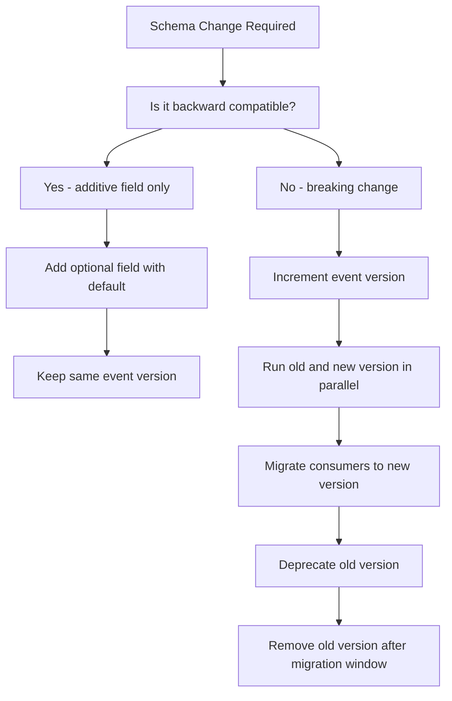

The Kafka partition topology shows how producers write to partitions and consumer groups divide the work with ordering guaranteed per partition:

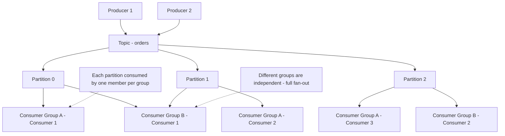

---

## 6. Choosing the right broker

The broker defines your reliability and operational model:

- **Kafka/Pulsar:** High throughput, ordering, replay, and long retention.
- **SNS/SQS or Pub/Sub:** Managed, simpler operations, weaker ordering.
- **NATS:** Low latency, lightweight, often for internal messaging.

Select based on throughput, ordering requirements, operational maturity, and cost tolerance.

---

## 7. The outbox pattern and atomicity

A common failure mode is the "double write" problem: writing to the database and emitting an event separately. Fix this with the outbox pattern:

- Write the event and business data in one local transaction.
- A background worker publishes the event from the outbox table.
- Consumers treat events as authoritative facts.

This pattern makes event emission reliable without distributed transactions.

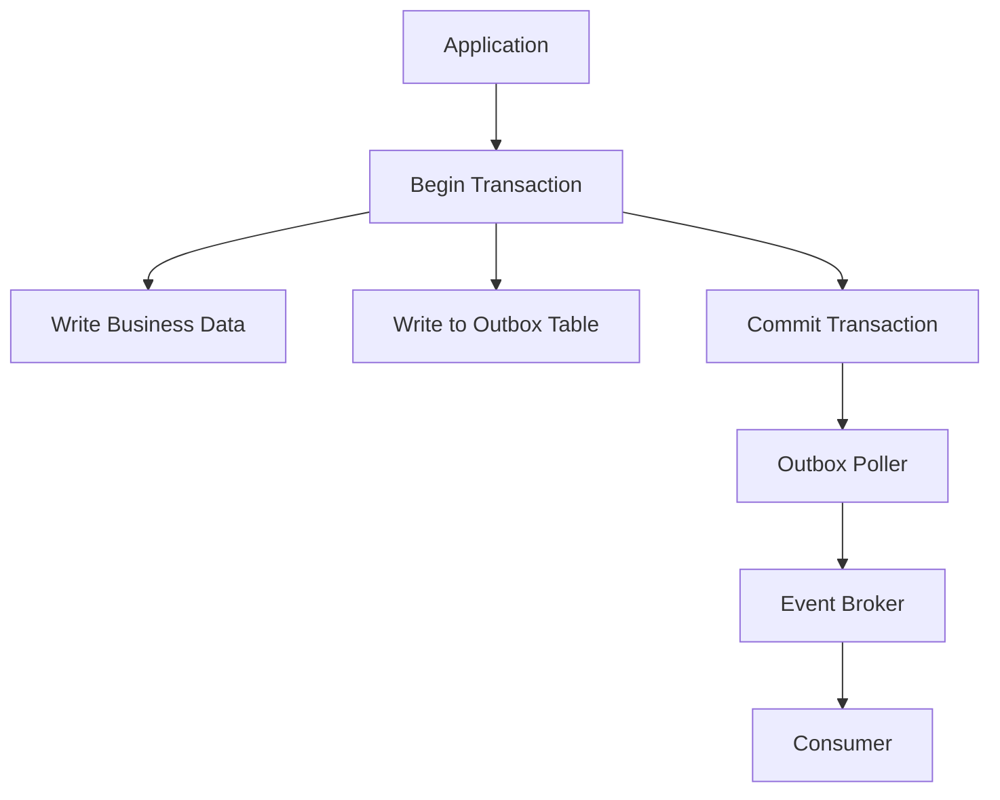

Consumer group rebalancing happens when a consumer joins or leaves the group, temporarily pausing consumption while partitions are reassigned:

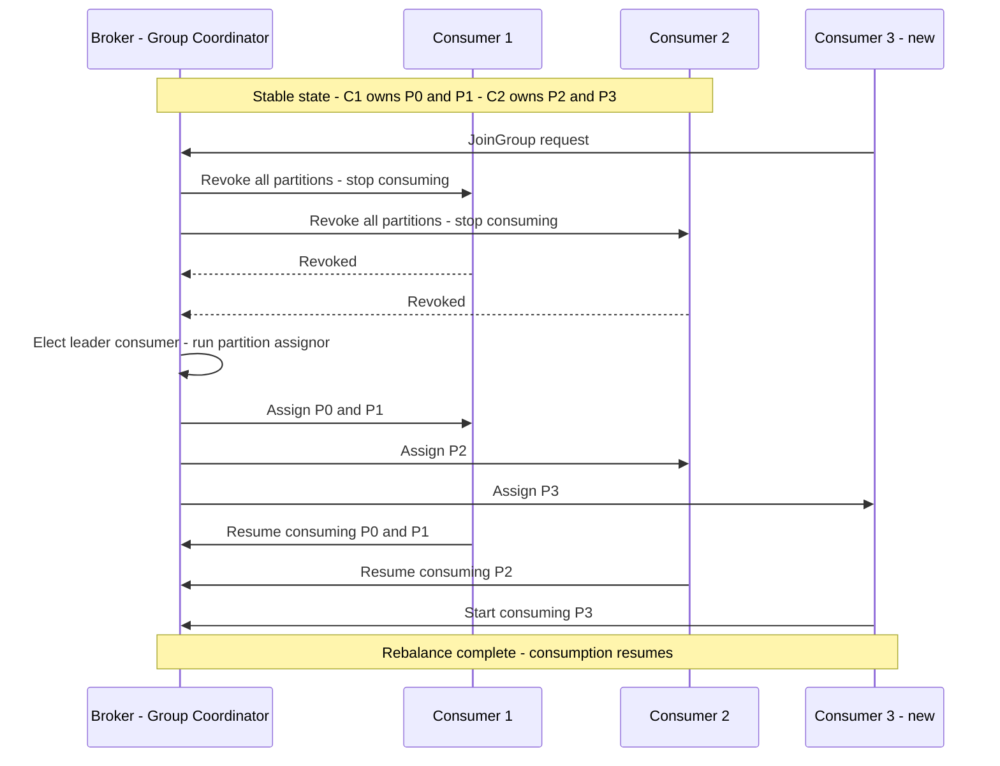

---

## 8. Ordering guarantees and partitioning

Event ordering is local to partitions or topics. When strict ordering matters:

- Partition by a stable key (user ID, account ID).
- Avoid cross-aggregate transactions.
- Use compensating actions when consistency windows are acceptable.

For many systems, eventual consistency plus strong monitoring is a pragmatic tradeoff.

Event sourcing rebuilds the current state of an entity by replaying its complete history of events rather than storing mutable rows:

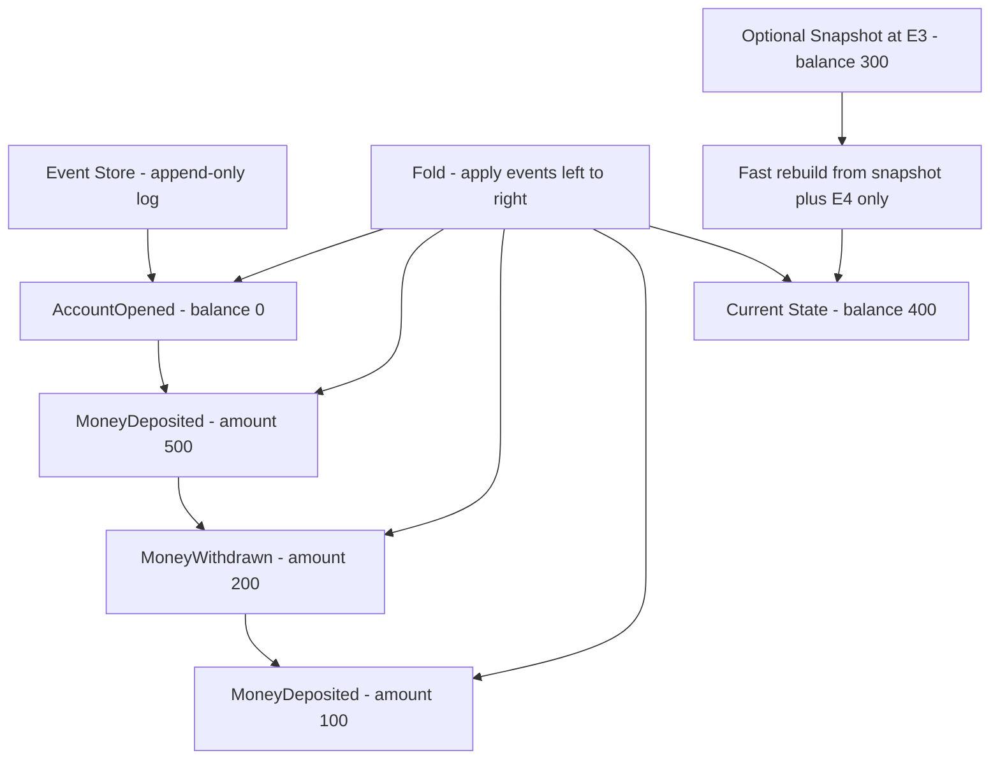

---

## 9. Backpressure and flow control

EDA pipelines can overwhelm consumers if left unchecked. Mitigate by:

- Applying broker-level retention and quota limits.
- Setting consumer concurrency caps.
- Using rate-limited retries and circuit breakers.

Backpressure must be treated as a first-class feature, not a last-minute fix.

---

## 10. Error handling and retries

The dead letter queue handling flow shows how a poison message travels from initial failure through retries to DLQ inspection:

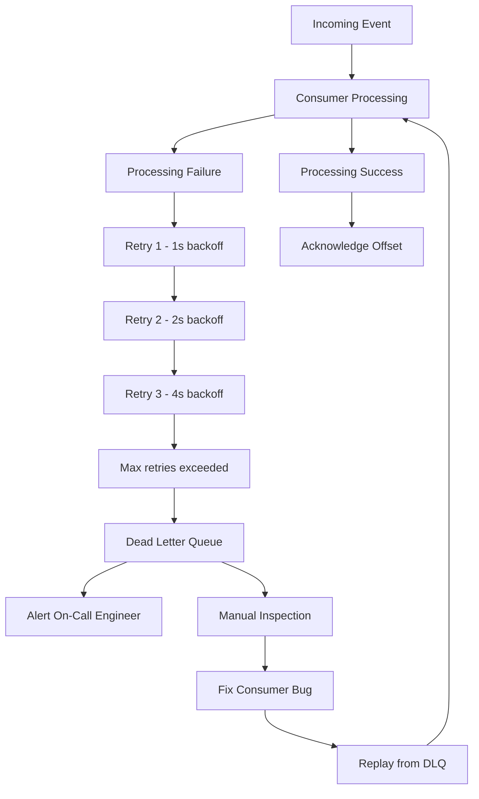

Define explicit failure paths:

- **Transient failures:** retry with exponential backoff and jitter.
- **Poison messages:** route to a dead-letter queue (DLQ).
- **Permanent errors:** store for manual inspection and replay.

Every consumer should report retry counts and DLQ volumes to centralized monitoring.

---

## 11. Observability and traceability

Asynchronous systems can fail quietly without strong observability. Prioritize:

- **Tracing:** Correlate events across services with trace IDs.
- **Metrics:** Lag, throughput, retry counts, DLQ size.
- **Replay tooling:** Reprocess events after fixes without data loss.

Observability must cover the entire event lifecycle, from production to consumption.

---

## 12. Testing and validation

EDA testing should mirror production realities:

- Contract tests for event schemas.
- Replay tests with real production samples.
- Chaos tests to validate retry and DLQ behavior.

Testing is the difference between theoretical reliability and real resilience.

This comparison helps choose between synchronous and event-driven communication based on the nature of the interaction:

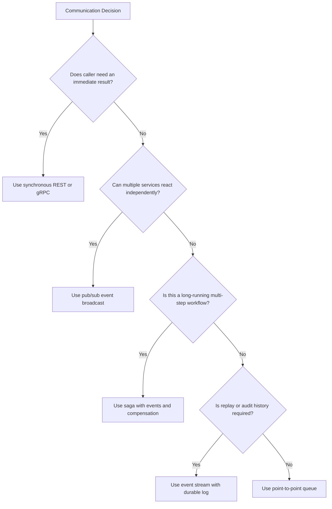

---

## 13. When EDA is the right fit

EDA works best when:

- Services need to scale independently.
- Multiple teams consume the same domain signals.
- You want replayability for analytics, ML training, or audits.
- Latency requirements tolerate asynchronous processing.

For tight request-response workflows, a synchronous API may still be simpler.

---

## 14. Implementation checklist

- Define event naming conventions and schemas early.
- Enforce idempotency in every consumer.
- Provide dashboards for lag, retry counts, and DLQ volume.
- Build runbooks for replaying and backfilling.
- Treat events as durable facts, not commands.

Event-driven architecture unlocks powerful decoupling and scalability, but it succeeds only when reliability and observability are first-class concerns.

---

## 15. Event sourcing implementation

Event sourcing replaces the mutable-row storage pattern with an append-only event log. The current state of any entity is derived by replaying its event history. This eliminates the "update overwrites history" problem and gives you a complete audit trail as a natural side effect.

### Core event store interface

```typescript
// event-store.ts: a typed event store for a bank account aggregate
interface DomainEvent {
  eventId: string;
  aggregateId: string;
  aggregateVersion: number;
  eventType: string;
  occurredAt: string;
  payload: unknown;
}

// All possible events for the account aggregate
type AccountEvent =
  | {
      eventType: "AccountOpened";
      payload: { initialBalance: number; currency: string };
    }
  | {
      eventType: "MoneyDeposited";
      payload: { amount: number; reference: string };
    }
  | {
      eventType: "MoneyWithdrawn";
      payload: { amount: number; reference: string };
    }
  | { eventType: "AccountFrozen"; payload: { reason: string } }
  | { eventType: "AccountClosed"; payload: { closedBy: string } };

// The current read model derived from events
interface AccountState {
  id: string;
  balance: number;
  currency: string;
  status: "active" | "frozen" | "closed";
  version: number;
}

// Reducer: folds events left-to-right into state
function applyAccountEvent(
  state: AccountState,
  event: DomainEvent & AccountEvent,
): AccountState {
  switch (event.eventType) {
    case "AccountOpened":
      return {
        ...state,
        balance: event.payload.initialBalance,
        currency: event.payload.currency,
        status: "active",
        version: event.aggregateVersion,
      };

    case "MoneyDeposited":
      return {
        ...state,
        balance: state.balance + event.payload.amount,
        version: event.aggregateVersion,
      };

    case "MoneyWithdrawn":
      if (state.balance < event.payload.amount) {
        throw new Error(
          "Insufficient funds - this event should not have been stored",
        );
      }
      return {
        ...state,
        balance: state.balance - event.payload.amount,
        version: event.aggregateVersion,
      };

    case "AccountFrozen":
      return { ...state, status: "frozen", version: event.aggregateVersion };

    case "AccountClosed":
      return { ...state, status: "closed", version: event.aggregateVersion };

    default:
      return state;
  }
}

// Rebuild current state by loading and replaying all events
async function loadAccount(
  accountId: string,
  eventStore: EventStore,
): Promise<AccountState> {
  const events = await eventStore.loadEvents(accountId);

  if (events.length === 0) {
    throw new Error(`Account ${accountId} does not exist`);
  }

  return events.reduce(
    (state, event) => applyAccountEvent(state, event as any),
    {
      id: accountId,
      balance: 0,
      currency: "USD",
      status: "active",
      version: 0,
    },
  );
}
```

### Snapshot pattern for long-lived aggregates

Replaying thousands of events on every load is expensive. Snapshots store a materialized state at a point in time so only the events after the snapshot need to be replayed.

```typescript
// snapshot-store.ts
interface Snapshot {
  aggregateId: string;
  version: number;
  state: AccountState;
  createdAt: string;
}

async function loadAccountWithSnapshot(
  accountId: string,
  eventStore: EventStore,
  snapshotStore: SnapshotStore,
): Promise<AccountState> {
  // Try to load the latest snapshot
  const snapshot = await snapshotStore.loadLatest(accountId);

  const fromVersion = snapshot?.version ?? 0;
  const initialState = snapshot?.state ?? {
    id: accountId,
    balance: 0,
    currency: "USD",
    status: "active",
    version: 0,
  };

  // Only load events after the snapshot version
  const events = await eventStore.loadEvents(accountId, { fromVersion });

  const currentState = events.reduce(
    (state, event) => applyAccountEvent(state, event as any),
    initialState,
  );

  // Store a new snapshot every 100 events to bound future replay cost
  if (events.length >= 100) {
    await snapshotStore.save({
      aggregateId: accountId,
      version: currentState.version,
      state: currentState,
      createdAt: new Date().toISOString(),
    });
  }

  return currentState;
}
```

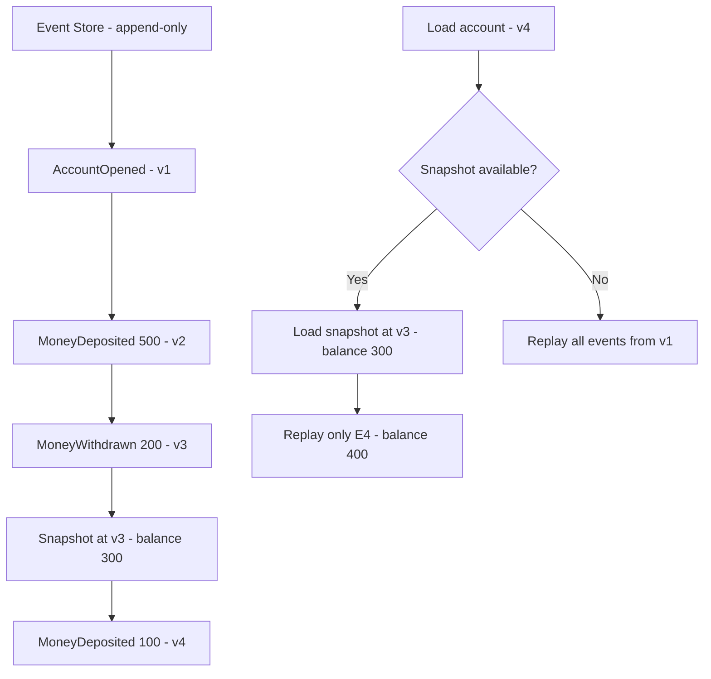

---

## 16. Change data capture with Debezium

Change Data Capture (CDC) captures row-level changes from a database's transaction log and publishes them as events. Debezium is the most widely deployed CDC tool, supporting PostgreSQL, MySQL, MongoDB, and others.

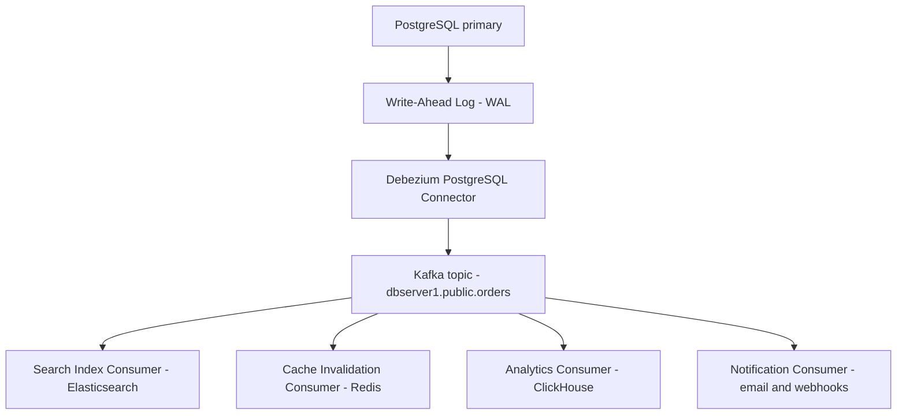

### Debezium connector configuration

```json
{
  "name": "orders-cdc-connector",
  "config": {
    "connector.class": "io.debezium.connector.postgresql.PostgresConnector",
    "plugin.name": "pgoutput",
    "database.hostname": "postgres-primary.internal",
    "database.port": "5432",
    "database.user": "debezium_user",
    "database.password": "${file:/etc/debezium-secrets/connector.properties:database.password}",
    "database.dbname": "orders_db",
    "database.server.name": "dbserver1",
    "table.include.list": "public.orders,public.line_items",
    "publication.autocreate.mode": "filtered",
    "decimal.handling.mode": "string",
    "heartbeat.interval.ms": "10000",
    "transforms": "route,unwrap",
    "transforms.route.type": "org.apache.kafka.connect.transforms.ReplaceField$Value",
    "transforms.unwrap.type": "io.debezium.transforms.ExtractNewRecordState",
    "transforms.unwrap.drop.tombstones": "false",
    "transforms.unwrap.delete.handling.mode": "rewrite"
  }
}
```

### Consuming CDC events

```typescript
// cdc-consumer.ts: process Debezium change events to invalidate a cache
interface DebeziumChangeEvent {
  op: "c" | "u" | "d" | "r"; // create, update, delete, read (snapshot)
  before: Record<string, unknown> | null;
  after: Record<string, unknown> | null;
  source: {
    table: string;
    ts_ms: number;
    txId: number;
    lsn: number;
  };
}

async function handleOrderChange(event: DebeziumChangeEvent): Promise<void> {
  const { op, after, before, source } = event;

  switch (op) {
    case "c": {
      // New order created - warm cache
      const orderId = after?.id as string;
      await cache.set(`order:${orderId}`, JSON.stringify(after), { ttl: 300 });
      await searchIndex.index("orders", orderId, after);
      break;
    }

    case "u": {
      // Order updated - invalidate cache, re-index
      const orderId = after?.id as string;
      await cache.delete(`order:${orderId}`);
      await searchIndex.update("orders", orderId, after);
      break;
    }

    case "d": {
      // Order deleted - remove from all downstream stores
      const orderId = before?.id as string;
      await cache.delete(`order:${orderId}`);
      await searchIndex.delete("orders", orderId);
      break;
    }
  }

  // Emit metrics for CDC lag monitoring
  const lagMs = Date.now() - source.ts_ms;
  metrics.histogram("cdc.lag.ms", lagMs, { table: source.table });
}
```

---

## 17. Schema registry setup

A schema registry enforces that producers and consumers agree on event structure. Without it, a producer silently breaking a field name or removing a required property can corrupt downstream consumers. Confluent Schema Registry with Avro is the most common setup, but JSON Schema registries work equally well for HTTP-native organizations.

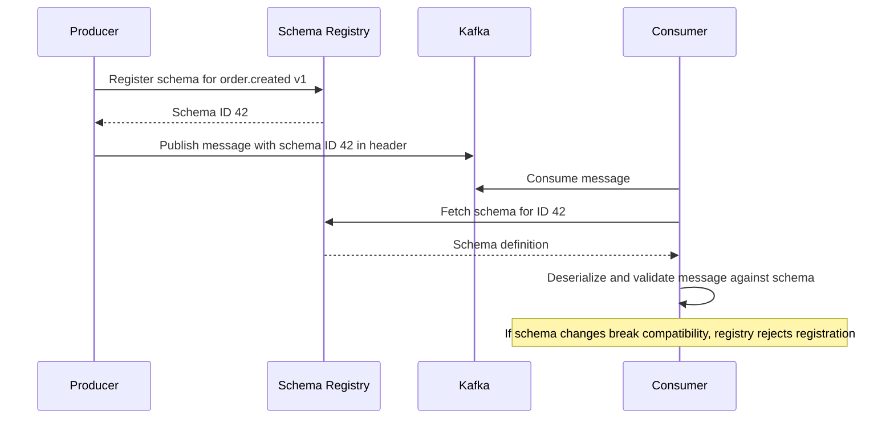

### Avro schema definition

```json
{
  "type": "record",
  "name": "OrderCreated",
  "namespace": "com.example.orders.events",
  "doc": "Emitted when a new order is placed. Schema v2.",
  "fields": [
    { "name": "order_id", "type": "string", "doc": "UUID of the new order" },
    { "name": "account_id", "type": "string" },
    {
      "name": "line_items",
      "type": {
        "type": "array",
        "items": {
          "type": "record",
          "name": "LineItem",
          "fields": [
            { "name": "product_id", "type": "string" },
            { "name": "quantity", "type": "int" },
            { "name": "unit_price_cents", "type": "long" }
          ]
        }
      }
    },
    { "name": "total_cents", "type": "long" },
    { "name": "currency", "type": "string", "default": "USD" },
    { "name": "created_at", "type": "long", "logicalType": "timestamp-millis" },
    {
      "name": "metadata",
      "type": { "type": "map", "values": "string" },
      "default": {},
      "doc": "Optional extensible metadata - added in v2, backward compatible"
    }
  ]
}
```

### Schema compatibility modes

| Mode     | Description                      | When to use                            |
| -------- | -------------------------------- | -------------------------------------- |
| BACKWARD | New schema can read old messages | Default - safe for most changes        |
| FORWARD  | Old schema can read new messages | When consumers deploy before producers |
| FULL     | Both backward and forward        | Strictest; requires most discipline    |
| NONE     | No compatibility checks          | Development only; never production     |

---

## 18. Testing event-driven systems

Event-driven systems require a testing strategy that addresses both the producer contract (what events are emitted) and the consumer contract (what events are handled correctly).

### Contract testing with Pact

```typescript
// order-producer.pact.test.ts: verify the order service emits correct events
import {
  MessageProviderPact,
  synchronousBodyHandler,
} from "@pact-foundation/pact";
import { createOrderCreatedEvent } from "../src/order-service";

describe("Order service - Pact contract", () => {
  const provider = new MessageProviderPact({
    messageProviders: {
      "an order.created event": () =>
        createOrderCreatedEvent({
          orderId: "order-123",
          accountId: "account-456",
          lineItems: [
            { productId: "prod-1", quantity: 2, unitPriceCents: 1999 },
          ],
        }),
    },
    provider: "OrderService",
    pactBrokerUrl: process.env.PACT_BROKER_URL!,
    publishVerificationResult: true,
    providerVersion: process.env.GIT_SHA!,
  });

  it("verifies message contracts", () => provider.verify());
});
```

### Integration testing with embedded Kafka

```typescript
// kafka-integration.test.ts: test a full producer → consumer flow
import { Kafka } from "kafkajs";
import { GenericContainer } from "testcontainers";

describe("Order processing pipeline", () => {
  let kafka: Kafka;
  let container: StartedTestContainer;

  beforeAll(async () => {
    // Start a real Kafka broker in a Docker container
    container = await new GenericContainer("confluentinc/cp-kafka:7.5.0")
      .withExposedPorts(9092)
      .withEnvironment({
        KAFKA_BROKER_ID: "1",
        KAFKA_ZOOKEEPER_CONNECT: "zookeeper:2181",
        KAFKA_ADVERTISED_LISTENERS: "PLAINTEXT://localhost:9092",
        KAFKA_AUTO_CREATE_TOPICS_ENABLE: "true",
      })
      .start();

    kafka = new Kafka({
      clientId: "test",
      brokers: [`localhost:${container.getMappedPort(9092)}`],
    });
  }, 60_000);

  afterAll(() => container.stop());

  it("consumer processes order.created events correctly", async () => {
    const admin = kafka.admin();
    await admin.createTopics({ topics: [{ topic: "orders" }] });

    // Publish a test event
    const producer = kafka.producer();
    await producer.connect();
    await producer.send({
      topic: "orders",
      messages: [
        {
          key: "order-123",
          value: JSON.stringify({
            eventType: "order.created",
            orderId: "order-123",
            total: 3998,
          }),
        },
      ],
    });
    await producer.disconnect();

    // Verify the consumer processes it
    const received: unknown[] = [];
    const consumer = kafka.consumer({ groupId: "test-group" });
    await consumer.connect();
    await consumer.subscribe({ topic: "orders" });
    await consumer.run({
      eachMessage: async ({ message }) => {
        received.push(JSON.parse(message.value!.toString()));
      },
    });

    // Wait for consumption
    await new Promise((r) => setTimeout(r, 2000));
    await consumer.disconnect();

    expect(received).toHaveLength(1);
    expect(received[0]).toMatchObject({
      eventType: "order.created",
      orderId: "order-123",
    });
  }, 30_000);
});
```

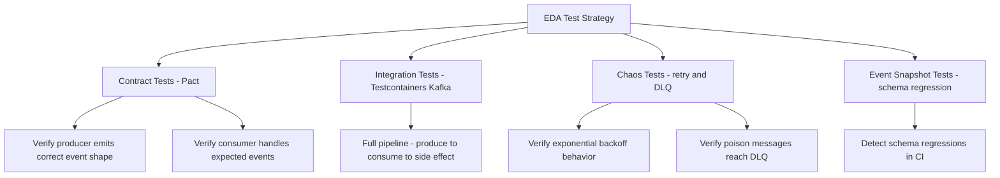

---

## 19. Conclusion

Event-driven architecture rewards teams that invest in the operational discipline it requires. The decoupling it provides is real: services can scale independently, deploy independently, and fail without cascading. But this decoupling moves the coordination problem from synchronous call stacks into asynchronous event flows that are harder to observe and reason about without the right tooling.

The patterns covered in this guide - the outbox pattern for reliable emission, schema registries for contract enforcement, CDC for database-to-event integration, event sourcing for audit-friendly aggregates, and contract and integration testing with embedded brokers - are the production building blocks that separate robust EDA implementations from fragile ones. Start with the outbox pattern and schema validation. Add CDC when you need to project database changes into event streams. Adopt event sourcing selectively for aggregates where the full history is a product requirement.
