import MdxLayout from "@/components/MdxLayout";

export const metadata = {
  title: "Explainable AI: Making Machine Learning Transparent",
  description:
    "A comprehensive exploration of Explainable AI (XAI), covering its technical foundations, importance in modern machine learning, and real-world applications.",
  topics: [
    "Artificial Intelligence",
    "Machine Learning",
    "Tech Innovations",
    "Ethics in AI",
  ],
};

export default function ExplainableAIArticle({ children }) {
  return <MdxLayout>{children}</MdxLayout>;
}

# Explainable AI: Making Machine Learning Transparent

### Author: Son Nguyen

> Date: 2024-11-09

In the age of big data and deep learning, machine learning models have become indispensable tools across industries - from healthcare and finance to autonomous systems and beyond. However, the impressive accuracy of many high-performing models often comes at the cost of transparency. Many of these models, particularly complex ones like deep neural networks, function as “black boxes” whose internal workings are difficult to interpret. **Explainable AI (XAI)** aims to shed light on these opaque systems, ensuring that their decisions can be understood, trusted, and appropriately scrutinized.

---

## 1. Introduction

Explainable AI encompasses a set of techniques and methodologies designed to make machine learning models and their predictions more transparent. In an era where AI systems are increasingly involved in critical decision-making, transparency is not just a technical nicety - it’s an ethical and regulatory imperative.

In this article, we will cover:

- **The importance of interpretability**: Understanding the value of transparency for trust, accountability, and ethical decision-making.
- **Technical foundations**: An in-depth look at the methodologies, including both model-agnostic and model-specific approaches.
- **Challenges and limitations**: A discussion of the inherent trade-offs between model performance and interpretability, and the hurdles that remain.
- **Future directions**: Emerging trends, research, and hybrid approaches that may bridge the gap between high performance and complete transparency.

---

## 2. The Importance of Explainability

### 2.1 Enhancing Trust and Adoption

**Transparency** is crucial for establishing confidence in AI systems. When stakeholders - ranging from end users to regulators - understand how a model reaches its conclusions, they are more likely to trust its outcomes. This trust is especially important in sectors where decisions have significant consequences, such as:

- **Healthcare:** Clinicians need to understand AI-driven diagnoses to complement their own assessments.
- **Finance:** Investors and auditors require clarity on risk assessments and credit decisions.
- **Autonomous Systems:** In safety-critical applications like self-driving cars, explainability can help diagnose and prevent failures.

### 2.2 Accountability and Regulatory Compliance

Regulatory frameworks, such as the European Union’s GDPR, now emphasize the “right to explanation” for automated decisions. This means that organizations must be able to provide clear justifications for their AI-driven decisions, ensuring accountability. Explainable AI thus becomes a key component in:

- **Auditing Models:** Providing a transparent record of how decisions are made.
- **Mitigating Bias:** Identifying and correcting for potential biases in the data or model architecture.
- **Fulfilling Legal Obligations:** Meeting compliance requirements in regulated industries.

### 2.3 Ethical Considerations and User Empowerment

Explainable AI empowers users by demystifying the decision-making process of complex models. By revealing which factors most significantly impact outcomes, users can challenge or verify decisions that affect their lives - whether it’s a loan application, a medical diagnosis, or an autonomous system's action.

---

## 3. Technical Foundations of Explainable AI

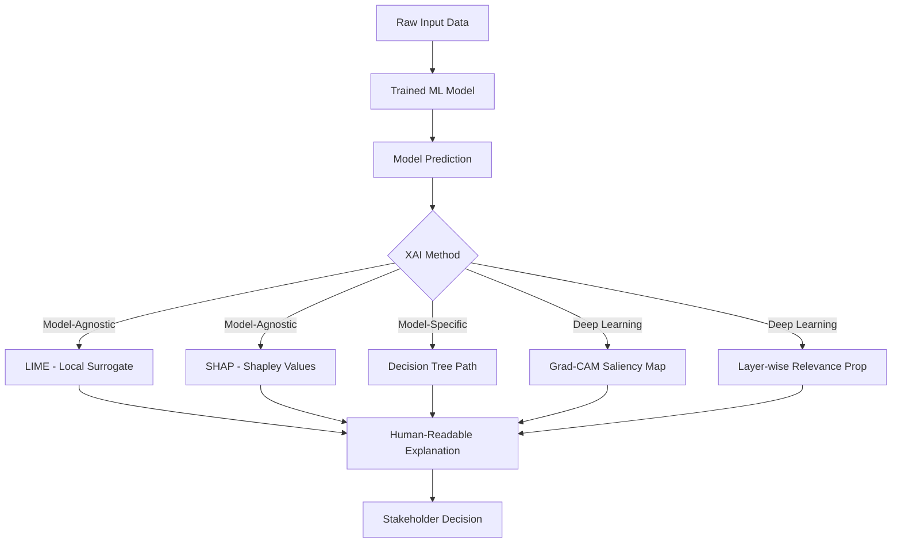

The technical strategies for achieving model interpretability fall into two broad categories: model-agnostic and model-specific approaches. Each has its own strengths, limitations, and ideal use cases.

### 3.1 Model-Agnostic Approaches

These techniques treat the machine learning model as a black box and work by approximating or analyzing its behavior without requiring access to its inner workings.

#### LIME (Local Interpretable Model-Agnostic Explanations)

**Concept:**
LIME creates a local surrogate model - a simpler, interpretable model (like linear regression) - that approximates the behavior of the black-box model in the vicinity of a specific prediction.

**Process:**

1. **Perturbation:** The original data point is slightly perturbed to generate a new set of samples.
2. **Prediction:** The black-box model makes predictions on these new samples.
3. **Surrogate Fitting:** An interpretable model is fitted to these perturbed samples to understand which features drive the prediction.

```python
import numpy as np
import lime
import lime.lime_tabular
from sklearn.datasets import load_iris
from sklearn.ensemble import RandomForestClassifier

# Load sample data
data = load_iris()
X = data.data
y = data.target

# Train a Random Forest model
model = RandomForestClassifier(n_estimators=100)
model.fit(X, y)

# Create a LIME explainer instance
explainer = lime.lime_tabular.LimeTabularExplainer(
    X,
    feature_names=data.feature_names,
    class_names=data.target_names,
    discretize_continuous=True
)

# Explain a single prediction
exp = explainer.explain_instance(X[1], model.predict_proba, num_features=4)
exp.show_in_notebook(show_table=True, show_all=False)
```

#### SHAP (SHapley Additive exPlanations)

**Concept:**
SHAP leverages Shapley values from cooperative game theory to assign each feature an importance score for a given prediction. It considers all possible combinations of features, providing a fair and consistent measure of each feature’s contribution.

**Process:**

- **Shapley Value Computation:** For every feature, SHAP calculates the contribution by considering the difference in model output with and without that feature, averaged over all possible feature combinations.
- **Visualization:** SHAP values can be visualized using various plots (waterfall, beeswarm, etc.) to provide a clear picture of how each feature affects the prediction.

```python
import shap
import xgboost
from sklearn.model_selection import train_test_split

# Load data and train a model
X, y = shap.datasets.boston()
model = xgboost.XGBRegressor().fit(X, y)

# Explain the model's predictions using SHAP
explainer = shap.Explainer(model)
shap_values = explainer(X)

# Visualize the explanation for the first prediction
shap.plots.waterfall(shap_values[0])
```

### 3.2 Model-Specific Approaches

For models that are inherently interpretable, the explanation is often embedded in the model structure itself.

- **Decision Trees:**
  The tree structure clearly shows the path taken from the root to a leaf, making it easy to trace how a decision was reached. Each split is based on a feature threshold, providing immediate insight into the model's logic.

- **Linear Models:**
  In models like linear or logistic regression, the weights (coefficients) assigned to each feature provide a direct measure of its influence. This direct relationship allows for straightforward interpretation of the model’s behavior.

### 3.3 Advanced Techniques and Hybrid Models

Researchers are exploring more advanced techniques to bridge the gap between accuracy and interpretability:

- **Layer-wise Relevance Propagation (LRP):**
  This technique distributes the prediction value backward through the network layers, attributing relevance scores to each input feature. It’s particularly useful in deep neural networks where traditional interpretability methods fall short.

- **Saliency Maps and Grad-CAM:**
  Commonly used in computer vision, these techniques highlight areas of an input image that have the highest influence on the prediction. They offer intuitive visual explanations for model decisions in image recognition tasks.

- **Hybrid Models:**
  These models combine the strengths of both interpretable and high-performance systems. For example, a deep neural network might be paired with a simpler surrogate model that explains its decisions, offering a balance between raw performance and interpretability.

---

## 4. Challenges and Limitations of Explainable AI

While XAI holds great promise, several challenges remain that complicate its widespread adoption:

### 4.1 Trade-Off Between Accuracy and Interpretability

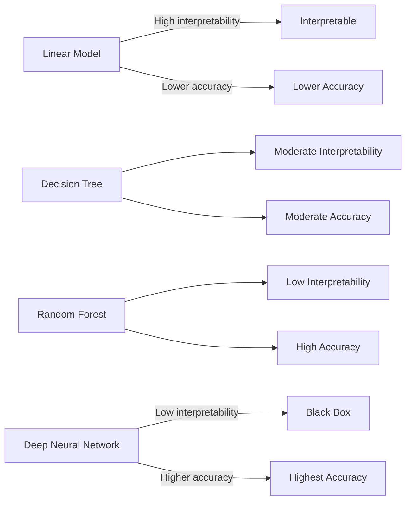

- **Complexity vs. Transparency:**
  High-performing models, such as deep neural networks, often achieve their success through layers of abstraction that hinder straightforward interpretation. Simplifying these models to make them interpretable can sometimes compromise their accuracy.

### 4.2 Scalability and Computational Costs

- **Resource Intensive:**
  Methods like SHAP, which require evaluating multiple combinations of features, can be computationally expensive - especially for models with a large number of features or when deployed in real-time systems.

### 4.3 Human-Centric Design

- **Interpretability vs. Comprehensibility:**
  It’s not enough for a model to be explainable - the explanation must be understandable to a non-technical audience. Crafting explanations that are both technically accurate and intuitively clear is a significant design challenge.

### 4.4 Evolving Models and Dynamic Data

- **Continuous Learning:**
  In environments where models are updated regularly with new data, maintaining consistent and up-to-date explanations can be challenging. Dynamic models require adaptive XAI techniques that can evolve alongside them.

---

## 5. Real-World Applications and Case Studies

### 5.1 Healthcare: Diagnostics and Treatment Recommendations

In medical applications, explainability is critical for ensuring that AI-driven diagnoses and treatment recommendations are safe and effective. For instance, saliency maps in radiology can pinpoint the exact regions in an X-ray or MRI that led to a particular diagnosis, allowing clinicians to validate the AI’s findings.

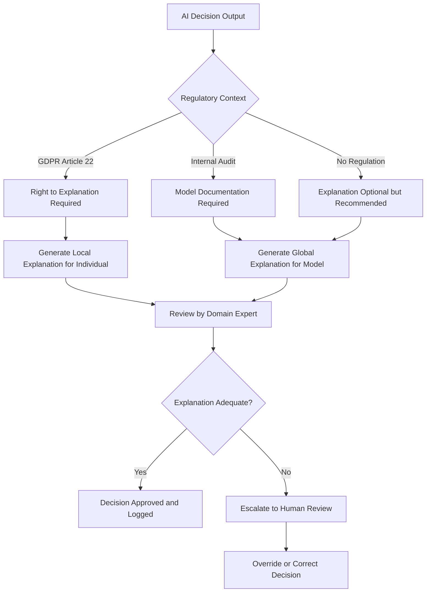

### 5.2 Finance: Credit Scoring and Risk Management

Financial institutions employ AI for credit scoring, fraud detection, and risk management. Transparent models help auditors understand why certain applications are approved or denied, ensuring that lending practices are fair and compliant with regulatory standards. Techniques such as SHAP are used to highlight risk factors, contributing to more equitable decision-making.

### 5.3 Autonomous Systems: Safety and Reliability

For self-driving cars and other autonomous systems, safety is paramount. Explainable AI can help engineers identify failure modes by revealing which sensor inputs or environmental conditions lead to erroneous decisions. This insight is invaluable for debugging and refining these systems to ensure safer operation.

---

## 6. Future Directions in Explainable AI

The field of Explainable AI is rapidly evolving, and several promising research directions may help overcome current limitations:

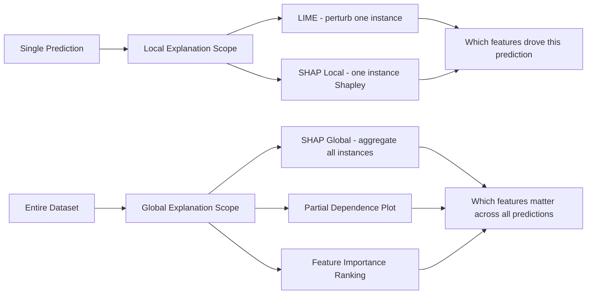

### 6.1 Interactive and Adaptive Explanations

- **User Feedback Integration:**
  Future systems could allow end users to interact with explanations - adjusting parameters or exploring alternative scenarios - to gain deeper insights and provide feedback that refines the model.

- **Tailored Explanations:**
  Explanations might be dynamically tailored to the user’s level of expertise, ensuring that both technical and non-technical stakeholders can understand the model’s reasoning.

### 6.2 Integration with Augmented Analytics

- **Enhanced Visualization:**
  Combining XAI techniques with advanced data visualization tools can create richer, more intuitive dashboards that help stakeholders explore and understand AI decisions in real time.

- **Contextual Insights:**
  Future systems may integrate contextual data (e.g., historical trends or external factors) to provide a more holistic explanation of model behavior.

### 6.3 Standardization and Regulatory Frameworks

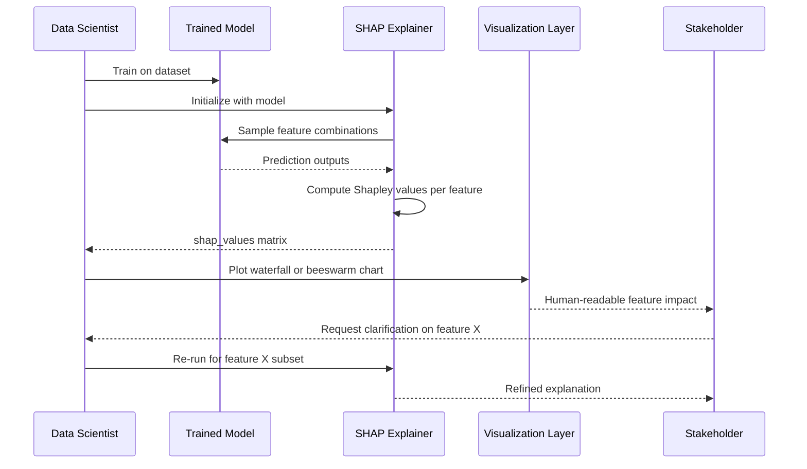

- **Benchmarking Interpretability:**
  Establishing standardized metrics and benchmarks for explainability will be essential for comparing different XAI methods and ensuring they meet regulatory requirements.

- **Ethical AI Guidelines:**
  As governments and organizations develop more comprehensive ethical AI frameworks, explainability will be a key component in achieving transparency and accountability.

### 6.4 Hybrid Models and Novel Architectures

- **Balancing Performance and Interpretability:**
  Research into hybrid architectures - where a high-performing model is coupled with a transparent surrogate - could yield systems that do not sacrifice accuracy for interpretability.

- **Self-Explaining Neural Networks:**
  Emerging techniques aim to embed explainability directly into the architecture of deep learning models, making them inherently more transparent without additional post-hoc methods.

---

## 7. LIME Perturbation Workflow

LIME explains a single prediction by building a local surrogate model around a perturbed neighborhood:

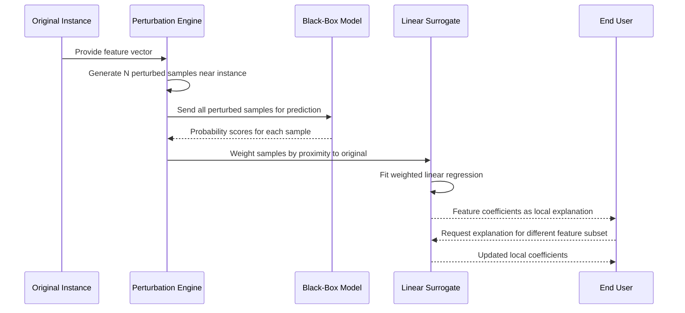

---

## 8. Bias Detection and Fairness Audit Pipeline

Integrating fairness checks into the model lifecycle ensures XAI also surfaces discriminatory patterns:

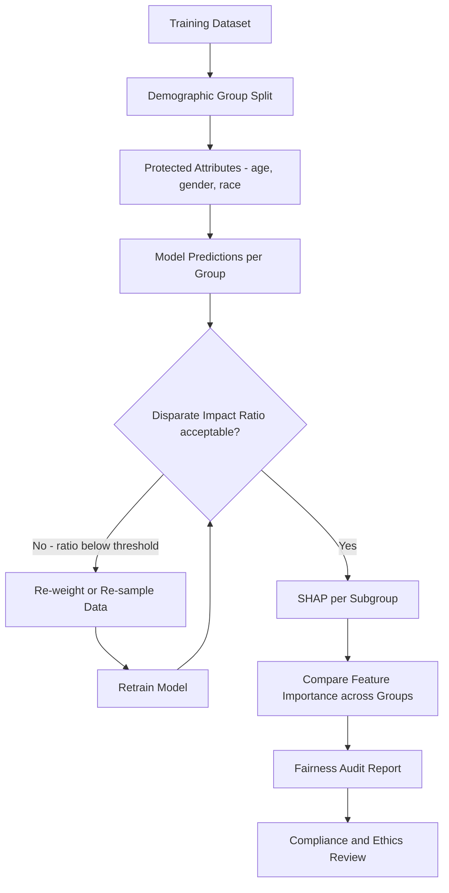

---

## 9. XAI Method Selection Decision Tree

Choosing the right XAI technique depends on the model type, task, and audience:

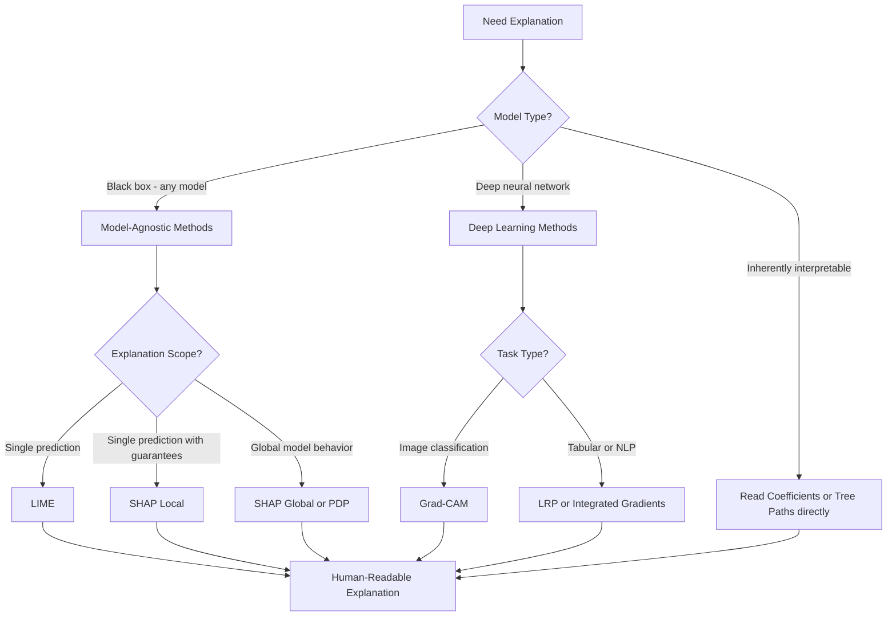

---

## 10. XAI Integration in a Production ML Pipeline

Explainability is not just a debugging tool - it can be embedded into every stage of model deployment:

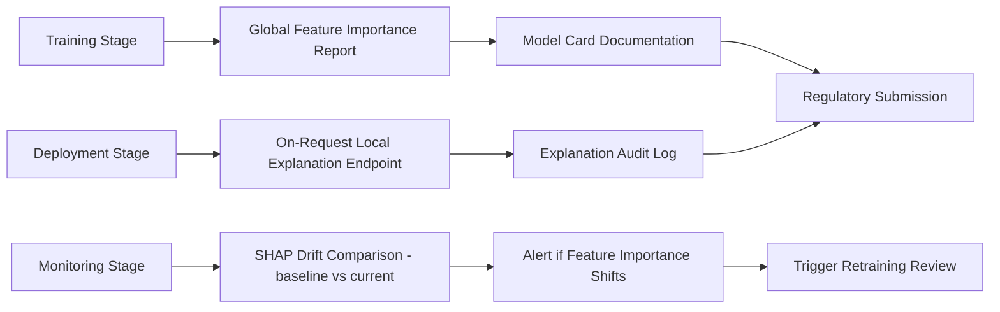

---

## 11. Counterfactual Explanations

Counterfactual explanations answer the question: “What is the minimal change to the input that would flip the model's decision?” This is arguably the most intuitive explanation format for end users — especially in high-stakes decisions like loan rejections.

### 11.1. Why Counterfactuals Matter

Instead of saying “your application was denied because your debt-to-income ratio is 0.42 (SHAP contribution: -0.31)”, a counterfactual says: “Your application would have been approved if your debt-to-income ratio were 0.28 or below, or if your employment tenure were 24 months instead of 14.”

The second form is actionable: the user knows exactly what to change.

### 11.2. Generating Counterfactuals with DiCE

```python
import dice_ml
import pandas as pd
from sklearn.ensemble import GradientBoostingClassifier
from sklearn.pipeline import Pipeline
from sklearn.preprocessing import StandardScaler

# Train a classifier (loan approval example)
train_df = pd.read_csv('loan_data.csv')
target   = 'approved'

X = train_df.drop(columns=[target])
y = train_df[target]

model = Pipeline([
    ('scaler', StandardScaler()),
    ('clf',    GradientBoostingClassifier(n_estimators=200, random_state=42)),
])
model.fit(X, y)

# Wrap dataset and model for DiCE
d = dice_ml.Data(
    dataframe=train_df,
    continuous_features=['income', 'debt_to_income', 'employment_months'],
    outcome_name=target,
)
m = dice_ml.Model(model=model, backend='sklearn')
exp = dice_ml.Dice(d, m, method='random')

# Generate counterfactuals for a denied applicant
denied_instance = pd.DataFrame([{
    'income': 45000,
    'debt_to_income': 0.42,
    'employment_months': 14,
    'credit_score': 620,
}])

cf = exp.generate_counterfactuals(
    denied_instance,
    total_CFs=3,
    desired_class='opposite',
    features_to_vary=['debt_to_income', 'employment_months'],
)
cf.visualize_as_dataframe()
```

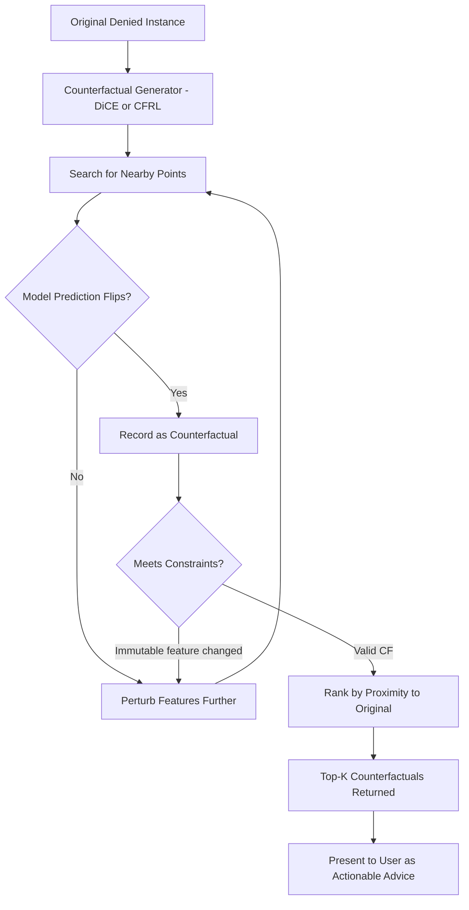

---

## 12. Attention Visualization for Transformers

Transformer-based models (BERT, GPT, T5) use attention weights that can serve as a rough proxy for which tokens influenced a prediction — though researchers caution that attention is not always equal to explanation.

### 12.1. Extracting and Plotting Attention

```python
from transformers import AutoTokenizer, AutoModelForSequenceClassification
import torch
import matplotlib.pyplot as plt
import numpy as np

model_name = 'distilbert-base-uncased-finetuned-sst-2-english'
tokenizer  = AutoTokenizer.from_pretrained(model_name)
model      = AutoModelForSequenceClassification.from_pretrained(
    model_name,
    output_attentions=True,
)
model.eval()

text  = “The model's explanation was surprisingly helpful and clear.”
inputs = tokenizer(text, return_tensors='pt')

with torch.no_grad():
    outputs = model(**inputs)

# outputs.attentions: tuple of (batch, heads, seq, seq) per layer
last_layer_attn = outputs.attentions[-1]          # last transformer block
avg_over_heads  = last_layer_attn[0].mean(dim=0)  # average attention heads

tokens = tokenizer.convert_ids_to_tokens(inputs['input_ids'][0])
attn_to_cls = avg_over_heads[0].numpy()           # attention from [CLS] to each token

# Plot as a bar chart
plt.figure(figsize=(12, 4))
plt.bar(tokens, attn_to_cls)
plt.title('Attention from [CLS] token (last layer, averaged heads)')
plt.xticks(rotation=45, ha='right')
plt.tight_layout()
plt.savefig('attention_weights.png', dpi=150)
```

### 12.2. Integrated Gradients: A More Reliable Alternative

```python
from captum.attr import IntegratedGradients

ig = IntegratedGradients(model)

# Baseline: all padding tokens (zero embedding signal)
baseline_ids = torch.zeros_like(inputs['input_ids'])

attributions, delta = ig.attribute(
    inputs['input_ids'].float(),
    baselines=baseline_ids.float(),
    target=outputs.logits.argmax().item(),
    return_convergence_delta=True,
    n_steps=50,
)
# attributions shape: (1, seq_len, embed_dim) -> sum over embedding dim
token_attributions = attributions.sum(dim=-1).squeeze(0).detach().numpy()
```

---

## 13. XAI in Regulated Industries: Practical Code Pattern

Financial and healthcare organizations face specific audit requirements. Here is a reusable explanation logging pattern that captures both the prediction and its local SHAP explanation for every high-stakes inference call.

```python
import shap
import numpy as np
import json
import datetime
from dataclasses import dataclass, asdict
from typing import Any

@dataclass
class ExplanationRecord:
    timestamp:       str
    model_version:   str
    input_hash:      str
    prediction:      Any
    confidence:      float
    top_features:    list[dict]  # [{“feature”: “...”, “shap_value”: ...}]
    decision_reason: str

class AuditablePredictor:
    def __init__(self, model, feature_names: list[str], model_version: str):
        self.model        = model
        self.names        = feature_names
        self.version      = model_version
        self.explainer    = shap.TreeExplainer(model)

    def predict_and_explain(
        self,
        X: np.ndarray,
        top_n: int = 5,
    ) -> tuple[Any, ExplanationRecord]:
        proba      = self.model.predict_proba(X)[0]
        pred_class = proba.argmax()
        confidence = float(proba[pred_class])

        shap_values = self.explainer.shap_values(X)
        # For binary classification take the positive class SHAP values
        sv = shap_values[1][0] if isinstance(shap_values, list) else shap_values[0]

        top_idx  = np.argsort(np.abs(sv))[::-1][:top_n]
        features = [
            {“feature”: self.names[i], “shap_value”: round(float(sv[i]), 4)}
            for i in top_idx
        ]

        record = ExplanationRecord(
            timestamp=datetime.datetime.utcnow().isoformat(),
            model_version=self.version,
            input_hash=str(hash(X.tobytes())),
            prediction=int(pred_class),
            confidence=round(confidence, 4),
            top_features=features,
            decision_reason=self._generate_reason(features),
        )
        return pred_class, record

    def _generate_reason(self, features: list[dict]) -> str:
        pos = [f for f in features if f['shap_value'] > 0]
        neg = [f for f in features if f['shap_value'] < 0]
        parts = []
        if pos:
            parts.append(“Factors supporting approval: “ +
                         “, “.join(f['feature'] for f in pos[:3]))
        if neg:
            parts.append(“Factors against approval: “ +
                         “, “.join(f['feature'] for f in neg[:3]))
        return “. “.join(parts)
```

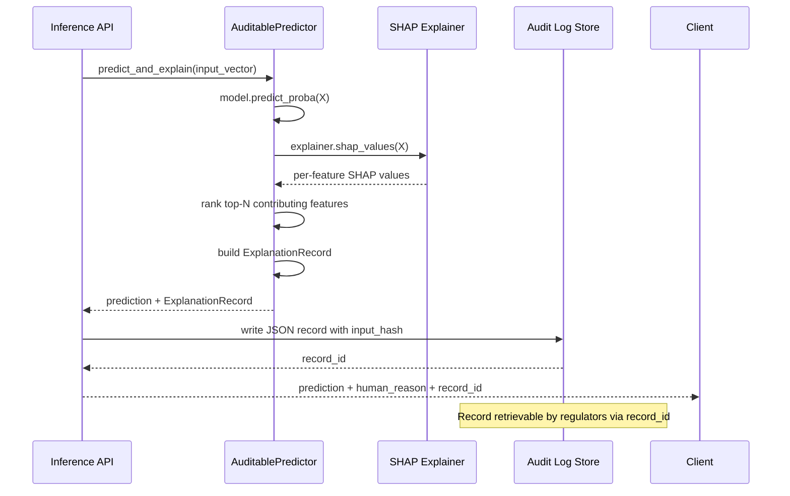

---

## 14. Conclusion

Explainable AI represents a fundamental shift in how we develop, deploy, and trust machine learning systems. By opening the “black box” and revealing the inner workings of complex models, XAI not only fosters trust and accountability but also enables continuous improvement and ethical decision-making. As AI systems become increasingly pervasive in our daily lives, the need for transparent, understandable, and accountable models will only grow.

In this article, we have explored the multifaceted nature of XAI - from its theoretical underpinnings and technical methodologies to its real-world applications and future directions. Whether you are a researcher, developer, or policymaker, embracing explainability is crucial for harnessing the full potential of AI in a responsible and ethical manner.

By continuing to innovate and refine XAI techniques, we move closer to a future where AI systems are not only powerful but also open, fair, and truly understandable.

---

## 15. Further Reading

- Doshi-Velez, F., & Kim, B. (2017). _Towards A Rigorous Science of Interpretable Machine Learning_. arXiv preprint arXiv:1702.08608.
- Rudin, C. (2019). _Stop Explaining Black Box Machine Learning Models for High Stakes Decisions and Use Interpretable Models Instead_. Nature Machine Intelligence.
- Molnar, C. (2020). _Interpretable Machine Learning: A Guide for Making Black Box Models Explainable_.
- Samek, W., Montavon, G., Lapuschkin, S., Anders, C. J., & Müller, K. R. (2019). _Explainable AI: Interpreting, Explaining and Visualizing Deep Learning_. Springer.

---
