import MdxLayout from "@/components/MdxLayout";

export const metadata = {
  title: "Building RESTful APIs with Express.js",
  description:
    "An in-depth guide to creating robust RESTful APIs using Express.js, covering routing, middleware, error handling, and best practices.",
  topics: [
    "Web Development",
    "API Design",
    "Backend Development",
    "Web Frameworks",
    "Web Architecture",
  ],
};

export default function APIContent({ children }) {
  return <MdxLayout>{children}</MdxLayout>;
}

# Building RESTful APIs with Express.js

### Author: Son Nguyen

> Date: 2023-12-22

In modern web development, **RESTful APIs** are the backbone of communication between the client and server. One of the most popular frameworks for building these APIs is [Express.js](https://expressjs.com/), a minimal and flexible Node.js web application framework. In this article, we’ll dive deep into creating a RESTful API using Express.js, exploring its key components such as routing, middleware, error handling, and security best practices.

## 1. What is a RESTful API?

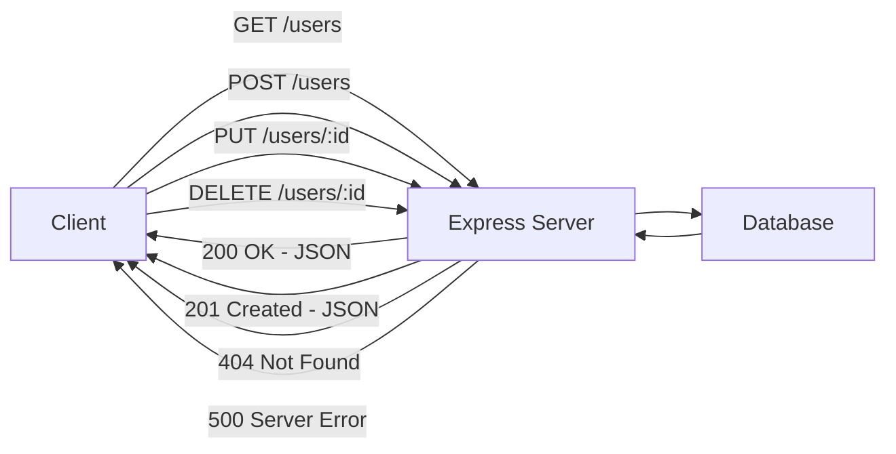

A RESTful API (Representational State Transfer) is an architectural style for designing networked applications. It uses standard HTTP methods like `GET`, `POST`, `PUT`, and `DELETE` to interact with resources, and it leverages the stateless nature of HTTP for scalability and simplicity.

### Core Principles of REST:

- **Stateless Communication:** Each request from client to server must contain all the information needed to understand and process the request.
- **Uniform Interface:** A standardized way to interact with resources using HTTP verbs.
- **Resource-Based:** Everything is treated as a resource (e.g., users, posts, products).
- **Client-Server Architecture:** Separates the user interface concerns from the data storage concerns.

---

## 2. Why Express.js?

Express.js is renowned for its simplicity and minimalism, making it a go-to choice for developers looking to create APIs quickly. Its robust set of features includes:

- **Routing:** Easy definition of routes to handle various HTTP methods.
- **Middleware Support:** A powerful mechanism to handle request processing, logging, authentication, etc.
- **Extensibility:** Integrates seamlessly with databases, templating engines, and other third-party libraries.

---

## 3. Setting Up Your Express.js Project

Before diving into the code, ensure you have [Node.js](https://nodejs.org/) installed on your machine. Then, initialize your project and install Express.js:

```bash
# Initialize a new Node.js project
npm init -y

# Install Express.js
npm install express
```

---

## 4. Creating a Basic Express Server

Let's start by creating a simple server. Create a file named `server.js` and add the following code:

```javascript
const express = require("express");
const app = express();
const port = 3000;

// Middleware to parse JSON bodies
app.use(express.json());

// Basic route
app.get("/", (req, res) => {
  res.send("Welcome to our RESTful API built with Express.js!");
});

app.listen(port, () => {
  console.log(`Server is running on http://localhost:${port}`);
});
```

This basic setup initializes an Express application, sets up a JSON parser middleware, defines a simple route, and starts the server.

---

## 5. Defining API Routes

A RESTful API revolves around various endpoints. Let's create a set of routes to manage a resource - say, **users**.

### Creating a Users Router

Create a new folder called `routes` and inside it, create a file named `users.js`:

```javascript
const express = require("express");
const router = express.Router();

// Sample in-memory user data
let users = [
  { id: 1, name: "Alice", email: "alice@example.com" },
  { id: 2, name: "Bob", email: "bob@example.com" },
];

// GET /users - Retrieve all users
router.get("/", (req, res) => {
  res.json(users);
});

// GET /users/:id - Retrieve a single user by ID
router.get("/:id", (req, res) => {
  const user = users.find((u) => u.id === parseInt(req.params.id));
  if (!user) return res.status(404).json({ error: "User not found" });
  res.json(user);
});

// POST /users - Create a new user
router.post("/", (req, res) => {
  const { name, email } = req.body;
  const newUser = { id: users.length + 1, name, email };
  users.push(newUser);
  res.status(201).json(newUser);
});

// PUT /users/:id - Update a user
router.put("/:id", (req, res) => {
  const user = users.find((u) => u.id === parseInt(req.params.id));
  if (!user) return res.status(404).json({ error: "User not found" });

  const { name, email } = req.body;
  user.name = name || user.name;
  user.email = email || user.email;
  res.json(user);
});

// DELETE /users/:id - Delete a user
router.delete("/:id", (req, res) => {
  users = users.filter((u) => u.id !== parseInt(req.params.id));
  res.status(204).send();
});

module.exports = router;
```

### Integrating the Users Router

Now, integrate this router into your main `server.js` file:

```javascript
const express = require("express");
const app = express();
const port = 3000;

// Import the users router
const usersRouter = require("./routes/users");

// Middleware to parse JSON bodies
app.use(express.json());

// Mount the users router at /users
app.use("/users", usersRouter);

// Basic route
app.get("/", (req, res) => {
  res.send("Welcome to our RESTful API built with Express.js!");
});

app.listen(port, () => {
  console.log(`Server is running on http://localhost:${port}`);
});
```

---

## 6. Middleware and Error Handling

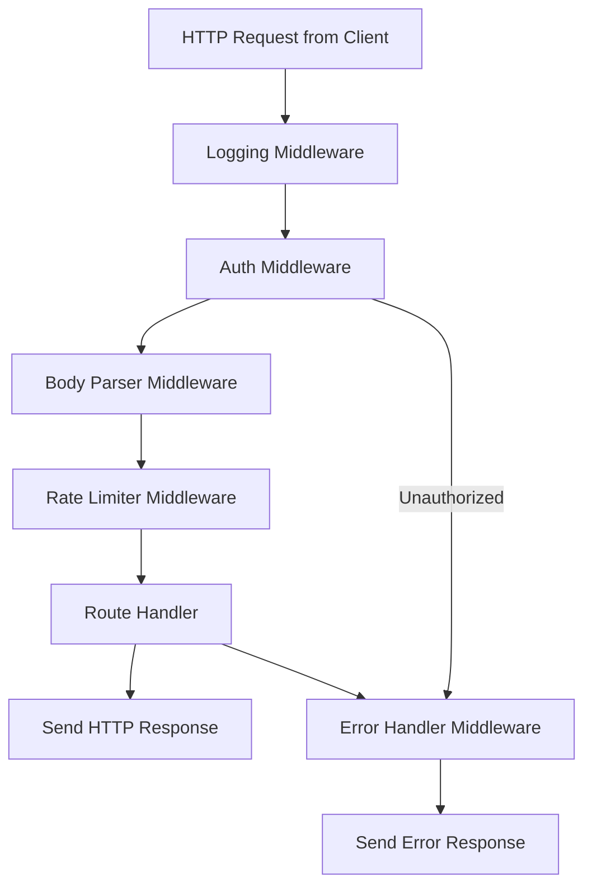

Middleware functions in Express are functions that have access to the request object, response object, and the next middleware in the request-response cycle. They are essential for tasks like logging, authentication, and error handling.

### Custom Logging Middleware

Create a logging middleware to log each incoming request:

```javascript
// loggingMiddleware.js
module.exports = function (req, res, next) {
  console.log(`${req.method} ${req.url}`);
  next();
};
```

Integrate the logging middleware into your server:

```javascript
const express = require("express");
const app = express();
const port = 3000;
const logger = require("./middleware/loggingMiddleware");

app.use(logger);
app.use(express.json());
// ... rest of your routes
```

### Centralized Error Handling

Express allows you to define error-handling middleware to catch and process errors throughout your application. Add the following at the end of your middleware stack:

```javascript
// Error handling middleware
app.use((err, req, res, next) => {
  console.error(err.stack);
  res.status(500).json({ error: "Something went wrong!" });
});
```

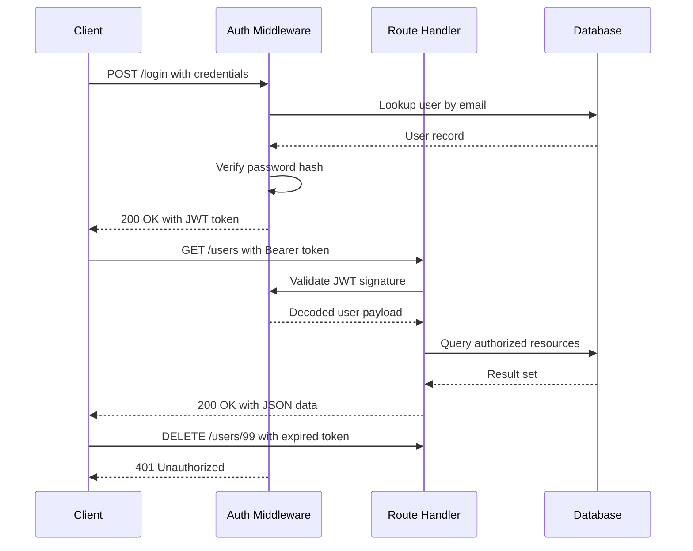

---

## 7. Security Best Practices

When building RESTful APIs, it's crucial to incorporate security best practices:

- **Input Validation:** Always validate and sanitize user input.
- **Authentication & Authorization:** Implement strategies like JWT (JSON Web Tokens) or OAuth.
- **Rate Limiting:** Prevent abuse by limiting the number of requests per IP.
- **Helmet:** Use the [Helmet](https://www.npmjs.com/package/helmet) middleware to secure HTTP headers.

Example of integrating Helmet:

```bash
npm install helmet
```

```javascript
const helmet = require("helmet");
app.use(helmet());
```

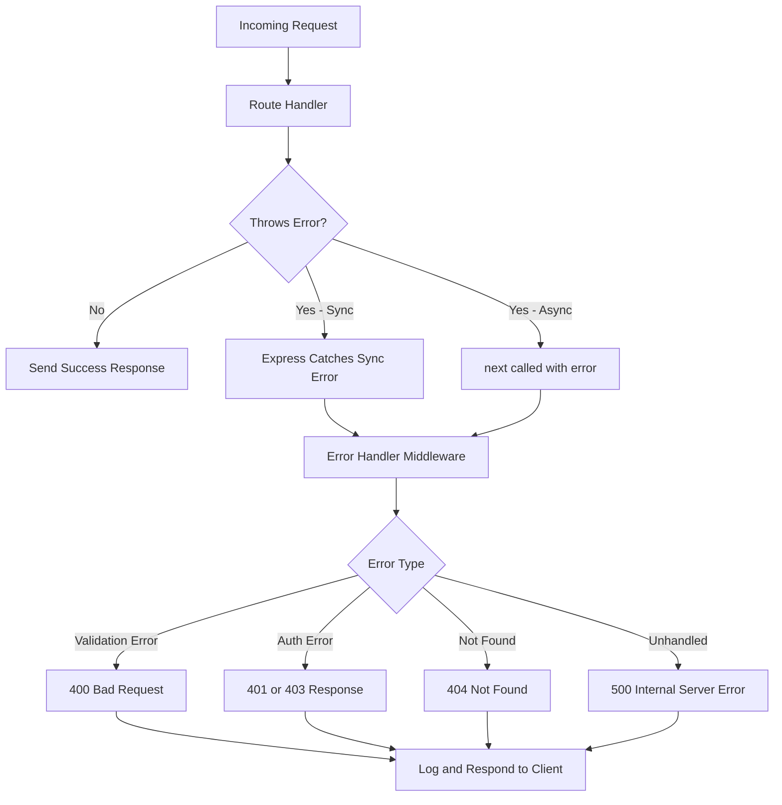

---

## 8. Testing Your API

Automated testing is vital for ensuring your API behaves as expected. Tools like [Jest](https://jestjs.io/) and [Supertest](https://www.npmjs.com/package/supertest) are popular choices for testing Node.js APIs.

### Example: Testing with Supertest

Install the dependencies:

```bash
npm install --save-dev jest supertest
```

Create a test file `server.test.js`:

```javascript
const request = require("supertest");
const express = require("express");
const app = express();
const usersRouter = require("./routes/users");

app.use(express.json());
app.use("/users", usersRouter);

describe("GET /users", () => {
  it("should return an array of users", async () => {
    const res = await request(app).get("/users");
    expect(res.statusCode).toEqual(200);
    expect(Array.isArray(res.body)).toBeTruthy();
  });
});
```

Configure Jest in your `package.json`:

```json
{
  "scripts": {
    "test": "jest"
  }
}
```

Run the tests with:

```bash
npm test
```

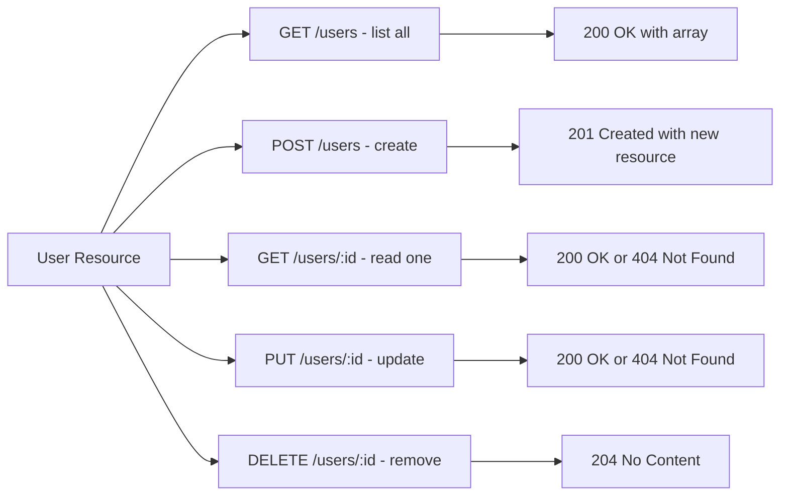

---

## 9. Project Structure

A well-organized Express project separates concerns across layers to keep code maintainable as it grows:

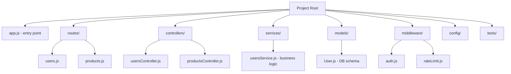

---

## 10. Request Validation Lifecycle

Input validation should happen as early as possible in the middleware chain before any business logic executes:

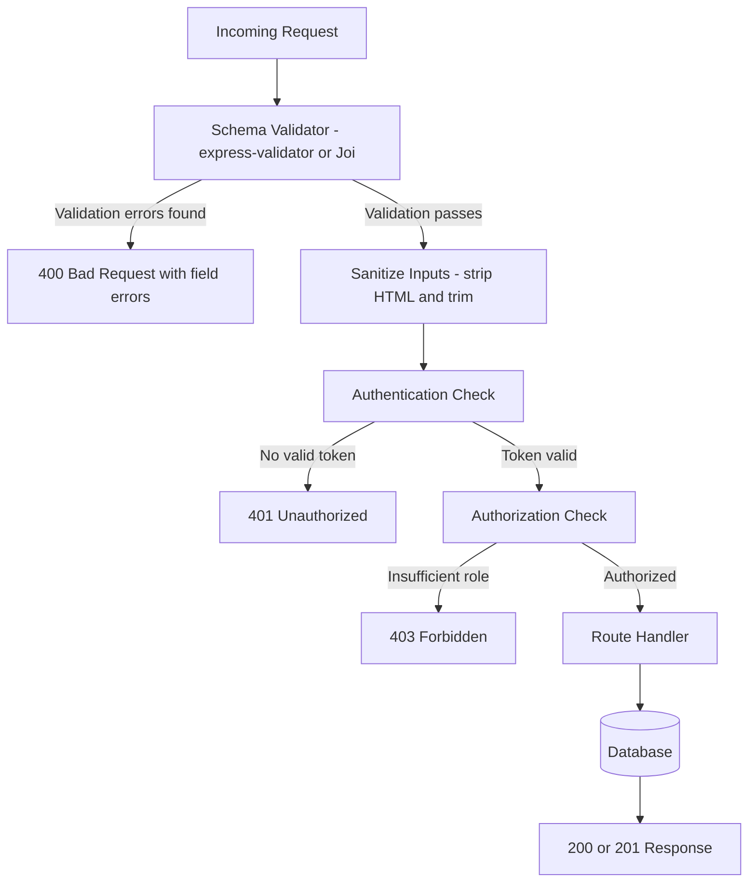

---

## 11. Pagination and Filtering Pattern

APIs that return collections need consistent pagination to avoid returning unbounded result sets:

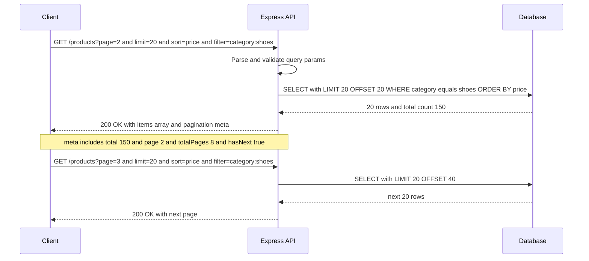

---

## 12. API Versioning Strategy

Versioning keeps older clients working while allowing the API to evolve:

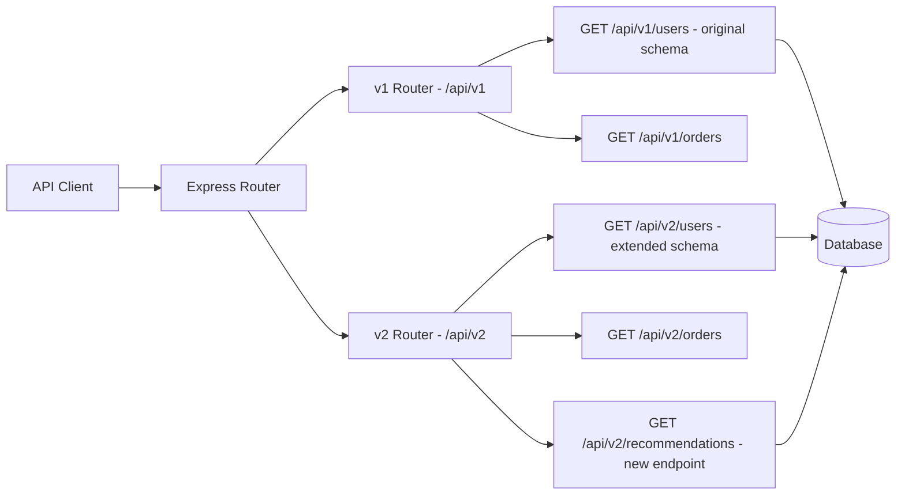

---

## 13. TypeScript Express Setup

JavaScript’s lack of compile-time safety becomes a real pain point as APIs grow. Converting your Express project to TypeScript catches type errors before they hit production.

```bash
npm install --save-dev typescript @types/node @types/express ts-node-dev
npx tsc --init
```

```typescript
// src/types/express.d.ts — extend the Request type with custom properties
import { JwtPayload } from "jsonwebtoken";

declare global {
  namespace Express {
    interface Request {
      user?: JwtPayload & { id: string; roles: string[] };
    }
  }
}
```

```typescript
// src/routes/users.ts
import { Router, Request, Response, NextFunction } from "express";

interface User {
  id: number;
  name: string;
  email: string;
}

let users: User[] = [
  { id: 1, name: "Alice", email: "alice@example.com" },
  { id: 2, name: "Bob", email: "bob@example.com" },
];

const router = Router();

router.get("/", (_req: Request, res: Response) => {
  res.json(users);
});

router.get("/:id", (req: Request, res: Response, next: NextFunction) => {
  const id = parseInt(req.params.id, 10);
  if (isNaN(id)) return next(new Error("Invalid ID format"));

  const user = users.find((u) => u.id === id);
  if (!user) return res.status(404).json({ error: "User not found" });

  res.json(user);
});

export default router;
```

```typescript
// src/app.ts
import express from "express";
import helmet from "helmet";
import rateLimit from "express-rate-limit";
import usersRouter from "./routes/users";

const app = express();

app.use(helmet());
app.use(express.json());

const limiter = rateLimit({
  windowMs: 15 * 60 * 1000, // 15 minutes
  max: 100,
  standardHeaders: true,
  legacyHeaders: false,
});
app.use("/api/", limiter);

app.use("/api/v1/users", usersRouter);

export default app;
```

---

## 14. OpenAPI / Swagger Integration

Documenting your API with OpenAPI (formerly Swagger) makes it self-describing. The `swagger-jsdoc` and `swagger-ui-express` packages generate a live UI from JSDoc comments.

```bash
npm install swagger-jsdoc swagger-ui-express
npm install --save-dev @types/swagger-jsdoc @types/swagger-ui-express
```

```typescript
// src/swagger.ts
import swaggerJsdoc from "swagger-jsdoc";

const options: swaggerJsdoc.Options = {
  definition: {
    openapi: "3.0.0",
    info: {
      title: "Users API",
      version: "1.0.0",
      description: "A simple Express users API",
    },
    components: {
      securitySchemes: {
        bearerAuth: {
          type: "http",
          scheme: "bearer",
          bearerFormat: "JWT",
        },
      },
    },
  },
  apis: ["./src/routes/*.ts"],
};

export const swaggerSpec = swaggerJsdoc(options);
```

```typescript
/**
 * @openapi
 * /api/v1/users:
 *   get:
 *     summary: List all users
 *     tags: [Users]
 *     security:
 *       - bearerAuth: []
 *     responses:
 *       200:
 *         description: Array of user objects
 *         content:
 *           application/json:
 *             schema:
 *               type: array
 *               items:
 *                 $ref: ‘#/components/schemas/User’
 *       401:
 *         description: Unauthorized
 */
router.get("/", authenticate, (_req, res) => {
  res.json(users);
});
```

Mount the UI in `app.ts`:

```typescript
import swaggerUi from "swagger-ui-express";
import { swaggerSpec } from "./swagger";

app.use("/api-docs", swaggerUi.serve, swaggerUi.setup(swaggerSpec));
```

Navigate to `http://localhost:3000/api-docs` to see the interactive documentation.

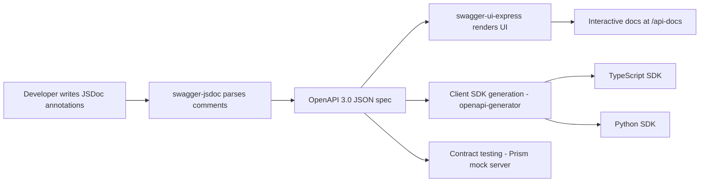

---

## 15. Graceful Shutdown and Health Check Endpoints

Production APIs must handle `SIGTERM` gracefully so Kubernetes or Docker can drain connections before killing the process.

```typescript
// src/server.ts
import http from "http";
import app from "./app";

const PORT = process.env.PORT ?? 3000;
const server = http.createServer(app);

// Health check endpoint — used by load balancers and Kubernetes readiness probes
app.get("/health", (_req, res) => {
  res.json({ status: "ok", uptime: process.uptime(), timestamp: Date.now() });
});

app.get("/ready", async (_req, res) => {
  try {
    // Check database connectivity
    await db.raw("SELECT 1");
    res.json({ status: "ready" });
  } catch {
    res.status(503).json({ status: "unavailable" });
  }
});

let isShuttingDown = false;

process.on("SIGTERM", () => {
  console.log("SIGTERM received — starting graceful shutdown");
  isShuttingDown = true;

  server.close((err) => {
    if (err) {
      console.error("Error during shutdown", err);
      process.exit(1);
    }
    console.log("All connections closed — process exiting");
    process.exit(0);
  });

  // Force exit after 30 s if connections do not drain
  setTimeout(() => {
    console.error("Forced shutdown after timeout");
    process.exit(1);
  }, 30_000);
});

// Reject new requests during shutdown
app.use((_req, res, next) => {
  if (isShuttingDown) {
    res.setHeader("Connection", "close");
    return res.status(503).json({ error: "Service shutting down" });
  }
  next();
});

server.listen(PORT, () => {
  console.log(`Server listening on port ${PORT}`);
});
```

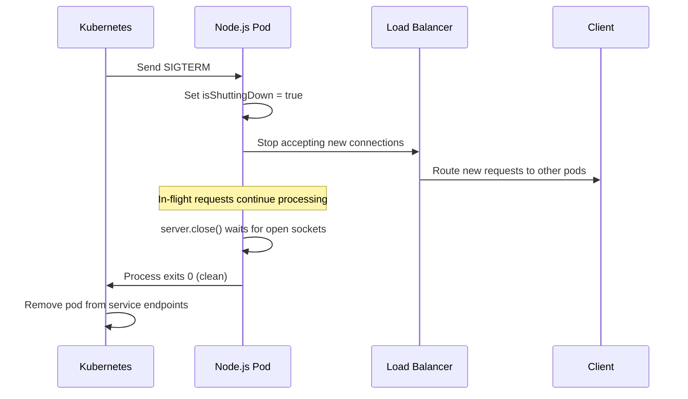

### Production Anti-Patterns

- **Returning stack traces in error responses.** Log the stack server-side; send a safe generic message to clients. Exposing internals helps attackers.
- **Synchronous file I/O in request handlers.** `fs.readFileSync` blocks the event loop. Use `fs.promises.readFile` or stream the file.
- **Missing `await` on async middleware.** Unhandled promise rejections bypass Express’s error handler. Use a wrapper: `const asyncHandler = (fn) => (req, res, next) => Promise.resolve(fn(req, res, next)).catch(next);`
- **Storing sensitive config in code.** Use environment variables loaded through `dotenv` in development and secret management (AWS Secrets Manager, Vault) in production.
- **Skipping rate limiting on auth endpoints.** `/login` and `/register` are primary targets for credential stuffing. Apply stricter limits (e.g., 10 req/15 min per IP) than general API endpoints.

---

## 16. Conclusion

Building a RESTful API with Express.js is a rewarding endeavor that provides a scalable and efficient way to interact with your application’s data. By understanding the basics of Express.js, leveraging middleware, handling errors gracefully, and applying security best practices, you can create robust APIs ready for production.

TypeScript, OpenAPI documentation, graceful shutdown handling, and structured project organization are not optional extras — they are the difference between a prototype and a production-grade service. Adopting these patterns early in a project makes the codebase easier to maintain, test, and hand off to other engineers.

**Key Takeaways:**

- Adopt TypeScript from the start to catch contract violations at compile time.
- Generate OpenAPI docs from JSDoc comments so documentation always stays current with the code.
- Implement `/health` and `/ready` endpoints to integrate cleanly with orchestrators like Kubernetes.
- Handle `SIGTERM` for graceful draining before process exit — essential for zero-downtime rolling deployments.
- Apply the `asyncHandler` wrapper to every async route to ensure unhandled rejections reach the centralized error middleware.

Whether you are building a small project or a large-scale application, mastering these techniques will enhance your web development skills and prepare you for more complex challenges in the world of API design.

Happy coding!
