import MdxLayout from "@/components/MdxLayout";

export const metadata = {
  title: "Exploring Frontend Frameworks: React, Vue, Angular, and Svelte",
  description:
    "An extensive guide on popular frontend frameworks, including React, Vue, Angular, and Svelte.",
  topics: [
    "Web Development",
    "Web Frameworks",
    "Performance",
    "Web Architecture",
  ],
};

export default function FrontendFrameworksContent({ children }) {
  return <MdxLayout>{children}</MdxLayout>;
}

# Exploring Frontend Frameworks: A Comprehensive Guide

### Author: Son Nguyen

> Date: 2024-02-18

Modern web development thrives on innovation, and frontend frameworks are at the forefront of that change. These frameworks simplify the creation of dynamic and responsive user interfaces, enabling developers to build interactive, efficient, and scalable applications. In this in-depth guide, we’ll explore four of the most popular frontend frameworks: **React**, **Vue**, **Angular**, and **Svelte**. We’ll cover what each framework is, dive into detailed examples, compare and contrast their core features, discuss when to use each one, and provide comprehensive resources and tutorials to kickstart your journey.

---

## 1. Introduction: What Are Frontend Frameworks?

Frontend frameworks are powerful toolkits designed to streamline the development of user interfaces (UI) and interactive web applications. They provide a structured foundation that helps developers solve common challenges, such as:

- **Efficient DOM Management:** Handling updates and re-rendering of components.
- **State Management:** Keeping application data in sync with the UI.
- **Modularity:** Enabling code reusability through encapsulated components.
- **Tooling:** Offering build systems, testing frameworks, and development servers to improve productivity.

By leveraging these frameworks, developers can focus on crafting unique user experiences rather than reinventing the wheel with every project.

---

## 2. Detailed Overview of Popular Frontend Frameworks

Below, we examine each framework in detail, discussing its philosophy, unique features, and how you can get started.

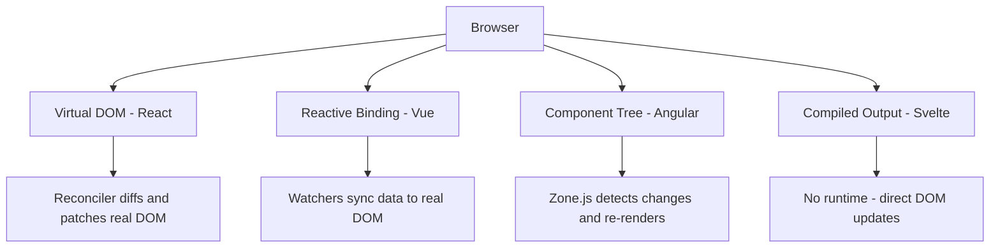

---

### 2.1 React

**React** is a JavaScript library created by Facebook that popularized the concept of a component-based architecture. It allows developers to break down UIs into discrete, reusable pieces that manage their own state.

#### Key Features

- **Component-Based Architecture:** Build encapsulated components that maintain their own state and logic.
- **Virtual DOM:** Minimizes direct manipulation of the browser’s DOM for improved performance.
- **Rich Ecosystem:** A massive community with an extensive range of libraries, tools, and integrations (e.g., Redux, React Router).
- **Declarative UI:** Describe what your UI should look like, and React takes care of rendering it efficiently.

#### Example Code

```jsx
// index.js
import React from "react";
import ReactDOM from "react-dom";

function App() {
  const [count, setCount] = React.useState(0);

  return (
    <div style={{ padding: "20px", fontFamily: "sans-serif" }}>
      <h1>Hello, React!</h1>
      <p>You clicked {count} times.</p>
      <button onClick={() => setCount(count + 1)}>Click me</button>
    </div>
  );
}

ReactDOM.render(<App />, document.getElementById("root"));
```

#### Ecosystem and Tooling

- **Create React App:** Quick project setup.

```bash
npx create-react-app my-app
cd my-app
npm start
```

- **Official Documentation:** [React Docs](https://reactjs.org/docs/getting-started.html)
- **Tutorials:** Explore the [React Tutorial](https://reactjs.org/tutorial/tutorial.html) and courses on Udemy, Coursera, or freeCodeCamp.

---

### 2.2 Vue

**Vue** is a progressive framework renowned for its simplicity and versatility. It is designed to be incrementally adoptable, meaning you can use as much or as little of it as you need.

#### Key Features

- **Progressive Framework:** Start small and scale up as your application grows.
- **Reactive Data Binding:** Automatically keeps the UI in sync with the underlying data.
- **Single-File Components:** Consolidate HTML, JavaScript, and CSS in a single `.vue` file for better organization.
- **Simplicity:** An intuitive API with a gentle learning curve that is ideal for beginners and experienced developers alike.

#### Example Code

```vue
<!-- App.vue -->
<template>
  <div id="app" style="padding: 20px; font-family: sans-serif;">
    <h1>Hello, Vue!</h1>
    <p>{{ message }}</p>
    <button @click="updateMessage">Click me</button>
  </div>
</template>

<script>
export default {
  name: "App",
  data() {
    return {
      message: "Welcome to Vue!",
    };
  },
  methods: {
    updateMessage() {
      this.message = "You clicked the button!";
    },
  },
};
</script>

<style scoped>
h1 {
  color: #42b983;
}
</style>
```

#### Ecosystem and Tooling

- **Vue CLI:** Scaffold new Vue projects quickly.

```bash
npm install -g @vue/cli
vue create my-vue-app
cd my-vue-app
npm run serve
```

- **Official Documentation:** [Vue Docs](https://vuejs.org/v2/guide/)
- **Tutorials:** The [Vue Guide](https://vuejs.org/v2/guide/) and interactive courses on [Vue Mastery](https://www.vuemastery.com/) are excellent starting points.

---

### 2.3 Angular

**Angular** is a full-featured, enterprise-grade framework developed by Google. It uses TypeScript to enforce type safety and is built with scalability and maintainability in mind, making it ideal for large, complex applications.

#### Key Features

- **Comprehensive Framework:** Offers a complete solution with routing, forms, HTTP client, and more built-in.
- **TypeScript Integration:** Provides strong typing and object-oriented features, reducing runtime errors.
- **Modular Architecture:** Encourages separation of concerns and highly modular application structures.
- **Dependency Injection:** Facilitates better testing and component decoupling.

#### Example Code

```typescript
// app.component.ts
import { Component } from "@angular/core";

@Component({
  selector: "app-root",
  template: `
    <div style="padding: 20px; font-family: sans-serif;">
      <h1>Hello, Angular!</h1>
      <p>{{ message }}</p>
      <button (click)="updateMessage()">Click me</button>
    </div>
  `,
  styles: [
    `
      h1 {
        color: #dd1b16;
      }
    `,
  ],
})
export class AppComponent {
  message: string = "Welcome to Angular!";

  updateMessage() {
    this.message = "Button clicked!";
  }
}
```

#### Ecosystem and Tooling

- **Angular CLI:** Create and manage Angular projects with ease.

```bash
npm install -g @angular/cli
ng new my-angular-app
cd my-angular-app
ng serve
```

- **Official Documentation:** [Angular Docs](https://angular.io/docs)
- **Tutorials:** The [Tour of Heroes](https://angular.io/tutorial) is a fantastic interactive tutorial; additional courses are available on platforms like Pluralsight and Udemy.

---

### 2.4 Svelte

**Svelte** is a modern framework that takes a radically different approach compared to traditional frameworks. Instead of using a virtual DOM, Svelte compiles your code at build time to highly optimized vanilla JavaScript that updates the DOM directly.

#### Key Features

- **No Virtual DOM:** Eliminates the performance overhead of diffing by compiling away the framework.
- **Minimal Boilerplate:** Write less code and achieve more with its concise syntax.
- **Built-In Reactivity:** Directly update variables to trigger reactive updates.
- **Small Bundle Size:** Produces highly optimized code that results in faster load times.

#### Example Code

```svelte
<!-- App.svelte -->
<script>
  let count = 0;
  const increment = () => count += 1;
</script>

<main style="padding: 20px; font-family: sans-serif;">
  <h1>Hello, Svelte!</h1>
  <p>You clicked {count} times.</p>
  <button on:click={increment}>Click me</button>
</main>

<style>
  h1 {
    color: teal;
  }
</style>
```

#### Ecosystem and Tooling

- **Svelte Template:** Quickly set up a new Svelte project.

```bash
npx degit sveltejs/template my-svelte-app
cd my-svelte-app
npm install
npm run dev
```

- **Official Documentation:** [Svelte Docs](https://svelte.dev/docs)
- **Tutorials:** Try the interactive [Svelte Tutorial](https://svelte.dev/tutorial) on the official site; additional learning resources are available on YouTube and community blogs.

---

## 3. Comparing and Contrasting the Frameworks

Understanding the strengths and trade-offs of each framework is key to selecting the right one for your project. Here’s a detailed comparison:

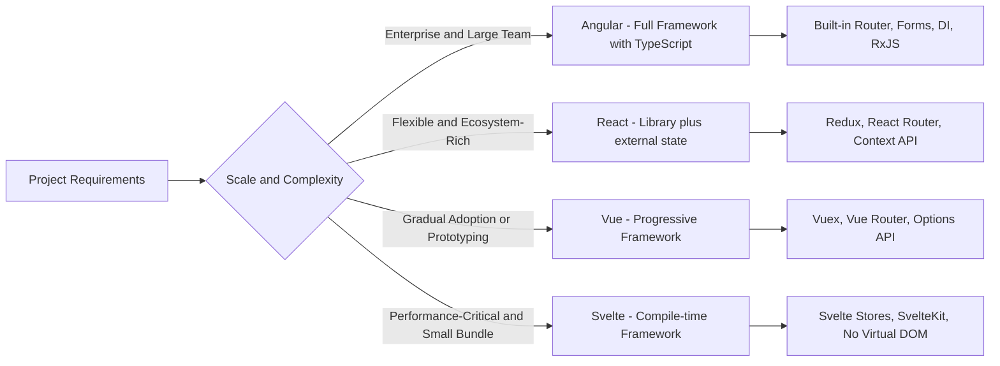

| Feature                 | React                                                                    | Vue                                              | Angular                                                                      | Svelte                                                          |
| ----------------------- | ------------------------------------------------------------------------ | ------------------------------------------------ | ---------------------------------------------------------------------------- | --------------------------------------------------------------- |
| **Type**                | Library                                                                  | Progressive Framework                            | Full-Featured Framework                                                      | Compiler Framework                                              |
| **Language**            | JavaScript (JSX)                                                         | JavaScript (with optional TypeScript)            | TypeScript                                                                   | JavaScript (with optional TypeScript)                           |
| **Learning Curve**      | Moderate – Requires understanding of JSX and ecosystem complexities      | Gentle – Intuitive API and flexible integration  | Steep – Comprehensive with built-in solutions                                | Gentle – Minimal boilerplate and straightforward reactivity     |
| **State Management**    | External libraries (Redux, MobX, Context API)                            | Built-in (Vuex for large applications)           | Built-in (Services, RxJS, NgRx)                                              | Built-in reactivity                                             |
| **Performance**         | Fast (Optimized Virtual DOM diffing)                                     | Fast and efficient with reactive binding         | Optimized, though can be heavy if not managed well                           | Extremely fast due to compile-time optimizations                |
| **Tooling & Ecosystem** | Rich ecosystem with mature libraries                                     | Comprehensive tooling via Vue CLI                | Integrated tooling with Angular CLI                                          | Growing ecosystem and vibrant community support                 |
| **Use Case**            | Ideal for both small projects and large-scale apps requiring flexibility | Great for gradual adoption and rapid prototyping | Best for enterprise-level applications needing a robust, all-in-one solution | Perfect for lightweight apps with high performance requirements |

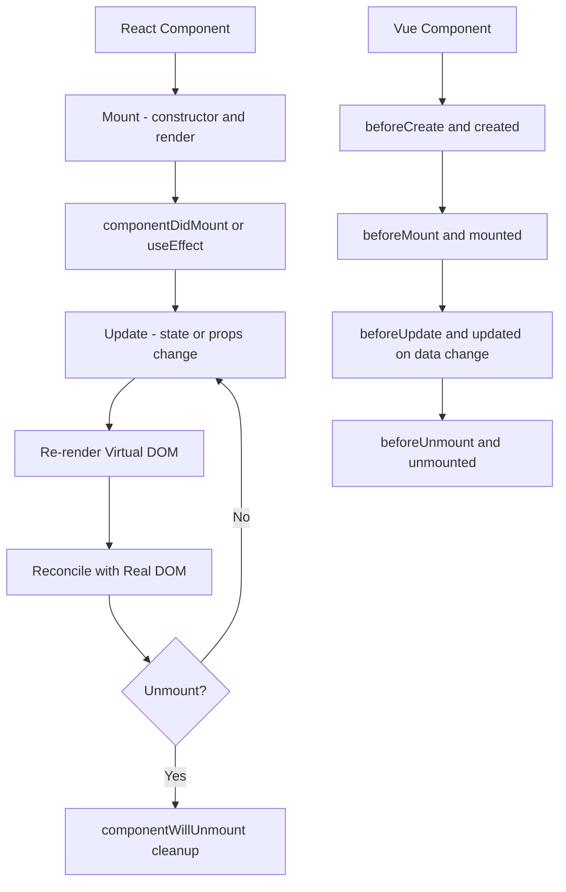

### 3.1. When to Use Each Framework

- **React:**
  Choose React for projects that require a high degree of flexibility and a rich ecosystem. It is well-suited for dynamic single-page applications and situations where you want granular control over component behavior.

- **Vue:**
  Vue is excellent for projects that benefit from an incremental learning curve. It allows for gradual integration into existing projects, making it ideal for teams transitioning from legacy systems or for rapid prototyping.

- **Angular:**
  Angular’s comprehensive nature and strict structure make it ideal for enterprise-level projects. Its built-in solutions and TypeScript foundation promote scalability and maintainability in large, complex applications.

- **Svelte:**
  Svelte is an excellent choice when performance and bundle size are critical. Its unique compile-time approach minimizes runtime overhead, making it perfect for lightweight applications and scenarios where rapid rendering is essential.

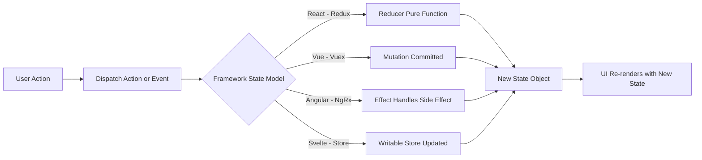

---

## 4. In-Depth Resources and Tutorials

To dive deeper into each framework, here are some curated resources and tutorials:

### 4.1. React

- **Official Documentation:**
  [React Docs](https://reactjs.org/docs/getting-started.html)
- **Interactive Tutorial:**
  [React Tutorial](https://reactjs.org/tutorial/tutorial.html)
- **Courses & Videos:**
  Explore courses on Udemy, Coursera, and YouTube channels like Academind or Traversy Media.
- **Tooling:**
  [Create React App](https://create-react-app.dev/)

### 4.2. Vue

- **Official Documentation:**
  [Vue Guide](https://vuejs.org/v2/guide/)
- **Interactive Courses:**
  [Vue Mastery](https://www.vuemastery.com/) and [Vue School](https://vueschool.io/)
- **Community Resources:**
  Check out Vue.js examples on CodeSandbox and GitHub repositories.
- **Tooling:**
  [Vue CLI](https://cli.vuejs.org/)

### 4.3. Angular

- **Official Documentation:**
  [Angular Docs](https://angular.io/docs)
- **Interactive Tutorial:**
  [Tour of Heroes](https://angular.io/tutorial)
- **Courses & Bootcamps:**
  Pluralsight, Udemy, and Angular University provide extensive Angular training.
- **Tooling:**
  [Angular CLI](https://angular.io/cli)

### 4.4. Svelte

- **Official Documentation:**
  [Svelte Docs](https://svelte.dev/docs)
- **Interactive Tutorial:**
  [Svelte Tutorial](https://svelte.dev/tutorial)
- **Community Resources:**
  Join the Svelte Discord channel and check out community projects on GitHub.
- **Tooling:**
  [Svelte Template](https://github.com/sveltejs/template)

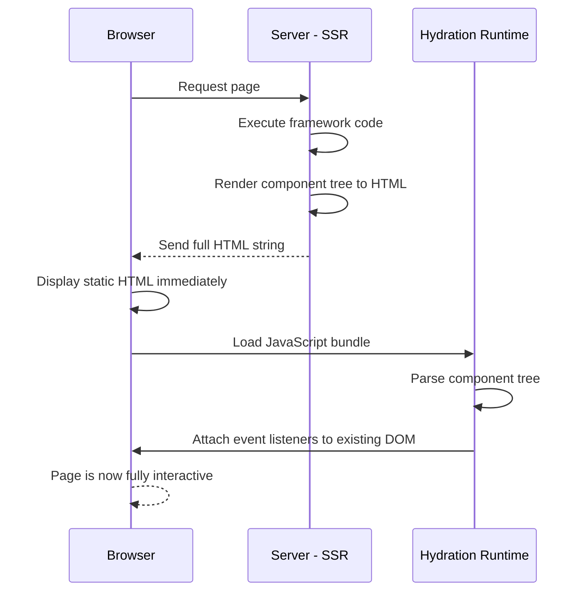

---

## 5. Build Pipeline Comparison

Each framework compiles and bundles code differently, which affects developer experience and output size:

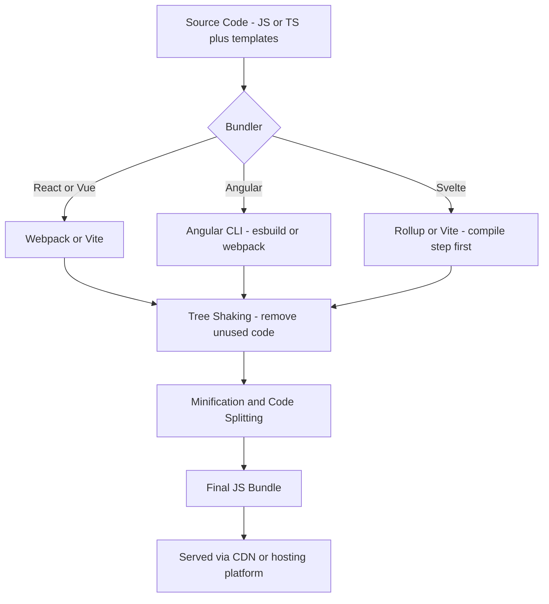

---

## 6. Component Communication Patterns

Components need structured ways to share data across the component tree:

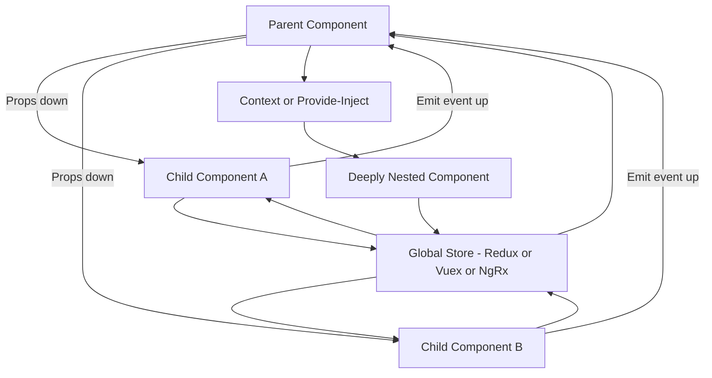

---

## 7. Testing Strategy Across Frameworks

A layered testing approach ensures components, integration points, and full user flows are all covered:

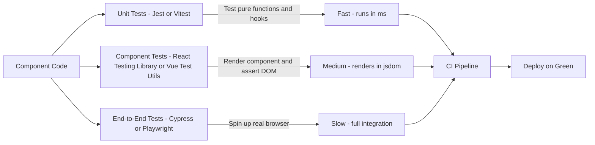

---

## 8. Angular Dependency Injection Model

Angular's DI system wires services into components at module or component scope:

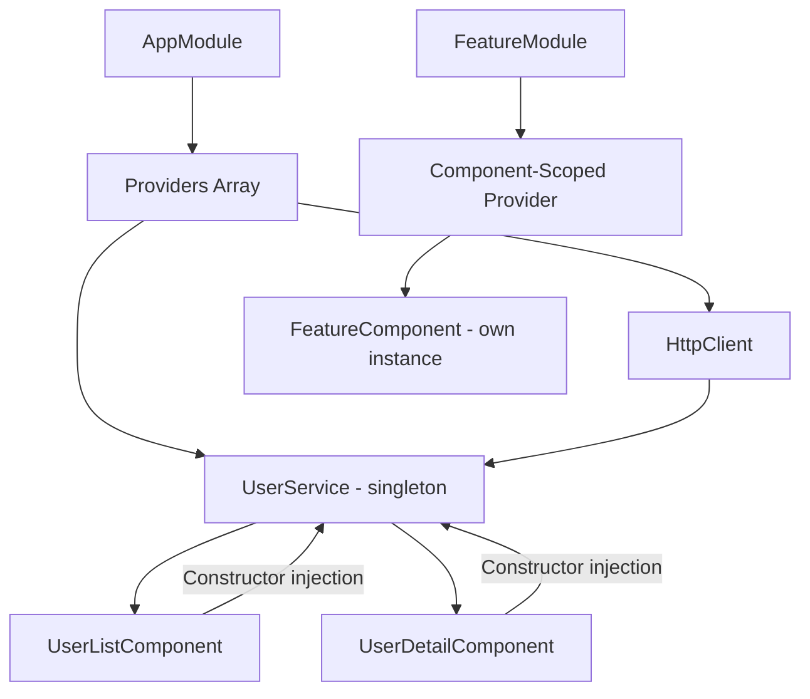

---

## 9. Accessibility Compliance Patterns

Accessibility (a11y) is not optional when building production UIs. WCAG 2.1 AA compliance is both a legal requirement in many jurisdictions and a quality signal for all users. Each framework has specific patterns that make meeting accessibility standards easier or harder.

### 9.1. Accessible Modal Dialog in React

Dialogs require focus trapping, `aria-modal`, `aria-labelledby`, and ESC key dismissal. The `@radix-ui/react-dialog` primitive handles this correctly out of the box.

```tsx
import * as Dialog from "@radix-ui/react-dialog";

export function AccessibleModal({
  open,
  onClose,
  title,
  children,
}: {
  open: boolean;
  onClose: () => void;
  title: string;
  children: React.ReactNode;
}) {
  return (
    <Dialog.Root open={open} onOpenChange={(v) => !v && onClose()}>
      <Dialog.Portal>
        <Dialog.Overlay
          style={{
            position: "fixed",
            inset: 0,
            background: "rgba(0,0,0,0.5)",
          }}
        />
        <Dialog.Content
          aria-modal="true"
          style={{
            position: "fixed",
            top: "50%",
            left: "50%",
            transform: "translate(-50%, -50%)",
            background: "#fff",
            padding: "24px",
            borderRadius: "8px",
            maxWidth: "500px",
            width: "90vw",
          }}
        >
          <Dialog.Title style={{ marginTop: 0 }}>{title}</Dialog.Title>
          {children}
          <Dialog.Close asChild>
            <button
              aria-label="Close dialog"
              style={{ position: "absolute", top: 8, right: 8 }}
            >
              ✕
            </button>
          </Dialog.Close>
        </Dialog.Content>
      </Dialog.Portal>
    </Dialog.Root>
  );
}
```

### 9.2. Skip Navigation Link (All Frameworks)

Every page with repeated navigation must include a visible-on-focus skip link so keyboard users can bypass the nav and jump to main content.

```html
<!-- Place this as the first child of <body> in your app shell -->
<a
  href="#main-content"
  class="skip-link"
  style="
    position: absolute;
    top: -40px;
    left: 8px;
    background: #0052cc;
    color: #fff;
    padding: 8px 16px;
    border-radius: 0 0 4px 4px;
    z-index: 9999;
    transition: top 0.1s;
  "
  onfocus="this.style.top=’0’"
  onblur="this.style.top=’-40px’"
>
  Skip to main content
</a>

<main id="main-content" tabindex="-1">
  <!-- Page content -->
</main>
```

### 9.3. Accessible Form in Angular with Reactive Forms

Angular Reactive Forms integrate cleanly with `aria-describedby` for live error messages, which assistive technologies announce immediately.

```typescript
// profile-form.component.ts
import { Component } from "@angular/core";
import { FormBuilder, Validators } from "@angular/forms";

@Component({
  selector: "app-profile-form",
  template: `
    <form [formGroup]="form" (ngSubmit)="onSubmit()" novalidate>
      <div>
        <label for="email">Email address</label>
        <input
          id="email"
          type="email"
          formControlName="email"
          [attr.aria-invalid]="form.get(‘email’)?.invalid && form.get(‘email’)?.touched"
          aria-describedby="email-error"
        />
        <span
          id="email-error"
          role="alert"
          *ngIf="form.get(‘email’)?.hasError(‘required’) && form.get(‘email’)?.touched"
        >
          Email is required.
        </span>
        <span
          id="email-error"
          role="alert"
          *ngIf="form.get(‘email’)?.hasError(‘email’) && form.get(‘email’)?.touched"
        >
          Please enter a valid email address.
        </span>
      </div>
      <button type="submit" [disabled]="form.invalid">Save profile</button>
    </form>
  `,
})
export class ProfileFormComponent {
  form = this.fb.group({
    email: ["", [Validators.required, Validators.email]],
  });
  constructor(private fb: FormBuilder) {}
  onSubmit() {
    console.log(this.form.value);
  }
}
```

### 9.4. Accessibility Audit Workflow

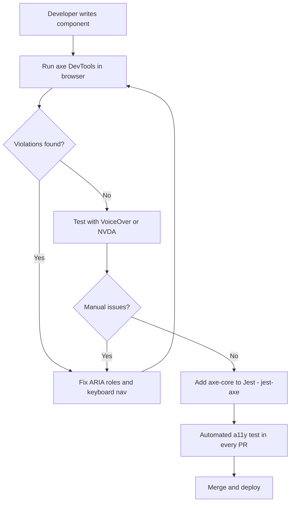

---

## 10. Performance Budgets Per Framework

Performance budgets define the maximum acceptable size and loading characteristics for a web application. Without enforced budgets, bundle sizes grow silently with each dependency addition.

### 10.1. Lighthouse CI Integration

```yaml
# .github/workflows/perf-budget.yml
name: Performance Budget
on: [push, pull_request]
jobs:
  lhci:
    runs-on: ubuntu-latest
    steps:
      - uses: actions/checkout@v3
      - run: npm ci && npm run build
      - run: npm install -g @lhci/cli
      - run: lhci autorun
```

```json
// lighthouserc.json
{
  "ci": {
    "collect": {
      "url": ["http://localhost:3000", "http://localhost:3000/dashboard"],
      "startServerCommand": "npm run start"
    },
    "assert": {
      "assertions": {
        "categories:performance": ["error", { "minScore": 0.9 }],
        "first-contentful-paint": ["error", { "maxNumericValue": 1500 }],
        "largest-contentful-paint": ["error", { "maxNumericValue": 2500 }],
        "total-blocking-time": ["error", { "maxNumericValue": 300 }],
        "cumulative-layout-shift": ["error", { "maxNumericValue": 0.1 }]
      }
    }
  }
}
```

### 10.2. Bundle Size Budgets Per Framework

Typical production bundle size targets for a mid-complexity application (minified + gzipped):

| Framework         | Initial JS Budget | Notes                                              |
| ----------------- | ----------------- | -------------------------------------------------- |
| Svelte            | 25-50 KB          | No runtime; ideal for content-heavy apps           |
| Vue 3             | 50-100 KB         | Composition API enables better tree-shaking        |
| React + React DOM | 80-120 KB         | Baseline runtime cost; aggressive splitting needed |
| Angular           | 150-250 KB        | Framework overhead; justified for large apps       |

### 10.3. Webpack Bundle Analyzer Integration

```bash
# React (Create React App) - analyze the production build
npx source-map-explorer build/static/js/*.js

# Vite-based projects (Vue or React)
npx vite-bundle-visualizer

# Angular
ng build --stats-json
npx webpack-bundle-analyzer dist/my-app/stats.json
```

### 10.4. Code Splitting with React.lazy

```tsx
import React, { Suspense } from "react";

// Each route loads its bundle only when first visited
const Dashboard = React.lazy(() => import("./pages/Dashboard"));
const Analytics = React.lazy(() => import("./pages/Analytics"));
const Settings = React.lazy(() => import("./pages/Settings"));

export function AppRouter() {
  return (
    <Suspense
      fallback={
        <div role="status" aria-live="polite">
          Loading...
        </div>
      }
    >
      <Routes>
        <Route path="/dashboard" element={<Dashboard />} />
        <Route path="/analytics" element={<Analytics />} />
        <Route path="/settings" element={<Settings />} />
      </Routes>
    </Suspense>
  );
}
```

### 10.5. Performance Budget Enforcement Flow

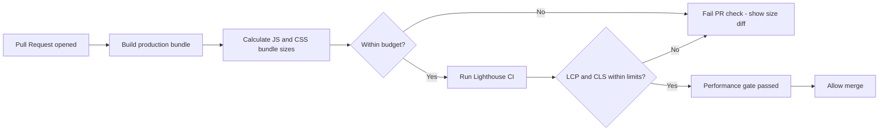

---

## 11. Micro-Frontend Integration with Frontend Frameworks

When combining microfrontends with a specific framework, each framework has idiomatic ways to expose and consume remote components.

### 11.1. React with Webpack Module Federation

```tsx
// app-shell/src/RemoteCatalog.tsx
import React, { Suspense } from "react";

// Type declaration for the remote module
declare module "catalog/ProductList" {
  const ProductList: React.ComponentType<{ category: string }>;
  export default ProductList;
}

const RemoteProductList = React.lazy(
  () =>
    // @ts-ignore - loaded at runtime by Module Federation
    import("catalog/ProductList"),
);

export function CatalogSection({ category }: { category: string }) {
  return (
    <Suspense fallback={<span>Loading catalog...</span>}>
      <RemoteProductList category={category} />
    </Suspense>
  );
}
```

### 11.2. Vue with vite-plugin-federation

```vue
<!-- shell/src/views/HomeView.vue -->
<template>
  <div>
    <h1>Home</h1>
    <!-- Remote component from the recommendations MFE -->
    <Suspense>
      <template #default>
        <RemoteRecommendations :user-id="userId" />
      </template>
      <template #fallback>
        <p>Loading recommendations...</p>
      </template>
    </Suspense>
  </div>
</template>

<script setup lang="ts">
import { defineAsyncComponent } from "vue";

const RemoteRecommendations = defineAsyncComponent(
  () => import("recommendations/RecommendationsWidget"),
);

defineProps<{ userId: string }>();
</script>
```

### 11.3. MFE Integration Architecture

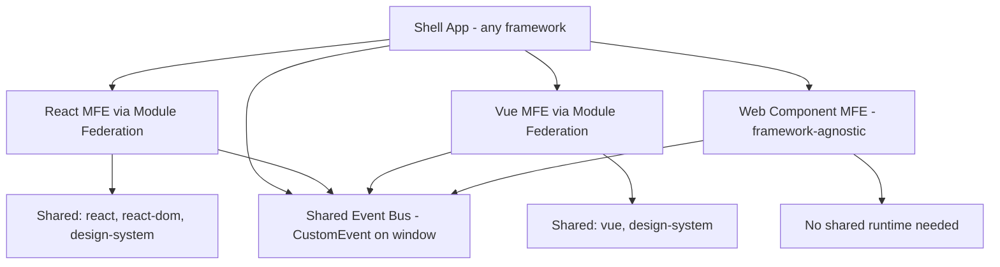

---

## 12. Best Practices for Frontend Development

Beyond choosing a framework, consider these best practices to ensure your project’s success:

- **Component Design:**
  Develop small, reusable, and testable components. Keep your component logic focused and decoupled.
- **State Management:**
  Choose an appropriate state management strategy - whether it’s local component state, context APIs, or a dedicated state management library.
- **Performance Optimization:**
  Use tools like React Profiler, Vue DevTools, or Angular DevTools to monitor and optimize performance.
- **Responsive Design:**
  Ensure your UI components are responsive across devices. Leverage CSS frameworks or utility libraries like Tailwind CSS.
- **Testing:**
  Write unit and integration tests using frameworks such as Jest, Mocha, or Jasmine. Utilize end-to-end testing tools like Cypress.
- **Accessibility:**
  Prioritize web accessibility (a11y) by following best practices and leveraging available accessibility tools.

---

## 13. Conclusion

The landscape of frontend frameworks is both rich and varied. Whether you choose React for its flexibility and vibrant ecosystem, Vue for its progressive and intuitive nature, Angular for its robust, enterprise-level features, or Svelte for its cutting-edge compile-time optimizations, each tool offers unique advantages tailored to different project needs.

Understanding the core concepts, ecosystems, and best practices of these frameworks is essential for selecting the right one for your project. Dive into the tutorials and resources provided, experiment with the example code, and embrace the power of modern frontend development. With the right framework in hand, you’ll be well-equipped to build high-performance, scalable, and engaging web applications.

---

## 14. Further Reading

- **React Official Documentation:** [https://reactjs.org/docs/getting-started.html](https://reactjs.org/docs/getting-started.html)
- **Vue Official Guide:** [https://vuejs.org/v2/guide/](https://vuejs.org/v2/guide/)
- **Angular Official Docs:** [https://angular.io/docs](https://angular.io/docs)
- **Svelte Official Tutorial:** [https://svelte.dev/tutorial](https://svelte.dev/tutorial)
- **Web Accessibility Initiative (WAI-ARIA):** [https://www.w3.org/WAI/ARIA/](https://www.w3.org/WAI/ARIA/)
- **Webpack Module Federation:** [https://webpack.js.org/concepts/module-federation/](https://webpack.js.org/concepts/module-federation/)

_This comprehensive guide has explored the intricate details of frontend frameworks - React, Vue, Angular, and Svelte - providing you with a solid foundation to make an informed decision. Happy coding and best of luck on your web development journey!_
