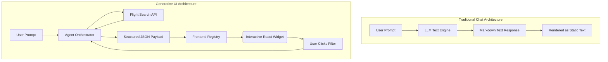
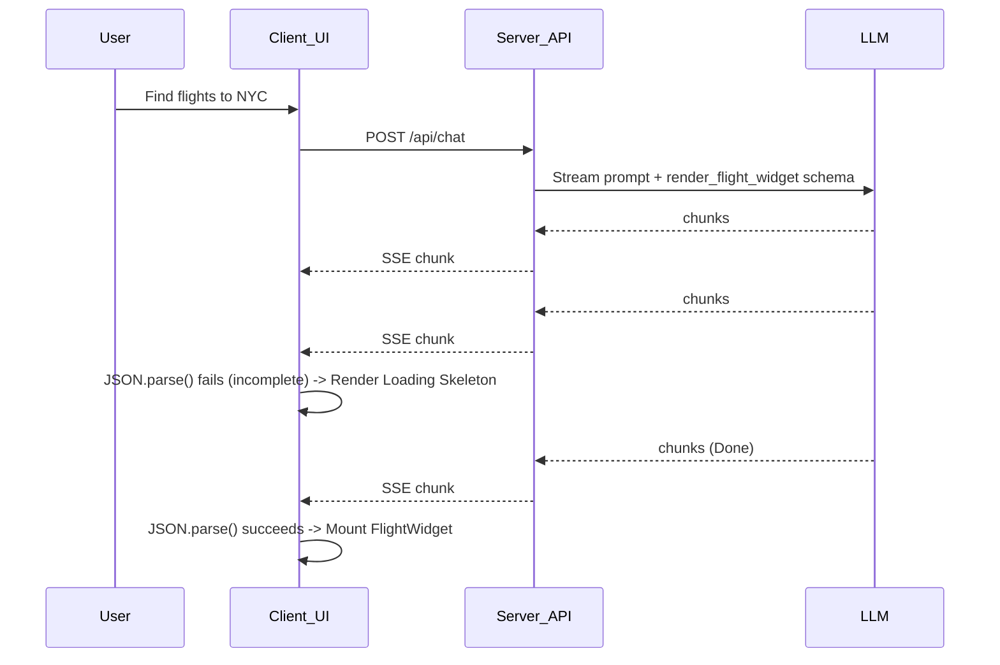
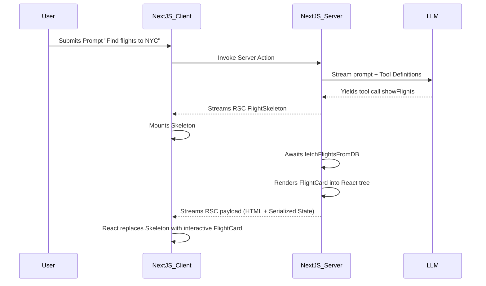
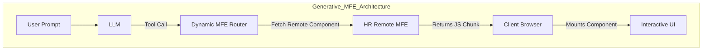
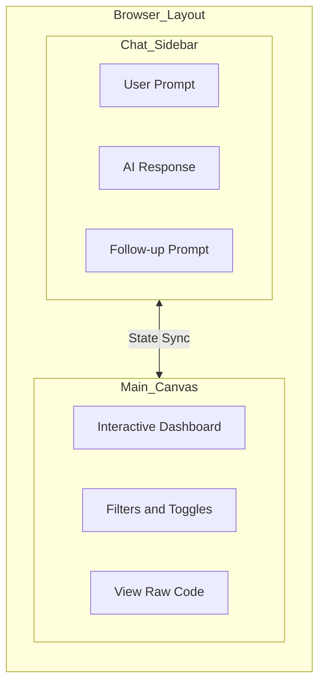
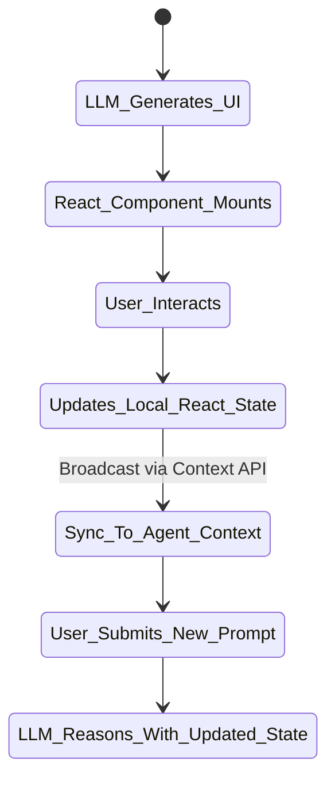
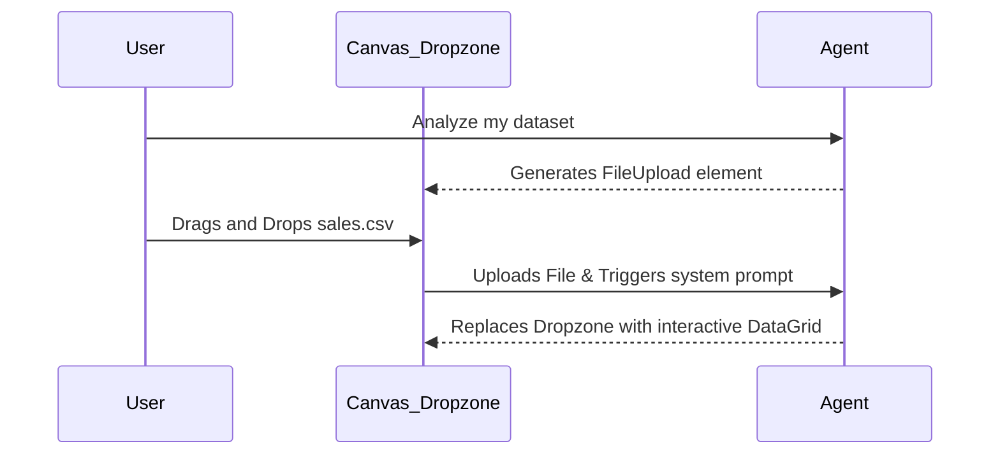

import MdxLayout from "@/components/MdxLayout";

export const metadata = {
  title: "Generative UI: Designing Agentic Interfaces Beyond the Chatbox",
  description:
    "The definitive, master-class guide to Generative UIs. Exploring Server-Driven architecture, Micro-Frontends (MFEs), dynamic component registries, bi-directional state sync, and the shift toward ephemeral applications.",
  topics: [
    "Artificial Intelligence",
    "Frontend Development",
    "Agentic AI",
    "User Experience",
    "React",
    "System Design",
    "Architecture",
  ],
};

export default function GenerativeUIArticle({ children }) {
  return <MdxLayout>{children}</MdxLayout>;
}

# Generative UI: Designing Agentic Interfaces Beyond the Chatbox

### Author: Son Nguyen

> Date: 2026-04-19

Since the release of ChatGPT, the default interface for interacting with AI has been the chatbox. You type a prompt, the system streams back text, and you read it. This paradigm was revolutionary for open-ended knowledge retrieval and text generation.

However, as AI systems evolve from passive text generators into **autonomous agents**—systems that take actions, manipulate data, and execute multi-step workflows across diverse APIs—the chatbox has become a severe bottleneck. Reading a markdown table of flights or comparing interactive stock charts inside a linear chat UI is fundamentally broken. Interacting with that data (sorting, filtering, booking, modifying) within a text stream is even worse.

This bottleneck has led to the rise of **Generative UI** (often called Agentic UI). Instead of just returning text, the agent returns _code_, _structured state_, or _Server Components_ that the frontend dynamically renders as interactive, fully functional graphical interfaces on the fly.

This exhaustive, master-class deep dive explores the technical shift from conversational AI to Generative UI, how to architect these systems using modern frontend frameworks like React, advanced dynamic loading via Micro-Frontends, and why this represents the future of human-computer interaction: the era of "Ephemeral Software."

---

## 1. The Limits of Conversational AI

A pure chat interface is excellent for generating an essay but terrible for managing complex workflows. It suffers from four major limitations that traditional UI/UX design solved decades ago:

### 1.1. Low Information Density

Text is strictly linear and slow to parse. A geographic map, an interactive dashboard, or a Kanban board conveys complex relationships instantly. Forcing an AI to summarize a 500-row database table into a bulleted list destroys the utility of the data, stripping away sortability, pagination, and visual hierarchy.

### 1.2. The Lack of Interactivity

If an AI suggests three hotel options in text, you cannot interact with them. You cannot click a row to "view on map," drag a slider to "adjust price," or click a button to "book now." You are forced to type another prompt: _"Show me the first one on a map."_ This turns a simple one-click action into a tedious, multi-turn conversational chore that wastes both user time and LLM token budgets.

### 1.3. Loss of State and Context

Chat is a scrolling ledger. As new messages appear, older ones scroll off the screen. If the AI generated an important control panel or data grid 10 minutes ago, it is now buried. The user loses their spatial anchor to the application state, leading to cognitive fatigue as they constantly scroll up and down to remember what the agent previously presented.

### 1.4. The "Blank Canvas" Problem (Discoverability)

Users often don't know what an AI is capable of doing. Standard Graphical User Interfaces (GUIs) use buttons, menus, and sidebars to afford discoverability—they explicitly show the user what actions are possible. A chatbox hides the entire capability set behind a blinking cursor, forcing the user to guess what commands the agent understands.

---

## 2. What is Generative UI?

Generative UI is an interface paradigm where the AI agent determines not just the _content_ of the response, but the _optimal visual form_ in which that content should be presented.

Instead of the agent outputting:

> _"Here are three flights: Flight A is $300 on Delta. Flight B is $400 on United..."_

The agent outputs a structured JSON payload representing the exact state needed to render an interactive flight booking widget. The frontend intercepts this payload and dynamically mounts a rich React component. The user receives a UI with working buttons, image carousels, and filters.



---

## 3. How Generative UI Works Under the Hood

Architecting a Generative UI system requires a robust mechanism for the LLM to signal the frontend about which component to render. The modern ecosystem utilizes two primary approaches: **Client-Side Tool Calling (JSON Mapping)** and **Server-Driven UI (React Server Components)**.

### 3.1. Approach 1: Client-Side Tool Calling (JSON Mapping)

This is the most framework-agnostic approach, compatible with Vue, Angular, or standard React (Single Page Applications). You utilize the LLM's native "function calling" capabilities. Instead of giving the LLM a tool that executes backend code, you give it a "tool" whose sole purpose is to signal the frontend to render a specific UI.

#### Step 1: Define the UI Schema as a Tool

You define a strict JSON Schema that represents the props your React component needs. The LLM treats this like an API call.

```typescript
// Define the tool schema sent to the LLM (e.g., GPT-4)
export const renderFlightWidgetTool = {
  name: "render_flight_widget",
  description:
    "Use this to show the user a list of flights they can interact with.",
  parameters: {
    type: "object",
    properties: {
      flights: {
        type: "array",
        items: {
          type: "object",
          properties: {
            id: { type: "string", description: "Unique flight ID" },
            airline: { type: "string" },
            price: { type: "number" },
            departure: { type: "string", format: "date-time" },
            isNonStop: { type: "boolean" },
          },
          required: ["id", "airline", "price", "departure", "isNonStop"],
        },
      },
    },
    required: ["flights"],
  },
};
```

#### Step 2: The Streaming Protocol

When the LLM decides to call this tool, it streams the JSON arguments back to the server. The server forwards these partial JSON chunks to the client via Server-Sent Events (SSE). The client must parse the stream and handle partial JSON states.



#### Step 3: The Frontend Component Registry

The frontend uses a Component Registry (a router for UI) to map the `toolName` to a physical React component once the JSON is fully parsed (or uses libraries like `ai/react` that handle partial JSON parsing to render optimistic states).

```tsx
// The Client-Side Dispatcher
import FlightWidget from "./components/FlightWidget";
import WeatherCard from "./components/WeatherCard";
import TextMessage from "./components/TextMessage";
import { SkeletonCard } from "./components/Skeletons";

export function MessageRenderer({ message }) {
  // 1. Render standard text if no tool was called
  if (message.type === "text") {
    return <TextMessage content={message.content} />;
  }

  // 2. Intercept UI generation tool calls
  if (message.type === "tool_call") {
    // If the tool call is still streaming, render a loading state
    if (message.isStreaming) {
      return <SkeletonCard type={message.toolName} />;
    }

    switch (message.toolName) {
      case "render_flight_widget":
        // Map the LLM's parsed JSON arguments to React props
        return <FlightWidget flights={message.toolArgs.flights} />;

      case "render_weather_card":
        return <WeatherCard weatherData={message.toolArgs.data} />;

      default:
        // Fallback for hallucinated tool calls
        return (
          <div className="error">
            Unsupported UI component requested by agent.
          </div>
        );
    }
  }

  return null;
}
```

### 3.2. Approach 2: Server-Driven UI (React Server Components)

Frameworks like Vercel's AI SDK (`ai/rsc`) push this paradigm a massive step further. Instead of sending JSON strings to the client that must be mapped to local components, the server executes the backend logic (querying the database) and immediately streams down a **fully hydrated React Server Component (RSC)**.

This is exceptionally powerful because the LLM doesn't just pass static data to the client; the server resolves asynchronous data fetches _before_ the component reaches the browser, drastically reducing client-side bundle sizes and eliminating client-side loading spinners.

```tsx
// Server Action (Next.js App Router)
import { streamUI } from "ai/rsc";
import { FlightCard } from "@/components/flight-card";
import { FlightSkeleton } from "@/components/flight-skeleton";
import { z } from "zod";
import { openai } from "@ai-sdk/openai";

export async function submitPrompt(userPrompt: string) {
  const result = await streamUI({
    model: openai("gpt-4-turbo"),
    prompt: userPrompt,
    text: ({ content, done }) => {
      // Stream text as it generates
      return <div>{content}</div>;
    },
    tools: {
      showFlights: {
        description: "Get flight information and show it to the user",
        parameters: z.object({ destination: z.string() }),
        generate: async function* ({ destination }) {
          // 1. Instantly yield a loading skeleton to the client
          yield <FlightSkeleton destination={destination} />;

          // 2. Server fetches real data from DB based on LLM args
          const flights = await fetchFlightsFromDB(destination);

          // 3. Server streams the final actual JSX element to the client over the wire
          return <FlightCard flights={flights} />;
        },
      },
    },
  });

  // Returns the UI stream to the client component, not text
  return result.value;
}
```

#### The Architecture of RSC Streaming

The flow of Server-Driven Generative UI looks entirely different from a standard REST API cycle. The server is literally sending HTML and serialized React state over a single open HTTP connection.



---

## 4. Advanced Architecture: Dynamic Registries and Micro-Frontends (MFEs)

For a simple app, a static `Component Registry` works perfectly. But what if you are building an enterprise ERP system with 5,000 distinct components (Charts, Datagrids, CRM Views, Invoice Editors)?

You cannot statically import 5,000 components into the `MessageRenderer`—the JavaScript bundle would be gigabytes in size, and the application would take minutes to load in the browser.

### 4.1. Lazy Loading Components

To solve frontend bundle bloat, the UI registry must employ **Lazy Loading** (e.g., using `React.lazy()` or Next.js `next/dynamic`). The actual code for the `<InvoiceEditor />` is only fetched over the network if the LLM explicitly calls the `render_invoice_editor` tool.

```tsx
import dynamic from "next/dynamic";
import { SkeletonCard } from "./components/Skeletons";

const DynamicInvoiceEditor = dynamic(
  () => import("@/components/InvoiceEditor"),
  {
    loading: () => <SkeletonCard type="invoice" />,
    ssr: false, // Don't block server rendering for massive client chunks
  },
);
```

### 4.2. Micro-Frontends (Module Federation)

For massive-scale applications, the components might not even exist in the same codebase. The LLM acts as the central router for a **Micro-Frontend (MFE)** architecture.

Using Webpack Module Federation, the LLM can generate a tool call for a UI component managed by an entirely different engineering team.



In this advanced architecture, the LLM allows disparate, siloed enterprise systems to dynamically compose a unified UI for the user at runtime, pulling JS chunks from distributed domains securely.

---

## 5. UX Design Patterns for Agentic Interfaces

Generative UI requires a complete rethinking of UX/UI design. The chatbox cannot simply become a vertical column of stacked, disconnected widgets—that just replaces a wall of text with a wall of chaotic UI components.

### 5.1. The "Canvas" (or "Workspace") Pattern

To solve the scrolling ledger problem, modern AI applications (such as Anthropic's Artifacts feature, v0.dev, or the Cursor IDE) separate the _conversation stream_ from the _generated artifact_.

The chat is relegated to a narrow sidebar. The main area of the screen is a "Canvas" or "Workspace". When the AI generates a complex component (a code editor, a data dashboard, a map), it renders it in the static Canvas area. As the user continues chatting, the chat scrolls, but the Canvas remains fixed, interactive, and easily readable.



### 5.2. Progressive Disclosure and "Pill" UIs

Agentic interfaces should start simple and reveal complexity based on intent to avoid overwhelming the user. Generative UI operates in three distinct visual states:

1. **The Pill State:** While the LLM is reasoning or fetching data, the UI shows a small, unobtrusive "pill" component embedded in the chat stream (e.g., a spinning icon next to `Fetching Weather for Tokyo...`).
2. **The Card State:** Once data arrives, it expands into a high-level summary card (e.g., just temperature and a cloud icon). This keeps the chat history clean.
3. **The Interactive State:** If the user clicks "Detailed Forecast" on the card, the component expands into the main Canvas as a 7-day interactive radar. The UI complexity scales proportionally with the user's active focus.

### 5.3. Bi-Directional State Synchronization (The Hardest Problem)

This is the hardest architectural challenge in Generative UI. The UI components must communicate back to the agent's memory.

If the LLM generates a `<Slider />` component and the user manually drags it from $100 to $500, that state change must be fed back into the agent's context window. If it isn't, the user might type, _"Okay, show me options in that price range,"_ and the LLM will hallucinate because it has no idea the user moved the slider to $500.



#### Implementing Bi-Directional Sync with Hidden Prompts

To solve this, developers use **Hidden System Prompts** appended to the chat stream.

```tsx
// Inside the generated FlightWidget component
import { useChat } from "ai/react";

export default function FlightWidget({ flights }) {
  const { append } = useChat();
  const [maxPrice, setMaxPrice] = useState(1000);

  const handleSliderChange = (newPrice) => {
    setMaxPrice(newPrice);

    // Fire a hidden system prompt to the LLM's context window
    append({
      role: "system",
      content: `[UI Event]: User updated the max_price filter to ${newPrice} on the FlightWidget. Incorporate this constraint into future reasoning.`,
      // Custom metadata flag to prevent rendering this message in the UI sidebar
      data: { isHiddenEvent: true },
    });
  };

  return (
    <div className="widget">
      <input
        type="range"
        onChange={(e) => handleSliderChange(e.target.value)}
      />
      {/* Render flights under maxPrice */}
    </div>
  );
}
```

The user never sees this `[UI Event]` message in their chat sidebar, but the LLM reads it on the next turn, maintaining perfect sync between the React state and the LLM's contextual memory.

---

## 6. Advanced UX: Latency Compensation and Optimistic UI

LLMs are inherently slow. Generating a complex React component via JSON streaming can take 2-5 seconds. In traditional UI engineering, a 2-second delay is unacceptable and leads to user churn. Generative UI must employ aggressive latency compensation.

### 6.1. Predictive Skeleton Rendering

When the user asks _"Show me flights to NYC"_, the orchestrator classifies the intent in ~200ms using a fast, cheap router model (like Claude 3 Haiku or GPT-4o-mini). It instantly pushes a `tool_call_started` event to the client before the main reasoning model even begins execution.

```tsx
// The client instantly renders a skeleton based on the intent, masking the LLM latency
if (message.intent === "flight_search" && message.isStreaming) {
  return (
    <FlightWidgetSkeleton
      animation="wave"
      message="Searching 40+ airlines..."
    />
  );
}
```

### 6.2. Streaming Hydration

Never wait for the entire JSON payload to finish before rendering. Using tools like `ai/rsc`, you can stream individual rows of a data grid as they are yielded by the database, while the LLM is still formatting the rest of the UI structure around it.

---

## 7. Accessibility (a11y) in Agentic Interfaces

A dynamic, shape-shifting UI presents a massive challenge for screen readers. If a chat interface suddenly generates a complex Kanban board in a separate Canvas panel, a visually impaired user might not realize the application state has changed.

### 7.1. ARIA Live Regions and Focus Hijacking

When a Generative UI component mounts, the application must thoughtfully manage browser focus and announcements.

```tsx
import { useEffect, useRef } from "react";

export function AgentGeneratedWidget({ children, title }) {
  const widgetRef = useRef<HTMLDivElement>(null);

  useEffect(() => {
    // Announce the new component to screen readers
    const announcement = document.getElementById("a11y-announcer");
    if (announcement) {
      announcement.textContent = `New agent interface generated: ${title}`;
    }

    // Optionally move focus to the new widget if it requires immediate interaction
    widgetRef.current?.focus();
  }, [title]);

  return (
    <div ref={widgetRef} tabIndex={-1} className="agent-widget">
      {children}
    </div>
  );
}
```

---

## 8. Multi-Modal Generative UI (File Drops & Canvas Edits)

Generative UI is not just about the agent generating UI _for_ the user. It's about generating UI that accepts rich inputs _from_ the user.

If a user asks, _"Can you analyze my dataset?"_, the agent can generate a Drag-and-Drop file zone rather than asking the user to copy-paste the data into the chatbox.



---

## 9. Security, Validation, and Hallucination Risks

Dynamically generating UI based on probabilistic LLM output introduces severe security and stability risks that traditional static apps do not face. You cannot trust an LLM to generate flawless, safe UI 100% of the time.

### 9.1. Malicious Payloads and DOM XSS

If the LLM hallucinates an image URL or attempts to inject `<script>` tags into the JSON payload (perhaps triggered by a Prompt Injection attack from user text), the frontend must aggressively sanitize all incoming data before mapping it to a component.

**Rule:** If you ever allow the LLM to generate raw HTML/Markdown that you inject via React's `dangerouslySetInnerHTML`, you are opening the door to catastrophic Cross-Site Scripting (XSS) attacks. Always map JSON properties to strict React prop types (e.g., passing `text` to a `<p>` tag, never an `<html>` string).

### 9.2. Action Hallucinations and RBAC Verification

The LLM might hallucinate a `<button action="delete_database">` when it shouldn't.

- **Never trust the action payload sent from a dynamically generated UI component.**
- If a user clicks a generated button (e.g., "Cancel Flight"), that click must trigger a secure backend API endpoint. The backend must independently verify that the user (and the agent session) is authorized to take that action via Role-Based Access Control (RBAC). The UI is just a presentation layer; it holds no authority.

### 9.3. State Corruption and React Error Boundaries

If the LLM generates invalid JSON that fails the component's expected props schema (e.g., passing a string `"true"` instead of a boolean `true`, or forgetting a required `id` field), React will throw an unhandled exception and crash the entire view.

1. **Strict Outputs:** You must use strict structured outputs at the model level (e.g., OpenAI's `response_format: { type: "json_schema" }` or Anthropic's tool use schemas).
2. **LLM-Specific Error Boundaries:** You must wrap every dynamically generated component in a React `Error Boundary`. If the component crashes due to a hallucinated prop, the Error Boundary catches it, hides the broken UI, and automatically sends the stack trace back to the LLM behind the scenes to regenerate the component correctly.

```tsx
// A robust LLM Error Boundary implementation
class AgentUIErrorBoundary extends React.Component {
  state = { hasError: false, error: null };

  static getDerivedStateFromError(error) {
    return { hasError: true, error };
  }

  componentDidCatch(error, errorInfo) {
    // Automatically ping the orchestrator to fix the hallucination
    this.props.reportErrorToAgent({
      role: "system",
      content: `The UI component '${this.props.componentName}' crashed with error: ${error.message}. You passed invalid props. Fix your JSON payload and retry.`,
    });
  }

  render() {
    if (this.state.hasError) {
      // Fallback UI while the agent fixes the issue
      return <div className="error-card">Re-rendering component...</div>;
    }
    return this.props.children;
  }
}
```

---

## 10. The Evaluation Harness for Generative UI

Testing static UI is easy using tools like Jest or Cypress. But how do you write a test for an interface that is entirely non-deterministic?

In CI/CD pipelines, Generative UI testing requires advanced setups leveraging **Vision-Language Models (VLMs)**.

1. **Headless Browser Emulation:** The CI runner boots up Playwright or Puppeteer.
2. **Mock AI Responses:** The test suite intercepts the AI's tool call and forces it to generate a specific widget (e.g., a chart).
3. **VLM Screenshot Analysis:** Instead of scraping the DOM, the test suite takes a screenshot of the rendered UI and passes it to a Vision Model (like GPT-4o or Claude 3.5 Sonnet) to act as a visual judge.

```typescript
// Example: Using an LLM to evaluate a generated UI in CI
const screenshotBuffer = await page.screenshot();

const evalResult = await openai.chat.completions.create({
  model: "gpt-4o",
  messages: [
    {
      role: "system",
      content:
        "You are a UI QA Tester. Does this screenshot contain a valid, properly rendered bar chart with no overlapping text?",
    },
    {
      role: "user",
      content: [
        {
          type: "image_url",
          image_url: {
            url: `data:image/png;base64,${screenshotBuffer.toString("base64")}`,
          },
        },
      ],
    },
  ],
});

expect(evalResult.choices[0].message.content).toContain("PASS");
```

---

## 11. The Endgame: Ephemeral Applications

We are moving toward a paradigm of **ephemeral software**.

Today, software engineering involves building massive monolithic applications with hundreds of screens, sub-menus, and settings pages, hoping to cover every possible user workflow. However, most users only ever use 10% of the app's features. The cognitive load required to learn the UI is immense.

With Agentic Generative UI, the software builds itself around the user's immediate intent. **The app does not exist until you need it.**

You state your goal. The agent pulls data from various APIs, generates the exact tools, views, and dashboards required for that specific, hyper-personalized task, and renders them. When the task is completed, the UI vanishes. The application is assembled at runtime, exists only for the duration of the task, and is discarded.

The chatbox was just the terminal emulator of the AI era. Generative UI is the graphical operating system.

---

## Key Takeaways

- **Chat is a bottleneck:** Pure text interfaces suffer from low information density, lack of discoverability, and poor interactivity, making them unsuitable for complex agentic workflows.
- **Generative UI shifts the paradigm:** Instead of static text, agents return structured data (JSON) or server components (RSC), rendering dynamic, interactive widgets on the fly.
- **Component Registries vs. Server Actions:** Implementations range from client-side registries mapping JSON to React props (with SSE chunking), to advanced Server-Driven UIs streaming fully hydrated HTML and React state directly to the browser.
- **Advanced Architecture with MFEs:** For massive enterprise apps, the registry must use lazy-loading and Webpack Module Federation to dynamically fetch Micro-Frontends over the network, preventing massive JavaScript bundle bloat.
- **Latency Compensation:** Fast router models must trigger predictive Skeleton components to mask the slow LLM generation times.
- **Accessibility:** Screen reader ARIA live regions must be thoughtfully implemented so visually impaired users know when the LLM generates a new component state.
- **Canvas over Chat:** UX design is moving away from full-screen chat logs toward side-by-side "Workspace" patterns where the AI manipulates a fixed, shared visual canvas while the conversation remains in a sidebar.
- **Bi-directional State is Critical:** If a user clicks a button or moves a slider on an AI-generated widget, that state must be synced back into the LLM's context window, typically via hidden `[UI Event]` system prompts.
- **Security requires boundaries:** Never trust LLM-generated UI to execute secure actions directly. Always validate schemas with specialized React Error Boundaries that automatically trigger LLM self-correction.
- **Ephemeral Apps:** The ultimate trajectory of Generative UI is software that dynamically assembles its own interface at runtime based purely on the user's momentary intent.
