import MdxLayout from "@/components/MdxLayout";

export const metadata = {
  title: "Go and Golang: Deep Dive into Go Backend Frameworks",
  description:
    "An in-depth guide covering the Go programming language, its core features, and a detailed overview of popular Go backend frameworks such as Beego, Gin, Echo, Fiber, and Revel.",
  topics: ["Web Frameworks", "Web Development", "Web Architecture", "Go"],
};

export default function GoBackendFrameworksArticle({ children }) {
  return <MdxLayout>{children}</MdxLayout>;
}

# Go and Golang: A Deep Dive into Popular Go Backend Frameworks

### Author: Son Nguyen

> Date: 2023-08-20

The Go programming language - often referred to as Golang - has grown rapidly in popularity among backend developers for its simplicity, performance, and built-in support for concurrency. In this comprehensive guide, we explore Go’s unique features, the reasons behind its adoption in backend development, and dive deep into popular Go backend frameworks including Beego, Gin, Echo, Fiber, and Revel. With detailed code examples, architectural insights, and best practices, this article is your one-stop resource for building robust and scalable backend services in Go.

---

## 1. Introduction to Go (Golang)

### 1.1. History and Design Philosophy

Go was developed at Google in 2007 and publicly released in 2009 with the goal of addressing shortcomings in other languages when building large-scale, concurrent systems. Its design principles emphasize:

- **Simplicity:** Clean syntax and minimalistic design.
- **Performance:** Compiled to native code for high performance.
- **Concurrency:** Built-in concurrency support through goroutines and channels.
- **Robust Standard Library:** Rich set of libraries for networking, I/O, and more.
- **Fast Compilation:** Rapid build times, aiding in quick development iterations.

### 1.2. Core Language Features

- **Static Typing and Efficiency:** Go’s static type system helps catch errors at compile time.
- **Goroutines and Channels:** Lightweight threads (goroutines) make concurrent programming straightforward, while channels provide safe communication between them.
- **Garbage Collection:** Automatic memory management simplifies resource handling without sacrificing performance.
- **Modularity:** Native support for packages and modules allows for organized and maintainable codebases.

---

## 2. Go in Backend Development

Go’s speed, low memory footprint, and built-in concurrency support have made it an ideal choice for building high-performance backend systems, microservices, and cloud-native applications. Go excels in scenarios where efficiency and scalability are paramount - whether it’s serving HTTP requests, processing data pipelines, or handling real-time communications.

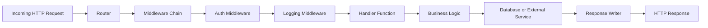

### 2.1. Advantages for Backend Systems

- **High Throughput:** Optimized for network applications and concurrent tasks.
- **Simplicity in Deployment:** Compiled binaries make deployment straightforward.
- **Robust Ecosystem:** A mature standard library combined with a growing number of frameworks.
- **Scalability:** Native constructs facilitate the design of highly scalable architectures.

---

## 3. Popular Go Backend Frameworks

There are several frameworks available for Go that cater to various development needs. Let’s explore some of the most popular ones:

### 3.1. Beego

**Beego** is a full-featured MVC framework that provides an integrated environment for building web applications and RESTful APIs.

#### Key Features:

- **Modular Design:** Supports MVC architecture, ORM, and built-in session management.
- **Auto-Routing:** Simplifies URL mapping.
- **Built-in Tools:** Includes code generation, performance monitoring, and logging.

#### Example: A Simple Beego API

```go
package main

import (
  "github.com/astaxie/beego"
)

// MainController handles HTTP requests.
type MainController struct {
  beego.Controller
}

func (c *MainController) Get() {
  c.Data["json"] = map[string]string{"message": "Hello from Beego!"}
  c.ServeJSON()
}

func main() {
  // Route configuration
  beego.Router("/", &MainController{})
  // Start the Beego application
  beego.Run()
}
```

### 3.2. Gin

**Gin** is a fast, minimalist web framework designed for building high-performance APIs. It is well-known for its speed and efficiency.

#### Key Features:

- **Middleware Support:** Easily add middleware for logging, error handling, etc.
- **Routing:** Efficient HTTP routing with a simple API.
- **JSON Validation:** Built-in support for JSON binding and validation.

#### Example: A Basic Gin REST API

```go
package main

import (
  "net/http"

  "github.com/gin-gonic/gin"
)

func main() {
  router := gin.Default()

  // Define a GET endpoint
  router.GET("/hello", func(c *gin.Context) {
    c.JSON(http.StatusOK, gin.H{"message": "Hello from Gin!"})
  })

  // Start the server on port 8080
  router.Run(":8080")
}
```

### 3.3. Echo

**Echo** is another minimalist web framework with a focus on high performance and simplicity. It is known for its expressive API and middleware support.

#### Key Features:

- **HTTP/2 Support:** Built-in support for HTTP/2.
- **Extensible Middleware:** Easily extend the framework with custom middleware.
- **Robust Routing:** Dynamic routing and grouping of routes.

#### Example: A Simple Echo API

```go
package main

import (
  "net/http"

  "github.com/labstack/echo/v4"
)

func main() {
  e := echo.New()

  // Define a GET endpoint
  e.GET("/hello", func(c echo.Context) error {
    return c.JSON(http.StatusOK, map[string]string{"message": "Hello from Echo!"})
  })

  // Start the server on port 8080
  e.Logger.Fatal(e.Start(":8080"))
}
```

### 3.4. Fiber

**Fiber** is inspired by Express.js (Node.js) and is designed for ease of use and high performance. Its API is simple, making it an attractive option for developers familiar with JavaScript frameworks.

#### Key Features:

- **Minimalistic and Fast:** Optimized for speed with a lightweight core.
- **Express-Like API:** Familiar syntax for developers transitioning from Node.js.
- **Middleware Ecosystem:** Supports a wide range of middleware for various tasks.

#### Example: A Fiber API Example

```go
package main

import (
  "github.com/gofiber/fiber/v2"
)

func main() {
  app := fiber.New()

  app.Get("/hello", func(c *fiber.Ctx) error {
    return c.JSON(fiber.Map{"message": "Hello from Fiber!"})
  })

  app.Listen(":8080")
}
```

### 3.5. Revel

**Revel** is one of the older Go web frameworks and follows a high-productivity, full-stack development approach. It includes a robust set of features out-of-the-box.

#### Key Features:

- **Convention Over Configuration:** Reduces boilerplate code.
- **Built-In Hot Code Reload:** Speeds up the development process.
- **Full-Stack Features:** Comes with its own web server, templating engine, and more.

#### Example: A Basic Revel Controller

```go
package controllers

import "github.com/revel/revel"

// App is the main controller.
type App struct {
  *revel.Controller
}

// Index action returns a greeting.
func (c App) Index() revel.Result {
  return c.RenderText("Hello from Revel!")
}
```

_Note: Revel projects have a specific structure and are typically generated using the Revel command-line tool._

---

## 4. Comparing Go Backend Frameworks

Each framework offers unique advantages. Here’s a high-level comparison:

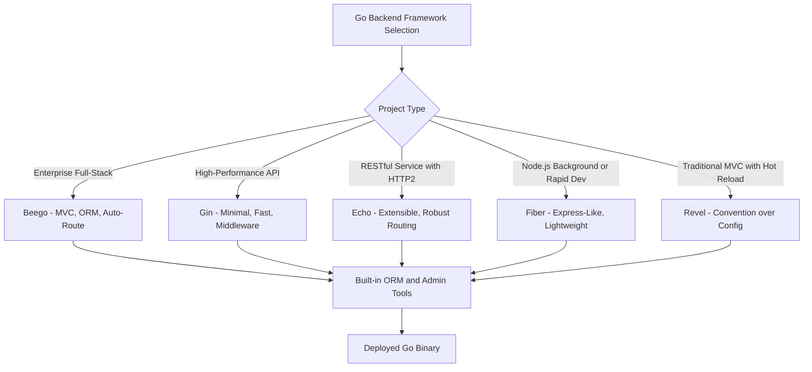

| Framework | Philosophy                    | Strengths                             | Use Cases                                    |
| --------- | ----------------------------- | ------------------------------------- | -------------------------------------------- |
| **Beego** | Full-featured MVC             | Integrated tools, auto-routing, ORM   | Enterprise applications, full-stack web apps |
| **Gin**   | Minimalist, high-performance  | Speed, middleware support, simplicity | APIs, microservices, real-time applications  |
| **Echo**  | Express-inspired, extensible  | Robust routing, HTTP/2, middleware    | RESTful APIs, scalable web services          |
| **Fiber** | Lightweight, Express-like     | Ease of use, high throughput          | Rapid development, Node.js migration         |
| **Revel** | Convention over configuration | Hot reload, full-stack capabilities   | Rapid prototyping, traditional MVC web apps  |

When choosing a framework, consider factors such as performance requirements, ease of use, community support, and project complexity.

---

## 5. Best Practices for Building Go Backend Services

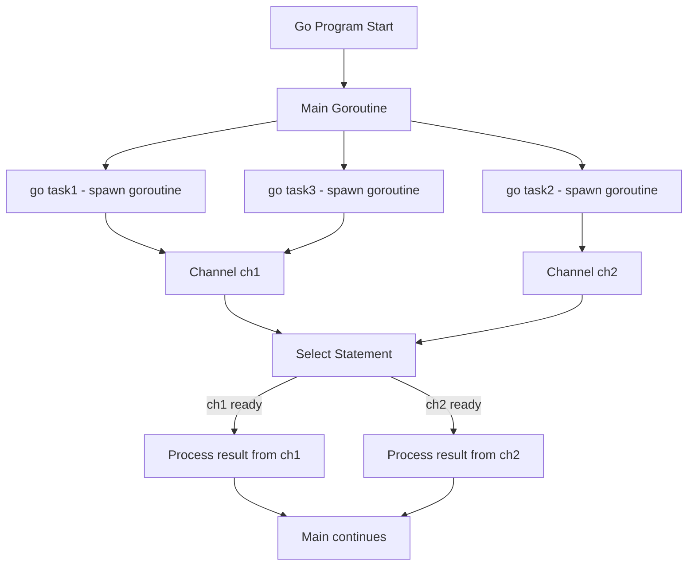

### 5.1. Code Organization and Modularity

- **Package Structure:** Organize your code into packages (e.g., controllers, models, services) to enhance maintainability.
- **Modularity:** Use Go modules to manage dependencies and ensure reproducible builds.

### 5.2. Performance Optimization

- **Profiling:** Use Go’s built-in pprof tool to profile CPU and memory usage.
- **Concurrency:** Leverage goroutines and channels to handle concurrent tasks efficiently.
- **Caching:** Implement caching strategies (in-memory, Redis, etc.) to reduce database load.

### 5.3. Security Considerations

- **Input Validation:** Always validate and sanitize input to prevent common vulnerabilities.
- **HTTPS:** Ensure secure communication by using TLS.
- **Error Handling:** Implement robust error handling and logging.

### 5.4. Testing and Continuous Integration

- **Unit Testing:** Write unit tests for your functions using Go’s testing package.
- **Integration Testing:** Test your API endpoints and database interactions.
- **CI/CD Pipelines:** Automate testing and deployment to catch issues early.

---

## 6. Advanced Topics in Go Backend Development

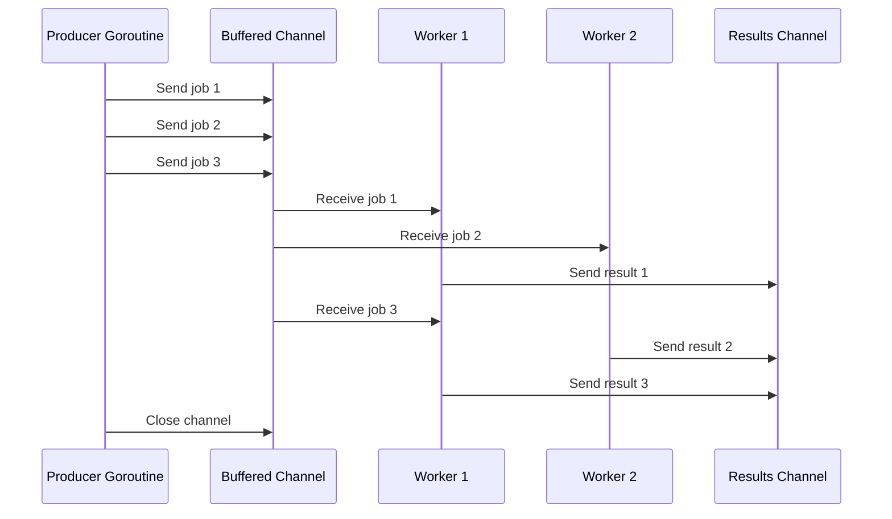

### 6.1. Microservices Architecture

Go’s efficiency and simplicity make it an excellent choice for microservices:

- **Service Isolation:** Build small, independent services that communicate via APIs.
- **Scalability:** Deploy services independently and scale horizontally.
- **Inter-Service Communication:** Use gRPC or REST for communication between services.

### 6.2. Concurrency and Parallelism

- **Goroutines:** Launch thousands of lightweight goroutines for concurrent tasks.
- **Channels:** Use channels for safe communication between goroutines.
- **Worker Pools:** Implement worker pools to manage task execution efficiently.

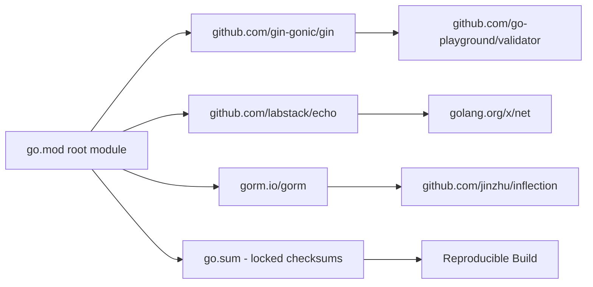

### 6.3. Cloud-Native Development

- **Containerization:** Package your Go applications in Docker containers for consistent deployment.
- **Orchestration:** Use Kubernetes to manage, scale, and monitor your microservices.
- **Serverless:** Explore serverless options like AWS Lambda with Go support for event-driven applications.

---

## 7. Request Lifecycle in a Gin Application

Understanding the full lifecycle from incoming TCP connection to response helps with debugging and optimization:

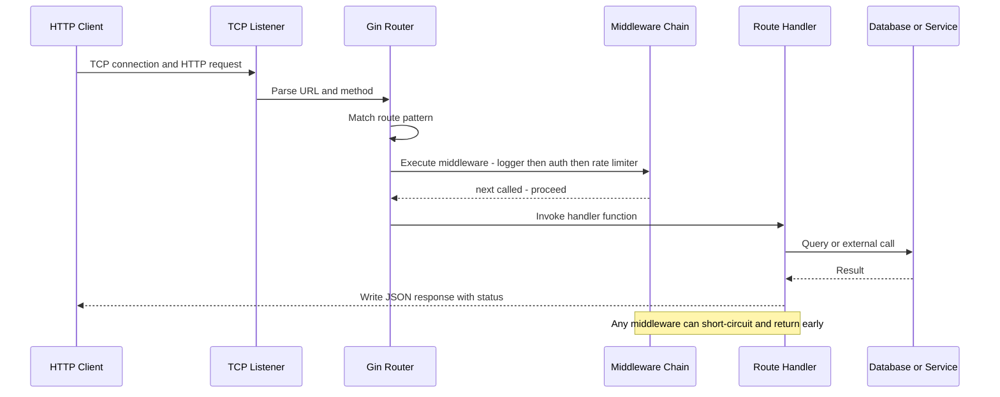

---

## 8. Go Error Handling Pattern

Go uses explicit error return values rather than exceptions, which creates a predictable control flow:

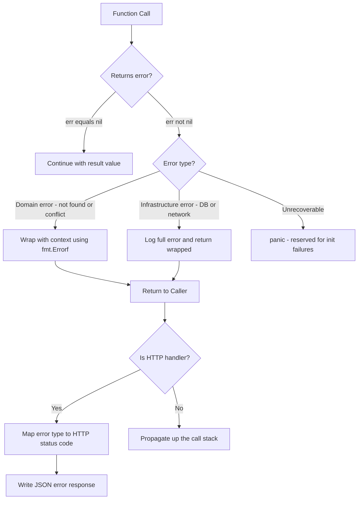

---

## 9. Microservices Communication in Go

Go services commonly combine synchronous and asynchronous communication depending on the operation:

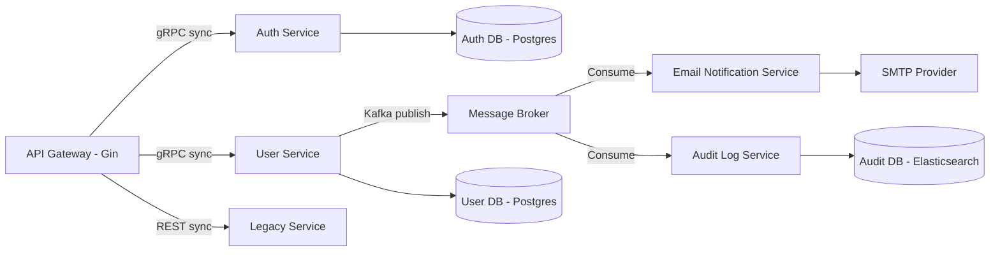

---

## 10. Go Application State Machine

A typical long-running Go service transitions through well-defined states from startup to graceful shutdown:

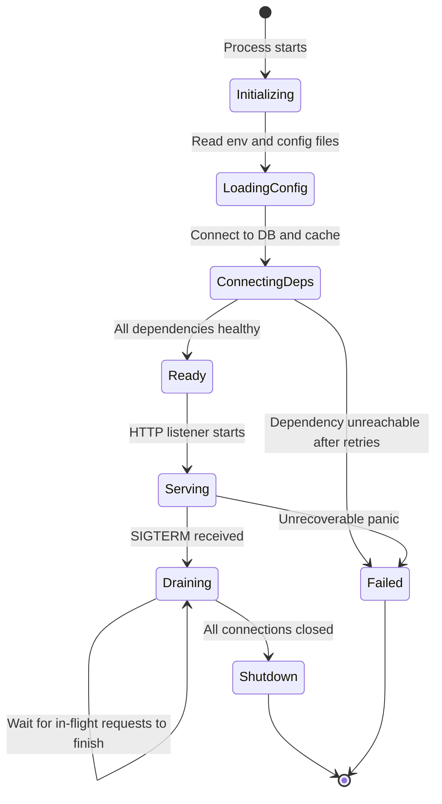

---

## 11. Go Generics Patterns

Go 1.18 introduced generics (type parameters), enabling reusable data structures and functions without sacrificing type safety or runtime performance.

```go
// Generic Result type — eliminates error-or-value boilerplate
package result

type Result[T any] struct {
  value T
  err   error
}

func Ok[T any](v T) Result[T]  { return Result[T]{value: v} }
func Err[T any](e error) Result[T] { return Result[T]{err: e} }

func (r Result[T]) Unwrap() (T, error) { return r.value, r.err }

func (r Result[T]) Map[U any](fn func(T) U) Result[U] {
  if r.err != nil {
    return Err[U](r.err)
  }
  return Ok(fn(r.value))
}
```

```go
// Generic pagination helper — works with any slice element type
package paginate

type Page[T any] struct {
  Items      []T `json:"items"`
  Total      int `json:"total"`
  PageNumber int `json:"page"`
  PageSize   int `json:"pageSize"`
}

func Paginate[T any](items []T, page, size int) Page[T] {
  total := len(items)
  start := (page - 1) * size
  if start >= total {
    return Page[T]{Items: []T{}, Total: total, PageNumber: page, PageSize: size}
  }
  end := start + size
  if end > total {
    end = total
  }
  return Page[T]{Items: items[start:end], Total: total, PageNumber: page, PageSize: size}
}
```

Use it in a Gin handler with no type assertions:

```go
router.GET("/users", func(c *gin.Context) {
  page, _ := strconv.Atoi(c.DefaultQuery("page", "1"))
  size, _ := strconv.Atoi(c.DefaultQuery("size", "20"))
  allUsers := userService.List()
  c.JSON(http.StatusOK, paginate.Paginate(allUsers, page, size))
})
```

---

## 12. Context Propagation and Cancellation

Go’s `context.Context` is the canonical mechanism for passing deadlines, cancellation signals, and request-scoped values through the call chain. Ignoring context is a common source of resource leaks.

```go
// Correct: propagate context to all downstream calls
func (s *UserService) GetByID(ctx context.Context, id int) (*User, error) {
  // ctx carries the HTTP request deadline
  row := s.db.QueryRowContext(ctx, "SELECT id, name, email FROM users WHERE id = $1", id)

  var u User
  if err := row.Scan(&u.ID, &u.Name, &u.Email); err != nil {
    if errors.Is(err, sql.ErrNoRows) {
      return nil, ErrNotFound
    }
    return nil, fmt.Errorf("GetByID: %w", err)
  }
  return &u, nil
}

// Gin handler — pass request context to service
func (h *UserHandler) Get(c *gin.Context) {
  id, err := strconv.Atoi(c.Param("id"))
  if err != nil {
    c.JSON(http.StatusBadRequest, gin.H{"error": "invalid id"})
    return
  }

  user, err := h.service.GetByID(c.Request.Context(), id)
  if errors.Is(err, ErrNotFound) {
    c.JSON(http.StatusNotFound, gin.H{"error": "user not found"})
    return
  }
  if err != nil {
    c.JSON(http.StatusInternalServerError, gin.H{"error": "internal error"})
    return
  }
  c.JSON(http.StatusOK, user)
}
```

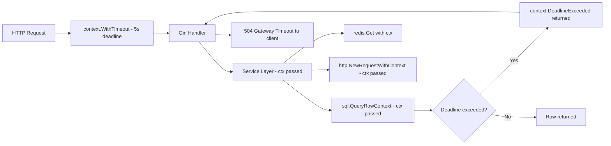

---

## 13. Structured Logging with slog

Go 1.21 introduced `log/slog`, the standard library’s structured logging package. It replaces ad-hoc `fmt.Println` and third-party loggers for most use cases.

```go
package main

import (
  "context"
  "log/slog"
  "os"
)

func main() {
  // JSON handler for production (parsed by log aggregators)
  logger := slog.New(slog.NewJSONHandler(os.Stdout, &slog.HandlerOptions{
    Level: slog.LevelInfo,
  }))
  slog.SetDefault(logger)

  // Structured log with key-value pairs
  slog.Info("server starting", "port", 8080, "env", "production")
}
```

```go
// Middleware that adds request ID and latency to every log line
func SlogMiddleware(logger *slog.Logger) gin.HandlerFunc {
  return func(c *gin.Context) {
    start := time.Now()
    reqID := uuid.New().String()

    // Store logger with request context in Gin context
    ctx := context.WithValue(c.Request.Context(), ctxKeyLogger, logger.With(
      "request_id", reqID,
      "method", c.Request.Method,
      "path", c.Request.URL.Path,
    ))
    c.Request = c.Request.WithContext(ctx)

    c.Next()

    LoggerFromCtx(ctx).Info("request completed",
      "status", c.Writer.Status(),
      "latency_ms", time.Since(start).Milliseconds(),
      "client_ip", c.ClientIP(),
    )
  }
}
```

Sample JSON output (easy to ship to Loki or Datadog):

```json
{
  "time": "2025-03-19T14:22:01Z",
  "level": "INFO",
  "msg": "request completed",
  "request_id": "f3c2a1b0-...",
  "method": "GET",
  "path": "/api/v1/users/42",
  "status": 200,
  "latency_ms": 12,
  "client_ip": "10.0.0.5"
}
```

---

## 14. Benchmarking and Profiling

Go ships with first-class benchmarking and profiling tools in the standard library. Never guess about performance — measure it.

```go
// user_service_test.go
func BenchmarkGetByID(b *testing.B) {
  svc := setupTestService(b)
  ctx := context.Background()
  b.ResetTimer()

  for i := 0; i < b.N; i++ {
    _, _ = svc.GetByID(ctx, 1)
  }
}
```

```bash
# Run benchmark with memory allocation stats
go test -bench=BenchmarkGetByID -benchmem -count=5 ./...

# Profile CPU usage during a load test
go tool pprof -http=:6060 http://localhost:8080/debug/pprof/profile?seconds=30
```

Expose pprof endpoints in non-production builds:

```go
import _ "net/http/pprof" // registers handlers on http.DefaultServeMux

go func() {
  // Only bind to localhost — never expose to the internet
  if err := http.ListenAndServe("localhost:6060", nil); err != nil {
    slog.Error("pprof server failed", "err", err)
  }
}()
```

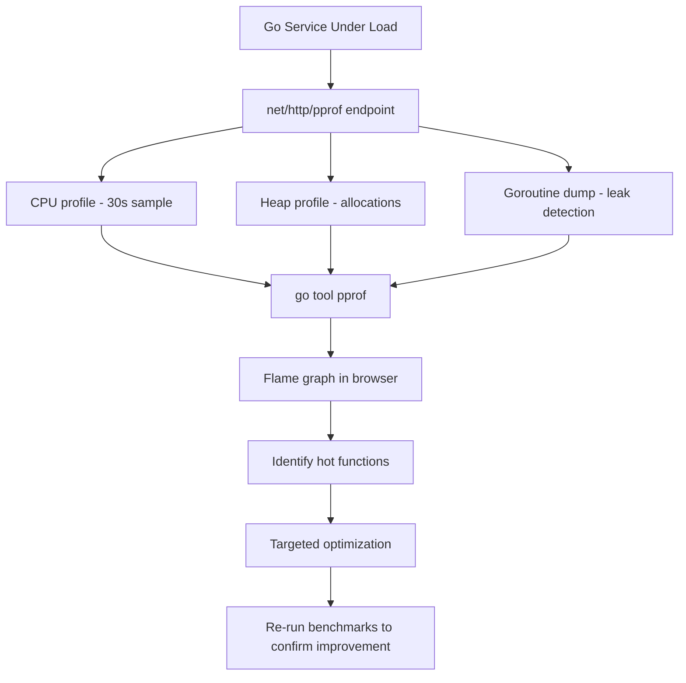

### 14.1. Anti-Patterns to Avoid in Go

- **Goroutine leaks.** Always ensure goroutines can exit. Pass a context or close channel to signal termination.
- **Copying a `sync.Mutex`** after first use — always pass mutexes by pointer or embed them in a struct.
- **Using `panic` for expected errors.** Panics are for unrecoverable programmer errors. Use explicit error returns for business logic failures.
- **Ignoring errors with `_`.** Every ignored error is a potential silent failure. If you truly do not care, add a comment explaining why.
- **Global state in packages.** Prefer dependency injection over package-level variables. Global state makes tests flaky and services hard to scale.

---

## 15. Conclusion

Go’s simplicity, performance, and native support for concurrency make it a powerful choice for backend development. Whether you choose a full-featured framework like Beego or a minimalist, high-performance framework like Gin, Echo, or Fiber, Go provides the tools and ecosystem to build scalable and robust web applications. By following best practices in code organization, performance optimization, and security, you can harness the full potential of Go for your backend projects.

**Key Takeaways:**

- Generics (Go 1.18+) enable type-safe, reusable utilities like pagination helpers and Result types without sacrificing performance.
- Always propagate `context.Context` through every I/O call — it is the contract for timeouts and cancellation in Go.
- Adopt `log/slog` for structured JSON logging. Log aggregators like Loki and Datadog ingest structured logs far more efficiently than plain text.
- Use `go test -bench` and `pprof` before and after any optimization. Flame graphs from pprof are the fastest way to find bottlenecks.
- Choose your framework based on project needs: Gin for high-throughput APIs, Echo for HTTP/2 and extensibility, Fiber for teams migrating from Express.js, Beego for full-stack enterprise apps.

---

## 16. Further Reading

- **Go Official Documentation:** [https://golang.org/doc/](https://golang.org/doc/)
- **Beego Framework:** [https://beego.me/](https://beego.me/)
- **Gin Web Framework:** [https://github.com/gin-gonic/gin](https://github.com/gin-gonic/gin)
- **Echo Web Framework:** [https://echo.labstack.com/](https://echo.labstack.com/)
- **Fiber Web Framework:** [https://gofiber.io/](https://gofiber.io/)
- **Revel Framework:** [https://revel.github.io/](https://revel.github.io/)
- **Go by Example:** [https://gobyexample.com/](https://gobyexample.com/)
- **Effective Go:** [https://golang.org/doc/effective_go.html](https://golang.org/doc/effective_go.html)

Happy coding, and may your journey with Go lead you to build high-performance, scalable backend systems!
