import MdxLayout from "@/components/MdxLayout";

export const metadata = {
  title:
    "Graph Neural Networks for Social Network Analysis: A Comprehensive Guide",
  description:
    "An exhaustive deep-dive analysis into Graph Neural Networks for social network analysis, with theoretical foundations, model architectures, advanced training strategies, and more.",
  topics: [
    "Artificial Intelligence",
    "Machine Learning",
    "Graph Neural Networks",
    "Social Network Analysis",
    "Deep Learning",
  ],
};

export default function GNNArticle({ children }) {
  return <MdxLayout>{children}</MdxLayout>;
}

# Graph Neural Networks for Social Network Analysis: A Comprehensive Guide

### Author: Son Nguyen

> Date: 2025-03-28

Graph Neural Networks (GNNs) have emerged as a powerful tool to analyze and interpret relational data, making them ideally suited for social network analysis. From identifying influential individuals to detecting communities and predicting link formations, GNNs unlock insights hidden within the complex structures of social interactions. This article provides an exhaustive exploration of GNNs applied to social network analysis, covering theoretical foundations, detailed data preparation, model architectures, advanced training strategies, evaluation methodologies, and key deployment considerations. Whether you are a researcher or an industry practitioner, this guide serves as an essential reference to harness the full potential of graph-based learning.

---

## 1. Introduction

### 1.1. The Role of Social Network Analysis

Social networks form the backbone of modern communication, influencing everything from marketing campaigns to political opinions. With billions of users interacting across various platforms, understanding these networks has become critical to:

- **Identify Influencers:** Pinpoint key individuals who drive trends and opinions.
- **Community Detection:** Uncover latent groups or clusters within a network.
- **Predictive Analytics:** Forecast future interactions, relationships, and behavior trends.
- **Anomaly Detection:** Recognize outliers or abnormal patterns indicating fraudulent activities.

### 1.2. Emergence of Graph Neural Networks

Traditional methods in social network analysis relied on statistical and heuristic-based approaches. However, as networks grew in size and complexity, these methods struggled to capture non-linear relationships. GNNs address this limitation by:

- **Integrating Node and Edge Information:** Learning rich representations that encapsulate both features and connectivity.
- **End-to-End Training:** Allowing for seamless integration of feature extraction and predictive modeling.
- **Scalability:** Extending from small networks to massive graphs with millions of nodes and edges.

---

## 2. Theoretical Foundations of Graph Neural Networks

### 2.1. Basic Concepts and Terminology

A graph is defined by a set of nodes (V) and edges (E), where nodes represent entities (such as people in a social network) and edges capture the relationships between them. Key terms include:

- **Node Features:** Attributes or embeddings representing the properties of each entity.
- **Edge Features:** Information associated with the connection between nodes, such as interaction frequency.
- **Adjacency Matrix:** A matrix representation of the graph structure that indicates which nodes are connected.

### 2.2. Core GNN Architectures

Several popular GNN architectures have been developed, each with unique advantages:

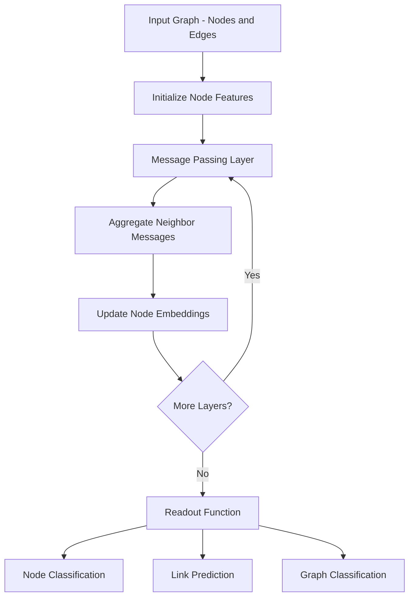

- **Graph Convolutional Networks (GCN):** Propagate features through a graph by aggregating information from a node's neighbors.
- **Graph Attention Networks (GAT):** Use attention mechanisms to weight the importance of neighboring nodes, enhancing feature aggregation.
- **GraphSAGE:** A sampling-based approach that generates node embeddings by aggregating neighborhood information using various functions (such as mean, LSTM, or pooling).
- **Message Passing Neural Networks (MPNN):** Provide a general framework for the exchange of messages among nodes in the graph.

### 2.3. Mathematical Foundations

At the heart of GNNs lies the concept of neighborhood aggregation. For example, a simplified update equation in a GCN layer is:

H(l+1) = sigma( D*tilde^(-1/2) * A*tilde * D*tilde^(-1/2) * H(l) \_ W(l) )

Where:

- A_tilde = A + I is the adjacency matrix with self-loops,
- D_tilde is the degree matrix,
- H(l) is the node feature matrix at layer l,
- W(l) is the weight matrix at layer l, and
- sigma represents the activation function.

This formulation underpins how GCNs iteratively update node representations by leveraging both the node features and the structure of the graph.

---

## 3. Data Preparation and Graph Construction

### 3.1. Data Acquisition for Social Network Analysis

Social network data can be acquired from various sources:

- **Public Social Media Datasets:** Collections from platforms like Twitter and Facebook.
- **Citation Networks:** Data representing collaborations among researchers.
- **E-commerce Networks:** User-product interaction data.
- **Custom Crawled Data:** Specific datasets gathered via APIs and web scraping.

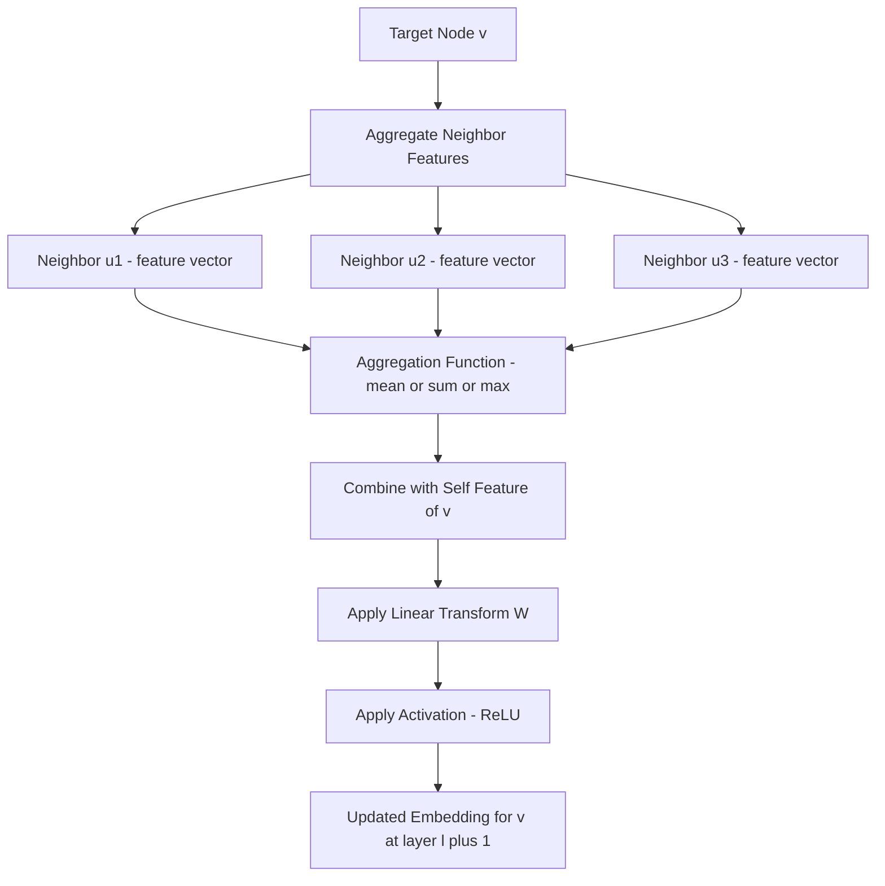

### 3.2. Graph Construction

Transforming raw data into a graph structure requires several steps:

- **Node Identification:** Define the entities, such as users or posts.
- **Edge Definition:** Establish relationships based on interactions like friendships, likes, or retweets.
- **Feature Engineering:** Generate useful attributes for nodes and edges, ranging from demographic data to behavioral metrics.

#### Example: Building a Graph Using NetworkX

```python
import networkx as nx

# Initialize an empty graph
G = nx.Graph()

# Add nodes with attributes
G.add_node("user_1", age=25, location="New York")
G.add_node("user_2", age=30, location="San Francisco")

# Add an edge representing a friendship
G.add_edge("user_1", "user_2", interaction_count=15)

# Visualize basic information about the graph
print(nx.info(G))
```

### 3.3. Data Normalization and Splitting

To ensure that node features are on a comparable scale, use data normalization techniques such as:

- **Z-Score Normalization:** Standardize features to have a mean of zero and a standard deviation of one.
- **Min-Max Scaling:** Scale features to a fixed range, typically [0, 1].
- **Data Splitting:** Partition the graph into training, validation, and test sets while preserving the underlying network structure. This is often achieved using random edge or node sampling.

---

## 4. Model Architectures and Advanced Training Strategies

### 4.1. Selecting the Right GNN Architecture

Choosing the appropriate GNN architecture depends on the specific task:

- **Node Classification:** GCNs and GraphSAGE are effective for aggregating neighborhood information.
- **Link Prediction:** GATs, which leverage attention mechanisms, help emphasize the most relevant connections.
- **Community Detection:** Hybrid models or unsupervised GNNs (such as variational graph autoencoders) are often well-suited for this task.

### 4.2. Hyperparameter Tuning

Critical hyperparameters that affect GNN performance include:

- **Number of Layers:** More layers can capture deeper structural information, though too many may lead to over-smoothing of node features.
- **Learning Rate:** Typically set in the range of 0.001 to 0.01 for fine-tuning GNNs.
- **Dropout Rate:** Commonly between 0.2 and 0.5, applied to mitigate overfitting.
- **Weight Decay:** Acts as a regularization term to prevent the model from overfitting.
- **Hidden Dimensionality:** Determines the size of the node embeddings, striking a balance between expressiveness and computational efficiency.

### 4.3. Advanced Training Techniques

To further enhance performance, consider these training strategies:

- **Layer-Wise Training:** Optionally freeze earlier layers to preserve foundational representations.
- **Graph Sampling Techniques:** Use mini-batch approaches, such as those in GraphSAGE, to efficiently train on large graphs.
- **Dynamic Graphs:** Incorporate methods that account for temporal changes when the network evolves over time.

---

## 5. Implementation: End-to-End GNN Workflow Using PyTorch Geometric

This section provides a practical implementation using PyTorch Geometric, a widely used library for graph deep learning.

### 5.1. Environment Setup

Install the required packages:

```bash
pip install torch torch-geometric torch-scatter torch-sparse
```

### 5.2. Preparing Data with PyTorch Geometric

Assuming the graph data has been constructed and saved in an edge list format, here is an example of loading and processing a graph:

```python
import torch
from torch_geometric.data import Data
import numpy as np

# Example edge list: list of [source, target] pairs
edge_index = torch.tensor([[0, 1, 1, 2],
                           [1, 0, 2, 1]], dtype=torch.long)

# Example node features: 3 nodes with 4 features each
x = torch.tensor(np.random.randn(3, 4), dtype=torch.float)

# Create a Data object for PyTorch Geometric
data = Data(x=x, edge_index=edge_index)
```

### 5.3. Building a Simple GCN Model

Below is an example implementation of a basic Graph Convolutional Network using PyTorch Geometric.

```python
import torch.nn.functional as F
from torch_geometric.nn import GCNConv

class GCN(torch.nn.Module):
    def __init__(self, num_features, hidden_channels, num_classes):
        super(GCN, self).__init__()
        self.conv1 = GCNConv(num_features, hidden_channels)
        self.conv2 = GCNConv(hidden_channels, num_classes)

    def forward(self, data):
        x, edge_index = data.x, data.edge_index
        x = self.conv1(x, edge_index)
        x = F.relu(x)
        x = F.dropout(x, training=self.training)
        x = self.conv2(x, edge_index)
        return F.log_softmax(x, dim=1)

# Initialize model, optimizer, and loss function
model = GCN(num_features=4, hidden_channels=16, num_classes=3)
optimizer = torch.optim.Adam(model.parameters(), lr=0.01, weight_decay=5e-4)
criterion = torch.nn.NLLLoss()
```

### 5.4. Training and Evaluation Loop

Develop a training loop that logs accuracy and loss metrics.

```python
def train():
    model.train()
    optimizer.zero_grad()
    out = model(data)
    # Assume labels for a node classification task are provided
    labels = torch.tensor([0, 1, 2], dtype=torch.long)
    loss = criterion(out, labels)
    loss.backward()
    optimizer.step()
    return loss.item()

def test():
    model.eval()
    out = model(data)
    pred = out.argmax(dim=1)
    correct = pred.eq(torch.tensor([0, 1, 2])).sum().item()
    accuracy = correct / data.num_nodes
    return accuracy

for epoch in range(1, 201):
    loss = train()
    if epoch % 20 == 0:
        acc = test()
        print(f"Epoch {epoch:03d}, Loss: {loss:.4f}, Accuracy: {acc:.4f}")
```

---

## 6. In-Depth Evaluation, Error Analysis, and Interpretability

### 6.1. Evaluation Metrics

Evaluate your GNN using multiple metrics:

- **Accuracy:** For overall prediction performance on node or link tasks.
- **Precision, Recall, and F1 Score:** Particularly important for imbalanced class distributions.
- **Area Under the ROC Curve (AUC):** Useful for binary classification tasks.
- **Confusion Matrix:** Provides a detailed breakdown of classification errors.

### 6.2. Error Analysis

Conduct detailed error analysis to improve model robustness:

- **Inspect Misclassified Nodes:** Visually and statistically analyze nodes that the model misclassifies.
- **Analyze Neighborhood Structure:** Determine whether overly sparse or densely connected nodes affect performance.
- **Iterative Retraining:** Adjust data sampling, augmentation strategies, or model parameters based on identified error patterns.

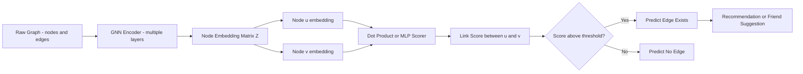

### 6.3. Model Interpretability

Improving model interpretability builds trust in predictions:

- **Attention Mechanisms:** In models like GAT, visualize attention weights to understand the importance of various node connections.
- **Feature Importance:** Use techniques such as integrated gradients or perturbation methods to assess which node features most influence the model’s decisions.
- **Visualization Tools:** Employ graph plotting libraries (such as Gephi or built-in PyTorch Geometric utilities) to visualize node embeddings and cluster boundaries.

---

## 7. Deployment and Production Considerations

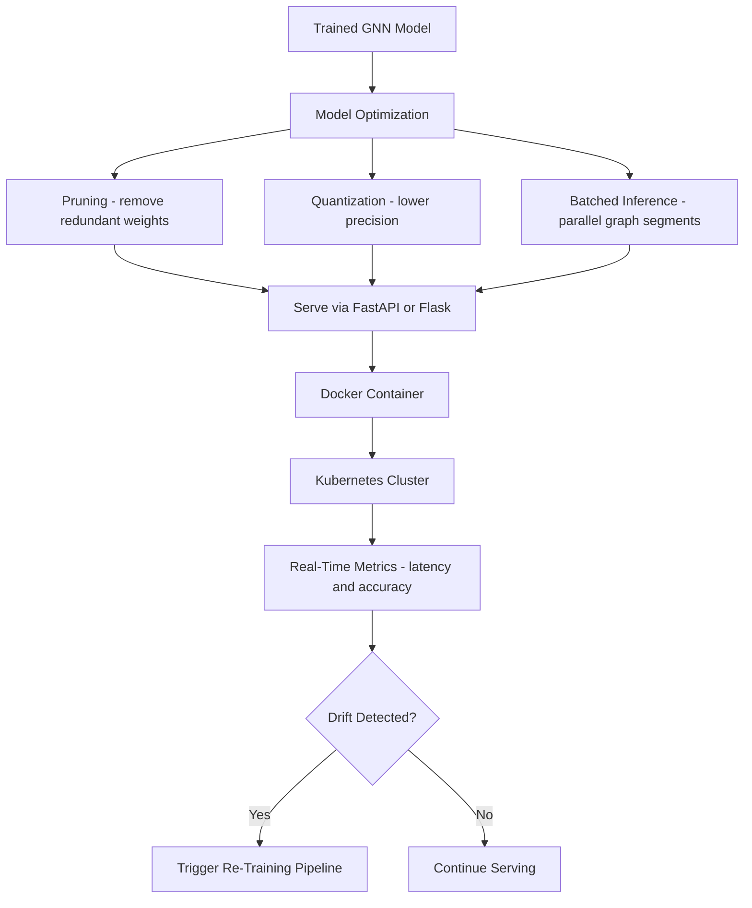

### 7.1. Model Optimization for Inference

Before deploying your GNN, consider optimization techniques:

- **Model Pruning:** Remove redundant parameters to accelerate inference.
- **Quantization:** Lower the numerical precision of model weights to reduce memory usage without compromising performance.
- **Batched Inference:** Process multiple graph segments simultaneously to improve throughput.

### 7.2. Integration into Existing Pipelines

Deploy your GNN model as part of broader production systems:

- **RESTful APIs:** Wrap the model in an API using frameworks like FastAPI or Flask.
- **Containerization:** Use Docker to encapsulate your model for easy deployment in cloud or edge environments.
- **Scalable Architecture:** Leverage orchestration tools such as Kubernetes to manage distributed inference services.

### 7.3. Monitoring and Maintenance

Implement continuous monitoring to ensure the deployed model remains robust:

- **Real-Time Metrics:** Track latency, throughput, and accuracy continuously.
- **Feedback Systems:** Set up mechanisms to gather user and system feedback, triggering re-training when necessary.
- **A/B Testing:** Roll out model updates gradually and compare performance to validate improvements.

---

## 8. Advanced Topics and Future Directions

### 8.1. Dynamic and Temporal Graphs

Many social networks are inherently dynamic. Emerging methods address temporal changes by:

- Incorporating time as an additional dimension in Temporal GNNs.
- Applying streaming graph processing techniques to update node embeddings in real time as new data arrives.

### 8.2. Multimodal Social Network Analysis

Integrating non-graph data can provide richer insights:

- Merging textual posts or profile images with graph features.
- Combining multiple social networks to obtain a comprehensive view of interactions.

### 8.3. Unsupervised and Self-Supervised Learning

Reduce reliance on labeled data through:

- Using graph autoencoders to learn node embeddings by reconstructing graph structures.
- Implementing contrastive learning techniques to generate robust representations by maximizing mutual information.

### 8.4. Ethical Considerations in Social Network Analysis

When deploying GNNs, consider the following:

- **Bias Mitigation:** Continually assess and reduce biases inherent in social data.
- **Privacy Preservation:** Apply differential privacy techniques to ensure user data remains secure.
- **Transparency and Accountability:** Provide clear documentation and interpretability reports for stakeholders.

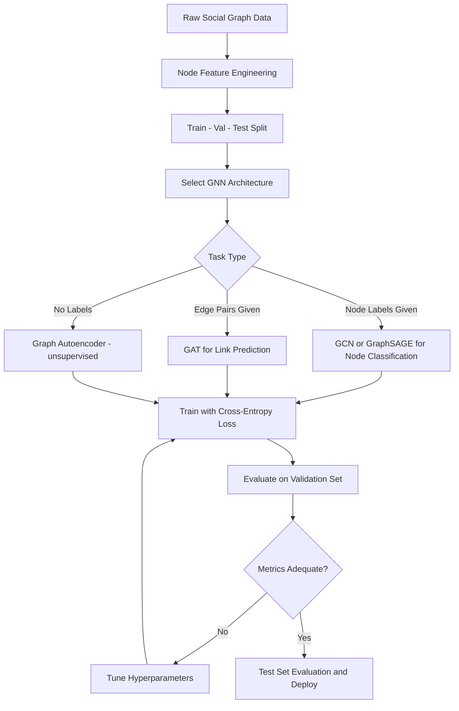

---

## 9. GCN vs GAT vs GraphSAGE Comparison

Each architecture aggregates neighborhood information differently, which affects expressiveness and scalability:

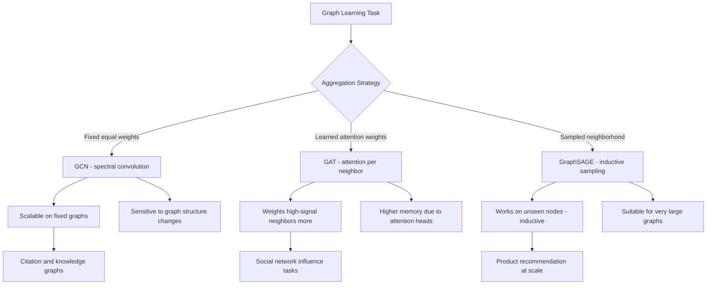

---

## 10. Community Detection Workflow

Identifying communities in a social graph requires a different pipeline than supervised node classification:

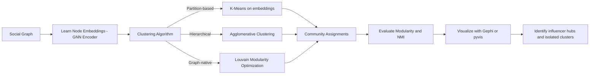

---

## 11. Temporal GNN Update Cycle

Dynamic social networks require periodic re-embedding as new edges and nodes appear:

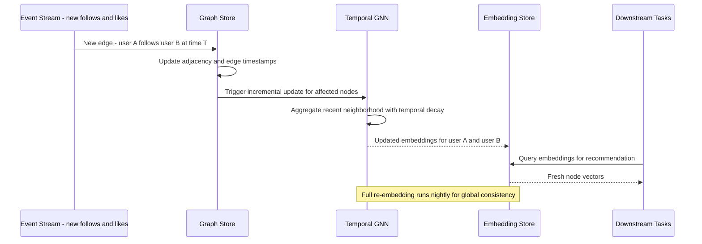

---

## 12. Graph Data Augmentation Strategies

Augmenting graph data during training improves robustness and reduces overfitting:

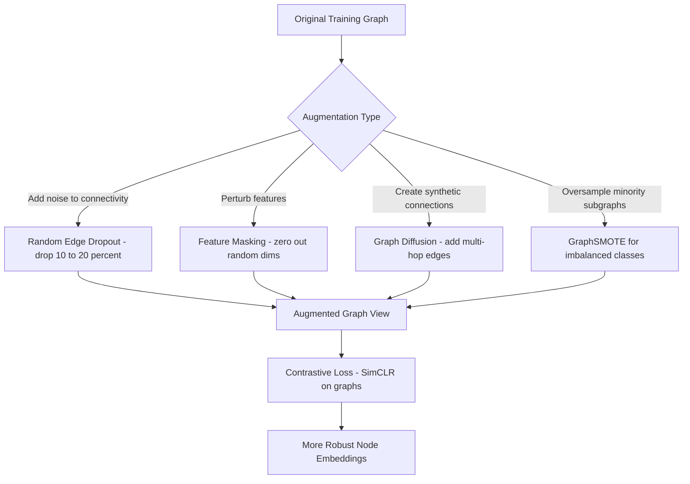

---

## 13. Heterogeneous Graph Networks

Real-world graphs are rarely homogeneous. Social platforms, knowledge bases, and recommendation systems contain multiple node types (users, posts, hashtags, products) and multiple edge types (follows, likes, authored, purchased). Heterogeneous Graph Networks (HGNs) extend standard GNNs to handle these multi-relational structures.

### 9.1 Relational Graph Convolutional Networks (R-GCN)

R-GCN learns a separate weight matrix per relation type and sums their contributions at each node:

```python
from torch_geometric.nn import RGCNConv
import torch
import torch.nn.functional as F

class RGCN(torch.nn.Module):
    def __init__(self, in_channels, hidden_channels, out_channels, num_relations):
        super().__init__()
        self.conv1 = RGCNConv(in_channels, hidden_channels, num_relations)
        self.conv2 = RGCNConv(hidden_channels, out_channels, num_relations)

    def forward(self, x, edge_index, edge_type):
        x = F.relu(self.conv1(x, edge_index, edge_type))
        x = F.dropout(x, p=0.3, training=self.training)
        return self.conv2(x, edge_index, edge_type)

# num_relations is the number of distinct edge types in your heterogeneous graph
model = RGCN(in_channels=64, hidden_channels=32, out_channels=8, num_relations=5)
```

### 9.2 HGT: Heterogeneous Graph Transformer

HGT uses type-specific projection matrices and attention heads that account for both source node type and edge type, making it effective for knowledge graph completion:

```python
from torch_geometric.nn import HGTConv, Linear
import torch

class HGT(torch.nn.Module):
    def __init__(self, metadata, hidden_channels, out_channels, num_heads, num_layers):
        super().__init__()
        self.lin_dict = torch.nn.ModuleDict()
        for node_type in metadata[0]:
            self.lin_dict[node_type] = Linear(-1, hidden_channels)

        self.convs = torch.nn.ModuleList([
            HGTConv(hidden_channels, hidden_channels, metadata, num_heads)
            for _ in range(num_layers)
        ])
        self.lin = Linear(hidden_channels, out_channels)

    def forward(self, x_dict, edge_index_dict):
        x_dict = {nt: self.lin_dict[nt](x).relu_() for nt, x in x_dict.items()}
        for conv in self.convs:
            x_dict = conv(x_dict, edge_index_dict)
        return self.lin(x_dict["user"])
```

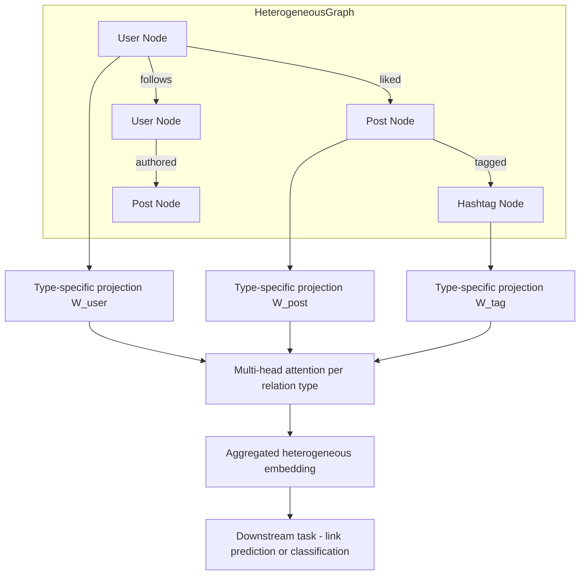

---

## 14. Temporal Graph Neural Networks

Many social graphs evolve continuously: new friendships form, old ones dissolve, and interaction frequency shifts. Temporal GNNs model these dynamics by incorporating time as a first-class feature.

### 14.1. Temporal Graph Attention (TGAT)

TGAT encodes time differences with a functional time encoding and applies attention over a node's temporal neighborhood:

```python
import torch
import numpy as np

class TimeEncoder(torch.nn.Module):
    """Encodes a scalar time delta as a d-dimensional vector using Bochner's theorem."""
    def __init__(self, d_model):
        super().__init__()
        self.W = torch.nn.Linear(1, d_model)

    def forward(self, t):
        # t: (batch, 1) time delta in seconds
        return torch.cos(self.W(t))

class TemporalAttentionLayer(torch.nn.Module):
    def __init__(self, feat_dim, time_dim, n_heads):
        super().__init__()
        self.time_encoder = TimeEncoder(time_dim)
        self.attn = torch.nn.MultiheadAttention(feat_dim + time_dim, n_heads, batch_first=True)

    def forward(self, src_feat, nbr_feats, nbr_times):
        # Encode time deltas for all neighbors
        time_enc = self.time_encoder(nbr_times.unsqueeze(-1))
        # Concatenate node features with time encoding
        nbr_repr = torch.cat([nbr_feats, time_enc], dim=-1)
        query = src_feat.unsqueeze(1)
        out, _ = self.attn(query, nbr_repr, nbr_repr)
        return out.squeeze(1)
```

The following sequence diagram shows how a temporal graph event triggers an incremental embedding update cycle through the memory bank and downstream services:

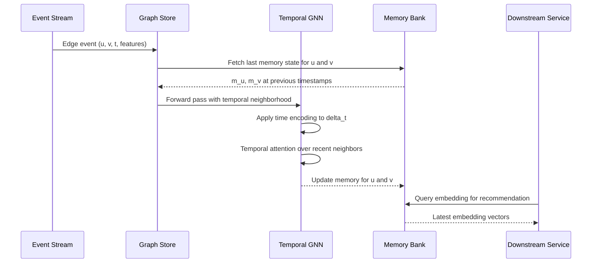

---

## 15. GNN Explainability

Production GNN deployments in sensitive domains (credit scoring, healthcare, content moderation) require interpretable predictions. Three dominant approaches exist.

### 15.1. GNNExplainer

GNNExplainer learns a soft mask over edges and node features to identify the minimal subgraph that most influences a prediction:

```python
from torch_geometric.explain import Explainer, GNNExplainer

explainer = Explainer(
    model=model,
    algorithm=GNNExplainer(epochs=200),
    explanation_type="model",
    node_mask_type="attributes",
    edge_mask_type="object",
    model_config=dict(
        mode="multiclass_classification",
        task_level="node",
        return_type="log_probs",
    ),
)

# Explain prediction for node index 5
explanation = explainer(data.x, data.edge_index, index=5)
print("Top edge mask:", explanation.edge_mask.topk(5).indices)
print("Top feature importance:", explanation.node_mask[5].topk(3).indices)
```

The following diagram shows how each of the three explainability methods produces a human-readable audit artifact:

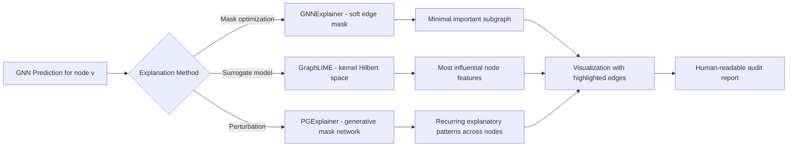

---

## 16. Scaling GNNs to Billion-Node Graphs

Industrial social graphs (LinkedIn, Facebook, Pinterest) contain billions of nodes. Standard full-batch GNN training is infeasible at this scale. Several techniques enable training at planet scale.

### 16.1. Mini-Batch Neighbor Sampling with GraphSAGE

```python
from torch_geometric.loader import NeighborLoader
from torch_geometric.nn import SAGEConv

# Limit neighborhood to 15 nodes at hop 1, 10 at hop 2
loader = NeighborLoader(
    data,
    num_neighbors=[15, 10],
    batch_size=1024,
    input_nodes=data.train_mask,
)

class GraphSAGE(torch.nn.Module):
    def __init__(self, in_channels, hidden_channels, out_channels):
        super().__init__()
        self.conv1 = SAGEConv(in_channels, hidden_channels)
        self.conv2 = SAGEConv(hidden_channels, out_channels)

    def forward(self, x, edge_index):
        x = F.relu(self.conv1(x, edge_index))
        return self.conv2(x, edge_index)

model = GraphSAGE(64, 256, 10)
optimizer = torch.optim.Adam(model.parameters(), lr=1e-3)

for batch in loader:
    optimizer.zero_grad()
    out = model(batch.x, batch.edge_index)
    loss = F.cross_entropy(out[:batch.batch_size], batch.y[:batch.batch_size])
    loss.backward()
    optimizer.step()
```

### 16.2. Cluster-GCN: Graph Partitioning for Scalability

Cluster-GCN partitions the graph into dense subgraphs using METIS or random walk clustering. Each mini-batch processes one cluster, dramatically reducing inter-node communication. The following diagram illustrates this partitioning strategy:

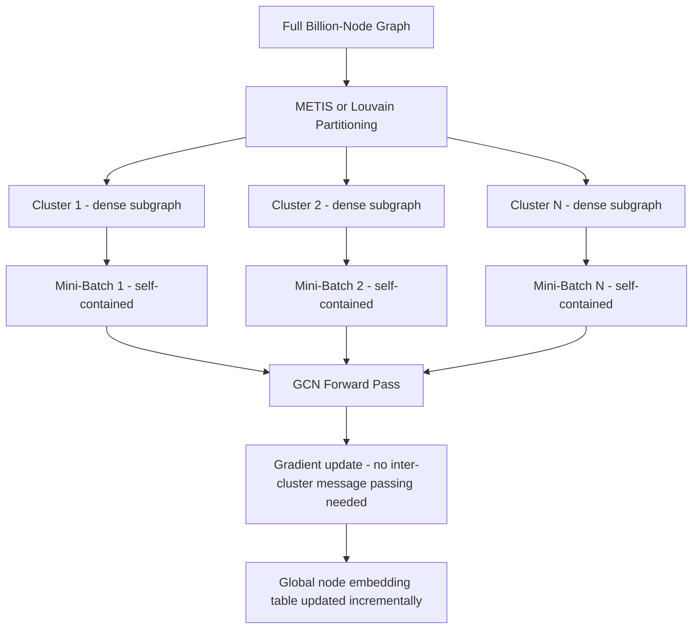

### 16.3. Distributed Training with PyTorch Geometric and DGL

For graphs exceeding a single machine's memory, distributed GNN training partitions node feature tables and edge lists across multiple GPU nodes:

```python
# Pseudocode for DistDGL distributed setup
import dgl
import torch.distributed as dist

dist.init_process_group(backend="nccl")
local_rank = dist.get_rank()

# Each process loads its shard of the graph
graph_shard = dgl.distributed.DistGraph("ogbn-papers100M", part_config="partition.json")
sampler = dgl.dataloading.NeighborSampler([10, 5])
loader = dgl.dataloading.DistNodeDataLoader(
    graph_shard, graph_shard.ndata["train_mask"].nonzero(),
    sampler, batch_size=1000, shuffle=True
)
# Standard training loop proceeds with gradient synchronization via DDP
```

### 16.4. Production GNN Serving Architecture

The following diagram shows the full offline-to-online serving pipeline, from GPU cluster training through feature store and model store to real-time inference and feedback loops:

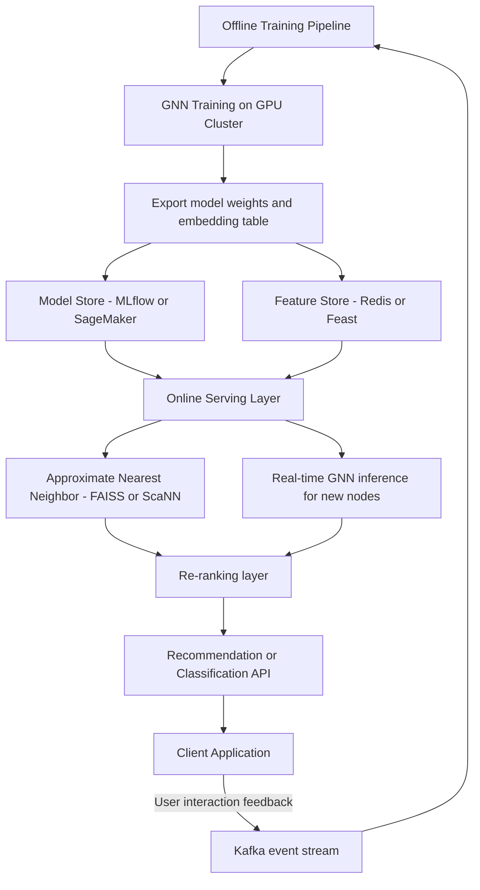

---

## 17. Best Practices for Implementing GNNs

- **Data Quality:** Use high-quality, representative, and thoroughly cleaned graph data.
- **Model Selection:** Choose the GNN architecture that best fits the specific task - whether it is node classification, link prediction, or clustering.
- **Hyperparameter Search:** Utilize systematic grid search, random search, or Bayesian optimization to fine-tune key parameters.
- **Regularization Strategies:** Employ dropout, weight decay, and early stopping to minimize overfitting.
- **Comprehensive Evaluation:** Combine quantitative metrics with qualitative insights for a well-rounded evaluation.
- **Ethical AI:** Always consider the broader societal and ethical implications of applying social network analysis.

---

## 18. Conclusion

Graph Neural Networks offer unmatched capabilities for unraveling the complex relationships present in social networks. By integrating detailed node and edge information with advanced deep learning techniques, GNNs enable nuanced and precise analyses across various applications, from community detection to influence prediction. This comprehensive guide has outlined the core theory, data processing methods, model architectures, advanced training strategies, evaluation techniques, and deployment considerations essential for applying GNNs in real-world scenarios. As research in this field continues to evolve, adopting innovative methodologies and adhering to ethical standards will be key to unlocking even deeper insights from complex relational data.

---

## 19. Further Reading

- **PyTorch Geometric Documentation:** [https://pytorch-geometric.readthedocs.io](https://pytorch-geometric.readthedocs.io)
- **Graph Neural Networks Survey Paper:** Explore surveys such as "A Comprehensive Survey on Graph Neural Networks" available on arXiv.
- **Social Network Analysis Texts:** Books like "Networks, Crowds, and Markets" provide foundational insights.
- **Recent Research Articles:** Follow leading conferences like NeurIPS, ICML, and ICLR for the latest advancements.
- **Ethical AI in Social Networks:** Resources from organizations such as the Partnership on AI offer guidance on privacy and bias considerations.

Embark on your journey into graph-based learning to reveal the hidden insights within social networks. Continue to explore, experiment, and push the boundaries of what is possible in this transformative domain. Happy coding and research!
