import MdxLayout from "@/components/MdxLayout";

export const metadata = {
  title: "GraphQL: The Future of API Design – An Exhaustive Guide",
  description:
    "A comprehensive exploration of GraphQL, covering its evolution, architecture, core concepts, and how GraphQL compares to REST and why it is revolutionizing API design.",
  topics: [
    "API Design",
    "Web Architecture",
    "Web Development",
    "Web Frameworks",
  ],
};

export default function GraphQLArticle({ children }) {
  return <MdxLayout>{children}</MdxLayout>;
}

# GraphQL: The Future of API Design – An Exhaustive Guide

### Author: Son Nguyen

> Date: 2024-12-24

GraphQL has emerged as a powerful alternative to traditional REST APIs, providing a flexible, efficient, and developer-friendly way to build and consume APIs. In this guide, we take a deep dive into every aspect of GraphQL - from its origins and fundamental concepts to advanced use cases and best practices. Whether you are new to GraphQL or looking to optimize your API design, this article will serve as a definitive resource.

---

## 1. Introduction

The rapid evolution of web and mobile applications has exposed significant limitations in conventional RESTful APIs. REST endpoints often lead to problems like over-fetching, under-fetching, and multiple round-trips to the server. In 2012, Facebook introduced GraphQL to address these issues by empowering clients to specify exactly what data they need.

GraphQL is not just a query language; it’s a complete paradigm for API design. It allows you to:

- **Request Exactly What You Need:** Clients define the structure of the required data.
- **Consolidate Requests:** Retrieve nested and related data in a single API call.
- **Evolve APIs Smoothly:** Add new fields and types without impacting existing queries.

Here is how a GraphQL query is processed through the execution engine:

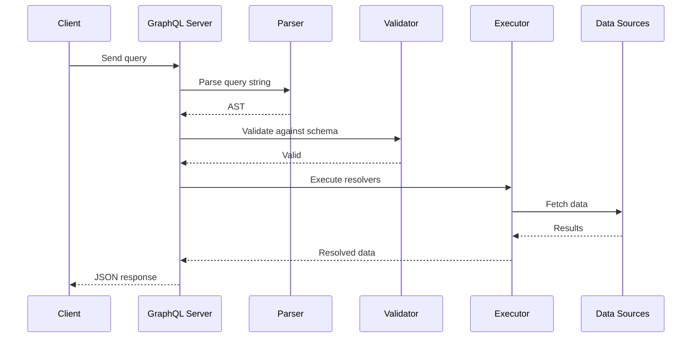

---

## 2. Historical Context and Evolution

GraphQL was conceived at Facebook in 2012 and open-sourced in 2015. It was developed to solve specific challenges faced by large-scale applications - namely, the inefficiencies of REST when dealing with complex, interconnected data. Since its introduction, GraphQL has rapidly grown in popularity and has been adopted by companies like GitHub, Twitter, and Shopify.

_Key Milestones:_

- **2012:** Facebook begins internal development of GraphQL.
- **2015:** Facebook open-sources GraphQL, sparking a wave of community adoption.
- **2016–Present:** GraphQL ecosystems expand with tools like Apollo Client, Relay, and GraphiQL, making it a cornerstone of modern web development.

---

## 3. Core Concepts of GraphQL

### 3.1 Schema and Type System

At the heart of GraphQL lies a strongly typed schema, which serves as a contract between the client and the server.

- **Schema Definition:**
  A schema defines the types, queries, mutations, and subscriptions available. It specifies the shape of the data and the operations that can be performed.

- **Type System:**
  GraphQL supports scalar types (e.g., `String`, `Int`, `Float`, `Boolean`, `ID`) and complex types like objects, enums, and custom types. This strong type system enables rigorous validation of queries before execution.

_Example Schema:_

```graphql
type User {
  id: ID!
  name: String!
  email: String!
  posts: [Post!]!
}

type Post {
  id: ID!
  title: String!
  content: String!
  author: User!
}

type Query {
  users: [User!]!
  posts: [Post!]!
}
```

### 3.2 Queries, Mutations, and Subscriptions

- **Queries:**
  GraphQL queries allow clients to request data with precision. Unlike REST, you can specify exactly which fields you need.

_Example Query:_

```graphql
query GetUserAndPosts {
  users {
    id
    name
    posts {
      id
      title
    }
  }
}
```

- **Mutations:**
  Mutations are used for creating, updating, or deleting data. They are similar to queries but typically change the underlying data.

_Example Mutation:_

```graphql
mutation CreatePost($title: String!, $content: String!, $authorId: ID!) {
  createPost(title: $title, content: $content, authorId: $authorId) {
    id
    title
    content
  }
}
```

- **Subscriptions:**
  Subscriptions enable real-time updates. Clients can subscribe to specific events and receive live data as changes occur.

_Example Subscription:_

```graphql
subscription OnPostCreated {
  postCreated {
    id
    title
    content
  }
}
```

---

## 4. How GraphQL Works Under the Hood

GraphQL operates on a single endpoint and uses resolvers to map queries to underlying data sources. Here’s a simplified flow:

1. **Client Sends Query:**
   The client sends a structured query to the GraphQL endpoint.

2. **Server Parses and Validates:**
   The GraphQL server parses the query, validates it against the schema, and then executes it by calling resolvers.

3. **Resolvers Execute:**
   Resolvers are functions that retrieve data from databases, external APIs, or other services. They can be composed to fetch nested data.

4. **Response is Shaped:**
   The server returns a JSON response that exactly mirrors the structure of the query.

_Resolver Example (Node.js with Apollo Server):_

```javascript
const resolvers = {
  Query: {
    users: async () => {
      return await User.findAll();
    },
    posts: async () => {
      return await Post.findAll();
    },
  },
  User: {
    posts: async (parent) => {
      return await Post.findAll({ where: { authorId: parent.id } });
    },
  },
};
```

---

## 5. Advantages of GraphQL over REST

### 5.1 Precise Data Fetching

GraphQL eliminates the problems of over-fetching and under-fetching by allowing clients to request exactly the data they need.

### 5.2 Single Endpoint

Unlike REST, which might require multiple endpoints for different resources, GraphQL uses a single endpoint, simplifying the client-server interaction.

### 5.3 Strongly Typed Schema

A well-defined schema enhances predictability, improves documentation, and enables powerful developer tools for testing and exploration.

### 5.4 Ease of API Evolution

GraphQL’s schema can evolve without breaking existing clients. Deprecated fields can coexist alongside new additions, allowing for gradual transitions.

The following diagram contrasts a REST multi-roundtrip flow with a single GraphQL query for the same data:

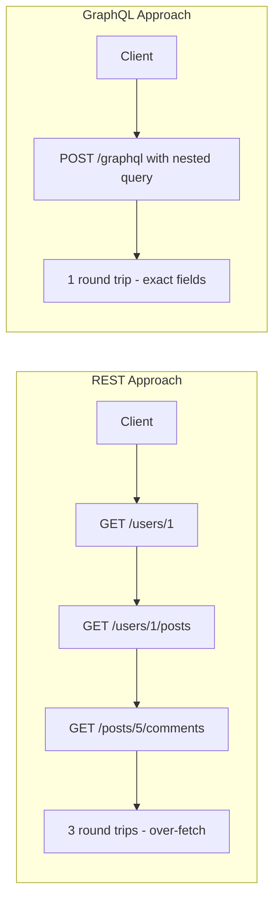

---

## 6. Real-World Use Cases

### 6.1. Content Management Systems (CMS)

GraphQL is an excellent choice for CMS platforms where clients need to fetch complex, nested data (e.g., posts, authors, categories) in a single query.

### 6.2. E-commerce Platforms

E-commerce applications benefit from GraphQL's ability to efficiently fetch interconnected data, such as products, reviews, and inventory details, while minimizing network overhead.

### 6.3. Mobile and Single-Page Applications (SPAs)

Mobile apps and SPAs often require precise, minimal data due to bandwidth constraints. GraphQL’s fine-grained querying reduces payload sizes and speeds up data retrieval.

### 6.4. Real-Time Applications

With support for subscriptions, GraphQL is well-suited for applications that require real-time updates, such as chat apps, live dashboards, or collaborative tools.

---

## 7. Tools and Ecosystem

### 7.1. Apollo Client & Server

Apollo offers a comprehensive suite for building GraphQL applications. It provides client libraries, caching, and state management to simplify integration.

### 7.2. Relay

Developed by Facebook, Relay is a powerful GraphQL client optimized for performance and scalability, especially in large, data-driven applications.

### 7.3. GraphiQL

GraphiQL is an in-browser IDE that allows developers to interactively build, test, and document GraphQL queries. It leverages GraphQL’s introspection system to provide real-time documentation.

### 7.4. Schema Stitching and Federation

Modern GraphQL architectures support combining multiple schemas into a single endpoint (schema stitching) or federating them into a distributed graph. This allows organizations to modularize and scale their API development.

The following diagram shows how a federated GraphQL gateway composes subgraphs from multiple domain services:

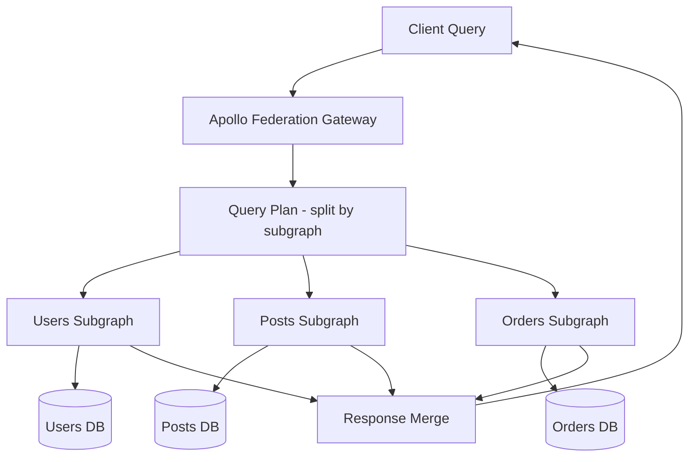

---

## 8. Best Practices for Building GraphQL APIs

The following sequence diagram shows how a GraphQL subscription delivers real-time events over a WebSocket connection:

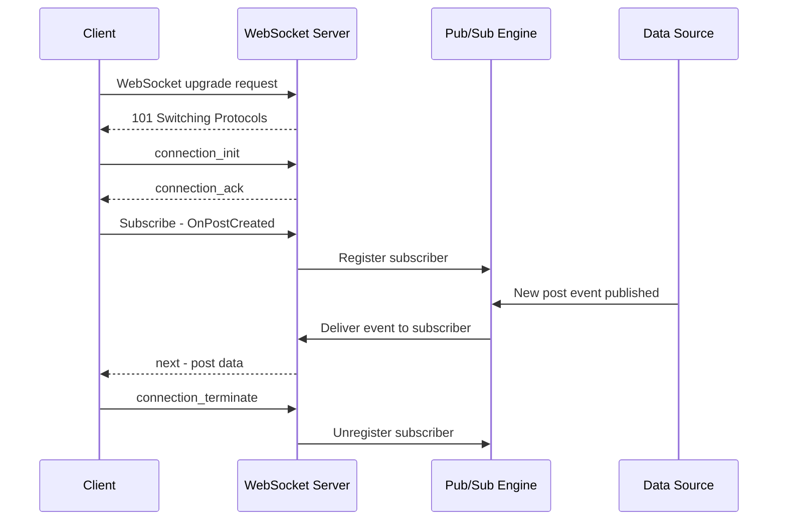

1. **Design an Intuitive Schema:**
   Your schema is a contract with your clients. Invest time in designing a clear, intuitive schema that accurately models your data and use cases.

2. **Implement Efficient Resolvers:**
   Use batching tools like DataLoader to prevent the N+1 problem and ensure resolvers fetch data efficiently.

3. **Monitor Query Complexity:**
   To protect your server, implement mechanisms to limit query depth and complexity, preventing clients from sending overly expensive queries.

4. **Document Thoroughly:**
   Leverage GraphQL’s introspection capabilities to provide auto-generated documentation. Encourage your team to use tools like GraphiQL or Apollo Studio.

5. **Plan for Versioning:**
   While GraphQL minimizes versioning issues by allowing schema evolution, have a deprecation strategy in place for fields and types that are no longer needed.

6. **Secure Your API:**
   Use authentication and authorization strategies tailored for GraphQL. Consider persisted queries and query whitelisting to enhance security.

---

## 9. Challenges and Considerations

The resolver chain execution diagram shows how nested resolvers are called to build a hierarchical response:

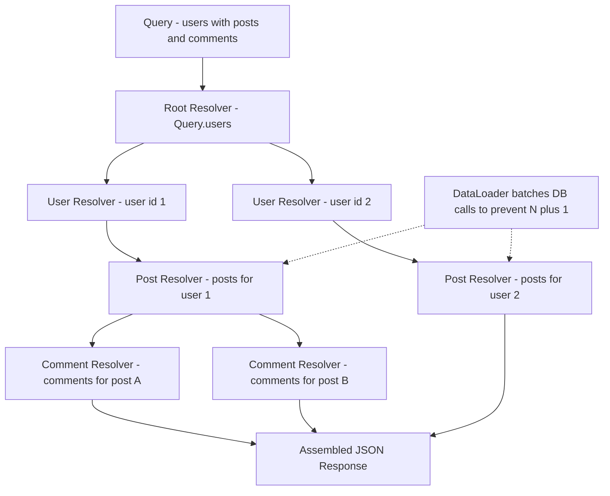

Despite its many advantages, GraphQL is not without challenges:

- **Complexity in Implementation:**
  Building a GraphQL server with complex resolvers and data fetching strategies can be more challenging than traditional REST APIs.

- **Overly Flexible Queries:**
  The power of GraphQL means that clients can construct queries that are expensive to execute. Mitigate this risk with query complexity analysis and rate limiting.

- **Learning Curve:**
  Teams accustomed to REST may face a learning curve when transitioning to GraphQL. Invest in training and adopt robust tooling to ease the transition.

- **Caching Strategies:**
  Caching in GraphQL can be more complex than REST due to the dynamic nature of queries. Use tools like Apollo Client for effective caching strategies.

- **Tooling and Ecosystem:**
  The GraphQL ecosystem is still evolving, and while many tools are available, they may not be as mature as those in the REST world. Evaluate your options carefully and choose tools that fit your needs.

- **Error Handling:**
  Error handling in GraphQL can be more complex than in REST. GraphQL responses can contain partial data and errors, making it essential to implement robust error handling strategies.

---

## 10. Caching, Security, and Type System Reference

The following diagram shows the caching layers available in a GraphQL client stack and how each layer intercepts data before hitting the network:

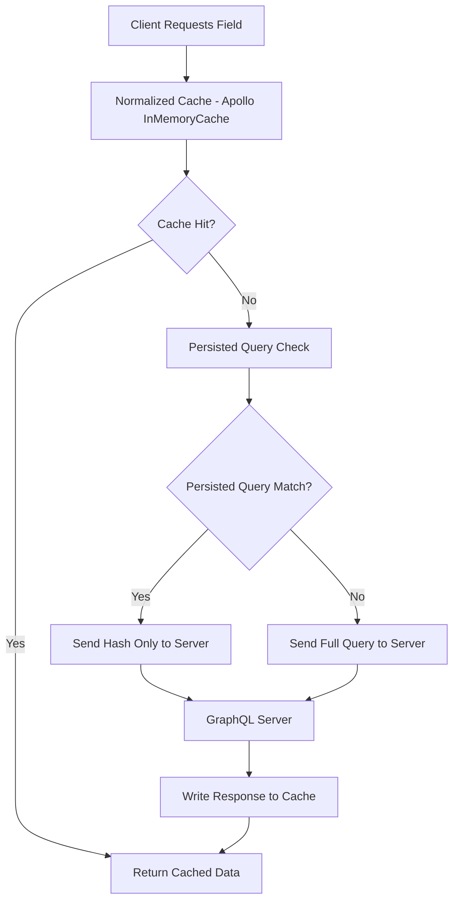

The diagram below shows how query depth limiting and complexity analysis protect the server from expensive client queries:

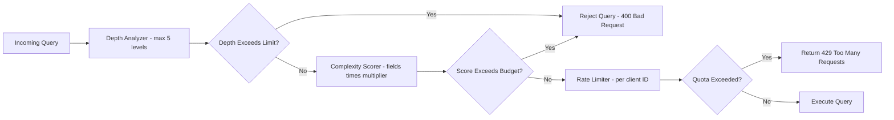

The class diagram below models the core GraphQL type system relationships used when building a schema:

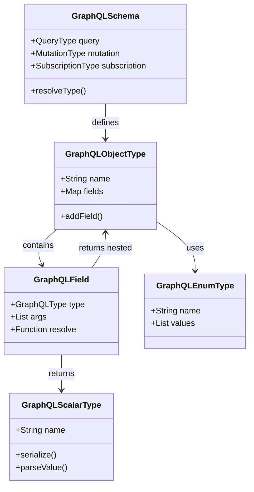

The state diagram shows the lifecycle of a DataLoader batch request used to solve the N+1 problem in resolver chains:

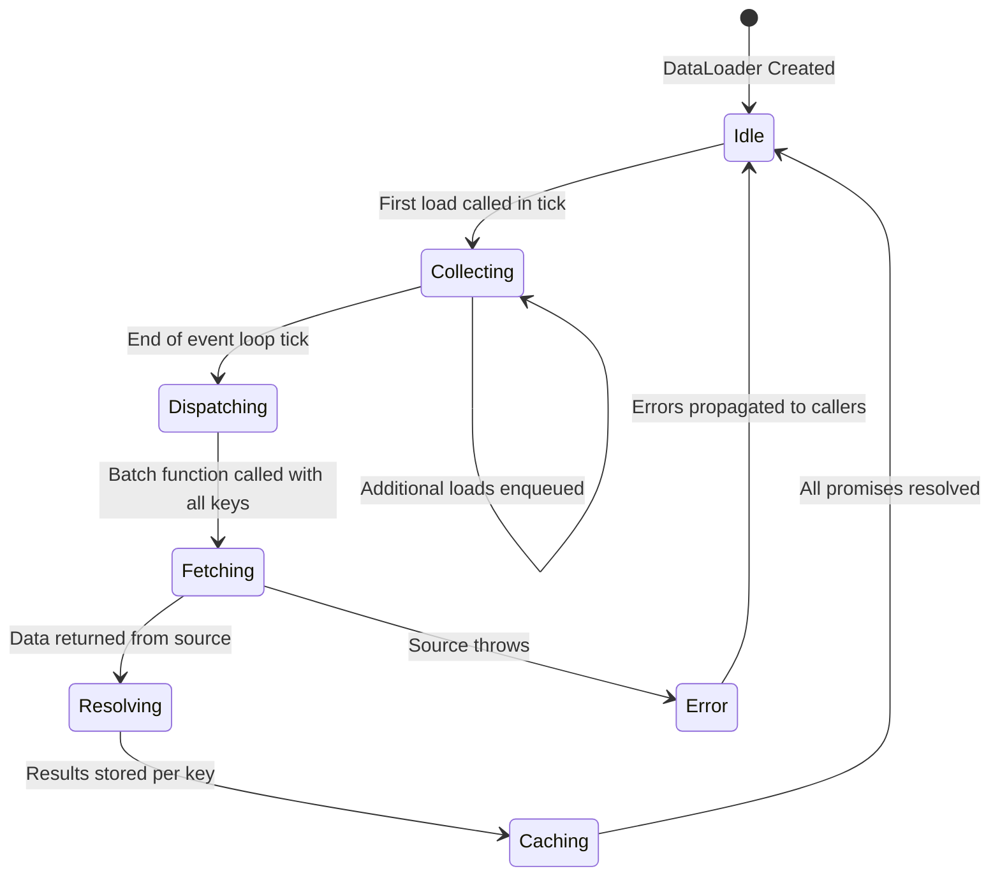

---

## 11. Relay-Style Cursor Pagination

Relay introduced a connection specification for paginating lists that has become the de facto standard in GraphQL APIs. It uses cursors (opaque tokens representing a position) rather than page numbers, which handles insertions and deletions cleanly.

### 11.1. Schema Definition

```graphql
type PostConnection {
  edges: [PostEdge!]!
  pageInfo: PageInfo!
}

type PostEdge {
  node: Post!
  cursor: String!
}

type PageInfo {
  hasNextPage: Boolean!
  hasPreviousPage: Boolean!
  startCursor: String
  endCursor: String
}

type Query {
  posts(first: Int, after: String, last: Int, before: String): PostConnection!
}
```

### 11.2. Resolver Implementation

```javascript
// resolvers/posts.js
const { encodeCursor, decodeCursor } = require("../utils/cursor");

const resolvers = {
  Query: {
    posts: async (_parent, { first = 10, after }, { db }) => {
      const limit = Math.min(first, 100); // cap at 100
      const afterId = after ? decodeCursor(after) : null;

      const rows = await db.query(
        `SELECT id, title, created_at FROM posts
         WHERE ($1::int IS NULL OR id > $1)
         ORDER BY id ASC
         LIMIT $2 + 1`, // fetch one extra to determine hasNextPage
        [afterId, limit],
      );

      const hasNextPage = rows.length > limit;
      const edges = rows.slice(0, limit).map((row) => ({
        node: row,
        cursor: encodeCursor(row.id),
      }));

      return {
        edges,
        pageInfo: {
          hasNextPage,
          hasPreviousPage: !!after,
          startCursor: edges[0]?.cursor ?? null,
          endCursor: edges[edges.length - 1]?.cursor ?? null,
        },
      };
    },
  },
};
```

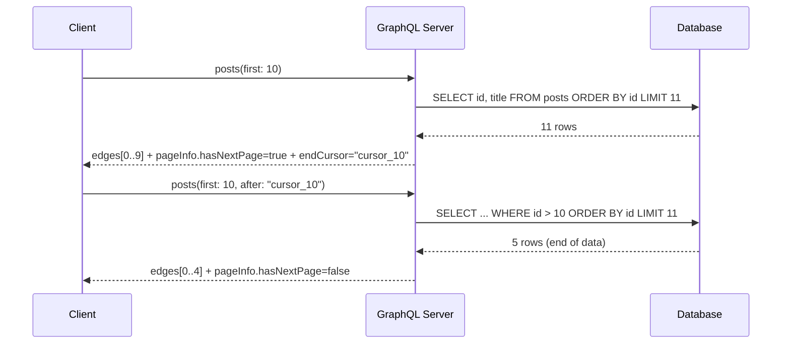

---

## 12. Schema-First vs. Code-First Development

GraphQL schemas can be authored in two fundamentally different ways, each with distinct trade-offs.

### 12.1. Schema-First (SDL-First)

You write the schema in GraphQL SDL first, then implement resolvers that satisfy it. This approach excels for teams where frontend and backend engineers collaborate on the contract before any implementation.

```graphql
# schema.graphql — written first, agreed upon before implementation
type Query {
  user(id: ID!): User
}

type User {
  id: ID!
  name: String!
  email: String!
  posts: [Post!]!
}
```

```javascript
// resolvers.js — written after schema is agreed upon
const resolvers = {
  Query: {
    user: (_, { id }, { dataSources }) => dataSources.userAPI.getUser(id),
  },
  User: {
    posts: (user, _, { dataSources }) =>
      dataSources.postAPI.getPostsByUser(user.id),
  },
};
```

### 12.2. Code-First (Programmatic)

You define types in code using a library (e.g., TypeGraphQL, Nexus, Pothos) and the schema is generated automatically. This is better for TypeScript teams that want end-to-end type safety.

```typescript
// TypeGraphQL example
import { ObjectType, Field, ID, Resolver, Query, Arg } from "type-graphql";

@ObjectType()
class User {
  @Field(() => ID)
  id: string;

  @Field()
  name: string;

  @Field()
  email: string;
}

@Resolver(User)
class UserResolver {
  @Query(() => User, { nullable: true })
  async user(@Arg("id") id: string): Promise<User | null> {
    return await UserRepository.findOne(id);
  }
}
```

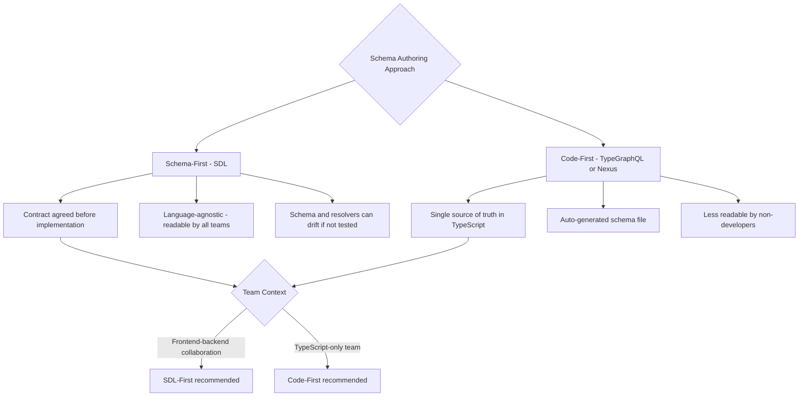

### 12.3. Persisted Queries

Persisted queries replace sending a full query string on every request with sending only a hash. This reduces payload size, enables whitelisting (only known queries can execute), and improves CDN cacheability.

```javascript
// Client side: register query at build time
import { createPersistedQueryLink } from "@apollo/client/link/persisted-queries";
import { sha256 } from "crypto-hash";

const persistedQueriesLink = createPersistedQueryLink({ sha256 });

const client = new ApolloClient({
  link: from([persistedQueriesLink, httpLink]),
  cache: new InMemoryCache(),
});
```

```javascript
// Server side: reject queries not in the allowlist (optional)
const allowlist = new Map([
  ["abc123hash", `query GetUser($id: ID!) { user(id: $id) { name email } }`],
]);

app.post("/graphql", (req, res, next) => {
  const { extensions } = req.body;
  const hash = extensions?.persistedQuery?.sha256Hash;

  if (hash && !allowlist.has(hash)) {
    return res.status(400).json({ error: "Query not in allowlist" });
  }
  next();
});
```

### 12.4. Error Handling Patterns

GraphQL responses can contain both `data` and `errors` simultaneously. Designing error handling correctly prevents leaking internal details while still giving clients actionable information.

```javascript
// Custom error classes with GraphQL extensions
const { GraphQLError } = require("graphql");

class NotFoundError extends GraphQLError {
  constructor(resource, id) {
    super(`${resource} with id ${id} not found`, {
      extensions: {
        code: "NOT_FOUND",
        resource,
        id,
        http: { status: 404 },
      },
    });
  }
}

class AuthorizationError extends GraphQLError {
  constructor(action) {
    super(`Not authorized to ${action}`, {
      extensions: {
        code: "UNAUTHORIZED",
        http: { status: 403 },
      },
    });
  }
}

// Resolver usage
const resolvers = {
  Query: {
    user: async (_, { id }, { user: currentUser }) => {
      if (!currentUser) throw new AuthorizationError("query users");

      const user = await UserRepository.findOne(id);
      if (!user) throw new NotFoundError("User", id);

      return user;
    },
  },
};
```

The client receives a structured error it can handle programmatically:

```json
{
  "data": { "user": null },
  "errors": [
    {
      "message": "User with id 99 not found",
      "extensions": {
        "code": "NOT_FOUND",
        "resource": "User",
        "id": "99"
      }
    }
  ]
}
```

---

## 13. Conclusion

GraphQL is transforming the way we build APIs by offering precise data fetching, a unified schema, and a host of developer-friendly features. It is ideally suited for modern applications that demand high efficiency and scalability. While adopting GraphQL does come with its own set of challenges, the benefits of improved performance, streamlined data retrieval, and easier API evolution make it an attractive option for many organizations.

As you explore GraphQL, consider how its principles can improve your existing API infrastructure and pave the way for more dynamic, responsive applications.

**Key Takeaways:**

- Use Relay-style cursor pagination for all list fields — it handles data mutations gracefully and is the industry standard.
- Choose schema-first when cross-team collaboration matters; choose code-first when full-stack TypeScript type safety is the priority.
- Implement persisted queries for production clients to reduce payload size, enable CDN caching, and prevent schema scraping attacks.
- Use typed `GraphQLError` subclasses with `extensions.code` to give clients machine-readable error codes without exposing internal details.
- Apply DataLoader for every resolver that touches a database — it is the single highest-impact optimization for GraphQL performance.

---

## 14. Further Reading

- **GraphQL Official Documentation:** [https://graphql.org/learn/](https://graphql.org/learn/)
- **Apollo GraphQL Docs:** [https://www.apollographql.com/docs/](https://www.apollographql.com/docs/)
- **Relay Framework:** [https://relay.dev/](https://relay.dev/)
- **GraphiQL IDE:** [https://github.com/graphql/graphiql](https://github.com/graphql/graphiql)
- **GraphQL Specification:** [https://spec.graphql.org/](https://spec.graphql.org/)
- **DataLoader:** [https://github.com/graphql/dataloader](https://github.com/graphql/dataloader)

---
