import MdxLayout from "@/components/MdxLayout";

export const metadata = {
  title: "Exploring New Features in HTML6: What Developers Need to Know",
  description:
    "A comprehensive guide on HTML6's emerging features, semantic improvements, and performance/security optimizations that promise to shape the future of web development.",
  topics: [
    "Web Development",
    "Web Architecture",
    "Web Frameworks",
    "Performance",
  ],
};

export default function HTML6Article({ children }) {
  return <MdxLayout>{children}</MdxLayout>;
}

# Exploring New Features in HTML6: What Developers Need to Know

### Author: Son Nguyen

> Date: 2025-02-26

As the web continues to evolve, so too must the standards that underpin it. While HTML5 has long been the foundation of modern web development, the next evolution - **HTML6** - promises a host of new features and improvements aimed at making web applications more semantic, accessible, and performant. In this detailed guide, we explore the potential new features of HTML6, discussing what developers can expect and how these changes might influence the future of web development.

---

## 1. Introduction

HTML has been the cornerstone of the World Wide Web since its inception. HTML5 brought about significant improvements in multimedia, graphics, and semantic elements. However, as web applications become more complex and demanding, there is a growing need for further enhancements. HTML6 is poised to address modern challenges with innovations that aim to simplify development workflows, enhance performance, and improve accessibility - all while maintaining backward compatibility.

---

## 2. New Semantic Elements and Structural Enhancements

### 2.1 Expanding Semantic Markup

HTML6 is expected to refine and expand semantic markup to further clarify document structure. New elements may be introduced to better define regions of a page, offering clearer separation between content and layout. For example:

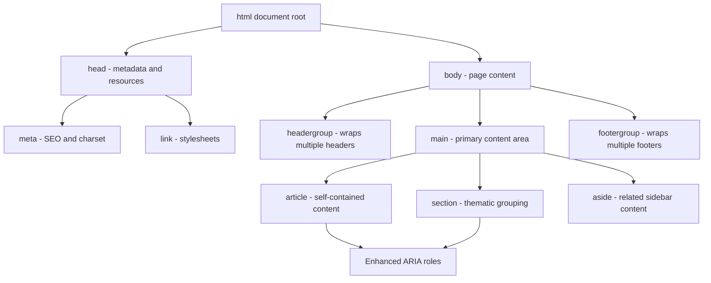

- **\<headergroup\> and \<footergroup\>**: These hypothetical elements could wrap multiple header or footer sections, providing more granular control over complex page structures.
- **Enhanced \<section\> and \<article\>**: With additional attributes or roles, these elements could better convey hierarchical relationships and content significance.

### 2.2 Improved Tag Attributes

Developers might see new global attributes or refinements to existing ones that help with SEO and accessibility. Expect more descriptive metadata options and role-based enhancements that integrate seamlessly with ARIA specifications.

---

## 3. Enhanced Form Controls and Input Types

### 3.1 Advanced Input Elements

HTML6 is likely to introduce new form controls that go beyond the basic text, email, or date inputs. Potential additions include:

- **Slider and Range Enhancements**: More intuitive and customizable range inputs with better touch support.
- **Rich Date/Time Pickers**: Native support for more complex scheduling interfaces, allowing for multi-date selection and time zone adjustments.
- **Improved File Inputs**: Enhanced file upload controls that provide progress feedback and better error handling.

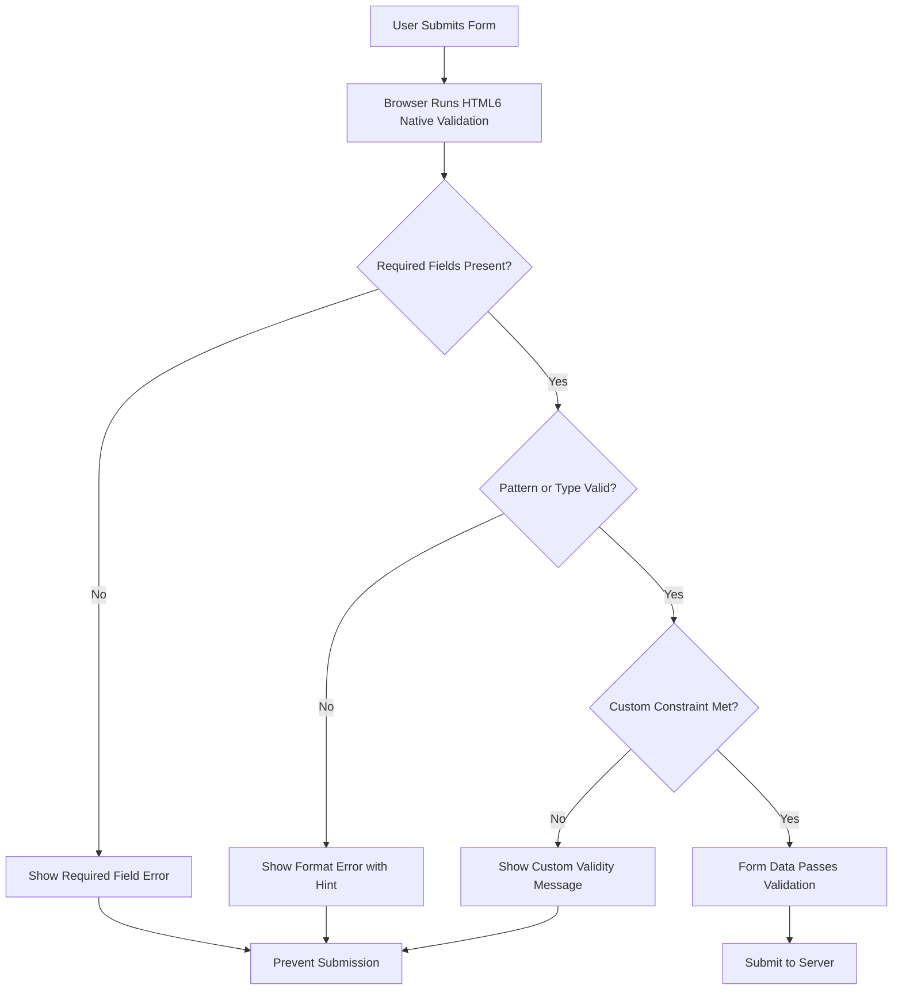

### 3.2 Declarative Validation Improvements

Future specifications may provide additional declarative validation rules directly in HTML. This could simplify client-side validation by reducing the need for extensive JavaScript code to enforce data integrity, making form development faster and less error-prone.

---

## 4. Multimedia and Graphics Integration

### 4.1 Next-Generation Multimedia Support

HTML6 is set to push the boundaries of multimedia by enhancing native support for video and audio:

- **Adaptive Streaming and Codec Negotiation**: New elements or attributes may allow the browser to automatically select the optimal codec or stream quality based on network conditions.
- **Improved Subtitles and Captions**: Enhanced APIs to support multi-language captions and real-time transcription, boosting accessibility for diverse audiences.

### 4.2 Enhanced Graphics and Canvas API

Expect refinements to the `<canvas>` element and integration with WebGL and WebGPU, allowing developers to create more complex graphics and interactive experiences with less overhead. This could lead to better performance in games, data visualizations, and interactive design applications.

---

## 5. Accessibility Enhancements

### 5.1 Semantic and ARIA Improvements

HTML6 is anticipated to further embrace accessibility by:

- **New ARIA Roles and Properties**: More granular roles for dynamic content, making it easier for assistive technologies to interpret and navigate complex UIs.
- **Native Accessibility Enhancements**: Built-in support for features like live regions, improved keyboard navigation, and better focus management without relying solely on JavaScript.

### 5.2 Accessibility-First Development

By embedding accessibility deeper into the core standard, HTML6 encourages developers to consider inclusive design from the outset, ensuring that web applications are usable by everyone.

---

## 6. New APIs and Interactivity

### 6.1 Enhanced Web Components

The evolution of web components continues into HTML6, with anticipated improvements that include:

- **Simplified Custom Elements**: Reducing boilerplate code and streamlining the process of creating reusable components.
- **Improved Shadow DOM**: Enhanced encapsulation mechanisms that offer better performance and style isolation.

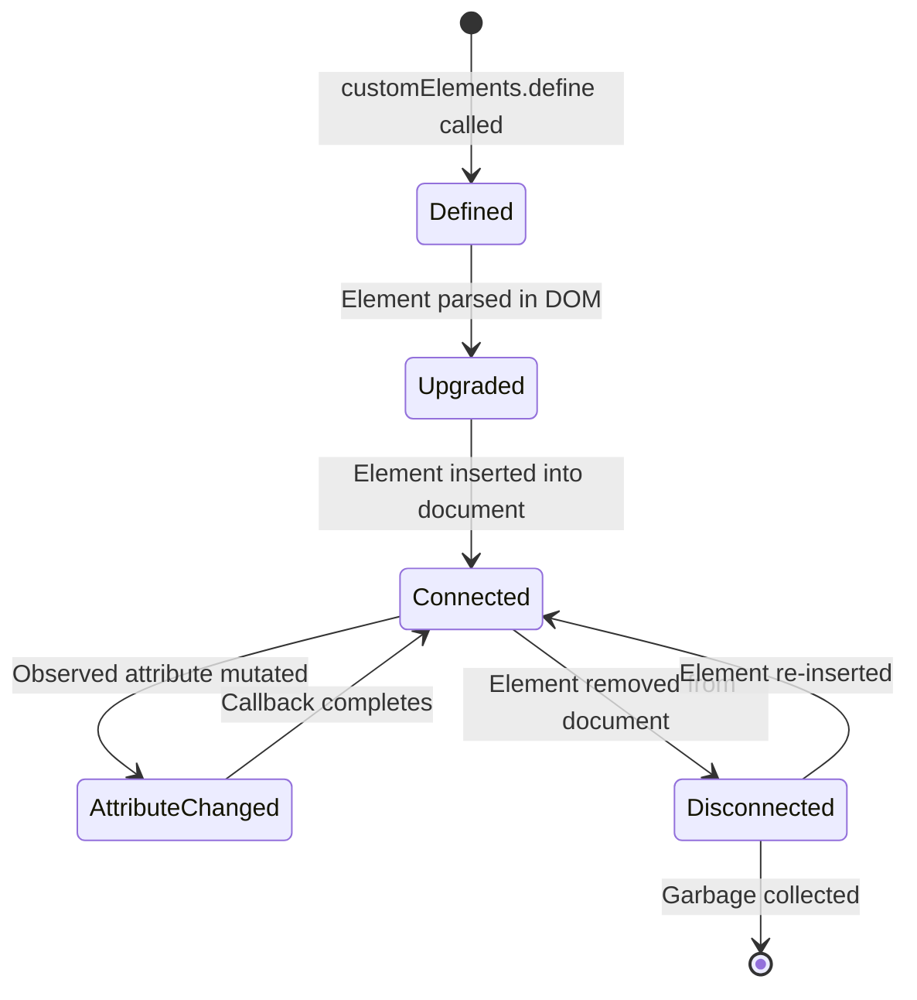

### 6.2 Native Interactivity

HTML6 may also introduce new APIs that allow for more sophisticated interactions without the need for heavy JavaScript frameworks. Imagine elements that handle animations, transitions, and even simple data binding natively, reducing the overall complexity of web apps.

---

## 7. Performance and Security Optimizations

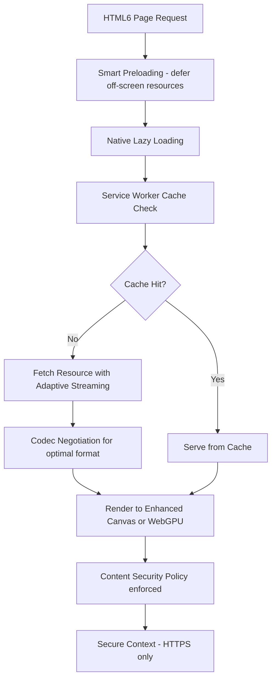

### 7.1 Resource Loading and Performance

HTML6 is expected to incorporate new attributes and elements designed to optimize resource loading:

- **Smart Preloading and Lazy Loading**: Improved native support for deferring the loading of off-screen resources, reducing initial load times and enhancing performance.
- **Enhanced Caching Strategies**: Tighter integration with service workers and progressive web app (PWA) standards to ensure faster, more reliable user experiences.

### 7.2 Security Enhancements

Security is always a top priority, and HTML6 may offer:

- **Refined Content Security Policies (CSP)**: More granular controls to protect against cross-site scripting (XSS) and other injection attacks.
- **Secure Contexts by Default**: Stricter requirements for mixed content and enhanced encryption guidelines, making the web a safer place for both developers and users.

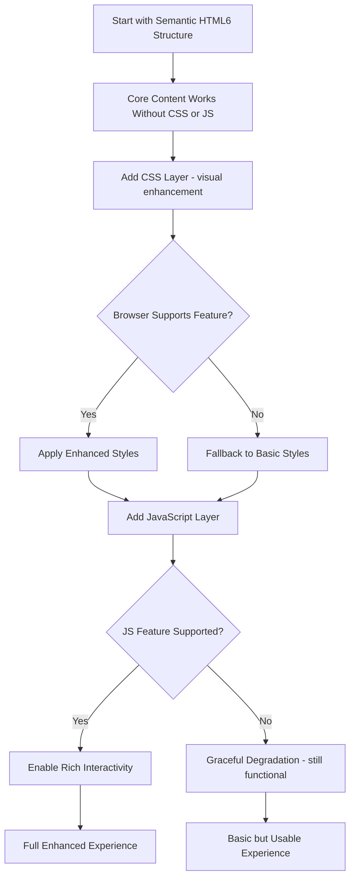

---

## 8. Backward Compatibility and Adoption Challenges

### 8.1 Transitioning from HTML5

One of the critical challenges will be ensuring that new features can coexist with legacy HTML5 content. HTML6 is designed to be backward compatible, meaning that existing pages should continue to function as expected while gradually integrating new capabilities.

### 8.2 Browser Support and Polyfills

Adoption of HTML6 features will depend heavily on browser vendors. Early implementations might rely on polyfills and feature detection libraries, allowing developers to experiment with new functionalities while maintaining compatibility across environments.

---

## 9. Developer Tools and Ecosystem Integration

### 9.1 Enhanced Developer Tools

As HTML6 evolves, browser developer tools are likely to include dedicated support for new elements and APIs:

- **Improved Inspectors**: Tools that display semantic structures and accessibility information more clearly.
- **Performance Profilers**: New metrics and diagnostics to help developers fine-tune resource loading and execution.

### 9.2 Documentation and Community Support

The success of HTML6 will also depend on clear, comprehensive documentation from organizations like the W3C and MDN. As the community begins to adopt these new standards, expect a rich ecosystem of tutorials, libraries, and frameworks that leverage HTML6’s capabilities.

---

## 10. Native Date-Time Picker and Media Negotiation Internals

The sequence diagram below illustrates how a native HTML6 date-time picker interacts with the browser and form before submission:

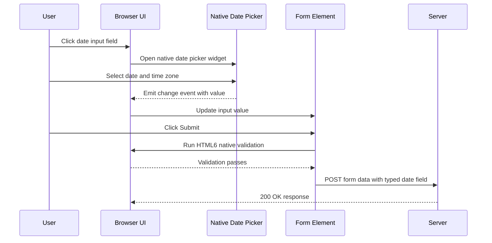

The diagram below maps how the new HTML6 adaptive streaming attributes negotiate the best media format at load time:

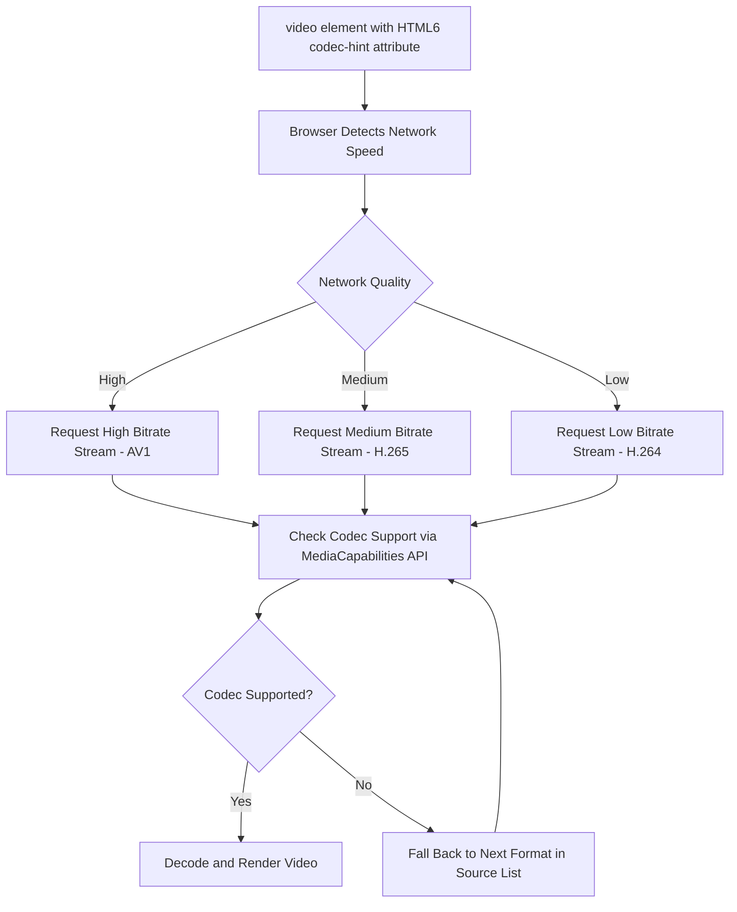

The class diagram models the expanded ARIA role hierarchy anticipated in HTML6 for richer accessibility semantics:

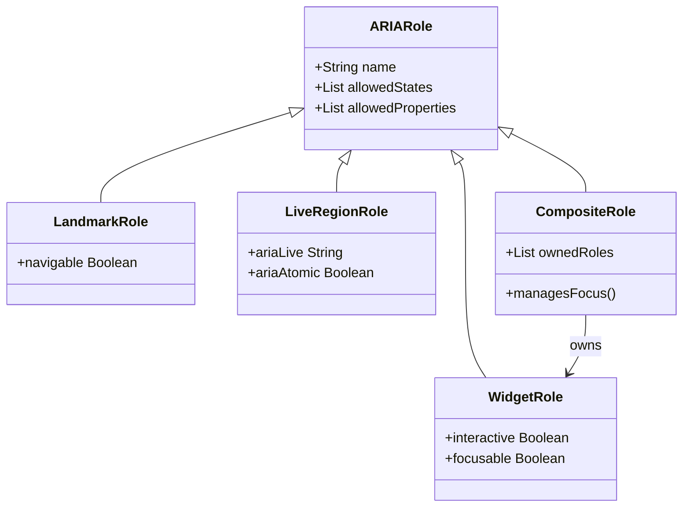

The following state diagram captures how a browser handles a Shadow DOM component across its full attach and update lifecycle:

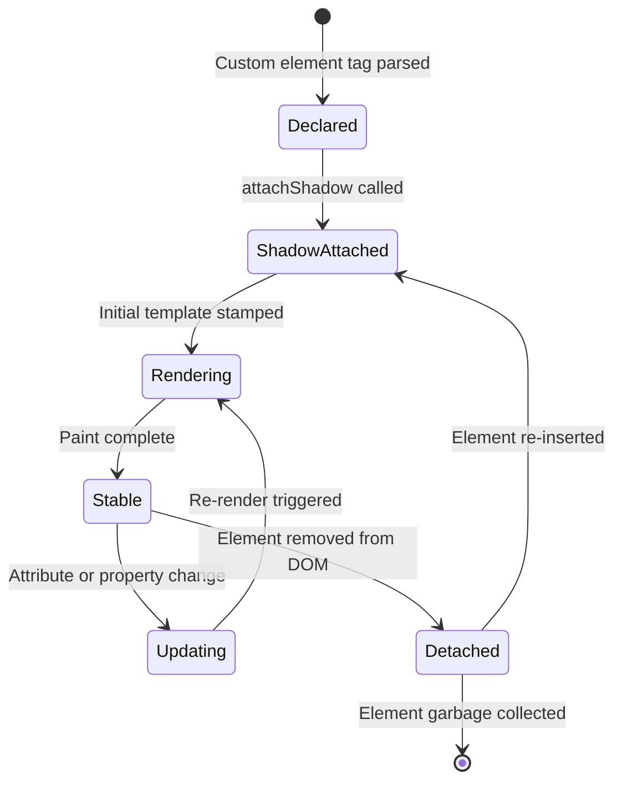

HTML6 represents a significant step forward in the evolution of web standards. By incorporating advanced semantic elements, enhanced multimedia support, richer form controls, and robust accessibility and performance features, HTML6 is set to empower developers to build more modern, efficient, and inclusive web applications.

While many of these features remain in the proposal or experimental stage, staying informed about HTML6 will help developers prepare for a future where the web is more dynamic and responsive to both user needs and technological advancements. Embracing these changes early can provide a competitive edge and ensure smoother transitions as the new standard matures.

---

## 11. Native Web Components Deep Dive

Web components - built on Custom Elements v2, Shadow DOM, and HTML Templates - are the most significant shift in HTML toward a true component model that does not require a JavaScript framework. HTML6 is expected to refine and extend these APIs considerably.

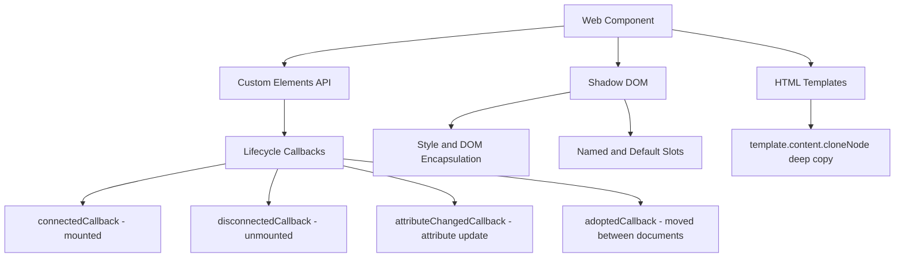

### 11.1. Building a production-ready custom element

```typescript
// typed-card.ts - a fully typed, accessible custom element
class TypedCard extends HTMLElement {
  static get observedAttributes(): string[] {
    return ["title", "variant", "loading"];
  }

  private shadow: ShadowRoot;

  constructor() {
    super();
    this.shadow = this.attachShadow({ mode: "open" });
  }

  connectedCallback(): void {
    this.setAttribute("role", "article");
    this.render();
    this.dispatchEvent(new CustomEvent("card-connected", { bubbles: true }));
  }

  disconnectedCallback(): void {
    // Clean up event listeners, timers, or observers here
    this.dispatchEvent(new CustomEvent("card-disconnected", { bubbles: true }));
  }

  attributeChangedCallback(
    name: string,
    oldValue: string | null,
    newValue: string | null,
  ): void {
    if (oldValue !== newValue) {
      this.render();
    }
  }

  private render(): void {
    const title = this.getAttribute("title") ?? "Untitled";
    const variant = this.getAttribute("variant") ?? "default";
    const loading = this.hasAttribute("loading");

    this.shadow.innerHTML = `
      <style>
        :host {
          display: block;
          border-radius: 8px;
          padding: 16px;
          font-family: system-ui, sans-serif;
        }
        :host([variant="primary"]) {
          background: #3b82f6;
          color: white;
        }
        :host([variant="danger"]) {
          background: #ef4444;
          color: white;
        }
        .title {
          font-size: 1.25rem;
          font-weight: 600;
          margin-bottom: 8px;
        }
        .loading-indicator {
          display: ${loading ? "block" : "none"};
          height: 4px;
          background: rgba(255,255,255,0.4);
          animation: pulse 1.5s infinite;
        }
        @keyframes pulse {
          0%, 100% { opacity: 0.4; }
          50% { opacity: 1; }
        }
      </style>
      <div class="loading-indicator" role="progressbar" aria-label="Loading"></div>
      <div class="title">${title}</div>
      <slot></slot>
    `;
  }
}

customElements.define("typed-card", TypedCard);
```

```html
<!-- Usage -->
<typed-card title="Revenue Report" variant="primary">
  <p>Q1 results are now available for review.</p>
</typed-card>
```

---

## 12. Declarative Shadow DOM

Until recently, Shadow DOM could only be created imperatively via JavaScript. Declarative Shadow DOM, already shipping in Chromium and expected to be standardized in HTML6, allows shadow roots to be declared directly in HTML markup. This is critical for server-side rendering and progressive enhancement.

```html
<!-- Declarative Shadow DOM: no JavaScript required to attach shadow root -->
<my-profile-card>
  <template shadowrootmode="open">
    <style>
      :host {
        display: flex;
        gap: 12px;
        align-items: center;
      }
      .name {
        font-weight: bold;
      }
      .avatar {
        border-radius: 50%;
        width: 48px;
        height: 48px;
      }
    </style>
    
    <div>
      <div class="name"><slot name="name">Anonymous</slot></div>
      <div class="role"><slot name="role">Member</slot></div>
    </div>
  </template>
  <span slot="name">Son Nguyen</span>
  <span slot="role">Senior Engineer</span>
</my-profile-card>
```

### 12.1. SSR + Declarative Shadow DOM pipeline

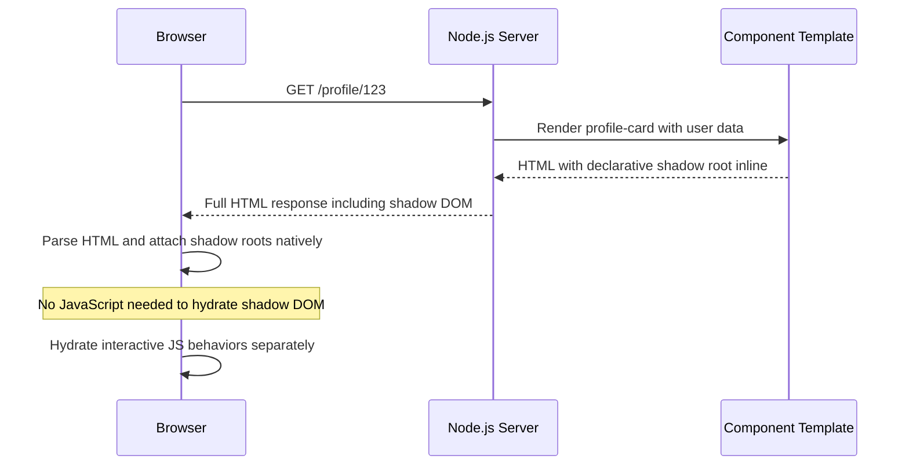

The benefit is a fully rendered component tree with encapsulated styles arriving in the initial HTML payload. Search engines and screen readers receive the structured content without waiting for JavaScript execution.

---

## 13. Import maps and built-in modules

Import maps are a native browser mechanism for mapping bare module specifiers to URLs. They remove the need for a bundler in simple applications and give fine-grained control over module resolution in complex ones.

```html
<!-- index.html: define the import map in the document head -->
<script type="importmap">
  {
    "imports": {
      "lodash": "https://cdn.skypack.dev/lodash@4.17.21",
      "preact": "https://esm.sh/preact@10",
      "preact/hooks": "https://esm.sh/preact@10/hooks",
      "@app/utils": "/src/utils/index.js",
      "@app/components/": "/src/components/"
    },
    "scopes": {
      "/legacy/": {
        "lodash": "https://cdn.skypack.dev/lodash@3.10.1"
      }
    }
  }
</script>

<!-- Now bare specifiers work natively -->
<script type="module">
  import _ from "lodash";
  import { useState } from "preact/hooks";
  import { formatDate } from "@app/utils";

  console.log(_.chunk([1, 2, 3, 4, 5], 2));
</script>
```

### 13.1. Import map scoping behavior

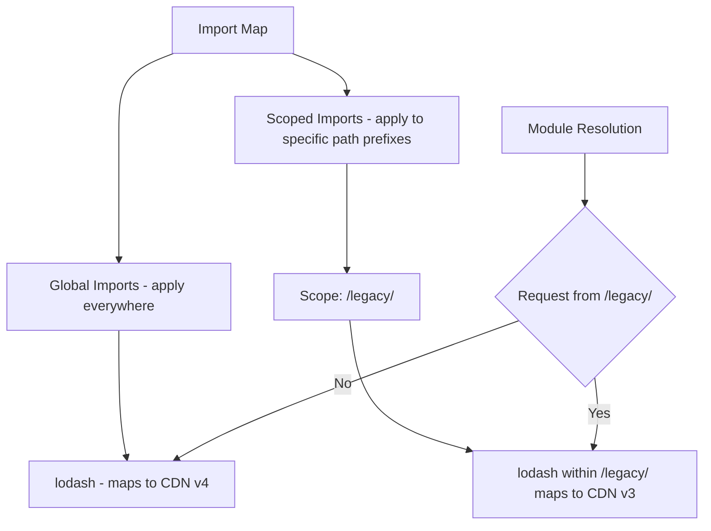

HTML6 is expected to expand the built-in modules system, providing native implementations of common utilities (like observable data structures and template engines) that today require third-party libraries.

---

## 14. Pairing CSS features with HTML6

HTML6 brings structural improvements that pair naturally with recent and upcoming CSS capabilities. The combination unlocks visual patterns that previously required JavaScript.

### 14.1. CSS anchor positioning

Anchor positioning solves the tooltip and popover positioning problem natively, without JavaScript coordinate calculations:

```html
<!-- HTML6 popover attribute: native popover behavior without JS -->
<button popovertarget="settings-menu">Settings</button>

<div id="settings-menu" popover anchor="settings-menu">
  <ul>
    <li><a href="/settings/profile">Profile</a></li>
    <li><a href="/settings/security">Security</a></li>
    <li><a href="/settings/billing">Billing</a></li>
  </ul>
</div>

<style>
  /* CSS anchor positioning: popover follows the button */
  #settings-menu {
    position: absolute;
    position-anchor: --settings-button;
    top: calc(anchor(bottom) + 8px);
    left: anchor(left);
  }
</style>
```

### 14.2. The `@layer` cascade layer system

`@layer` gives developers explicit control over the CSS cascade, removing the specificity wars that come with large stylesheets:

```css
/* Define layer order: lowest priority first */
@layer reset, base, components, utilities, overrides;

@layer reset {
  *,
  *::before,
  *::after {
    box-sizing: border-box;
  }
  body {
    margin: 0;
  }
}

@layer base {
  body {
    font-family: system-ui, sans-serif;
    font-size: 16px;
  }
  a {
    color: inherit;
  }
}

@layer components {
  .card {
    border-radius: 8px;
    padding: 16px;
    background: var(--surface);
  }
}

/* Utilities always win over components, regardless of specificity */
@layer utilities {
  .sr-only {
    position: absolute;
    width: 1px;
    height: 1px;
    overflow: hidden;
    clip: rect(0, 0, 0, 0);
  }
}
```

### 14.3. CSS container queries with HTML6 structure

Container queries allow components to respond to their container's size rather than the viewport, enabling truly portable components:

```html
<section class="content-grid">
  <!-- This card responds to its container width, not viewport width -->
  <article class="post-card">
    
    <h2>Building with HTML6</h2>
    <p>Container queries make this layout adapt to any context.</p>
  </article>
</section>

<style>
  .content-grid {
    container-type: inline-size;
    container-name: content-grid;
    display: grid;
    gap: 16px;
  }

  /* Card is single column by default */
  .post-card {
    display: flex;
    flex-direction: column;
  }

  /* When the grid container is at least 600px wide, go horizontal */
  @container content-grid (min-width: 600px) {
    .post-card {
      flex-direction: row;
      gap: 16px;
    }

    .post-card img {
      width: 200px;
      flex-shrink: 0;
    }
  }
</style>
```

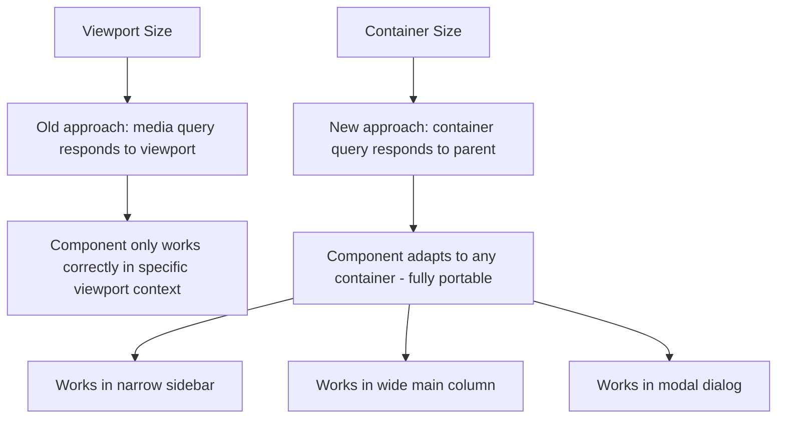

---

## 15. Conclusion

HTML6 is not a single release with a hard boundary from HTML5 - it is a continuous evolution of the living standard, with individual features shipping in browsers as they are standardized. The most impactful capabilities - Declarative Shadow DOM, native popovers, import maps, container queries, and the popover API - are already available in modern browsers today.

For developers, the practical path forward is to adopt these features incrementally, starting with progressive enhancement: ensure the baseline HTML works without CSS or JavaScript, layer enhancements using feature detection, and fall back gracefully in older environments. The web platform is moving toward less framework dependence, not more. Understanding the direction of HTML6 positions developers to write leaner, faster, and more accessible applications.

---

## 16. Further Reading & Resources

- **W3C Specifications**:
  - [W3C HTML Living Standard](https://html.spec.whatwg.org/)
  - [W3C Drafts and Proposals](https://www.w3.org/TR/)
- **MDN Web Docs**:
  - [MDN HTML Documentation](https://developer.mozilla.org/en-US/docs/Web/HTML)
- **Accessibility**:
  - [WAI-ARIA Authoring Practices](https://www.w3.org/TR/wai-aria-practices/)
- **Performance and Security**:
  - [Google Developers Web Fundamentals](https://developers.google.com/web/fundamentals/)
  - [Content Security Policy (CSP) Guide](https://content-security-policy.com/)

By understanding and experimenting with these emerging features, developers can be at the forefront of web innovation, ensuring that their applications remain robust, accessible, and future-proof as HTML continues to evolve.
