import MdxLayout from "@/components/MdxLayout";

export const metadata = {
  title: "How to Improve SEO Rankings for a Web App",
  description:
    "A guide detailing actionable strategies for improving SEO. Explore keyword research, on-page/technical SEO, link building, mobile SEO, and performance monitoring to drive organic traffic and boost visibility.",
  topics: ["SEO", "Web Development", "Web Frameworks", "Web Architecture"],
};

export default function SEOArticle({ children }) {
  return <MdxLayout>{children}</MdxLayout>;
}

# How to Improve SEO Rankings for a Website/Web App

### Author: Son Nguyen

> Date: 2025-02-26

Search Engine Optimization (SEO) is more than a buzzword - it’s a fundamental aspect of ensuring your website or web app is visible, accessible, and engaging for your target audience. In an era where search engines are the primary gateway to information, businesses and developers must adopt a holistic approach to SEO. This guide explores in-depth strategies across multiple facets of SEO, from keyword research and content creation to technical optimizations and user experience improvements.

---

## 1. Introduction to SEO

SEO is the practice of optimizing your online presence to achieve higher rankings in search engine results pages (SERPs). Its importance cannot be overstated:

- **Visibility and Traffic:** Higher rankings translate into more organic traffic.
- **Credibility and Trust:** Top positions are often perceived as more trustworthy.
- **User Engagement:** Well-optimized pages provide a better user experience, leading to longer dwell times and higher conversion rates.

The evolution of search engines - from keyword-matching algorithms to sophisticated AI-powered systems - has made SEO a dynamic field. Staying current with best practices is essential for long-term success.

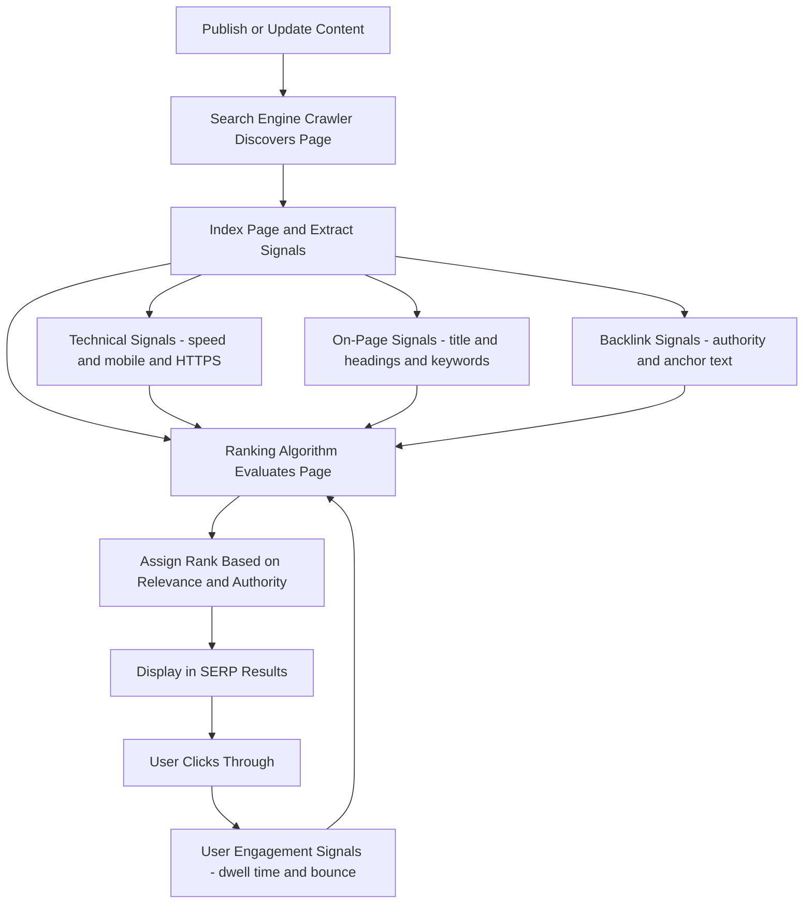

---

## 2. Keyword Research and Content Strategy

### 2.1 Keyword Research

A solid SEO strategy begins with understanding what your audience is searching for.

- **Seed Keywords:** Start with broad terms related to your industry or niche.
- **Keyword Tools:** Use Google Keyword Planner, SEMrush, Ahrefs, or Moz to analyze search volume, competition, and trends.
- **Long-Tail Keywords:** These are more specific phrases that often indicate high intent (e.g., "best eco-friendly running shoes for women").
- **Competitor Analysis:** Identify which keywords your competitors rank for and find content gaps.

**Example Workflow:**

1. List your core topics.
2. Use a keyword tool to expand your list.
3. Group keywords by search intent (informational, transactional, navigational).
4. Prioritize keywords that align with your business goals and audience needs.

### 2.2 Content Strategy

Develop a content plan that addresses the identified keywords and user intent.

- **Content Calendar:** Schedule regular content updates - blog posts, tutorials, videos - to maintain relevance.
- **Evergreen Content:** Produce content that remains valuable over time.
- **Multimedia Integration:** Enhance articles with images, videos, infographics, and interactive elements.
- **User Intent:** Focus on answering questions, solving problems, and providing actionable insights.

A robust content strategy not only drives organic traffic but also positions your site as a valuable resource in your industry.

---

## 3. On-Page SEO Best Practices

### 3.1 Title Tags and Meta Descriptions

- **Title Tags:** Should be concise (50–60 characters), include target keywords, and accurately describe the page content.
- **Meta Descriptions:** Offer a compelling summary (150–160 characters) that entices users to click through from SERPs.

### 3.2 Header Tags and Content Structure

- **Header Hierarchy:** Use `<h1>` for the main title, followed by `<h2>`, `<h3>`, etc., to structure your content.
- **Readable Format:** Break up long sections of text with subheadings, bullet points, and numbered lists.

### 3.3 URL Structure and Internal Linking

- **Clean URLs:** Use descriptive, keyword-rich URLs without unnecessary parameters.
- **Internal Linking:** Connect related content within your site to distribute link equity and assist in site navigation.

### 3.4 Image Optimization

- **Alt Text:** Include descriptive alt attributes to improve accessibility and help search engines understand image content.
- **Compression and Responsive Images:** Use modern formats (e.g., WebP) and responsive image techniques to reduce load times.

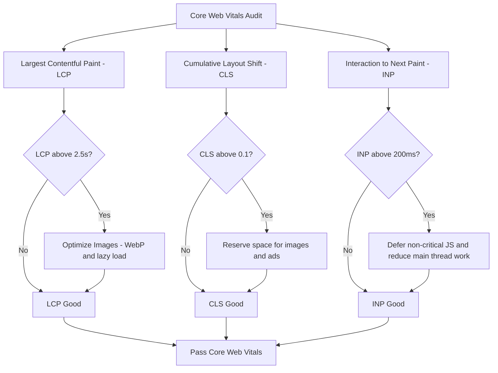

---

## 4. Technical SEO

### 4.1 Site Speed and Performance

Site speed is a critical ranking factor:

- **Minification and Compression:** Minify CSS, JavaScript, and HTML. Use Gzip or Brotli compression.
- **Caching and CDNs:** Leverage browser caching and content delivery networks (CDNs) to deliver content faster.
- **Lazy Loading:** Implement lazy loading for images and videos to defer loading of off-screen content.
- **Performance Testing:** Use tools like Google PageSpeed Insights, Lighthouse, or GTmetrix to identify and fix performance issues.

### 4.2 Mobile Optimization

With mobile-first indexing, ensuring your site is optimized for mobile devices is paramount.

- **Responsive Design:** Ensure your layout adapts to various screen sizes.
- **Touch-Friendly Elements:** Optimize buttons and forms for mobile interaction.
- **Mobile-Specific Testing:** Regularly test your site on mobile devices to check for usability issues.

### 4.3 Secure and Accessible Websites

- **HTTPS:** Secure your site with SSL certificates to build trust and meet ranking criteria.
- **Robots.txt and XML Sitemaps:** Use these tools to guide search engine crawlers efficiently.
- **Canonical Tags:** Prevent duplicate content issues by specifying preferred URLs.

### 4.4 Structured Data and Schema Markup

Implementing structured data can help search engines understand your content better and enable rich snippets.

- **JSON-LD:** The recommended format for adding structured data.
- **Schema Types:** Use schema types for articles, products, events, reviews, and more.
- **Rich Results Testing:** Validate your markup using Google’s Rich Results Test.

```html
<script type="application/ld+json">
  {
    "@context": "https://schema.org",
    "@type": "Article",
    "headline": "How to Improve SEO Rankings for a Website/Web App",
    "datePublished": "2025-02-26",
    "author": {
      "@type": "Person",
      "name": "Son Nguyen"
    },
    "publisher": {
      "@type": "Organization",
      "name": "Your Website Name",
      "logo": {
        "@type": "ImageObject",
        "url": "https://yourwebsite.com/logo.png"
      }
    }
  }
</script>
```

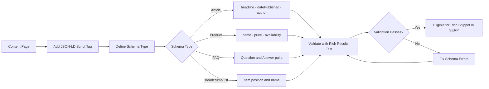

---

## 5. Content Quality and User Engagement

### 5.1 High-Quality, Relevant Content

- **Depth and Originality:** Write in-depth articles that provide real value.
- **Regular Updates:** Keep content fresh by updating it regularly to reflect new trends or data.
- **User-Generated Content:** Leverage reviews, testimonials, and forum discussions to add credibility.

### 5.2 Multimedia and Interactive Content

- **Visuals:** Incorporate high-quality images, videos, and infographics.
- **Interactive Elements:** Quizzes, calculators, and interactive charts can boost user engagement.
- **Engagement Metrics:** Monitor bounce rates, time on site, and social shares to measure content effectiveness.

### 5.3 Enhancing User Experience (UX)

User experience directly influences SEO rankings.

- **Intuitive Navigation:** Design a clear, logical structure with breadcrumbs and well-organized menus.
- **Fast Load Times:** As noted earlier, performance improvements reduce bounce rates.
- **Accessibility:** Follow WCAG guidelines to ensure your site is usable by everyone, including those with disabilities.

---

## 6. Link Building Strategies

### 6.1 Earning Quality Backlinks

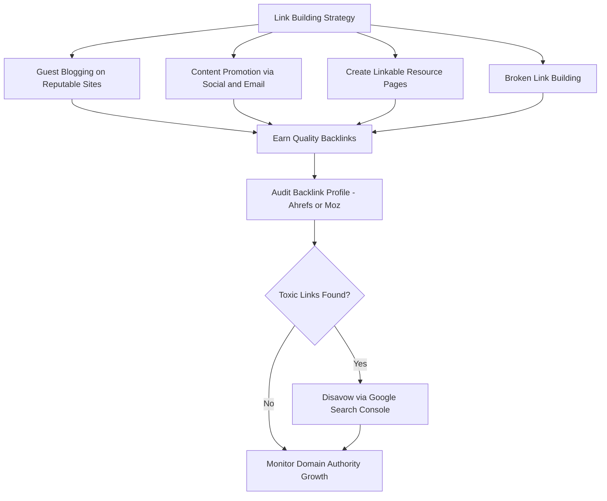

High-quality backlinks remain a top ranking factor:

- **Guest Blogging:** Write guest posts for reputable sites in your niche.
- **Content Promotion:** Actively promote your content through social media, email newsletters, and digital PR.
- **Resource Pages:** Create comprehensive resources that others will naturally want to link to.
- **Broken Link Building:** Identify broken links on reputable sites and suggest your content as a replacement.

### 6.2 Avoiding Negative SEO Practices

- **White-Hat Techniques:** Focus on natural, ethical link-building practices.
- **Disavow Toxic Links:** Regularly audit your backlink profile with tools like Google Search Console, Ahrefs, or Moz, and disavow harmful links if necessary.

---

## 7. Mobile SEO and AMP

### 7.1 Responsive and Mobile-First Design

- **Fluid Layouts:** Use CSS media queries to create a responsive design.
- **Mobile Usability:** Optimize font sizes, button sizes, and spacing for touch interactions.
- **Testing:** Use Google’s Mobile-Friendly Test to ensure compliance.

### 7.2 Accelerated Mobile Pages (AMP)

AMP can significantly improve load times on mobile devices:

- **AMP HTML:** A subset of HTML with custom tags for performance.
- **Caching and Validation:** Use AMP caches and validate your AMP pages with the AMP Validator.
- **Considerations:** Balance AMP’s benefits with potential limitations in design and interactivity.

---

## 8. Local SEO (if applicable)

For businesses targeting local customers:

- **Google My Business:** Claim and optimize your listing.
- **Local Citations:** Ensure your business name, address, and phone number (NAP) are consistent across directories.
- **Reviews and Ratings:** Encourage satisfied customers to leave positive reviews.
- **Localized Content:** Create content that addresses local events, news, or interests.

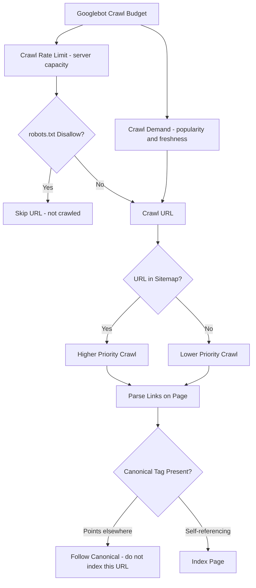

---

## 9. Monitoring and Analytics

### 9.1 Tracking Performance

Continuous monitoring is crucial:

- **Google Analytics:** Track traffic sources, user behavior, and conversion rates.
- **Google Search Console:** Monitor search queries, indexing issues, and crawl errors.
- **Third-Party Tools:** Use SEMrush, Ahrefs, Moz, or Screaming Frog to gain deeper insights into your SEO performance.

### 9.2 SEO Audits and A/B Testing

Regular audits help pinpoint areas for improvement:

- **Periodic Audits:** Conduct technical and content audits to identify and resolve issues.
- **A/B Testing:** Experiment with title tags, meta descriptions, and page layouts to determine what drives better engagement and rankings.
- **Conversion Rate Optimization (CRO):** Align SEO with CRO strategies to maximize the effectiveness of your traffic.

---

## 10. Advanced SEO Techniques and Future Trends

### 10.1 Voice Search Optimization

With the rise of smart speakers and voice assistants:

- **Conversational Keywords:** Optimize for natural language queries.
- **Featured Snippets:** Structure your content to appear in answer boxes.
- **Local Focus:** Voice searches often have local intent - optimize your local SEO accordingly.

### 10.2 AI and Machine Learning in SEO

Search engines are increasingly using AI (e.g., Google’s BERT and MUM algorithms):

- **Content Relevance:** Focus on high-quality, contextually relevant content.
- **Semantic Search:** Optimize your content to cover topics comprehensively rather than targeting a single keyword.
- **Data-Driven Decisions:** Use analytics and machine learning tools to refine your SEO strategy continuously.

---

### 10.3 Programmatic SEO

Programmatic SEO generates thousands of unique, high-value pages from structured data rather than writing each page by hand. It is the technique behind Zapier's integration directory (700k+ pages), Nomad List's city profiles, and Tripadvisor's hotel pages.

### 10.4. When to Use Programmatic SEO

A good programmatic SEO opportunity has three characteristics:

1. A large, structured dataset (products, locations, job titles, software integrations).
2. A clear URL template with obvious search intent (e.g., `/tools/[tool-a]-vs-[tool-b]`).
3. A realistic chance of ranking — the topic must not already be saturated by domain authorities you cannot compete with.

### 10.5. Next.js Implementation

```tsx
// app/integrations/[tool-a]-vs-[tool-b]/page.tsx
import { db } from "@/lib/db";
import { notFound } from "next/navigation";
import type { Metadata } from "next";

interface Props {
  params: { slug: string };
}

export async function generateStaticParams() {
  // Build a page for every integration pair in the database
  const pairs = await db.integrationPairs.findAll({
    select: ["slugA", "slugB"],
  });
  return pairs.map((p) => ({ "tool-a": p.slugA, "tool-b": p.slugB }));
}

export async function generateMetadata({ params }: Props): Promise<Metadata> {
  const [toolA, toolB] = params.slug.split("-vs-");
  const tools = await db.tools.findMany({
    where: { slug: { in: [toolA, toolB] } },
  });
  if (tools.length < 2) return {};

  return {
    title: `${tools[0].name} vs ${tools[1].name}: Which is Better in 2025?`,
    description: `Compare ${tools[0].name} and ${tools[1].name} on pricing, features, integrations, and ease of use.`,
    openGraph: {
      type: "article",
      title: `${tools[0].name} vs ${tools[1].name}`,
    },
  };
}

export default async function ComparisonPage({ params }: Props) {
  const [slugA, slugB] = params.slug.split("-vs-");
  const data = await db.comparisons.findOne({ where: { slugA, slugB } });
  if (!data) notFound();

  return <ComparisonTemplate data={data} />;
}
```

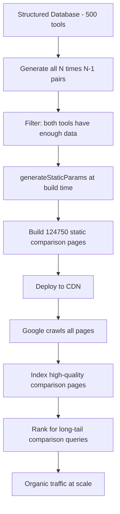

---

### 10.4 International SEO and hreflang

If your site targets multiple languages or regions, `hreflang` annotations tell Google which URL to serve to which audience. Missing or incorrect `hreflang` is one of the most common causes of international traffic loss.

### 10.5. Implementing hreflang in Next.js

```tsx
// app/[locale]/blog/[slug]/page.tsx
import type { Metadata } from "next";

const SUPPORTED_LOCALES = ["en", "es", "fr", "de", "ja"];

export async function generateMetadata({
  params,
}: {
  params: { locale: string; slug: string };
}): Promise<Metadata> {
  const canonicalUrl = `https://example.com/${params.locale}/blog/${params.slug}`;

  return {
    alternates: {
      canonical: canonicalUrl,
      languages: Object.fromEntries(
        SUPPORTED_LOCALES.map((locale) => [
          locale,
          `https://example.com/${locale}/blog/${params.slug}`,
        ]),
      ),
    },
  };
}
```

Next.js renders this as:

```html
<link rel="canonical" href="https://example.com/en/blog/my-post" />
<link
  rel="alternate"
  hreflang="en"
  href="https://example.com/en/blog/my-post"
/>
<link
  rel="alternate"
  hreflang="es"
  href="https://example.com/es/blog/my-post"
/>
<link
  rel="alternate"
  hreflang="fr"
  href="https://example.com/fr/blog/my-post"
/>
<link
  rel="alternate"
  hreflang="x-default"
  href="https://example.com/en/blog/my-post"
/>
```

Always include `x-default` to specify the fallback for users not matching any localized version.

---

### 10.5 Core Web Vitals Optimization Code

Google uses Core Web Vitals (LCP, CLS, INP) as ranking signals. Here are code-level fixes for the most common failures.

### 10.6. Fixing LCP: Preload the Hero Image

```tsx
// app/layout.tsx
import type { Metadata } from "next";

export const metadata: Metadata = {
  // Preload LCP image so it starts downloading before render
};

// Use next/image with priority for above-the-fold images
import Image from "next/image";

export function HeroBanner() {
  return (
    <Image
      src="/hero.jpg"
      alt="Hero banner"
      width={1200}
      height={600}
      priority // sets fetchpriority="high" and disables lazy loading
      placeholder="blur"
      blurDataURL="data:image/jpeg;base64,/9j/4AAQ..." // low-quality placeholder
    />
  );
}
```

### 10.7. Fixing CLS: Reserve Space for Dynamic Content

```css
/* Reserve space for ads or async-loaded content */
.ad-slot {
  min-height: 250px; /* match the expected ad height */
  width: 100%;
  background: #f0f0f0; /* placeholder background */
}

/* Reserve space for image carousels */
.hero-carousel {
  aspect-ratio: 16 / 9; /* prevents layout shift as images load */
  overflow: hidden;
}
```

### 10.8. Fixing INP: Defer Non-Critical JavaScript

```tsx
// components/analytics-widget.tsx
"use client";
import dynamic from "next/dynamic";

// Load analytics widget only after the page is interactive
const HeavyAnalytics = dynamic(() => import("./heavy-analytics"), {
  ssr: false,
  loading: () => <div className="analytics-placeholder" />,
});

export function AnalyticsSection() {
  return (
    <section>
      <HeavyAnalytics />
    </section>
  );
}
```

### 10.9. Using the Google Search Console API

Automate ranking tracking and index coverage reporting programmatically:

```javascript
// scripts/fetch-search-console.mjs
import { google } from "googleapis";

const auth = new google.auth.GoogleAuth({
  keyFile: "./service-account.json",
  scopes: ["https://www.googleapis.com/auth/webmasters.readonly"],
});

const searchConsole = google.searchconsole({ version: "v1", auth });

async function getTopQueries(siteUrl, days = 28) {
  const endDate = new Date().toISOString().split("T")[0];
  const startDate = new Date(Date.now() - days * 86400000)
    .toISOString()
    .split("T")[0];

  const { data } = await searchConsole.searchanalytics.query({
    siteUrl,
    requestBody: {
      startDate,
      endDate,
      dimensions: ["query"],
      rowLimit: 100,
      orderBy: [{ fieldName: "clicks", sortOrder: "DESCENDING" }],
    },
  });

  return data.rows?.map((row) => ({
    query: row.keys[0],
    clicks: row.clicks,
    impressions: row.impressions,
    ctr: (row.ctr * 100).toFixed(1) + "%",
    position: row.position.toFixed(1),
  }));
}

const queries = await getTopQueries("https://example.com/");
console.table(queries);
```

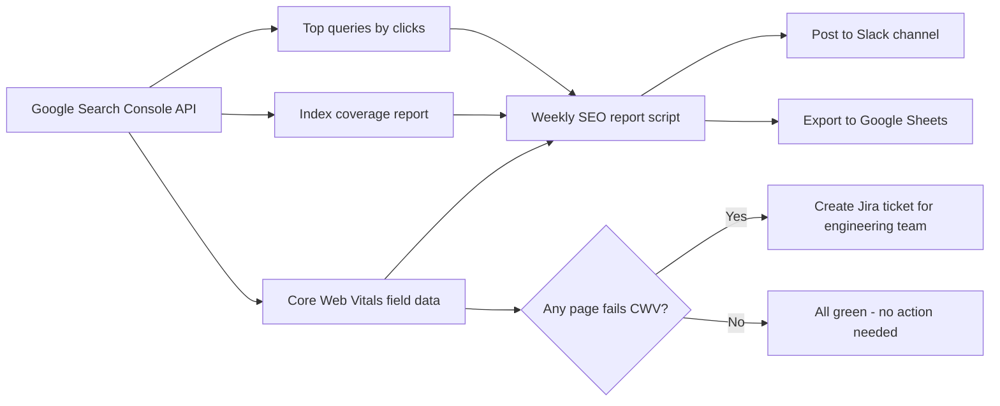

---

## 11. Conclusion

The sequence diagram below shows how a voice search query flows from a smart speaker through Google to a featured snippet result:

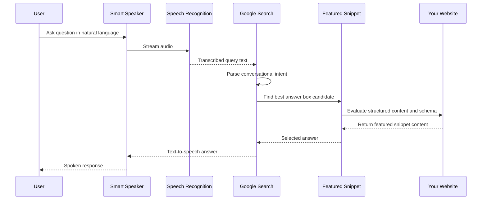

The diagram below shows how keyword intent is categorized and mapped to different content types to align with user goals:

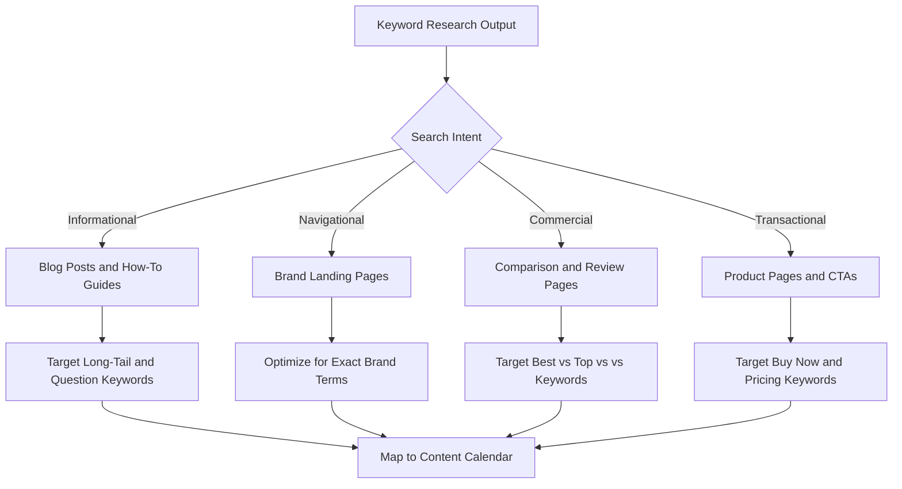

The class diagram models the key entities in an SEO audit tool and how they relate to each other during a site crawl:

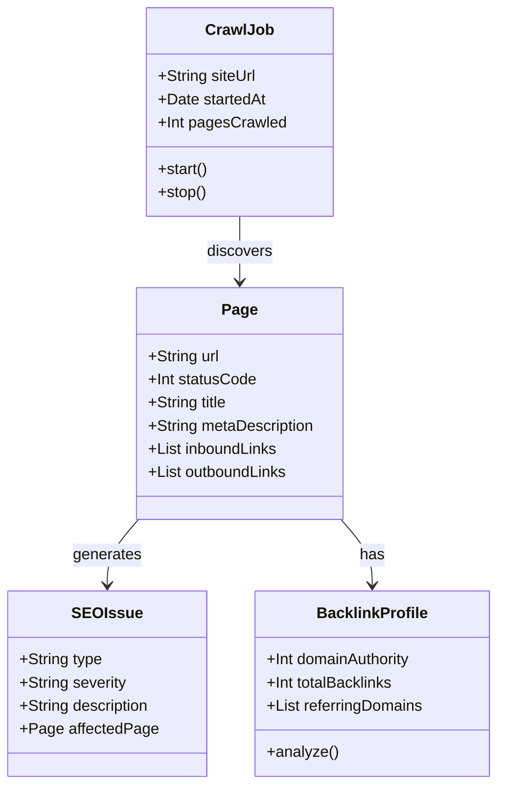

The state diagram shows how a page progresses through Google's indexing pipeline after being published:

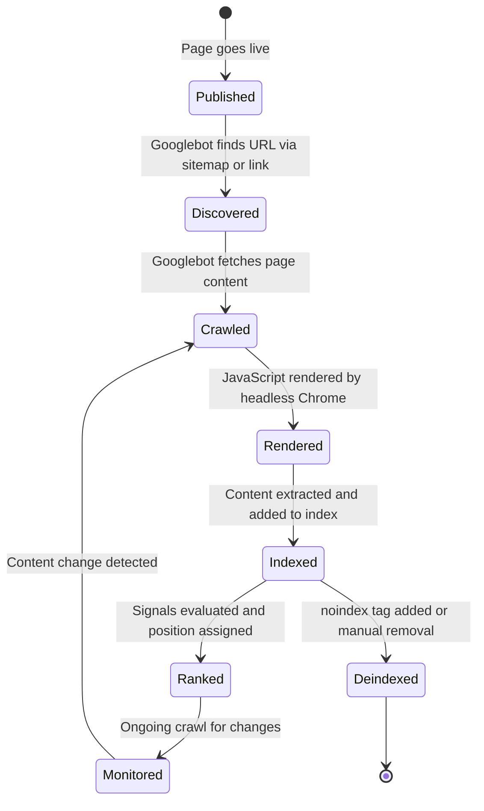

Improving SEO rankings is a multifaceted and ongoing endeavor. By implementing a robust strategy that includes thorough keyword research, compelling content creation, meticulous on-page and technical optimizations, ethical link-building practices, and continuous performance monitoring, you can enhance your site’s visibility and authority in search engines.

SEO is not a one-time task but a continuous process of testing, learning, and adapting to new trends and algorithm changes. As search engines evolve, staying informed and proactive will enable you to maintain - and even improve - your rankings over time.

**Key Takeaways:**

- Programmatic SEO is the highest-leverage approach when you have structured data — one well-architected template can generate thousands of ranking pages.
- `hreflang` correctness is binary: either all alternate URLs are reciprocally linked and the `x-default` is set, or Google ignores the whole set.
- LCP is most often fixed by adding `priority` to the hero `<Image>` and preconnecting to image CDN origins.
- CLS is most often fixed by adding explicit dimensions or `aspect-ratio` CSS to every image, video, and ad slot loaded after initial paint.
- INP (replacing FID as of March 2024) measures responsiveness to all interactions — defer heavy JavaScript and break up long tasks to stay under the 200 ms budget.
- The Google Search Console API enables automated SEO monitoring and alerting, replacing manual dashboard checks with data-driven workflows.

---

## 12. Further Reading & Resources

- **SEO Best Practices:**
  - [Google’s SEO Starter Guide](https://support.google.com/webmasters/answer/7451184)
  - [Moz Beginner's Guide to SEO](https://moz.com/beginners-guide-to-seo)
- **Keyword Research and Content Strategy:**
  - [Ahrefs Blog](https://ahrefs.com/blog/)
  - [SEMrush Academy](https://www.semrush.com/academy/)
- **Technical SEO:**
  - [Google PageSpeed Insights](https://developers.google.com/speed/pagespeed/insights/)
  - [Structured Data Guidelines](https://developers.google.com/search/docs/guides/intro-structured-data)
- **Analytics and Monitoring:**
  - [Google Analytics](https://analytics.google.com/)
  - [Google Search Console](https://search.google.com/search-console/about)
- **Local SEO:**
  - [BrightLocal Blog](https://www.brightlocal.com/blog/)
  - [Google My Business Help](https://support.google.com/business/)

By integrating these strategies and continuously refining your approach, you can build a strong SEO foundation that drives sustainable organic growth and sets your website or web app apart in a competitive digital landscape.
