import MdxLayout from "@/components/MdxLayout";

export const metadata = {
  title: "InfluxDB: A Deep Dive into the Time Series Database",
  description:
    "An in-depth exploration of InfluxDB, its architecture, performance optimizations, advanced features, and real-world use cases in real-time monitoring and analytics.",
  topics: ["Databases", "Monitoring", "Time Series", "Performance"],
};

export default function InfluxDBArticle({ children }) {
  return <MdxLayout>{children}</MdxLayout>;
}

# InfluxDB: A Deep Dive into the Time Series Database

### Author: Son Nguyen

> Date: 2024-05-15

InfluxDB is a high-performance, open-source time series database purpose-built to handle vast volumes of time-stamped data. It powers applications from system monitoring and IoT data collection to real-time analytics. In this comprehensive article, we take a deep dive into InfluxDB’s architecture, performance optimizations, advanced features, and how it fits within the modern data ecosystem.

---

## 1. Introduction

In a world driven by real-time data, managing time-stamped information efficiently is paramount. InfluxDB was designed from the ground up for this purpose. It distinguishes itself with:

- **High-Speed Ingestion:** Capable of processing millions of data points per second.
- **Efficient Storage:** Optimized for compressing and retaining large volumes of time series data.
- **Powerful Querying:** Supports both SQL-like InfluxQL and the expressive Flux language for dynamic analysis.

This article provides a thorough exploration of how InfluxDB achieves these goals and why it remains a top choice for time series data management.

---

## 2. InfluxDB Overview

InfluxDB is not just another database - it’s a purpose-built solution for time series data. Unlike traditional relational databases, it’s engineered to handle continuous streams of data, making it ideal for:

- **Monitoring and Observability:** Tracking system and application metrics.
- **IoT Applications:** Collecting and analyzing sensor data in real time.
- **Analytics and Reporting:** Aggregating time-based data for trends and insights.

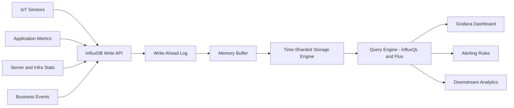

Key advantages include:

- **Scalability:** Both vertical and horizontal scaling options.
- **Flexible Data Retention:** Configurable policies to manage data lifecycle.
- **Ease of Use:** Intuitive query languages and integration with popular tools.

---

## 3. Deep Dive into Core Architecture

Understanding InfluxDB’s internals reveals how it efficiently manages time series data. The architecture comprises several key components:

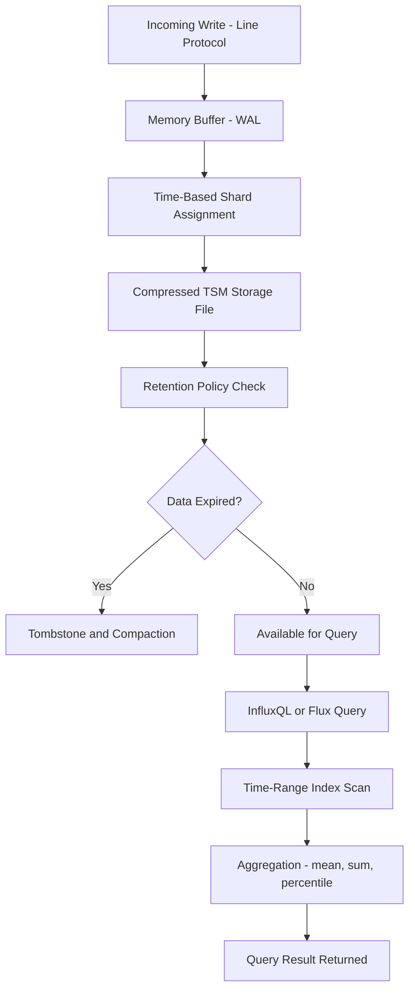

### 3.1 Write Path

- **Data Ingestion Pipeline:**
  Data enters InfluxDB and is first held in a memory buffer. This design minimizes disk I/O and allows for rapid batch writes.

- **Write-Ahead Log (WAL):**
  Before data is persisted, it is recorded in a write-ahead log. The WAL ensures durability and facilitates quick recovery in case of system failure.

- **Time-Based Sharding:**
  Data is partitioned into shards based on time intervals. This method reduces the query load by limiting the scan range and simplifies data expiration.

### 3.2 Query Engine

- **Dual Query Languages:**
  InfluxDB supports InfluxQL, a SQL-like language, for users familiar with traditional query syntax. Additionally, Flux offers powerful data transformation and analysis capabilities.

- **Optimized for Time Ranges:**
  The query engine leverages time-based indexing, ensuring that queries over specific intervals are executed swiftly.

- **Aggregation and Downsampling:**
  Built-in functions allow for real-time aggregation (e.g., mean, sum, percentile), critical for dashboards and monitoring applications.

### 3.3 Storage Engine

- **Efficient Compression:**
  InfluxDB uses advanced compression techniques to store time series data compactly, reducing disk space usage without compromising performance.

- **Retention Policies:**
  Data retention is controlled through user-defined policies, automatically expiring data that is no longer needed.

- **Tombstoning and Compaction:**
  Deleted or expired data is efficiently managed to reclaim storage, ensuring long-term performance and reliability.

---

## 4. Advanced Features and Ecosystem Integration

InfluxDB goes beyond basic storage and querying by offering several advanced features that enhance its capabilities.

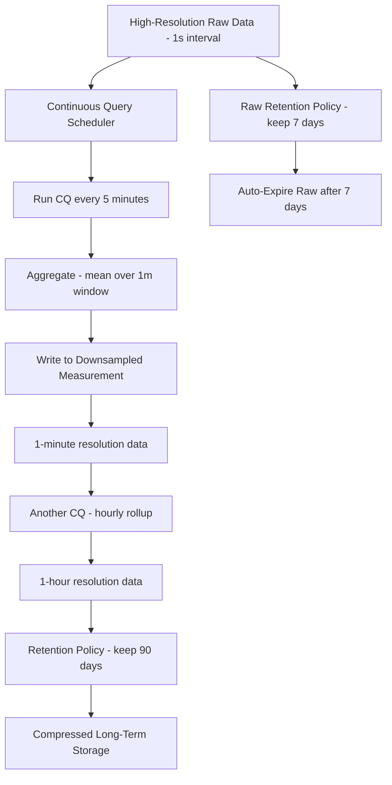

### 4.1 Continuous Queries and Downsampling

- **Automatic Data Summarization:**
  Continuous Queries (CQs) run at scheduled intervals to downsample high-resolution data. This process reduces storage overhead while preserving essential trends.

- **Real-Time Aggregation:**
  Downsampled data is stored alongside raw data, enabling both detailed and summarized views for different analytical needs.

### 4.2 Clustering and High Availability

- **Distributed Architecture:**
  InfluxDB can be deployed in a clustered environment, distributing data across multiple nodes for redundancy and scalability.

- **Data Replication:**
  Replication ensures that copies of data exist on different nodes, enhancing fault tolerance and ensuring continuous availability even during node failures.

### 4.3 Ecosystem and Integrations

- **Third-Party Tools:**
  InfluxDB integrates with popular visualization tools like Grafana, enabling rich, interactive dashboards.

- **APIs and Client Libraries:**
  With robust REST APIs and client libraries for multiple languages (Node.js, Python, Go, etc.), developers can easily integrate InfluxDB into existing systems.

- **Flux Language:**
  Flux is a versatile scripting language for data processing, enabling complex queries, data transformations, and integration with external systems.

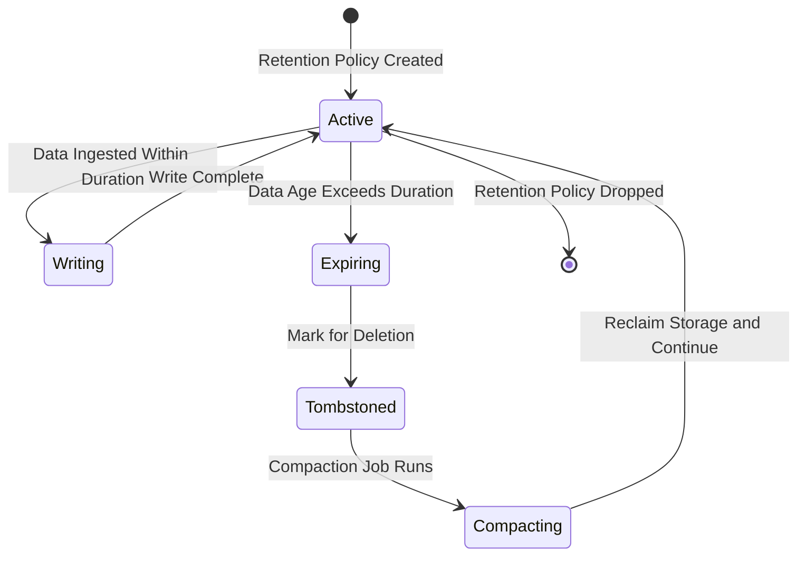

---

## 5. Performance Tuning and Optimization

Optimizing InfluxDB for your use case involves several best practices:

### 5.1 Optimizing Data Ingestion

- **Batch Writes:**
  Consolidate multiple data points into single batch writes to minimize overhead.

- **Proper Shard Duration:**
  Choosing the right shard duration based on your data retention needs and query patterns is critical for performance.

- **Buffer Management:**
  Monitor and adjust memory buffers to ensure smooth ingestion under high load.

### 5.2 Query Performance

- **Indexing and Time Range Filtering:**
  Use time-based filters to limit the query scope. InfluxDB’s time indexes are optimized for these types of queries.

- **Aggregation Strategies:**
  Use pre-aggregated data via continuous queries to speed up real-time analytics.

### 5.3 Storage Optimization

- **Retention Policy Tuning:**
  Configure retention policies to automatically expire stale data, reducing storage bloat.

- **Compression Settings:**
  Fine-tune compression settings based on the data ingestion rate and query performance.

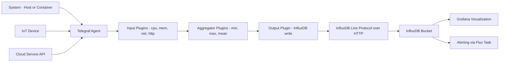

---

## 6. Comparison with Other Time Series Databases

While InfluxDB is a leading time series database, it’s helpful to compare it with alternatives:

- **Prometheus:**
  Primarily focused on monitoring and alerting with a pull-based model. InfluxDB offers more flexible querying and data retention policies.

- **TimescaleDB:**
  Built as an extension to PostgreSQL, offering SQL support and relational capabilities. InfluxDB is designed from scratch for time series data, often resulting in higher write throughput and more efficient storage for pure time series workloads.

- **OpenTSDB:**
  Uses HBase for storage, which can be complex to manage. InfluxDB provides an easier-to-deploy, self-contained solution.

Each database has its strengths, and the choice often depends on specific use cases and infrastructure preferences.

---

## 7. Real-World Use Cases

### 7.1 System and Application Monitoring

InfluxDB is widely used to monitor infrastructure and applications. It collects metrics such as CPU load, memory usage, disk I/O, and network traffic. The ability to query and visualize these metrics in near real time is essential for proactive system maintenance and troubleshooting.

### 7.2 IoT and Sensor Data Management

In IoT applications, devices continuously generate time-stamped data. InfluxDB’s high ingestion rates and efficient storage make it ideal for collecting and analyzing sensor data, whether it’s for industrial automation, smart cities, or environmental monitoring.

### 7.3 Business Analytics and Real-Time Insights

Organizations use InfluxDB to analyze operational data in real time, gaining insights into customer behavior, market trends, and system performance. Its flexible query capabilities allow for dynamic aggregation and complex data transformations, providing actionable intelligence across various domains.

---

## 8. Example: Using the InfluxDB Node.js Client

Here’s a practical example demonstrating how to write data to InfluxDB using the Node.js client:

```javascript
const { InfluxDB, Point } = require("@influxdata/influxdb-client");

const url = "http://localhost:8086";
const token = "YOUR_INFLUXDB_TOKEN";
const org = "YOUR_ORG";
const bucket = "YOUR_BUCKET";

const influxDB = new InfluxDB({ url, token });
const writeApi = influxDB.getWriteApi(org, bucket);
writeApi.useDefaultTags({ host: "server1" });

const point = new Point("temperature")
  .floatField("value", 23.5)
  .timestamp(new Date());

writeApi.writePoint(point);
writeApi
  .close()
  .then(() => {
    console.log("WRITE FINISHED");
  })
  .catch((e) => {
    console.error(e);
  });
```

This example illustrates how InfluxDB integrates seamlessly with Node.js, making it easy to send time series data from your applications.

---

## 9. Challenges and Considerations

While InfluxDB is a robust solution, there are some challenges to consider:

- **Scalability Limitations:**
  For extremely high-scale environments, planning for a clustered deployment is essential.

- **Operational Complexity:**
  Fine-tuning retention policies, shard durations, and buffer sizes requires careful monitoring and adjustments.

- **Ecosystem Maturity:**
  Although InfluxDB has a vibrant ecosystem, integrating it with legacy systems or other databases might require additional engineering efforts.

---

## 10. Best Practices for Deployment

- **Monitor Continuously:**
  Set up dashboards and alerts to track ingestion rates, query performance, and storage utilization.

- **Plan for Growth:**
  Design your deployment with scalability in mind - consider clustering if you expect high data volumes.

- **Regular Maintenance:**
  Periodically review retention policies and compression settings to optimize performance and manage costs.

- **Stay Updated:**
  Keep up with the latest releases and best practices from the InfluxData community to leverage new features and improvements.

---

## 11. Advanced Monitoring and Visualization

The sequence diagram below illustrates how a Flux alerting task detects a threshold breach and fires a notification:

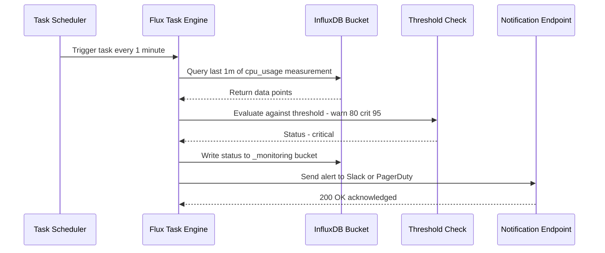

The class diagram models the core InfluxDB data model concepts and how they compose into a measurable time series:

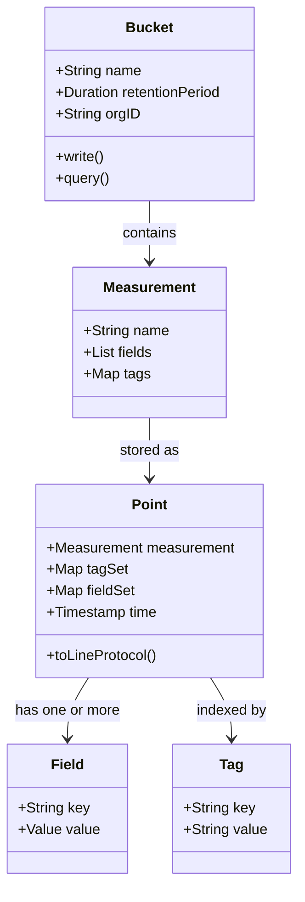

The diagram below compares InfluxDB against Prometheus and TimescaleDB across key architectural dimensions:

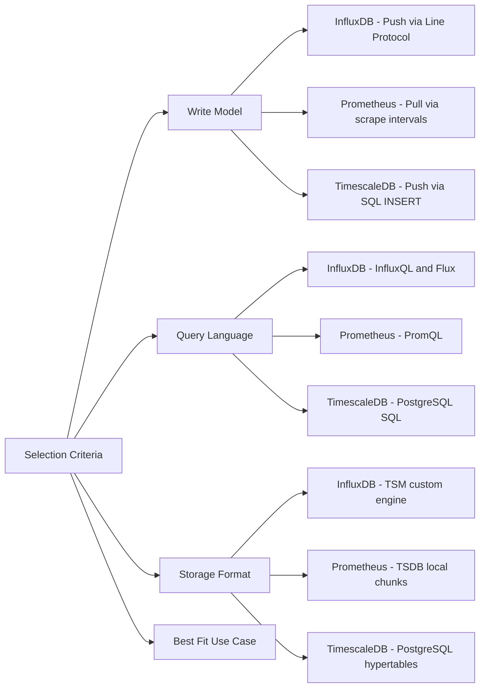

The state diagram captures the lifecycle of an InfluxDB shard from creation through eventual expiry and compaction:

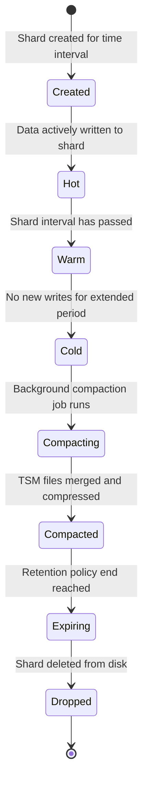

---

## 12. Flux Query Language Deep Dive

Flux is InfluxDB’s functional data scripting language. Unlike InfluxQL, Flux treats the query as a pipeline of transformations — every step returns a table or a stream of tables, which the next step consumes.

### 12.1. Core Flux Concepts

```flux
// Structure: from() → range() → filter() → transform → yield()

// Basic query: CPU usage for host01 in the last hour
from(bucket: "telemetry")
  |> range(start: -1h)
  |> filter(fn: (r) =>
      r._measurement == "cpu" and
      r._field       == "usage_idle" and
      r.host         == "host01"
  )
  |> map(fn: (r) => ({r with _value: 100.0 - r._value}))  // convert to usage_active
  |> yield(name: "cpu_active")
```

### 12.2. Window and Aggregation

```flux
// 5-minute mean CPU usage, grouped by host
from(bucket: "telemetry")
  |> range(start: -6h)
  |> filter(fn: (r) => r._measurement == "cpu" and r._field == "usage_idle")
  |> map(fn: (r) => ({r with _value: 100.0 - r._value}))
  |> aggregateWindow(every: 5m, fn: mean, createEmpty: false)
  |> group(columns: ["host"])
  |> yield(name: "5m_avg_by_host")
```

### 12.3. Join: Correlating Two Measurements

```flux
// Join temperature and humidity from the same sensor
temp = from(bucket: "sensors")
  |> range(start: -1h)
  |> filter(fn: (r) => r._measurement == "environment" and r._field == "temperature")

humidity = from(bucket: "sensors")
  |> range(start: -1h)
  |> filter(fn: (r) => r._measurement == "environment" and r._field == "humidity")

join(
  tables: {temp: temp, hum: humidity},
  on: ["_time", "sensor_id"],
)
|> map(fn: (r) => ({
    _time:       r._time,
    sensor_id:   r.sensor_id,
    temperature: r._value_temp,
    humidity:    r._value_hum,
    heat_index:  r._value_temp + (0.33 * r._value_hum) - 4.0,
}))
|> yield(name: "heat_index")
```

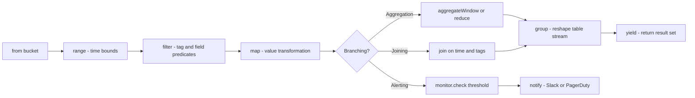

### 12.4. Flux Tasks: Scheduled Downsampling

```flux
// Save as a task that runs every 10 minutes
option task = {
  name:   "downsample_cpu_to_1m",
  every:  10m,
  offset: 0m,
}

from(bucket: "telemetry/autogen")
  |> range(start: -task.every)
  |> filter(fn: (r) => r._measurement == "cpu")
  |> aggregateWindow(every: 1m, fn: mean)
  |> to(
      bucket: "telemetry_1m",
      org:    "my-org",
  )
```

---

## 13. InfluxDB v3 (InfluxDB Cloud Serverless)

InfluxDB v3 represents a ground-up architectural rewrite, moving from the custom TSM storage engine to Apache Arrow and Apache Parquet, with SQL as a first-class query language alongside Flux.

### 13.1. Key v3 Changes

| Feature            | InfluxDB OSS v2             | InfluxDB v3 (Cloud Serverless)   |
| ------------------ | --------------------------- | -------------------------------- |
| Storage engine     | TSM (custom)                | Apache Parquet on object storage |
| Query languages    | InfluxQL, Flux              | SQL, InfluxQL (Flux deprecated)  |
| Cardinality limits | Strict (millions of series) | Much higher (columnar storage)   |
| Schema             | Tag-based series            | Apache Arrow schema              |
| Deployment         | Self-hosted or cloud        | Serverless cloud-native          |
| Infinite retention | Via retention policies      | Pay-per-query on object storage  |

### 13.2. SQL in InfluxDB v3

```sql
-- v3 uses standard SQL with time-series extensions
SELECT
  DATE_BIN(INTERVAL ‘5 minutes’, time, ‘1970-01-01’) AS window,
  host,
  AVG(usage_idle)  AS avg_idle,
  MIN(usage_idle)  AS min_idle,
  MAX(usage_idle)  AS max_idle
FROM cpu
WHERE time >= NOW() - INTERVAL ‘6 hours’
GROUP BY 1, 2
ORDER BY 1, 2;
```

### v3 Python Client

```python
import influxdb_client_3 as influxdb3
import pandas as pd

client = influxdb3.InfluxDBClient3(
    host  ="https://us-east-1-1.aws.cloud2.influxdata.com",
    token ="YOUR_TOKEN",
    database="telemetry",
)

# Write using Arrow Table
import pyarrow as pa

schema = pa.schema([
    pa.field("host",        pa.string()),
    pa.field("usage_idle",  pa.float64()),
    pa.field("time",        pa.timestamp("ns", tz="UTC")),
])

table = pa.table(
    {"host": ["server-1"], "usage_idle": [87.2],
     "time": pd.to_datetime(["now"], utc=True)},
    schema=schema,
)
client.write(table, data_type=influxdb3.WriteOptions(write_precision="ns"))

# Query with SQL
df = client.query("SELECT * FROM cpu WHERE time > now() - interval ‘1 hour’")
print(df.head())
```

---

## 14. IoT Pipeline Example: Edge to Dashboard

A complete end-to-end pipeline from MQTT-publishing sensors through Telegraf into InfluxDB and visualized in Grafana.

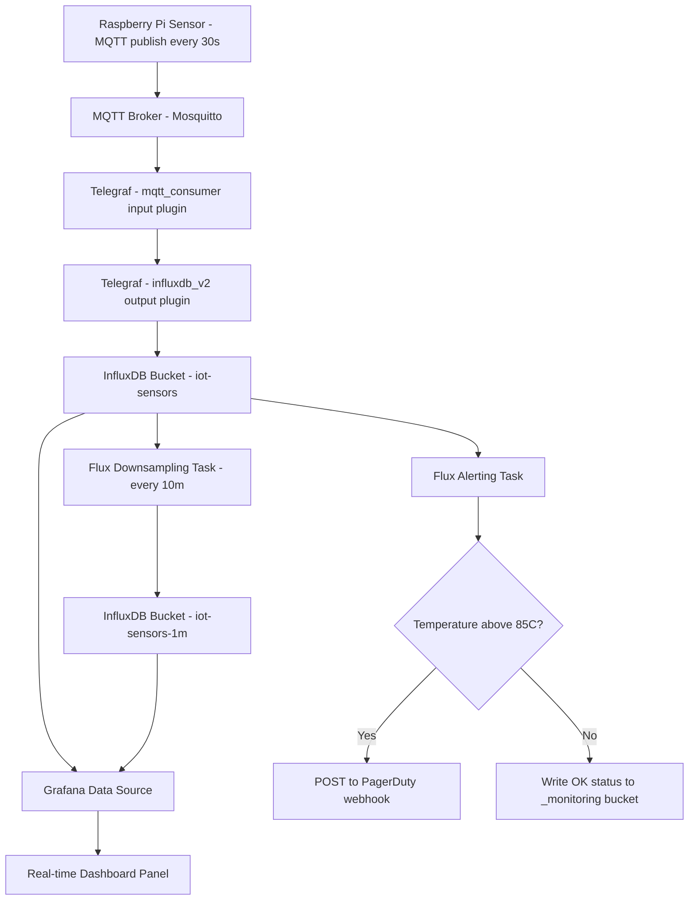

### 14.1. Telegraf Configuration for MQTT

```toml
# telegraf.conf

[[inputs.mqtt_consumer]]
  servers         = ["tcp://mqtt-broker:1883"]
  topics          = ["sensors/+/temperature", "sensors/+/humidity"]
  qos             = 1
  connection_timeout = "30s"
  username        = "telegraf"
  password        = "secret"
  data_format     = "json"
  json_time_key   = "ts"
  json_time_format = "unix_ms"
  tag_keys        = ["sensor_id", "location"]

[[outputs.influxdb_v2]]
  urls            = ["http://influxdb:8086"]
  token           = "$INFLUXDB_TOKEN"
  organization    = "acme"
  bucket          = "iot-sensors"
  timeout         = "5s"
```

---

## 15. Conclusion

InfluxDB stands as a powerful solution for managing time series data. Its architecture is optimized for fast ingestion, efficient storage, and high-performance querying - making it indispensable for modern applications requiring real-time insights. From system monitoring and IoT data collection to complex business analytics, InfluxDB provides the tools and flexibility to harness the full potential of your data.

The Flux language brings pipeline-oriented data transformations, scheduled downsampling tasks, and built-in alerting — all from a single query language. InfluxDB v3’s shift to Apache Parquet and SQL opens the door to higher cardinality workloads and seamless integration with the broader Arrow ecosystem. Combined with Telegraf’s broad input plugin library, InfluxDB is a complete, production-proven platform for any time series challenge.

By understanding its inner workings and applying best practices in deployment and tuning, developers and architects can build resilient, scalable systems that meet today’s demanding data needs. Whether you’re just starting with time series data or looking to optimize an existing deployment, InfluxDB offers a proven path to success.

For further details, deep dives, and community support, please refer to the [InfluxDB Documentation](https://docs.influxdata.com/influxdb/) and join the vibrant community of users and contributors.

---
