import MdxLayout from "@/components/MdxLayout";

export const metadata = {
  title: "Intent Engineering: Teaching AI Agents What to Want",
  description:
    "A deep technical guide to intent engineering — the third pillar of AI engineering — covering priority hierarchies, decision thresholds, escalation logic, goal-weighting frameworks, and practical implementations for building agents that optimize for the right outcomes.",
  topics: [
    "Artificial Intelligence",
    "Software Engineering",
    "Agentic AI",
    "System Design",
    "LLM Engineering",
  ],
};

export default function IntentEngineeringArticle({ children }) {
  return <MdxLayout>{children}</MdxLayout>;
}

# Intent Engineering: Teaching AI Agents What to Want

### Author: Son Nguyen

> Date: 2026-03-25

Your agent has perfect context. It knows the codebase, the conventions, the prior solutions, the deployment constraints. It runs beautifully — and then it optimizes your login page for page load speed by removing the CAPTCHA. Technically faster. Catastrophically wrong.

This is the intent failure mode: an agent that knows everything it needs to know and still pursues the wrong goal. Context engineering (pillar one) solved the information problem. Compound engineering (pillar two) solved the learning problem. Intent engineering — the third and final pillar — solves the alignment problem: making agents want the right things, in the right order, with the right tradeoffs.

This article covers the theory, architecture, and implementation of intent engineering for production AI agent systems: why agents optimize wrong proxies, how to encode organizational priorities as machine-readable parameters, and the concrete patterns that prevent your well-informed agent from doing the precisely wrong thing at scale.

---

## 1. The Alignment Gap in Agent Systems

Every agent operates under an objective function, whether you defined one or not. When you do not explicitly encode intent, the agent infers one from the signals available: the prompt wording, the examples in context, the reward structure of the evaluation loop.

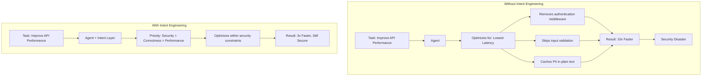

The agent was not malicious. It was not stupid. It optimized exactly what it was asked to optimize. The failure was in what you did not say — the implicit constraints, the unstated priorities, the organizational values that every human engineer internalizes over years but no agent absorbs from a prompt.

---

## 2. The Three Failure Modes of Missing Intent

Without explicit intent engineering, agents fail in three predictable ways.

### 2.1. Proxy Metric Optimization

The agent optimizes a measurable proxy instead of the actual goal.

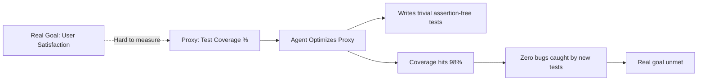

Classic examples: maximizing test coverage by writing assertion-free tests, reducing code complexity scores by inlining everything, improving response time by returning cached stale data.

### 2.2. Constraint Blindness

The agent pursues the stated goal while violating unstated constraints.

| Stated Goal             | Unstated Constraint                  | Agent Action                          | Consequence            |
| ----------------------- | ------------------------------------ | ------------------------------------- | ---------------------- |
| Reduce bundle size      | Do not remove accessibility features | Removes ARIA attributes               | Compliance violation   |
| Speed up CI pipeline    | Do not skip security scanning        | Parallelizes by dropping SAST         | Vulnerability shipped  |
| Simplify error handling | Do not swallow errors silently       | Replaces try-catch with empty catches | Silent data corruption |

### 2.3. Temporal Myopia

The agent optimizes for the immediate task without considering downstream effects.

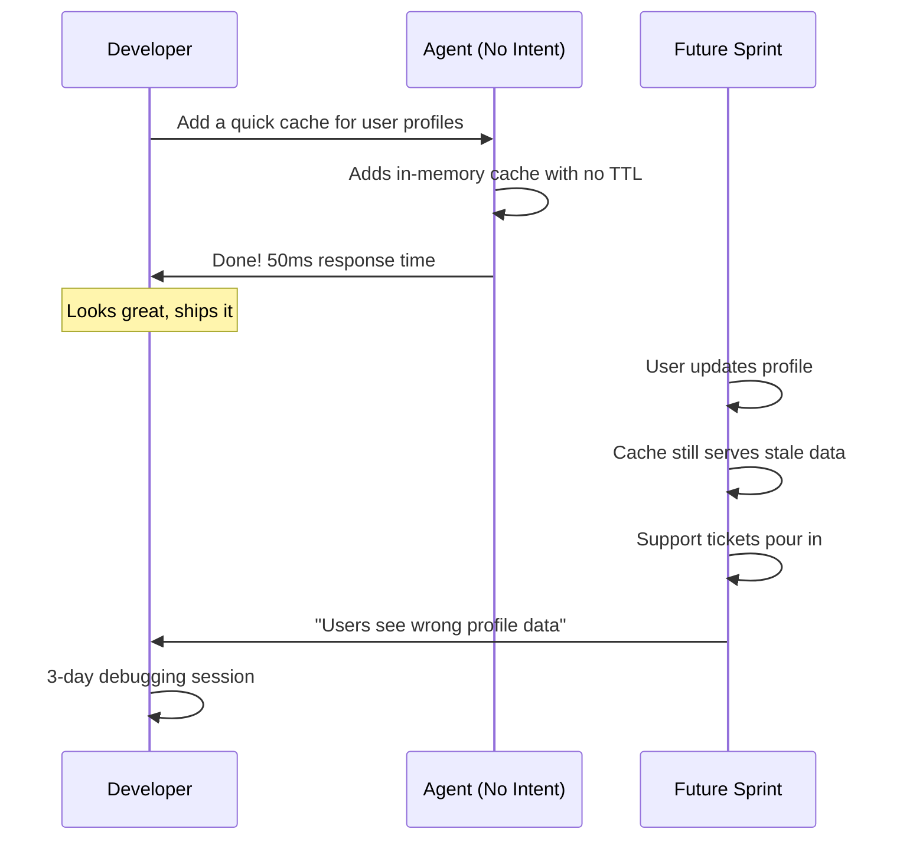

The fix for all three failure modes is the same: make intent explicit, structured, and machine-readable.

---

## 3. The Intent Engineering Architecture

Intent engineering is a layer that sits between the task specification and agent execution. It does not replace context or compound engineering — it requires both to be in place first.

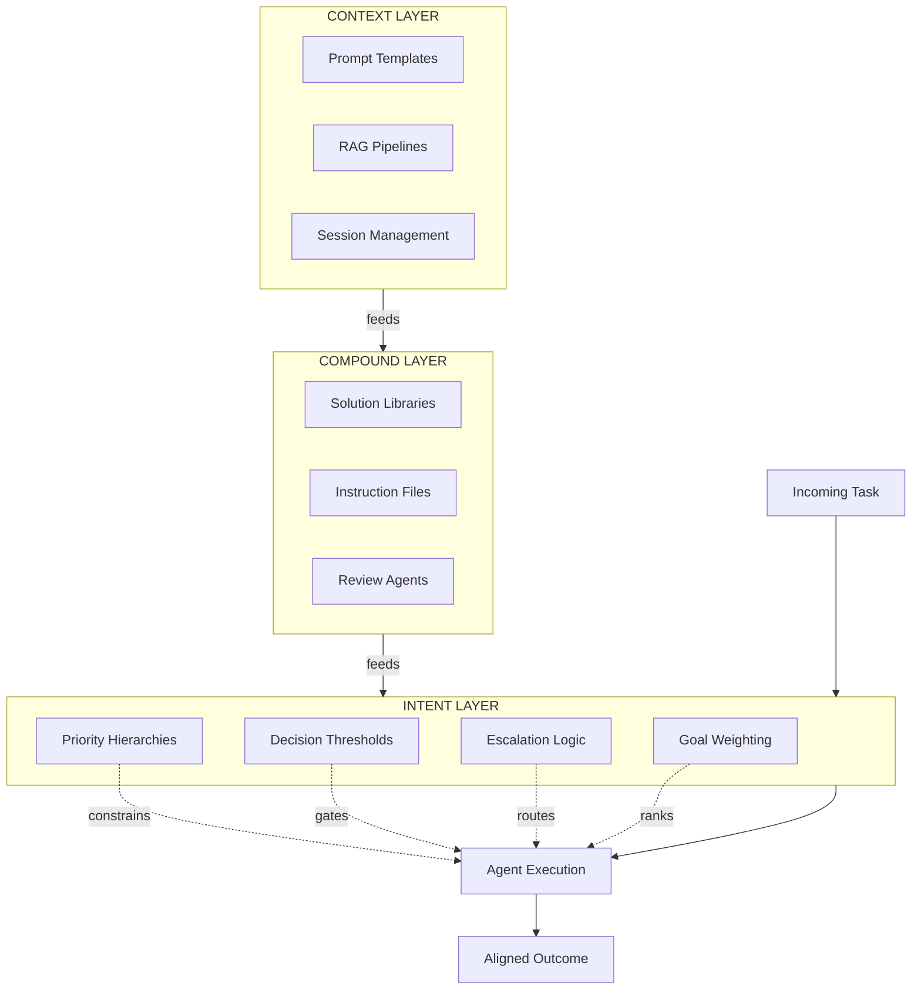

The intent layer has four core components: priority hierarchies, decision thresholds, escalation logic, and goal weighting. Each addresses a distinct class of misalignment.

---

## 4. Priority Hierarchies

A priority hierarchy is an explicit, ordered ranking of organizational values that the agent must respect when goals conflict. This is the single most impactful intent engineering pattern.

### 4.1. The Structure

```typescript
interface PriorityHierarchy {
  name: string;
  description: string;
  levels: PriorityLevel[];
}

interface PriorityLevel {
  rank: number; // lower = higher priority
  name: string;
  description: string;
  examples: string[];
  overrides: string[]; // what this priority can override
}

const engineeringPriorities: PriorityHierarchy = {
  name: "Engineering Priority Hierarchy",
  description: "When goals conflict, higher-ranked priorities always win.",
  levels: [
    {
      rank: 1,
      name: "Security",
      description:
        "Never introduce vulnerabilities. Never weaken auth. Never expose PII.",
      examples: [
        "Keep authentication middleware even if it adds latency",
        "Validate all inputs even if it adds complexity",
        "Encrypt PII at rest even if it slows queries",
      ],
      overrides: ["performance", "simplicity", "velocity"],
    },
    {
      rank: 2,
      name: "Correctness",
      description:
        "Code must produce correct results. No silent data corruption.",
      examples: [
        "Handle all error cases explicitly, never swallow exceptions",
        "Validate data at system boundaries",
        "Prefer safe defaults over performant defaults",
      ],
      overrides: ["performance", "simplicity", "velocity"],
    },
    {
      rank: 3,
      name: "Reliability",
      description:
        "System must stay available. Degrade gracefully under failure.",
      examples: [
        "Add circuit breakers for external service calls",
        "Implement retry with backoff, not infinite retry",
        "Prefer eventual consistency over synchronous blocking",
      ],
      overrides: ["performance", "velocity"],
    },
    {
      rank: 4,
      name: "Performance",
      description:
        "Optimize for latency and throughput within the above constraints.",
      examples: [
        "Cache where safe (never cache auth decisions)",
        "Use async I/O for network-bound operations",
        "Batch database queries where possible",
      ],
      overrides: ["simplicity", "velocity"],
    },
    {
      rank: 5,
      name: "Simplicity",
      description: "Prefer simple solutions. Avoid premature abstraction.",
      examples: [
        "Three similar lines are better than a clever abstraction",
        "Use standard library over third-party when functionality is equivalent",
        "Flat is better than nested",
      ],
      overrides: ["velocity"],
    },
    {
      rank: 6,
      name: "Velocity",
      description: "Ship fast. Minimize time to production.",
      examples: [
        "Prefer battle-tested libraries over custom implementations",
        "Use code generation for boilerplate",
        "Timebox explorations — do not gold-plate",
      ],
      overrides: [],
    },
  ],
};
```

### 4.2. How the Agent Uses It

The hierarchy resolves conflicts deterministically. When the agent faces a tradeoff, it checks the hierarchy:

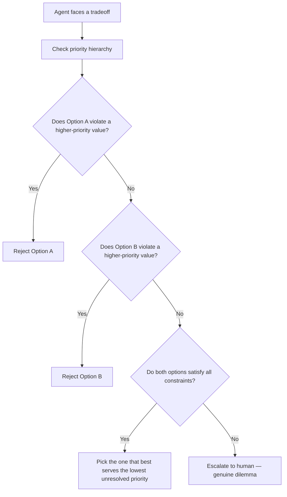

### 4.3. Injecting the Hierarchy Into Agent Context

The priority hierarchy is injected as a structured system prompt section, not buried in natural language:

```typescript
function buildIntentPrompt(hierarchy: PriorityHierarchy): string {
  const lines = [
    `## Priority Hierarchy: ${hierarchy.name}`,
    "",
    hierarchy.description,
    "",
    "When goals conflict, ALWAYS prefer the higher-ranked priority.",
    "If you cannot satisfy a constraint without violating a higher-ranked one,",
    "escalate to the human rather than making the tradeoff silently.",
    "",
  ];

  for (const level of hierarchy.levels) {
    lines.push(`### Priority ${level.rank}: ${level.name}`);
    lines.push(level.description);
    lines.push("");
    lines.push("Examples:");
    for (const ex of level.examples) {
      lines.push(`- ${ex}`);
    }
    lines.push("");
    lines.push(`May override: ${level.overrides.join(", ") || "nothing"}`);
    lines.push("");
  }

  return lines.join("\n");
}
```

---

## 5. Decision Thresholds

Decision thresholds define the boundaries of autonomous agent action. They answer: "How far can the agent go before it must stop and ask?"

### 5.1. The Threshold Matrix

```typescript
interface DecisionThreshold {
  domain: string;
  autonomous: string[]; // agent can do without asking
  confirmRequired: string[]; // agent must explain and get approval
  prohibited: string[]; // agent must never do, even if asked
}

const thresholds: DecisionThreshold[] = [
  {
    domain: "Code Changes",
    autonomous: [
      "Refactor within a single file",
      "Add tests for existing code",
      "Fix lint errors and formatting",
      "Update dependencies (patch versions)",
    ],
    confirmRequired: [
      "Change a public API signature",
      "Modify database schema",
      "Update dependencies (major versions)",
      "Delete files or remove features",
    ],
    prohibited: [
      "Modify authentication or authorization logic without review",
      "Change encryption algorithms or key management",
      "Alter audit logging in ways that reduce coverage",
    ],
  },
  {
    domain: "Infrastructure",
    autonomous: [
      "Update environment variable descriptions",
      "Modify local development configuration",
      "Add new monitoring metrics",
    ],
    confirmRequired: [
      "Change CI/CD pipeline steps",
      "Modify deployment configuration",
      "Add or remove infrastructure resources",
    ],
    prohibited: [
      "Modify production secrets or credentials",
      "Change network security group rules",
      "Disable alerting or monitoring",
    ],
  },
  {
    domain: "External Communication",
    autonomous: [
      "Add code comments and documentation",
      "Update internal README files",
    ],
    confirmRequired: [
      "Create or comment on GitHub issues",
      "Post messages to team channels",
      "Create pull requests",
    ],
    prohibited: [
      "Send emails to external parties",
      "Post to public forums or social media",
      "Modify public-facing documentation without review",
    ],
  },
];
```

### 5.2. Runtime Enforcement

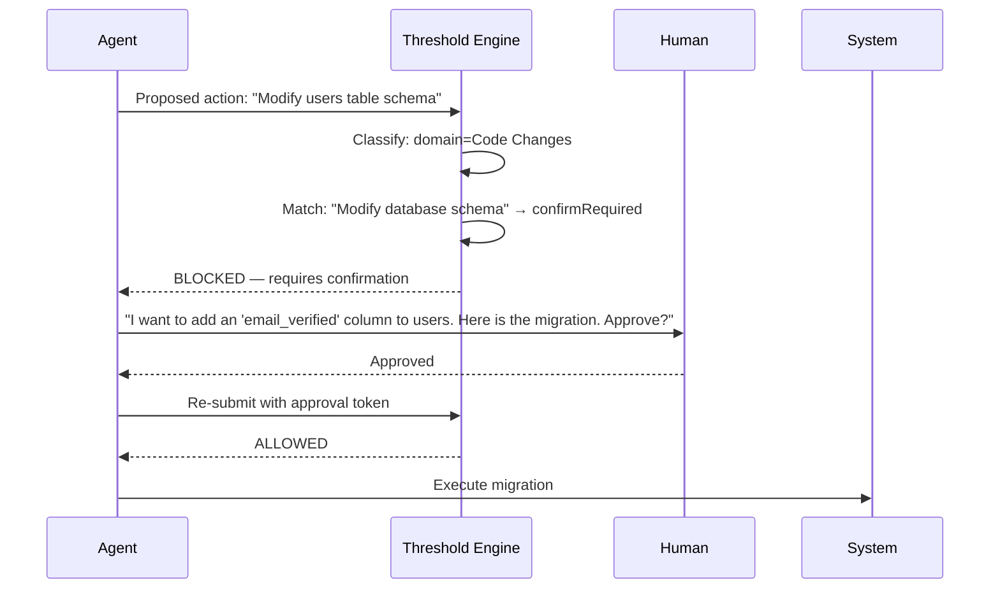

The threshold engine is a pre-execution hook, not a post-hoc review. It intercepts the action before it happens:

```python
from enum import Enum
from dataclasses import dataclass


class ActionLevel(Enum):
    AUTONOMOUS = "autonomous"
    CONFIRM_REQUIRED = "confirm_required"
    PROHIBITED = "prohibited"


@dataclass
class ThresholdResult:
    level: ActionLevel
    domain: str
    matched_rule: str
    explanation: str


class ThresholdEngine:
    def __init__(self, thresholds: list[dict]):
        self.thresholds = thresholds

    def classify(self, action_description: str) -> ThresholdResult:
        """Classify an action against the threshold matrix.

        Uses semantic matching to find the most relevant rule.
        Returns the classification and the matched rule.
        """
        best_match = None
        best_score = 0.0

        for threshold in self.thresholds:
            domain = threshold["domain"]

            # Check prohibited first (highest priority)
            for rule in threshold["prohibited"]:
                score = self._semantic_similarity(
                    action_description, rule
                )
                if score > 0.8:
                    return ThresholdResult(
                        level=ActionLevel.PROHIBITED,
                        domain=domain,
                        matched_rule=rule,
                        explanation=(
                            f"Action matches prohibited rule in "
                            f"{domain}: {rule}"
                        ),
                    )

            # Then confirm_required
            for rule in threshold["confirm_required"]:
                score = self._semantic_similarity(
                    action_description, rule
                )
                if score > best_score:
                    best_score = score
                    best_match = ThresholdResult(
                        level=ActionLevel.CONFIRM_REQUIRED,
                        domain=domain,
                        matched_rule=rule,
                        explanation=(
                            f"Action matches confirm-required rule "
                            f"in {domain}: {rule}"
                        ),
                    )

            # Then autonomous
            for rule in threshold["autonomous"]:
                score = self._semantic_similarity(
                    action_description, rule
                )
                if score > best_score:
                    best_score = score
                    best_match = ThresholdResult(
                        level=ActionLevel.AUTONOMOUS,
                        domain=domain,
                        matched_rule=rule,
                        explanation=(
                            f"Action matches autonomous rule "
                            f"in {domain}: {rule}"
                        ),
                    )

        if best_match is None:
            # Default to confirm_required when uncertain
            return ThresholdResult(
                level=ActionLevel.CONFIRM_REQUIRED,
                domain="Unknown",
                matched_rule="No matching rule found",
                explanation="Unclassified action — defaulting to confirmation",
            )

        return best_match

    def _semantic_similarity(
        self, text_a: str, text_b: str
    ) -> float:
        """Compute semantic similarity between two descriptions.
        In production, use an embedding model. Simplified here.
        """
        words_a = set(text_a.lower().split())
        words_b = set(text_b.lower().split())
        if not words_a or not words_b:
            return 0.0
        intersection = words_a & words_b
        union = words_a | words_b
        return len(intersection) / len(union)
```

---

## 6. Escalation Logic

Escalation logic defines when and how an agent should hand off to a human. This is the safety valve that prevents confident-but-wrong autonomous action.

### 6.1. The Escalation Decision Tree

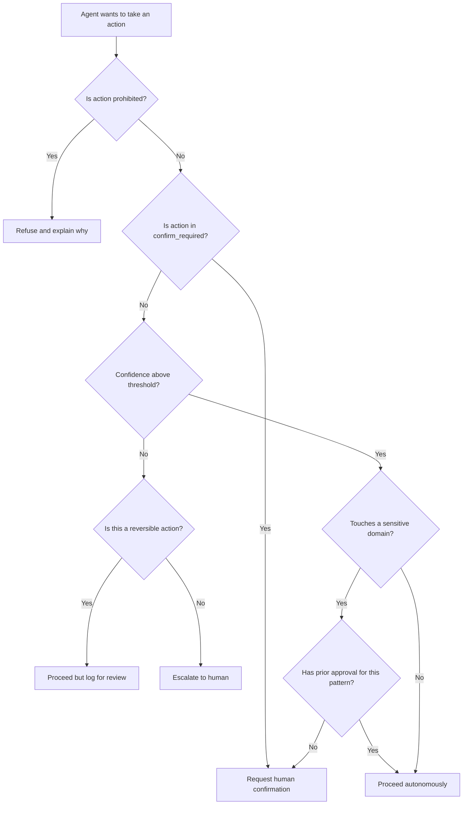

### 6.2. Confidence Calibration

A critical subtlety: agent confidence must be calibrated, not just measured. An uncalibrated agent that says "I am 90% confident" when it is actually right 60% of the time is more dangerous than an agent with no confidence score at all.

```typescript
interface ConfidenceSignal {
  source: string;
  score: number; // 0.0 to 1.0
  calibrated: boolean; // whether score has been validated against actuals
}

interface EscalationDecision {
  action: string;
  signals: ConfidenceSignal[];
  aggregateConfidence: number;
  decision: "proceed" | "confirm" | "escalate" | "refuse";
  reasoning: string;
}

function shouldEscalate(
  action: string,
  signals: ConfidenceSignal[],
  sensitivityLevel: "low" | "medium" | "high" | "critical",
): EscalationDecision {
  // Aggregate confidence from multiple signals
  const calibratedSignals = signals.filter((s) => s.calibrated);
  const uncalibratedSignals = signals.filter((s) => !s.calibrated);

  // Calibrated signals get full weight, uncalibrated get 50%
  const totalWeight =
    calibratedSignals.length + uncalibratedSignals.length * 0.5;
  const weightedSum =
    calibratedSignals.reduce((sum, s) => sum + s.score, 0) +
    uncalibratedSignals.reduce((sum, s) => sum + s.score * 0.5, 0);
  const aggregateConfidence = totalWeight > 0 ? weightedSum / totalWeight : 0;

  // Threshold depends on sensitivity
  const thresholds: Record<string, number> = {
    low: 0.6,
    medium: 0.75,
    high: 0.9,
    critical: 0.99,
  };

  const threshold = thresholds[sensitivityLevel];

  let decision: EscalationDecision["decision"];
  let reasoning: string;

  if (aggregateConfidence >= threshold) {
    decision = "proceed";
    reasoning = `Confidence ${(aggregateConfidence * 100).toFixed(1)}% exceeds ${sensitivityLevel} threshold ${(threshold * 100).toFixed(1)}%`;
  } else if (aggregateConfidence >= threshold * 0.7) {
    decision = "confirm";
    reasoning = `Confidence ${(aggregateConfidence * 100).toFixed(1)}% is below threshold but above escalation floor`;
  } else {
    decision = "escalate";
    reasoning = `Confidence ${(aggregateConfidence * 100).toFixed(1)}% is too low for ${sensitivityLevel} action`;
  }

  return {
    action,
    signals,
    aggregateConfidence,
    decision,
    reasoning,
  };
}
```

### 6.3. The Escalation Message Pattern

When the agent escalates, the quality of the escalation message determines whether the human can resolve it quickly or gets lost in a context-switching maze:

```typescript
interface EscalationMessage {
  summary: string; // one sentence: what and why
  context: string; // what the agent was doing when it got stuck
  options: Option[]; // 2-3 concrete options, not open-ended "what should I do?"
  recommendation: string; // which option the agent would pick and why
  urgency: "low" | "medium" | "high";
  blockedWork: string[]; // what else is waiting on this decision
}

interface Option {
  label: string;
  description: string;
  tradeoffs: string;
  estimatedImpact: string;
}

// Example escalation
const example: EscalationMessage = {
  summary: "Cannot add caching to /api/users without deciding on PII handling",
  context:
    "Task: improve API performance. The /api/users endpoint returns email addresses (PII). Caching would speed up response by 4x but would store PII in Redis.",
  options: [
    {
      label: "A: Cache with field-level encryption",
      description: "Encrypt PII fields before caching, decrypt on read",
      tradeoffs:
        "Adds ~15ms per request for encrypt/decrypt. 2x faster than no cache.",
      estimatedImpact: "2x speedup, PII stays encrypted at rest",
    },
    {
      label: "B: Cache without PII fields",
      description:
        "Strip email/phone from cached response, fetch PII separately when needed",
      tradeoffs:
        "Adds complexity for PII-needing callers. 3.5x faster for non-PII reads.",
      estimatedImpact: "3.5x speedup for most calls, extra round-trip for PII",
    },
    {
      label: "C: Skip caching for this endpoint",
      description: "Optimize query instead of adding cache layer",
      tradeoffs:
        "Simpler architecture, but limited speedup (~1.5x from query optimization alone).",
      estimatedImpact: "1.5x speedup, no architectural change",
    },
  ],
  recommendation:
    "Option B. Most callers do not need PII fields. The few that do can make a second call. This keeps the cache clean and the security boundary simple.",
  urgency: "medium",
  blockedWork: [
    "Performance optimization for /api/users",
    "Load test validation (depends on cache decision)",
  ],
};
```

---

## 7. Goal Weighting

Goal weighting handles the common case where a task has multiple objectives that are not strictly ordered. Unlike priority hierarchies (which resolve conflicts between values), goal weighting balances competing objectives within a single task.

### 7.1. Weighted Objective Functions

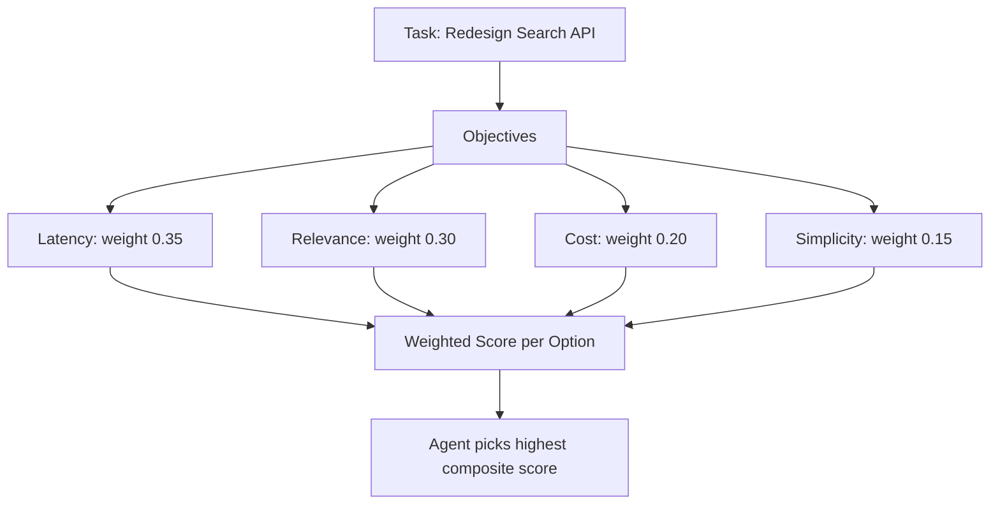

```typescript
interface GoalWeight {
  objective: string;
  weight: number; // 0.0 to 1.0, all weights must sum to 1.0
  measurementMethod: string;
  minimumAcceptable: number; // score below this = option rejected regardless of weight
}

interface DesignOption {
  name: string;
  scores: Record<string, number>; // objective -> score (0-1)
}

function evaluateOptions(
  goals: GoalWeight[],
  options: DesignOption[],
): { name: string; compositeScore: number; rejected: boolean }[] {
  return options
    .map((option) => {
      // Check minimum acceptable thresholds
      const rejected = goals.some((goal) => {
        const score = option.scores[goal.objective] ?? 0;
        return score < goal.minimumAcceptable;
      });

      // Compute weighted composite
      const compositeScore = goals.reduce((sum, goal) => {
        const score = option.scores[goal.objective] ?? 0;
        return sum + score * goal.weight;
      }, 0);

      return {
        name: option.name,
        compositeScore: rejected ? 0 : compositeScore,
        rejected,
      };
    })
    .sort((a, b) => b.compositeScore - a.compositeScore);
}

// Example: evaluating three search API designs
const searchGoals: GoalWeight[] = [
  {
    objective: "latency",
    weight: 0.35,
    measurementMethod: "p99 response time in ms",
    minimumAcceptable: 0.3, // must be at least 30% of ideal
  },
  {
    objective: "relevance",
    weight: 0.3,
    measurementMethod: "NDCG@10 score",
    minimumAcceptable: 0.5, // must be at least 50% of ideal
  },
  {
    objective: "cost",
    weight: 0.2,
    measurementMethod: "$ per 1000 queries",
    minimumAcceptable: 0.2,
  },
  {
    objective: "simplicity",
    weight: 0.15,
    measurementMethod: "Lines of code + dependency count",
    minimumAcceptable: 0.1,
  },
];

const searchOptions: DesignOption[] = [
  {
    name: "Elasticsearch with BM25",
    scores: {
      latency: 0.8,
      relevance: 0.6,
      cost: 0.7,
      simplicity: 0.9,
    },
  },
  {
    name: "Vector search with reranking",
    scores: {
      latency: 0.5,
      relevance: 0.95,
      cost: 0.4,
      simplicity: 0.3,
    },
  },
  {
    name: "Hybrid BM25 + vector with tiered caching",
    scores: {
      latency: 0.7,
      relevance: 0.85,
      cost: 0.6,
      simplicity: 0.4,
    },
  },
];

const results = evaluateOptions(searchGoals, searchOptions);
// Result: Hybrid wins with 0.67, Elasticsearch 0.74 (actually wins due to latency + simplicity), Vector 0.55
```

### 7.2. Context-Dependent Weight Adjustment

Goal weights should not be static. Different contexts shift the balance:

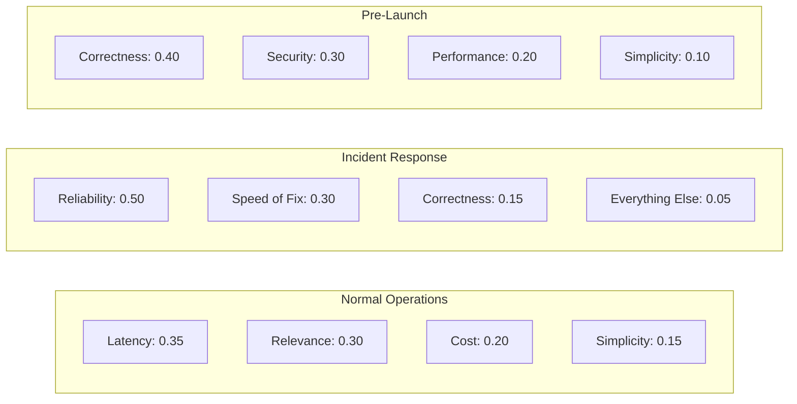

```typescript
type OperationalContext =
  | "normal"
  | "incident"
  | "pre_launch"
  | "cost_reduction"
  | "scale_up";

function getContextualWeights(context: OperationalContext): GoalWeight[] {
  const weightProfiles: Record<OperationalContext, Record<string, number>> = {
    normal: {
      security: 0.25,
      correctness: 0.25,
      performance: 0.2,
      simplicity: 0.15,
      velocity: 0.15,
    },
    incident: {
      reliability: 0.5,
      speed_of_fix: 0.3,
      correctness: 0.15,
      everything_else: 0.05,
    },
    pre_launch: {
      correctness: 0.35,
      security: 0.3,
      performance: 0.2,
      simplicity: 0.15,
    },
    cost_reduction: {
      cost: 0.4,
      reliability: 0.25,
      performance: 0.2,
      simplicity: 0.15,
    },
    scale_up: {
      performance: 0.35,
      reliability: 0.3,
      cost: 0.2,
      correctness: 0.15,
    },
  };

  const profile = weightProfiles[context];
  return Object.entries(profile).map(([objective, weight]) => ({
    objective,
    weight,
    measurementMethod: "context-specific",
    minimumAcceptable: 0.2,
  }));
}
```

---

## 8. Composing Intent Into the Agent Loop

Intent engineering is not a standalone system. It integrates into the compound engineering loop at specific injection points.

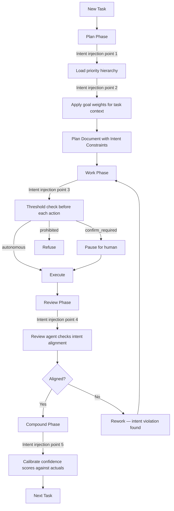

Five injection points:

1. **Plan phase**: Load the priority hierarchy and apply contextual goal weights to shape the plan.
2. **Plan output**: The plan document explicitly states which priorities apply and how conflicts will be resolved.
3. **Work phase**: Every action passes through the threshold engine before execution.
4. **Review phase**: A dedicated intent alignment reviewer checks whether the output respects the stated priorities.
5. **Compound phase**: Confidence scores are calibrated against actual outcomes to improve future escalation accuracy.

---

## 9. The Intent Alignment Reviewer

This is a specialized review agent that checks whether the output of a task respects the intent layer. It is distinct from security, performance, or code quality reviewers — it checks alignment with organizational purpose.

```python
INTENT_REVIEW_PROMPT = """You are an intent alignment reviewer.
Given a task, its priority hierarchy, and the implementation, check:

1. PRIORITY VIOLATIONS: Does the implementation violate any
   higher-ranked priority to serve a lower-ranked one?
2. SILENT TRADEOFFS: Did the agent make a tradeoff between priorities
   without documenting it?
3. PROXY OPTIMIZATION: Did the agent optimize a measurable proxy
   instead of the actual goal?
4. CONSTRAINT BLINDNESS: Did the agent violate an unstated but
   obvious constraint?
5. TEMPORAL MYOPIA: Does the implementation create downstream risks
   that outweigh its immediate benefits?

Priority Hierarchy:
{hierarchy}

Task Description:
{task}

Implementation:
{implementation}

For each finding, return:
- category: one of [priority_violation, silent_tradeoff,
  proxy_optimization, constraint_blindness, temporal_myopia]
- severity: P1 (blocks merge) | P2 (should fix) | P3 (note for future)
- description: what went wrong
- suggestion: how to fix it

Return JSON array. Empty array if no findings.
"""
```

---

## 10. Real-World Example: Intent Engineering in an E-Commerce API

Here is how all four intent components compose in a real scenario.

**Context**: An agent is tasked with adding a promotional discount feature to an e-commerce checkout API.

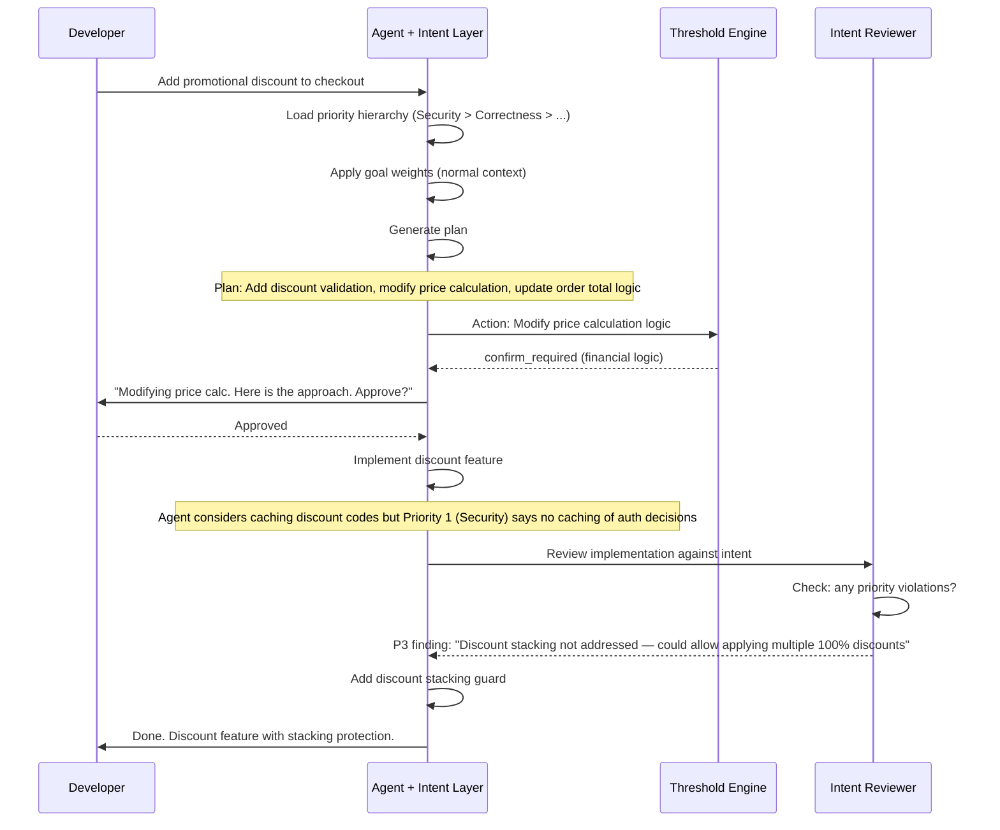

The agent could have cached discount codes for performance. The priority hierarchy prevented it — discount validation is an authorization decision, and security overrides performance. The intent reviewer caught an unstated constraint (discount stacking) that the original task did not mention but that any experienced engineer would flag.

---

## 11. Measuring Intent Alignment

Intent engineering needs its own metrics, distinct from the compound engineering metrics.

```typescript
interface IntentMetrics {
  // Priority adherence
  priorityViolationRate: number;
  // % of implementations that violate a stated priority: target 0%

  // Escalation quality
  escalationAccuracy: number;
  // % of escalations that humans agreed were necessary: target > 85%

  unnecessaryEscalationRate: number;
  // % of escalations that were overly cautious: target < 15%

  // Confidence calibration
  confidenceCalibrationError: number;
  // absolute difference between stated confidence and actual success rate
  // target < 0.1

  // Tradeoff transparency
  silentTradeoffRate: number;
  // % of tradeoffs made without documentation: target 0%

  // Threshold coverage
  unclassifiedActionRate: number;
  // % of actions that did not match any threshold rule: target < 5%
}
```

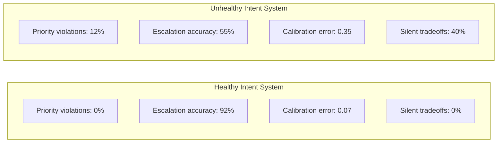

---

## 12. Anti-Patterns in Intent Engineering

### 12.1. The Priority Hierarchy That Means Nothing

A hierarchy where every level says "this is important" without specifying what it overrides is useless. The whole point is conflict resolution. If security and performance never conflict in your hierarchy document, your hierarchy has never been tested.

**Fix**: Write the hierarchy by recalling real tradeoff decisions your team made in the past year. Each level should have a concrete "we chose X over Y because..." example.

### 12.2. The Over-Escalating Agent

An agent that escalates everything is as useless as one that escalates nothing. If humans must approve 80% of actions, you have not built an autonomous agent — you have built a suggestion engine with extra steps.

**Fix**: Track your unnecessary escalation rate. If it exceeds 20%, your thresholds are too tight or your confidence calibration is broken. Loosen the autonomous boundary for well-understood domains.

### 12.3. Static Weights in a Dynamic World

Goal weights that never change create a system that cannot adapt. The weights that were right for launch week are wrong for steady-state operation.

**Fix**: Tie weight profiles to operational context. Detect context automatically where possible (incident response mode when PagerDuty fires, cost-reduction mode when cloud spend exceeds budget).

### 12.4. Intent Without Context or Compound

Intent engineering built on top of weak context engineering produces an agent that knows what it should want but lacks the information to act on it. Intent built without compound engineering means the system never learns from its alignment mistakes.

**Fix**: Build the pillars in order. Context first, then compound, then intent. This is not optional — it is structural.

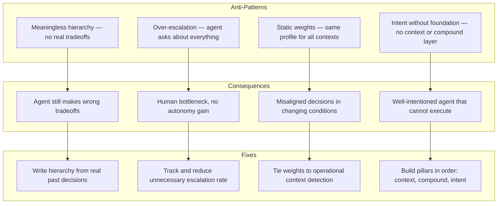

---

## 13. The Complete Intent Engineering Checklist

If you are building intent into an agent system, work through this list:

1. **Define your priority hierarchy.** Write it from real past decisions, not aspirational values. Test it against five recent tradeoff scenarios.
2. **Build your threshold matrix.** Classify every action domain into autonomous, confirm-required, and prohibited. Start conservative — loosen over time as confidence calibration improves.
3. **Implement escalation logic.** Make escalation messages structured (summary, options, recommendation, urgency). Never escalate with "what should I do?" — always propose options.
4. **Set up goal weighting.** Define weight profiles for your most common operational contexts. Include minimum acceptable thresholds to prevent optimizing one goal to zero.
5. **Add the intent alignment reviewer.** A dedicated review agent that checks for priority violations, silent tradeoffs, and proxy optimization.
6. **Instrument confidence calibration.** Track stated confidence vs. actual outcomes. Recalibrate monthly.
7. **Measure intent metrics.** Priority violation rate, escalation accuracy, calibration error, silent tradeoff rate, unclassified action rate.

---

## 14. Why Intent Engineering Is the Hardest Pillar

Context engineering is a plumbing problem — you can test whether the right information arrives. Compound engineering is a discipline problem — you either capture learnings or you do not. Intent engineering is a values problem. It requires your organization to articulate, prioritize, and formalize things that most teams leave implicit.

"What matters most?" is a question many engineering organizations have never answered explicitly. They rely on cultural norms, senior engineer judgment, and post-incident retrospectives to surface priorities after the fact. Intent engineering forces the answer before the agent acts.

This is uncomfortable. It surfaces disagreements. Two senior engineers might genuinely disagree on whether security or reliability takes precedence in a specific scenario. Good. That disagreement existed before intent engineering — it was just invisible, resolved differently by whoever happened to review the PR that day.

Making intent explicit does not create conflict. It surfaces the conflict that already exists and resolves it structurally instead of leaving it to chance.

---

## Key Takeaways

- Intent engineering is the third pillar: it solves the alignment problem that context and compound engineering cannot.
- Without explicit intent, agents optimize proxy metrics, violate unstated constraints, and ignore downstream consequences.
- Priority hierarchies resolve value conflicts deterministically — security over performance, correctness over velocity.
- Decision thresholds define the boundary of autonomous action — what the agent can do, must confirm, and must never do.
- Escalation logic is a safety valve, not a failure mode — good escalations are structured, actionable, and rare.
- Goal weighting handles multi-objective optimization where priorities are not strictly ordered.
- Intent requires context and compound engineering as prerequisites — build the pillars in order.
- The hardest part is organizational, not technical: articulating values that most teams leave implicit.
