import MdxLayout from "@/components/MdxLayout";

export const metadata = {
  title: "Kafka vs RabbitMQ: Modern Distributed Systems",
  description:
    "An extensive analysis comparing Apache Kafka and RabbitMQ. Explore their architectures, performance, scalability, and real-world use cases.",
  topics: [
    "Tech Innovations",
    "Web Architecture",
    "Web Development",
    "Monitoring",
  ],
};

export default function KafkaRabbitArticle({ children }) {
  return <MdxLayout>{children}</MdxLayout>;
}

# Kafka vs RabbitMQ: In-Depth Comparison for Modern Distributed Systems

### Author: Son Nguyen

> Date: 2025-01-15

Messaging systems are the backbone of modern distributed architectures. They enable decoupled communication between microservices and provide a reliable way to process streams of data in real time. Two of the most prominent messaging solutions are **Apache Kafka** and **RabbitMQ**. In this guide, we provide a deep dive into their design philosophies, internal architectures, performance trade-offs, and best use cases to help you choose the right solution for your system’s requirements.

---

## 1. Introduction

In the era of big data and microservices, choosing the right messaging system is crucial for building scalable and resilient distributed applications. **Apache Kafka** is known for its high throughput and real-time streaming capabilities, making it a favorite for log aggregation, event sourcing, and stream processing. On the other hand, **RabbitMQ** is a robust, traditional message broker that excels in flexible routing and reliable delivery. This article examines both platforms, comparing their key features and performance characteristics, and providing practical examples and guidelines for effective implementation.

---

## 2. Architectural Overview

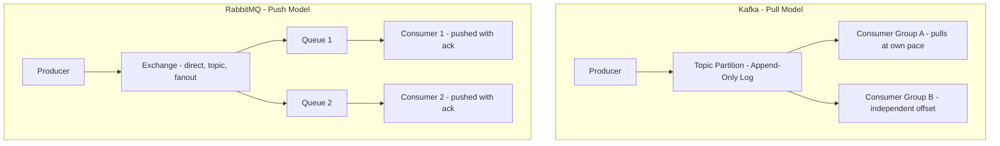

### Apache Kafka

Kafka is built around the concept of a distributed commit log. Its design emphasizes high throughput and low latency, which are essential for handling massive streams of data.

- **Distributed Commit Log:**
  Data is organized into topics and further divided into partitions. Each partition is an ordered, immutable sequence of messages. Data replication across brokers ensures fault tolerance.

- **Append-Only Log Structure:**
  Kafka writes messages sequentially, minimizing disk seek times. This approach allows for extremely high write throughput.

- **Scalability:**
  Kafka is designed for horizontal scalability. Adding brokers and partitioning topics further distributes the workload among consumers.

- **Stream Processing Integration:**
  Kafka integrates naturally with stream processing frameworks (e.g., Apache Flink, Spark Streaming) to enable real-time analytics and event processing.

### RabbitMQ

RabbitMQ is a mature, traditional message broker built on the Advanced Message Queuing Protocol (AMQP). It is well-suited for complex routing scenarios and reliable message delivery.

- **Exchanges and Queues:**
  Producers send messages to exchanges, which route them to queues based on binding rules. This decouples the message producer from the consumer and supports various routing patterns.

- **Flexible Routing Mechanisms:**
  RabbitMQ supports multiple exchange types - direct, topic, fanout, and headers - allowing sophisticated routing strategies for different application needs.

- **Reliability and Acknowledgements:**
  With persistent messages and acknowledgements, RabbitMQ ensures that messages are not lost during transit, even if a consumer fails.

- **User-Friendly Management:**
  RabbitMQ provides a robust management interface and extensive plugins, making it easy to monitor and manage the messaging system.

---

## 3. Performance and Scalability

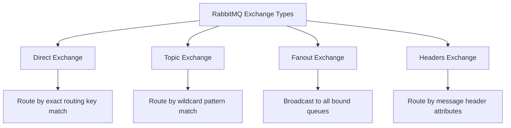

### Throughput & Latency

- **Apache Kafka:**
  Kafka’s design as an append-only log and its efficient disk access patterns allow it to handle millions of messages per second with very low latency. This makes Kafka ideal for applications that require high-volume real-time data streams.

- **RabbitMQ:**
  While RabbitMQ offers reliable messaging with flexible routing, its additional layers (like message acknowledgements and complex exchange types) can introduce slightly higher latency. It is optimized for reliability and flexible message distribution rather than raw throughput.

### Scalability

- **Kafka:**
  Kafka is inherently scalable through its partitioning mechanism. As data volume increases, topics can be partitioned across more brokers, and consumers can read in parallel, effectively distributing the load.

- **RabbitMQ:**
  RabbitMQ can be clustered to scale out. However, scaling RabbitMQ may require careful configuration and tuning (e.g., setting prefetch limits, ensuring proper load balancing) to avoid bottlenecks, especially in high-throughput scenarios.

### Fault Tolerance

- **Kafka:**
  Kafka’s replication factor ensures data durability and availability. If a broker fails, other replicas continue to serve the data without interruption.

- **RabbitMQ:**
  RabbitMQ supports reliable delivery through persistent queues and acknowledgements. In clustered configurations, messages remain available even if individual nodes fail, though additional overhead can impact performance.

---

## 4. Real-World Use Cases

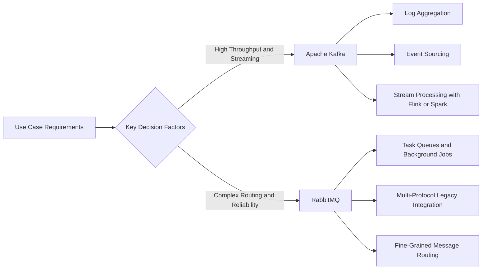

### When to Use Apache Kafka

- **Real-Time Data Streaming:**
  Applications that require high-throughput and low latency, such as log aggregation, sensor data collection, and event sourcing, benefit from Kafka’s design.

- **Event-Driven Architectures:**
  Kafka’s robust pub-sub model is ideal for event-driven systems where multiple services need to consume the same data stream.

- **Stream Processing:**
  Kafka’s integration with processing frameworks makes it suitable for scenarios requiring real-time data transformation and analysis.

### When to Use RabbitMQ

- **Complex Routing Scenarios:**
  Applications needing advanced routing - filtering, selective message delivery, or multi-criteria routing - can take advantage of RabbitMQ’s flexible exchange types.

- **Task Queues and Background Processing:**
  RabbitMQ excels in distributing workloads among multiple workers for background processing and job queues.

- **Interoperability with Legacy Systems:**
  RabbitMQ’s support for multiple messaging protocols makes it a strong candidate for environments with heterogeneous systems.

### Comparison

| Feature/Aspect      | Apache Kafka                        | RabbitMQ                             |
| ------------------- | ----------------------------------- | ------------------------------------ |
| Architecture        | Distributed commit log              | Broker with exchanges and queues     |
| Message Model       | Publish-subscribe                   | Point-to-point and publish-subscribe |
| Throughput          | High (millions of messages/sec)     | Moderate (thousands of messages/sec) |
| Latency             | Low (milliseconds)                  | Moderate (up to seconds)             |
| Scalability         | Horizontal (partitioning)           | Clustering                           |
| Fault Tolerance     | High (replication)                  | Moderate (persistent messages)       |
| Routing Flexibility | Limited (topic-based)               | High (multiple exchange types)       |
| Management UI       | Advanced (Confluent Control Center) | User-friendly (RabbitMQ Management)  |
| Use Cases           | Real-time streaming, event sourcing | Task queues, complex routing         |
| Integration         | Stream processing frameworks        | Legacy systems, microservices        |
| Protocols           | Kafka protocol                      | AMQP, MQTT, STOMP                    |

This table summarizes the key differences between Kafka and RabbitMQ, helping you quickly assess which system aligns better with your project requirements.

---

## 5. Detailed Code Examples

### Example: Apache Kafka with Node.js

Below is an example using the `kafkajs` library to produce and consume messages in Kafka.

```javascript
const { Kafka } = require("kafkajs");

const kafka = new Kafka({
  clientId: "my-app",
  brokers: ["localhost:9092"],
});

const producer = kafka.producer();
const consumer = kafka.consumer({ groupId: "test-group" });

async function runKafka() {
  await producer.connect();
  await consumer.connect();

  // Produce a message
  await producer.send({
    topic: "test-topic",
    messages: [{ value: "Hello from Kafka!" }],
  });

  // Consume messages
  await consumer.subscribe({ topic: "test-topic", fromBeginning: true });
  await consumer.run({
    eachMessage: async ({ partition, message }) => {
      console.log(`Partition ${partition}: ${message.value.toString()}`);
    },
  });
}

runKafka().catch(console.error);
```

### Example: RabbitMQ with Node.js

Below is an example using the `amqplib` library to publish and consume messages in RabbitMQ.

```javascript
const amqp = require("amqplib");

async function runRabbitMQ() {
  const connection = await amqp.connect("amqp://localhost");
  const channel = await connection.createChannel();
  const queue = "hello";

  await channel.assertQueue(queue, { durable: false });
  channel.sendToQueue(queue, Buffer.from("Hello from RabbitMQ!"));
  console.log("Message sent to RabbitMQ");

  channel.consume(queue, (msg) => {
    if (msg !== null) {
      console.log("Received:", msg.content.toString());
      channel.ack(msg);
    }
  });
}

runRabbitMQ().catch(console.error);
```

The following diagrams illustrate the delivery guarantee modes available in each system and how Kafka handles partition rebalancing when a consumer group membership changes.

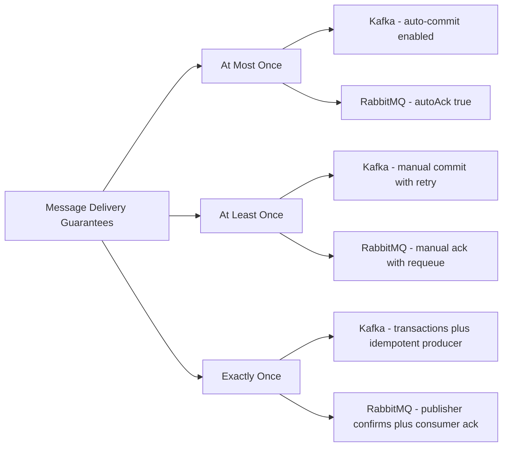

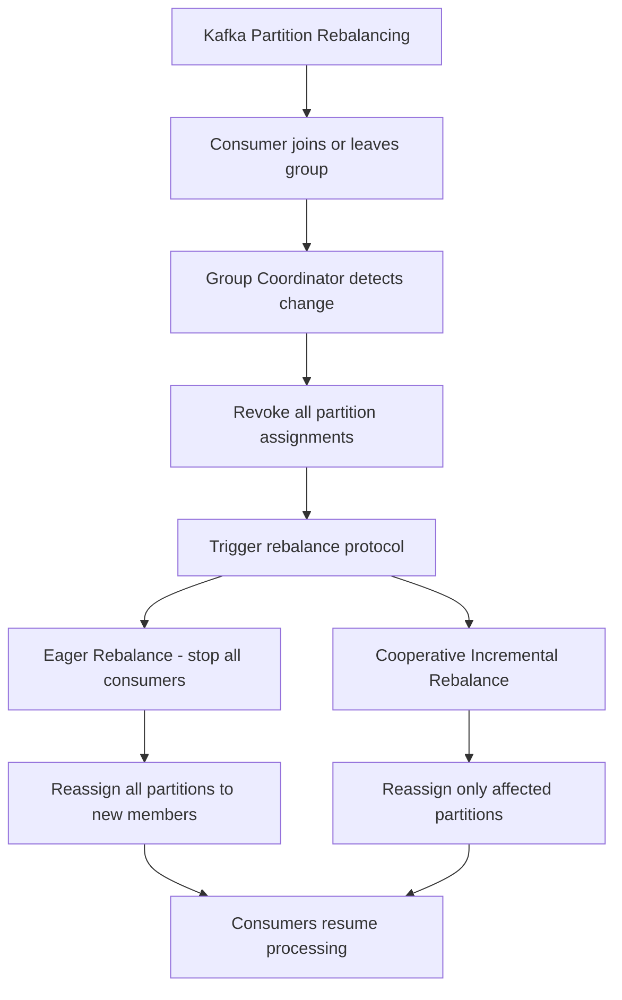

---

## 6. Best Practices & Considerations

### Message Durability and Persistence

- **Kafka:**
  Use replication factors and retention policies to balance throughput and durability.
- **RabbitMQ:**
  Enable persistent queues and message acknowledgements to ensure reliable delivery.

### Monitoring & Performance Tuning

- **Kafka:**
  Monitor partition lag, throughput, and broker health using tools like Kafka Manager or Confluent Control Center.
- **RabbitMQ:**
  Utilize the built-in management UI and plugins to monitor queue lengths, message rates, and resource usage.

### Scalability and Fault Tolerance

- **Kafka:**
  Scale horizontally by adding brokers and partitioning topics to distribute load.
- **RabbitMQ:**
  Consider clustering and load balancing strategies to manage increasing loads effectively.

### Integration with Stream Processing

- **Kafka:**
  Leverage stream processing frameworks (e.g., Apache Flink, Spark Streaming) to perform real-time data analysis.
- **RabbitMQ:**
  Use RabbitMQ in combination with other systems for processing background tasks and asynchronous workflows.

### Security Considerations

- **Kafka:**
  Implement SSL/TLS for secure communication, along with authentication mechanisms such as SASL.
- **RabbitMQ:**
  Use secure connections (`amqps://`), enforce authentication, and regularly update the system to patch vulnerabilities.

---

## 7. Architecture Diagrams and Client Abstractions

The sequence diagram below shows how a Kafka producer sends a message and receives acknowledgement based on the configured acks setting:

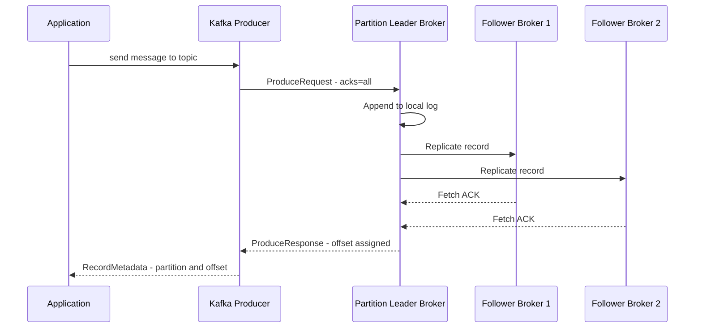

The class diagram models the key abstractions in the Kafka client SDK that developers interact with when building producers and consumers:

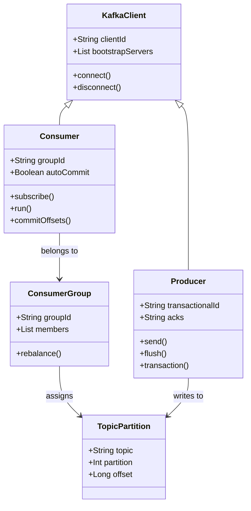

The diagram below shows how a RabbitMQ dead-letter exchange handles messages that are rejected or exceed their TTL:

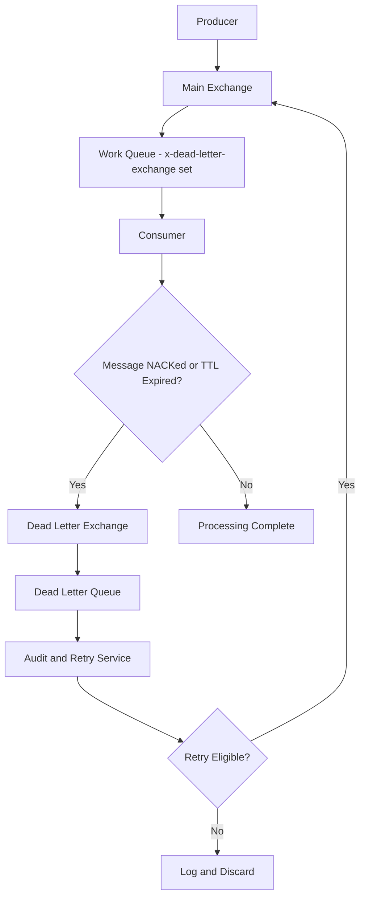

The state diagram captures the full lifecycle of a Kafka consumer group from creation through steady-state processing and shutdown:

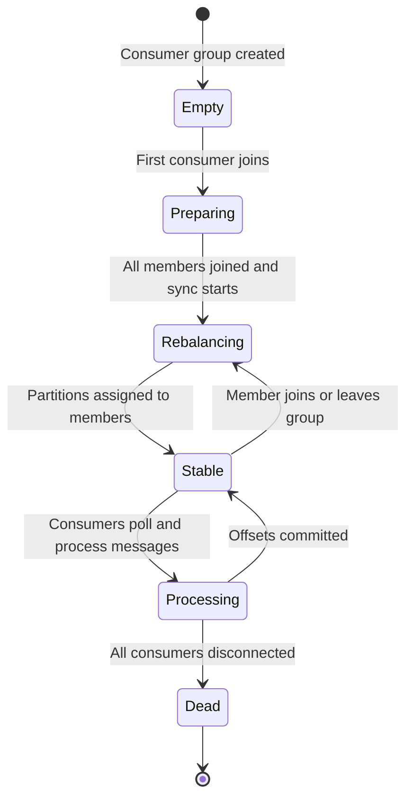

## 8. Production Performance Benchmarks

These benchmarks are representative figures from real-world cluster deployments. Your numbers will vary based on hardware, network, message size, and durability settings.

### Throughput Comparison

| Scenario                                 | Kafka                   | RabbitMQ                |
| ---------------------------------------- | ----------------------- | ----------------------- |
| Producer throughput (1 KB msg, acks=1)   | ~1.5 M msg/s per broker | ~60–80 K msg/s per node |
| Producer throughput (1 KB msg, acks=all) | ~500 K msg/s            | ~40–50 K msg/s          |
| Consumer throughput (batch=500)          | ~2 M msg/s              | ~80 K msg/s             |
| End-to-end p99 latency (acks=1)          | 5–15 ms                 | 1–5 ms                  |
| End-to-end p99 latency (acks=all)        | 20–60 ms                | 5–20 ms                 |

**Key observations:**

- Kafka’s throughput advantage grows with message volume because sequential disk writes batch well.
- RabbitMQ achieves lower raw latency in small-scale, single-queue scenarios due to its push model and AMQP’s lightweight framing.
- Kafka throughput degrades significantly at `acks=all` with large replication factors. Use `min.insync.replicas=2` with `acks=all` rather than full ISR for a reasonable durability/throughput trade-off.

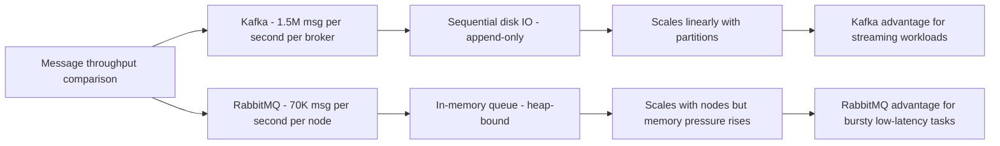

---

## 9. Running Both Together

Kafka and RabbitMQ are complementary, not mutually exclusive. Many production architectures use them together — Kafka as the event backbone and RabbitMQ as the task-dispatch layer.

### Hybrid Architecture Pattern

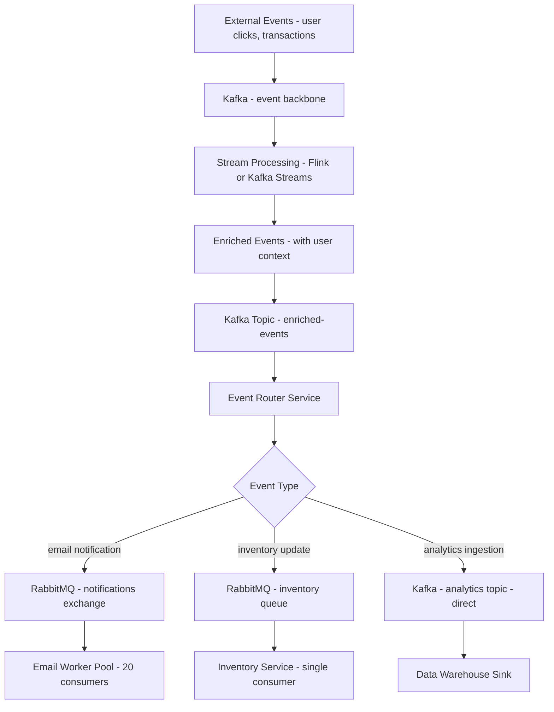

**When this pattern makes sense:**

- Kafka handles the high-volume, durable, replayable event log (the "truth store").
- RabbitMQ handles transient, work-queue-style tasks where TTL, priority queues, or dead-letter logic are needed — none of which Kafka handles natively.
- The router service is a thin consumer of Kafka that publishes to the appropriate RabbitMQ exchange based on event type.

---

## 10. Migration Guide: RabbitMQ to Kafka (or vice-versa)

Migration between the two platforms is a common operational challenge. The safest approach is a dual-write period followed by consumer cutover.

### RabbitMQ to Kafka Migration

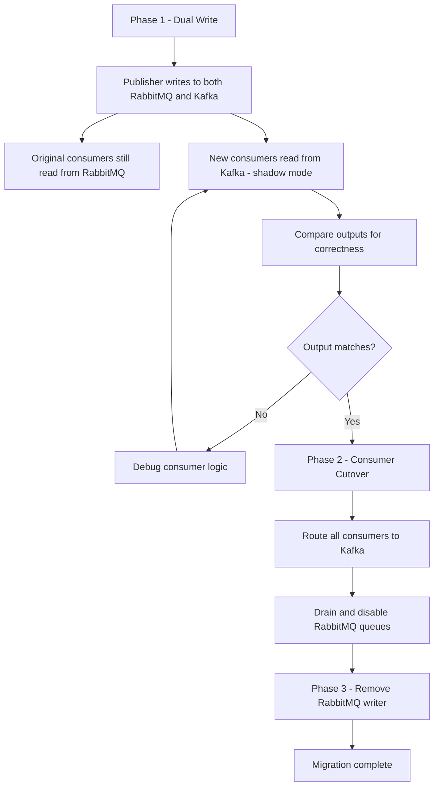

### Practical Migration Code: Kafka Consumer Matching RabbitMQ Semantics

RabbitMQ consumers expect push delivery with per-message acks. When migrating to Kafka, replicate this with manual offset commits and a small `max.poll.records`:

```python
from kafka import KafkaConsumer
import json

consumer = KafkaConsumer(
    ‘orders’,
    bootstrap_servers=[‘kafka:9092’],
    group_id=’order-processor’,
    auto_offset_reset=’earliest’,
    enable_auto_commit=False,           # manual commit = explicit ack
    max_poll_records=10,                # small batch = RabbitMQ-like behavior
    value_deserializer=lambda b: json.loads(b.decode()),
)

for message in consumer:
    try:
        process_order(message.value)
        # Only commit after successful processing
        consumer.commit({
            message.partition: message.offset + 1,
        })  # type: ignore[call-arg]
    except Exception as exc:
        # Do NOT commit — message will be redelivered
        log_dead_letter(message, exc)
```

For the reverse migration (Kafka to RabbitMQ) the main consideration is **offset semantics**: RabbitMQ has no native concept of message replay. Store the Kafka offset externally (e.g. in Redis or a DB) so you can resume from a known position if needed.

---

## 11. Operational Complexity Comparison

| Concern                   | Kafka                                             | RabbitMQ                            |
| ------------------------- | ------------------------------------------------- | ----------------------------------- |
| Initial setup             | Moderate (ZooKeeper or KRaft mode)                | Simple (single binary or Docker)    |
| Cluster management        | Manual partition reassignment (or Cruise Control) | Automatic via mnesia distributed DB |
| Schema management         | External (Confluent Schema Registry)              | Built-in content-type headers       |
| Consumer group management | Consumer group coordinator in broker              | Server-side queue ownership         |
| Dead letter handling      | Manual (separate DLQ topic + consumer)            | Built-in x-dead-letter-exchange     |
| Message TTL               | Retention period (topic-level)                    | Per-message or per-queue TTL        |
| Priority queues           | Not natively supported                            | Supported (x-max-priority)          |
| Geo-replication           | MirrorMaker 2 / Confluent Replicator              | Shovel and Federation plugins       |
| Observability             | JMX, Kafka Exporter, Confluent Control Center     | Management UI, prometheus exporter  |

---

## 12. Monitoring Setup for Each Platform

### Kafka Monitoring with Prometheus and Grafana

```yaml
# docker-compose.yml excerpt
services:
  kafka-exporter:
    image: danielqsj/kafka-exporter:latest
    command:
      - "--kafka.server=kafka:9092"
      - "--topic.filter=.*"
    ports:
      - "9308:9308"

  prometheus:
    image: prom/prometheus:latest
    volumes:
      - ./prometheus.yml:/etc/prometheus/prometheus.yml

  grafana:
    image: grafana/grafana:latest
    ports:
      - "3000:3000"
```

Key Kafka metrics to alert on:

```yaml
# prometheus_alert_rules.yml
groups:
  - name: kafka
    rules:
      - alert: KafkaConsumerLagHigh
        expr: kafka_consumergroup_lag > 100000
        for: 5m
        labels:
          severity: warning
        annotations:
          summary: "Consumer group {{ $labels.consumergroup }} lag is {{ $value }}"

      - alert: KafkaUnderReplicatedPartitions
        expr: kafka_server_replicamanager_underreplicatedpartitions > 0
        for: 2m
        labels:
          severity: critical
```

### RabbitMQ Monitoring with Prometheus Plugin

```bash
# Enable the built-in Prometheus plugin
rabbitmq-plugins enable rabbitmq_prometheus

# RabbitMQ now exposes /metrics on port 15692
```

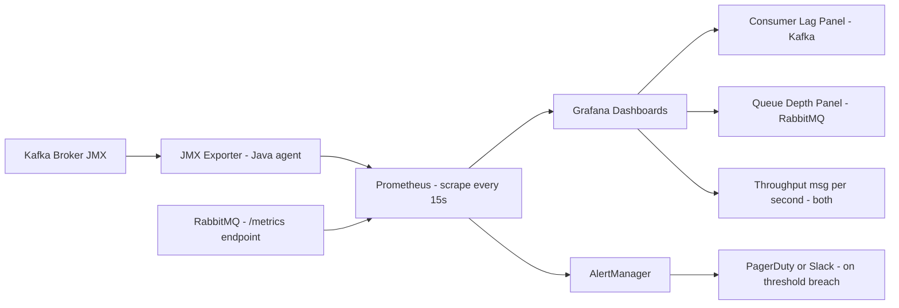

---

## 13. Conclusion

Both Apache Kafka and RabbitMQ are powerful messaging systems tailored to different scenarios in modern distributed architectures. Kafka’s design makes it ideal for high-throughput, real-time streaming and event-driven applications, while RabbitMQ offers flexible routing and reliable message delivery, particularly suitable for complex workflows and task distribution.

The choice between them is not always binary. Many mature architectures run both: Kafka as the durable, replayable event backbone and RabbitMQ as the task-dispatch layer for time-sensitive, routable work. When migrating between them, a dual-write shadow period is the safest path. And whichever system you choose, investing in monitoring — consumer lag for Kafka, queue depth for RabbitMQ — pays dividends far beyond initial deployment.

Choosing the right solution depends on your application’s requirements - consider factors such as data volume, latency needs, routing complexity, and integration with existing systems. By understanding the architectural nuances, performance characteristics, and best practices associated with each platform, you can build robust, scalable, and resilient distributed systems.

For further insights, consult the official documentation for [Apache Kafka](https://kafka.apache.org/documentation/) and [RabbitMQ](https://www.rabbitmq.com/documentation.html).

---

## 14. Further Reading and Resources

- **Books & Guides:**
  - _"Kafka: The Definitive Guide"_ – Comprehensive resource on building streaming applications with Kafka.
  - _"RabbitMQ in Action"_ – A practical guide to mastering RabbitMQ.
- **Online Courses:**
  - Courses on platforms such as Coursera, Udemy, and Pluralsight that focus on distributed systems and messaging.
- **Communities & Forums:**
  - Join Kafka and RabbitMQ communities on Stack Overflow, Reddit, or dedicated Slack channels to discuss best practices and troubleshooting tips.
- **Tooling:**
  - Explore monitoring tools like Kafka Manager, Confluent Control Center, and RabbitMQ’s management plugin for operational insights.

---

_This comprehensive guide to Kafka vs RabbitMQ offers an in-depth analysis of their architectures, performance, scalability, and use cases, helping you make informed decisions when designing modern distributed systems. Use it as a reference to build and optimize your messaging infrastructure for robust, high-performance applications._
