import MdxLayout from "@/components/MdxLayout";

export const metadata = {
  title: "Observability for LLM Applications: Tracing, Evaluation, and Safety",
  description:
    "A practical observability playbook for LLM systems, covering tracing, metrics, evaluation pipelines, and safety guardrails.",
  topics: [
    "Artificial Intelligence",
    "Machine Learning",
    "MLOps",
    "Observability",
  ],
};

export default function LLMObservabilityArticle({ children }) {
  return <MdxLayout>{children}</MdxLayout>;
}

# Observability for LLM Applications: Tracing, Evaluation, and Safety

### Author: Son Nguyen

> Date: 2024-11-20

LLM applications are probabilistic systems that blend prompts, retrieval, tools, and model outputs. Traditional observability is necessary but not sufficient. You need visibility into quality, cost, and safety to ship reliable AI experiences. This guide outlines the signals and workflows that keep LLM systems healthy.

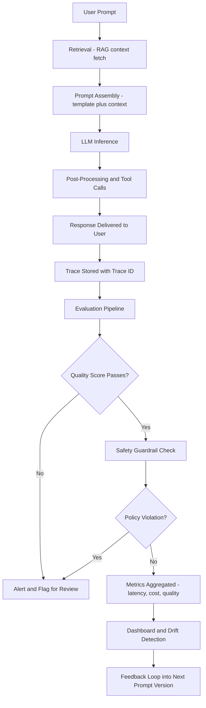

---

## 1. The key signals to track

Beyond uptime, LLM systems need product and model signals:

- **Latency:** end-to-end and per tool call.
- **Cost:** token usage, model mix, and retrieval overhead.
- **Quality:** human ratings, automated evals, task success.
- **Safety:** hallucination rate, policy violations, and refusal accuracy.

Define service-level objectives for each category so failures are measurable.

---

## 2. Structured tracing for prompts

You need traces that capture every step:

- Prompt template version.
- System instructions and tool calls.
- Retrieval context (documents, scores, filters).
- Model response and post-processing steps.

Store this data with consistent trace IDs so you can reconstruct failures quickly.

A prompt-response trace waterfall shows the latency contribution of each step from retrieval through to final delivery:

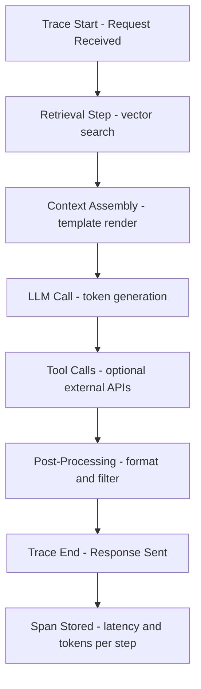

---

## 3. Evaluation pipelines

Automated evaluation is critical for regression detection:

- Maintain a curated set of prompts and expected outcomes.
- Run evaluations in CI for prompt changes.
- Use LLM-as-judge with calibrated grading rubrics.

Track evaluation scores over time, not just pass/fail thresholds.

The scoring pipeline below shows how each prompt in the evaluation set is graded across factuality, relevance, and toxicity dimensions before an aggregate quality score determines whether a deployment is blocked:

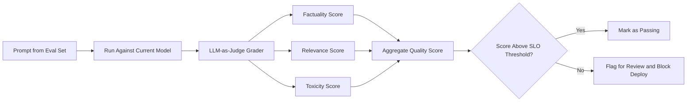

---

## 4. Safety and policy guardrails

Safety observability requires dedicated metrics:

- Flag and store unsafe outputs for review.
- Track refusal rates and false positives.
- Monitor policy rule hits by category.

Pair automated rules with periodic human audits.

---

## 5. Retrieval observability (RAG)

Retrieval quality determines answer quality. Track:

- Recall rates for known queries.
- Embedding drift and index freshness.
- Latency per vector search and reranking step.

Store the top-k documents for every request so you can debug relevance gaps.

---

## 6. Data governance and privacy

LLM logs often contain sensitive data. Implement:

- Redaction and hashing of PII fields.
- Data retention policies with time-based deletion.
- Access controls and audit logs for prompt traces.

Privacy constraints should be visible in the observability pipeline, not bolted on later.

---

## 7. Feedback loops

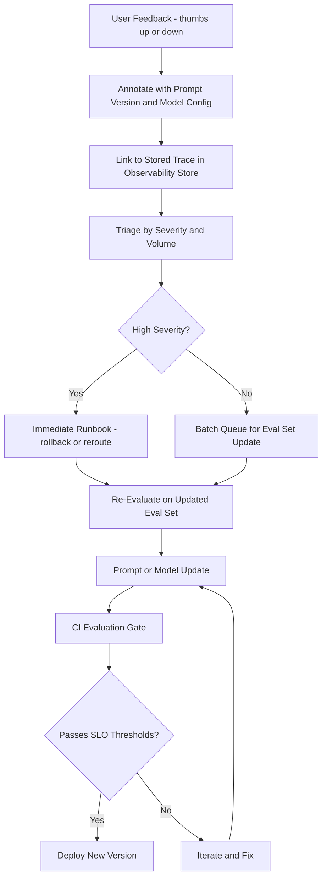

Production feedback fuels reliability:

- Collect user ratings and annotate failures.
- Link feedback to prompt versions and model configs.
- Prioritize fixes based on severity and volume.

An efficient feedback loop shortens the gap between insight and improvement.

Cost attribution requires tracking tokens at the request level and aggregating them by feature and user tier. The flow below shows how a token spike triggers a cost alert before it accumulates into a billing surprise:

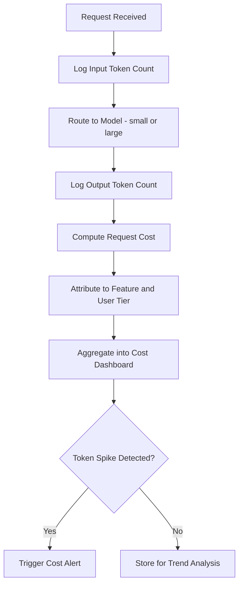

---

## 8. Cost and performance optimization

Instrumentation should help control spend:

- Alert on token spikes by route or user tier.
- Cache retrieval results for repeat queries.
- Route lightweight queries to smaller models.

Use cost dashboards to balance quality and budget.

---

## 9. Drift detection and model monitoring

Model behavior changes with fine-tunes, updates, or new data. Detect drift by:

- Monitoring score changes on evaluation sets.
- Sampling real user prompts for periodic re-grading.
- Tracking changes in refusal or hallucination rates.

Drift alerts help prevent silent regressions.

---

## 10. Runbooks and incident response

LLM incidents look different from traditional outages. Prepare for:

- Prompt regressions that degrade quality without errors.
- Retrieval index drift or stale embeddings.
- Safety policy changes that alter refusal behavior.

Write runbooks that include evaluation rollbacks and model routing switches.

---

## 11. Governance and model versioning

Large teams need a clear model governance process:

- Track prompt, model, and tool versions as deployable artifacts.
- Gate changes behind evaluation thresholds.
- Store full provenance so you can reproduce outputs later.

Model governance is what keeps observability data actionable.

The diagram below shows how prompt, model, and tool versions are tracked as deployable artifacts through a governance gate:

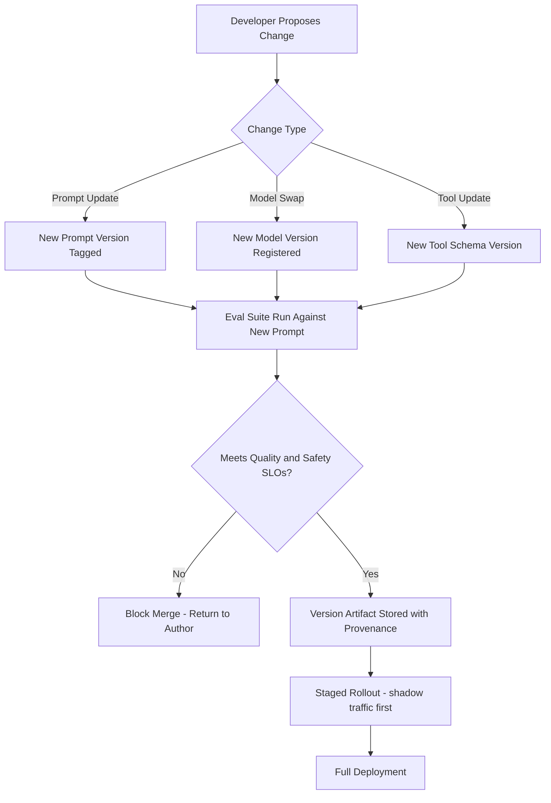

The sequence diagram shows how a safety guardrail intercepts a policy-violating response before it reaches the user:

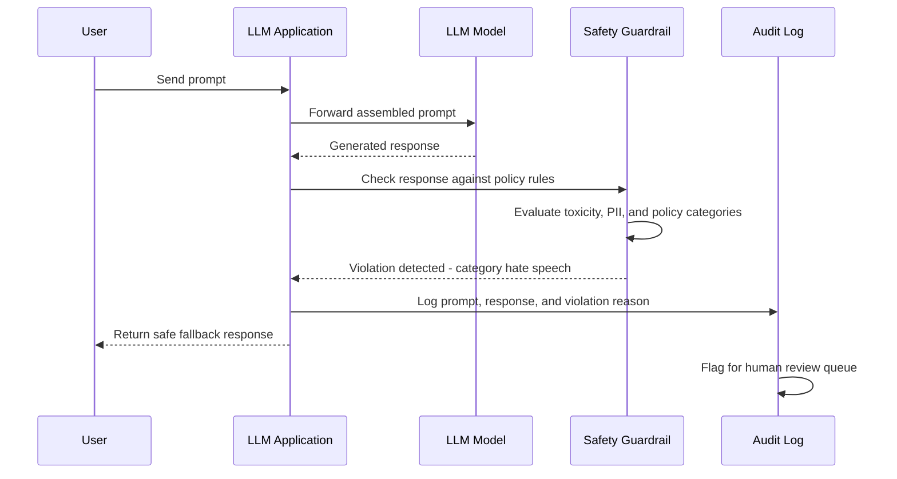

The class diagram models the core observability data structures used to capture a full LLM request trace:

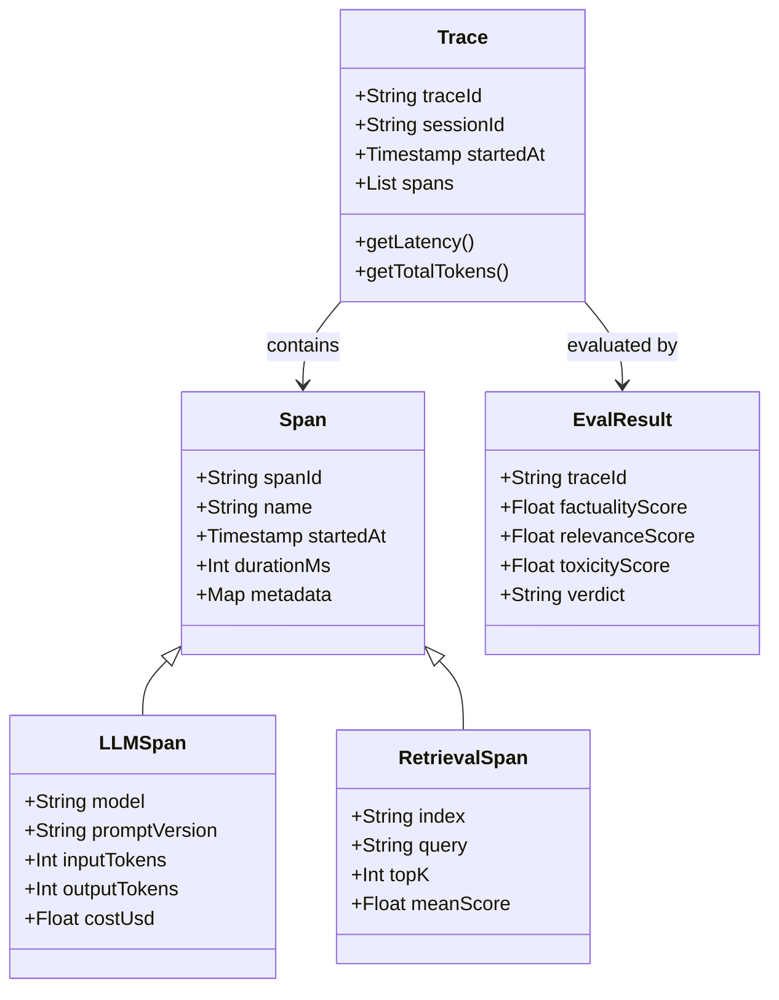

The state diagram captures the states an LLM deployment version passes through from staging to retirement:

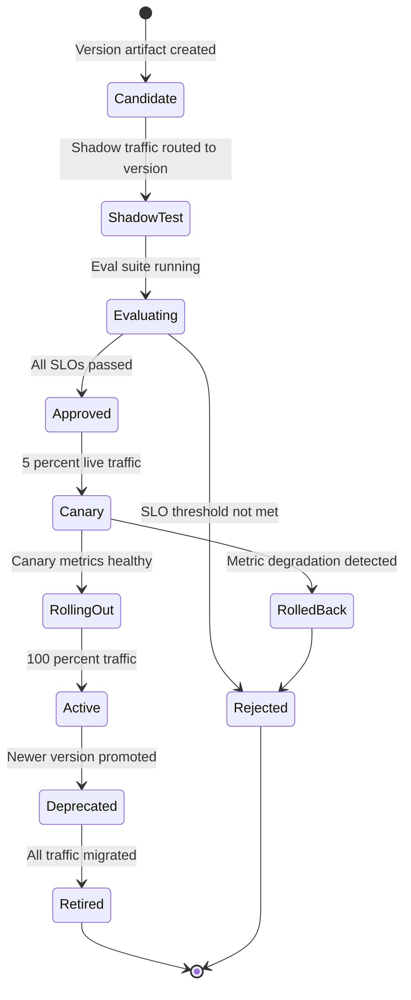

---

## 12. Implementation checklist

- Log prompt versions, retrieval context, and tool calls.
- Set quality and safety SLOs with alerting.
- Run evaluations for every prompt or model change.
- Review unsafe outputs on a regular cadence.
- Track cost per request and per feature.

Strong observability transforms LLM apps from experiments into reliable products.

---

## 13. Prompt versioning and A/B testing

Prompts are deployable artifacts. Treating them with the same lifecycle discipline as application code - version control, staged rollout, metric-gated promotion - is foundational to reliable LLM systems.

### Prompt version registry schema

```typescript
// prompt-registry.ts
interface PromptVersion {
  id: string; // "prompt_v2_3_0" or a UUID
  name: string; // Human-readable name: "qa-answer-v2"
  systemPrompt: string;
  userTemplate: string; // Handlebars or Jinja-style template
  modelId: string; // "gpt-4o", "claude-3-5-sonnet", etc.
  temperature: number;
  maxTokens: number;
  tags: string[]; // ["production", "qa", "experiment"]
  createdAt: string;
  createdBy: string;
  parentId: string | null; // Chain for lineage tracking
  evalSuiteId: string; // Which eval set covers this prompt
}

// When loading a prompt, always load by version ID, never "latest"
async function loadPromptVersion(versionId: string): Promise<PromptVersion> {
  const version = await promptRegistry.get(versionId);
  if (!version) {
    throw new Error(`Prompt version not found: ${versionId}`);
  }
  // Log the version used so every trace has full provenance
  tracer.setAttribute("prompt.version_id", versionId);
  tracer.setAttribute("prompt.model_id", version.modelId);
  return version;
}
```

### A/B testing prompts in production

```typescript
// prompt-ab.ts: route traffic between two prompt versions using a stable hash
import crypto from "crypto";

interface ABConfig {
  controlVersionId: string; // Stable baseline
  variantVersionId: string; // Candidate to evaluate
  variantTrafficPct: number; // 0-100
}

function selectPromptVersion(
  userId: string,
  config: ABConfig,
): { versionId: string; group: "control" | "variant" } {
  // Stable hash ensures the same user always gets the same version
  const hash = crypto
    .createHash("sha256")
    .update(`${userId}:prompt-ab`)
    .digest("hex");

  const bucket = parseInt(hash.slice(0, 8), 16) % 100;

  if (bucket < config.variantTrafficPct) {
    return { versionId: config.variantVersionId, group: "variant" };
  }
  return { versionId: config.controlVersionId, group: "control" };
}

// In the request handler:
async function handleQuery(userId: string, query: string) {
  const { versionId, group } = selectPromptVersion(userId, {
    controlVersionId: "prompt_v2_1_0",
    variantVersionId: "prompt_v2_2_0",
    variantTrafficPct: 10,
  });

  const prompt = await loadPromptVersion(versionId);

  // Attach A/B metadata to every trace for analysis
  tracer.setAttribute("ab.group", group);
  tracer.setAttribute("ab.version_id", versionId);

  // ... run the LLM call
}
```

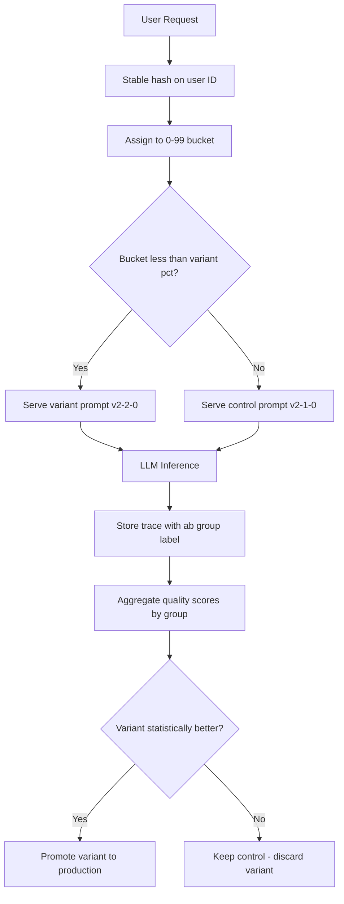

---

## 14. OpenTelemetry integration for LLM traces

OpenTelemetry provides a vendor-neutral way to instrument LLM applications. The emerging GenAI semantic conventions (part of OTel 1.24+) define standard attribute names for LLM spans.

```typescript
// otel-llm.ts: instrumenting an LLM call with OpenTelemetry semantic conventions
import { trace, context, SpanStatusCode, SpanKind } from "@opentelemetry/api";

const tracer = trace.getTracer("llm-service", "1.0.0");

async function tracedLLMCall(params: {
  system: string;
  user: string;
  model: string;
  promptVersionId: string;
}): Promise<{ response: string; inputTokens: number; outputTokens: number }> {
  return tracer.startActiveSpan(
    "llm.chat",
    {
      kind: SpanKind.CLIENT,
      attributes: {
        // GenAI semantic conventions
        "gen_ai.system": "openai",
        "gen_ai.operation.name": "chat",
        "gen_ai.request.model": params.model,
        "gen_ai.request.temperature": 0.2,
        "gen_ai.request.max_tokens": 2048,
        // Custom attributes
        "llm.prompt.version": params.promptVersionId,
      },
    },
    async (span) => {
      try {
        const start = Date.now();

        // Actual LLM API call
        const result = await openai.chat.completions.create({
          model: params.model,
          messages: [
            { role: "system", content: params.system },
            { role: "user", content: params.user },
          ],
        });

        const durationMs = Date.now() - start;
        const inputTokens = result.usage?.prompt_tokens ?? 0;
        const outputTokens = result.usage?.completion_tokens ?? 0;
        const costUsd = computeCost(params.model, inputTokens, outputTokens);

        // Attach response metrics to span
        span.setAttributes({
          "gen_ai.usage.input_tokens": inputTokens,
          "gen_ai.usage.output_tokens": outputTokens,
          "llm.cost.usd": costUsd,
          "llm.duration.ms": durationMs,
        });

        span.setStatus({ code: SpanStatusCode.OK });

        return {
          response: result.choices[0].message.content ?? "",
          inputTokens,
          outputTokens,
        };
      } catch (error) {
        span.setStatus({
          code: SpanStatusCode.ERROR,
          message: (error as Error).message,
        });
        span.recordException(error as Error);
        throw error;
      } finally {
        span.end();
      }
    },
  );
}

function computeCost(
  model: string,
  inputTokens: number,
  outputTokens: number,
): number {
  const pricing: Record<string, { input: number; output: number }> = {
    "gpt-4o": { input: 0.0025, output: 0.01 }, // per 1K tokens
    "gpt-4o-mini": { input: 0.00015, output: 0.0006 },
    "claude-3-5-sonnet": { input: 0.003, output: 0.015 },
  };
  const rates = pricing[model] ?? { input: 0.001, output: 0.002 };
  return (inputTokens * rates.input + outputTokens * rates.output) / 1000;
}
```

---

## 15. Langfuse and LangSmith setup patterns

Both Langfuse and LangSmith are purpose-built LLM observability platforms. They collect traces, host evaluation datasets, and surface cost and quality dashboards.

### Langfuse with OpenAI SDK

```typescript
// langfuse-instrumentation.ts
import Langfuse from "langfuse";
import OpenAI from "openai";

const langfuse = new Langfuse({
  publicKey: process.env.LANGFUSE_PUBLIC_KEY!,
  secretKey: process.env.LANGFUSE_SECRET_KEY!,
  baseUrl: process.env.LANGFUSE_BASEURL ?? "https://cloud.langfuse.com",
});

const openai = new OpenAI();

async function answeredWithTrace(
  sessionId: string,
  userId: string,
  question: string,
): Promise<string> {
  // Create a trace for this user session
  const trace = langfuse.trace({
    id: `trace-${Date.now()}`,
    sessionId,
    userId,
    name: "qa-answer",
    input: { question },
  });

  // Log the retrieval span
  const retrievalSpan = trace.span({
    name: "vector-retrieval",
    input: { query: question },
  });

  const documents = await vectorSearch(question);

  retrievalSpan.end({
    output: {
      documentCount: documents.length,
      topScore: documents[0]?.score,
    },
  });

  // Log the LLM call as a generation
  const generation = trace.generation({
    name: "llm-answer",
    model: "gpt-4o-mini",
    input: { question, documents: documents.map((d) => d.text) },
    modelParameters: { temperature: 0.1, maxTokens: 512 },
  });

  const result = await openai.chat.completions.create({
    model: "gpt-4o-mini",
    messages: [
      { role: "system", content: buildSystemPrompt(documents) },
      { role: "user", content: question },
    ],
  });

  const answer = result.choices[0].message.content ?? "";

  generation.end({
    output: answer,
    usage: {
      input: result.usage?.prompt_tokens,
      output: result.usage?.completion_tokens,
    },
  });

  trace.update({ output: { answer } });

  // Flush asynchronously - do not await on critical path
  langfuse.flushAsync();

  return answer;
}
```

### LangSmith trace via LangChain

```python
# langsmith_rag.py
import os
from langchain_openai import ChatOpenAI, OpenAIEmbeddings
from langchain_core.prompts import ChatPromptTemplate
from langchain_pinecone import PineconeVectorStore
from langsmith import traceable

os.environ["LANGCHAIN_TRACING_V2"] = "true"
os.environ["LANGCHAIN_PROJECT"] = "devverse-qa"

embeddings = OpenAIEmbeddings(model="text-embedding-3-small")
vectorstore = PineconeVectorStore(embedding=embeddings, index_name="articles")
llm = ChatOpenAI(model="gpt-4o-mini", temperature=0.1)

prompt = ChatPromptTemplate.from_messages([
    ("system", "Answer based on the provided context. Be concise.\n\nContext:\n{context}"),
    ("human", "{question}"),
])

@traceable(name="rag-qa-pipeline", metadata={"prompt_version": "v2.1.0"})
def rag_answer(question: str) -> str:
    docs = vectorstore.similarity_search(question, k=4)
    context = "\n\n".join(d.page_content for d in docs)
    chain = prompt | llm
    result = chain.invoke({"question": question, "context": context})
    return result.content
```

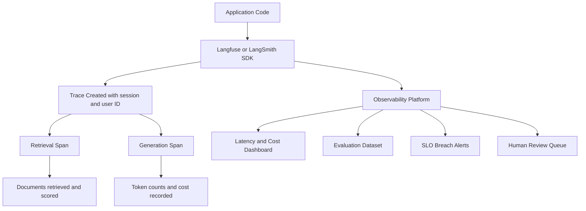

---

## 16. Cost optimization strategies

LLM inference costs scale with token usage and model selection. A systematic approach to cost management can reduce spend by 40-70% without sacrificing quality.

### Cost reduction techniques

| Technique                        | Typical Saving | Tradeoff                              |
| -------------------------------- | -------------- | ------------------------------------- |
| Model routing (small vs. large)  | 60-80%         | Requires quality validation per route |
| Prompt compression               | 20-40%         | Requires testing for context loss     |
| Response caching (semantic)      | 15-30%         | Cache management complexity           |
| Output length limits             | 10-20%         | May truncate useful responses         |
| Retrieval pruning (reduce top-k) | 5-15%          | May reduce answer quality             |
| Batch inference                  | 20-40%         | Adds latency                          |

```typescript
// model-router.ts: route queries to the cheapest capable model
interface RoutingRule {
  modelId: string;
  maxComplexityScore: number; // 0-100 scale
  maxInputTokens: number;
}

const ROUTING_RULES: RoutingRule[] = [
  { modelId: "gpt-4o-mini", maxComplexityScore: 40, maxInputTokens: 2000 },
  { modelId: "gpt-4o", maxComplexityScore: 80, maxInputTokens: 8000 },
  { modelId: "gpt-4-turbo", maxComplexityScore: 100, maxInputTokens: 128000 },
];

async function routeToModel(query: string, context: string): Promise<string> {
  const complexityScore = await scoreComplexity(query);
  const estimatedInputTokens = estimateTokens(query + context);

  // Find cheapest model that can handle this request
  const rule = ROUTING_RULES.find(
    (r) =>
      complexityScore <= r.maxComplexityScore &&
      estimatedInputTokens <= r.maxInputTokens,
  );

  const selectedModel = rule?.modelId ?? "gpt-4-turbo";

  // Track routing decisions for cost analysis
  metrics.increment("llm.routing", {
    selected_model: selectedModel,
    complexity_bucket: Math.floor(complexityScore / 10) * 10,
  });

  return selectedModel;
}
```

---

## 17. Conclusion

LLM observability is a discipline that bridges traditional software reliability engineering and machine learning operations. The challenges are distinct from classical services because failures manifest as quality degradations rather than crashes, and the root causes often trace back to prompt text rather than code logic.

The teams that ship reliable LLM products share a common pattern: they instrument from day one rather than retrofitting observability after launch, they define measurable quality SLOs before the first model swap, and they treat prompts as first-class versioned artifacts with automated evaluation gates. The tools described here - OpenTelemetry semantic conventions, Langfuse, LangSmith, and A/B testing infrastructure - provide the foundation. The quality data they generate is what allows teams to make evidence-based decisions rather than guesses about model and prompt changes.
