import MdxLayout from "@/components/MdxLayout";

export const metadata = {
  title: "The Microfrontends Architecture",
  description:
    "An in-depth guide to Microfrontend architecture: its introduction, benefits, techniques, and best practices for building scalable, maintainable, and flexible frontend systems.",
  topics: [
    "Web Architecture",
    "Web Development",
    "Web Frameworks",
    "System Design",
  ],
};

export default function MicrofrontendsContent({ children }) {
  return <MdxLayout>{children}</MdxLayout>;
}

# Microfrontends Architecture

### Author: Son Nguyen

> Date: 2024-07-30

Microfrontend architecture is an approach where a frontend application is decomposed into individual, semi-independent “microapps” that work together to form a cohesive user experience. Inspired by the principles of microservices on the backend, this design pattern promotes team autonomy, independent deployment, and flexible technology choices. In this guide, we explore the fundamentals of microfrontends, examine their benefits, discuss various techniques to implement them, and outline best practices for creating scalable, maintainable, and resilient frontend systems.

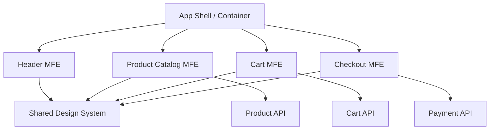

---

## 1. Introduction to Microfrontends

As web applications grow in complexity and size, maintaining a single, monolithic frontend codebase becomes increasingly challenging. Microfrontend architecture addresses these challenges by breaking the frontend into smaller, self-contained modules - each responsible for a specific business domain or feature.

**Key Concepts:**

- **Decomposition:** Breaking down the monolithic frontend into “microapps” that focus on specific functionalities.
- **Independence:** Each microapp can be developed, tested, and deployed independently, often by autonomous cross-functional teams.
- **Team Autonomy:** Different teams can choose different technology stacks based on their specific needs, without affecting the entire system.
- **Scalability & Maintainability:** Smaller codebases are easier to manage, update, and scale, leading to faster iteration cycles and improved long-term maintainability.

---

## 2. Benefits of Microfrontend Architecture

Microfrontends offer a range of significant benefits compared to monolithic frontends:

### 1. Independent Technology Choices

- **Flexibility:** Teams can choose the best framework or library (e.g., React, Vue, Angular) that suits their microapp’s requirements.
- **Modernization:** Legacy parts of an application can be incrementally rewritten using modern technologies without a complete overhaul.

### 2. Faster Development and Deployment

- **Parallel Development:** Multiple teams can work on different microapps simultaneously, reducing inter-team dependencies.
- **Continuous Deployment:** Smaller, isolated modules allow for frequent, independent deployments, which accelerates the release cycle.

### 3. Improved Testing and Quality Assurance

- **Focused Testing:** Each microapp can have its own dedicated testing suite, making it easier to isolate and fix issues.
- **Resilience:** Failures or bugs in one microapp do not impact the entire application, leading to a more resilient overall system.

### 4. Enhanced Scalability and Maintainability

- **Modular Growth:** New features can be added as new microapps, scaling the application organically.
- **Simplified Maintenance:** Smaller codebases reduce the cognitive load on developers, leading to easier maintenance and quicker feature enhancements.

---

## 3. History and Evolution of Microfrontends

The evolution of microfrontends mirrors that of microservices on the backend. Initially, frontend applications were developed as monolithic entities, which became unwieldy as user interfaces grew in complexity. The need for decoupled, independently deployable frontend modules led to early experiments in modularization. These experiments paved the way for modern microfrontend practices:

- **Early Experiments:** Initially, developers tried to break monoliths using iframes or embedded components.
- **Modern Approaches:** With the advent of sophisticated module bundlers and dynamic import techniques, modern solutions such as Webpack Module Federation and Single-SPA have emerged.
- **Community Adoption:** Organizations like Spotify, Zalando, and IKEA have publicly shared their experiences, driving the adoption and maturation of microfrontend architectures.

For more detailed insights, explore resources like the [GitHub Micro Frontends Mindmaps](https://github.com/santoshshinde2012/micro-frontends-mindmaps).

---

## 4. Why Microfrontends Matter

In today's dynamic digital landscape, user experiences must be fast, responsive, and continuously evolving. Monolithic frontends often hinder innovation due to their inherent complexity and interdependencies. Microfrontend architecture matters because it enables:

- **Team Autonomy and Ownership:** Each microapp is owned by a dedicated team, fostering innovation and accountability.
- **Rapid Iteration:** Smaller modules lead to quicker development cycles and faster feedback loops.
- **Technology Agnosticism:** Teams can adopt new technologies without being locked into a single tech stack.
- **Resilience:** Isolated failures are contained within individual microapps, preventing system-wide outages.
- **User-Centric Design:** Independent teams can tailor features to specific user needs, resulting in a more personalized experience.

---

## 5. How Microfrontends Work

Microfrontend architecture employs several strategies to ensure that independently developed modules can seamlessly integrate into a cohesive application:

### 1. Technology Independence

- **Decoupled Builds:** Each microapp is built independently and may use its own build tools, frameworks, and libraries.
- **Versioning:** Teams manage versions separately, enabling incremental updates without breaking the entire system.

### 2. Code Isolation

- **Encapsulation:** Use techniques like the Shadow DOM, module scopes, or iframes to ensure that each microapp’s styles and scripts do not conflict with others.
- **Namespace Conventions:** Adopt naming conventions (e.g., team-specific prefixes) to avoid clashes in global variables, CSS classes, or storage keys.

### 3. Integration Strategies

- **Dynamic Imports:** Load microapps on-demand using dynamic imports in modern JavaScript.
- **Routing:** A shell or container application handles global routing and delegates specific URL segments to corresponding microapps.
- **Event-Based Communication:** Use custom events or shared state management libraries to allow microapps to communicate while remaining loosely coupled.

---

## 6. Techniques for Implementing Microfrontends

There are several approaches to building microfrontend architectures. Each technique comes with its own set of advantages and challenges.

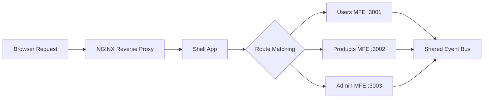

### 1. Webpack Module Federation

Webpack Module Federation is a cutting-edge feature that enables separate builds to dynamically load code from each other. This approach minimizes duplication of shared dependencies and allows for seamless integration of independently deployed microapps.

**Example Webpack Configuration:**

```js
// webpack.config.js (for a microapp)
module.exports = {
  // ...other configuration settings
  plugins: [
    new ModuleFederationPlugin({
      name: "microapp",
      filename: "remoteEntry.js",
      exposes: {
        "./Component": "./src/Component",
      },
      remotes: {
        shell: "shell@https://your-domain.com/remoteEntry.js",
      },
      shared: { react: { singleton: true }, "react-dom": { singleton: true } },
    }),
  ],
};
```

**Benefits:**

- No need for a complete re-architecture.
- Efficient dependency sharing.

### 2. Iframes

Iframes provide strong isolation by embedding an entire application within a parent page. This method is especially useful when complete encapsulation is necessary.

**Simple Iframe Example:**

```html
<iframe
  src="https://childapp.com"
  width="100%"
  height="600"
  title="Child Application"
></iframe>
```

**Pros & Cons:**

- **Pros:** Excellent isolation, strong security boundaries.
- **Cons:** SEO challenges and potential performance overhead.

### 3. Reverse Proxy with NGINX

NGINX can be used as a reverse proxy to route requests to different microapps based on URL paths. This approach centralizes routing at the server level.

**Sample NGINX Configuration:**

```nginx
worker_processes 4;
events { worker_connections 1024; }

http {
  server {
    listen 80;
    root /usr/share/nginx/html;

    location /users {
      try_files $uri /users/index.html;
    }
    location /customers {
      try_files $uri /customers/index.html;
    }
    location /admins {
      try_files $uri /admins/index.html;
    }
  }
}
```

### 4. Web Components

Web Components enable the creation of encapsulated, reusable custom elements that can be used in any framework or library. The Shadow DOM provides style isolation, ensuring that component styles do not leak into the global scope.

**Basic Custom Element Example:**

```js
class MyIcon extends HTMLElement {
  constructor() {
    super();
    this.attachShadow({ mode: "open" });
  }
  connectedCallback() {
    this.shadowRoot.innerHTML = `<span>🌸</span>`;
  }
}
customElements.define("my-icon", MyIcon);
```

**Usage in HTML:**

```html
<my-icon></my-icon>
```

### 5. Component Libraries for React/Vue

Develop microapps as libraries (npm packages) and integrate them into a container application via dynamic imports. This enables teams to develop and version their components independently.

**Example in React:**

```jsx
import Customers from "customers-library";

export default function Dashboard() {
  return (
    <div>
      <h1>Dashboard</h1>
      <Customers />
    </div>
  );
}
```

### 6. Monorepos

A monorepo houses multiple projects within a single repository, facilitating unified dependency management, code sharing, and consistent development practices. Tools like Lerna or Yarn Workspaces are commonly used in monorepo setups.

**Advantages:**

- Simplified dependency management.
- Easier cross-project refactoring.
- Atomic commits across microapps.

### 7. Single-SPA and Similar Frameworks

Single-SPA orchestrates multiple microapps on a single page by defining lifecycle methods (bootstrap, mount, unmount) for each module. This approach supports lazy loading and independent deployment.

**Core Concepts:**

- **Root Config:** Manages microapp registration and routing.
- **Lifecycle Management:** Each microapp defines its own lifecycle functions.
- **Lazy Loading:** Load microapps on demand to optimize performance.

### 8. Custom Orchestrators

Some organizations build custom orchestrators tailored to their unique needs. These orchestrators dynamically load and manage microapps based on user context, roles, or device type. Custom solutions can offer optimized performance and specialized features that off-the-shelf tools might not support.

A well-structured organization maps each MFE to a dedicated team that owns its own build and deploy pipeline:

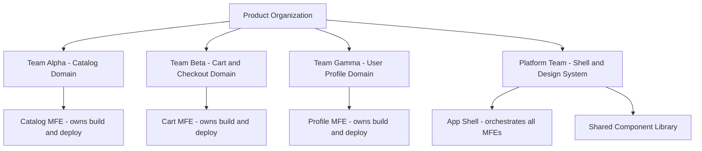

---

## 7. Best Practices and Strategies for Scaling Microfrontends

### 1. Standardize UI/UX Guidelines

- **Design Systems:** Develop a shared style guide or design system (e.g., Material Design) to ensure consistency across microapps.
- **Component Libraries:** Share common UI components across teams to reduce duplication and maintain uniformity.

### 2. Define Clear Boundaries

- **Domain-Driven Design:** Align microapps with business domains to ensure clear separation of concerns.
- **API Contracts:** Define clear interfaces for communication between microapps, reducing interdependencies.

### 3. Ensure Loose Coupling

- **Independent Deployment:** Avoid shared runtime dependencies as much as possible to allow microapps to be deployed independently.
- **Communication Protocols:** Use event buses or custom events for inter-microapp communication while maintaining isolation.

### 4. Embrace Continuous Integration and Deployment

- **Automated Testing:** Implement robust testing pipelines for each microapp.
- **Deployment Pipelines:** Use CI/CD tools to streamline independent deployments, ensuring quick rollbacks if issues occur.

### 5. Monitor and Optimize Performance

- **Analytics:** Monitor load times, resource usage, and user interactions for each microapp.
- **Performance Budget:** Establish performance budgets to ensure that microapps remain fast and responsive even as they grow.

The event bus pattern keeps MFEs loosely coupled: producers dispatch custom events without knowing which consumers are listening:

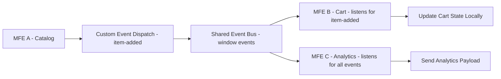

---

## 8. Challenges and Considerations

While microfrontends offer numerous benefits, they also introduce certain complexities:

- **Integration Complexity:**
  Ensuring smooth integration of independently developed microapps can be challenging, particularly when managing shared state or cross-cutting concerns.

- **Versioning and Dependency Management:**
  Synchronizing dependencies across multiple microapps requires careful versioning and testing, especially in monorepo vs. multi-repo environments.

- **Increased Operational Overhead:**
  Managing multiple deployments, monitoring systems, and communication channels may require additional infrastructure and tooling.

- **Consistency and User Experience:**
  Achieving a consistent look and feel across diverse microapps demands strict adherence to shared guidelines and collaboration between teams.

Independent deployment is the defining operational advantage of microfrontends. A team's CI pipeline publishes a new remote entry directly to the CDN without requiring a shell redeployment:

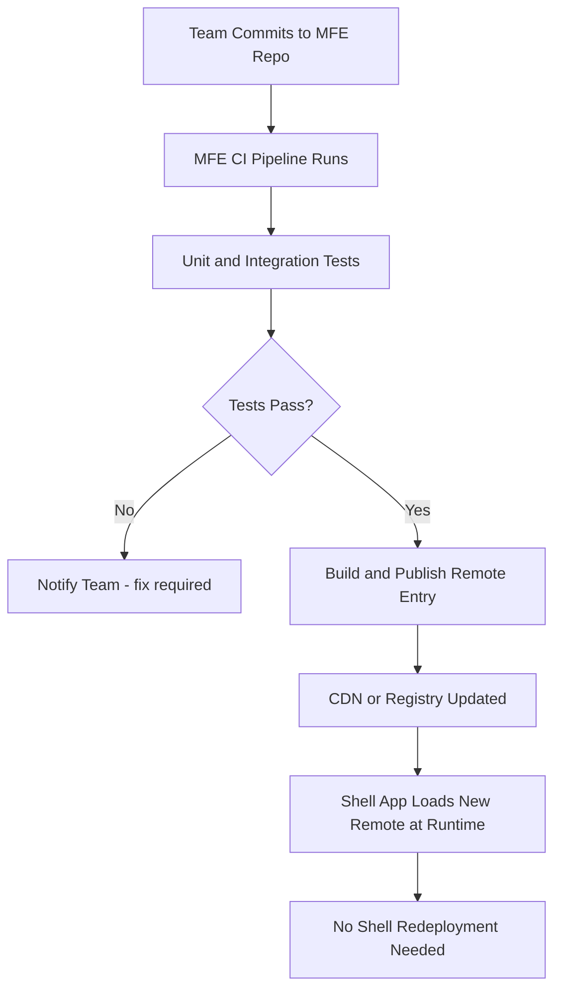

---

## 9. Future Trends in Microfrontend Architecture

The microfrontend approach is continually evolving, with several emerging trends shaping its future:

- **Enhanced Tooling and Frameworks:**
  New tools and frameworks will further simplify microfrontend development and orchestration, making it more accessible to teams of all sizes.

- **Server-Side Rendering and Edge Integration:**
  Integrating microfrontends with server-side rendering and edge computing promises even faster load times and improved SEO performance.

- **Automated Orchestration and Intelligent Routing:**
  Future orchestrators may incorporate machine learning to optimize microapp loading and routing based on user behavior and device capabilities.

- **Greater Emphasis on Security and Privacy:**
  As microfrontends become more widespread, advanced security practices and standards will emerge to safeguard distributed architectures.

One emerging practice is enforcing a performance budget in CI so that bundle size and Lighthouse scores become first-class build constraints. The diagram below models how this gate works:

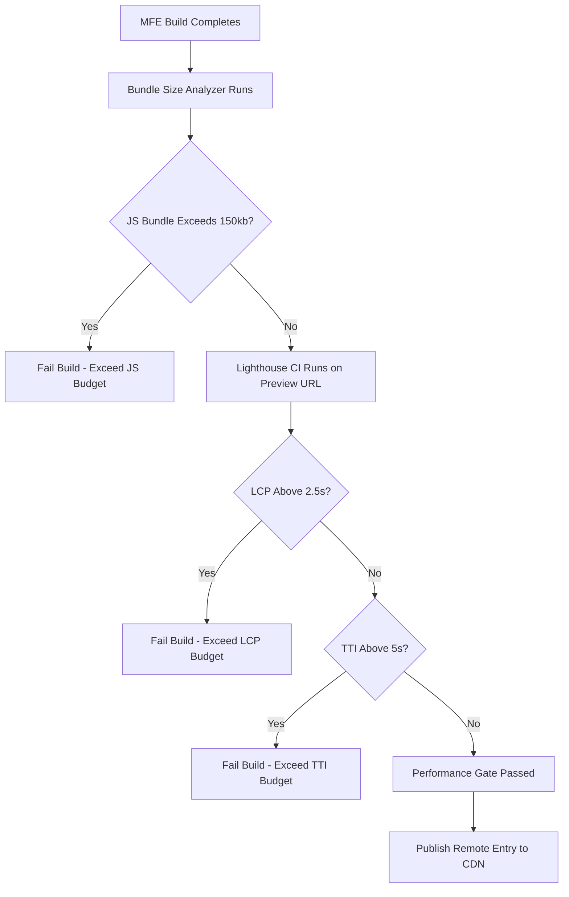

The sequence diagram shows how a Single-SPA orchestrator mounts and unmounts microfrontend apps in response to route changes:

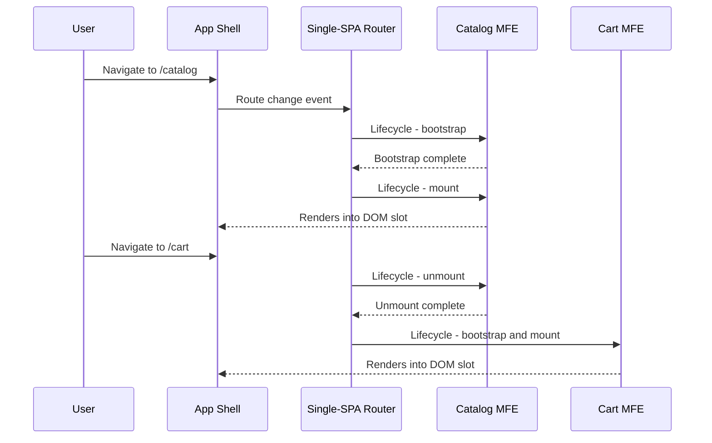

The class diagram models the Webpack Module Federation configuration objects for a host shell and a remote microfrontend:

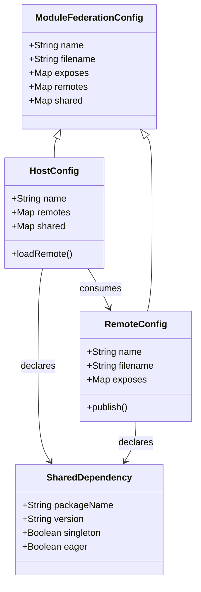

---

## 10. Testing Strategies for Microfrontends

Testing a microfrontend system requires a layered approach. Each microapp owns its unit and integration tests, while the shell app or a dedicated test harness handles cross-MFE contract and end-to-end testing.

### 10.1. Unit and Component Testing Per MFE

Each MFE should run its own isolated test suite against its public component API. No MFE test should import another MFE's source code directly - only the exported public interface.

```bash
# Run tests inside a single MFE workspace
cd packages/catalog-mfe
npx jest --coverage --testPathPattern="src/"
```

```tsx
// catalog-mfe/src/ProductCard.test.tsx
import { render, screen } from "@testing-library/react";
import { ProductCard } from "./ProductCard";

describe("ProductCard", () => {
  it("renders product name and price", () => {
    render(<ProductCard name="Widget Pro" price={29.99} />);
    expect(screen.getByText("Widget Pro")).toBeInTheDocument();
    expect(screen.getByText("$29.99")).toBeInTheDocument();
  });

  it("calls onAddToCart when button is clicked", async () => {
    const onAddToCart = jest.fn();
    render(
      <ProductCard name="Widget Pro" price={29.99} onAddToCart={onAddToCart} />,
    );
    await userEvent.click(screen.getByRole("button", { name: /add to cart/i }));
    expect(onAddToCart).toHaveBeenCalledWith({
      name: "Widget Pro",
      price: 29.99,
    });
  });
});
```

### 10.2. Contract Testing with Pact

Contract testing verifies that the event bus messages and custom DOM events flowing between MFEs stay stable across independent deployments. Pact is commonly used for HTTP APIs; for event-driven MFE communication, a lightweight JSON schema contract is sufficient.

```typescript
// shared/contracts/item-added.contract.ts
import Ajv from "ajv";

export const ItemAddedSchema = {
  type: "object",
  required: ["productId", "quantity", "price"],
  properties: {
    productId: { type: "string", minLength: 1 },
    quantity: { type: "number", minimum: 1 },
    price: { type: "number", minimum: 0 },
  },
  additionalProperties: false,
};

const ajv = new Ajv();
export const validateItemAdded = ajv.compile(ItemAddedSchema);
```

```typescript
// catalog-mfe/src/events.test.ts
import { validateItemAdded } from "shared/contracts/item-added.contract";

test("dispatch payload matches item-added contract", () => {
  const payload = { productId: "sku-001", quantity: 2, price: 49.99 };
  expect(validateItemAdded(payload)).toBe(true);
});
```

### 10.3. End-to-End Testing the Composed Shell

Playwright or Cypress can spin up the composed shell and verify that cross-MFE user journeys work correctly, catching integration regressions that no single MFE's tests would catch.

```typescript
// e2e/checkout-flow.spec.ts
import { test, expect } from "@playwright/test";

test("user adds product from catalog and completes checkout", async ({
  page,
}) => {
  await page.goto("http://localhost:3000");

  // Catalog MFE renders
  await expect(page.locator("[data-mfe='catalog']")).toBeVisible();

  // Add item
  await page.click("[data-testid='add-to-cart-sku-001']");

  // Cart MFE badge updates
  await expect(page.locator("[data-testid='cart-count']")).toHaveText("1");

  // Navigate to checkout MFE
  await page.click("[data-testid='checkout-link']");
  await expect(page.locator("[data-mfe='checkout']")).toBeVisible();
  await expect(page.locator("[data-testid='order-total']")).toContainText(
    "$49.99",
  );
});
```

### 10.4. Testing Architecture Overview

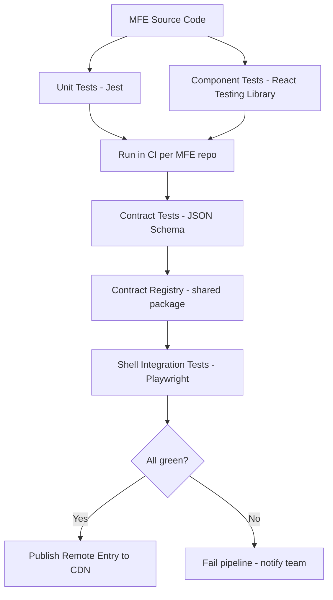

---

A shared design system prevents visual inconsistency without coupling MFEs to a specific version at deploy time. The recommended approach is a versioned component library published to an npm registry, consumed as a singleton via Webpack Module Federation's `shared` map.

### 10.5. Design Token Package

```typescript
// @design-system/tokens/src/index.ts
export const tokens = {
  colors: {
    primary: "#0052cc",
    danger: "#de350b",
    success: "#36b37e",
    surface: "#ffffff",
    background: "#f4f5f7",
  },
  spacing: {
    xs: "4px",
    sm: "8px",
    md: "16px",
    lg: "24px",
    xl: "32px",
  },
  typography: {
    fontFamily: "'Inter', sans-serif",
    sizeSm: "0.875rem",
    sizeMd: "1rem",
    sizeLg: "1.25rem",
  },
} as const;

export type Tokens = typeof tokens;
```

### 10.6. Button Component with Design Token Consumption

```tsx
// @design-system/components/src/Button.tsx
import React from "react";
import { tokens } from "@design-system/tokens";

interface ButtonProps extends React.ButtonHTMLAttributes<HTMLButtonElement> {
  variant?: "primary" | "danger" | "ghost";
  size?: "sm" | "md" | "lg";
}

export const Button: React.FC<ButtonProps> = ({
  variant = "primary",
  size = "md",
  children,
  style,
  ...rest
}) => {
  const bgMap = {
    primary: tokens.colors.primary,
    danger: tokens.colors.danger,
    ghost: "transparent",
  };

  const paddingMap = {
    sm: `${tokens.spacing.xs} ${tokens.spacing.sm}`,
    md: `${tokens.spacing.sm} ${tokens.spacing.md}`,
    lg: `${tokens.spacing.md} ${tokens.spacing.lg}`,
  };

  return (
    <button
      style={{
        background: bgMap[variant],
        padding: paddingMap[size],
        fontFamily: tokens.typography.fontFamily,
        color: variant === "ghost" ? tokens.colors.primary : "#fff",
        border:
          variant === "ghost" ? `1px solid ${tokens.colors.primary}` : "none",
        borderRadius: "4px",
        cursor: "pointer",
        ...style,
      }}
      {...rest}
    >
      {children}
    </button>
  );
};
```

### 10.7. Sharing the Design System as a Module Federation Singleton

```js
// Each MFE's webpack.config.js - shared section
shared: {
  react:          { singleton: true, requiredVersion: "^18.0.0" },
  "react-dom":    { singleton: true, requiredVersion: "^18.0.0" },
  "@design-system/tokens":     { singleton: true, eager: true },
  "@design-system/components": { singleton: true, eager: true },
},
```

Setting `singleton: true` ensures that every MFE uses the same instance of the design system, eliminating version drift and duplicate CSS-in-JS style injections.

---

Migrating a monolithic frontend to microfrontends is best done incrementally. A complete rewrite carries substantial risk; the strangler fig pattern lets you extract domain slices one at a time while keeping the monolith running.

### 10.8. Phase 1: Identify Domain Boundaries

Use code ownership data and team structure to find natural seams. A heatmap of file-change co-occurrence in git history reveals tightly coupled zones that should remain together and loosely coupled areas that are safe to extract first.

```bash
# Find the most frequently co-edited files (coupling indicator)
git log --name-only --pretty=format: | sort | uniq -c | sort -rn | head -30
```

### 10.9. Phase 2: Introduce the Shell Without Moving Code

Deploy a thin shell app at the domain root. Initially it simply iframes or module-federates the entire monolith at `/`. This establishes the deployment seam without breaking existing behavior.

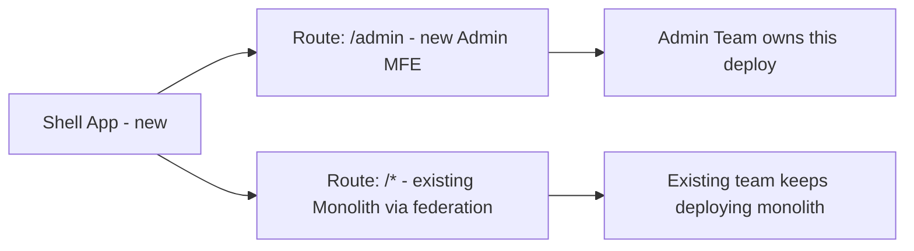

### 10.10. Phase 3: Extract One MFE at a Time

Choose the domain with the most isolated code and the lowest API surface first. Extract it, give ownership to the relevant team, and verify the integration through E2E tests before moving to the next domain.

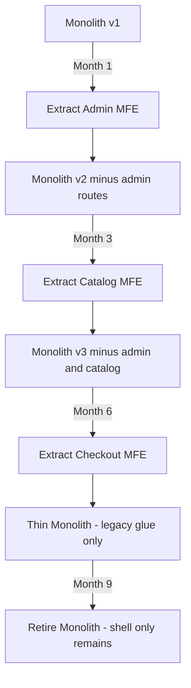

### 10.11. Phase 4: Harden Contracts and Cut Over

Once all domains are extracted, sever the shared runtime coupling: remove direct imports between MFEs, enforce event bus contracts with schema validation in CI, and delete the monolith routing fallback from the shell.

---

## 11. Conclusion

Microfrontend architecture represents a paradigm shift in frontend development. By decomposing a monolithic frontend into independent, manageable microapps, organizations can achieve greater agility, scalability, and resilience. This approach empowers teams to innovate independently while maintaining a cohesive user experience.

Whether you choose to implement microfrontends using Webpack Module Federation, iframes, reverse proxies, web components, or dedicated orchestration frameworks like Single-SPA, the goal remains the same: building flexible and maintainable systems that can adapt to evolving business needs.

As you explore microfrontend architectures, consider adopting best practices around UI standardization, clear module boundaries, and robust CI/CD pipelines. The future of frontend development is modular, and microfrontends are paving the way for next-generation web applications.

---

## 12. Further Reading and Resources

- **Official Documentation and Blogs:**

  - [Micro Frontends Mindmaps on GitHub](https://github.com/santoshshinde2012/micro-frontends-mindmaps)
  - Blogs by industry leaders sharing real-world experiences with microfrontends.

- **Books:**

  - _"Building Microfrontends"_ by Luca Mezzalira – A deep dive into designing and building microfrontend architectures.

- **Online Courses and Workshops:**

  - Courses on platforms like Pluralsight, Udemy, and Coursera that cover advanced frontend architectures.

- **Community and Forums:**
  - Join online communities, Slack channels, and forums dedicated to microfrontend architecture to stay updated on best practices and emerging trends.

---

_This comprehensive guide to microfrontends covers everything from basic concepts and benefits to advanced implementation techniques and future trends. Use it as a roadmap to transform your frontend architecture and build modern, scalable web applications that meet the demands of today’s digital landscape._
