import MdxLayout from "@/components/MdxLayout";

export const metadata = {
  title: "The Microservices Architecture",
  description:
    "Explore the world of microservices, containerization, and scalable systems. Learn about the benefits, challenges, and real-world applications of microservices architecture.",
  topics: [
    "Web Architecture",
    "Web Development",
    "System Design",
    "Backend Development",
    "Distributed Systems",
  ],
};

export default function MicroservicesContent({ children }) {
  return <MdxLayout>{children}</MdxLayout>;
}

# Microservices Architecture

### Author: Son Nguyen

> Date: 2024-08-02

Microservices Architecture is an approach to building software systems as a collection of small, independent services that communicate over well-defined APIs. This design pattern enables scalable, resilient, and easily maintainable applications. In this article, we dive deep into the fundamentals of microservices, exploring key concepts, benefits, challenges, containerization, orchestration, service discovery, and real-world examples.

---

## 1. Introduction

In today's rapidly evolving software landscape, monolithic applications are often too rigid to accommodate the need for continuous deployment, scalability, and resilience. Microservices Architecture breaks down large applications into smaller, autonomous services, each responsible for a distinct piece of functionality. This paradigm shift not only accelerates development cycles but also enhances the agility and robustness of modern systems.

By decoupling services, teams can work independently on different components, choose the best technology stack for each service, and deploy updates without affecting the entire system. However, with these benefits come new challenges, such as managing distributed systems and ensuring seamless inter-service communication.

The following diagram contrasts a monolithic architecture with a microservices architecture:

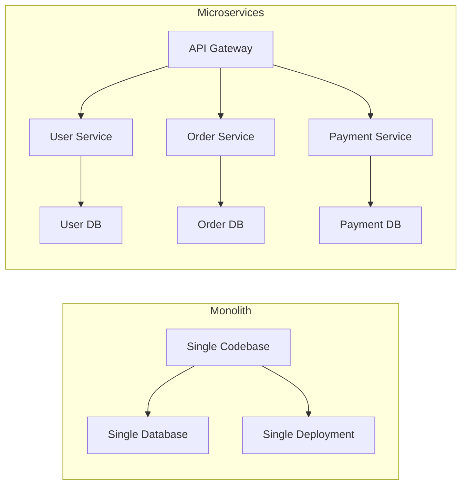

---

## 2. Key Concepts

Understanding the core principles of microservices is crucial for designing effective systems:

- **Decoupling:**
  Each microservice operates independently, with its own codebase, database, and deployment cycle. This isolation minimizes the impact of changes and failures.

- **Resilience:**
  The architecture is designed so that the failure of one service does not cascade to others, ensuring overall system stability.

- **Scalability:**
  Services can be scaled independently according to demand, optimizing resource usage and performance.

- **Technology Diversity:**
  Teams can use different programming languages, databases, or frameworks for each service, choosing the best tool for the job.

- **Domain-Driven Design (DDD):**
  Services are often aligned with business domains, making it easier to manage complexity and maintain clear boundaries.

Here is how a typical request flows through a microservices system:

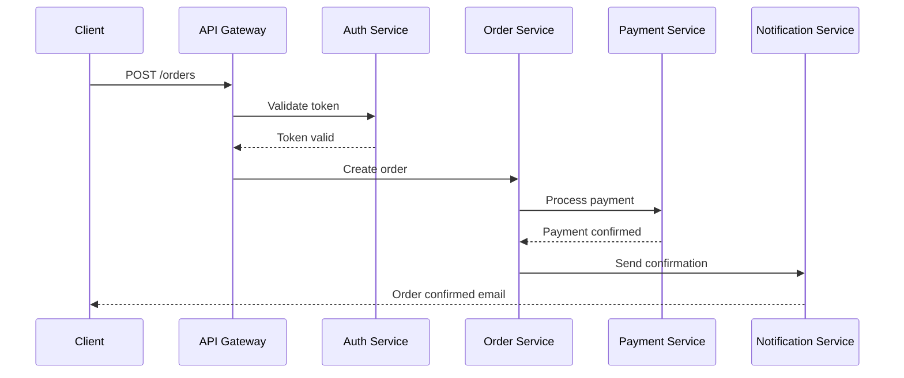

---

## 3. Benefits of Microservices

Microservices offer several key advantages over traditional monolithic architectures:

- **Improved Fault Isolation:**
  Since services are decoupled, a failure in one does not necessarily affect the entire system. This isolation improves the overall reliability.

- **Faster Deployments and Iterations:**
  Smaller, self-contained services allow for quicker releases, easier debugging, and more frequent updates without a full system redeployment.

- **Independent Scalability:**
  Services can be scaled on-demand, optimizing performance and cost. For example, a high-traffic service can be scaled without scaling the entire application.

- **Flexibility in Technology:**
  Each service can be built with the technology that best fits its requirements, fostering innovation and efficiency.

- **Easier Maintenance:**
  Smaller codebases are generally simpler to understand, test, and maintain, leading to reduced technical debt over time.

The database-per-service pattern ensures each microservice owns its data, preventing tight coupling through shared databases:

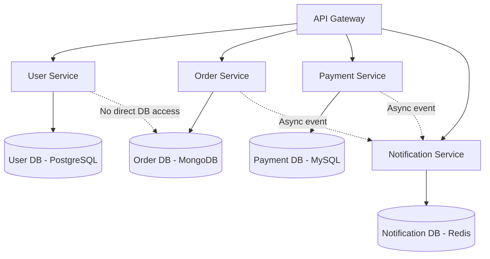

---

## 4. Challenges of Microservices

While the benefits are significant, adopting a microservices architecture comes with its own set of challenges:

- **Distributed Complexity:**
  Managing multiple services introduces complexities in communication, data consistency, and debugging. Monitoring and logging across distributed systems require robust tooling.

- **Operational Overhead:**
  With many moving parts, deploying, updating, and scaling microservices demands a well-orchestrated CI/CD pipeline, container management, and proactive monitoring.

- **Data Management:**
  Ensuring data consistency across independent services can be challenging, especially when dealing with transactions spanning multiple services.

- **Security:**
  Each service must be secured individually, and securing inter-service communication is critical to prevent vulnerabilities.

- **Network Latency:**
  The communication between distributed services can introduce latency, affecting overall system performance if not carefully managed.

Each microservice has its own independent CI/CD pipeline so that teams can release without coordinating with other service owners:

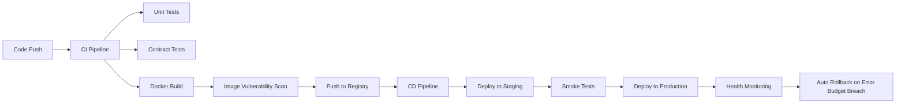

---

## 5. Containerization with Docker

Containerization is a fundamental pillar of microservices, enabling consistent deployment environments and isolation of dependencies. Docker has become the de facto standard for containerization.

### 5.1. Example: A Simple Dockerfile for a Node.js Microservice

```dockerfile
# Use an official Node.js runtime as a parent image
FROM node:14-alpine

# Set the working directory
WORKDIR /app

# Copy package files and install dependencies
COPY package*.json ./
RUN npm install --production

# Copy the rest of the application code
COPY . .

# Expose the port the app runs on
EXPOSE 3000

# Define the command to run the application
CMD ["npm", "start"]
```

This Dockerfile packages your Node.js microservice, ensuring it runs consistently across different environments by encapsulating all dependencies.

---

## 6. Orchestration with Kubernetes

As the number of microservices grows, managing them manually becomes impractical. Kubernetes is an orchestration platform that automates the deployment, scaling, and management of containerized applications.

### 6.1. Example: Kubernetes Deployment YAML

```yaml
apiVersion: apps/v1
kind: Deployment
metadata:
  name: microservice-deployment
spec:
  replicas: 3
  selector:
    matchLabels:
      app: microservice
  template:
    metadata:
      labels:
        app: microservice
    spec:
      containers:
        - name: microservice
          image: your-docker-repo/microservice:latest
          ports:
            - containerPort: 3000
```

This YAML file demonstrates how to deploy multiple instances (replicas) of a microservice, ensuring high availability and load balancing across the cluster.

---

## 7. Service Discovery and API Gateway

### 7.1. Service Discovery

In a dynamic microservices environment, services need a way to locate and communicate with each other. Service discovery mechanisms, such as DNS-based discovery or dedicated tools (e.g., Consul or Eureka), enable services to find one another automatically without hardcoding IP addresses.

### 7.2. API Gateway

An API Gateway acts as a single entry point for client requests. It handles tasks like routing, authentication, rate limiting, and protocol translation. By centralizing these concerns, the gateway simplifies the architecture of individual microservices.

#### Example: Using NGINX as an API Gateway

```nginx
server {
    listen 80;

    location /service1/ {
        proxy_pass http://service1:3000/;
    }

    location /service2/ {
        proxy_pass http://service2:3000/;
    }
}
```

In this configuration, NGINX routes requests to the appropriate backend services based on URL paths.

The following diagram illustrates how an API Gateway routes traffic and handles cross-cutting concerns:

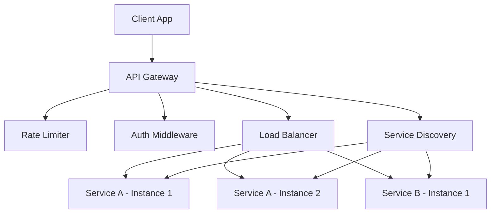

Blue-green deployment keeps two identical production environments so traffic can be switched instantly with zero downtime and immediate rollback capability:

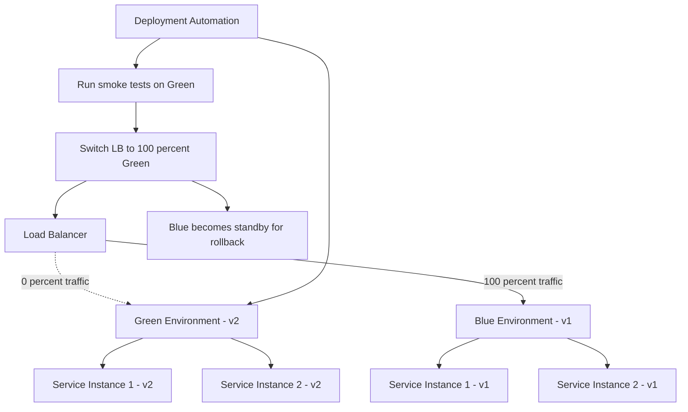

---

## 8. Real-World Use Cases

Microservices architecture is widely adopted in various industries and applications:

- **E-commerce Platforms:**
  Separate services handle user authentication, product catalog management, shopping carts, payment processing, and order fulfillment - enabling agile updates and independent scaling.

- **Streaming Services:**
  Services for content delivery, recommendation engines, user profiles, and billing can operate independently, ensuring that high demand in one area does not overwhelm the entire system.

- **Financial Systems:**
  Critical functionalities such as risk assessment, transaction processing, and fraud detection are isolated, enhancing security and fault tolerance.

- **Healthcare Systems:**
  Microservices allow healthcare applications to manage patient records, appointment scheduling, and telemedicine services independently, ensuring compliance and data privacy.

A service mesh uses a sidecar proxy injected alongside every service to manage all inter-service traffic transparently:

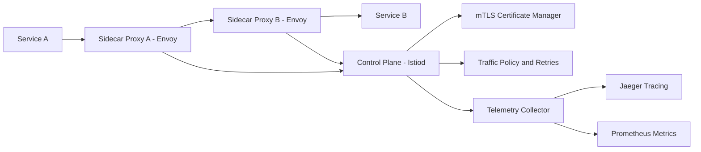

---

## 9. Best Practices and Operational Considerations

Successfully implementing a microservices architecture involves more than just technical design. Consider the following best practices:

- **Robust CI/CD Pipelines:**
  Automate testing, deployment, and monitoring to ensure that each microservice can be updated independently with minimal downtime.

- **Centralized Logging and Monitoring:**
  Use tools like ELK Stack, Prometheus, and Grafana to aggregate logs and metrics from all services, making it easier to diagnose issues in distributed systems.

- **Service Contracts and API Versioning:**
  Clearly define service interfaces and maintain backward compatibility through versioning, reducing the risk of breaking dependencies.

- **Security Best Practices:**
  Secure each microservice with proper authentication, authorization, and encryption. Consider using service meshes (e.g., Istio) for securing inter-service communications.

- **Resiliency Patterns:**
  Implement patterns like circuit breakers, retries, and bulkheads to improve fault tolerance and mitigate cascading failures.

Kubernetes liveness, readiness, and startup probes serve distinct roles in managing container health and traffic routing:

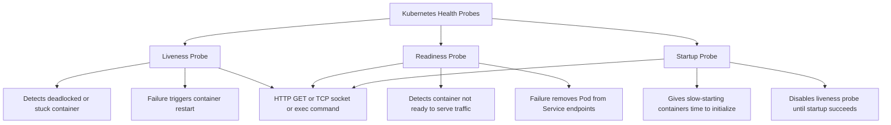

The circuit breaker pattern is especially important for preventing cascading failures:

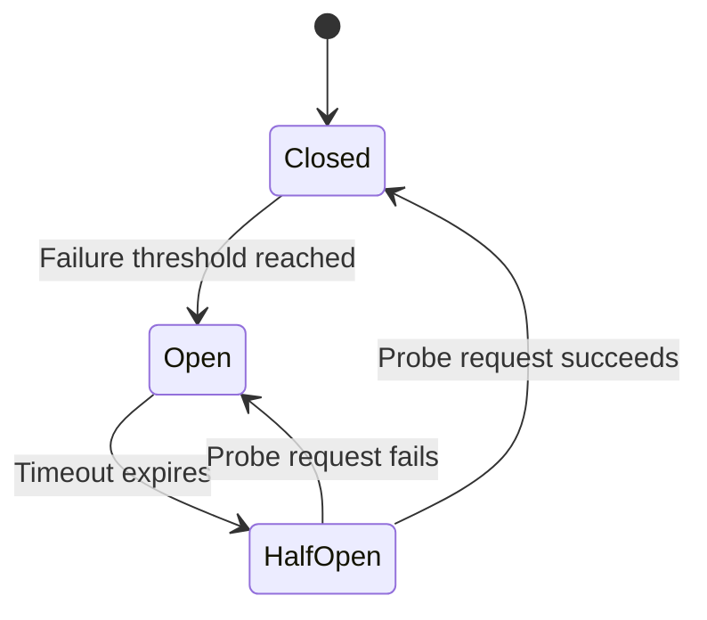

Distributed tracing propagates a trace ID through every service hop so a single request can be reconstructed end to end:

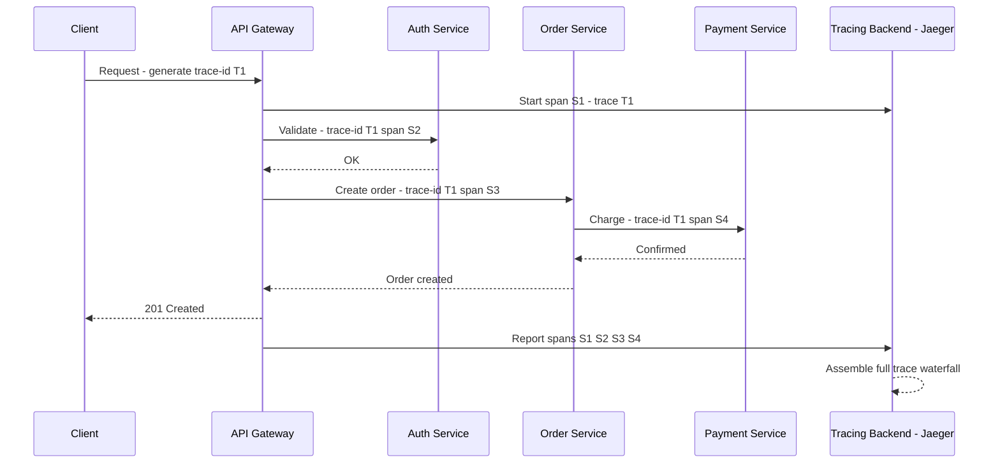

The bulkhead pattern isolates resource pools so that a surge in one service cannot exhaust the thread pool or connection pool shared by other services:

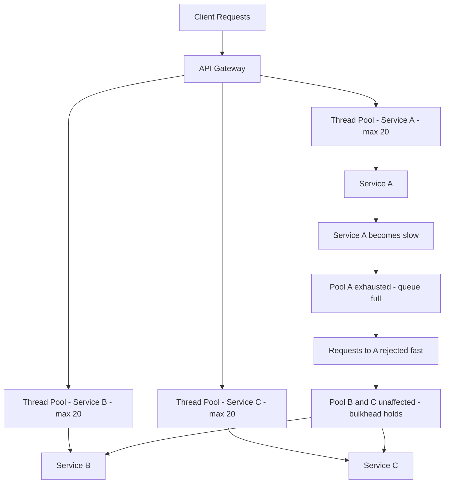

### 9.1. Distributed Transactions and the Saga Pattern

Microservices each own their own database, which means there is no single transaction coordinator. When a business operation spans multiple services — for example, placing an order requires debiting inventory, charging a payment, and sending a confirmation — you need a pattern that coordinates these steps without a distributed lock.

### 9.2. The Saga Pattern

A saga breaks a long-running transaction into a sequence of local transactions, each publishing an event or message that triggers the next step. If any step fails, compensating transactions undo the earlier steps.

**Choreography-based Saga** (event-driven, no central coordinator):

```yaml
# Step 1: Order Service creates order in PENDING state and publishes OrderCreated
# Step 2: Inventory Service receives OrderCreated, reserves stock, publishes StockReserved
# Step 3: Payment Service receives StockReserved, charges card, publishes PaymentProcessed
# Step 4: Order Service receives PaymentProcessed, marks order CONFIRMED

# Compensation (failure) path:
# Payment fails → publishes PaymentFailed
# Inventory Service receives PaymentFailed → releases reserved stock, publishes StockReleased
# Order Service receives StockReleased → marks order FAILED
```

**Orchestration-based Saga** (central saga orchestrator):

```javascript
// saga-orchestrator/order-saga.js
class OrderSaga {
  async execute(orderId) {
    try {
      await this.inventoryService.reserveStock(orderId);
      await this.paymentService.chargeCard(orderId);
      await this.orderService.confirm(orderId);
    } catch (err) {
      // Run compensations in reverse order
      await this.paymentService.refund(orderId).catch(() => {});
      await this.inventoryService.releaseStock(orderId).catch(() => {});
      await this.orderService.fail(orderId);
      throw err;
    }
  }
}
```

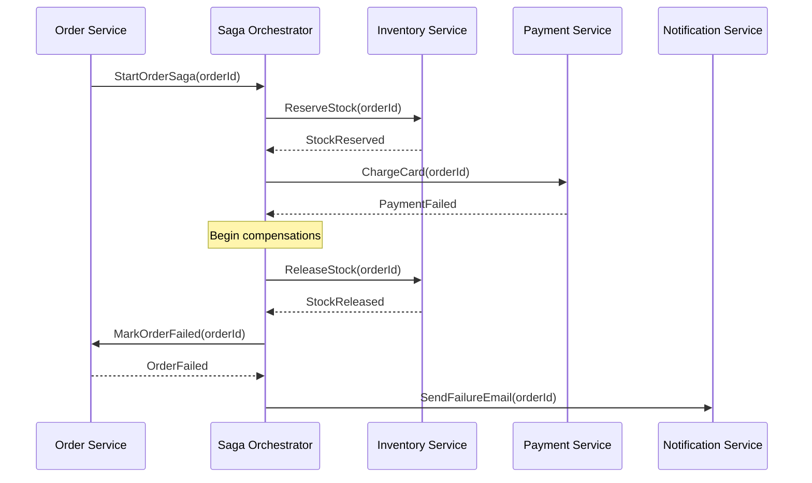

### 9.3. Idempotency Keys

Because messages can be delivered more than once in distributed systems, every service operation should be idempotent. Use a client-supplied idempotency key stored in the database to detect and deduplicate duplicate requests.

```javascript
// payment-service/routes/charge.js
router.post("/charge", async (req, res) => {
  const { orderId, amount, idempotencyKey } = req.body;

  // Check if we already processed this key
  const existing = await db.query(
    "SELECT * FROM payments WHERE idempotency_key = $1",
    [idempotencyKey],
  );

  if (existing.rows.length > 0) {
    // Return the same response as the original request
    return res.status(200).json(existing.rows[0]);
  }

  const payment = await chargeCard(orderId, amount);
  await db.query(
    "INSERT INTO payments (order_id, idempotency_key, status) VALUES ($1, $2, $3)",
    [orderId, idempotencyKey, payment.status],
  );

  res.status(201).json(payment);
});
```

---

### 9.2. Testing Microservices

Testing distributed systems requires multiple complementary strategies. Unit tests alone give false confidence because integration points between services are where most production bugs occur.

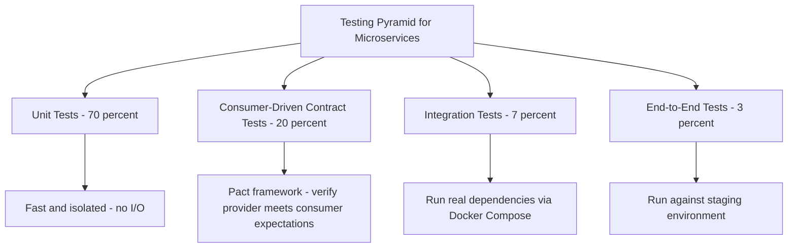

### 9.3. Consumer-Driven Contract Testing with Pact

```javascript
// consumer/order-service.pact.test.js
const { PactV3, MatchersV3 } = require("@pact-foundation/pact");

const provider = new PactV3({
  consumer: "OrderService",
  provider: "PaymentService",
});

describe("Payment Service contract", () => {
  it("charges a card successfully", async () => {
    await provider
      .given("a valid card on file for order 42")
      .uponReceiving("a charge request")
      .withRequest({
        method: "POST",
        path: "/charge",
        body: { orderId: "42", amount: 9999 },
      })
      .willRespondWith({
        status: 201,
        body: {
          paymentId: MatchersV3.uuid(),
          status: "succeeded",
        },
      });

    await provider.executeTest(async (mockPaymentService) => {
      const client = new PaymentClient(mockPaymentService.url);
      const result = await client.charge("42", 9999);
      expect(result.status).toBe("succeeded");
    });
  });
});
```

### 9.4. Observability Stack Setup

The three pillars of observability are logs, metrics, and traces. The following Docker Compose snippet provisions a local observability stack:

```yaml
# docker-compose.observability.yml
services:
  prometheus:
    image: prom/prometheus:latest
    volumes:
      - ./prometheus.yml:/etc/prometheus/prometheus.yml
    ports:
      - "9090:9090"

  grafana:
    image: grafana/grafana:latest
    ports:
      - "3001:3000"
    environment:
      - GF_SECURITY_ADMIN_PASSWORD=secret
    volumes:
      - grafana_data:/var/lib/grafana

  jaeger:
    image: jaegertracing/all-in-one:latest
    ports:
      - "16686:16686" # Jaeger UI
      - "4317:4317" # OTLP gRPC receiver

  otel-collector:
    image: otel/opentelemetry-collector-contrib:latest
    volumes:
      - ./otel-config.yml:/etc/otelcol/config.yaml
    ports:
      - "4318:4318" # OTLP HTTP receiver

volumes:
  grafana_data:
```

Instrument a Node.js service with OpenTelemetry:

```javascript
// tracing.js — import this at the very top of your entry point
const { NodeSDK } = require("@opentelemetry/sdk-node");
const {
  OTLPTraceExporter,
} = require("@opentelemetry/exporter-trace-otlp-http");
const {
  getNodeAutoInstrumentations,
} = require("@opentelemetry/auto-instrumentations-node");

const sdk = new NodeSDK({
  traceExporter: new OTLPTraceExporter({
    url:
      process.env.OTEL_EXPORTER_OTLP_ENDPOINT ??
      "http://localhost:4318/v1/traces",
  }),
  instrumentations: [getNodeAutoInstrumentations()],
});

sdk.start();
```

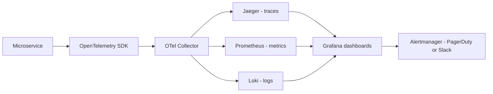

---

## 10. Future Trends in Microservices

The evolution of microservices is driving innovations that further simplify and enhance distributed architectures:

- **Serverless Architectures:**
  Combining microservices with serverless computing allows for even more granular scaling and reduced operational overhead.

- **Service Meshes:**
  Service meshes provide advanced traffic management, security, and observability, streamlining the complexity of inter-service communication.

- **Event-Driven Architectures:**
  Incorporating event streaming platforms like Kafka facilitates asynchronous communication between services, improving decoupling and scalability.

- **Edge Computing Integration:**
  Distributing microservices closer to the data source (at the edge) reduces latency and enhances real-time processing capabilities.

---

## 11. Conclusion

Microservices Architecture offers a transformative approach to building scalable, resilient, and agile systems. By decomposing applications into small, independent services, organizations can accelerate development, improve fault isolation, and tailor technology stacks to specific needs. However, this approach also introduces challenges in managing distributed systems, data consistency, and operational complexity.

By leveraging containerization, orchestration tools like Kubernetes, and modern service discovery and API gateway solutions, developers can harness the full potential of microservices. Adopting best practices in CI/CD, security, and monitoring further ensures the stability and scalability of your applications.

As the landscape evolves, emerging trends like serverless computing, service meshes, and edge integration promise to further refine microservices architecture, paving the way for even more innovative and efficient systems.

**Key Takeaways:**

- The database-per-service pattern is non-negotiable for true independence. Never share a database between services.
- Use the Saga pattern (choreography for simple flows, orchestration for complex ones) to handle distributed transactions without two-phase commit.
- Implement idempotency keys on all mutation endpoints — at-least-once delivery is the default in most message brokers.
- Consumer-driven contract tests (Pact) catch breaking API changes before they reach production, without needing a full integration environment.
- The observability stack (Prometheus + Grafana + Jaeger) is not optional — diagnosing production incidents in a distributed system without traces and metrics is nearly impossible.
- Introduce microservices incrementally using the Strangler Fig pattern: extract services from a monolith one at a time rather than doing a big-bang rewrite.

Explore additional resources and experiment with these technologies to build your own robust microservices-based solutions.

---
