import MdxLayout from "@/components/MdxLayout";

export const metadata = {
  title: "MongoDB and Its Unique Features: A Comprehensive Guide",
  description:
    "An in-depth exploration of MongoDB's innovative features, including its document-oriented model, flexible schema design, aggregation framework, and powerful BSON format.",
  topics: [
    "Web Development",
    "Databases",
    "Backend Development",
    "System Design",
  ],
};

export default function MongoDBContent({ children }) {
  return <MdxLayout>{children}</MdxLayout>;
}

# MongoDB and Its Unique Features: A Deep Dive

### Author: Son Nguyen

> Date: 2025-02-21

MongoDB has rapidly become one of the most popular NoSQL databases, redefining how developers store, manage, and retrieve data. Its innovative document-oriented model, flexible schema design, and state-of-the-art features have made it an indispensable tool for modern web applications. In this extensive guide, we dive deep into MongoDB’s unique capabilities, exploring everything from its core data model to advanced performance and scalability features. We’ll also take an in-depth look at BSON - the binary format that lies at the heart of MongoDB - and discuss why it makes MongoDB so powerful.

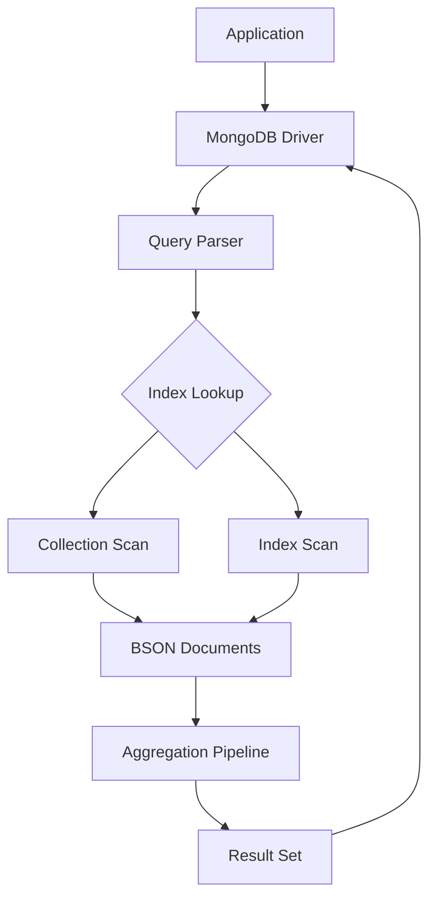

---

## 1. Introduction

Traditional relational databases have long relied on structured tables and rigid schemas, making them less adaptable to today’s rapidly evolving data needs. MongoDB emerged to address these limitations by offering a dynamic, schema-less approach that is ideally suited for agile development and big data applications.

In this article, we explore:

- The document-oriented nature of MongoDB and its advantages.
- How MongoDB’s flexible schema design accelerates development.
- The benefits of horizontal scalability and high availability.
- The power of the aggregation framework for complex data analysis.
- How BSON, MongoDB’s native data format, enhances performance and flexibility.
- Best practices for data modeling, indexing, and securing your data.

---

## 2. What is MongoDB?

MongoDB is an open-source NoSQL database that stores data in JSON-like documents. Unlike relational databases that use tables, rows, and columns, MongoDB organizes data into collections of documents. This design provides several benefits:

- **Document-Oriented Storage:**
  Data is stored in self-contained documents (using a format called BSON) that can contain nested structures and arrays. This allows for a natural representation of complex data.

- **Flexible Schema Design:**
  MongoDB does not enforce a fixed schema on your data. Each document in a collection can have a different structure, enabling rapid iteration and evolution of your application.

- **Scalability:**
  With built-in sharding, MongoDB can scale horizontally across many servers, making it ideal for applications with large data sets and high throughput.

- **High Availability:**
  Through replica sets, MongoDB offers robust redundancy and automated failover, ensuring your application remains online even if some nodes fail.

---

## 3. The Document-Oriented Data Model

At its core, MongoDB’s document-oriented approach revolutionizes the way we think about data storage.

### 3.1 Flexibility and Agility

Unlike the rigid, tabular structures of relational databases, MongoDB stores data in documents that mirror real-world objects. For example, consider a user profile:

```json
{
  "_id": "507f1f77bcf86cd799439011",
  "name": "Alice Johnson",
  "email": "alice@example.com",
  "joined": "2025-01-15T13:45:30Z",
  "preferences": {
    "newsletter": true,
    "notifications": ["email", "sms"]
  },
  "hobbies": ["reading", "hiking", "photography"]
}
```

This document not only contains simple key-value pairs but also nested documents and arrays. Such a structure enables you to model complex data relationships naturally without the need for multiple joins.

### 3.2 Ease of Evolution

With MongoDB, you can change your data model on the fly. Need to add a new field or restructure your document? There’s no need to alter a schema across millions of rows as in SQL databases. This flexibility is especially beneficial in agile environments where requirements frequently change.

---

## 4. The Power of BSON

A standout feature of MongoDB is its use of **BSON** - a binary JSON format that extends JSON’s capabilities.

### 4.1 What is BSON?

BSON (Binary JSON) is the data storage and network transfer format used by MongoDB. While it resembles JSON in structure, BSON is designed to be more efficient for both storage and speed. It supports additional data types not available in JSON, such as:

- **Dates:** Native date types allow for efficient time-based queries.
- **Binary Data:** Useful for storing images, files, or other binary content.
- **ObjectIds:** Unique identifiers that are automatically generated, ensuring every document has a distinct key.
- **Decimal128:** High-precision numeric representation for financial and scientific calculations.

### 4.2 Advantages of BSON

- **Efficiency:**
  Its binary format makes parsing and data traversal much faster than plain text JSON, significantly reducing the network overhead.

- **Rich Data Types:**
  BSON supports a wide array of data types, ensuring that complex data can be represented accurately and efficiently.

- **Optimized for MongoDB:**
  Since MongoDB is built around BSON, every operation - from storage to querying - is optimized for speed and performance.

### 4.3 How BSON Enhances MongoDB

The efficiency of BSON allows MongoDB to manage large volumes of data with ease. Its support for rich data types means that developers can store diverse data without compromising on performance. This is particularly important for applications that handle multimedia content, time-series data, or require high-precision calculations.

### 4.4 BSON vs JSON

While JSON is human-readable and widely used for data interchange, BSON is designed for performance. BSON’s binary format allows for faster parsing and smaller data sizes, making it ideal for high-performance applications. Additionally, BSON’s support for more complex data types means that developers can work with a richer set of data structures.

Example of BSON vs JSON:

```json
// JSON
{
  "name": "Alice",
  "age": 30,
  "isActive": true,
  "lastLogin": "2025-01-15T13:45:30Z",
  "preferences": {
    "newsletter": true,
    "notifications": ["email", "sms"]
  }
}

// BSON
{
  "name": "Alice",
  "age": NumberInt(30),
  "isActive": true,
  "lastLogin": ISODate("2025-01-15T13:45:30Z"),
  "preferences": {
    "newsletter": true,
    "notifications": [ "email", "sms" ]
  }
}
```

In the BSON example, you can see how BSON types like `NumberInt` and `ISODate` are used to represent data more efficiently than plain JSON. This allows MongoDB to optimize storage and retrieval operations, making it a powerful choice for modern applications.

---

## 5. The Aggregation Framework

MongoDB’s aggregation framework is a powerful feature that enables developers to process data records and return computed results. Think of it as MongoDB’s version of SQL’s `GROUP BY`, but with far more flexibility.

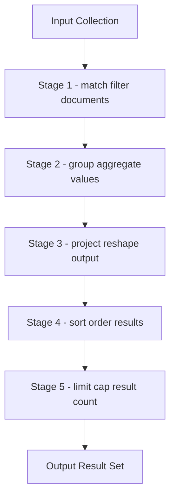

### 5.1 Pipeline Operations

The aggregation framework works by passing documents through a multi-stage pipeline. Each stage transforms the data in some way - filtering, grouping, sorting, or reshaping it. For example, you can use the aggregation framework to calculate total sales per region, average user activity, or to reshape documents for reporting purposes.

### 5.2 Data Transformation and Analysis

Whether you’re building real-time analytics dashboards or generating complex reports, MongoDB’s aggregation framework provides the tools needed to perform sophisticated data manipulations. It supports operations like:

- **Filtering:** Select only documents that meet specific criteria.
- **Grouping:** Combine documents to compute aggregated values.
- **Sorting:** Order documents by one or more fields.
- **Projection:** Reshape the documents to include only the necessary fields.

### 5.3 Real-World Applications

Consider an e-commerce platform that needs to display sales trends and customer behavior insights. Using the aggregation framework, developers can create pipelines that extract and compute key metrics in real time, allowing the business to make informed decisions quickly.

### 5.4 Example Aggregation Query

```javascript
db.orders.aggregate([
  { $match: { status: "completed" } },
  { $group: { _id: "$region", totalSales: { $sum: "$amount" } } },
  { $sort: { totalSales: -1 } },
]);
```

This example query matches completed orders, groups them by region, calculates the total sales for each region, and sorts the results in descending order. The aggregation framework allows for complex data analysis with minimal effort.

### 5.5 Performance Considerations

When using the aggregation framework, consider the following performance tips:

- **Indexing:** Ensure that fields used in `$match` and `$sort` stages are indexed to improve performance.
- **Pipeline Optimization:** Use `$project` early in the pipeline to reduce the amount of data processed in subsequent stages.
- **Limit Data Size:** Use `$limit` to restrict the number of documents processed, especially in large collections.
- **Monitor Performance:** Use MongoDB’s built-in profiling tools to analyze the performance of your aggregation queries and identify potential bottlenecks.
- **Use `$facet` for Parallel Processing:** If you need to perform multiple aggregations on the same data set, consider using the `$facet` stage to run them in parallel, improving efficiency.
- **Avoid Unnecessary Stages:** Each stage in the pipeline adds overhead. Only include stages that are necessary for your analysis to keep the pipeline efficient.
- **Use `$merge` for Storing Results:** If you need to store the results of an aggregation, consider using the `$merge` stage to write the output directly to a collection, which can be more efficient than processing the results in your application code.
- **Use `$out` for Materialized Views:** If you frequently run the same aggregation, consider using the `$out` stage to create a materialized view, which can significantly speed up subsequent queries.
- **Monitor Memory Usage:** Be mindful of the memory limits for aggregation operations. If your pipeline exceeds the available memory, consider breaking it into smaller stages or using `$merge` to write intermediate results to a collection.

### 5.6 Conclusion

The aggregation framework is a powerful tool that allows developers to perform complex data analysis and transformations with ease. By leveraging its capabilities, you can gain valuable insights from your data and make informed decisions quickly.

---

## 6. Scalability and High Availability

Modern applications require databases that not only perform well under heavy loads but also remain highly available. MongoDB addresses these needs through sharding and replica sets.

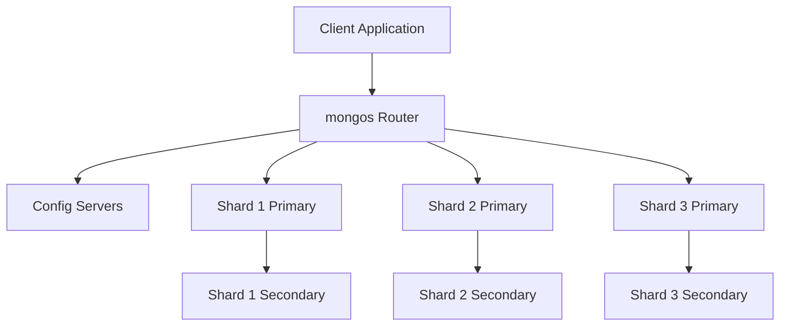

### 6.0 Replica Set Election

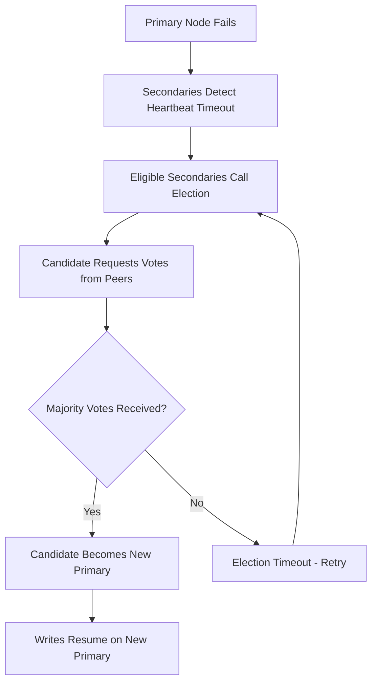

### 6.1 Horizontal Scalability with Sharding

Sharding is the process of partitioning data across multiple machines. MongoDB automatically balances the data across shards, ensuring that no single server becomes a bottleneck. This horizontal scalability means that as your data grows, your database can grow with it seamlessly.

- **Automatic Data Distribution:**
  MongoDB splits the data based on a shard key, distributing documents evenly across servers.
- **Improved Throughput:**
  By spreading the load, sharding allows for higher write and read throughput, essential for large-scale applications.

### 6.2 High Availability with Replica Sets

Replica sets are groups of MongoDB servers that contain the same data set, providing redundancy and fault tolerance.

- **Automatic Failover:**
  If the primary node fails, a secondary node is automatically promoted, ensuring that the database remains accessible.
- **Data Redundancy:**
  Multiple copies of the data protect against hardware failures and data corruption.
- **Read Scaling:**
  Secondary nodes can handle read operations, reducing the load on the primary node and enhancing performance.

### 6.3 Backup and Restore

Regular backups are essential for data integrity and disaster recovery. MongoDB provides various backup options, including:

- **Mongodump and Mongorestore:**
  Command-line tools for creating and restoring backups.

- **Cloud Backups:**
  MongoDB Atlas offers automated backups and point-in-time recovery, ensuring that your data is always safe.

- **Snapshot Backups:**
  Cloud providers like AWS and Azure offer snapshot capabilities that can be integrated with MongoDB for efficient backups.

### 6.4 Monitoring and Performance Tuning

Monitoring your MongoDB deployment is crucial for maintaining performance and availability. MongoDB provides various tools and metrics to help you monitor your database:

- **MongoDB Atlas:**
  A fully managed cloud database service that includes built-in monitoring and alerting features.

- **MongoDB Ops Manager:**
  A self-hosted solution for monitoring and managing MongoDB deployments, providing real-time performance metrics and alerts.

- **Third-Party Monitoring Tools:**
  Tools like Datadog, New Relic, and Prometheus can be integrated with MongoDB to provide additional monitoring capabilities.

- **Performance Metrics:**
  Monitor key performance metrics such as query execution time, memory usage, and disk I/O to identify potential bottlenecks.

- **Profiling:**
  Use MongoDB’s built-in profiling tools to analyze query performance and identify slow queries that may need optimization.

- **GUI Tools:**
  Tools like MongoDB Compass provide a graphical interface for monitoring and managing your MongoDB deployment, making it easier to visualize performance metrics and identify issues.

The following diagram illustrates how document schemas evolve incrementally in MongoDB, using field additions, renames, and bulk `updateMany` migrations to keep all documents consistent:

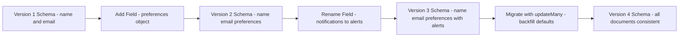

---

## 7. Indexing for Enhanced Performance

Indexes are crucial for speeding up query operations in any database. MongoDB offers various indexing options tailored to different use cases.

### 7.1 Types of Indexes

- **Single Field Indexes:**
  Improve performance for queries that target a single field.
- **Compound Indexes:**
  Combine multiple fields, optimizing queries that filter on more than one attribute.
- **Geospatial Indexes:**
  Specialized indexes for location-based queries.
- **Text Indexes:**
  Enable efficient search across text fields, useful for applications with extensive textual data.

### 7.2 Indexing Best Practices

- **Selectivity:**
  Only index fields that are frequently queried. Over-indexing can lead to unnecessary overhead.
- **Analyze Query Patterns:**
  Understand the common queries in your application to design indexes that significantly enhance performance.
- **Regular Maintenance:**
  Monitor and optimize indexes periodically to adapt to changing data and query patterns.

---

## 8. Security Features

Securing your data is paramount. MongoDB includes a robust set of security features to ensure that your data is protected both at rest and in transit.

### 8.1 Authentication and Authorization

MongoDB supports various authentication mechanisms, including SCRAM, LDAP, and x.509 certificates. Role-based access control (RBAC) ensures that users have only the permissions they need, minimizing the risk of unauthorized access.

### 8.2 Data Encryption

- **Encryption at Rest:**
  MongoDB can encrypt data stored on disk, protecting sensitive information even if physical security is compromised.
- **Encryption in Transit:**
  Use SSL/TLS to secure data as it travels between your application and the database.

### 8.3 Auditing and Compliance

For industries with strict regulatory requirements, MongoDB offers auditing features to log access and data modifications. This helps organizations maintain compliance with data protection regulations.

---

## 9. Data Modeling Best Practices

Effective data modeling is crucial to harness the full potential of MongoDB. Here are some strategies to consider:

### 9.1 Embedding vs. Referencing

- **Embedding Documents:**
  Ideal for data that is frequently accessed together. Embedding reduces the need for joins and speeds up read operations.
- **Referencing Documents:**
  When data is large or shared across collections, referencing (similar to foreign keys in SQL) can be a better approach to avoid duplication and maintain consistency.

### 9.2 Schema Design Considerations

- **Denormalization:**
  MongoDB encourages denormalization when it improves performance. However, balance this against data redundancy.
- **Indexing Strategy:**
  Design your schema with indexing in mind. Knowing your query patterns can help optimize the structure of your documents.
- **Scalability:**
  Consider future growth when designing your schema. A flexible, well-thought-out model can save significant refactoring time as your application scales.

---

## 10. Real-World Use Cases

MongoDB’s versatile features make it suitable for a wide range of applications:

### 10.1 Content Management Systems (CMS)

CMS platforms benefit from MongoDB’s flexible schema, allowing for rapid content updates and diverse content types. The document model makes it easy to store multimedia, metadata, and dynamic content in a single collection.

### 10.2 E-commerce Platforms

E-commerce applications leverage MongoDB for its scalability and high availability. The ability to quickly aggregate and analyze user behavior, inventory data, and sales trends is vital for delivering personalized shopping experiences and real-time analytics.

### 10.3 Internet of Things (IoT) and Real-Time Analytics

IoT devices generate vast amounts of data continuously. MongoDB’s horizontal scalability and aggregation capabilities make it an excellent choice for storing, processing, and analyzing time-series data in real time.

### 10.4 Mobile and Web Applications

Dynamic web and mobile applications require rapid development and flexible data models. MongoDB’s document-oriented approach fits naturally with modern application architectures, enabling faster iteration and feature development.

---

## 11. Best Practices for Working with MongoDB

To get the most out of MongoDB, consider these best practices:

- **Regular Backups:**
  Use MongoDB’s backup tools to ensure your data is always safe.
- **Monitoring and Profiling:**
  Employ monitoring solutions to track performance metrics, identify bottlenecks, and optimize query performance.
- **Security Audits:**
  Regularly review your security settings, update authentication methods, and ensure encryption is properly configured.
- **Stay Updated:**
  MongoDB is continuously evolving. Keep an eye on new features and updates to ensure your application leverages the latest advancements.

The diagram below shows how MongoDB selects between available indexes during query planning:

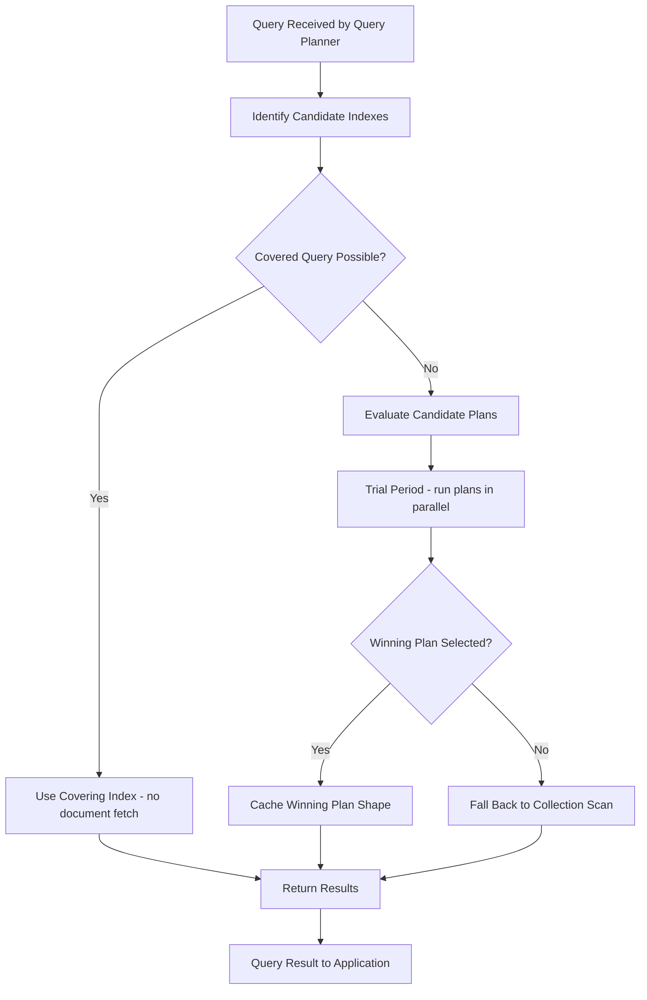

The sequence diagram shows how a write concern of majority is satisfied across a replica set before acknowledging the client:

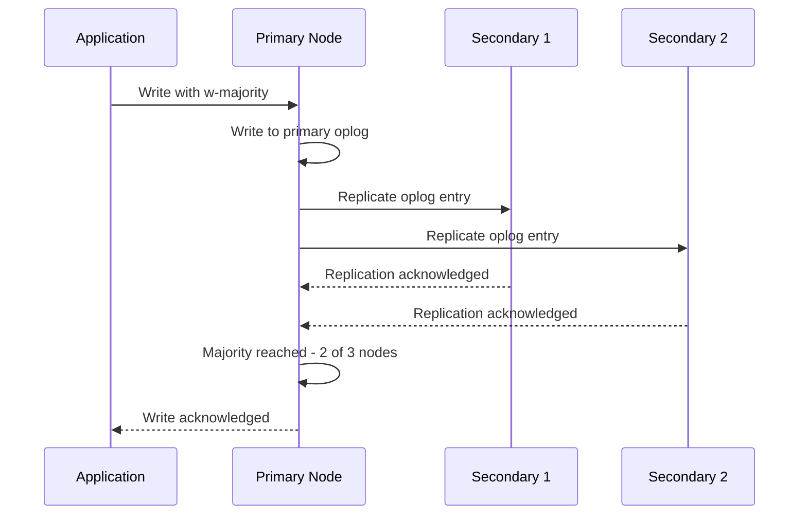

The class diagram models the core MongoDB driver abstractions used when connecting and querying from an application:

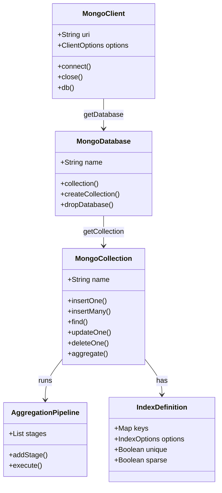

The state diagram captures how a MongoDB change stream cursor moves through its operational states when tailing a collection for real-time events:

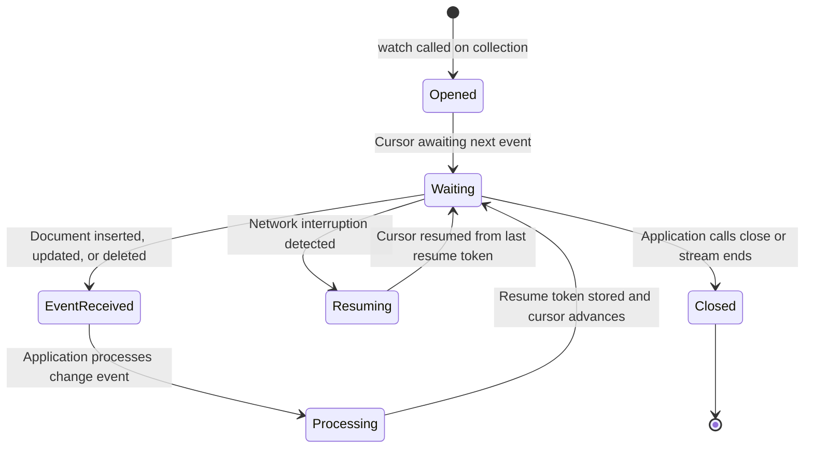

---

## 12. MongoDB Atlas Search

Atlas Search integrates full-text search directly into MongoDB using Apache Lucene under the hood, eliminating the need for a separate Elasticsearch cluster.

### 12.1 Creating an Atlas Search Index

```javascript
// Atlas Search index definition (configured via Atlas UI or Atlas CLI)
{
  "mappings": {
    "dynamic": false,
    "fields": {
      "title": {
        "type": "string",
        "analyzer": "lucene.english"
      },
      "body": {
        "type": "string",
        "analyzer": "lucene.english"
      },
      "tags": {
        "type": "string",
        "analyzer": "lucene.keyword"
      },
      "publishedAt": {
        "type": "date"
      },
      "score": {
        "type": "number"
      }
    }
  }
}
```

### 12.2 Full-Text Search with Scoring and Facets

```javascript
db.articles.aggregate([
  {
    $search: {
      index: "articles_search",
      compound: {
        must: [
          {
            text: {
              query: "machine learning neural networks",
              path: ["title", "body"],
              fuzzy: { maxEdits: 1 },
              score: { boost: { value: 2.0, path: "score" } },
            },
          },
        ],
        filter: [
          {
            range: {
              path: "publishedAt",
              gte: new Date("2024-01-01"),
              lt: new Date("2025-01-01"),
            },
          },
        ],
      },
    },
  },
  {
    $facet: {
      results: [
        { $project: { title: 1, body: 1, score: { $meta: "searchScore" } } },
        { $sort: { score: -1 } },
        { $limit: 10 },
      ],
      totalCount: [{ $count: "count" }],
    },
  },
]);
```

### 12.3 Atlas Search Architecture

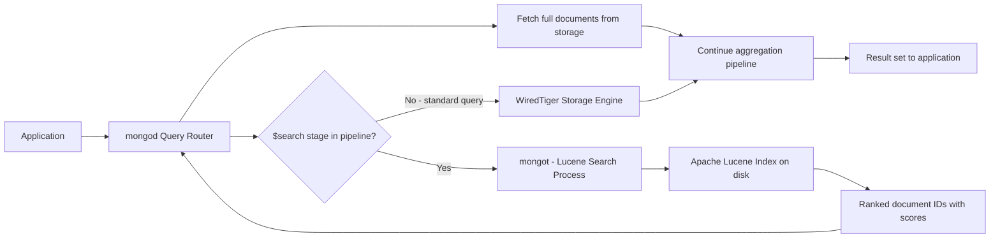

---

## 13. Time Series Collections

MongoDB 5.0 introduced native time series collections optimized for storing and querying measurements, metrics, and events where the primary access pattern involves time ranges.

### 13.1. Creating a Time Series Collection

```javascript
db.createCollection("sensor_readings", {
  timeseries: {
    timeField: "timestamp", // Required: the field containing the time value
    metaField: "metadata", // Optional: grouping identifier (e.g., sensor ID)
    granularity: "seconds", // Hint for the bucket size: "seconds", "minutes", or "hours"
  },
  expireAfterSeconds: 7776000, // Optional: TTL - delete documents after 90 days
});
```

### 13.2. Inserting and Querying Measurements

```javascript
// Insert sensor readings
db.sensor_readings.insertMany([
  {
    timestamp: new Date("2025-01-15T10:00:00Z"),
    metadata: { sensorId: "sensor-42", location: "warehouse-A" },
    temperature: 22.5,
    humidity: 65.2,
  },
  {
    timestamp: new Date("2025-01-15T10:00:30Z"),
    metadata: { sensorId: "sensor-42", location: "warehouse-A" },
    temperature: 22.7,
    humidity: 65.0,
  },
]);

// Downsample: calculate hourly averages using $densify and $setWindowFields
db.sensor_readings.aggregate([
  {
    $match: {
      "metadata.sensorId": "sensor-42",
      timestamp: { $gte: new Date("2025-01-15T00:00:00Z") },
    },
  },
  {
    $group: {
      _id: {
        $dateTrunc: { date: "$timestamp", unit: "hour" },
      },
      avgTemperature: { $avg: "$temperature" },
      avgHumidity: { $avg: "$humidity" },
      readingCount: { $count: {} },
    },
  },
  { $sort: { _id: 1 } },
]);
```

The following diagram shows how MongoDB's time series storage model uses bucket documents and a column-store layout to support efficient time range queries:

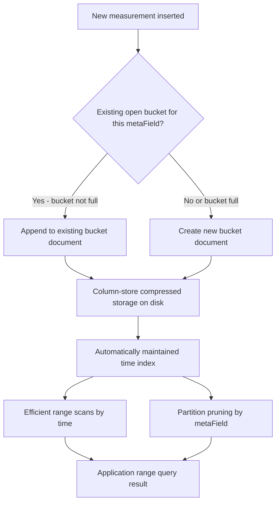

---

## 14. Change Streams

Change streams allow applications to subscribe to real-time notifications about data changes in a collection, database, or entire cluster without polling. They are built on the replication oplog and resume automatically after a network failure.

### 14.1. Watching a Collection

```javascript
const { MongoClient } = require("mongodb");

async function watchOrders() {
  const client = await MongoClient.connect(process.env.MONGODB_URI);
  const db = client.db("ecommerce");
  const collection = db.collection("orders");

  // Only react to inserts and updates; ignore deletes
  const pipeline = [
    {
      $match: {
        operationType: { $in: ["insert", "update", "replace"] },
      },
    },
    {
      $project: {
        _id: 1,
        operationType: 1,
        "fullDocument.orderId": 1,
        "fullDocument.status": 1,
        "fullDocument.total": 1,
        "updateDescription.updatedFields": 1,
      },
    },
  ];

  const changeStream = collection.watch(pipeline, {
    fullDocument: "updateLookup", // Include the post-update document
  });

  // Save the resume token to survive process restarts
  let resumeToken = null;

  changeStream.on("change", async (change) => {
    resumeToken = change._id;
    await saveResumeToken(resumeToken); // persist to Redis or a separate collection

    console.log(
      "Change detected:",
      change.operationType,
      change.fullDocument?.orderId,
    );

    if (change.operationType === "insert") {
      await sendOrderConfirmationEmail(change.fullDocument);
    }
    if (change.updateDescription?.updatedFields?.status === "shipped") {
      await sendShippingNotification(change.fullDocument);
    }
  });

  changeStream.on("error", async (err) => {
    console.error("Change stream error:", err);
    // Resume from last known position after reconnect
    const savedToken = await loadResumeToken();
    if (savedToken) {
      collection.watch(pipeline, {
        resumeAfter: savedToken,
        fullDocument: "updateLookup",
      });
    }
  });
}
```

The following sequence diagram shows the change stream event flow, including oplog tailing, pipeline filtering, resume token persistence, and automatic reconnection:

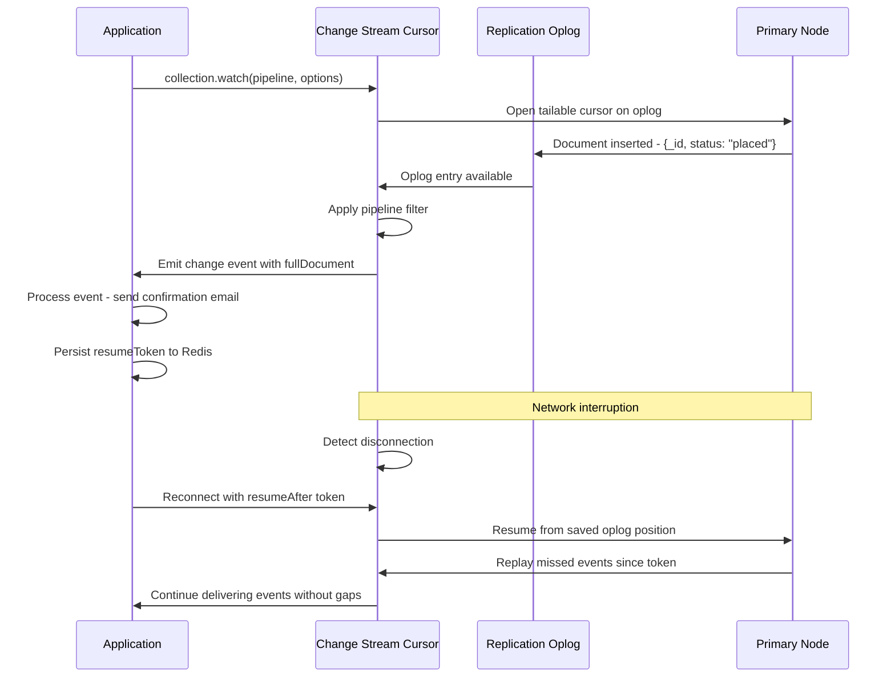

---

## 15. Multi-Document ACID Transactions

Although MongoDB is schema-flexible, many business workflows (e.g., transferring funds, placing orders that deduct inventory) require multi-document atomicity. Transactions in MongoDB work across collections and shards.

### 15.1. Transaction Pattern with the Node.js Driver

```javascript
const { MongoClient } = require("mongodb");

async function placeOrder(userId, cartItems) {
  const client = await MongoClient.connect(process.env.MONGODB_URI);
  const session = client.startSession();

  try {
    await session.withTransaction(
      async () => {
        const db = client.db("ecommerce");
        const orders = db.collection("orders");
        const inventory = db.collection("inventory");
        const users = db.collection("users");

        // 1. Check and deduct inventory for each item
        for (const item of cartItems) {
          const result = await inventory.findOneAndUpdate(
            { sku: item.sku, quantityAvailable: { $gte: item.quantity } },
            { $inc: { quantityAvailable: -item.quantity } },
            { session, returnDocument: "after" },
          );

          if (!result) {
            throw new Error(`Insufficient stock for SKU: ${item.sku}`);
          }
        }

        // 2. Create the order document
        const total = cartItems.reduce(
          (sum, item) => sum + item.price * item.quantity,
          0,
        );
        const order = await orders.insertOne(
          {
            userId,
            items: cartItems,
            total,
            status: "placed",
            createdAt: new Date(),
          },
          { session },
        );

        // 3. Update user's order history
        await users.updateOne(
          { _id: userId },
          {
            $push: { orderHistory: order.insertedId },
            $inc: { totalSpent: total },
          },
          { session },
        );
      },
      {
        readConcern: { level: "snapshot" },
        writeConcern: { w: "majority" },
      },
    );

    console.log("Order placed successfully");
  } catch (err) {
    console.error("Transaction aborted:", err.message);
    throw err;
  } finally {
    await session.endSession();
    await client.close();
  }
}
```

The following state diagram captures the full lifecycle of a MongoDB multi-document transaction, including commit, abort, and automatic rollback on conflict:

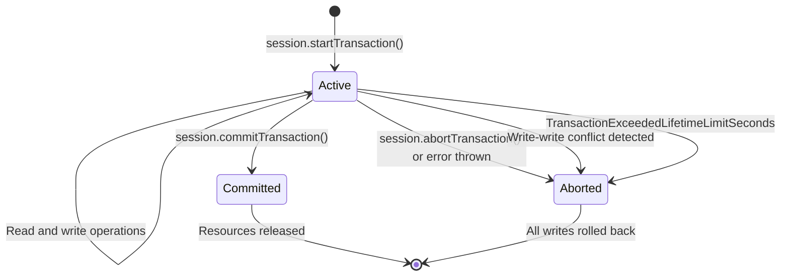

---

## 16. Conclusion

MongoDB represents a paradigm shift in how modern applications manage data. Its document-oriented data model, underpinned by the efficient and feature-rich BSON format, provides unmatched flexibility and performance. Whether you are building a dynamic web application, a real-time analytics platform, or an IoT solution, MongoDB offers the tools and scalability you need to succeed.

By embracing MongoDB’s unique features - its flexible schema, powerful aggregation framework, robust indexing, and comprehensive security - you empower your applications to handle complex, evolving data with ease. As data continues to grow in volume and complexity, MongoDB stands as a leading choice for developers seeking a future-proof, high-performance database solution.

---

## 17. Further Reading and Resources

- **Official Documentation:**
  - [MongoDB Documentation](https://docs.mongodb.com/)
  - [BSON Specification](https://bsonspec.org/)
- **Books:**
  - _MongoDB: The Definitive Guide_ by Kristina Chodorow and Michael Dirolf
  - _MongoDB in Action_ by Kyle Banker
- **Online Courses and Tutorials:**
  - MongoDB University and courses on Udemy, Coursera, and Pluralsight offer deep dives into MongoDB’s features.
- **Communities:**
  - Engage with the MongoDB community through forums, Stack Overflow, and local meetups to share insights and learn best practices.

---

_This comprehensive guide has explored MongoDB and its unique features in depth - from its document-oriented architecture and flexible schema design to the power of BSON and advanced aggregation techniques. Whether you are new to MongoDB or looking to optimize your existing applications, understanding these core concepts will help you build scalable, high-performance systems that can evolve alongside your business needs._
