import MdxLayout from "@/components/MdxLayout";

export const metadata = {
  title:
    "Multi-Agent Swarm Orchestration: Coordinating AI Agents on Shared Codebases",
  description:
    "A technical deep dive into multi-agent swarm orchestration for software development — covering task decomposition into beads, file reservation protocols, agent coordination patterns, conflict resolution, and scaling strategies for running parallel AI agents on real codebases.",
  topics: [
    "Artificial Intelligence",
    "Software Engineering",
    "Agentic AI",
    "System Design",
    "DevOps",
  ],
};

export default function MultiAgentSwarmOrchestrationArticle({ children }) {
  return <MdxLayout>{children}</MdxLayout>;
}

# Multi-Agent Swarm Orchestration: Coordinating AI Agents on Shared Codebases

### Author: Son Nguyen

> Date: 2026-03-25

You have one AI agent that can implement a feature in 45 minutes. You need twelve features shipped by end of week. The math seems obvious: run twelve agents in parallel and finish in 45 minutes instead of nine hours. But you try it, and three agents edit the same file simultaneously, two produce conflicting database migrations, one overwrites another's work, and the merge conflict resolution alone takes longer than doing everything sequentially.

Multi-agent swarm orchestration is the discipline of running multiple AI agents concurrently on a shared codebase without them destroying each other's work. It is the difference between parallelism that scales linearly and parallelism that produces exponential chaos. The key insight from the Agentic Coding Flywheel framework: swarm execution scales linearly with good task decomposition — bad decomposition causes exponential chaos.

This article covers the full stack of swarm orchestration: decomposing work into dependency-aware task units (beads), reserving files to prevent conflicts, coordinating agents through async message passing, resolving the conflicts that slip through, and scaling the swarm from two agents to twenty.

---

## 1. Why Single-Agent Development Hits a Ceiling

A single AI agent, no matter how capable, is bottlenecked by sequential execution. It reads one file at a time, reasons about one problem at a time, and writes one change at a time. For small tasks, this is fine. For large projects, this creates a pipeline stall.

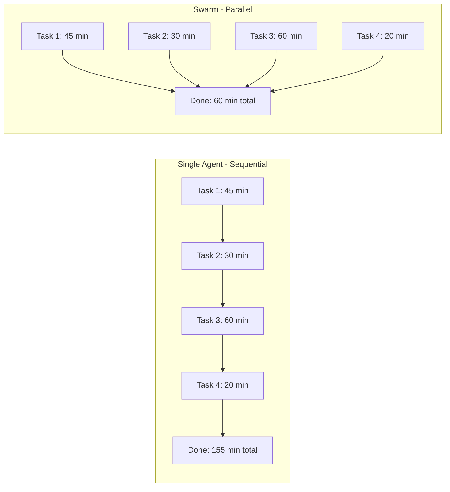

But naive parallelism fails because software tasks are not independent. They share files, share state, and have ordering constraints. A swarm without coordination is worse than a single agent — it is multiple agents actively sabotaging each other.

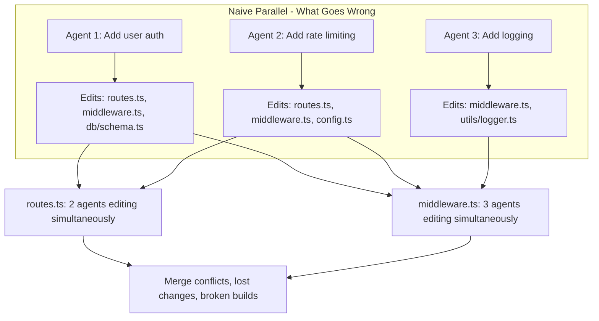

The solution is not "avoid parallelism." It is structured parallelism — decompose work so agents operate on disjoint file sets, coordinate access when overlap is unavoidable, and verify the combined output.

---

## 2. Beads: The Atomic Unit of Swarm Work

A bead is a self-contained, dependency-aware, fully-specified task unit. The term comes from the Agentic Coding Flywheel framework. The critical property: a bead contains enough context that an agent can complete it without referring to any other document. No "see the plan for details." No "check with the other agent." Everything needed is embedded.

### 2.1. Bead Structure

```typescript
interface Bead {
  id: string;
  title: string;
  status: "pending" | "in_progress" | "completed" | "blocked";

  // Context — everything the agent needs
  background: string; // why this task exists
  reasoning: string; // design decisions already made
  specification: string; // what to build, precisely

  // Boundaries
  affectedFiles: string[]; // files this bead will touch
  readOnlyFiles: string[]; // files the agent may read but not edit
  acceptanceCriteria: string[]; // how to verify it is done

  // Dependencies
  blockedBy: string[]; // bead IDs that must complete first
  blocks: string[]; // bead IDs that depend on this one

  // Metadata
  estimatedTokens: number; // rough token budget for implementation
  priority: "critical" | "high" | "medium" | "low";
  assignedAgent?: string;
}
```

### 2.2. Example: Decomposing a Feature Into Beads

Suppose the task is: "Add a favorites feature to the blog. Users can favorite articles, view their favorites, and unfavorite."

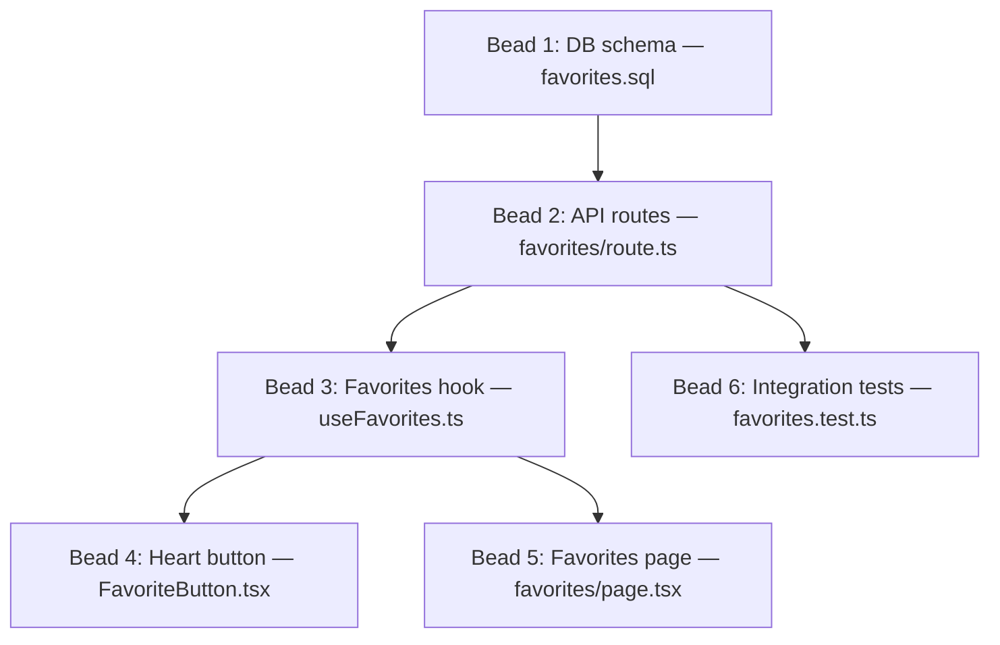

Notice: B4, B5, and B6 can all run in parallel once B3 is done. And B4 and B5 have zero file overlap. That parallelism is only possible because the decomposition was done with file disjointness in mind.

### 2.3. The Bead Quality Test

Before a bead goes to an agent, it must pass four checks:

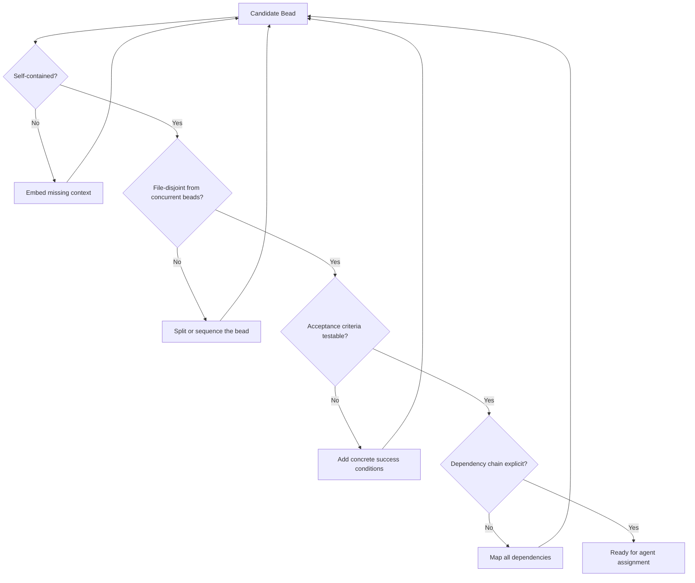

---

## 3. File Reservation: Preventing Write Conflicts

The most common swarm failure is two agents editing the same file. File reservation is the locking mechanism that prevents this.

### 3.1. The Reservation Protocol

```typescript
interface FileReservation {
  filePath: string;
  reservedBy: string; // agent ID
  reservedAt: number; // timestamp
  expiresAt: number; // auto-release after timeout
  beadId: string; // which bead this is for
  mode: "exclusive" | "shared_read";
}

class FileReservationManager {
  private reservations: Map<string, FileReservation> = new Map();

  reserve(
    filePath: string,
    agentId: string,
    beadId: string,
    ttlMs: number = 600_000, // 10 minute default
  ): { success: boolean; holder?: string } {
    const existing = this.reservations.get(filePath);

    // Check for expired reservation
    if (existing && existing.expiresAt < Date.now()) {
      this.reservations.delete(filePath);
    }

    // Check for active reservation by another agent
    const active = this.reservations.get(filePath);
    if (active && active.reservedBy !== agentId) {
      return {
        success: false,
        holder: active.reservedBy,
      };
    }

    // Grant reservation
    this.reservations.set(filePath, {
      filePath,
      reservedBy: agentId,
      reservedAt: Date.now(),
      expiresAt: Date.now() + ttlMs,
      beadId,
      mode: "exclusive",
    });

    return { success: true };
  }

  release(filePath: string, agentId: string): boolean {
    const existing = this.reservations.get(filePath);
    if (existing && existing.reservedBy === agentId) {
      this.reservations.delete(filePath);
      return true;
    }
    return false;
  }

  releaseAll(agentId: string): number {
    let released = 0;
    for (const [path, res] of this.reservations) {
      if (res.reservedBy === agentId) {
        this.reservations.delete(path);
        released++;
      }
    }
    return released;
  }

  getReservations(): FileReservation[] {
    // Clean expired
    const now = Date.now();
    for (const [path, res] of this.reservations) {
      if (res.expiresAt < now) {
        this.reservations.delete(path);
      }
    }
    return Array.from(this.reservations.values());
  }
}
```

### 3.2. Pre-Commit Guard

The reservation system is only as strong as its enforcement. A pre-commit hook verifies that an agent only modifies files it holds reservations for:

```bash
#!/usr/bin/env bash
# .git/hooks/pre-commit — File reservation enforcement

AGENT_ID="${AGENT_ID:-unknown}"
RESERVATION_FILE=".swarm/reservations.json"

if [ ! -f "$RESERVATION_FILE" ]; then
  echo "Warning: No reservation file found. Allowing commit."
  exit 0
fi

# Get list of modified files in this commit
MODIFIED_FILES=$(git diff --cached --name-only)

VIOLATIONS=0
for file in $MODIFIED_FILES; do
  # Check if this agent holds a reservation for this file
  HOLDER=$(jq -r \
    --arg file "$file" \
    --arg agent "$AGENT_ID" \
    '.[] | select(.filePath == $file) | .reservedBy' \
    "$RESERVATION_FILE")

  if [ -z "$HOLDER" ]; then
    echo "VIOLATION: $file is not reserved by any agent"
    VIOLATIONS=$((VIOLATIONS + 1))
  elif [ "$HOLDER" != "$AGENT_ID" ]; then
    echo "VIOLATION: $file is reserved by $HOLDER, not $AGENT_ID"
    VIOLATIONS=$((VIOLATIONS + 1))
  fi
done

if [ $VIOLATIONS -gt 0 ]; then
  echo ""
  echo "Commit blocked: $VIOLATIONS file reservation violation(s)"
  echo "Agent $AGENT_ID attempted to modify files it does not hold."
  exit 1
fi

exit 0
```

### 3.3. Handling Shared Files

Some files must be touched by multiple beads: shared type definitions, configuration files, package manifests. Three strategies:

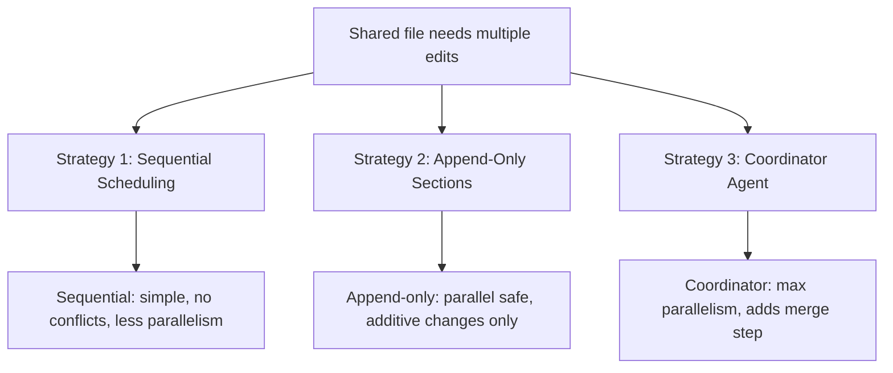

In practice, Strategy 3 (coordinator agent) works best for large swarms. The coordinator is a lightweight agent whose sole job is merging non-conflicting changes from multiple branches:

```typescript
interface MergeTask {
  targetBranch: string;
  sourceBranches: string[];
  conflictResolution:
    | "abort" // fail on any conflict
    | "ours" // prefer target branch
    | "theirs" // prefer source branch
    | "ai_resolve"; // use an LLM to resolve conflicts
}

async function coordinatorMerge(task: MergeTask): Promise<{
  success: boolean;
  conflicts: string[];
  resolvedFiles: string[];
}> {
  const conflicts: string[] = [];
  const resolvedFiles: string[] = [];

  for (const source of task.sourceBranches) {
    try {
      // Attempt merge
      await git.merge(source, {
        into: task.targetBranch,
        noCommit: true,
      });
    } catch (mergeError) {
      if (task.conflictResolution === "abort") {
        await git.mergeAbort();
        return {
          success: false,
          conflicts: [source],
          resolvedFiles,
        };
      }

      if (task.conflictResolution === "ai_resolve") {
        const conflictedFiles = await git.getConflictedFiles();
        for (const file of conflictedFiles) {
          const resolved = await aiResolveConflict(
            file,
            task.targetBranch,
            source,
          );
          if (resolved) {
            resolvedFiles.push(file);
            await git.add(file);
          } else {
            conflicts.push(`${source}:${file}`);
          }
        }
      }
    }

    await git.commit(`Merge ${source} into ${task.targetBranch}`);
  }

  return {
    success: conflicts.length === 0,
    conflicts,
    resolvedFiles,
  };
}
```

---

## 4. Agent Coordination via Message Passing

Agents in a swarm need to communicate without sharing memory. Message passing provides async, decoupled coordination.

### 4.1. The Agent Mail Protocol

```typescript
interface AgentMessage {
  id: string;
  from: string; // agent ID
  to: string | "all"; // recipient agent ID or broadcast
  threadId: string; // group related messages
  type: MessageType;
  payload: unknown;
  timestamp: number;
}

type MessageType =
  | "file_reserved" // notify others a file is locked
  | "file_released" // notify others a file is available
  | "bead_completed" // signal downstream beads can start
  | "bead_blocked" // signal a dependency issue
  | "context_sharing" // share discovered information
  | "help_request" // ask another agent for guidance
  | "conflict_detected" // report a conflict
  | "status_update"; // periodic heartbeat

class AgentMailbox {
  private messages: AgentMessage[] = [];
  private subscribers: Map<string, (msg: AgentMessage) => void> = new Map();

  send(message: Omit<AgentMessage, "id" | "timestamp">): string {
    const msg: AgentMessage = {
      ...message,
      id: crypto.randomUUID(),
      timestamp: Date.now(),
    };
    this.messages.push(msg);

    // Notify subscriber if targeted
    if (message.to !== "all" && this.subscribers.has(message.to)) {
      this.subscribers.get(message.to)!(msg);
    }

    // Broadcast
    if (message.to === "all") {
      for (const [agentId, handler] of this.subscribers) {
        if (agentId !== message.from) {
          handler(msg);
        }
      }
    }

    return msg.id;
  }

  subscribe(agentId: string, handler: (msg: AgentMessage) => void): void {
    this.subscribers.set(agentId, handler);
  }

  getThread(threadId: string): AgentMessage[] {
    return this.messages
      .filter((m) => m.threadId === threadId)
      .sort((a, b) => a.timestamp - b.timestamp);
  }

  getUnread(agentId: string, since: number): AgentMessage[] {
    return this.messages.filter(
      (m) =>
        (m.to === agentId || m.to === "all") &&
        m.from !== agentId &&
        m.timestamp > since,
    );
  }
}
```

### 4.2. Coordination Patterns

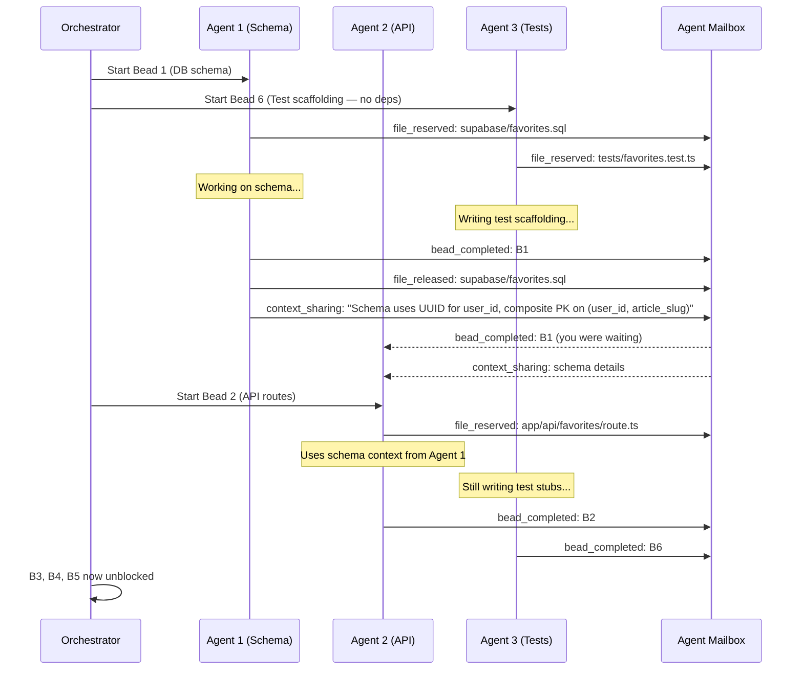

### 4.3. Context Sharing Between Agents

One of the most powerful coordination patterns: when an agent discovers something during implementation, it shares that context with agents working on downstream beads. This prevents downstream agents from having to rediscover the same information.

```typescript
interface ContextShare {
  sourceBeadId: string;
  discoveredFacts: DiscoveredFact[];
}

interface DiscoveredFact {
  category:
    | "schema_detail"
    | "api_contract"
    | "naming_convention"
    | "gotcha"
    | "dependency";
  description: string;
  relevantToBeads: string[]; // which downstream beads need this
  confidence: number; // 0-1, how certain the agent is
}

function shareContext(
  mailbox: AgentMailbox,
  agentId: string,
  share: ContextShare,
): void {
  for (const fact of share.discoveredFacts) {
    for (const targetBead of fact.relevantToBeads) {
      mailbox.send({
        from: agentId,
        to: "all", // broadcast — orchestrator routes to relevant agent
        threadId: `context-${share.sourceBeadId}`,
        type: "context_sharing",
        payload: {
          beadId: share.sourceBeadId,
          targetBead,
          fact: fact.description,
          category: fact.category,
          confidence: fact.confidence,
        },
      });
    }
  }
}

// Example: Agent 1 finishes the DB schema and shares what it learned
shareContext(mailbox, "agent-1", {
  sourceBeadId: "B1",
  discoveredFacts: [
    {
      category: "schema_detail",
      description:
        "favorites table uses composite PK (user_id UUID, article_slug TEXT). No auto-increment ID. Foreign key to auth.users(id) with CASCADE delete.",
      relevantToBeads: ["B2", "B3", "B6"],
      confidence: 1.0,
    },
    {
      category: "gotcha",
      description:
        "Supabase RLS policy requires auth.uid() = user_id for all operations. API routes must pass the user JWT — anonymous access will silently return empty results, not an error.",
      relevantToBeads: ["B2", "B6"],
      confidence: 1.0,
    },
    {
      category: "naming_convention",
      description:
        "Existing tables use snake_case columns (created_at, updated_at). The favorites table follows this convention.",
      relevantToBeads: ["B2", "B3"],
      confidence: 0.95,
    },
  ],
});
```

---

## 5. The Swarm Orchestrator

The orchestrator is the conductor of the swarm. It does not implement anything — it assigns beads to agents, monitors progress, handles failures, and coordinates the dependency graph.

### 5.1. Orchestrator Architecture

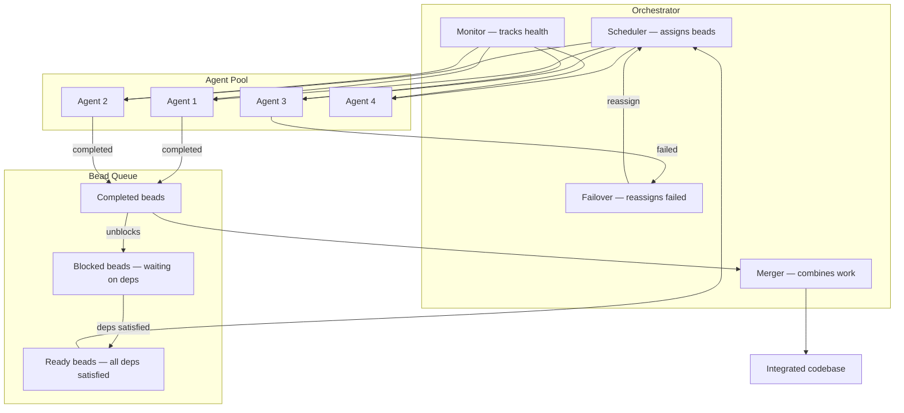

### 5.2. Scheduling Algorithm

The scheduler picks which bead to assign next based on three factors: dependency readiness, critical path length, and agent availability.

```python
from dataclasses import dataclass, field


@dataclass
class BeadNode:
    id: str
    title: str
    status: str  # pending, in_progress, completed, failed
    affected_files: list[str]
    blocked_by: list[str]
    blocks: list[str]
    priority: str
    estimated_tokens: int
    assigned_agent: str | None = None
    critical_path_length: int = 0


class SwarmScheduler:
    def __init__(self, beads: list[BeadNode]):
        self.beads = {b.id: b for b in beads}
        self._compute_critical_paths()

    def _compute_critical_paths(self) -> None:
        """Compute the longest path from each bead to a terminal node.
        Beads on the critical path should be prioritized.
        """
        memo: dict[str, int] = {}

        def dfs(bead_id: str) -> int:
            if bead_id in memo:
                return memo[bead_id]
            bead = self.beads[bead_id]
            if not bead.blocks:
                memo[bead_id] = 1
                return 1
            max_downstream = max(
                dfs(child) for child in bead.blocks
            )
            memo[bead_id] = 1 + max_downstream
            return memo[bead_id]

        for bead_id in self.beads:
            self.beads[bead_id].critical_path_length = dfs(bead_id)

    def get_ready_beads(self) -> list[BeadNode]:
        """Return beads whose dependencies are all completed."""
        ready = []
        for bead in self.beads.values():
            if bead.status != "pending":
                continue
            deps_met = all(
                self.beads[dep].status == "completed"
                for dep in bead.blocked_by
            )
            if deps_met:
                ready.append(bead)

        # Sort by: critical path (longest first), then priority
        priority_order = {
            "critical": 0,
            "high": 1,
            "medium": 2,
            "low": 3,
        }
        ready.sort(
            key=lambda b: (
                -b.critical_path_length,
                priority_order.get(b.priority, 99),
            )
        )
        return ready

    def assign(
        self, bead_id: str, agent_id: str
    ) -> None:
        self.beads[bead_id].status = "in_progress"
        self.beads[bead_id].assigned_agent = agent_id

    def complete(self, bead_id: str) -> list[str]:
        """Mark bead as completed. Returns IDs of newly unblocked beads."""
        self.beads[bead_id].status = "completed"
        newly_ready = []
        for downstream_id in self.beads[bead_id].blocks:
            downstream = self.beads[downstream_id]
            if downstream.status == "pending":
                all_deps_done = all(
                    self.beads[dep].status == "completed"
                    for dep in downstream.blocked_by
                )
                if all_deps_done:
                    newly_ready.append(downstream_id)
        return newly_ready

    def fail(self, bead_id: str) -> list[str]:
        """Mark bead as failed. Returns IDs of beads that are now blocked."""
        self.beads[bead_id].status = "failed"
        self.beads[bead_id].assigned_agent = None
        blocked = []
        for downstream_id in self.beads[bead_id].blocks:
            blocked.append(downstream_id)
        return blocked
```

### 5.3. Failure Recovery

When an agent fails mid-bead, the orchestrator must recover without losing completed work:

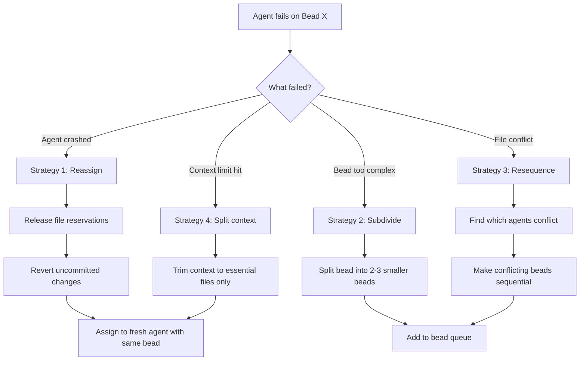

---

## 6. Git Branching Strategy for Swarms

Each agent works on its own branch. The orchestrator merges them according to the dependency graph.

### 6.1. Branch-Per-Bead Pattern

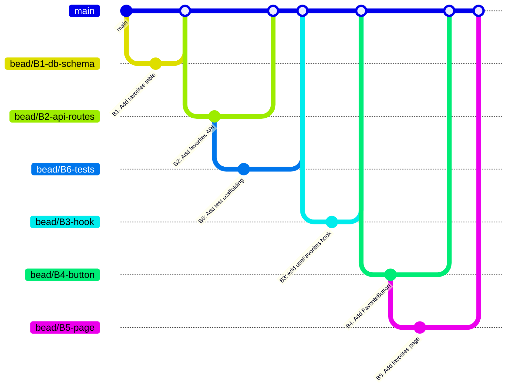

Each bead gets its own branch. The branch is created from the latest main (which includes all completed dependencies). This guarantees each agent starts with a consistent snapshot that includes the work it depends on.

### 6.2. Worktree Isolation

Git worktrees let each agent operate in its own directory without interfering with others:

```bash
#!/usr/bin/env bash
# swarm-setup.sh — Create isolated worktrees for parallel agents

REPO_ROOT=$(git rev-parse --show-toplevel)
SWARM_DIR="$REPO_ROOT/.swarm/worktrees"

setup_agent_worktree() {
  local agent_id=$1
  local bead_id=$2
  local branch_name="bead/${bead_id}"
  local worktree_path="${SWARM_DIR}/${agent_id}"

  # Create branch from current main
  git branch "$branch_name" main 2>/dev/null

  # Create worktree
  git worktree add "$worktree_path" "$branch_name"

  echo "Agent $agent_id working in $worktree_path on branch $branch_name"
}

teardown_agent_worktree() {
  local agent_id=$1
  local worktree_path="${SWARM_DIR}/${agent_id}"

  git worktree remove "$worktree_path" --force
  echo "Cleaned up worktree for $agent_id"
}

# Example: Set up 3 agents working on independent beads
setup_agent_worktree "agent-1" "B4-button"
setup_agent_worktree "agent-2" "B5-page"
setup_agent_worktree "agent-3" "B6-tests"
```

---

## 7. The Planning-to-Implementation Ratio

The Agentic Coding Flywheel framework asserts an 85/15 split: 85% of effort goes to planning and bead creation, 15% to actual agent implementation. This sounds extreme until you do the token math.

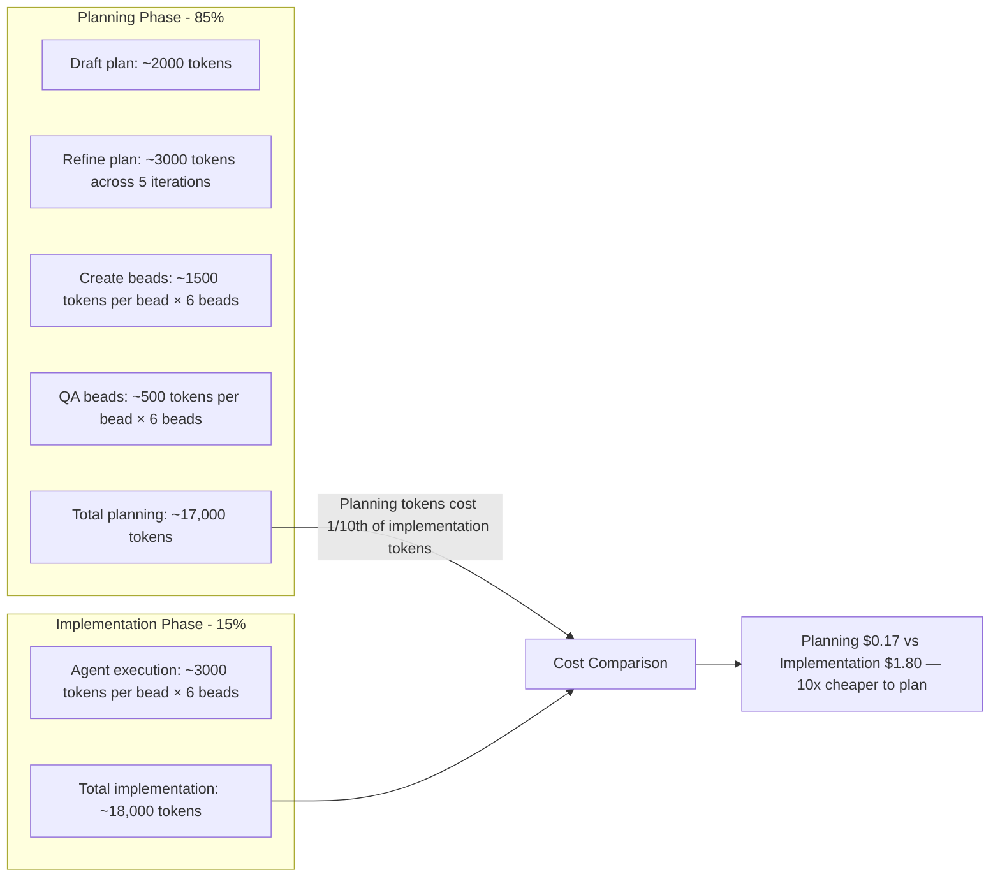

Planning tokens use input pricing (cheap). Implementation tokens use output pricing (expensive) plus tool calls (expensive). A detailed plan that prevents one bad implementation pass saves 10-50x its cost.

More importantly: a bug caught in the planning phase costs zero implementation tokens to fix. A bug caught during implementation costs one re-run. A bug caught after merge costs N re-runs plus debugging.

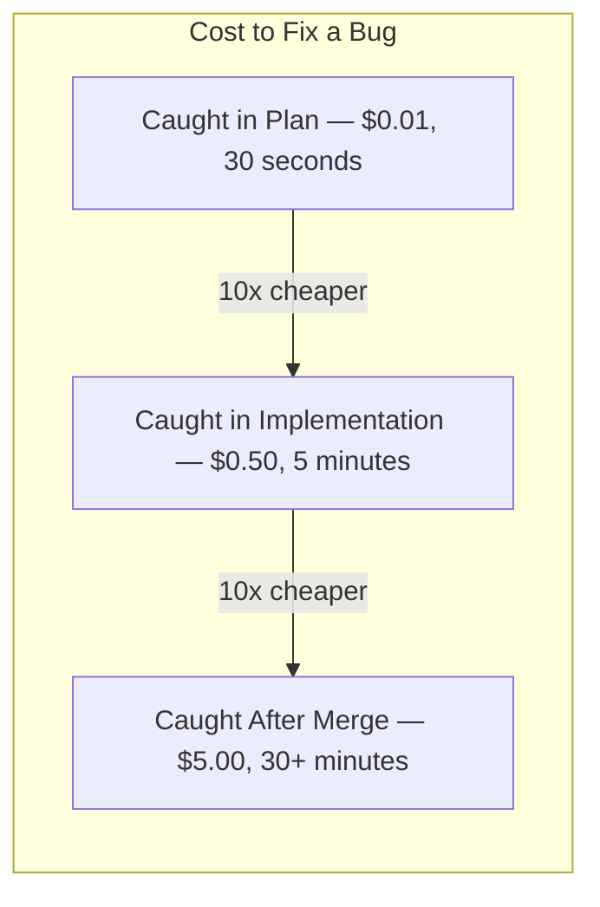

---

## 8. Scaling the Swarm: From 2 Agents to 20

Scaling a swarm is not linear. Each additional agent adds coordination overhead. The key is knowing when to add agents and when more agents make things worse.

### 8.1. The Coordination Tax

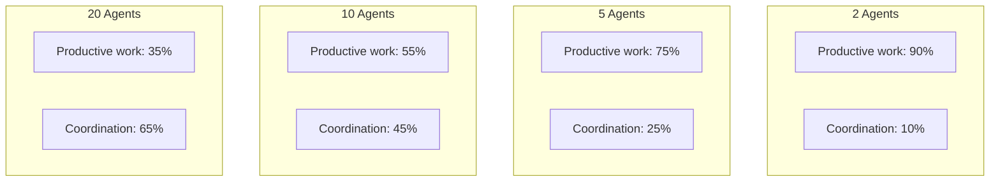

The coordination tax grows roughly with O(n log n) where n is the number of agents. At 20 agents, you spend more time coordinating than implementing. The sweet spot for most codebases is 3-8 agents.

### 8.2. When to Add More Agents

```typescript
interface SwarmScalingDecision {
  currentAgents: number;
  readyBeads: number;
  avgBeadDuration: number; // minutes
  fileConflictRate: number; // 0-1
  coordinationOverhead: number; // 0-1
}

function shouldScaleUp(metrics: SwarmScalingDecision): {
  recommendation: "add" | "maintain" | "reduce";
  reason: string;
} {
  // If more ready beads than agents and low conflict rate
  if (
    metrics.readyBeads > metrics.currentAgents * 1.5 &&
    metrics.fileConflictRate < 0.1 &&
    metrics.coordinationOverhead < 0.3
  ) {
    return {
      recommendation: "add",
      reason: `${metrics.readyBeads} ready beads but only ${metrics.currentAgents} agents. Conflict rate is low (${(metrics.fileConflictRate * 100).toFixed(0)}%). Adding agents will reduce wall-clock time.`,
    };
  }

  // If conflict rate is high, adding agents makes it worse
  if (metrics.fileConflictRate > 0.2) {
    return {
      recommendation: "reduce",
      reason: `File conflict rate is ${(metrics.fileConflictRate * 100).toFixed(0)}%. Adding agents will increase conflicts. Reduce to ${Math.max(2, metrics.currentAgents - 2)} and improve bead decomposition.`,
    };
  }

  // If coordination overhead is high
  if (metrics.coordinationOverhead > 0.4) {
    return {
      recommendation: "reduce",
      reason: `Coordination overhead is ${(metrics.coordinationOverhead * 100).toFixed(0)}% of total time. Agents spend more time coordinating than implementing. Reduce count.`,
    };
  }

  return {
    recommendation: "maintain",
    reason: "Current agent count is balanced for workload.",
  };
}
```

---

## 9. Integration Verification: The Final Gate

After all beads complete and the coordinator merges them, the integrated codebase must be verified. Individual bead acceptance criteria passing does not guarantee the combined system works.

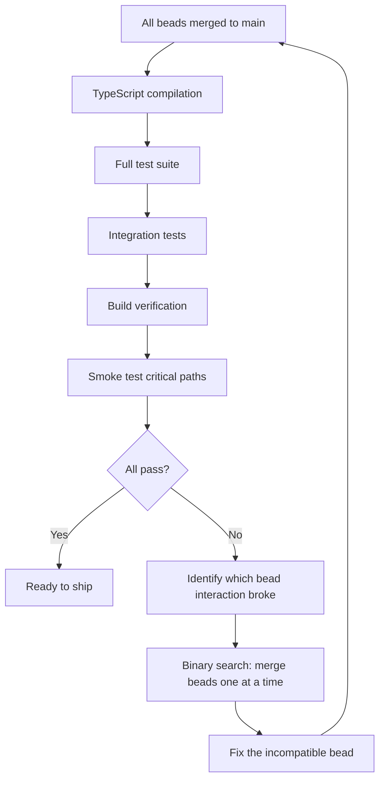

```bash
#!/usr/bin/env bash
# verify-integration.sh — Post-merge integration check

set -euo pipefail

echo "=== Step 1: TypeScript Compilation ==="
npx tsc --noEmit --pretty false
echo "TypeScript: PASS"

echo "=== Step 2: Test Suite ==="
env JEST_USE_WATCHMAN=0 npm test -- --runInBand --watchman=false
echo "Tests: PASS"

echo "=== Step 3: Build Verification ==="
npm run build
echo "Build: PASS"

echo "=== Step 4: Smoke Tests ==="
# Start dev server, hit critical endpoints, verify responses
npm run dev &
DEV_PID=$!
sleep 5

# Test critical paths
HTTP_CODE=$(curl -s -o /dev/null -w "%{http_code}" http://localhost:3000/)
if [ "$HTTP_CODE" != "200" ]; then
  echo "Smoke test FAILED: / returned $HTTP_CODE"
  kill $DEV_PID
  exit 1
fi

echo "Smoke tests: PASS"
kill $DEV_PID

echo "=== All Integration Checks Passed ==="
```

---

## 10. Anti-Patterns in Swarm Orchestration

### 10.1. The Vague Bead

A bead that says "implement the backend" is not a bead — it is a project. Vague beads cause agents to make unconstrained decisions that conflict with other agents' assumptions.

**Fix**: Every bead must list specific files, specific acceptance criteria, and specific constraints. If a bead touches more than 5 files, it is probably too large.

### 10.2. The Hidden Dependency

Two beads appear independent, but one assumes a type definition that the other creates. The dependency is not in the file list — it is in the conceptual model.

**Fix**: During bead QA, explicitly ask: "Does this bead assume anything that another bead creates?" If yes, add a `blockedBy` relationship. Hidden deps are the number one cause of swarm failures.

### 10.3. The Chatty Swarm

Agents sending constant status updates to all other agents. Each message adds context to every agent's window, reducing the space available for actual work.

**Fix**: Messages should be targeted (specific recipient, not broadcast) and substantive (schema details, not "I'm working on it"). The orchestrator handles status tracking — agents should not.

### 10.4. Over-Parallelism

Running 15 agents when the dependency graph only supports 3 concurrent beads. Most agents sit idle waiting for dependencies, but they still consume resources and add coordination noise.

**Fix**: Before spawning agents, compute the maximum width of the dependency DAG. That is the ceiling on useful parallelism.

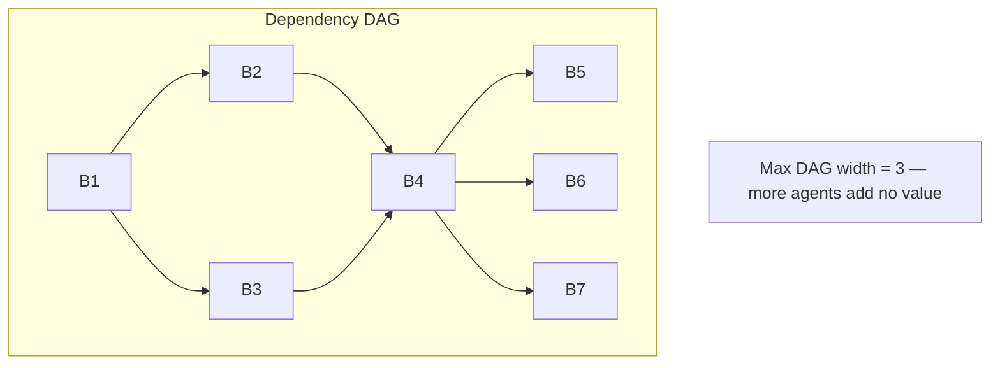

---

## 11. A Complete Swarm Execution Walkthrough

Putting it all together. Here is a step-by-step trace of a swarm building the favorites feature from Section 2.

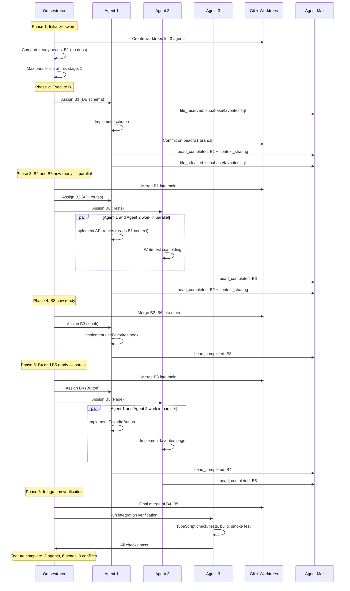

Total wall-clock time with 3 agents: time of critical path (B1 → B2 → B3 → B4) plus merge overhead. Without parallelism it would be B1 + B2 + B3 + B4 + B5 + B6. The swarm saved the time of B5, B6, and the parallel phase of B4/B5.

---

## 12. Swarm Orchestration as Infrastructure

Swarm orchestration is not a one-time setup. It is infrastructure that compounds. Each swarm execution reveals:

- Which bead boundaries work well (save them as templates)
- Which file sets commonly conflict (adjust decomposition patterns)
- Which agent configurations perform best (cache as agent profiles)
- Which coordination patterns reduce overhead (encode as protocols)

This is where swarm orchestration connects back to the compound engineering loop. The swarm itself is a system that learns.

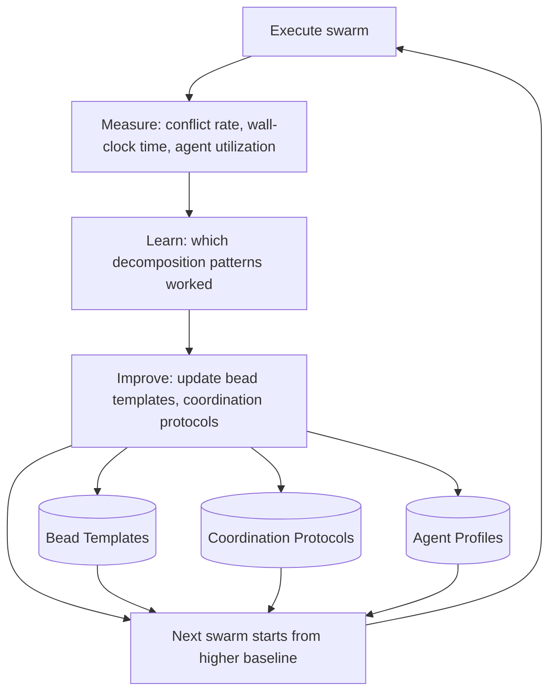

---

## Key Takeaways

- Naive agent parallelism produces chaos. Structured parallelism with proper decomposition scales linearly.
- Beads are the atomic unit: self-contained, dependency-aware, file-disjoint task units that agents can complete without external references.
- File reservation prevents the most common swarm failure — two agents editing the same file.
- Agent coordination uses async message passing, not shared memory. Messages should be targeted and substantive.
- The orchestrator schedules by critical path, monitors health, and handles failover — it never implements.
- Git worktrees give each agent an isolated directory. Branch-per-bead keeps changes clean and mergeable.
- The 85/15 planning-to-implementation ratio is justified by token economics: planning tokens are 10x cheaper than implementation tokens.
- The sweet spot for most codebases is 3-8 concurrent agents. Beyond that, coordination tax exceeds productivity gains.
- Integration verification after merge is non-negotiable — individual bead tests passing does not guarantee system correctness.
- Treat the swarm itself as a system that compounds: each execution improves decomposition patterns, coordination protocols, and agent profiles.
