import MdxLayout from "@/components/MdxLayout";

export const metadata = {
  title: "Next.js - The Future of Web Frameworks",
  description:
    "Explore Next.js in depth - from its innovative features to advanced use cases - and discover why this framework powers this entire website and countless modern web applications.",
  topics: [
    "Web Frameworks",
    "Web Development",
    "Web Architecture",
    "Performance",
  ],
};

export default function WebFrameworksContent({ children }) {
  return <MdxLayout>{children}</MdxLayout>;
}

# Next.js - The Future of Web Frameworks

### Author: Son Nguyen

> Date: 2024-02-09

Next.js has rapidly emerged as a game-changing framework in the world of web development. By combining server-side rendering (SSR), static site generation (SSG), API routes, and client-side rendering (CSR) capabilities, Next.js offers a powerful and flexible environment for building high-performance, scalable web applications. This article provides an in-depth exploration of Next.js - its core features, advanced techniques, best practices, and real-world examples - and explains why it has become the backbone for modern web projects, including this very website.

---

## 1. Introduction to Next.js

Next.js is a React framework that streamlines the process of building web applications. It brings together the power of React with a robust set of features out of the box, allowing developers to focus on building features rather than configuring infrastructure.

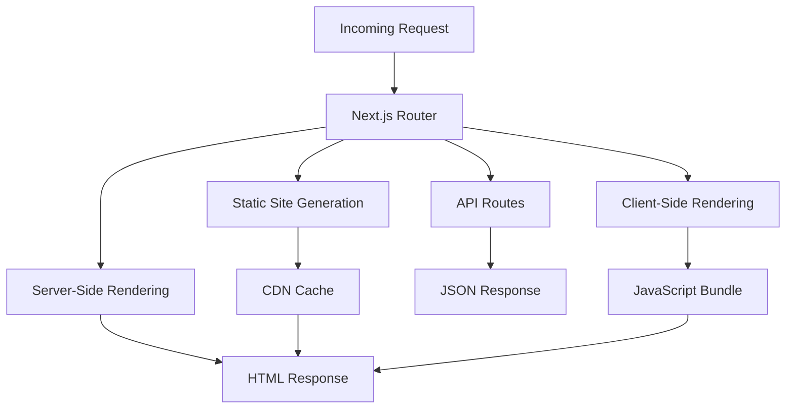

### 1.1. Key Advantages:

- **Ease of Use:**
  With file-based routing, automatic code splitting, and built-in CSS/Sass support, Next.js minimizes boilerplate and accelerates development.
- **Flexible Rendering:**
  Whether you need SSR, SSG, or CSR, Next.js gives you the freedom to choose the best rendering strategy for your content.
- **Developer Experience:**
  Features like hot reloading, comprehensive error reporting, and a rich ecosystem of plugins make the development process smooth and enjoyable.
- **Scalability:**
  Designed to grow with your application, Next.js seamlessly supports projects from personal blogs to enterprise-level platforms.

---

## 2. Core Features of Next.js

Next.js offers a suite of powerful features that simplify modern web development:

### 1. File-Based Routing

Next.js uses a filesystem-based routing mechanism. Every file in the `pages` directory automatically becomes a route. This intuitive approach eliminates the need for additional routing configurations.

**Example:**

```
pages/
index.js      // => Homepage (/)
about.js      // => About page (/about)
blog/
[slug].js   // => Dynamic route for blog posts (/blog/:slug)
```

### 2. Rendering Strategies: SSR, SSG, and CSR

#### Server-Side Rendering (SSR)

With SSR, pages are rendered on the server at request time. This ensures that users receive fully rendered HTML, which is beneficial for SEO and initial load performance.

```js
// pages/dashboard.js
export async function getServerSideProps(context) {
  const data = { user: "Alice", stats: [10, 20, 30] };
  return { props: { data } };
}

export default function Dashboard({ data }) {
  return (
    <div>
      <h1>Dashboard for {data.user}</h1>
      <ul>
        {data.stats.map((stat, idx) => (
          <li key={idx}>
            Stat {idx + 1}: {stat}
          </li>
        ))}
      </ul>
    </div>
  );
}
```

#### Static Site Generation (SSG)

SSG generates HTML at build time, making pages fast and secure. It is ideal for content that does not change frequently.

```js
// pages/index.js
export async function getStaticProps() {
  const data = {
    title: "Welcome to Next.js",
    content: "Static content that loads instantly.",
  };
  return { props: { data } };
}

export default function HomePage({ data }) {
  return (
    <div>
      <h1>{data.title}</h1>
      <p>{data.content}</p>
    </div>
  );
}
```

#### Client-Side Rendering (CSR)

CSR defers rendering to the client, which is useful for highly interactive pages where dynamic data is fetched after the initial page load.

### 3. API Routes

Next.js allows you to create backend endpoints directly within your project, eliminating the need for a separate server for handling API requests.

```js
// pages/api/greet.js
export default function handler(req, res) {
  res.status(200).json({ message: "Hello from Next.js API!" });
}
```

### 4. Built-In CSS and Sass Support

Next.js supports global styles as well as component-level CSS and Sass modules. This built-in support reduces configuration overhead and helps maintain consistent styling across the application.

### 5. Image Optimization

The Next.js `Image` component automatically optimizes images, supporting lazy loading, responsive sizing, and modern formats, all of which contribute to faster page loads and improved performance.

---

## 3. Advanced Capabilities

Next.js provides advanced features that further extend its power and flexibility.

### 1. Incremental Static Regeneration (ISR)

ISR enables you to update static pages after the site has been built. By specifying a revalidation period, Next.js will regenerate the page in the background while serving the static version until the new one is ready.

```js
export async function getStaticProps() {
  const data = {
    title: "Next.js ISR",
    content: "This page updates every 60 seconds.",
  };
  return { props: { data }, revalidate: 60 };
}
```

### 2. Middleware

Middleware in Next.js runs before a request is completed, allowing you to implement authentication, logging, and custom request handling globally.

The following diagram shows the middleware execution chain for an incoming request in the App Router:

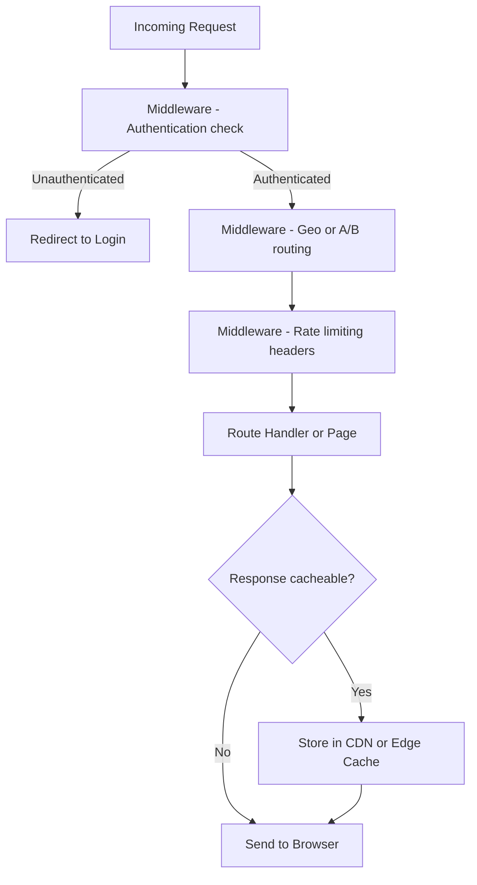

### 3. API Routes for Serverless Functions

By combining API routes with serverless deployment platforms, you can build highly scalable, lightweight backends that integrate seamlessly with your frontend.

The following diagram shows the ISR revalidation flow when a cached page becomes stale:

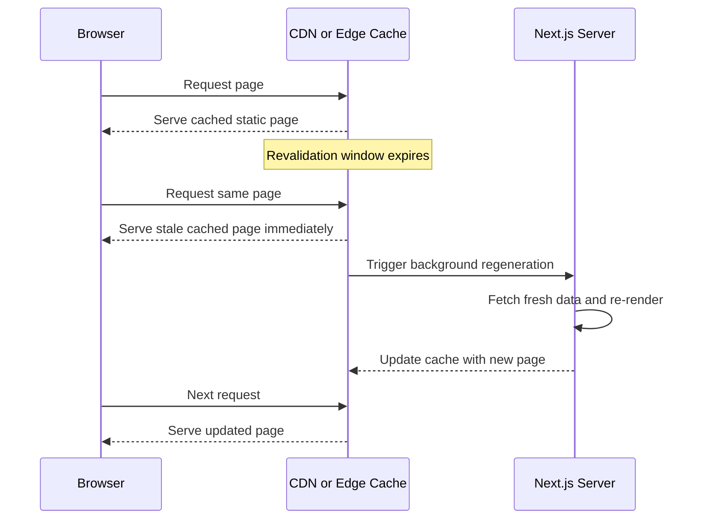

### 4. Built-In Performance Optimizations

- **Automatic Code Splitting:**
  Only load the JavaScript required for the current page.
- **Bundling and Minification:**
  Next.js automatically optimizes your code for production.
- **Caching Strategies:**
  Utilize caching at multiple levels, including SSG, ISR, and API caching, to deliver a faster user experience.

---

## 4. Real-World Use Cases

The following diagram shows how data fetching strategies compare across SSR, SSG, ISR, and CSR in Next.js:

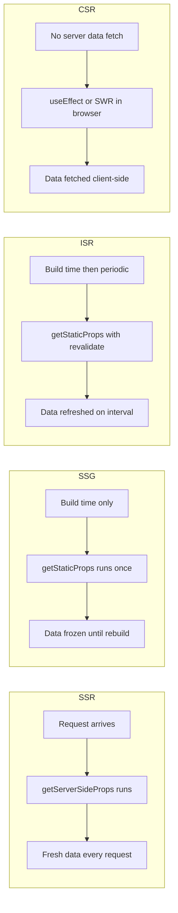

Next.js is versatile and used in a variety of applications:

### 1. E-commerce Platforms

Dynamic product pages benefit from SSR for real-time inventory updates and SSG for static catalog pages, ensuring a fast and SEO-friendly user experience.

### 2. Content-Rich Blogs and News Sites

Static Site Generation and ISR allow for rapid page loads and frequent content updates without sacrificing performance or SEO.

### 3. Enterprise Dashboards

Next.js can power complex dashboards that require real-time data (SSR) while providing the speed and responsiveness of static content (SSG).

### 4. Developer Portfolios and Marketing Sites

By leveraging its simplicity and performance optimizations, Next.js is ideal for building visually appealing, high-performance sites that showcase personal or corporate branding.

---

## 5. Best Practices for Building with Next.js

The following diagram shows the file-based routing resolution from directory structure to URL path:

```mermaid
graph TD
    FS[pages/ or app/ directory] --> R1[index.js maps to slash]
    FS --> R2[about.js maps to slash about]
    FS --> R3[blog/ folder]
    R3 --> R4[blog/index.js maps to slash blog]
    R3 --> R5[blog/[slug].js maps to slash blog slash any-slug]
    FS --> R6[api/ folder]
    R6 --> R7[api/users.js maps to slash api slash users]
    R5 --> R8[getStaticPaths fetches all slugs at build time]
    R8 --> R9[Static HTML generated per slug]
```

### 1. Organize Your Project Structure

- Use the `pages` directory for routing and the `components` directory for reusable UI components.
- Separate concerns by using dedicated folders for utilities, hooks, and styles.

### 2. Optimize Performance

The following diagram shows the image optimization pipeline in Next.js:

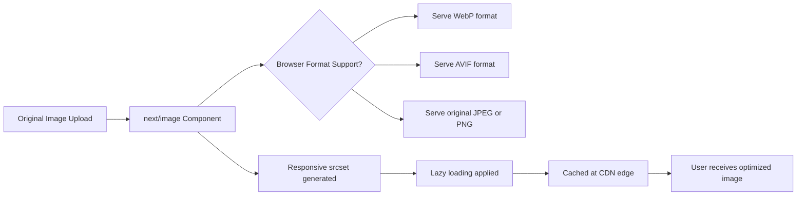

- **Leverage SSR/SSG Appropriately:**
  Choose the rendering strategy based on the nature of your content.
- **Optimize Images:**
  Use the Next.js `Image` component to reduce load times.
- **Implement ISR:**
  Keep your static content fresh without needing a full rebuild.

### 3. Enhance Developer Experience

- **Hot Reloading:**
  Take advantage of Next.js’s fast refresh feature to see changes instantly.
- **Error Reporting:**
  Utilize built-in error overlays to quickly diagnose issues during development.

### 4. Secure Your Application

The following diagram shows the API route authentication and rate limiting flow:

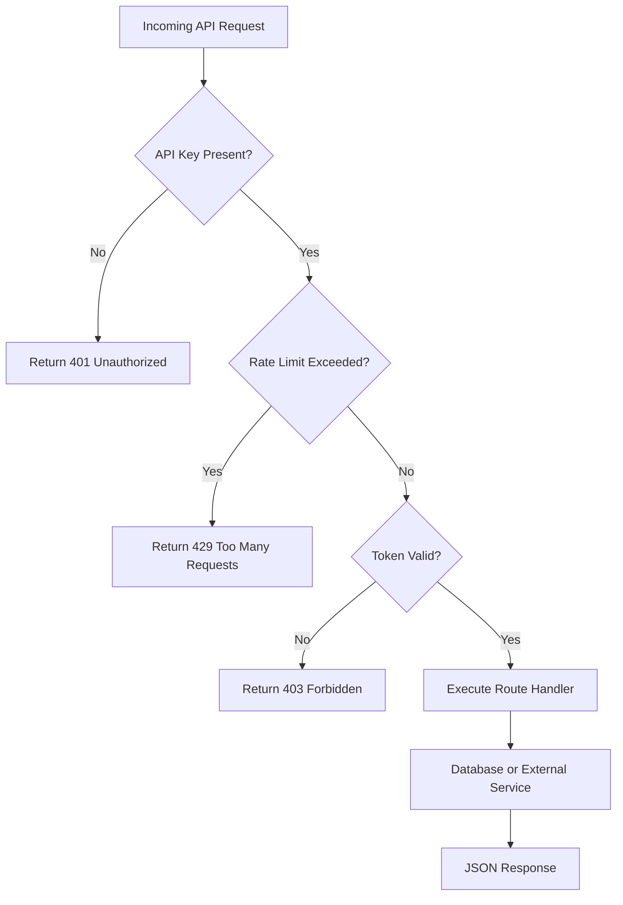

- **API Route Security:**
  Implement authentication and rate limiting on sensitive API endpoints.
- **Environment Variables:**
  Use Next.js’s built-in support for environment variables to manage configuration securely.

### 5. Continuous Deployment

- Automate your build and deployment process with CI/CD pipelines to ensure that updates are reliably and quickly delivered to production.

---

## 6. Integrating Next.js with Other Technologies

The App Router request lifecycle in Next.js 13+ shows how a request travels through the framework layers:

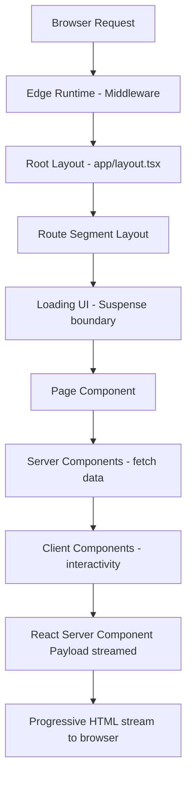

Next.js works well with a wide range of tools and services:

- **Headless CMS:**
  Integrate with Contentful, Sanity, or Strapi for dynamic content management.
- **GraphQL:**
  Use Apollo Client or Relay for efficient data fetching in Next.js applications.
- **Authentication:**
  Implement solutions like Auth0 or NextAuth.js to manage user authentication seamlessly.
- **State Management:**
  Combine with libraries like Redux, Zustand, or the React Context API to manage application state effectively.

---

## 7. Real-World Examples and Case Studies

### 7.1. Example: A Personal Blog

Many developers choose Next.js for their blogs due to its simplicity and performance. Using SSG ensures that the blog loads quickly, while ISR enables content updates without a complete rebuild.

### 7.2. Example: Corporate Websites

Next.js powers numerous corporate websites by combining static generation for marketing pages with SSR for dynamic sections like product listings or client dashboards.

### 7.3. Example: SaaS Applications

For Software-as-a-Service platforms, Next.js provides a robust foundation with SSR for real-time data, API routes for backend integration, and a seamless developer experience that accelerates feature development.

The diagram below maps how a Next.js application connects to the surrounding ecosystem of content, data, auth, and deployment targets:

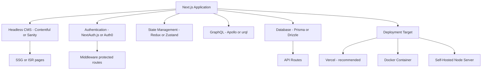

---

## 8. App Router Deep Dive: Parallel Routes and Server Actions

Next.js 13+ introduced the App Router, which fundamentally changed how routing and data fetching work. Two of its most powerful features are parallel routes and Server Actions.

### 8.1. Parallel Routes

Parallel routes let you render multiple pages simultaneously within the same layout. They are defined using the `@folder` convention and are perfect for dashboards that need independent panels.

```
app/
  dashboard/
    layout.tsx            // root dashboard layout
    @analytics/
      page.tsx            // analytics panel
    @team/
      page.tsx            // team panel
    page.tsx              // default slot
```

```tsx
// app/dashboard/layout.tsx
export default function DashboardLayout({
  children,
  analytics,
  team,
}: {
  children: React.ReactNode;
  analytics: React.ReactNode;
  team: React.ReactNode;
}) {
  return (
    <div className="dashboard-grid">
      <main>{children}</main>
      <aside>{analytics}</aside>
      <section>{team}</section>
    </div>
  );
}
```

Each slot loads independently. If `@analytics` is slow, `@team` is still rendered immediately, giving users a progressive experience.

### 8.2. Server Actions

Server Actions are async functions that run on the server and can be called directly from client components. They eliminate entire API route files for form submissions and mutations.

```tsx
// app/posts/new/page.tsx
import { redirect } from "next/navigation";
import { db } from "@/lib/db";

async function createPost(formData: FormData) {
  "use server"; // marks this function as a Server Action

  const title = formData.get("title") as string;
  const body = formData.get("body") as string;

  if (!title || !body) {
    throw new Error("Title and body are required");
  }

  const post = await db.post.create({ data: { title, body } });
  redirect(`/posts/${post.id}`);
}

export default function NewPostPage() {
  return (
    <form action={createPost}>
      <input name="title" placeholder="Post title" required />
      <textarea name="body" placeholder="Post body" required />
      <button type="submit">Publish</button>
    </form>
  );
}
```

The `"use server"` directive serializes the function call over the network. The form works even without JavaScript enabled, because it degrades to a native HTML form POST.

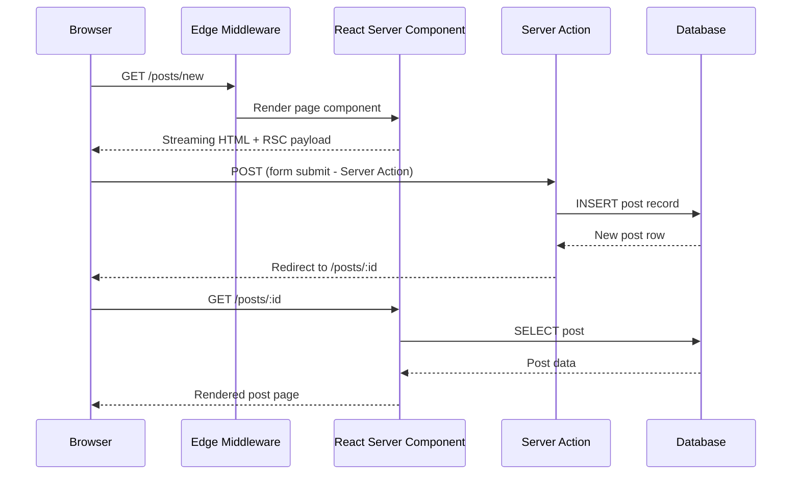

### 8.3. App Router Caching Layers

The App Router has four distinct caching layers that work together. Understanding which cache each request hits is critical for performance tuning.

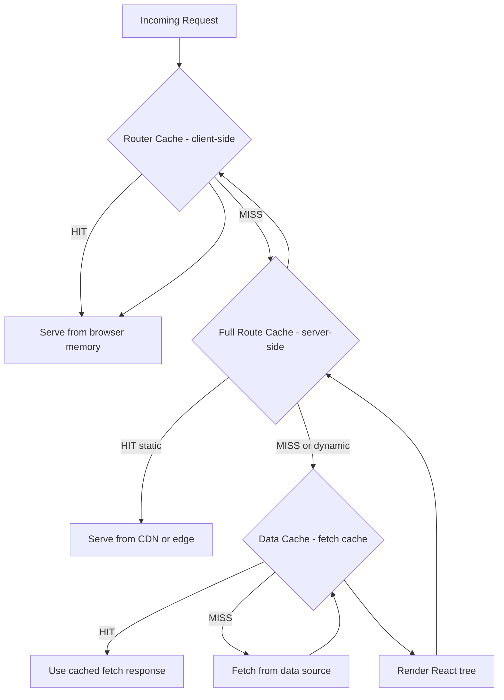

| Cache Layer         | Where                | Duration                   | Invalidation                                |
| ------------------- | -------------------- | -------------------------- | ------------------------------------------- |
| Router Cache        | Client (browser)     | Session                    | `router.refresh()`                          |
| Full Route Cache    | Server               | Build time or revalidation | `revalidatePath()` / `revalidateTag()`      |
| Data Cache          | Server               | Indefinite by default      | `revalidateTag()` / `{ cache: ‘no-store’ }` |
| Request Memoization | Server (per request) | Single request             | Automatic                                   |

### 8.4. Opting Out of Caching

Force dynamic behavior by exporting a route segment config:

```tsx
// app/feed/page.tsx – always fresh, never cached
export const dynamic = "force-dynamic";

export default async function FeedPage() {
  const posts = await fetch("https://api.example.com/posts", {
    cache: "no-store",
  }).then((r) => r.json());

  return <PostList posts={posts} />;
}
```

---

### 8.1. Deployment: Vercel vs. Self-Hosted

Choosing a deployment target affects which Next.js features are available and how they perform.

### 8.2. Vercel (Recommended for Most Teams)

Vercel is built by the Next.js team. Every App Router feature is supported without configuration. Key capabilities include Edge Middleware running at 100+ PoPs, ISR via On-Demand Revalidation, image optimization with automatic format detection, and zero-config preview deployments per pull request.

```bash
# Deploy to Vercel from the CLI
npx vercel --prod
```

### 8.3. Self-Hosted with Node.js

For teams that need full control over infrastructure, Next.js can run as a standalone Node.js server.

```dockerfile
FROM node:20-alpine AS builder
WORKDIR /app
COPY package*.json ./
RUN npm ci
COPY . .
RUN npm run build

FROM node:20-alpine AS runner
WORKDIR /app
ENV NODE_ENV=production
COPY --from=builder /app/.next/standalone ./
COPY --from=builder /app/.next/static ./.next/static
COPY --from=builder /app/public ./public
EXPOSE 3000
CMD ["node", "server.js"]
```

Add `output: "standalone"` to `next.config.js` to generate a self-contained `server.js` that bundles all dependencies. This keeps Docker image layers lean (typically under 200 MB).

### 8.4. Self-Hosted with Docker and Kubernetes

```yaml
# k8s/deployment.yaml
apiVersion: apps/v1
kind: Deployment
metadata:
  name: nextjs-app
spec:
  replicas: 3
  selector:
    matchLabels:
      app: nextjs
  template:
    spec:
      containers:
        - name: nextjs
          image: your-registry/nextjs-app:latest
          ports:
            - containerPort: 3000
          env:
            - name: NEXTAUTH_SECRET
              valueFrom:
                secretKeyRef:
                  name: nextjs-secrets
                  key: NEXTAUTH_SECRET
          readinessProbe:
            httpGet:
              path: /api/health
              port: 3000
            initialDelaySeconds: 5
```

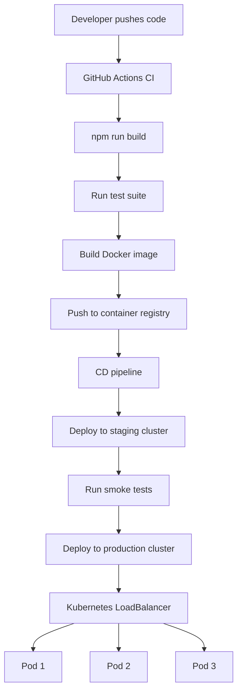

### 8.5. Feature Comparison

| Feature                      | Vercel              | Self-Hosted Node.js                |
| ---------------------------- | ------------------- | ---------------------------------- |
| ISR / On-Demand Revalidation | Native              | Requires external cache (Redis)    |
| Edge Middleware              | Global PoP network  | Single region unless you add a CDN |
| Image Optimization           | Automatic CDN       | Requires `sharp` + your own CDN    |
| Setup Complexity             | Zero config         | Dockerfile + Kubernetes YAML       |
| Cost at scale                | Per-request pricing | Fixed infrastructure cost          |

### 8.6. Anti-Patterns to Avoid

- **Using `getServerSideProps` for data that rarely changes.** Every request hits your server. Prefer ISR with a short `revalidate` window instead.
- **Importing heavy Node.js modules in client components.** Anything imported into a Client Component is bundled and sent to the browser. Move heavy processing to Server Components or API routes.
- **Fetching inside `useEffect` for data needed at render time.** This causes layout shift and poor Core Web Vitals. Fetch in Server Components instead.
- **Skipping `next/image` for large hero images.** The `` tag bypasses format conversion and lazy loading, directly hurting LCP scores.

---

## 9. Conclusion

Next.js has redefined what is possible in web development by merging the best aspects of server-side rendering, static site generation, and client-side rendering into a unified, easy-to-use framework. Its powerful features, advanced performance optimizations, and flexible architecture make it an ideal choice for projects ranging from personal blogs to large-scale enterprise applications.

The App Router, Server Actions, and layered caching system introduced in Next.js 13–15 represent a fundamental rethink of how React applications are built. By co-locating server and client code, enabling fine-grained cache invalidation, and supporting streaming out of the box, Next.js dramatically reduces the complexity of building fast, data-rich applications.

By understanding Next.js’s core features, leveraging its advanced capabilities like ISR and middleware, and following best practices for performance and security, you can build web applications that are fast, scalable, and future-proof. The community and ecosystem surrounding Next.js continue to grow, ensuring that this framework remains at the forefront of modern web development.

**Key Takeaways:**

- Use Server Components by default; reach for Client Components only when you need browser APIs or interactivity.
- Prefer Server Actions over separate API routes for form mutations — less boilerplate, native progressive enhancement.
- Understand all four caching layers before debugging stale data.
- Match your deployment target to your team’s operational expertise and budget; both Vercel and self-hosted Docker are production-ready paths.
- Treat Core Web Vitals as first-class engineering requirements — LCP, CLS, and INP directly affect search rankings.

---

## 10. Further Reading and Resources

- **Official Documentation:**
  - [Next.js Documentation](https://nextjs.org/docs)
- **Tutorials & Courses:**
  - Next.js tutorials on platforms like Udemy, Coursera, and freeCodeCamp.
- **Books:**
  - _"Learning Next.js"_ and other titles focusing on modern React and Next.js practices.
- **Communities:**
  - Join the Next.js GitHub repository, Discord channels, and Stack Overflow to connect with other developers.
- **Case Studies:**
  - Explore real-world examples and success stories on the Next.js blog.

---

_This comprehensive guide on Next.js provides a detailed look at its innovative features, advanced use cases, and best practices, empowering you to build high-performance, scalable web applications with confidence. Dive into Next.js today and experience the future of web frameworks!_
