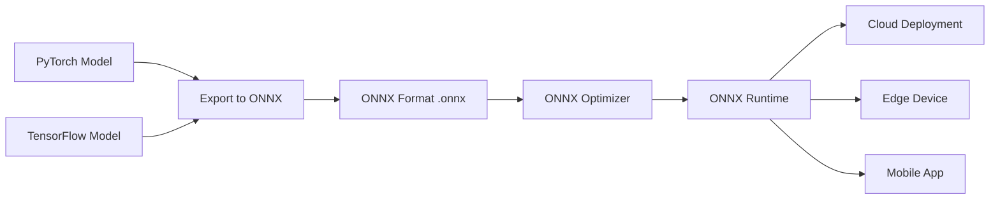
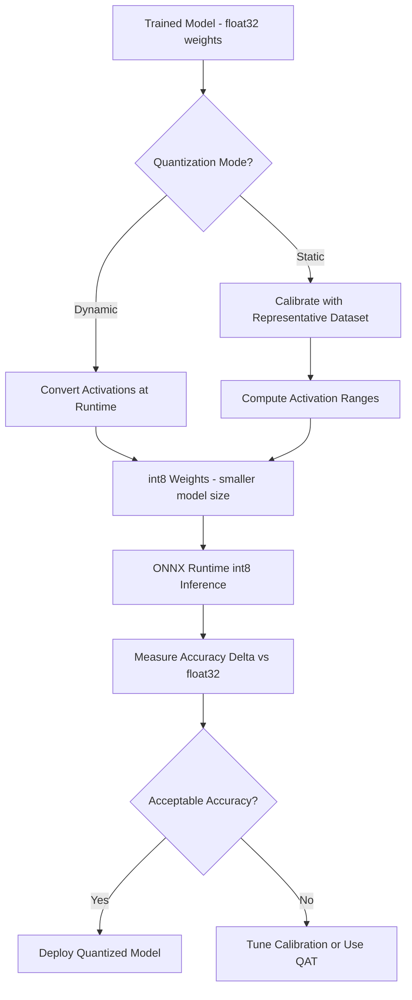
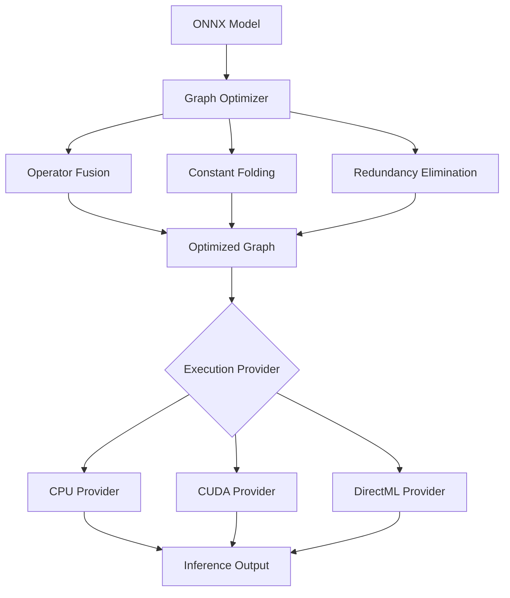
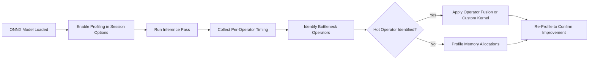
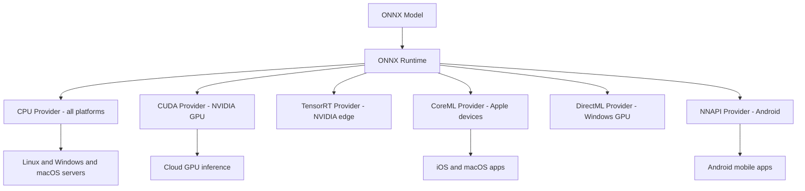
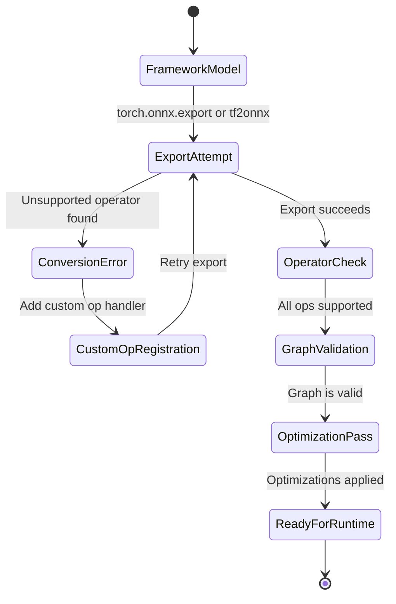
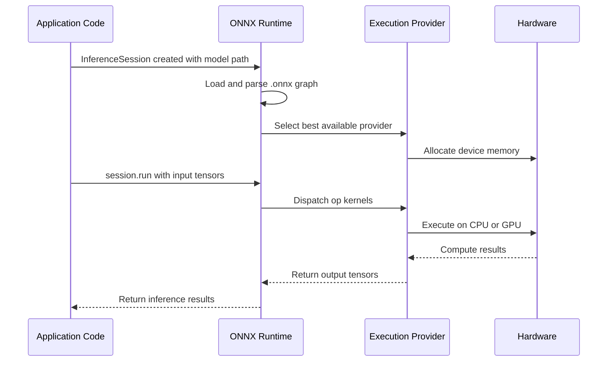
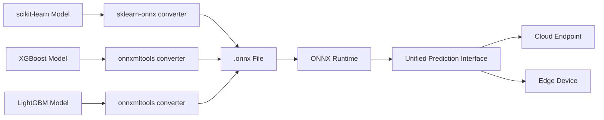
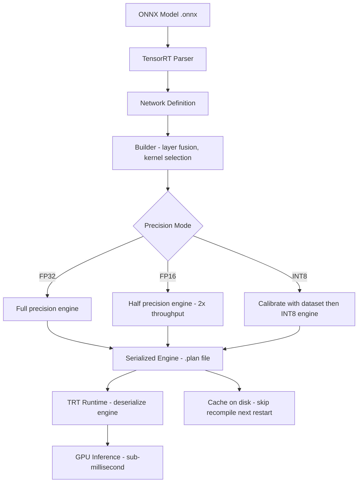
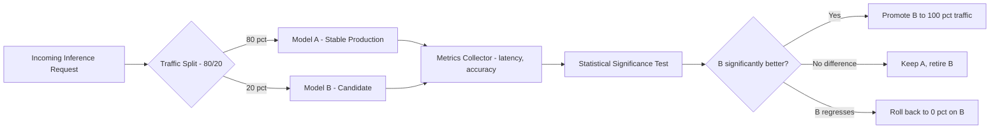

import MdxLayout from "@/components/MdxLayout";

export const metadata = {
  title: "ONNX and AI Model Interoperability",
  description:
    "A comprehensive exploration of ONNX (Open Neural Network Exchange), covering its architecture, runtime optimizations, deployment strategies, and real-world use cases.",
  topics: [
    "Artificial Intelligence",
    "Machine Learning",
    "Deep Learning",
    "Performance",
  ],
};

export default function ONNXContent({ children }) {
  return <MdxLayout>{children}</MdxLayout>;
}

# Deep Dive into ONNX: A Guide to AI Model Interoperability and Deployment

### Author: Son Nguyen

> Date: 2024-07-28

ONNX, the Open Neural Network Exchange, has emerged as a game-changing standard in the AI community. It provides a universal framework to represent deep learning models, enabling seamless interoperability between diverse frameworks and hardware platforms. This guide takes you on a detailed journey through ONNX - from its architecture and conversion process to runtime optimizations and deployment strategies - ensuring you gain a robust understanding of how to leverage ONNX for your AI projects.




---

## 1. Introduction

In today’s rapidly evolving AI landscape, teams frequently experiment with multiple frameworks - such as PyTorch, TensorFlow, and others - to build state-of-the-art models. However, deploying these models consistently across various production environments can be challenging. ONNX addresses this challenge by offering:

- **Interoperability:** Train in one framework and deploy in another.
- **Optimization:** Utilize ONNX Runtime for accelerated inference.
- **Portability:** Deploy models on cloud, edge, or mobile devices without extensive re-engineering.

This guide covers every aspect of ONNX, providing in-depth insights and practical examples to help you integrate ONNX into your workflow.

---

## 2. Understanding ONNX

### 2.1. What is ONNX?

ONNX is an open-source standard for representing machine learning models. Developed collaboratively by industry leaders like Microsoft and Facebook, ONNX defines a common file format and set of operators that allow models to be shared and deployed across different AI frameworks.

### 2.2. Key Benefits of ONNX

- **Model Interoperability:** Convert and run models across various platforms.
- **Unified Optimization:** Use ONNX Runtime to optimize inference performance.
- **Ecosystem Integration:** Benefit from a broad community and industry support.
- **Simplified Deployment:** Streamline production pipelines by abstracting framework-specific details.

---

## 3. Architecture of ONNX

### 3.1. ONNX Model Format

The ONNX model is represented as a computation graph stored in a protocol buffer (protobuf) format. Key components include:

- **Graph Structure:** Defines nodes (operations) and edges (data flow).
- **Operators:** Standardized functions (e.g., convolution, pooling) with well-defined schemas.
- **Attributes:** Metadata providing additional context for operators (e.g., kernel sizes, strides).
- **Tensor Data:** Serialized weights and parameters that define the model.

This intermediate representation (IR) makes it possible for models to be easily transferred, optimized, and executed across different platforms.

### 3.2. ONNX Operators and Schemas

Operators are the building blocks of an ONNX model. Each operator adheres to a strict schema that ensures consistency:

- **Standardization:** Every operator, such as Relu or Conv, has a defined behavior across platforms.
- **Extensibility:** New operators can be added to support emerging techniques and custom layers.
- **Versioning:** Operators are versioned to ensure backward compatibility and smooth transitions as frameworks evolve.

---

## 4. Converting Models to ONNX

One of the primary uses of ONNX is converting models trained in popular frameworks into a standardized format.

### 4.1 Converting a PyTorch Model

PyTorch provides a built-in module, `torch.onnx`, for exporting models.

#### Steps to Convert a PyTorch Model:

1. **Define and Train Your Model:** Create your neural network and train it using PyTorch.
2. **Set the Model to Evaluation Mode:** Ensure the model is in inference mode.
3. **Export Using torch.onnx.export:** Convert the model by specifying input shapes, input/output names, and the output file.

```python
import torch
import torch.nn as nn

# Define a simple PyTorch model
class SimpleModel(nn.Module):
    def __init__(self):
        super(SimpleModel, self).__init__()
        self.linear = nn.Linear(10, 2)

    def forward(self, x):
        return self.linear(x)

model = SimpleModel()
model.eval()  # Set to evaluation mode

# Create a dummy input tensor with the expected shape
dummy_input = torch.randn(1, 10)

# Export the model to ONNX format
torch.onnx.export(model, dummy_input, "simple_model.onnx", input_names=["input"], output_names=["output"])
```

### 4.2 Converting a TensorFlow Model

TensorFlow users can convert models using the `tf2onnx` tool.

#### Steps to Convert a TensorFlow Model:

1. **Train and Save Your Model:** Use TensorFlow to create and train your model, then save it.
2. **Convert the Model with tf2onnx:** Run the conversion command from the terminal.

```bash
python -m tf2onnx.convert --saved-model tensorflow_model_dir --output model.onnx
```

This command converts your saved TensorFlow model into an ONNX file, ready for deployment and further optimization.

### 4.3 Addressing Conversion Challenges

- **Operator Support:** Not every operator in a given framework has a direct ONNX equivalent. Be prepared to use custom conversion functions or workarounds.
- **Version Compatibility:** Ensure that the versions of your frameworks and ONNX libraries are compatible.
- **Debugging Conversions:** Use tools like Netron (a model visualization tool) to inspect the ONNX graph and verify correct conversion.

When conversion challenges arise, quantization is often the next step. The pipeline below shows the decision points for choosing dynamic versus static quantization:



---

## 5. ONNX Runtime: Optimizing and Executing Models

### 5.1. Overview of ONNX Runtime

ONNX Runtime is a high-performance inference engine that executes ONNX models. It is optimized for speed and supports various hardware accelerations.

### 5.2. Key Features

- **Graph Optimizations:** Automatically optimizes the computational graph by removing redundant operations and fusing compatible nodes.
- **Hardware Acceleration:** Integrates with CUDA, DirectML, and other libraries to leverage GPU and specialized accelerators.
- **Cross-Platform Support:** Runs on multiple operating systems including Windows, Linux, and macOS.
- **Quantization Support:** Reduce model size and improve latency by converting models to lower precision (e.g., from float32 to int8).

### 5.3. Example: Running an ONNX Model with ONNX Runtime

```python
import onnxruntime as ort
import numpy as np

# Initialize an ONNX Runtime session with your model
session = ort.InferenceSession("simple_model.onnx")

# Create a dummy input array that matches the model's expected shape
input_data = np.random.randn(1, 10).astype(np.float32)

# Run the model and fetch the output
outputs = session.run(None, {"input": input_data})
print("Model output:", outputs[0])
```

---

## 6. Deployment Strategies for ONNX Models

### 6.1 Cloud Deployment

Deploy ONNX models in the cloud using services like Azure ML, AWS SageMaker, or Google AI Platform. Benefits include:

- **Scalability:** Easily scale your inference services.
- **Managed Infrastructure:** Focus on model performance without worrying about hardware management.
- **Integration:** Seamlessly integrate with existing cloud-based data pipelines.

### 6.2 Edge and Mobile Deployment

ONNX enables deployment on resource-constrained devices:

- **ONNX Runtime for Mobile:** Optimized libraries for iOS and Android.
- **Reduced Latency:** Perform real-time inference locally on the device.
- **Privacy and Security:** Process data on-device to minimize data transfer.

### 6.3 Web and API Integration

Expose your ONNX models via APIs to power web applications:

- **RESTful APIs:** Use frameworks like Flask or FastAPI to serve model predictions.
- **Serverless Deployment:** Deploy using serverless functions to handle intermittent traffic and reduce costs.

---

## 7. Advanced Optimization Techniques



### 7.1 Graph Optimizations

ONNX Runtime applies several graph-level optimizations:

- **Operator Fusion:** Combines multiple operations into a single kernel to reduce overhead.
- **Constant Folding:** Pre-computes constant expressions during model load.
- **Elimination of Redundancies:** Removes unnecessary nodes to streamline the computation graph.

### 7.2 Quantization

Quantization reduces model size and accelerates inference by converting floating-point numbers to lower-precision formats:

- **Dynamic Quantization:** Adjusts precision during runtime.
- **Static Quantization:** Converts model weights offline, resulting in smaller models and faster inference.

### 7.3 Pruning and Model Compression

Techniques such as pruning remove redundant neurons and connections:

- **Pruning:** Eliminates weights with little contribution to the output.
- **Compression:** Reduces model storage requirements, enabling faster loading times.

Profiling identifies hot operators that benefit most from fusion or custom kernel replacement:



Each execution provider targets a different hardware tier, and ONNX Runtime selects the best available provider at session creation:



The conversion process itself follows a well-defined state machine — unsupported operators trigger a custom op registration step before the export is retried:



---

## 8. Real-World Use Cases and Case Studies

### 8.1. Cross-Framework Model Deployment

Companies often train models in one framework (e.g., PyTorch for research) and deploy them in another environment (e.g., TensorFlow-based production pipelines) using ONNX to bridge the gap.

### 8.2. Performance-Driven Inference

Industries such as healthcare, finance, and autonomous vehicles rely on ONNX Runtime to deliver real-time inference with low latency and high throughput.

### 8.3. Edge and Mobile Applications

From smart cameras to mobile apps, ONNX enables sophisticated AI capabilities on devices with limited computational resources.

### 8.4. Case Study: Accelerating Inference in a Production Environment

A leading technology firm converted its PyTorch models to ONNX and deployed them using ONNX Runtime on GPU clusters. The result was a significant reduction in latency and an improvement in throughput, enabling real-time analysis of large-scale data streams.

The following sequence shows the internal request path through ONNX Runtime from session creation to inference output:



---

## 9. Future Directions in ONNX

### 9.1. Expanding Operator Support

The ONNX community continues to grow, with ongoing efforts to support new operators and custom extensions to keep up with the latest advances in AI research.

### 9.2. ONNX for Traditional Machine Learning

Beyond deep learning, ONNX is expanding to support classical machine learning models, further unifying the AI development ecosystem.

### 9.3. Enhanced Tools and Ecosystem

Tools like the ONNX Model Zoo, improved debugging utilities, and better integration with popular development environments promise to make ONNX even more accessible and powerful.

### 9.4. Collaboration and Community

As more organizations adopt ONNX, the collaborative efforts between industry and academia will drive innovation and standardization in AI model deployment.

ONNX's operator support extends to classical ML frameworks through dedicated conversion tools, giving all model types a unified prediction interface:



---

## 10. ONNX Model Zoo

The ONNX Model Zoo is a community-maintained repository of pre-trained ONNX models covering computer vision, NLP, speech, and traditional machine learning. Using a zoo model as a starting point eliminates the need to convert a framework-specific checkpoint yourself.

### 10.1. Using a Zoo Model End-to-End

```python
import urllib.request
import onnxruntime as ort
import numpy as np
from PIL import Image

# Download ResNet-50 from the ONNX Model Zoo
MODEL_URL = (
    "https://github.com/onnx/models/raw/main/vision/classification/"
    "resnet/model/resnet50-v2-7.onnx"
)
urllib.request.urlretrieve(MODEL_URL, "resnet50.onnx")

# Load the model
session = ort.InferenceSession(
    "resnet50.onnx",
    providers=["CUDAExecutionProvider", "CPUExecutionProvider"],
)

# Inspect expected inputs
for inp in session.get_inputs():
    print(f"Input: {inp.name}, shape: {inp.shape}, type: {inp.type}")
# Output: Input: data, shape: ['N', 3, 224, 224], type: tensor(float)

def preprocess(img_path: str) -> np.ndarray:
    img = Image.open(img_path).convert("RGB").resize((224, 224))
    arr = np.array(img).astype(np.float32)
    # ImageNet normalization
    mean = np.array([0.485, 0.456, 0.406])
    std  = np.array([0.229, 0.224, 0.225])
    arr  = (arr / 255.0 - mean) / std
    return arr.transpose(2, 0, 1)[np.newaxis, ...]  # NCHW

input_tensor = preprocess("cat.jpg")
logits = session.run(None, {"data": input_tensor})[0]
top5   = np.argsort(logits[0])[::-1][:5]
print("Top-5 class indices:", top5)
```

### 10.2. Available Model Families

| Domain               | Representative Models                       |
| -------------------- | ------------------------------------------- |
| Image classification | ResNet, EfficientNet, MobileNet, SqueezeNet |
| Object detection     | YOLOv8, SSD, Faster R-CNN                   |
| NLP                  | BERT, RoBERTa, GPT-2, T5-small              |
| Image segmentation   | FCN, DeepLab                                |
| Speech               | Wav2Vec, Whisper-tiny                       |
| Traditional ML       | scikit-learn pipelines via sklearn-onnx     |

---

## 11. Custom Operators

When a model uses an op that does not have an ONNX equivalent, you can register a custom operator kernel in ONNX Runtime rather than modifying the model architecture.

### 11.1. Python Custom Op via OrtCustomOpDomain

```python
import onnxruntime as ort
from onnxruntime import OrtValue
import numpy as np

class SiluOp:
    """SiLU (Swish) activation: x * sigmoid(x) — missing from older ONNX opsets."""

    @staticmethod
    def compute(x: np.ndarray) -> np.ndarray:
        return x * (1.0 / (1.0 + np.exp(-x)))

# Register via a SessionOptions pre-pack hook (simplified pattern)
so = ort.SessionOptions()
so.register_custom_ops_library("./libmy_custom_ops.so")  # compiled C++ ops

session = ort.InferenceSession("model_with_silu.onnx", sess_options=so)
```

For pure-Python ops during prototyping, `onnxruntime-extensions` provides a higher-level API:

```python
from onnxruntime_extensions import PyCustomOpDef, onnx_op

@onnx_op(op_type="CustomSiLU",
         inputs=[PyCustomOpDef.dt_float],
         outputs=[PyCustomOpDef.dt_float])
def custom_silu(x):
    return (x * (1.0 / (1.0 + np.exp(-x)))).astype(np.float32)
```

---

## 12. ONNX with TensorRT for Maximum GPU Throughput

NVIDIA TensorRT is a GPU inference optimizer and runtime. The `TensorrtExecutionProvider` in ONNX Runtime compiles the ONNX graph through TensorRT, applying layer fusion, precision calibration, and kernel auto-tuning to reach peak GPU throughput.

```python
import onnxruntime as ort
import numpy as np

trt_options = {
    "trt_max_workspace_size":      2 << 30,        # 2 GB workspace
    "trt_fp16_enable":             True,            # FP16 precision
    "trt_int8_enable":             False,
    "trt_engine_cache_enable":     True,            # cache compiled engine
    "trt_engine_cache_path":       "./trt_cache",
    "trt_max_partition_iterations":1000,
    "trt_min_subgraph_size":       5,
}

so = ort.SessionOptions()
so.graph_optimization_level = ort.GraphOptimizationLevel.ORT_ENABLE_ALL

session = ort.InferenceSession(
    "resnet50.onnx",
    sess_options=so,
    providers=[("TensorrtExecutionProvider", trt_options), "CUDAExecutionProvider"],
)

dummy = np.random.randn(1, 3, 224, 224).astype(np.float32)

# First call: TRT compiles and caches the engine (~15-60 s)
_ = session.run(None, {"data": dummy})

# Subsequent calls hit the compiled engine cache (<5 ms per inference on V100)
import time
t0 = time.perf_counter()
for _ in range(1000):
    session.run(None, {"data": dummy})
print(f"Average latency: {(time.perf_counter()-t0)/1000*1000:.2f} ms")
```



---

## 13. Model A/B Testing with ONNX Runtime

ONNX Runtime makes it straightforward to serve two model versions simultaneously and split traffic between them for canary or shadow deployments.

```python
import onnxruntime as ort
import numpy as np
import random
from dataclasses import dataclass
from typing import Optional

@dataclass
class InferenceResult:
    model_version: str
    output: np.ndarray
    latency_ms: float

class ABTestingRouter:
    def __init__(
        self,
        model_a_path: str,
        model_b_path: str,
        b_traffic_pct: float = 0.1,  # 10% to new model
    ):
        providers = ["CUDAExecutionProvider", "CPUExecutionProvider"]
        self.session_a = ort.InferenceSession(model_a_path, providers=providers)
        self.session_b = ort.InferenceSession(model_b_path, providers=providers)
        self.b_pct     = b_traffic_pct
        self.input_a   = self.session_a.get_inputs()[0].name
        self.input_b   = self.session_b.get_inputs()[0].name

    def predict(self, data: np.ndarray) -> InferenceResult:
        import time
        use_b = random.random() < self.b_pct
        session = self.session_b if use_b else self.session_a
        key     = self.input_b  if use_b else self.input_a
        version = "B" if use_b else "A"

        t0     = time.perf_counter()
        output = session.run(None, {key: data})[0]
        ms     = (time.perf_counter() - t0) * 1000

        return InferenceResult(version, output, round(ms, 3))

# Usage
router = ABTestingRouter("model_v1.onnx", "model_v2.onnx", b_traffic_pct=0.2)
result = router.predict(np.random.randn(1, 3, 224, 224).astype(np.float32))
print(f"Served by model {result.model_version} in {result.latency_ms} ms")
```



---

## 14. Conclusion

ONNX represents a significant step forward in achieving true model interoperability in the AI landscape. By providing a universal model format, optimized runtimes, and a rich ecosystem of tools, ONNX enables seamless deployment across diverse platforms - from cloud servers to edge devices. Whether you are a researcher experimenting with new ideas or an engineer tasked with deploying high-performance models, ONNX offers the flexibility, efficiency, and community support to streamline your workflow.

The ONNX Model Zoo accelerates time-to-production by providing ready-to-run baselines. Custom operators bridge the gap when a framework-specific op has no ONNX equivalent. The TensorRT execution provider squeezes maximum GPU throughput from compiled inference engines. And the uniform session API makes A/B testing between model versions a matter of traffic routing rather than framework re-integration.

This guide has delved into the architecture, conversion processes, runtime optimizations, and deployment strategies associated with ONNX. With detailed examples, best practices, and real-world case studies, you now have the knowledge to leverage ONNX in your AI projects and overcome the challenges of model interoperability.

Stay engaged with the latest developments in the ONNX ecosystem, experiment with advanced optimization techniques, and join the growing community of AI professionals committed to pushing the boundaries of what's possible.

---

_This in-depth guide aims to serve as your comprehensive resource for understanding and working with ONNX. From foundational concepts and detailed conversion steps to advanced optimizations and real-world applications, we hope this article empowers you to harness the full potential of ONNX in your AI endeavors. Happy coding and best of luck on your journey towards efficient and scalable AI deployments!_

---

## 15. Getting Started and Resources

### 15.1. Official Documentation and Tutorials

- **ONNX Documentation:**
  [ONNX Official Documentation](https://onnx.ai/)
- **ONNX Runtime:**
  [ONNX Runtime GitHub](https://github.com/microsoft/onnxruntime)
- **Model Zoo:**
  [ONNX Model Zoo](https://github.com/onnx/models)

### 15.2. Community and Learning

- **Tutorials and Workshops:**
  Explore video tutorials on YouTube, Coursera courses, and hands-on workshops that walk you through model conversion and deployment.
- **Forums and Discussion Groups:**
  Engage with the ONNX community on GitHub, Stack Overflow, and dedicated forums to exchange ideas and solve problems.

### 15.3. Tools for Conversion and Optimization

- **tf2onnx:** Convert TensorFlow models to ONNX.
- **torch.onnx:** Export PyTorch models to ONNX.
- **ONNX Optimizer:** A tool to apply graph-level optimizations to ONNX models.
