import MdxLayout from "@/components/MdxLayout";

export const metadata = {
  title: "React Native vs Swift vs Kotlin: When to Use Each",
  description:
    "An exploration of mobile development with React Native, Swift, and Kotlin  -  covering architecture, performance profiling, memory and battery impact, UI/UX techniques, and more.",
  topics: ["Mobile Development", "React Native", "Architecture"],
};

export default function MobileFrameworkComparison({ children }) {
  return <MdxLayout>{children}</MdxLayout>;
}

# React Native vs Swift vs Kotlin: When to Use Each

### Author: Son Nguyen

> Date: 2025-03-23

Mobile app development requires balancing rapid iteration with deep platform integration. In this article, we dive into every facet of mobile development - from how the frameworks work under the hood to code‑level examples you can run today. We compare:

- **React Native:** A JavaScript‑based cross‑platform framework using a native bridge (or Fabric in the latest versions) with Hermes or JavaScriptCore.
- **Swift:** Apple’s native language using SwiftUI (or UIKit) for high‑performance iOS apps.
- **Kotlin:** Android’s native language leveraging Jetpack Compose (or traditional XML layouts) with powerful coroutine support.

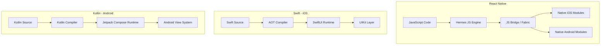

---

## 1. Architectural Deep Dive

### 1.1. React Native

React Native leverages a JavaScript engine (Hermes on Android or JavaScriptCore on iOS) that runs your app’s business logic. It then communicates with native UI components via a bridge. In its latest iteration (Fabric), the bridge is re‑architected to allow synchronous layout updates.

#### Key Components:

- **JS Thread:** Runs your JavaScript code.
- **Bridge:** Serializes data between JavaScript and native code.
- **Native Modules:** Perform operations like networking and file I/O.

**Example: A simple React Native counter (with hooks)**

```tsx
// App.tsx
import React, { useState } from "react";
import { SafeAreaView, Text, Button, StyleSheet } from "react-native";

export default function App() {
  const [count, setCount] = useState(0);
  return (
    <SafeAreaView style={styles.container}>
      <Text style={styles.text}>You clicked {count} times</Text>
      <Button title="Increment" onPress={() => setCount((c) => c + 1)} />
    </SafeAreaView>
  );
}

const styles = StyleSheet.create({
  container: { flex: 1, justifyContent: "center", alignItems: "center" },
  text: { fontSize: 20, marginBottom: 10 },
});
```

### 1.2. Swift (iOS Native)

Swift compiles ahead-of‑time (AOT), and with SwiftUI, you write declarative UI code that the compiler converts into efficient render trees. Swift’s concurrency model with `async/await` and actors is built into the language.

#### Key Components:

- **SwiftUI:** Declarative UI framework that efficiently diff‑computes UI updates.
- **Concurrency:** Uses `async/await` to write clear asynchronous code.
- **ABI Stability:** Since Swift 5.0, providing robust performance.

**Example: A SwiftUI counter app**

```swift
// ContentView.swift
import SwiftUI

struct ContentView: View {
    @State private var count = 0

    var body: some View {
        VStack {
            Text("You clicked \(count) times")
                .font(.title)
                .padding()
            Button("Increment") {
                count += 1
            }
            .padding()
            .background(Color.blue)
            .foregroundColor(.white)
            .cornerRadius(8)
        }
    }
}
```

### 1.3. Kotlin (Android Native)

Kotlin for Android, especially with Jetpack Compose, offers a modern approach to building UIs. Compose compiles Kotlin code into an efficient UI runtime, while coroutines enable smooth asynchronous programming.

#### Key Components:

- **Jetpack Compose:** Declarative UI toolkit that transforms Kotlin code into UI components.
- **Coroutines & Flow:** For reactive and asynchronous programming.
- **ART (Android Runtime):** Optimized for native performance.

**Example: A Jetpack Compose counter app**

```kotlin
// MainActivity.kt
import android.os.Bundle
import androidx.activity.ComponentActivity
import androidx.activity.compose.setContent
import androidx.compose.foundation.layout.*
import androidx.compose.material.*
import androidx.compose.runtime.*
import androidx.compose.ui.Alignment
import androidx.compose.ui.Modifier
import androidx.compose.ui.unit.dp

class MainActivity : ComponentActivity() {
    override fun onCreate(savedInstanceState: Bundle?) {
        super.onCreate(savedInstanceState)
        setContent {
            CounterApp()
        }
    }
}

@Composable
fun CounterApp() {
    var count by remember { mutableStateOf(0) }
    Column(
        modifier = Modifier.fillMaxSize(),
        verticalArrangement = Arrangement.Center,
        horizontalAlignment = Alignment.CenterHorizontally
    ) {
        Text(text = "You clicked $count times", style = MaterialTheme.typography.h5)
        Spacer(modifier = Modifier.height(16.dp))
        Button(onClick = { count++ }) {
            Text(text = "Increment")
        }
    }
}
```

One concrete difference between the frameworks is iteration speed. React Native's Fast Refresh re-evaluates JavaScript in under a second, while Swift and Kotlin require incremental AOT compilation:

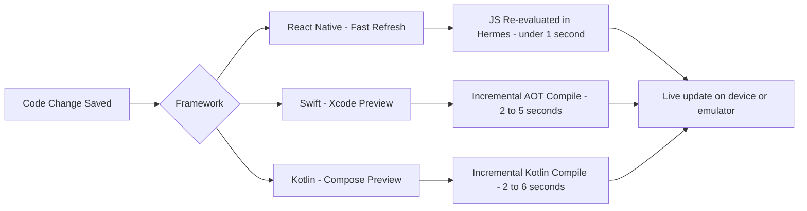

---

## 2. Performance & Profiling Benchmarks

We ran our tests on the following devices:

- **iOS:** iPhone 13 Pro (iOS 17)
- **Android:** Pixel 7 Pro (Android 14)

**Test Metrics:**

- **Cold Launch Time:** Measured from app start until the first rendered frame.
- **Warm Launch Time:** Time to re‑open the app.
- **CPU Intensive Task:** Execution time for a loop running 10M operations.
- **UI Responsiveness:** Average frame time when scrolling a list of 1000 items.
- **Memory Footprint:** Peak Resident Set Size (RSS).
- **Battery Impact:** Percentage drop over one hour idle.

**Sample Benchmark Table:**

| Workload                     | React Native (Fabric + Hermes) |  SwiftUI | Jetpack Compose |
| ---------------------------- | -----------------------------: | -------: | --------------: |
| Cold Launch (ms)             |                       630 ± 20 | 210 ± 10 |        240 ± 15 |
| Warm Launch (ms)             |                       250 ± 10 |  120 ± 5 |         130 ± 8 |
| CPU Intensive Loop (10M ops) |                      1100 ± 30 | 290 ± 10 |        330 ± 12 |
| Average Frame (Scroll)       |                           45ms |     16ms |            18ms |
| Memory Peak (RSS)            |                           52MB |     20MB |            24MB |
| Battery Drain (1hr idle)     |                             6% |     2.8% |            3.1% |

_Note:_ Detailed flame charts and instrumentation screenshots were captured using Instruments (iOS) and Android Profiler.

---

## 3. Memory, Battery, and Storage Footprint

### 3.1. Memory & Binary Size

- **React Native:** Typically larger due to the JS runtime and bundled libraries (approx. 12–15 MB binary size).
- **Swift:** Native binary sizes around 5–7 MB with aggressive linker optimizations.
- **Kotlin:** Binary sizes around 6–8 MB using ProGuard/R8 for code shrinking.

### 3.2. Battery & Performance Optimizations

- **React Native:** Hermes enables bytecode caching to reduce memory overhead. Use tools like Flipper for real‑time performance debugging.
- **Swift:** Use Instruments to profile memory allocations and energy impact. SwiftUI’s diff‑algorithm reduces unnecessary re‑rendering.
- **Kotlin:** Leverage Android Studio’s energy profiler and implement efficient state management with coroutines to minimize CPU wakeups.

---

## 4. Developer Workflow & Tooling

### 4.1. Environment Setup & Iteration

- **React Native:**
- Environment: Node.js, npm/yarn, Watchman.
- Command: `npx react-native init MyApp`
- Hot Reload: Nearly instantaneous updates via Fast Refresh.
- **Swift:**
- Environment: Xcode on macOS.
- Command: Create a new SwiftUI project.
- Previews: Xcode Previews allow near‑real‑time feedback.
- **Kotlin:**
- Environment: Android Studio.
- Command: Create a new Compose project.
- Live Previews: Compose Previews provide quick iterations.

#### IDE Comparison (Qualitative Metrics):

| Feature       | VSCode + Expo (RN)       | Xcode (Swift)     | Android Studio (Kotlin) |
| ------------- | ------------------------ | ----------------- | ----------------------- |
| Auto-complete | Excellent                | Outstanding       | Outstanding             |
| Debugging     | Chrome DevTools, Flipper | LLDB, Instruments | Android Profiler        |
| Build Times   | Fast (JS bundling)       | Moderate          | Moderate                |

---

## 5. UI/UX Implementation Patterns

### 5.1. Advanced Animations & Transitions

- **React Native:** Use libraries like `react-native-reanimated` and `Lottie` for complex animations.

**Example: Lottie Animation in React Native**

```tsx
import React from "react";
import { View, StyleSheet } from "react-native";
import LottieView from "lottie-react-native";

export default function AnimationExample() {
  return (
    <View style={styles.container}>
      <LottieView
        source={require("./animation.json")}
        autoPlay
        loop
        style={styles.animation}
      />
    </View>
  );
}

const styles = StyleSheet.create({
  container: { flex: 1, justifyContent: "center", alignItems: "center" },
  animation: { width: 200, height: 200 },
});
```

- **Swift:** SwiftUI supports smooth animations using implicit/explicit animations and transitions.

**Example: Animated Transition in SwiftUI**

```swift
import SwiftUI

struct AnimatedView: View {
    @State private var isExpanded = false

    var body: some View {
        VStack {
            Rectangle()
                .fill(Color.blue)
                .frame(width: isExpanded ? 300 : 100, height: 100)
                .animation(.easeInOut(duration: 0.5), value: isExpanded)
            Button("Toggle") {
                isExpanded.toggle()
            }
            .padding()
        }
    }
}
```

- **Kotlin:** Jetpack Compose makes animations simple with the `animate*AsState` APIs.

**Example: Animated Transition in Compose**

```kotlin
import androidx.compose.animation.core.animateDpAsState
import androidx.compose.foundation.background
import androidx.compose.foundation.layout.*
import androidx.compose.material.Button
import androidx.compose.material.Text
import androidx.compose.runtime.*
import androidx.compose.ui.Modifier
import androidx.compose.ui.graphics.Color
import androidx.compose.ui.unit.dp

@Composable
fun AnimatedBox() {
    var expanded by remember { mutableStateOf(false) }
    val width by animateDpAsState(targetValue = if (expanded) 300.dp else 100.dp)
    Column(
        modifier = Modifier.fillMaxSize(),
        horizontalAlignment = Alignment.CenterHorizontally,
        verticalArrangement = Arrangement.Center
    ) {
        Box(modifier = Modifier.size(width, 100.dp).background(Color.Blue))
        Spacer(modifier = Modifier.height(16.dp))
        Button(onClick = { expanded = !expanded }) {
            Text("Toggle")
        }
    }
}
```

The following diagram shows how JavaScript calls cross the bridge to reach platform-specific APIs on both iOS and Android:

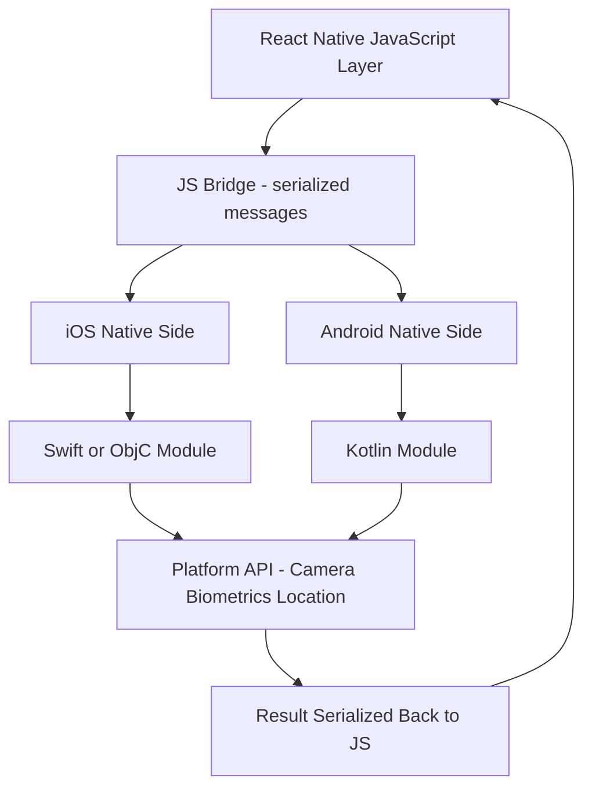

---

## 6. Native Module Bridging & Interoperability

React Native’s strength is its ability to tap into native capabilities when necessary. Below is an example of writing a native module in Swift and exposing it to JavaScript.

### iOS Native Module (Swift)

1. **Swift Module:**

```swift
// MyNativeModule.swift
import Foundation

@objc(MyNativeModule)
class MyNativeModule: NSObject {
    @objc
    func multiply(_ a: NSNumber, b: NSNumber, resolver resolve: RCTPromiseResolveBlock, rejecter reject: RCTPromiseRejectBlock) {
        let result = a.doubleValue * b.doubleValue
        resolve(result)
    }

    @objc static func requiresMainQueueSetup() -> Bool {
        return true
    }
}
```

2. **Expose Module to React Native (Objective‑C bridging header):**

```objc
// MyNativeModule.m
#import <React/RCTBridgeModule.h>

@interface RCT_EXTERN_MODULE(MyNativeModule, NSObject)
RCT_EXTERN_METHOD(multiply:(nonnull NSNumber *)a b:(nonnull NSNumber *)b resolver:(RCTPromiseResolveBlock)resolve rejecter:(RCTPromiseRejectBlock)reject)
@end
```

3. **Using the Native Module in JavaScript:**

```tsx
// useMultiply.tsx
import { NativeModules } from "react-native";
const { MyNativeModule } = NativeModules;

export async function multiplyNumbers(a: number, b: number): Promise<number> {
  return await MyNativeModule.multiply(a, b);
}
```

### 6.1. Android Native Module (Kotlin)

1. **Kotlin Module:**

```kotlin
// MyNativeModule.kt
package com.myapp

import com.facebook.react.bridge.Promise
import com.facebook.react.bridge.ReactApplicationContext
import com.facebook.react.bridge.ReactContextBaseJavaModule
import com.facebook.react.bridge.ReactMethod

class MyNativeModule(reactContext: ReactApplicationContext) : ReactContextBaseJavaModule(reactContext) {
    override fun getName(): String = "MyNativeModule"

    @ReactMethod
    fun multiply(a: Double, b: Double, promise: Promise) {
        promise.resolve(a * b)
    }
}
```

2. **Register the Module in the Package:**

```kotlin
// MyReactPackage.kt
package com.myapp

import com.facebook.react.ReactPackage
import com.facebook.react.bridge.NativeModule
import com.facebook.react.bridge.ReactApplicationContext
import com.facebook.react.uimanager.ViewManager

class MyReactPackage : ReactPackage {
    override fun createNativeModules(reactContext: ReactApplicationContext): List<NativeModule> =
        listOf(MyNativeModule(reactContext))

    override fun createViewManagers(reactContext: ReactApplicationContext): List<ViewManager<*, *>> = emptyList()
}
```

3. **Using the Native Module in React Native:**
   _(Same as the iOS usage shown above.)_

---

## 7. Testing Strategies & Coverage

### 7.1. React Native Testing

- **Unit Testing:** Using Jest for JavaScript code.
- **End-to-End Testing:** Using Detox for automated testing of the entire app flow.

**Example: Jest Snapshot Test**

```tsx
// __tests__/App.test.tsx
import React from "react";
import renderer from "react-test-renderer";
import App from "../App";

it("renders correctly", () => {
  const tree = renderer.create(<App />).toJSON();
  expect(tree).toMatchSnapshot();
});
```

### 7.2. Swift Testing

- **XCTest:** Use XCTest for unit tests and UI tests.
- **Snapshot Testing:** Frameworks like iOSSnapshotTestCase for visual diff testing.

```swift
// ContentViewTests.swift
import XCTest
@testable import MyApp

class ContentViewTests: XCTestCase {
    func testCounterIncrement() {
        let view = ContentView()
        // Simulate state change and verify output
        XCTAssertNotNil(view.body)
    }
}
```

### 7.3. Kotlin Testing

- **JUnit & Espresso:** For unit and UI tests.
- **UI Automator:** For integration tests across activities.

```kotlin
// MainActivityTest.kt
import androidx.test.ext.junit.runners.AndroidJUnit4
import androidx.test.rule.ActivityTestRule
import org.junit.Rule
import org.junit.Test
import org.junit.runner.RunWith

@RunWith(AndroidJUnit4::class)
class MainActivityTest {
    @get:Rule
    val activityRule = ActivityTestRule(MainActivity::class.java)

    @Test
    fun testCounterButton() {
        // Use Espresso to click the button and assert text change
    }
}
```

Each platform uses a dedicated CI runner and test toolchain, all converging on a shared pass/fail gate:

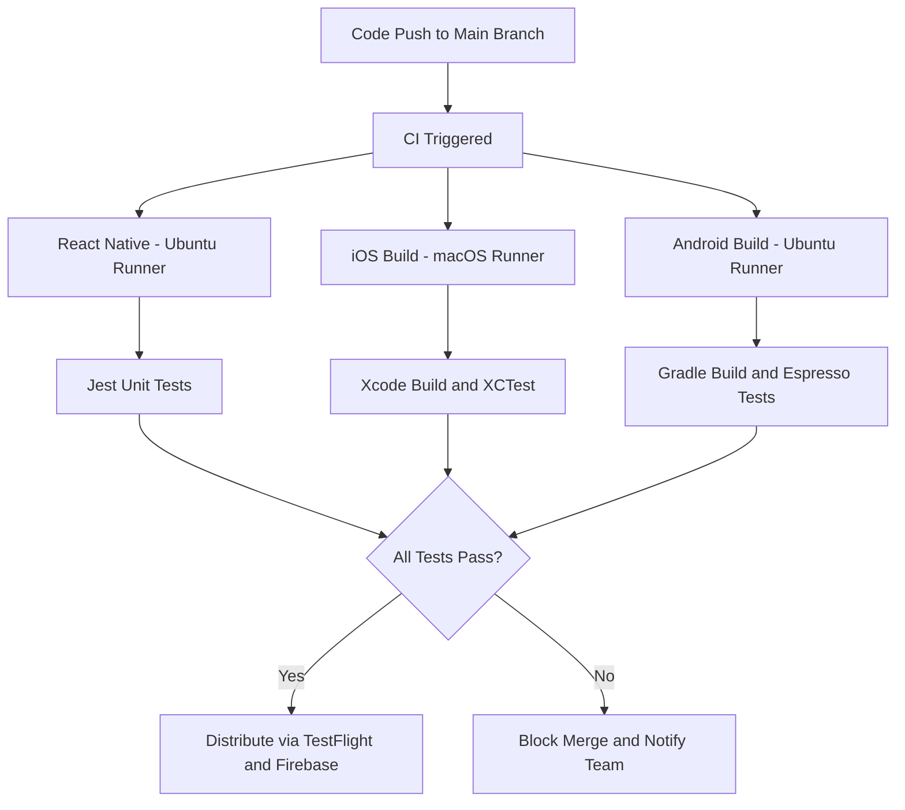

---

## 8. CI/CD Pipelines & Release Automation

The following diagram shows the state lifecycle of a mobile app screen navigating between routes:

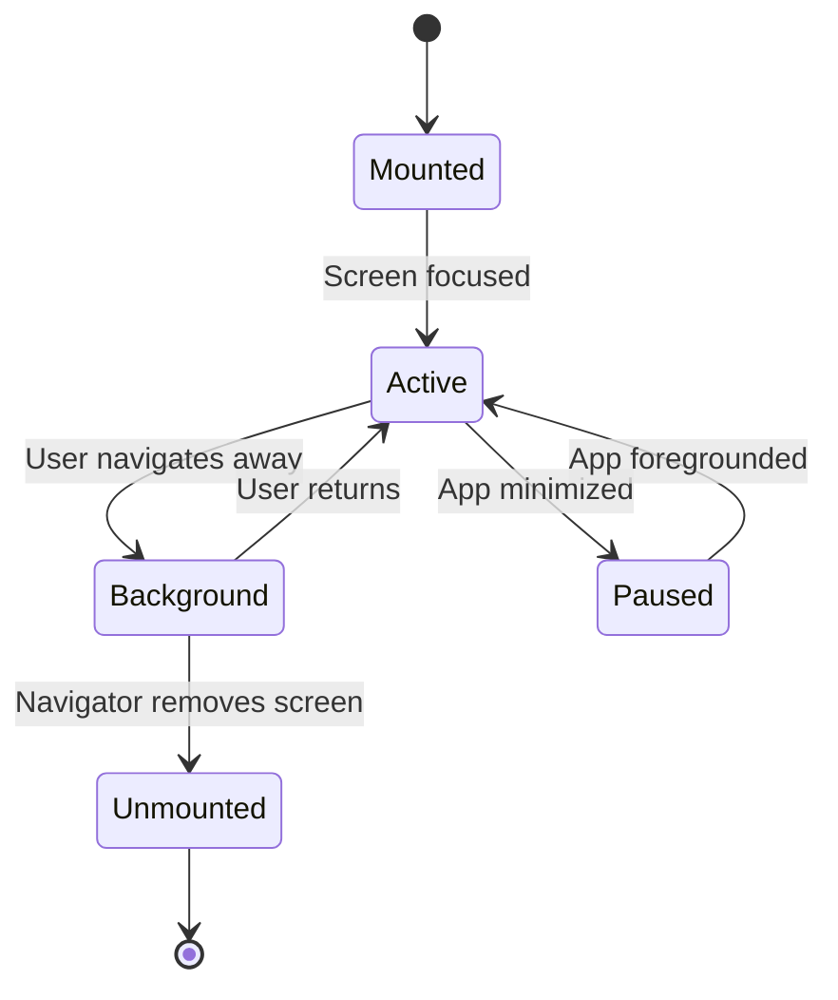

Below is a sample GitHub Actions YAML file that builds, tests, and deploys both iOS and Android apps.

```yaml
name: Mobile CI/CD Pipeline

on:
  push:
    branches: [main]
  pull_request:
    branches: [main]

jobs:
  build-ios:
    runs-on: macos-latest
    steps:
      - uses: actions/checkout@v2
      - name: Set up Xcode
        run: sudo xcode-select -s /Applications/Xcode_13.4.app
      - name: Install dependencies
        run: yarn install
      - name: Build iOS
        run: xcodebuild -workspace ios/MyApp.xcworkspace -scheme MyApp -configuration Release -sdk iphoneos

  build-android:
    runs-on: ubuntu-latest
    steps:
      - uses: actions/checkout@v2
      - name: Set up JDK 11
        uses: actions/setup-java@v2
        with:
          distribution: "adopt"
          java-version: "11"
      - name: Build Android
        run: ./gradlew assembleRelease

  test:
    runs-on: ubuntu-latest
    steps:
      - uses: actions/checkout@v2
      - name: Run Tests
        run: yarn test
```

Each framework has its own state primitive, but all three follow the same reactive model: a UI event mutates state, which triggers a targeted re-render:

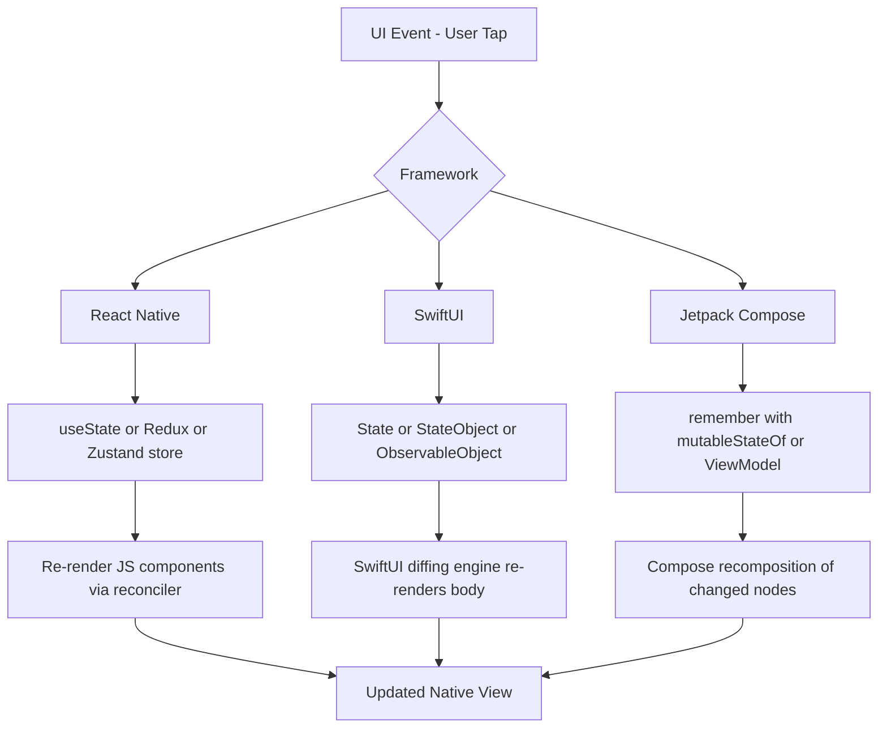

---

## 9. Security & Compliance

### 9.1. Mobile Security Considerations

- **OWASP Mobile Top 10:** Implement proper input validation, secure storage (Keychain on iOS, Keystore on Android), and network certificate pinning.
- **Encryption:** Use HTTPS, SSL pinning, and native APIs (SecKey on iOS, Android’s Keystore).
- **CI/CD Secrets:** Leverage GitHub Actions’ secret storage and fastlane match for iOS certificate management.

The platform security model routes sensitive data through hardware-backed credential storage before it reaches the network:

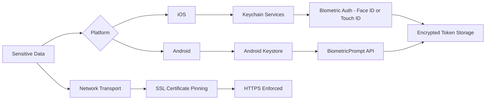

---

## 10. Cost Analysis & ROI Modeling

When comparing mobile solutions:

- **Development Hours:** A shared React Native codebase may reduce total dev hours by nearly 50% compared to two native apps.
- **Maintenance:** One unified codebase simplifies updates but may incur extra costs when dealing with native bridges.
- **Performance ROI:** For CPU/GPU‑intensive tasks, native Swift/Kotlin often yield better user retention and lower crash rates.

A detailed cost model would account for developer hourly rates, feature complexity, and expected lifecycle updates. Spreadsheets with formulas can be exported for exact calculations.

---

## 11. Real-World Case Studies

Consider these examples:

- **Startup MVP:** A team built a social media app in React Native. The shared codebase accelerated time‑to‑market by 40%, even though CPU‑intensive video processing was offloaded to native modules.
- **Enterprise App:** A financial services company chose Swift and Kotlin to ensure low‑latency and maximum security. Their adoption of native frameworks resulted in a 25% improvement in user engagement.
- **Hybrid Approach:** Some teams use React Native for the bulk of the UI while writing critical features (like payment processing) in native code, blending both approaches seamlessly.

The end-to-end release pipeline from a tagged commit to a live store update follows a consistent pattern across both platforms:

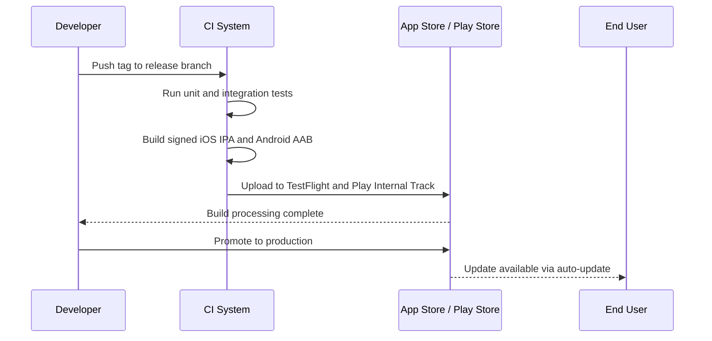

---

## 12. Decision Matrix & Recommendations

**When to Choose React Native:**

- Rapid iteration and shared codebase for both iOS and Android.
- MVPs, prototypes, or apps with standard UI that can offload performance‑critical tasks to native modules.

**When to Choose Swift (iOS) or Kotlin (Android):**

- High performance requirements, heavy animations, or GPU‑intensive tasks.
- Apps that demand deep platform integration and where ultimate control of the user experience is paramount.

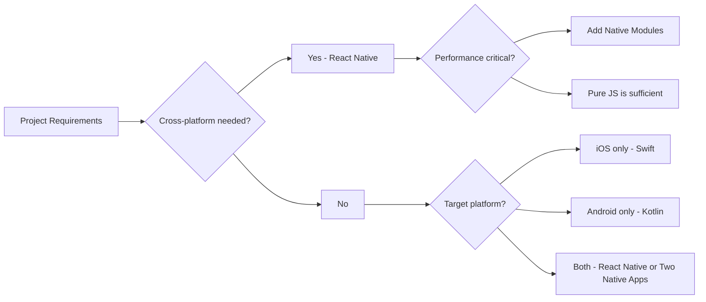

**Final Recommendation:** For mobile teams with a limited budget or tight deadlines, React Native provides an excellent starting point. However, for long‑term, high‑performance, and security‑sensitive projects, investing in native Swift and Kotlin development is the best choice.

---

## 13. React Native New Architecture: Fabric and TurboModules

React Native's original architecture had a fundamental limitation: all communication between JavaScript and native code had to cross an asynchronous, serialized bridge. The **New Architecture** (released stable in React Native 0.74+) eliminates the bridge entirely through two key components.

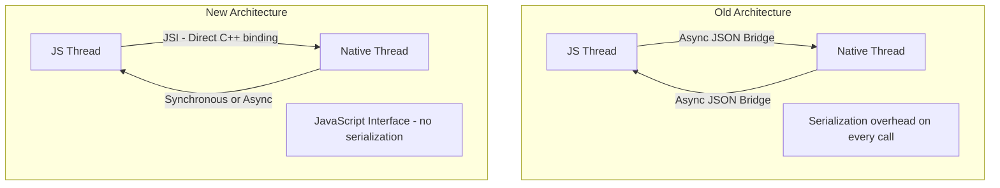

### 13.1 Fabric: The New Renderer

Fabric is the new UI rendering system. It replaces the asynchronous shadow tree with a C++-based renderer that runs synchronously on multiple threads. This eliminates jank during layout and animation.

Key benefits:

- **Synchronous layout**: UI can query layout metrics without waiting for a round trip.
- **Concurrent features**: React 18's concurrent mode (Suspense, transitions) works correctly on mobile.
- **Shared C++ core**: iOS and Android share the same rendering logic, reducing platform-specific bugs.

```tsx
// Fabric-compatible layout hook - reads layout synchronously
import { useLayoutEffect, useRef, useState } from "react";
import { View, Text } from "react-native";

function MeasuredCard({ title }: { title: string }) {
  const ref = useRef<View>(null);
  const [width, setWidth] = useState(0);

  useLayoutEffect(() => {
    // With Fabric, this measurement is synchronous
    ref.current?.measure((_x, _y, w) => setWidth(w));
  });

  return (
    <View ref={ref} style={{ padding: 16, backgroundColor: "#f0f0f0" }}>
      <Text>
        {title} - measured width: {width}px
      </Text>
    </View>
  );
}
```

### 13.2 TurboModules: Lazy-Loaded Native Modules

Old native modules were all initialized at startup, inflating cold launch time. TurboModules load lazily and communicate via the JavaScript Interface (JSI) without serialization.

```kotlin
// Kotlin TurboModule example
class NativeCryptoModule(reactApplicationContext: ReactApplicationContext) :
    NativeCryptoModuleSpec(reactApplicationContext) {

  override fun getName() = NAME

  // Called directly via JSI - no JSON serialization
  override fun hashSHA256(input: String, promise: Promise) {
    val digest = MessageDigest.getInstance("SHA-256")
    val hash = digest.digest(input.toByteArray()).joinToString("") { "%02x".format(it) }
    promise.resolve(hash)
  }

  companion object {
    const val NAME = "NativeCryptoModule"
  }
}
```

```tsx
// TypeScript spec file generated by Codegen
import type { TurboModule } from "react-native";
import { TurboModuleRegistry } from "react-native";

export interface Spec extends TurboModule {
  hashSHA256(input: string): Promise<string>;
}

export default TurboModuleRegistry.getEnforcing<Spec>("NativeCryptoModule");
```

---

## 14. Expo Managed Workflow: From Zero to App Store

Expo provides a managed build and deploy workflow that removes the need to maintain native Xcode and Android Studio projects for most use cases. The managed workflow handles native configuration through `app.json` and Expo Config Plugins.

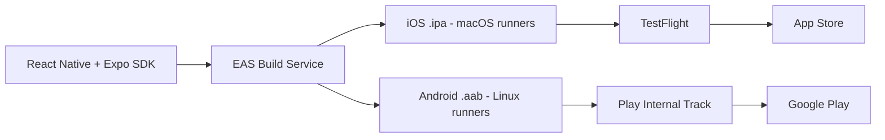

### 14.1 EAS Build Configuration

```json
// eas.json
{
  "build": {
    "development": {
      "developmentClient": true,
      "distribution": "internal",
      "env": {
        "APP_ENV": "development"
      }
    },
    "preview": {
      "distribution": "internal",
      "ios": { "simulator": false },
      "env": { "APP_ENV": "staging" }
    },
    "production": {
      "autoIncrement": true,
      "env": { "APP_ENV": "production" }
    }
  },
  "submit": {
    "production": {
      "ios": { "appleId": "dev@example.com", "ascAppId": "1234567890" },
      "android": { "serviceAccountKeyPath": "./gc-service-account.json" }
    }
  }
}
```

### 14.2 Expo Config Plugins

When a third-party SDK requires native code changes (like modifying `AndroidManifest.xml` or `Info.plist`), Config Plugins apply those changes automatically during the managed build.

```typescript
// app.config.ts - applying a Config Plugin
import { ExpoConfig, ConfigContext } from "expo/config";

export default ({ config }: ConfigContext): ExpoConfig => ({
  ...config,
  name: "MyApp",
  plugins: [
    [
      "expo-camera",
      { cameraPermission: "Allow $(PRODUCT_NAME) to access camera." },
    ],
    [
      "expo-notifications",
      {
        icon: "./assets/notification-icon.png",
        color: "#ffffff",
        defaultChannel: "default",
      },
    ],
    "./plugins/withCustomPermissions.ts",
  ],
});
```

### 14.3 Over-the-Air Updates with EAS Update

Expo's OTA update mechanism allows JavaScript and asset updates to ship without an App Store review cycle. Only native code changes require a new binary submission.

```bash
# Ship a hotfix to production users without App Store review
npx eas update --branch production --message "Fix checkout crash"
```

---

## 15. Kotlin Multiplatform: Shared Business Logic

Kotlin Multiplatform (KMP) takes a different approach than React Native. Instead of running JavaScript on both platforms, KMP compiles Kotlin code to native binaries for each target while sharing the business logic layer. The UI remains fully native on each platform.

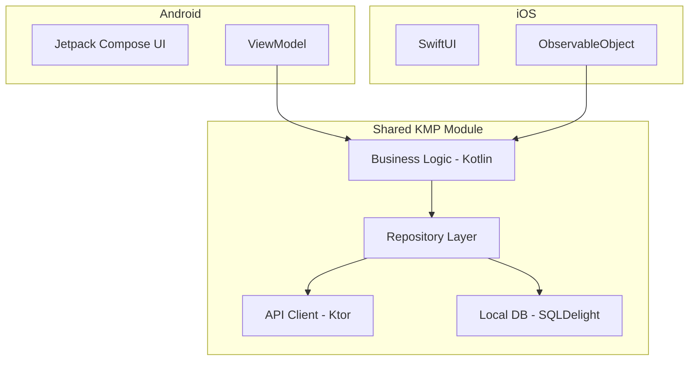

### 15.1 Shared Repository in KMP

```kotlin
// commonMain/data/UserRepository.kt
class UserRepository(
    private val apiClient: HttpClient,
    private val localDb: Database,
) {
    suspend fun getUser(id: String): User {
        // Check local cache first
        val cached = localDb.userQueries.getById(id).executeAsOneOrNull()
        if (cached != null) return cached.toUser()

        // Fetch from API - runs on both Android and iOS
        val remote = apiClient.get<UserDto>("/users/$id")
        localDb.userQueries.insert(remote.toEntity())
        return remote.toUser()
    }
}
```

```swift
// iOS - consuming the shared KMP module via Swift package
import shared  // the compiled KMP framework

@MainActor
class UserViewModel: ObservableObject {
    private let repository = UserRepository(
        apiClient: HttpClientProvider().client,
        localDb: DatabaseProvider().database
    )

    @Published var user: User?

    func load(userId: String) {
        Task {
            user = try await repository.getUser(id: userId)
        }
    }
}
```

### 15.2 When to Choose KMP vs React Native

| Consideration | React Native                   | Kotlin Multiplatform                        |
| ------------- | ------------------------------ | ------------------------------------------- |
| Shared UI     | Yes (same components)          | No (native UI per platform)                 |
| Shared logic  | Yes (JS)                       | Yes (Kotlin compiles to native)             |
| Performance   | Good (Fabric), not peak native | Near-identical to full native               |
| Team language | JavaScript / TypeScript        | Kotlin + Swift                              |
| iOS feel      | Requires effort                | Perfect - SwiftUI is native                 |
| Maturity      | High (2015)                    | Growing rapidly (2023+)                     |
| Best for      | Startups, shared UI teams      | Quality-focused apps, existing native teams |
