import MdxLayout from "@/components/MdxLayout";

export const metadata = {
  title: "Redis - High-Performance In-Memory Database",
  description:
    "An in-depth look at Redis, its features, use cases, and how it revolutionizes caching and real-time data processing.",
  topics: ["Databases", "Caching", "Performance", "Backend Development"],
};

export default function TechContent({ children }) {
  return <MdxLayout>{children}</MdxLayout>;
}

# Redis - High-Performance In-Memory Database

### Author: Son Nguyen

> Date: 2024-03-15

Redis is an open-source, in-memory data structure store that serves as a database, cache, and message broker. Celebrated for its exceptional speed and versatility, Redis supports a variety of data structures such as strings, hashes, lists, sets, and sorted sets. In this article, we explore Redis’ architecture, key features, persistence mechanisms, advanced capabilities, performance tuning, and real-world applications.

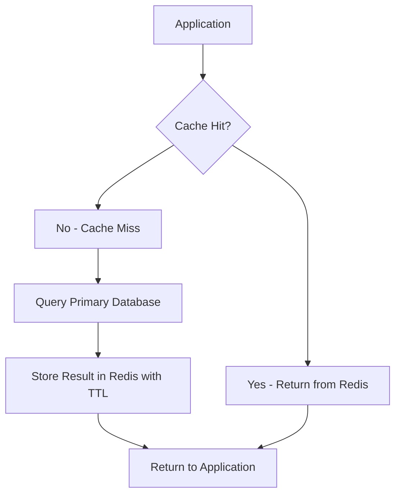

---

## 1. Introduction

In modern software architectures, speed and scalability are paramount. Redis meets these demands by storing data in memory, which enables sub-millisecond data access. Whether you're building high-throughput caching systems, session stores, or real-time analytics platforms, Redis offers the performance and flexibility required by cutting-edge applications.

Redis not only excels in data retrieval but also offers robust options for data persistence and high availability. Its advanced features, such as pub/sub messaging, Lua scripting, and geospatial indexing, have made it a go-to solution for diverse use cases across industries.

---

## 2. Redis Architecture and Key Features

### 2.1 In-Memory Storage

At the heart of Redis is its in-memory storage engine, which allows for lightning-fast data access. Data is stored and manipulated directly in RAM, ensuring minimal latency.

### 2.2 Persistence Options

Although Redis is fundamentally in-memory, it provides two primary mechanisms for data persistence:

- **RDB (Redis Database File):**
  Periodically snapshots the dataset and writes it to disk.
- **AOF (Append-Only File):**
  Logs every write operation received by the server. AOF can be configured for various fsync policies to balance performance with durability.

### 2.3 Versatile Data Structures

Redis supports a range of data types beyond simple key-value pairs:

- **Strings:** Ideal for caching and counters.
- **Hashes:** Efficient for representing objects.
- **Lists:** Useful for queues and messaging.
- **Sets & Sorted Sets:** Perfect for unique collections and ranking systems.
- **Bitmaps & HyperLogLogs:** Enable space-efficient counting and cardinality estimation.
- **Geospatial Indexes:** Allow for querying by location and distance.

### 2.4 Pub/Sub Messaging

The diagram below shows how a single publisher fans out messages to multiple subscribers through the Redis Pub/Sub engine:

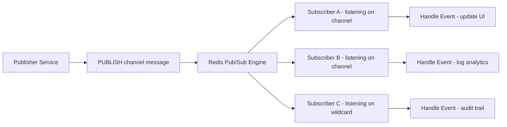

Redis provides native support for publish/subscribe messaging, which enables real-time communication between services. This makes it ideal for building chat systems, live dashboards, and notifications.

### 2.5 High Availability and Scalability

With features like replication, Redis Sentinel, and Redis Cluster, Redis can be scaled horizontally and configured for high availability. This ensures that your data remains accessible even in the event of hardware failures.

---

## 3. Deep Dive: Persistence, Replication, and Clustering

### 3.1 Persistence Strategies

- **RDB Snapshots:**
  Suitable for scenarios where occasional data loss is acceptable in exchange for minimal performance overhead. RDB files provide a compact point-in-time snapshot of your dataset.
- **AOF Logging:**
  Offers a more durable solution by logging every write. Although AOF may introduce additional latency, it can be fine-tuned with different fsync policies (every command, every second, or no fsync) to balance performance and durability.

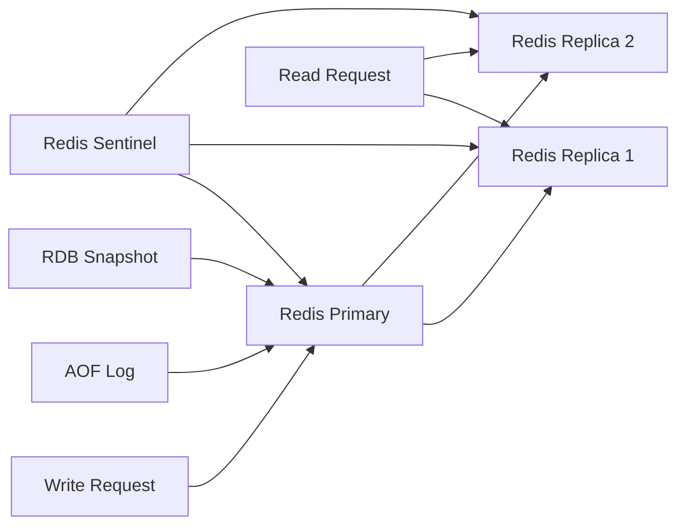

### 3.2 Replication and High Availability

Redis replication allows you to create one or more replicas of a Redis instance. In a master-replica configuration, write operations are performed on the master and asynchronously propagated to replicas. Redis Sentinel provides automatic failover, monitoring, and notification features to ensure high availability.

### 3.3 Redis Cluster

Redis Cluster partitions the 16,384 hash slots across nodes, routing each key deterministically by its CRC16 value:

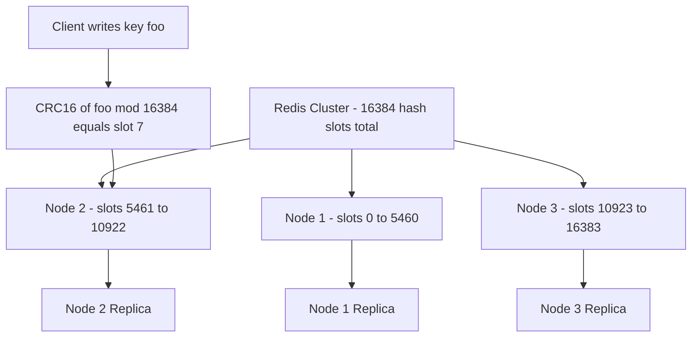

For horizontal scaling, Redis Cluster partitions data across multiple nodes. This enables both high availability and improved performance for write-heavy workloads, as the data and load are distributed across the cluster.

### 3.4 Data Sharding

Redis Cluster automatically shards data across multiple nodes, allowing for seamless scaling. Each node in the cluster is responsible for a subset of the keyspace, which enhances performance and fault tolerance.

### 3.5 Client Libraries

Redis has a rich ecosystem of client libraries available for various programming languages, including Python, Java, Go, and Node.js. These libraries provide easy-to-use APIs for interacting with Redis, making it simple to integrate Redis into your applications.

### 3.6 Monitoring and Management

Redis provides several tools for monitoring and managing your instances. The `INFO` command returns a wealth of information about the server's state, including memory usage, connected clients, and replication status. Additionally, third-party tools like RedisInsight and Redis Enterprise offer graphical interfaces for monitoring and managing Redis instances.

### 3.7 Security

Redis security features include authentication, access control lists (ACLs), and TLS encryption. By default, Redis does not require authentication, but it is highly recommended to set a password for production deployments. ACLs allow you to define fine-grained permissions for different users and commands, enhancing security in multi-tenant environments.

---

## 4. Common Use Cases

Redis is adopted in various scenarios where performance is critical:

- **Caching:**
  Speed up applications by storing frequently accessed data in Redis, reducing the load on your primary database.

- **Session Storage:**
  Manage user sessions in memory for fast access and high scalability.

- **Real-Time Analytics:**
  Process and analyze data streams in real time, enabling dynamic dashboards and monitoring systems.

- **Message Queues:**
  Use Redis as a lightweight broker for pub/sub messaging, facilitating real-time communication between services.

- **Rate Limiting:**
  Implement rate limiting for APIs by leveraging Redis’ atomic increment operations and expiration capabilities.

---

## 5. Example: Basic Redis Usage in Node.js

Below is a simple Node.js example demonstrating how to interact with Redis. This example sets a key-value pair and retrieves it.

```javascript
const redis = require("redis");
const client = redis.createClient();

client.on("error", (error) => {
  console.error("Redis error:", error);
});

// Set a key-value pair
client.set("key", "value", redis.print);

// Retrieve the value for the key
client.get("key", (err, reply) => {
  if (err) throw err;
  console.log("Value for 'key':", reply);
  client.quit();
});
```

This snippet shows the ease of integrating Redis into your Node.js applications for quick caching and data retrieval.

---

## 6. Advanced Capabilities

Redis offers several advanced features that extend its functionality beyond basic caching.

### 6.1 Lua Scripting

Redis allows you to run Lua scripts on the server side, enabling atomic execution of complex operations. This is particularly useful for tasks that require multiple read and write commands to be executed without interference.

### 6.2 Transactions

Redis supports transactions using the `MULTI`/`EXEC` commands. Transactions ensure that a series of commands are executed atomically, which is crucial for maintaining data consistency.

### 6.3 Geospatial Indexing

With built-in geospatial commands, Redis can store and query location-based data. This makes it possible to perform queries such as finding nearby stores or points of interest based on latitude and longitude.

### 6.4 Streams and Data Structures

Redis Streams, introduced in Redis 5.0, enable the handling of real-time data streams. They provide log-like data structures that can be used for event sourcing, messaging, and more.

### 6.5 HyperLogLog

Redis supports HyperLogLog, a probabilistic data structure that allows for efficient cardinality estimation. This is particularly useful for counting unique items in large datasets without consuming significant memory.

### 6.6 Bitmaps

Redis supports bitmaps, which allow you to perform bitwise operations on strings. This is useful for applications like user activity tracking, where you can represent user actions as bits in a string.

### 6.7 Sorted Sets

Sorted sets are a powerful data structure in Redis that allow you to maintain a collection of unique elements, each associated with a score. This enables efficient ranking and retrieval of elements based on their scores, making it ideal for applications like leaderboards and priority queues.

---

## 7. Performance Tuning and Best Practices

When memory fills up, the `maxmemory-policy` setting determines which keys Redis evicts:

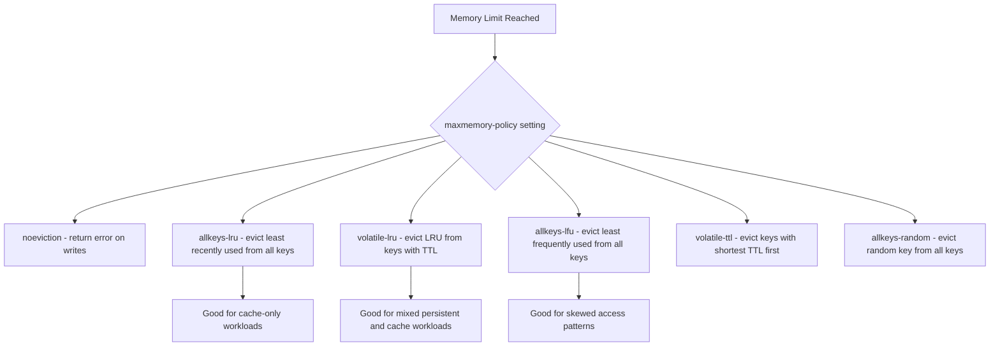

Lua scripts run atomically inside Redis, making them the correct tool for compare-and-set and complex read-modify-write operations:

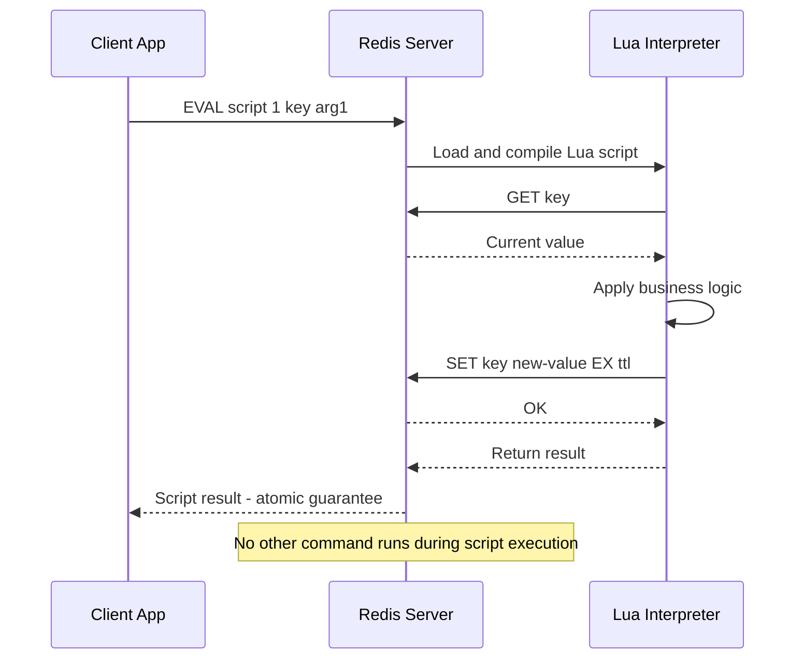

To harness Redis' full potential, consider the following best practices:

- **Set Time-To-Live (TTL):**
  Use TTL to automatically expire keys that are no longer needed, freeing up memory and improving performance. This is very important because Redis is an in-memory database, and managing memory effectively is crucial.

- **Memory Management:**
  Monitor memory usage closely. Use eviction policies to control memory usage when the dataset exceeds available RAM.

- **Persistence Tuning:**
  Choose the right balance between RDB and AOF persistence based on your application’s tolerance for data loss and performance requirements.

- **Replication and Clustering:**
  Configure replication and consider Redis Cluster for horizontal scaling in high-demand environments.

- **Security:**
  Secure your Redis deployment with proper authentication, and consider using TLS for encrypted communication, especially in production environments.

- **Monitoring and Logging:**
  Use tools like Redis Sentinel, Redis Enterprise, or third-party monitoring solutions to keep an eye on performance metrics and set up alerts for anomalies.

- **Client Libraries:**
  Choose the right Redis client library for your programming language. Popular libraries include `redis-py` for Python, `Jedis` for Java, and `node-redis` for Node.js.

---

## 8. Real-World Applications

Rate limiting is a canonical Redis pattern: atomic `INCR` plus `EXPIRE` enforces request windows without a database round-trip:

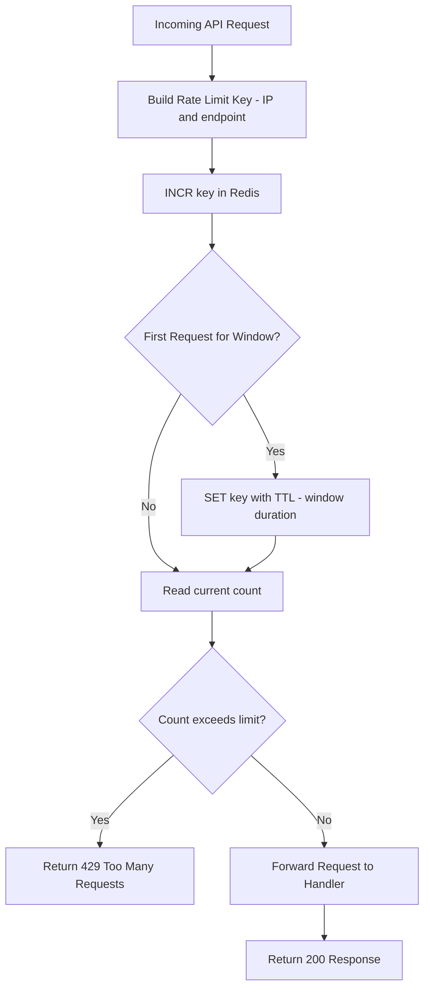

Redis is used across various industries to solve real-world problems:

- **E-commerce:**
  Improve site performance by caching product catalogs, user sessions, and shopping cart data.

- **Gaming:**
  Track user scores, leaderboards, and in-game events in real time.

- **Financial Services:**
  Implement real-time analytics and fraud detection by processing transactions and market data swiftly.

- **IoT:**
  Collect and analyze sensor data in real time, enabling prompt responses to environmental changes.

### 8.1 Case Study: Notion

Notion, a popular productivity tool, uses Redis to power its real-time collaboration features. By leveraging Redis' capabilities, in conjunction with WebAssembly and SQLite, Notion achieves low-latency data access and synchronization across devices. This allows users to collaborate seamlessly, even in offline scenarios.

Specifically, Notion employs Redis for:

- **Real-time updates:** Ensuring that changes made by one user are instantly reflected for others.
- **Session management:** Storing user sessions in Redis for quick access and high availability.
- **Caching:** Reducing the load on primary databases by caching frequently accessed data.
- **Rate limiting:** Preventing abuse of APIs by implementing rate limiting using Redis' atomic increment operations.
- **Data synchronization:** Ensuring that data remains consistent across distributed systems.
- **Event sourcing:** Using Redis Streams to capture and process events in real time.
- **Geospatial queries:** Enabling location-based features, such as finding nearby users or resources.
- **Analytics:** Processing and analyzing user interactions to improve the product experience.
- **Monitoring:** Using Redis' built-in monitoring tools to track performance and identify bottlenecks.

By leveraging Redis, Notion is able to support millions of concurrent users with hundreds of thousands of requests per second, all while maintaining low latency and high availability (and without their databases exploding 😀).

---

## 9. Redis Enterprise

Redis Streams allow multiple independent consumer groups to process the same event log at their own pace, with each consumer acknowledging processed entries via `XACK`:

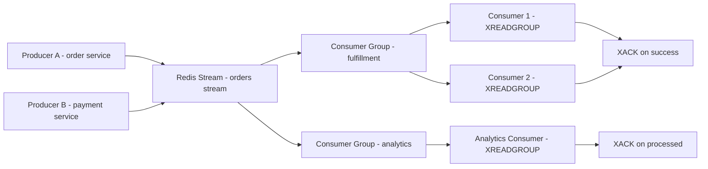

Redis Enterprise is the commercial version of Redis, offering additional features and support for enterprise-level applications. Key features include:

- **Active-Active Geo-Distribution:** Enables multi-region deployments with conflict-free replicated data types (CRDTs) for seamless data synchronization across regions.
- **Redis on Flash:** Allows Redis to use SSDs as an extension of RAM, enabling larger datasets at a lower cost.
- **Advanced Security Features:** Enhanced security options, including role-based access control (RBAC), encryption at rest, and more.
- **Multi-Model Database:** Supports multiple data models, including key-value, document, graph, and time-series data.
- **High Availability and Disaster Recovery:** Built-in features for automatic failover, backup, and recovery to ensure data integrity and availability.
- **Support for Multiple Redis Versions:** Allows users to run different versions of Redis on the same cluster, facilitating testing and migration.
- **Enhanced Monitoring and Analytics:** Advanced monitoring tools and dashboards for real-time insights into performance and usage patterns.
- **Integration with Cloud Providers:** Seamless integration with major cloud providers like AWS, Azure, and Google Cloud for easy deployment and scaling.
- **Enterprise Support:** Access to Redis Labs' support team for troubleshooting, performance tuning, and best practices.

Redis Enterprise is designed for organizations that require the highest levels of performance, scalability, and reliability. It is particularly well-suited for mission-critical applications where downtime is not an option.

Active-Active geo-distribution uses CRDTs to reconcile concurrent writes across regions without downtime:

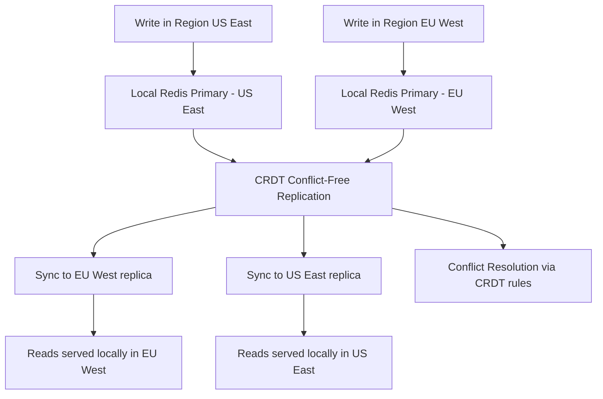

---

## 10. Competitors

Redis faces competition from other in-memory databases and caching solutions, including:

- **Memcached:** A high-performance distributed memory object caching system, primarily used for speeding up dynamic web applications by alleviating database load.
- **Aerospike:** A high-performance NoSQL database designed for real-time big data applications, offering strong consistency and low latency.
- **Cassandra:** A distributed NoSQL database designed to handle large amounts of data across many commodity servers, providing high availability with no single point of failure.
- **Hazelcast:** An in-memory data grid that provides distributed caching and data processing capabilities, suitable for high-throughput applications.
- **Apache Ignite:** An in-memory computing platform that provides distributed caching, data processing, and SQL querying capabilities.
- **Couchbase:** A NoSQL database that combines the capabilities of a document store and a key-value store, offering high performance and scalability.

However, Redis remains a popular choice due to its simplicity, rich feature set, and strong community support.

---

## 11. Redis Streams: Deep Dive

Redis Streams (introduced in Redis 5.0) are a persistent, append-only log data structure. Unlike pub/sub — which is fire-and-forget — streams retain messages and support consumer groups that track which messages have been acknowledged.

### 11.1. Core Stream Commands

```bash
# Append an entry (auto-generated ID based on timestamp + sequence)
XADD orders * customer_id 42 item "laptop" price 1299.00

# Append with an explicit ID (millisecond-timestamp-sequence)
XADD orders 1700000000000-0 customer_id 43 item "mouse" price 29.99

# Read the last 10 entries
XRANGE orders - + COUNT 10

# Read new entries since last read (blocking for 5 seconds if empty)
XREAD COUNT 10 BLOCK 5000 STREAMS orders $

# Consumer group: create and read
XGROUP CREATE orders fulfillment $ MKSTREAM
XREADGROUP GROUP fulfillment worker-1 COUNT 5 STREAMS orders >

# Acknowledge processed messages
XACK orders fulfillment 1700000000000-0

# Check pending (unacknowledged) messages
XPENDING orders fulfillment - + 10
```

### 11.2. Streams vs. Pub/Sub vs. Lists

| Capability               | Pub/Sub              | List (LPUSH/BRPOP)   | Streams                      |
| ------------------------ | -------------------- | -------------------- | ---------------------------- |
| Message persistence      | No (fire-and-forget) | Yes (until consumed) | Yes (configurable retention) |
| Multiple consumer groups | No                   | No                   | Yes                          |
| Message replay           | No                   | No                   | Yes (rewind to any ID)       |
| Pending message tracking | No                   | No                   | Yes (XPENDING)               |
| Back-pressure            | No                   | Manual               | Built-in via XREADGROUP      |

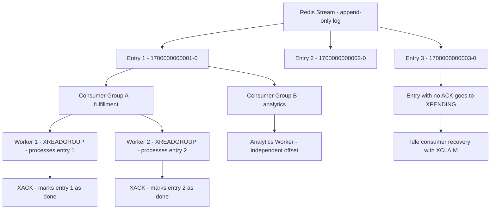

---

## 12. Advanced Lua Scripting Patterns

Lua scripts run atomically on the Redis server — no other command executes between the script’s first and last operation. This is the correct way to implement compare-and-set or complex read-modify-write operations.

### 12.1. Atomic Inventory Decrement

```lua
-- scripts/decrement_inventory.lua
-- KEYS[1]: inventory key (e.g. "inventory:product:42")
-- ARGV[1]: requested quantity
local current = tonumber(redis.call(‘GET’, KEYS[1]))
if current == nil or current < tonumber(ARGV[1]) then
  return redis.error_reply(‘INSUFFICIENT_STOCK’)
end
return redis.call(‘DECRBY’, KEYS[1], ARGV[1])
```

```python
import redis

r = redis.Redis()

# Load script once, use SHA for subsequent calls (avoids re-sending script bytes)
with open(‘scripts/decrement_inventory.lua’) as f:
    script = r.register_script(f.read())

try:
    remaining = script(keys=[‘inventory:product:42’], args=[5])
    print(f"Stock remaining: {remaining}")
except redis.ResponseError as e:
    if ‘INSUFFICIENT_STOCK’ in str(e):
        print("Not enough stock available")
```

### 12.2. Sliding Window Rate Limiter

```lua
-- KEYS[1]: rate limit key (e.g. "ratelimit:user:99:POST:/api/orders")
-- ARGV[1]: window size in milliseconds
-- ARGV[2]: maximum allowed requests
-- ARGV[3]: current timestamp in milliseconds
local key      = KEYS[1]
local window   = tonumber(ARGV[1])
local limit    = tonumber(ARGV[2])
local now      = tonumber(ARGV[3])
local min_time = now - window

redis.call(‘ZREMRANGEBYSCORE’, key, ‘-inf’, min_time)
local count = redis.call(‘ZCARD’, key)

if count >= limit then
  return 0
end

redis.call(‘ZADD’,   key, now, now)
redis.call(‘EXPIRE’, key, math.ceil(window / 1000))
return limit - count - 1  -- remaining requests in window
```

---

## 13. Memory Optimization Techniques

Redis is an in-memory store, so memory efficiency directly controls your infrastructure costs and performance ceiling.

### 13.1. Choosing the Right Encoding

Redis uses compact internal encodings automatically, but you can tune thresholds:

```bash
# Default thresholds (check with CONFIG GET)
CONFIG GET hash-max-listpack-entries   # 128: hashes <= 128 fields use listpack
CONFIG GET hash-max-listpack-value     # 64:  fields up to 64 bytes use listpack
CONFIG GET zset-max-listpack-entries   # 128
CONFIG GET list-max-listpack-size      # 128

# Increase limits for small objects to keep them in listpack (dense, CPU-cache-friendly)
CONFIG SET hash-max-listpack-entries 256
CONFIG SET hash-max-listpack-value   128
```

### 13.2. Memory Profiling Tools

```bash
# Total memory and fragmentation
INFO memory

# Sample memory usage of 100 random keys (shows per-key bytes)
MEMORY DOCTOR
MEMORY USAGE my:key          # exact bytes for a specific key

# List keys sorted by size (use sparingly in production)
redis-cli --bigkeys

# Detailed object encoding for a key
OBJECT ENCODING my:sorted:set
OBJECT IDLETIME my:key        # seconds since last access
OBJECT FREQ my:key            # LFU access frequency counter
```

### 13.3. Compression Strategy for Large String Values

```python
import redis
import zstd  # pip install zstandard

r = redis.Redis()

def set_compressed(key: str, value: str, ex: int = 3600) -> None:
    compressed = zstd.compress(value.encode())
    r.set(key, compressed, ex=ex)

def get_decompressed(key: str) -> str | None:
    data = r.get(key)
    if data is None:
        return None
    return zstd.decompress(data).decode()
```

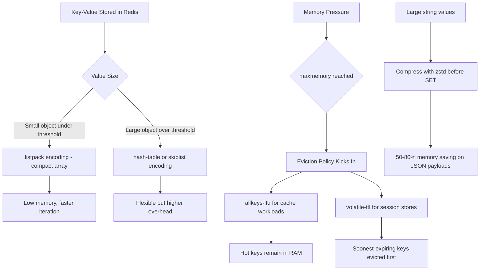

---

## 14. Redis Cluster Operations

Running Redis in cluster mode partitions your keyspace across multiple primary nodes, each responsible for a range of the 16,384 hash slots. Understanding cluster internals prevents surprises in production.

### 14.1. Setting Up a Minimal 3-Primary Cluster

```bash
# Start 6 Redis instances (3 primary + 3 replica) on ports 7000-7005
for port in 7000 7001 7002 7003 7004 7005; do
  redis-server \
    --port $port \
    --cluster-enabled yes \
    --cluster-config-file nodes-$port.conf \
    --cluster-node-timeout 5000 \
    --appendonly yes \
    --daemonize yes
done

# Create the cluster (--cluster-replicas 1 = one replica per primary)
redis-cli --cluster create \
  127.0.0.1:7000 127.0.0.1:7001 127.0.0.1:7002 \
  127.0.0.1:7003 127.0.0.1:7004 127.0.0.1:7005 \
  --cluster-replicas 1
```

### 14.2. Hash Tags for Multi-Key Operations

Keys are hashed by their full name by default. If two keys must live on the same slot (e.g., for `MGET` or Lua scripts), use hash tags — the portion inside `{}` determines the slot:

```python
# These two keys hash to the same slot because both use {user:42}
r.set(‘{user:42}.profile’,  ‘{"name":"Alice"}’)
r.set(‘{user:42}.settings’, ‘{"theme":"dark"}’)

# Safe to use in a pipeline or Lua script
pipe = r.pipeline()
pipe.get(‘{user:42}.profile’)
pipe.get(‘{user:42}.settings’)
profile, settings = pipe.execute()
```

### 14.3. Online Resharding

```bash
# Move 1000 slots from node A to node B without downtime
redis-cli --cluster reshard 127.0.0.1:7000 \
  --cluster-from <node-A-id> \
  --cluster-to   <node-B-id> \
  --cluster-slots 1000 \
  --cluster-yes
```

---

## 15. Conclusion

Redis stands out as a high-performance, versatile solution for modern data processing needs. Its in-memory architecture, combined with advanced persistence, replication, and clustering capabilities, makes it a top choice for caching, real-time analytics, session management, and beyond. By leveraging Redis’ rich set of features - from Lua scripting and transactions to geospatial indexing and streams - developers can build robust, scalable applications that deliver rapid, reliable performance.

Redis Streams bring durable, consumer-group-aware messaging that rivals purpose-built brokers for many use cases. Lua scripts provide atomic multi-step operations without sacrificing Redis’s single-threaded performance model. And careful memory management — through encoding tuning, compression, and eviction policies — keeps infrastructure costs predictable even at scale.

As technology continues to evolve, Redis remains at the forefront of innovation in high-performance data management, empowering developers to solve complex problems with elegance and efficiency.

Stay tuned for more insights into cutting-edge technologies as we explore further advancements in the world of tech innovations.

---
