import MdxLayout from "@/components/MdxLayout";

export const metadata = {
  title: "Reinforcement Learning for Autonomous Driving",
  description:
    "A deep-dive guide on leveraging reinforcement learning for autonomous driving, with theoretical foundations, advanced training strategies, evaluation metrics, and more for building robust self-driving systems.",
  topics: [
    "Artificial Intelligence",
    "Machine Learning",
    "Reinforcement Learning",
    "Autonomous Driving",
    "Deep Learning",
  ],
};

export default function RLAutonomousDrivingArticle({ children }) {
  return <MdxLayout>{children}</MdxLayout>;
}

# Reinforcement Learning for Autonomous Driving: Techniques, Challenges, and Applications

### Author: Son Nguyen

> Date: 2025-03-30

Autonomous driving has evolved into one of the most exciting and challenging applications of modern artificial intelligence. Reinforcement learning (RL) plays a critical role in teaching machines to navigate complex environments, make real-time decisions, and optimize long-term performance. This article provides an exhaustive exploration of reinforcement learning in the context of autonomous driving. We cover theoretical underpinnings, simulation environment setup, algorithm selection, training strategies, evaluation metrics, and practical deployment considerations. Whether you are a researcher, developer, or industry professional, this guide offers an in-depth reference to harness RL techniques for self-driving applications.

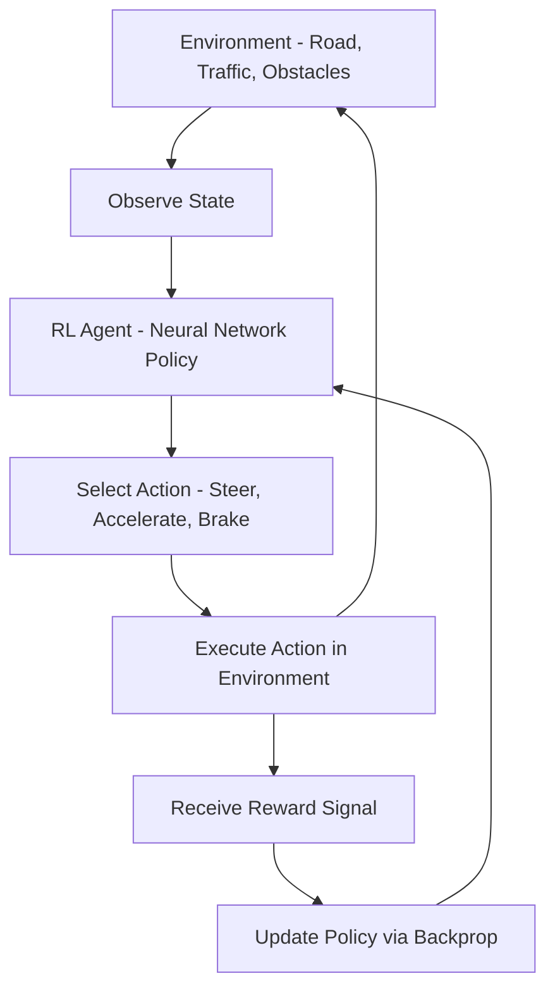

---

## 1. Introduction

### 1.1. The Promise of Autonomous Driving

Autonomous driving systems aim to mimic human driving capabilities while enhancing safety, efficiency, and convenience. Key applications include:

- **Passenger Vehicles:** Enhancing the driving experience and reducing accidents.
- **Delivery Systems:** Enabling efficient and reliable package delivery.
- **Public Transportation:** Paving the way for self-driving buses and shuttles.

### 1.2. Why Reinforcement Learning?

Reinforcement learning enables agents to learn optimal driving strategies by interacting with their environment. Its strengths lie in:

- **Adaptive Decision-Making:** Learning from trial and error to handle diverse scenarios.
- **Long-Term Optimization:** Balancing immediate rewards (e.g., avoiding obstacles) with long-term goals (e.g., reaching a destination safely).
- **End-to-End Learning:** Allowing integration of perception and control within a single framework.

---

## 2. Theoretical Foundations and Core Concepts

### 2.1. Key Principles of Reinforcement Learning

Reinforcement learning is built around the interaction between an agent and its environment. The core elements include:

- **Agent:** The system learning to make decisions, such as a self-driving car.
- **Environment:** The simulated world or real-world scenario the agent interacts with.
- **State:** A representation of the environment at a given time (e.g., sensor data, traffic signals).
- **Action:** A choice made by the agent, such as steering, braking, or accelerating.
- **Reward:** Feedback from the environment indicating the desirability of an action (e.g., positive reward for maintaining safe distance, negative reward for collisions).

### 2.2. Types of Reinforcement Learning Algorithms

Several classes of RL algorithms have been successfully applied in autonomous driving:

- **Value-Based Methods:** Such as Deep Q-Networks (DQN), where the agent learns the value of state-action pairs.
- **Policy-Based Methods:** Including methods like REINFORCE, where the agent directly learns a policy mapping states to actions.
- **Actor-Critic Methods:** Combining value and policy learning, examples include Proximal Policy Optimization (PPO) and Deep Deterministic Policy Gradient (DDPG) for continuous action spaces.
- **Model-Based RL:** Where the agent learns a model of the environment to plan better actions.

### 2.3. Markov Decision Processes (MDPs) in Autonomous Driving

Reinforcement learning problems are typically modeled as Markov Decision Processes (MDPs), which consist of:

- A set of states representing the driving conditions.
- A set of actions available to the vehicle.
- Transition probabilities that model how the environment responds to actions.
- A reward function that guides the learning process.
- The objective is to learn a policy that maximizes the expected cumulative reward over time.

The following diagram shows how a raw environment outcome is decomposed into a shaped reward signal covering collision penalties, lane keeping, speed targets, and comfort scores:

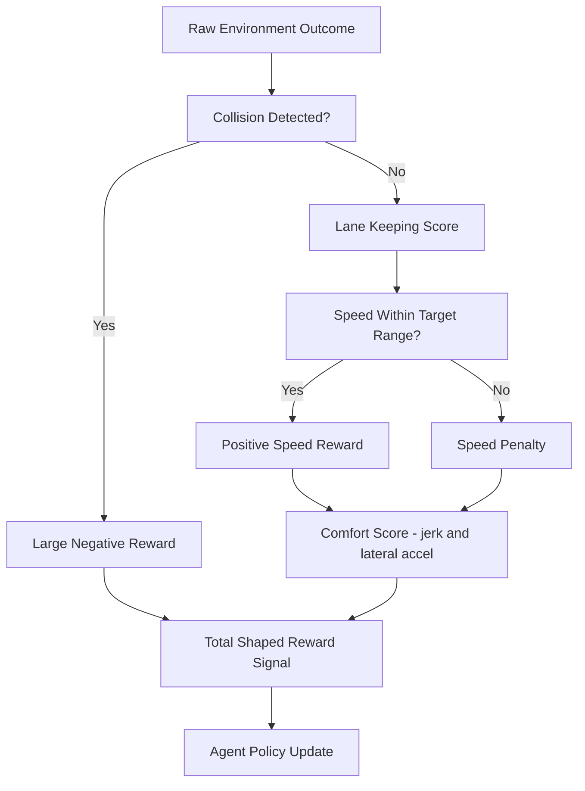

The following decision tree helps select the right RL algorithm based on action space type and the number of agents involved:

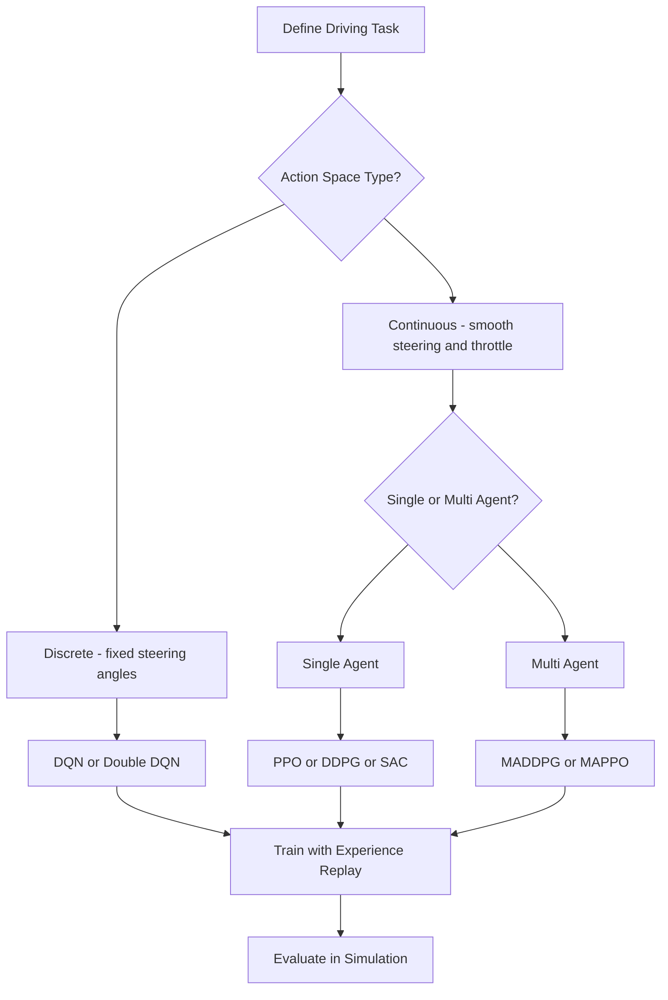

---

## 3. Data Preparation and Simulation Environment Setup

### 3.1. Simulation Environments

For autonomous driving, realistic simulation environments are essential. Common platforms include:

- **CARLA:** An open-source simulator providing realistic urban environments.
- **AirSim:** Developed by Microsoft, offering high-fidelity simulations for various vehicle types.
- **TORCS:** A racing car simulator often used for research in autonomous driving.

Simulators provide the following benefits:

- **Safe Training:** Allow agents to learn without real-world risks.
- **Scalable Data Generation:** Enable the generation of vast amounts of training data.
- **Customizability:** Provide control over environmental conditions, traffic, weather, and road conditions.

### 3.2. Sensor and State Representation

Accurate state representation is crucial for effective learning. Autonomous driving systems usually rely on:

- **Camera Feeds:** For visual perception.
- **LiDAR Data:** To measure distances and detect obstacles.
- **Radar:** For velocity and object detection.
- **GPS and IMU:** For precise positioning and orientation.

These sensor inputs are often preprocessed and combined into a state vector that the RL agent can utilize.

### 3.3. Data Normalization and Augmentation

Before training, the sensor data should be normalized and sometimes augmented:

- **Normalization:** Scale sensor values to a common range to facilitate learning.
- **Augmentation:** Simulate different weather conditions, lighting, and traffic scenarios to improve robustness.

---

## 4. Model Architectures and Algorithmic Approaches

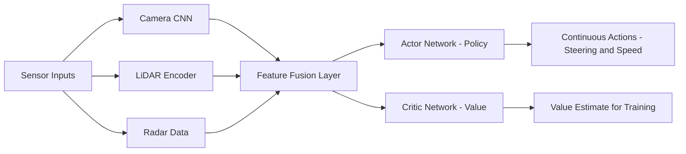

### 4.1. Selecting the Right RL Algorithm

Choosing an appropriate RL algorithm depends on the specifics of the driving task:

- **Discrete Action Spaces:** DQN variants are suitable if the actions (e.g., fixed steering angles) can be discretized.
- **Continuous Action Spaces:** Algorithms like DDPG or PPO are preferred for fine-grained control over acceleration and steering.
- **High-Dimensional State Spaces:** Convolutional neural networks (CNNs) can be integrated to process visual input from cameras.

### 4.2. Neural Network Architectures for RL

Modern RL agents commonly use deep neural networks for function approximation:

- **Convolutional Neural Networks (CNNs):** Process image data to extract relevant features.
- **Recurrent Neural Networks (RNNs):** Incorporate temporal dependencies in sequential sensor readings.
- **Fully Connected Networks:** Aggregate features from multiple sensors into a consolidated state representation.
- **Actor-Critic Architectures:** Utilize separate networks for policy and value estimation to stabilize learning.

### 4.3. Hyperparameter Tuning

Critical hyperparameters include:

- **Learning Rate:** Typically in the range of 1e-4 to 1e-3.
- **Discount Factor (Gamma):** Balances immediate and long-term rewards.
- **Batch Size:** Affects the stability and speed of learning; larger batch sizes often provide more stable updates.
- **Exploration Parameters:** Such as epsilon in epsilon-greedy strategies or noise parameters for continuous exploration.
- **Network Architecture:** Including depth and width of layers, which must be tuned for optimal performance.

### 4.4. Advanced Training Strategies

Enhance training efficiency and stability with:

- **Experience Replay:** Store and sample past experiences to break the correlation of sequential data.
- **Target Networks:** Use separate networks for stability in DQN-based methods.
- **Curriculum Learning:** Gradually increase task difficulty as the agent improves.
- **Multi-Agent Training:** In some scenarios, train multiple agents simultaneously to simulate real-world traffic interactions.

---

## 5. Implementation: End-to-End RL Workflow Using Python

Below is a practical implementation outline using popular RL libraries such as Stable-Baselines3 and OpenAI Gym with a custom autonomous driving environment.

### 5.1. Environment Setup

Before training, install the necessary packages:

```bash
pip install stable-baselines3 gym[box2d] torch opencv-python
```

### 5.2. Defining the Custom Environment

Create a custom Gym environment that simulates aspects of autonomous driving. A simplified version might look like this:

```python
import gym
from gym import spaces
import numpy as np

class AutonomousDrivingEnv(gym.Env):
    def __init__(self):
        super(AutonomousDrivingEnv, self).__init__()
        # Define action and observation space
        # For example, actions: steering angle and acceleration
        self.action_space = spaces.Box(low=np.array([-1.0, 0.0]), high=np.array([1.0, 1.0]), dtype=np.float32)
        # Observations: a simplified state vector [x, y, velocity, heading]
        self.observation_space = spaces.Box(low=-np.inf, high=np.inf, shape=(4,), dtype=np.float32)
        self.reset()

    def reset(self):
        self.state = np.array([0.0, 0.0, 0.0, 0.0])
        return self.state

    def step(self, action):
        # Simplistic physics for demonstration purposes
        steering, acceleration = action
        x, y, velocity, heading = self.state
        heading += steering * 0.1
        velocity += acceleration * 0.1
        x += velocity * np.cos(heading)
        y += velocity * np.sin(heading)
        self.state = np.array([x, y, velocity, heading])
        reward = -np.linalg.norm([x, y])  # negative reward for distance from origin
        done = np.linalg.norm([x, y]) > 100.0  # episode ends if too far from origin
        return self.state, reward, done, {}

    def render(self, mode="human"):
        pass  # Rendering can be implemented with a visualization library

# Instantiate the environment
env = AutonomousDrivingEnv()
```

### 5.3. Training with Stable-Baselines3

In this example, we use PPO (Proximal Policy Optimization) to train our agent:

```python
from stable_baselines3 import PPO

# Initialize the agent with the custom environment
model = PPO("MlpPolicy", env, verbose=1, learning_rate=1e-4, gamma=0.99, n_steps=2048)

# Train the agent
model.learn(total_timesteps=100000)

# Save the model
model.save("autonomous_driving_rl_model")
```

### 5.4. Evaluating the Trained Agent

Evaluate the agent’s performance over several episodes:

```python
episodes = 10
for episode in range(episodes):
    obs = env.reset()
    done = False
    total_reward = 0
    while not done:
        action, _states = model.predict(obs)
        obs, reward, done, info = env.step(action)
        total_reward += reward
    print(f"Episode {episode + 1}: Total Reward = {total_reward:.2f}")
```

The following state diagram shows the full training loop, from experience collection and replay buffer storage through policy updates to convergence evaluation:

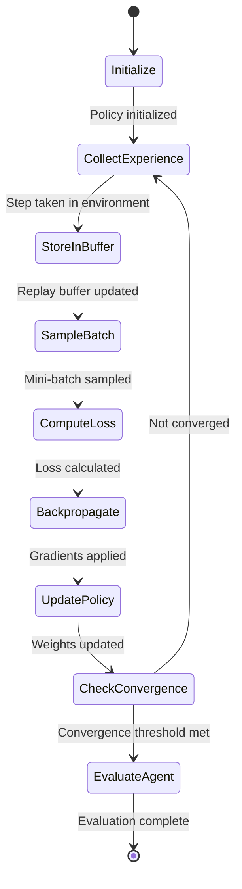

---

## 6. In-Depth Evaluation, Error Analysis, and Interpretability

### 6.1. Evaluation Metrics

To gauge the effectiveness of your RL agent for autonomous driving, consider:

- **Cumulative Reward:** Measures overall performance.
- **Episode Length:** Indicates the stability of driving behavior.
- **Safety Metrics:** Frequency of collisions or deviations from safe trajectories.
- **Generalization:** Agent’s performance in varied simulated scenarios.

### 6.2. Error Analysis

Perform thorough error analysis:

- **Analyzing Failure Cases:** Examine episodes where the agent failed or accumulated very low rewards.
- **Policy Behavior Visualization:** Record state-action trajectories to identify patterns leading to poor performance.
- **Parameter Sensitivity:** Test how variations in hyperparameters affect performance and stability.

### 6.3. Model Interpretability

Techniques to improve interpretability include:

- **Saliency Maps:** Identify which parts of the visual input the agent focuses on.
- **Policy Visualization:** Plot the decision boundaries learned by the network.
- **Explainable AI Tools:** Utilize frameworks to pinpoint which sensor inputs most influence the agent's decisions.

The following diagram shows the evaluation pipeline from running episodes through metric aggregation to deciding whether to approve or iterate:

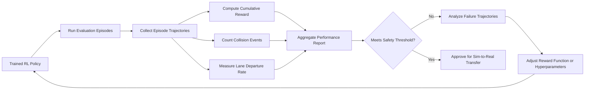

---

## 7. Deployment and Production Considerations

### 7.1. Model Optimization for Real-Time Inference

Optimize the model for deployment:

- **Model Compression:** Techniques such as pruning and quantization can reduce model size.
- **Efficient Inference Pipelines:** Batch processing and hardware acceleration (e.g., GPUs or TPUs) facilitate real-time decision-making.

### 7.2. Integration into Autonomous Driving Systems

Consider how the RL model integrates with other components:

- **Sensor Fusion:** Combine RL outputs with computer vision and mapping data.
- **Safety Overrides:** Implement rule-based systems to override risky RL actions.
- **Edge Deployment:** Deploy on specialized hardware for low-latency inference.

### 7.3. Monitoring and Maintenance

Establish protocols to continuously monitor and update the deployed model:

- **Real-Time Performance Metrics:** Track key indicators such as reaction time, safety events, and operational efficiency.
- **Feedback Loop:** Use live data to trigger periodic retraining and system updates.
- **A/B Testing:** Gradually roll out improvements and monitor real-world performance.

---

## 8. Advanced Topics and Future Directions

### 8.1. Multi-Agent Reinforcement Learning

In real-world autonomous driving, interaction with other vehicles is crucial. Multi-agent reinforcement learning explores:

- **Cooperative Driving:** Training agents to communicate and coordinate.
- **Competitive Scenarios:** Handling conflicts and ensuring safety in mixed traffic environments.

The following diagram shows how domain randomization in simulation produces a robust policy that can be iteratively fine-tuned with real-world driving data:

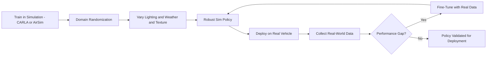

### 8.2. Simulation-to-Real Transfer

Transferring models from simulation to reality (Sim2Real) remains a key challenge:

- **Domain Randomization:** Train in varied simulated conditions to improve real-world adaptability.
- **Fine-Tuning in the Field:** Update models using real-world driving data.

### 8.3. Hierarchical Reinforcement Learning

Hierarchical approaches break down complex driving tasks into simpler sub-tasks, allowing for more efficient learning.

The following diagram shows how a safety shield layer intercepts the RL agent's proposed actions and enforces hard constraints before execution:

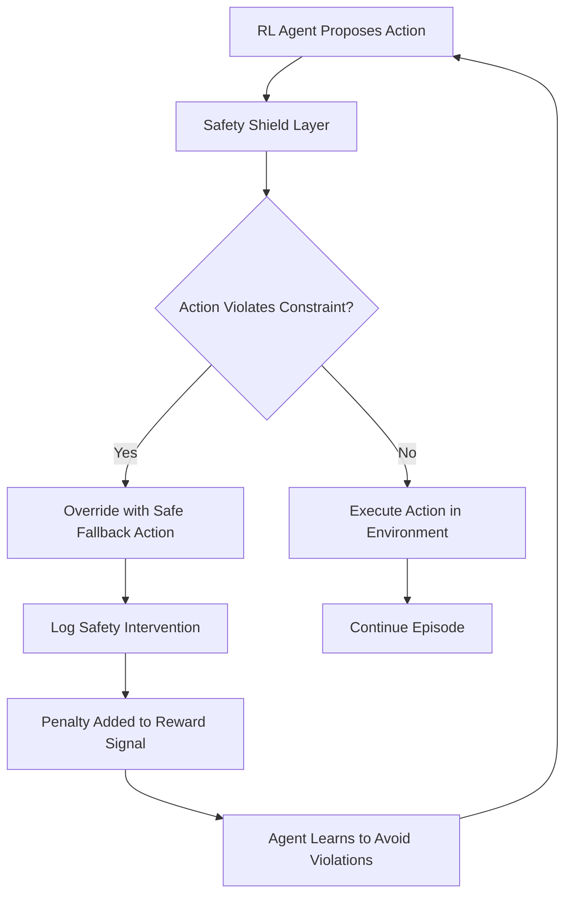

### 8.4. Ethical and Safety Considerations

Ensure that autonomous driving systems adhere to stringent ethical standards:

- **Safety Protocols:** Prioritize human safety in all decision-making processes.
- **Transparency:** Document decision-making processes and ensure accountability.
- **Bias Mitigation:** Continuously audit the system for any unintended biases.

The following diagram shows how hierarchical RL decomposes high-level navigation goals into sub-goals handled by a shared low-level controller:

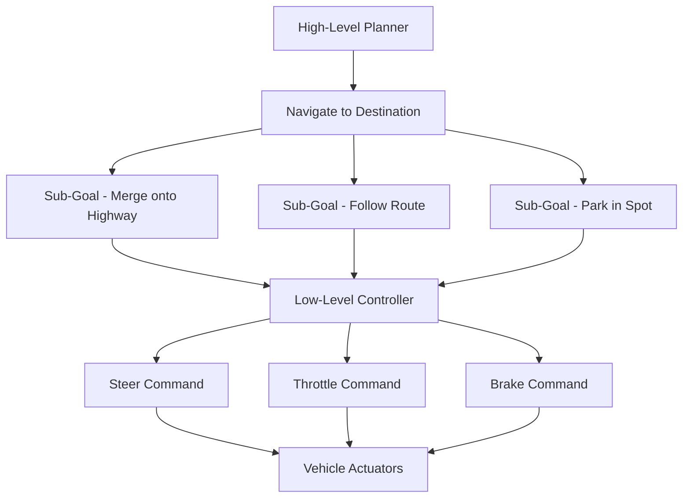

---

## 9. Sensor Fusion Architecture

A real self-driving system never relies on a single modality. Sensor fusion combines camera, LiDAR, and radar data into a unified perception representation before passing it to the RL policy. The fusion layer must handle sensor dropout gracefully, since sensors can fail or be occluded during operation.

### 9.1. Early, Mid, and Late Fusion

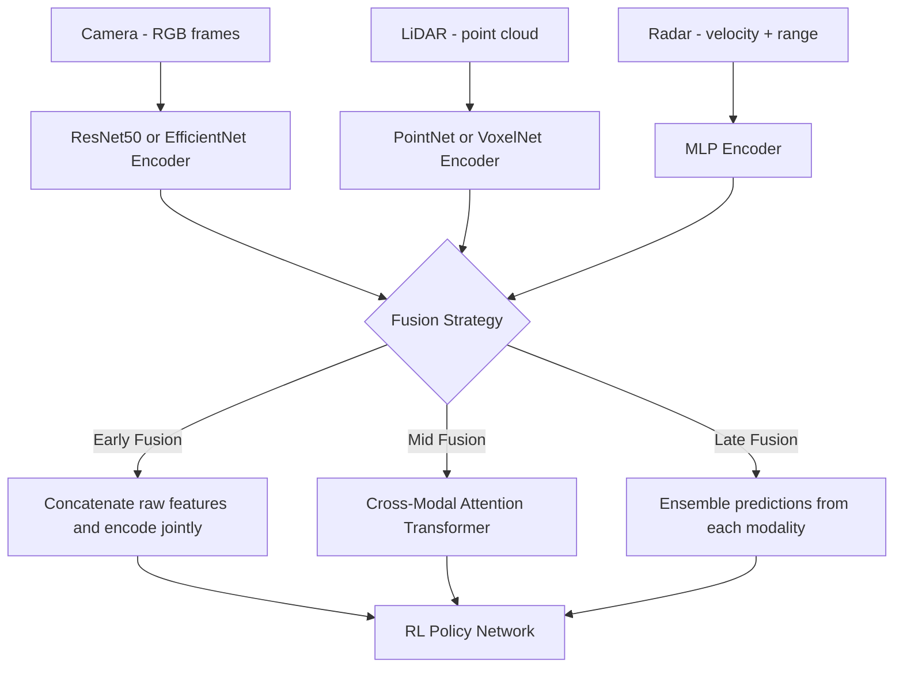

### 9.2. Cross-Modal Attention Fusion (Mid Fusion)

Mid fusion via cross-modal attention is the preferred approach in production systems because it allows each modality to attend to features from other modalities, capturing correlations that early concatenation misses.

```python
import torch
import torch.nn as nn

class CrossModalFusion(nn.Module):
    """Fuse camera and LiDAR features using cross-modal attention."""

    def __init__(self, embed_dim: int = 256, num_heads: int = 8):
        super().__init__()
        self.camera_proj = nn.Linear(512, embed_dim)   # ResNet feature dim -> embed
        self.lidar_proj  = nn.Linear(256, embed_dim)   # PointNet feature dim -> embed
        self.attn_cam2lid = nn.MultiheadAttention(embed_dim, num_heads, batch_first=True)
        self.attn_lid2cam = nn.MultiheadAttention(embed_dim, num_heads, batch_first=True)
        self.norm = nn.LayerNorm(embed_dim)
        self.out  = nn.Linear(embed_dim * 2, embed_dim)

    def forward(
        self,
        cam_features: torch.Tensor,    # (B, N_cam, 512)
        lidar_features: torch.Tensor,  # (B, N_lid, 256)
    ) -> torch.Tensor:
        cam   = self.camera_proj(cam_features)    # (B, N_cam, D)
        lidar = self.lidar_proj(lidar_features)   # (B, N_lid, D)

        # Camera attends to LiDAR
        cam_fused, _   = self.attn_cam2lid(cam, lidar, lidar)
        # LiDAR attends to Camera
        lidar_fused, _ = self.attn_lid2cam(lidar, cam, cam)

        # Pool and merge
        cam_pool   = self.norm(cam_fused).mean(dim=1)    # (B, D)
        lidar_pool = self.norm(lidar_fused).mean(dim=1)  # (B, D)

        merged = torch.cat([cam_pool, lidar_pool], dim=-1)
        return self.out(merged)   # (B, D)
```

### 9.3. Sensor Dropout Resilience

During training, randomly zero out entire sensor inputs at a rate of 10-20% per modality. This forces the policy to learn to operate with partial observations, matching real-world reliability requirements.

```python
def apply_sensor_dropout(
    cam_feat: torch.Tensor,
    lid_feat: torch.Tensor,
    rad_feat: torch.Tensor,
    dropout_prob: float = 0.15,
) -> tuple:
    """Zero out entire sensor streams randomly during training."""
    if torch.rand(1).item() < dropout_prob:
        cam_feat = torch.zeros_like(cam_feat)
    if torch.rand(1).item() < dropout_prob:
        lid_feat = torch.zeros_like(lid_feat)
    if torch.rand(1).item() < dropout_prob:
        rad_feat = torch.zeros_like(rad_feat)
    return cam_feat, lid_feat, rad_feat
```

---

## 10. Sim-to-Real Transfer Challenges and Solutions

The performance gap between simulation and reality is one of the biggest barriers to deploying RL-trained policies on physical vehicles. The gap arises from differences in sensor noise, actuator latency, road surface variation, and lighting conditions.

### 10.1. Domain Randomization Strategy

Domain randomization deliberately varies simulation parameters during training so the policy learns to be robust to a wide distribution of conditions, covering the real-world distribution as a subset.

```python
import random
import numpy as np

class DomainRandomizer:
    """Apply randomized perturbations to simulation parameters each episode."""

    def randomize_lighting(self, env):
        """Vary sun angle, cloud cover, and time of day."""
        env.set_sun_altitude(random.uniform(10, 80))          # degrees
        env.set_cloud_coverage(random.uniform(0.0, 1.0))
        env.set_fog_density(random.uniform(0.0, 0.3))

    def randomize_road(self, env):
        """Vary road friction and surface texture."""
        friction = random.gauss(mu=0.8, sigma=0.15)
        env.set_road_friction(np.clip(friction, 0.3, 1.2))

    def randomize_camera(self, env):
        """Add simulated camera noise and small mounting offsets."""
        env.camera.set_noise(
            blur_sigma=random.uniform(0.0, 1.5),
            brightness_jitter=random.uniform(-0.2, 0.2),
        )
        env.camera.set_pose_offset(
            x_noise=random.gauss(0, 0.02),   # meters
            y_noise=random.gauss(0, 0.02),
            yaw_noise=random.gauss(0, 0.5),  # degrees
        )

    def randomize_traffic(self, env, max_vehicles: int = 30):
        """Spawn a random number of vehicles with random behaviors."""
        n = random.randint(0, max_vehicles)
        env.spawn_npc_vehicles(n, behavior=random.choice(["normal", "aggressive", "cautious"]))

    def apply_all(self, env):
        self.randomize_lighting(env)
        self.randomize_road(env)
        self.randomize_camera(env)
        self.randomize_traffic(env)
```

### 10.2. Real-World Fine-Tuning Pipeline

After a policy is trained in simulation, a small amount of real-world driving data is collected with a human safety driver. The policy is then fine-tuned on this real data using a lower learning rate, preserving the broad capability learned in simulation while adapting to the specific vehicle and sensor suite. The following diagram shows this iterative real-world fine-tuning pipeline:

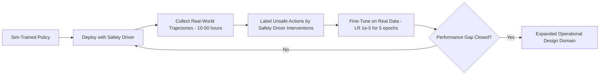

---

## 11. Safety Verification Methods

Deploying a reinforcement learning policy on a physical vehicle requires formal safety verification beyond empirical testing. Three complementary approaches are used in production systems.

### 11.1. Formal Safety Specifications with Signal Temporal Logic

Signal Temporal Logic (STL) allows engineers to express safety invariants mathematically and verify that a policy satisfies them during simulation evaluation.

```python
# STL property: always keep distance >= 2m from the vehicle ahead
# phi = G[0,T] (distance(t) >= 2.0)
def verify_safe_following_distance(
    trajectory: list,    # list of dicts with "time" and "distance_ahead"
    min_dist: float = 2.0,
    horizon: float = 30.0,
) -> bool:
    """Return True if the policy never violates the following distance constraint."""
    relevant = [s for s in trajectory if s["time"] <= horizon]
    return all(s["distance_ahead"] >= min_dist for s in relevant)

# Run verification over 1000 evaluation episodes
violations = 0
for episode in evaluation_episodes:
    if not verify_safe_following_distance(episode["trajectory"]):
        violations += 1

violation_rate = violations / len(evaluation_episodes)
print(f"STL violation rate: {violation_rate:.4f}")
assert violation_rate < 0.001, "Policy fails safety certification threshold"
```

### 11.2. Runtime Safety Shield

A safety shield is a rule-based system that intercepts every action proposed by the RL policy and overrides it when the proposed action would cause an imminent constraint violation. The shield runs deterministically and can be formally verified, unlike the neural policy.

```python
class SafetyShield:
    """Rule-based safety layer wrapping an RL policy."""

    def __init__(self, min_ttc: float = 1.5):
        self.min_ttc = min_ttc  # minimum time-to-collision in seconds

    def compute_ttc(self, ego_speed: float, lead_distance: float, lead_speed: float) -> float:
        relative_speed = ego_speed - lead_speed
        if relative_speed <= 0:
            return float("inf")  # closing gap
        return lead_distance / relative_speed

    def safe_action(
        self,
        proposed: dict,       # {"steering": float, "throttle": float, "brake": float}
        obs: dict,            # sensor observations
    ) -> dict:
        ttc = self.compute_ttc(
            obs["ego_speed"],
            obs["lead_distance"],
            obs["lead_speed"],
        )
        if ttc < self.min_ttc:
            # Override: emergency braking, log intervention
            return {"steering": proposed["steering"], "throttle": 0.0, "brake": 1.0}
        return proposed
```

The following diagram shows how safety certification metrics are evaluated before approving a policy for limited real-world testing:

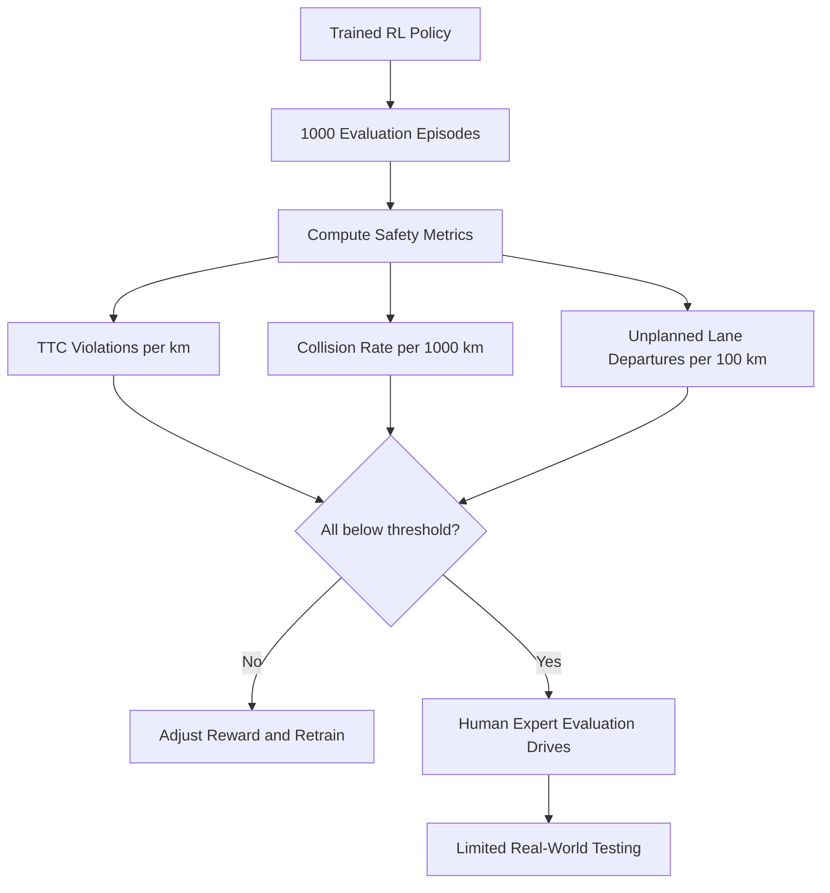

---

## 12. Multi-Agent Coordination in Traffic

Training a single RL agent in isolation produces policies optimized for a world where other vehicles behave according to scripted rules. Real traffic involves other autonomous agents, human drivers with unpredictable behavior, and coordination scenarios like merging and intersection crossing.

### 12.1. MADDPG for Cooperative Intersection Crossing

Multi-Agent DDPG (MADDPG) trains each vehicle's policy with a centralized critic during training (which observes all agents' states and actions) but decentralized execution at runtime (each vehicle acts on its own observations only).

```python
from stable_baselines3 import DDPG
import numpy as np

class IntersectionEnv:
    """Simplified two-vehicle intersection crossing environment."""

    def __init__(self, n_agents: int = 2):
        self.n_agents = n_agents
        self.agents   = [f"vehicle_{i}" for i in range(n_agents)]

    def reset(self):
        return {agent: self._obs(agent) for agent in self.agents}

    def step(self, actions: dict):
        new_obs, rewards, dones, infos = {}, {}, {}, {}
        for agent, action in actions.items():
            obs, rew, done, info = self._step_agent(agent, action)
            new_obs[agent] = obs
            rewards[agent] = rew
            dones[agent]   = done
            infos[agent]   = info
        return new_obs, rewards, dones, infos

    def _cooperative_reward(self, agent_id: str, reached_goal: bool, collision: bool) -> float:
        """Reward structure that incentivizes throughput, not just individual goals."""
        individual = 1.0 if reached_goal else (-5.0 if collision else 0.0)
        # Small team reward for all agents clearing the intersection
        team_bonus = 0.1 * sum(1 for a in self.agents if self._agent_cleared(a))
        return individual + team_bonus
```

The following diagram shows the multi-agent coordination flow, where decentralized policies share a centralized critic during training to align cooperative rewards:

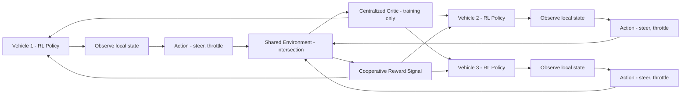

---

## 13. Best Practices for Reinforcement Learning in Autonomous Driving

- **Robust Simulation:** Use realistic and diverse simulation scenarios for training.
- **Incremental Complexity:** Start with basic driving tasks and progressively add complexity.
- **Comprehensive Evaluation:** Monitor both quantitative metrics and qualitative behavior.
- **Continuous Improvement:** Regularly update models with new data and feedback.
- **Safety First:** Always implement safety-critical redundancies and overrides.

---

## 14. Conclusion

Reinforcement learning stands at the forefront of autonomous driving research, offering innovative solutions to complex decision-making challenges on the road. This guide has presented a comprehensive exploration of the theoretical foundations, simulation environments, algorithmic strategies, and practical considerations required for building robust RL-based autonomous driving systems. By embracing advanced training techniques, thorough evaluation, and careful deployment practices, researchers and practitioners can pave the way for safer, more efficient self-driving vehicles. As the field evolves, continuous innovation and strict adherence to ethical standards will be key to achieving real-world success.

---

## 15. Further Resources

- **Stable-Baselines3 Documentation:** [https://stable-baselines3.readthedocs.io](https://stable-baselines3.readthedocs.io)
- **OpenAI Gym Documentation:** [https://gym.openai.com](https://gym.openai.com)
- **CARLA Simulator:** [https://carla.org](https://carla.org)
- **Reinforcement Learning Research:** Journals and conferences such as NeurIPS, ICML, and ICLR offer cutting-edge research.
- **Autonomous Driving Datasets:** Explore datasets like KITTI and Waymo for real-world driving scenarios.
- **Ethical AI Guidelines:** Resources from organizations such as the IEEE and Partnership on AI provide best practices for safety and fairness.

Embark on your journey into reinforcement learning for autonomous driving, and continue to push the boundaries of innovation in self-driving technology. Happy coding and safe driving!
