import MdxLayout from "@/components/MdxLayout";

export const metadata = {
  title: "SRE Incident Response: A Playbook for High-Stakes Outages",
  description:
    "A step-by-step incident response guide for SRE teams, covering roles, communications, mitigation strategies, and postmortems.",
  topics: ["DevOps", "Monitoring", "System Design", "Reliability"],
};

export default function SREIncidentResponseArticle({ children }) {
  return <MdxLayout>{children}</MdxLayout>;
}

# SRE Incident Response: A Playbook for High-Stakes Outages

### Author: Son Nguyen

> Date: 2024-12-12

Incident response is a performance sport. When systems fail, teams need structure, clarity, and a common operating model. This playbook outlines how to detect incidents early, coordinate during mitigation, and learn effectively afterward. But before diving into the incident playbook, it is essential to understand the foundational SRE concepts that determine when an incident should be declared in the first place.

---

## 1. SRE Foundations: SLIs, SLOs, and SLAs

Site Reliability Engineering is built on the idea that reliability is a feature — one that can be measured, budgeted, and traded off against velocity. The three core metrics that formalize this are SLIs, SLOs, and SLAs.

### 1.1. Service Level Indicators (SLIs)

An SLI is a quantitative measure of some aspect of the service that users care about. Common SLIs include:

- **Availability:** The proportion of requests that succeed (e.g., 200-series HTTP responses divided by total requests).
- **Latency:** The proportion of requests served within an acceptable duration (e.g., p99 latency under 300ms).
- **Error rate:** The proportion of requests that return errors (e.g., 5xx responses divided by total requests).
- **Throughput:** Requests per second the system can handle while maintaining SLI targets.

SLIs should be measured from the user's perspective, not the server's. A load balancer's success rate is a better SLI than an individual backend node's health check.

### 1.2. Service Level Objectives (SLOs)

An SLO is a target value for an SLI over a rolling time window. For example:

- "99.9% of requests will return a 2xx response over a rolling 30-day window."
- "95% of API requests will complete in under 200ms over a rolling 7-day window."

SLOs define the threshold between "the system is healthy" and "the system is degraded enough to act." They are internal targets — not promises to customers.

### 1.3. Service Level Agreements (SLAs)

An SLA is an SLO with consequences. It is a contract between the service provider and the customer that defines what happens when the SLO is not met — typically financial credits or penalty clauses. SLAs should always be less aggressive than internal SLOs so the team has a buffer to detect and fix issues before breaching the contract.

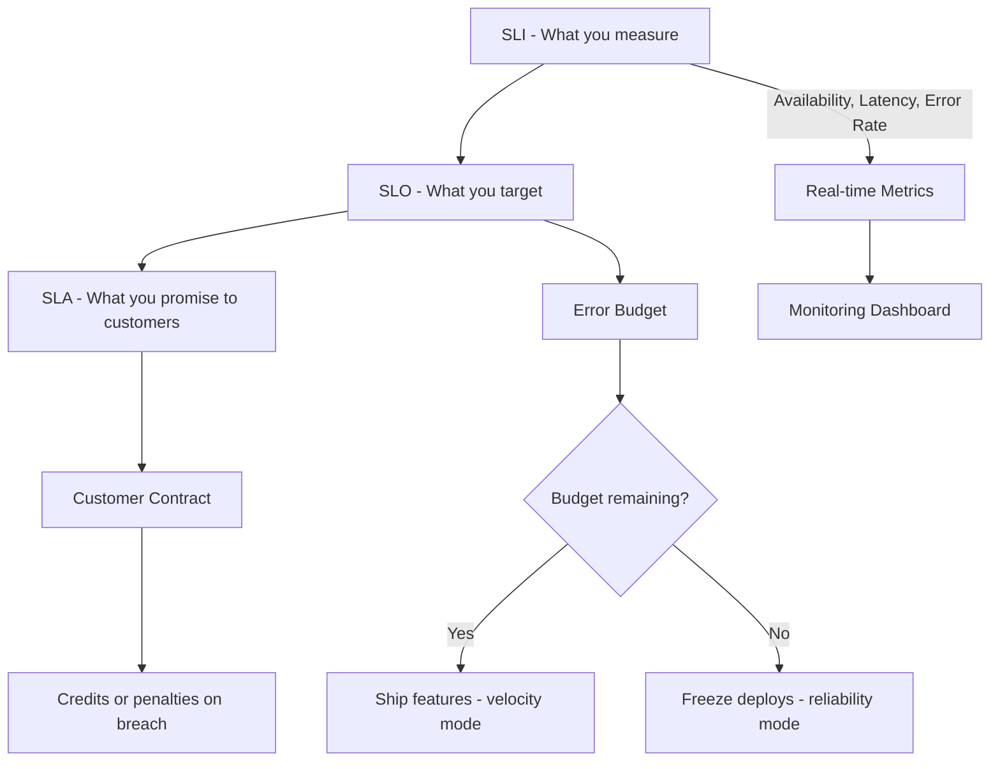

### 1.4. Error Budgets

The error budget is the inverse of the SLO. If your SLO is 99.9% availability over 30 days, your error budget is 0.1% — roughly 43 minutes of downtime per month. The error budget is the mechanism that balances reliability with feature velocity:

- **Budget remaining:** Teams can ship freely, take risks, and deploy frequently.
- **Budget exhausted:** Deploys freeze, the team shifts to reliability work, and any remaining incidents are treated with maximum urgency.

Error budgets turn the reliability conversation from subjective ("Is the system reliable enough?") into objective ("We have 12 minutes of budget left this month").

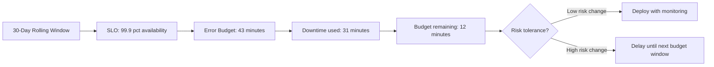

### 1.5. SRE vs Traditional Ops

| Aspect             | Traditional Ops                   | SRE                                    |
| ------------------ | --------------------------------- | -------------------------------------- |
| Reliability target | "As reliable as possible"         | Defined by SLO — no more, no less      |
| Deploy velocity    | Slowed by manual gates            | Governed by error budget               |
| Incident trigger   | Gut feeling or customer complaint | SLI breaches SLO threshold             |
| Postmortem culture | Blame-oriented                    | Blameless — focus on systems           |
| On-call            | Reactive firefighting             | Proactive with automation and runbooks |
| Toil               | Accepted as normal                | Measured and eliminated                |

---

## 2. The Incident Lifecycle

Before defining severity levels, it helps to see the full lifecycle of an incident from detection through hardening:

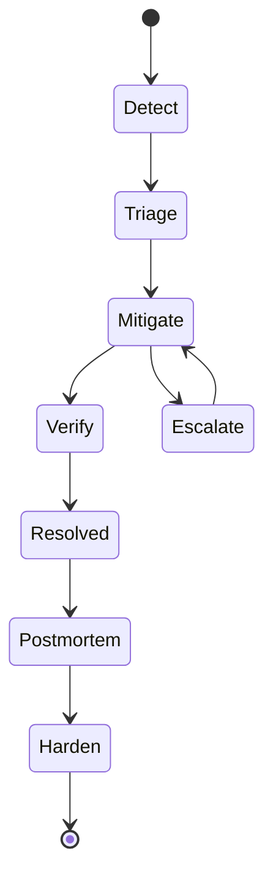

Each phase has a clear purpose: detect the anomaly, determine severity, stop the bleeding, verify the fix, understand what happened, and prevent recurrence. The rest of this article walks through each phase with concrete practices.

---

## 3. Define incident severity levels

Severity levels help teams prioritize:

- **SEV-1:** Customer-impacting outage or security incident.
- **SEV-2:** Major degradation with limited blast radius.
- **SEV-3:** Partial impact or degraded performance with workarounds.
- **SEV-4:** Minor issues tracked for later fixes.

Define who can declare an incident and how escalation works.

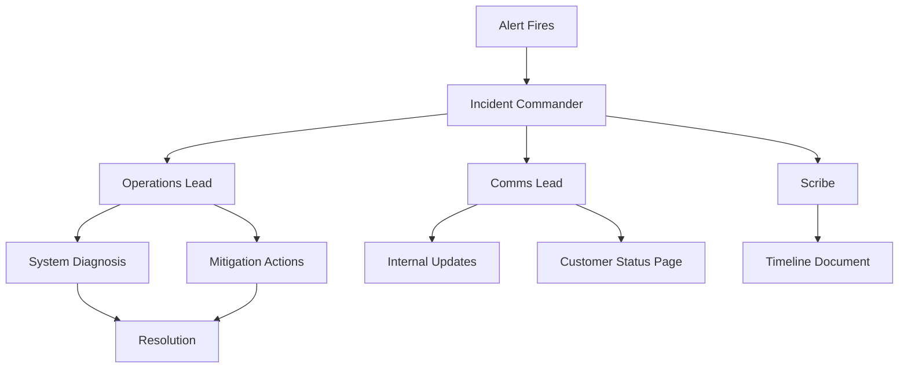

---

## 4. Establish incident roles

Clear roles prevent confusion:

- **Incident Commander (IC):** Owns coordination and decision flow.
- **Operations Lead:** Executes mitigation and system changes.
- **Comms Lead:** Updates stakeholders and customer channels.
- **Scribe:** Captures timeline and key decisions.

Roles can rotate, but responsibilities must be explicit.

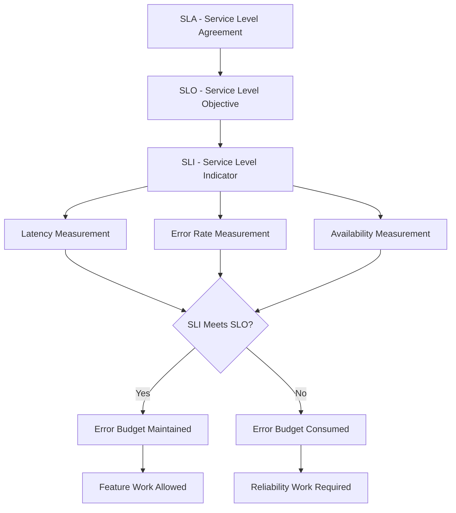

---

## 5. Detect and verify quickly

Fast verification avoids false alarms:

- Confirm metrics and alert sources.
- Check user reports and support tickets.
- Validate the current deployment or change window.

If in doubt, treat it as real until proven otherwise.

Detection signals typically flow from multiple independent sources before an incident is declared:

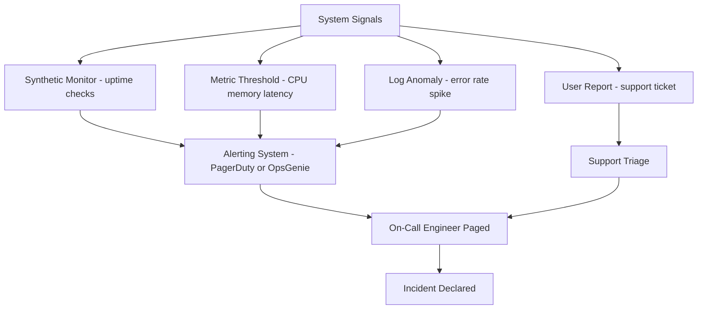

---

## 6. Stabilize the system

Focus on restoring service, not finding root cause:

- Roll back the last risky change.
- Shed load or disable non-critical features.
- Shift traffic to healthy regions or read replicas.

Keep mitigation steps reversible when possible.

---

## 7. Communicate clearly

Communication is part of the incident response:

- Set a regular update cadence (every 15 to 30 minutes).
- Separate internal chatter from external status updates.
- Use plain language for customers and exec stakeholders.

Trust is built by predictable updates, even when the news is bad.

---

## 8. Track the timeline

A good timeline powers good postmortems:

- Log every change, alert, and decision.
- Capture timestamps for mitigation actions.
- Note when customer impact started and ended.

Use a shared incident doc so the team has one source of truth.

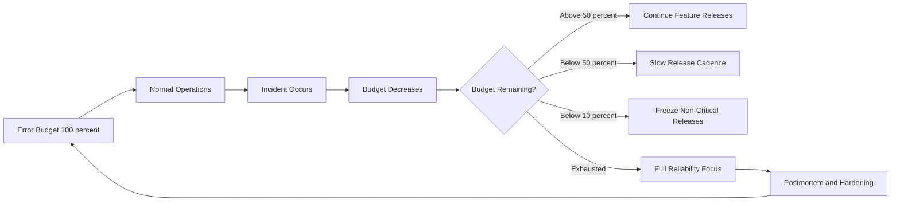

---

## 9. Mitigation decision patterns

When an incident is confirmed, a structured decision tree helps the on-call engineer choose the fastest path to stabilization:

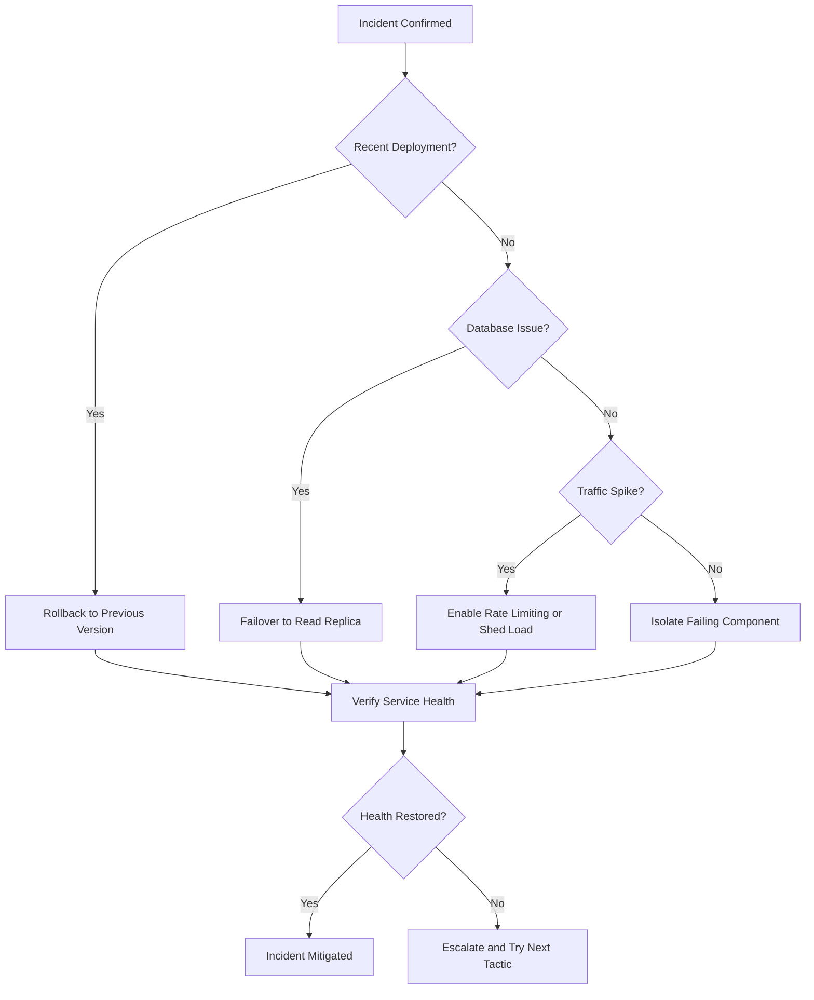

Useful decision patterns during outages include:

- **Rollback-first:** revert changes before deep diagnosis.
- **Feature isolation:** disable non-critical features that share dependencies.
- **Capacity rebalancing:** reroute traffic to reduce pressure on hot services.

Agree on a default approach before the incident happens.

---

## 10. Verification and recovery

After mitigation, confirm recovery:

- Validate core user journeys manually.
- Watch error rates and latency for at least one full release interval.
- Ensure downstream systems catch up after backlogs.

Recovery is not complete until system health is stable and backlogs are cleared.

The following sequence shows the communication cadence between the Incident Commander, engineering, and the customer-facing status page throughout the incident lifecycle:

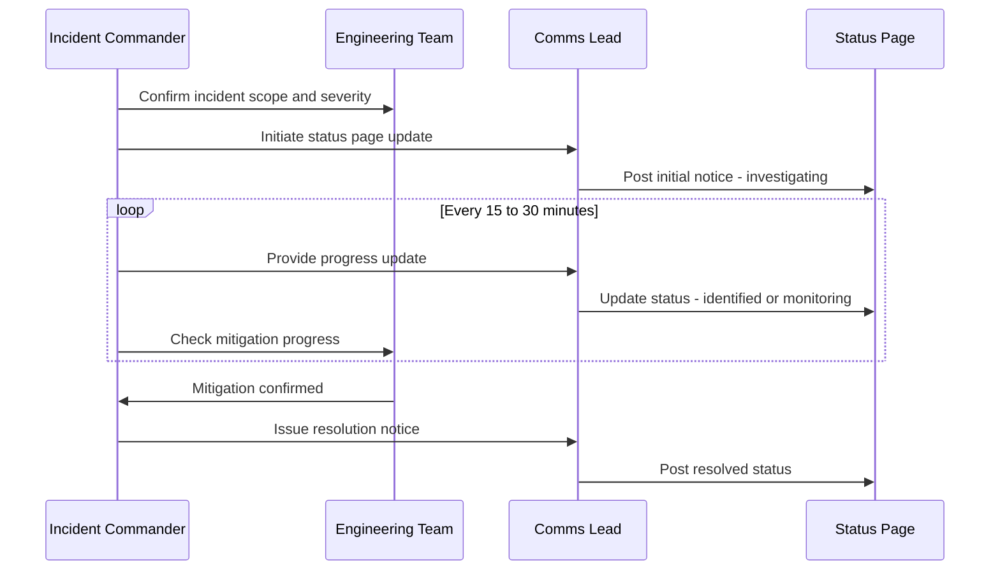

---

## 11. Post-incident review

Postmortems should be blameless and actionable:

- Summarize impact, duration, and customer symptoms.
- Explain root cause and contributing factors.
- Identify detection gaps and response friction.

Every incident should produce corrective and preventive actions.

---

## 12. Hardening the system

Follow-up work is where reliability improves:

- Add alerts for missed signals.
- Improve runbooks and automated rollbacks.
- Test failure scenarios with game days and chaos drills.

Resilience is built by systematic reinforcement, not heroics.

The escalation sequence below shows how a SEV-2 page moves through on-call tiers before reaching executive awareness:

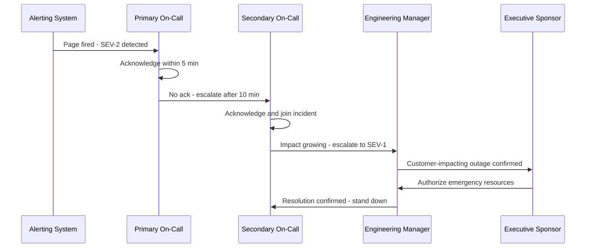

Postmortem findings are only useful if they produce tracked, owned action items. The diagram below shows how corrective and preventive actions flow from a postmortem document into the engineering backlog and through to closure:

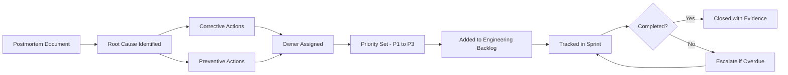

---

## 13. Incident response metrics

Measure maturity by tracking:

- Mean time to detect (MTTD).
- Mean time to mitigate (MTTM).
- Mean time to resolve (MTTR).
- Incident recurrence rates.

Metrics reveal whether your process is improving over time.

---

## 14. Incident response checklist

- Declare severity and assign roles.
- Mitigate quickly, prioritize customer impact.
- Communicate on a fixed cadence.
- Capture the timeline while events happen.
- Write a postmortem with follow-up owners.

Strong incident response practices keep outages short, stakeholders informed, and teams learning forward.

---

## 15. SLI and SLO definitions with real examples

Service Level Indicators (SLIs) and Service Level Objectives (SLOs) give teams a measurable definition of "healthy." Without them, incidents become debates rather than clear breach events.

### SLI definition pattern

An SLI measures a specific behavior of the system. Effective SLIs are:

- **Quantifiable:** expressible as a ratio or histogram bucket.
- **User-centric:** measuring something the user actually experiences.
- **Correlated with impact:** a drop in SLI means a degraded user experience.

Common SLI categories:

| SLI Type     | Example                                  | Measurement Method   |
| ------------ | ---------------------------------------- | -------------------- |
| Availability | Successful requests / total requests     | HTTP 5xx error rate  |
| Latency      | Requests completing under 200ms          | p99 histogram bucket |
| Error rate   | Failed payment attempts / total attempts | Metric counter       |
| Throughput   | Messages processed per second            | Kafka consumer rate  |
| Freshness    | Data age at time of read                 | Timestamp delta      |

### Prometheus alerting rules example

```yaml
# slo-alerts.yaml
groups:
  - name: slo.availability
    rules:
      # Burn rate alert: high severity when 1-hour burn exhausts 2% of 30-day budget
      - alert: AvailabilitySLOHighBurnRate
        expr: |
          (
            sum(rate(http_requests_total{status=~"5.."}[1h]))
            /
            sum(rate(http_requests_total[1h]))
          ) > (14.4 * 0.001)
        for: 2m
        labels:
          severity: critical
          slo: availability
        annotations:
          summary: "High error burn rate - availability SLO at risk"
          description: >
            Current error rate {{ $value | humanizePercentage }}
            exceeds the 14.4x burn rate threshold.
            At this rate the 30-day error budget will be exhausted in under 2 hours.

      # Low burn rate alert for extended degradation
      - alert: AvailabilitySLOLowBurnRate
        expr: |
          (
            sum(rate(http_requests_total{status=~"5.."}[6h]))
            /
            sum(rate(http_requests_total[6h]))
          ) > (6 * 0.001)
        for: 15m
        labels:
          severity: warning
          slo: availability
        annotations:
          summary: "Sustained elevated error rate detected"

  - name: slo.latency
    rules:
      - alert: LatencyP99SLOBreach
        expr: |
          histogram_quantile(0.99,
            sum(rate(http_request_duration_seconds_bucket[5m])) by (le, service)
          ) > 0.5
        for: 5m
        labels:
          severity: warning
          slo: latency
        annotations:
          summary: "p99 latency SLO breach on {{ $labels.service }}"
```

---

## 16. Error budget math and policy

Error budgets convert abstract SLOs into actionable governance decisions. The formula is straightforward:

```
Error budget = 1 - SLO target
Monthly minutes = 30 days × 24 hours × 60 minutes = 43,200 minutes

Example: SLO = 99.9%
  → Error budget = 0.1%
  → Allowed downtime = 43,200 × 0.001 = 43.2 minutes per month
```

### Error budget policy tiers

| Budget Remaining | Policy     | Action                                                    |
| ---------------- | ---------- | --------------------------------------------------------- |
| 100% - 50%       | Normal     | Feature releases proceed                                  |
| 50% - 25%        | Caution    | Review high-risk changes before merging                   |
| 25% - 10%        | Restricted | Freeze non-critical releases; prioritize reliability work |
| Below 10%        | Emergency  | All engineering focuses on reliability                    |
| Exhausted        | Incident   | Postmortem required; release freeze until next period     |

### Error budget burn rate

Burn rate tells you how quickly you are consuming the budget relative to the SLO window:

```
Burn rate = actual error rate / (1 - SLO target)

If SLO = 99.9% and actual error rate = 1.44%:
  Burn rate = 0.0144 / 0.001 = 14.4x

At 14.4x burn rate, a 30-day budget is exhausted in ~50 hours.
```

Multi-window alerting catches both fast burns (short, severe incidents) and slow burns (long, subtle degradations) by pairing a short window with a high burn rate and a long window with a moderate burn rate.

---

## 17. Runbook template

A runbook eliminates guesswork at 3am. Each runbook should map directly to an alert and contain everything the on-call engineer needs without requiring deep system knowledge.

```markdown
# Runbook: PaymentService HighErrorRate

---

### Alert reference

- Alert name: PaymentServiceHighErrorRate
- Severity: SEV-2
- SLO impacted: payment.availability (99.95%)

---

### Symptoms

- HTTP 5xx rate above 1% on /api/v1/payments endpoints
- User reports: payments failing at checkout

---

### Immediate triage steps

1. Check deployment history:
   kubectl rollout history deployment/payment-service -n prod

2. Check recent pod restarts:
   kubectl get pods -n prod | grep payment

3. Check upstream dependency health:
   curl -s https://internal-status.example.com/payment-gateway

4. Check database connection pool:
   psql $DB_CONN -c "SELECT count(\*) FROM pg_stat_activity WHERE state = 'active';"

---

### Mitigation playbooks

#### Rollback to previous version

kubectl rollout undo deployment/payment-service -n prod

# Wait 2 minutes, then verify:

kubectl rollout status deployment/payment-service -n prod

#### Enable payment circuit breaker

kubectl set env deployment/payment-service CIRCUIT_BREAKER_ENABLED=true -n prod

#### Shed load to backup processor

kubectl set env deployment/payment-service FALLBACK_PROCESSOR=stripe-backup -n prod

---

### Recovery verification

- Error rate returns below 0.05% for 10 consecutive minutes
- Run smoke test: ./scripts/payment-smoke-test.sh
- Confirm no pending retries in queue:
  redis-cli LLEN payment_retry_queue

---

### Escalation path

- 0-10 min: On-call engineer handles
- 10-20 min: Escalate to payment team lead
- 20+ min: Escalate to engineering director
```

---

## 18. Alerting best practices

Poorly configured alerting is itself a reliability risk. Alert fatigue causes engineers to ignore pages, while under-alerting causes missed incidents.

### Alert design principles

```yaml
# Good alert: actionable, specific, linked to an SLO
- alert: CheckoutLatencyDegraded
  expr: histogram_quantile(0.95, rate(checkout_duration_seconds_bucket[5m])) > 2.0
  for: 3m
  labels:
    severity: warning
    team: checkout
    runbook: "https://runbooks.internal/checkout-latency"
  annotations:
    summary: "Checkout p95 latency {{ $value }}s exceeds 2s SLO"
    impact: "Users experiencing slow checkout. Estimated NPS impact: -15 points."

# Bad alert: too broad, no runbook, not tied to user impact
- alert: HighCPU
  expr: node_cpu_seconds_total > 80
  labels:
    severity: warning
```

### Alert quality checklist

| Property               | Description                                    |
| ---------------------- | ---------------------------------------------- |
| Actionable             | Engineer can do something specific in response |
| Linked to impact       | Tied to an SLO or user-visible symptom         |
| Has a runbook          | URL in annotation pointing to mitigation steps |
| Has a threshold window | Uses `for:` to prevent flapping                |
| Ownership is clear     | `team:` label routes to the right people       |
| Tested                 | Alert is tested with real or synthetic load    |

---

## 19. Chaos engineering for incident preparedness

Game days and chaos experiments validate your incident response muscle memory before production failures do it for you.

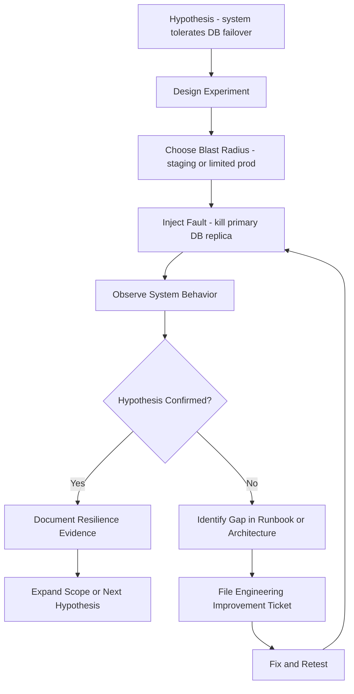

### Chaos experiment types

| Experiment                | What it validates                     | Tooling                         |
| ------------------------- | ------------------------------------- | ------------------------------- |
| Database failover         | Replica promotion and app reconnect   | Chaos Monkey, manual kill       |
| Pod termination           | Service restarts and health checks    | LitmusChaos, kubectl delete pod |
| Network latency injection | Timeout handling and circuit breakers | tc netem, Toxiproxy             |
| CPU/memory pressure       | Autoscaling triggers and OOM handling | stress-ng, LitmusChaos          |
| Dependency unavailability | Fallbacks and graceful degradation    | Toxiproxy, iptables rules       |

```typescript
// Minimal chaos experiment runner using Toxiproxy SDK
import { ToxiproxyClient } from "toxiproxy-node-client";

async function runLatencyExperiment() {
  const client = new ToxiproxyClient("http://localhost:8474");

  // Create a proxy that introduces 200ms latency on database port
  const proxy = await client.createProxy({
    name: "postgres_chaos",
    listen: "0.0.0.0:5433",
    upstream: "postgres:5432",
  });

  await proxy.addToxic({
    name: "latency_500ms",
    type: "latency",
    attributes: { latency: 500, jitter: 50 },
  });

  console.log("Injecting 500ms latency on DB connection for 60 seconds...");
  await new Promise((resolve) => setTimeout(resolve, 60_000));

  await proxy.removeToxic("latency_500ms");
  await client.deleteProxy("postgres_chaos");
  console.log(
    "Chaos experiment complete. Check dashboards for timeout impact.",
  );
}
```

---

## 20. Conclusion

Incident response matures through deliberate practice, not just procedures on paper. The lifecycle described in this playbook - detection, triage, mitigation, communication, resolution, postmortem, and hardening - is a loop, not a line. Each iteration leaves the system better instrumented, the team better practiced, and the runbooks more precise.

The organizations that handle incidents best share a few traits: they define SLOs before incidents happen, they practice chaos engineering before failures are forced on them, and they treat postmortems as learning opportunities rather than blame sessions. Reliability is not built during incidents. It is built in the calm periods between them.
