import MdxLayout from "@/components/MdxLayout";

export const metadata = {
  title:
    "A Comprehensive Deep Dive into SSR, SSG, and ISR in Modern Web Development",
  description:
    "An in-depth guide exploring server-side rendering (SSR), static site generation (SSG), and incremental static regeneration (ISR), and their impact on modern web development.",
  topics: ["Web Development", "Web Architecture", "Performance", "SEO"],
};

export default function RenderingStrategiesArticle({ children }) {
  return <MdxLayout>{children}</MdxLayout>;
}

# A Deep Dive into SSR, SSG, and ISR in Modern Web Development

### Author: Son Nguyen

> Date: 2024-03-08

In the modern era of web development, delivering fast, scalable, and SEO-friendly experiences is paramount. Developers now have a rich toolkit of rendering strategies to choose from. This article delves deeply into three popular techniques: **Server-Side Rendering (SSR)**, **Static Site Generation (SSG)**, and **Incremental Static Regeneration (ISR)**. We’ll explore the inner workings of each method, discuss their respective benefits and challenges, and provide detailed code examples along with real-world scenarios. By the end, you’ll be equipped to make informed decisions when architecting your next web project.

---

## 1. Introduction

Rendering strategies have evolved significantly from the days when client-side JavaScript ruled the web. Today, the choice between pre-rendering pages at build time or generating them on the fly can have a dramatic impact on performance, SEO, and user experience. Here’s a brief overview:

- **Server-Side Rendering (SSR):** Pages are rendered on the server on every request. This ensures that users (and search engines) always receive fresh, fully rendered HTML.
- **Static Site Generation (SSG):** Pages are pre-built during the build process. The resulting static files are served via a CDN for extremely fast load times.
- **Incremental Static Regeneration (ISR):** A hybrid model that builds pages statically at first but regenerates them in the background when new data is available, offering a balance between performance and freshness.

Let’s explore these strategies in detail.

The following diagram compares the data flow of SSR, SSG, and ISR:


The core distinction between these strategies comes down to when data is fetched — at build time or per request:

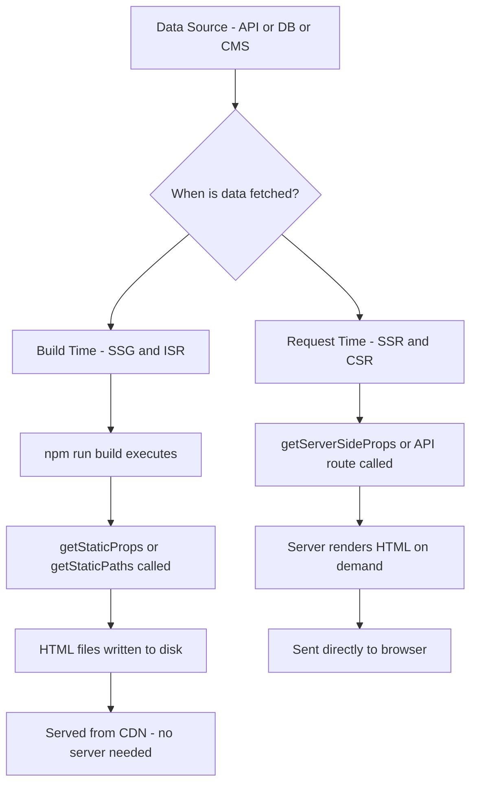

---

## 2. Server-Side Rendering (SSR)

### 2.1. Overview and Workflow

**SSR** renders your web page on the server at the time of each request. The server fetches the necessary data, composes the HTML, and sends it directly to the client. This means that users see a fully rendered page immediately, without waiting for client-side JavaScript to execute.

#### SSR Workflow:

1. **User Request:** The browser sends a request for a page.
2. **Data Fetching:** The server retrieves necessary data (e.g., from a database or external API).
3. **HTML Rendering:** The server processes the data and generates the complete HTML.
4. **Response Delivery:** The server sends the HTML to the client.
5. **Hydration:** After the initial render, JavaScript loads and “hydrates” the page to add interactivity.

### 2.2. Advantages and Challenges

#### Advantages:

- **SEO-Friendly:** Search engines can index fully rendered HTML.
- **Improved First Paint:** Users see content immediately, which is especially important for slower devices or connections.
- **Dynamic Content:** Ideal for pages that need to display frequently changing or personalized data.

#### Challenges:

- **Increased Server Load:** Every request requires server computation.
- **Latency:** Each request must wait for the server to fetch data and render the page.
- **Complex Caching:** Implementing effective caching strategies is critical to offset performance costs.

### 2.3. Practical Example with Next.js

Below is an SSR example using Next.js’s `getServerSideProps`:

```jsx
// pages/ssr-example.js
export async function getServerSideProps(context) {
  // Fetch dynamic data on each request
  const res = await fetch("https://api.example.com/data");
  const data = await res.json();

  return { props: { data } };
}

export default function SSRExample({ data }) {
  return (
    <div>
      <h1>Server-Side Rendered Data</h1>
      <pre>{JSON.stringify(data, null, 2)}</pre>
    </div>
  );
}
```

In this example, every request causes Next.js to execute `getServerSideProps`, ensuring that users always receive the most current data.

Adding an edge cache layer dramatically reduces origin load by serving repeated SSR responses directly from the CDN:

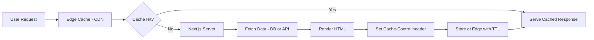

---

## 3. Static Site Generation (SSG)

### 3.1. Overview and Workflow

**SSG** generates HTML pages at build time rather than on each request. These pages are then served as static files, often via a CDN, which significantly boosts load times.

#### SSG Workflow:

1. **Build Time Rendering:** During the build process, data is fetched and pages are pre-rendered.
2. **Deployment:** The static files (HTML, CSS, JavaScript) are deployed to a server or CDN.
3. **Serving:** On a user’s request, the pre-built HTML is served almost instantly.

### 3.2. Advantages and Challenges

#### Advantages:

- **Performance:** Static pages load quickly as they require minimal server processing.
- **Scalability:** Static files can be cached globally, reducing server load.
- **Reliability:** Fewer moving parts generally translate to fewer runtime errors.

#### Challenges:

- **Content Freshness:** Content remains as fresh as the last build. For frequently updated data, this may not be ideal.
- **Long Build Times:** Large sites with many pages can take longer to build.
- **Interactivity:** Pure SSG may require additional client-side JavaScript to handle dynamic features.

### 3.3. Practical Example with Next.js

Below is a simple SSG example using Next.js’s `getStaticProps`:

```jsx
// pages/ssg-example.js
export async function getStaticProps() {
  // Fetch data at build time
  const res = await fetch("https://api.example.com/data");
  const data = await res.json();

  return { props: { data } };
}

export default function SSGExample({ data }) {
  return (
    <div>
      <h1>Static Site Generated Data</h1>
      <pre>{JSON.stringify(data, null, 2)}</pre>
    </div>
  );
}
```

This page is pre-built during the build process, meaning that subsequent requests result in very fast responses from a CDN.

With dynamic routes, `getStaticPaths` drives the build — iterating over every known slug and calling `getStaticProps` for each one before writing the output to disk:

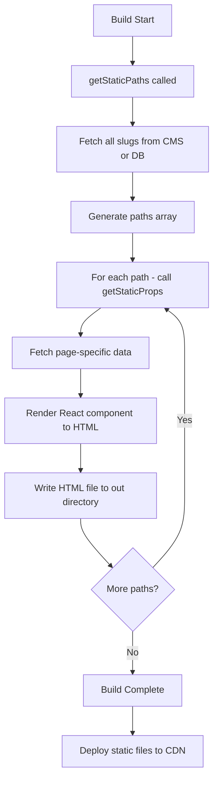

---

## 4. Incremental Static Regeneration (ISR)

### 4.1. Overview and Workflow

**ISR** bridges the gap between SSR and SSG. It allows pages to be statically generated at build time while still enabling updates to content post-deployment. When a page becomes “stale” based on a defined revalidation interval, it is regenerated in the background upon the next request.

#### ISR Workflow:

1. **Initial Build:** Pages are generated as static HTML during the build.
2. **Serving and Staleness:** The static page is served until the revalidation time expires.
3. **Background Regeneration:** On a subsequent request after expiration, the page is regenerated in the background.
4. **Updated Delivery:** Once regenerated, the updated static page is served to future visitors.

### 4.2. Advantages and Challenges

#### Advantages:

- **Best of Both Worlds:** Combines the speed of static pages with the ability to update content dynamically.
- **Improved Scalability:** Static pages can be served from a CDN, while updates occur asynchronously.
- **Freshness:** Ensures that data is relatively up-to-date without the overhead of SSR on every request.

#### Challenges:

- **Regeneration Delay:** There can be a slight window where users see stale content until the new page is generated.
- **Complexity:** Managing revalidation times and cache invalidation requires careful planning.
- **Monitoring:** Additional tools may be necessary to monitor regeneration processes and performance.

### 4.3. Practical Example with Next.js

Below is an ISR example using Next.js’s `getStaticProps` with a `revalidate` property:

```jsx
// pages/isr-example.js
export async function getStaticProps() {
  // Fetch data at build time
  const res = await fetch("https://api.example.com/data");
  const data = await res.json();

  return {
    props: { data },
    revalidate: 10, // Regenerate the page at most once every 10 seconds
  };
}

export default function ISRExample({ data }) {
  return (
    <div>
      <h1>Incremental Static Regeneration Data</h1>
      <pre>{JSON.stringify(data, null, 2)}</pre>
    </div>
  );
}
```

With ISR, the page served is static, yet updates occur seamlessly in the background based on the revalidation interval.

ISR uses a stale-while-revalidate pattern: the cached page is served immediately on every request, and regeneration runs in the background only after the revalidation window expires:

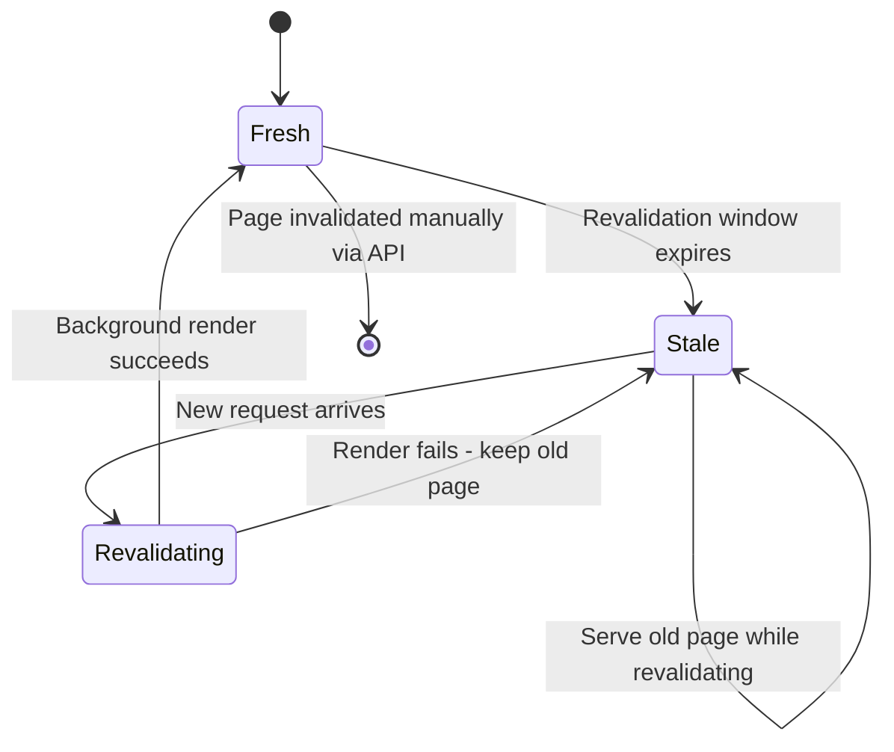

---

## 5. Deep Comparison: SSR vs. SSG vs. ISR

### 5.1. Feature Comparison

| Feature               | SSR                                         | SSG                                   | ISR                                                |
| --------------------- | ------------------------------------------- | ------------------------------------- | -------------------------------------------------- |
| **Rendering Time**    | At each request                             | At build time                         | At build time with background updates              |
| **Content Freshness** | Always up-to-date                           | As fresh as last build                | Updated at defined revalidation intervals          |
| **Performance**       | Potentially slower due to server processing | Extremely fast (served from CDN)      | Fast, with periodic background regeneration        |
| **Scalability**       | Higher server load; dynamic per request     | Scales easily with static files       | Scales well with hybrid static-dynamic approach    |
| **Ideal Use Cases**   | Personalized, dynamic pages                 | Blogs, documentation, marketing sites | E-commerce, news sites, frequently updated content |

### 5.2. Choosing the Right Strategy

- **Use SSR when:**
- Data changes frequently and personalization is required.
- SEO is critical and the content must always reflect the latest state.
- **Use SSG when:**
- Content is mostly static (e.g., blogs, landing pages, documentation).
- You require fast load times and can tolerate infrequent updates.
- **Use ISR when:**
- You need the performance benefits of static sites with the flexibility of dynamic updates.
- The content is updated regularly but doesn’t require real-time data on every request.

Use this decision tree to choose the right rendering strategy for a given page:

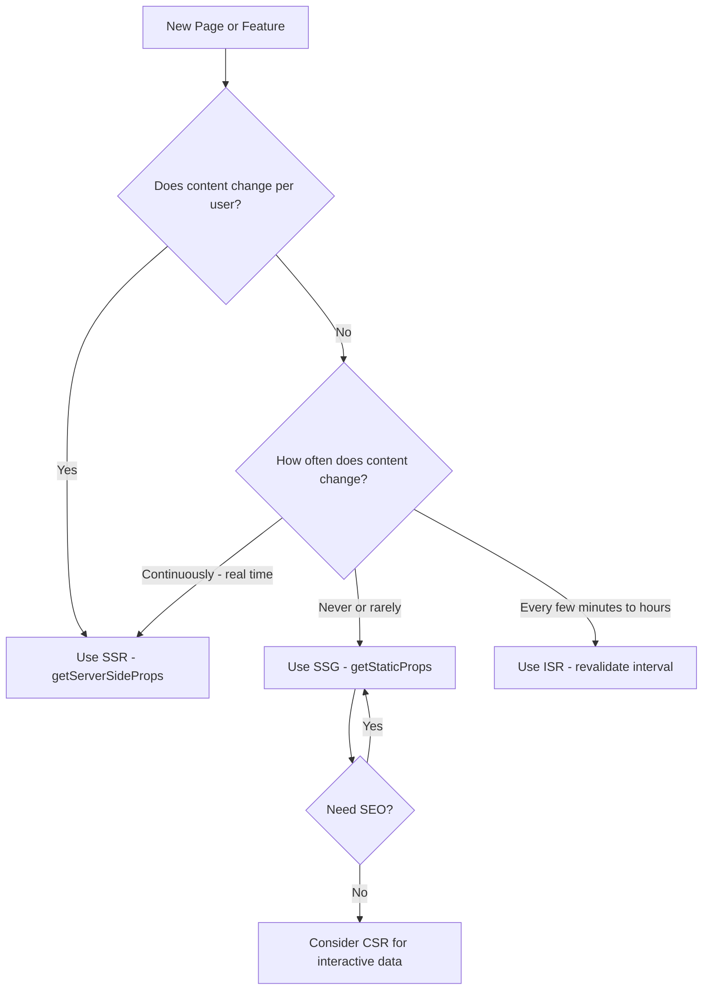

---

## 6. Best Practices and Real-World Considerations

The hydration process diagram shows how a server-rendered HTML page gains interactivity on the client:

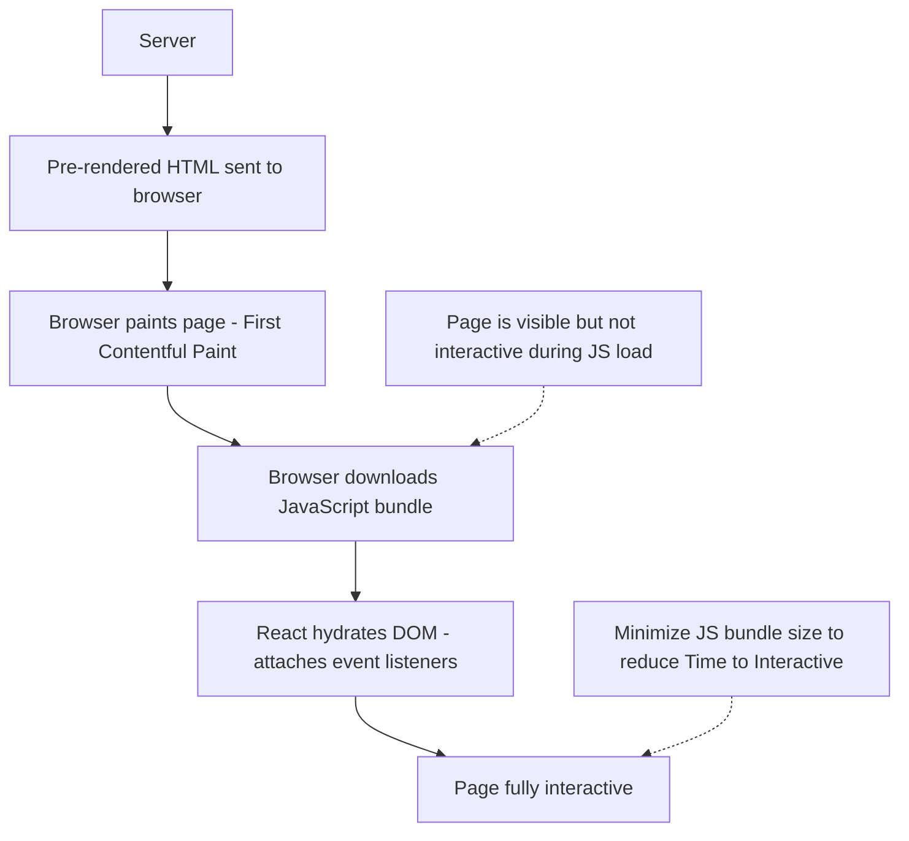

### 6.1. Optimizing Performance and SEO

- **Caching Strategies:**
  Implement smart caching using CDNs to serve pre-rendered pages and reduce server load. For SSR, consider edge caching to serve dynamic content faster.

- **Hydration Optimization:**
  Minimize the JavaScript bundle size to accelerate hydration on SSR/ISR pages. Use code-splitting and lazy loading to defer non-critical code.

- **SEO Best Practices:**
  Ensure meta tags, structured data, and semantic HTML are in place. For SSR and ISR pages, pre-rendered content helps search engines crawl and index your site more effectively.

### 6.2. Managing Data and API Calls

- **Error Handling:**
  Implement robust error handling in your data-fetching logic. Consider fallback mechanisms and error pages to maintain user experience in case of API failures.

- **Monitoring and Analytics:**
  Use monitoring tools to track rendering performance, cache hit ratios, and page regeneration statistics. Analytics help fine-tune revalidation intervals and caching strategies.

### 6.3. Development Workflow and CI/CD

- **Build Optimization:**
  Optimize build times for SSG/ISR by caching dependencies and incremental builds. Tools like Next.js support faster builds via incremental compilation.

- **Version Control and Testing:**
  Use Git and continuous integration pipelines to test rendering strategies, ensuring that new changes do not adversely affect performance or SEO.

---

## 7. Advanced Topics and Future Directions

The CDN caching architecture with ISR shows how static pages are distributed and invalidated across edge nodes:

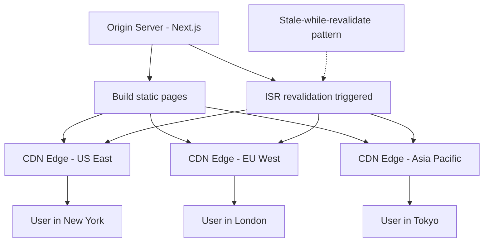

### 7.1. Hybrid Rendering Strategies

Many modern frameworks support hybrid rendering modes - combining SSR for dynamic sections with SSG/ISR for mostly static content. This flexibility allows you to optimize the user experience on a per-page basis.

### 7.2. Edge Computing and Serverless Architectures

Leveraging edge computing can bring your SSR logic closer to users, reducing latency. Serverless architectures also enable cost-effective scaling of SSR functions by charging only per request.

### 7.3. Progressive Web Apps (PWAs) and Rendering

PWAs benefit greatly from fast, pre-rendered content. Combining ISR with PWA techniques such as service workers can lead to offline capabilities and near-instant load times.

Traditional SSR sends the entire HTML document only after all data fetches complete. Streaming SSR uses HTTP chunked transfer encoding to send HTML progressively as each part of the React tree resolves.

### 7.4. How Streaming Works

React 18's `renderToPipeableStream` and Next.js's built-in streaming support allow route segments to stream independently. Wrap slow components in `<Suspense>` to show a fallback immediately while the real content loads in the background.

```tsx
// app/dashboard/page.tsx (Next.js App Router)
import { Suspense } from "react";
import { RevenueChart } from "./revenue-chart";
import { LatestInvoices } from "./latest-invoices";
import { CardsSkeleton, RevenueChartSkeleton } from "@/components/skeletons";

export default function Dashboard() {
  return (
    <main>
      <h1>Dashboard</h1>
      {/* This section streams in once the revenue data resolves */}
      <Suspense fallback={<RevenueChartSkeleton />}>
        <RevenueChart />
      </Suspense>
      {/* This section streams independently */}
      <Suspense fallback={<CardsSkeleton />}>
        <LatestInvoices />
      </Suspense>
    </main>
  );
}
```

```tsx
// app/dashboard/revenue-chart.tsx — async Server Component
async function RevenueChart() {
  // This fetch can take 2s without blocking the rest of the page
  const data = await fetch("https://api.example.com/revenue", {
    cache: "no-store",
  }).then((r) => r.json());

  return <Chart data={data} />;
}
```

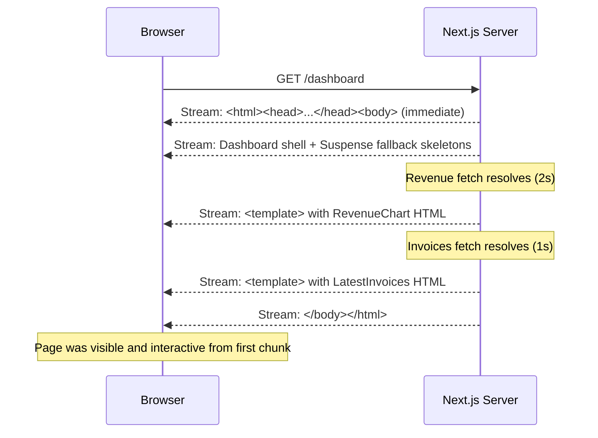

This pattern means **Time to First Byte (TTFB)** stays low even when some data is slow, because the shell arrives immediately. The browser can parse and paint the skeleton while waiting for the data-dependent sections.

### 7.5. Partial Prerendering (PPR)

Partial Prerendering is an experimental Next.js feature that combines SSG and streaming SSR into a single request. The static shell is served from the CDN at near-zero latency, while dynamic "holes" are filled by streaming from the server.

```tsx
// next.config.js
/** @type {import('next').NextConfig} */
const nextConfig = {
  experimental: {
    ppr: true, // enable Partial Prerendering
  },
};

module.exports = nextConfig;
```

```tsx
// app/product/[id]/page.tsx
import { Suspense } from "react";
import { StaticProductInfo } from "./static-info";
import { DynamicInventory } from "./inventory"; // reads real-time stock

export default function ProductPage({ params }: { params: { id: string } }) {
  return (
    <div>
      {/* Statically prerendered at build time */}
      <StaticProductInfo id={params.id} />

      {/* Dynamically streamed at request time */}
      <Suspense fallback={<p>Loading stock…</p>}>
        <DynamicInventory id={params.id} />
      </Suspense>
    </div>
  );
}
```

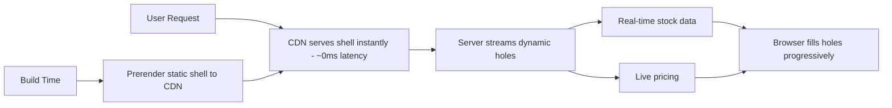

### 7.6. Edge Rendering

Edge rendering executes Next.js route segments on distributed edge nodes (e.g., Cloudflare Workers, Vercel Edge Runtime) rather than a central origin server. This eliminates geographic latency for dynamic content.

```tsx
// app/personalized/page.tsx
export const runtime = "edge"; // opt into Edge Runtime

export default async function PersonalizedPage({
  request,
}: {
  request: Request;
}) {
  const country = request.headers.get("cf-ipcountry") ?? "US";
  const content = await fetchLocalizedContent(country);

  return <LocalizedHero content={content} country={country} />;
}
```

**Constraints of the Edge Runtime:** No Node.js built-ins (no `fs`, no `crypto` from `node:crypto`), 128 MB memory limit, and cold starts under 5 ms. Use it for personalization, A/B routing, and geo-based redirects — not for database-heavy workloads.

### 7.7. Performance Comparison with Metrics

| Strategy      | TTFB    | FCP     | LCP     | Best For                   |
| ------------- | ------- | ------- | ------- | -------------------------- |
| SSG (CDN)     | ~10 ms  | ~100 ms | ~300 ms | Marketing, docs, blogs     |
| SSR (Origin)  | ~300 ms | ~400 ms | ~600 ms | Personalized pages         |
| SSR (Edge)    | ~50 ms  | ~150 ms | ~350 ms | Geo-personalized pages     |
| Streaming SSR | ~80 ms  | ~100 ms | varies  | Dashboards with mixed data |
| PPR           | ~10 ms  | ~100 ms | ~200 ms | Product pages, hybrid      |
| ISR (cached)  | ~10 ms  | ~100 ms | ~300 ms | E-commerce catalog         |

_Values are illustrative P50 estimates for a global user base. Actual numbers depend on server location, data source latency, and payload size._

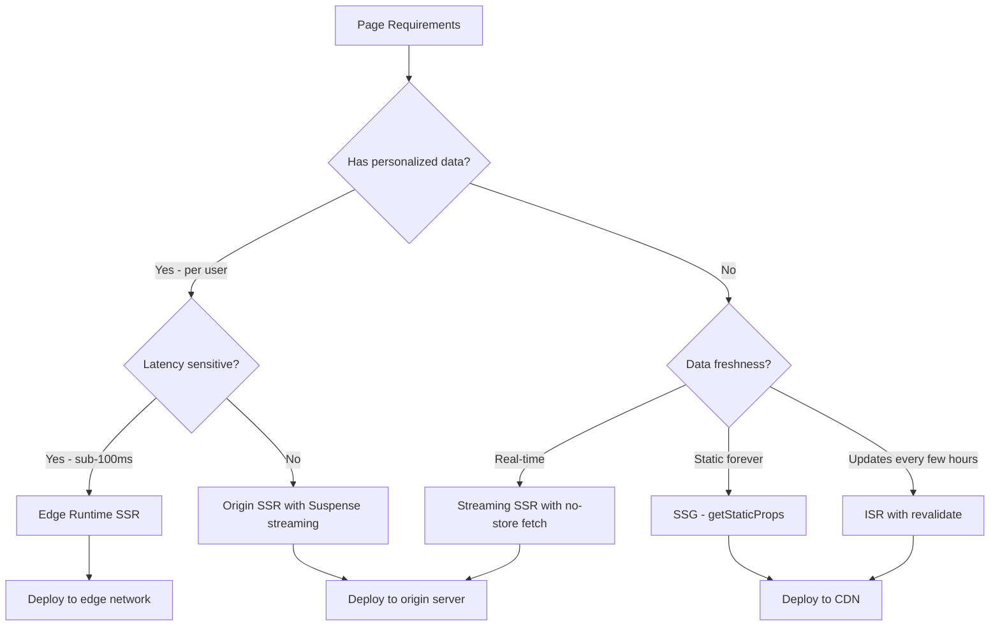

---

## 8. Conclusion

The following sequence diagram shows the full request flow for each rendering strategy side by side:

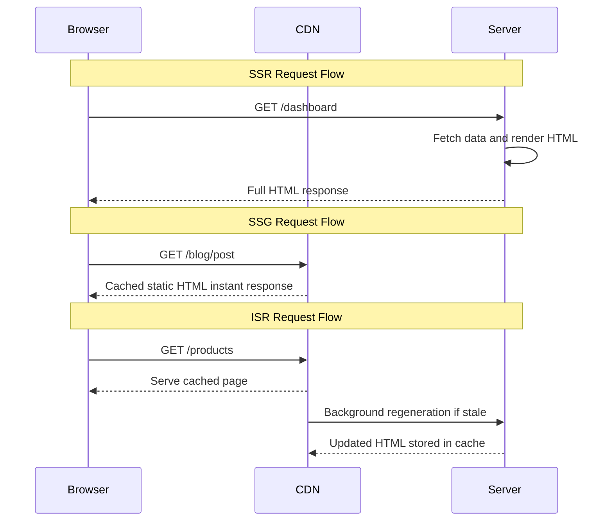

Choosing the right rendering strategy - SSR, SSG, or ISR - is essential for building modern, performant, and SEO-friendly web applications. SSR provides up-to-date dynamic content at the cost of higher server overhead, SSG offers blazing-fast static pages ideal for content that rarely changes, and ISR strikes an effective balance by allowing static content to be updated incrementally. Streaming SSR and Partial Prerendering push the boundary further, decoupling shell delivery from data latency so users see meaningful content almost immediately.

**Key Takeaways:**

- SSG and ISR serve from CDN at ~10 ms TTFB — use them for any content that is not personalized.
- SSR should be reserved for genuinely user-specific pages; wrap slow sections in `<Suspense>` to stream rather than block.
- Partial Prerendering is the most exciting new primitive: it merges CDN-speed shells with server-streamed dynamic holes in a single page.
- Edge Runtime brings dynamic rendering close to users, but its limited API surface means it is not a drop-in replacement for full Node.js SSR.
- Measure real user Core Web Vitals (LCP, INP, CLS) in production, not just Lighthouse scores. The rendering strategy you choose has a direct, measurable effect on each metric.

By understanding these methods in depth, you can tailor your rendering approach to meet the unique demands of your project.

---

## 9. Further Resources

For a deeper exploration of rendering strategies and additional best practices, please refer to the detailed [Web Design & Development Study Notes](https://hoangsonw.notion.site/Web-Design-Development-Study-Notes-2ec7107162734af980ff80edc52a530e?pvs=74).

Happy coding, and may your web applications deliver both performance and dynamic excellence!
