import MdxLayout from "@/components/MdxLayout";

export const metadata = {
  title: "State Management in Modern Web Apps: Redux vs. Zustand vs. Jotai",
  description:
    "A detailed exploration of state management solutions for modern web applications, comparing Redux, Zustand, and Jotai in terms of architecture, performance, and developer experience.",
  topics: ["Web Development", "Web Frameworks", "Web Architecture"],
};

export default function StateManagementArticle({ children }) {
  return <MdxLayout>{children}</MdxLayout>;
}

# State Management in Modern Web Apps: Redux vs. Zustand vs. Jotai

### Author: Son Nguyen

> Date: 2024-02-26

In modern web development, managing application state effectively is essential. As applications grow in complexity, maintaining predictable, performant, and scalable state becomes a challenge that no longer can be solved by local component state alone. In this comprehensive guide, we dive deep into three popular state management libraries for React - **Redux**, **Zustand**, and **Jotai**. We’ll examine their architectures, performance considerations, developer experience, and ideal use cases, so you can choose the best tool for your project.

```mermaid
graph TD
    subgraph Redux
        A[Action Dispatched] --> B[Middleware - Thunk or Saga]
        B --> C[Reducer - Pure Function]
        C --> D[Single Global Store]
        D --> E[Connected Components Re-render]
    end
    subgraph Zustand
        F[Hook Call - set] --> G[Zustand Store]
        G --> H[Subscribed Components Re-render]
    end
    subgraph Jotai
        I[useAtom Hook] --> J[Atom - Discrete State Unit]
        J --> K[Only Subscribed Component Re-renders]
    end
```

---

## 1. The Role of State Management in Modern Web Applications

As applications evolve from simple interfaces to complex systems with interdependent modules, a robust state management solution becomes indispensable. Key challenges include:

- **Data Synchronization**: Ensuring consistency across disparate parts of the application.
- **Performance Optimization**: Minimizing unnecessary re-renders and managing large, dynamic datasets.
- **Developer Productivity**: Providing clear patterns and powerful debugging tools to manage application state.

This need has led to the evolution of various libraries that offer different paradigms for handling state.

---

## 2. Redux: The Veteran Champion

### 2.1 Overview and History

Redux emerged in 2015 as a predictable state container for JavaScript apps, heavily inspired by Flux and functional programming principles. It introduces a **single immutable store** where the entire state tree resides. State changes occur via **actions** that are processed by **reducers** - pure functions that determine how the state should update.

### 2.2 Key Features

- **Predictability**: With a single source of truth and immutable state updates, Redux makes state changes predictable.
- **Middleware Ecosystem**: Tools like Redux Thunk and Redux Saga manage asynchronous actions and side effects.
- **DevTools**: Redux DevTools provide time-travel debugging and deep inspection of state transitions.
- **Community and Ecosystem**: Widespread adoption ensures ample tutorials, middleware, and third-party integrations.

### 2.3 Drawbacks

- **Boilerplate**: The need to define actions, action creators, and reducers can lead to verbosity.
- **Learning Curve**: New developers may find the concepts of immutability and functional reducers challenging.
- **Overhead**: For smaller apps, Redux can be more complex than necessary.

### 2.4 Example Code

```jsx
// Redux Example: Counter Store
import { createStore } from "redux";

const initialState = { count: 0 };

function counterReducer(state = initialState, action) {
  switch (action.type) {
    case "increment":
      return { ...state, count: state.count + 1 };
    case "decrement":
      return { ...state, count: state.count - 1 };
    default:
      return state;
  }
}

const store = createStore(counterReducer);
export default store;
```

Redux shines in large-scale applications where state predictability, robust debugging, and middleware integrations are paramount.

---

## 3. Zustand: Minimalism with Maximum Flexibility

### 3.1 Overview

Zustand, meaning “state” in German, offers a minimalistic, hook-based approach to state management. Unlike Redux, it does not enforce a strict architecture of actions and reducers. Instead, it uses a simple API to create a store and provides direct access to state via custom hooks.

### 3.2 Key Features

- **Simplicity**: Minimal boilerplate and a straightforward API.
- **Performance**: Selective subscriptions allow components to re-render only when the specific parts of the state they use change.
- **Flexibility**: Developers have complete control without enforcing a rigid architecture.
- **Small Bundle Size**: Lightweight and easy to integrate into existing projects.

### 3.3 Drawbacks

- **Less Opinionated**: The flexibility means fewer built-in patterns, which might lead to inconsistent implementations across large teams.
- **Smaller Ecosystem**: Compared to Redux, fewer community resources and middleware are available.

### 3.4 Example Code

```jsx
// Zustand Example: Counter Store
import create from "zustand";

const useStore = create((set) => ({
  count: 0,
  increment: () => set((state) => ({ count: state.count + 1 })),
  decrement: () => set((state) => ({ count: state.count - 1 })),
}));

export default useStore;
```

Zustand is ideal for projects that require a lightweight solution without the overhead of boilerplate code, while still providing excellent performance and a simple API.

---

## 4. Jotai: Atomic State Management for Fine-Grained Control

### 4.1 Overview

Jotai introduces a novel paradigm by treating state as a collection of **atoms**. Each atom represents a discrete piece of state, and components can subscribe to individual atoms. This atomic approach allows for extremely fine-grained reactivity, reducing unnecessary re-renders.

### 4.2 Key Features

- **Atomicity**: Divide state into small, independent units that can be composed to form more complex state structures.
- **Simplicity and Flexibility**: Minimalistic API with a focus on simplicity.
- **Concurrent Mode Ready**: Designed with modern React features in mind, Jotai integrates well with concurrent rendering.
- **Performance**: Only components that subscribe to an atom will re-render when that atom changes, ensuring optimal performance.

### 4.3 Drawbacks

- **Newer Library**: Being a relatively new entrant, Jotai has a smaller community and fewer third-party integrations compared to Redux.
- **Learning Curve**: The atomic paradigm, while powerful, requires a shift in thinking for developers accustomed to traditional global state models.

### 4.4 Example Code

```jsx
// Jotai Example: Counter Atom
import { atom, useAtom } from "jotai";

const countAtom = atom(0);

function Counter() {
  const [count, setCount] = useAtom(countAtom);
  return (
    <div>
      <div>Count: {count}</div>
      <button onClick={() => setCount((c) => c + 1)}>Increment</button>
      <button onClick={() => setCount((c) => c - 1)}>Decrement</button>
    </div>
  );
}

export default Counter;
```

Jotai is particularly well-suited for projects that benefit from modular state management and fine-grained control, especially when leveraging React’s modern features.

---

## 5. Comparative Analysis

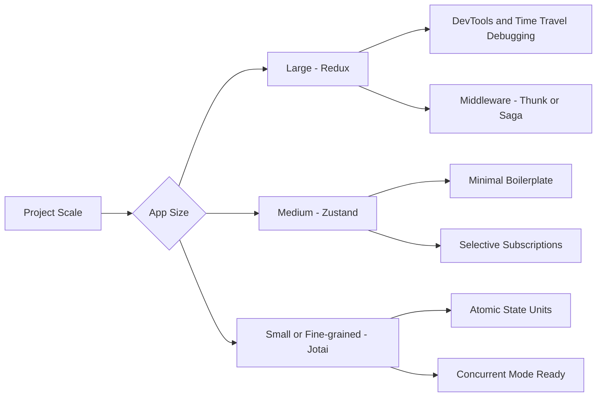

### 5.1 API Complexity and Learning Curve

- **Redux**: Offers a well-defined, albeit verbose, pattern. Its learning curve is steep, especially for newcomers to concepts like immutability and middleware.
- **Zustand**: Provides a simple API that closely follows React hooks, making it easier for developers to adopt quickly.
- **Jotai**: Introduces an atomic approach that might be new for many developers, but once grasped, it offers an elegant and highly modular way of managing state.

### 5.2 Performance Considerations

- **Redux**: While predictable, the immutable updates can sometimes cause performance bottlenecks in deeply nested state structures.
- **Zustand**: Optimizes re-renders by allowing components to subscribe only to the specific slices of state they need.
- **Jotai**: Minimizes unnecessary re-renders through its atom-based approach; only components that subscribe to a specific atom will re-render when that atom changes.

### 5.3 Developer Experience and Ecosystem

- **Redux**: Has an extensive ecosystem with powerful DevTools, a plethora of middleware options, and widespread community support.
- **Zustand**: Offers a lightweight alternative with a minimal learning curve, though it may lack some of the extensive tooling that Redux offers.
- **Jotai**: Presents a fresh, modern approach that aligns with React’s concurrent mode but is still maturing in terms of ecosystem and community resources.

### 5.4 Use Cases

- **Redux**: Best for large, complex applications where state predictability and powerful debugging tools are crucial.
- **Zustand**: Ideal for small to medium projects where ease of use and minimal boilerplate are desired.
- **Jotai**: Excels in scenarios where fine-grained reactivity and modular state management are needed, especially in applications leveraging React’s latest features.

---

## 6. Advanced Patterns and Ecosystem Integration

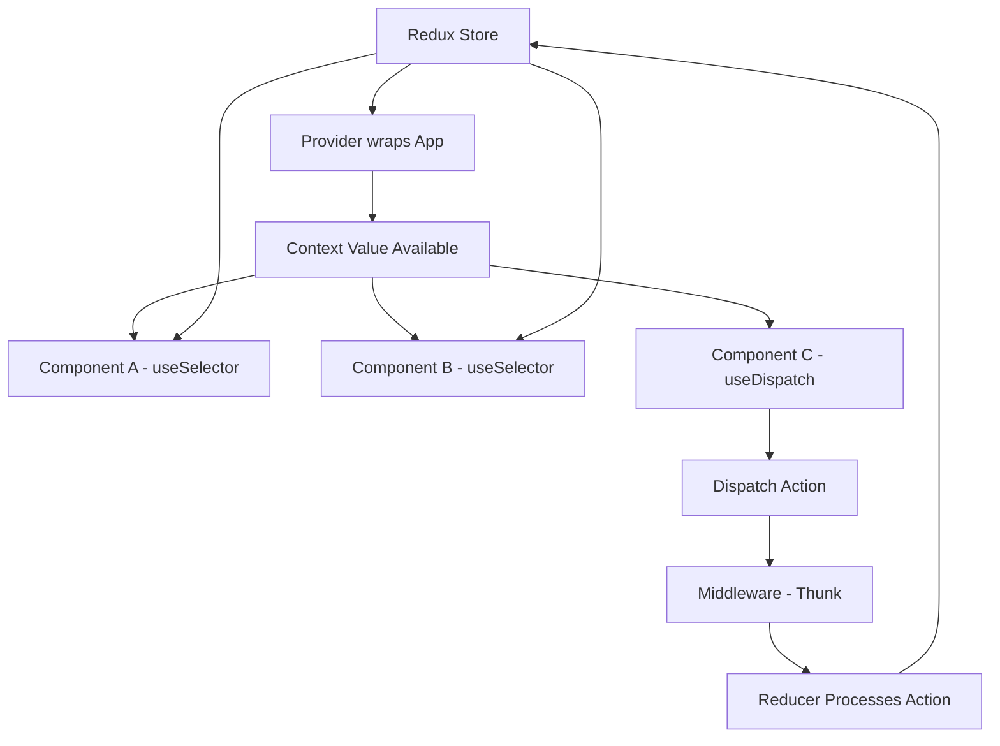

### 6.1 Middleware and Side Effects

- **Redux**: Leverages middleware like Redux Thunk or Redux Saga to handle asynchronous operations, which is vital for complex side-effect management.
- **Zustand & Jotai**: Typically rely on React’s built-in hooks and custom side-effect patterns, though community solutions are emerging to handle more advanced use cases.

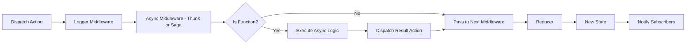

### 6.2 Debugging Tools

- **Redux**: Redux DevTools remain the gold standard for state inspection and time-travel debugging.
- **Zustand and Jotai**: While simpler to debug due to their minimal nature, they are gradually building out more advanced debugging integrations.

### 6.3 TypeScript Integration

All three libraries provide robust TypeScript support:

- **Redux**: TypeScript integration can be verbose but is very powerful when using Redux Toolkit.
- **Zustand**: Offers a straightforward API that works seamlessly with TypeScript.
- **Jotai**: Embraces TypeScript’s strengths with minimal configuration, though its atomic design may require some additional type annotations in complex scenarios.

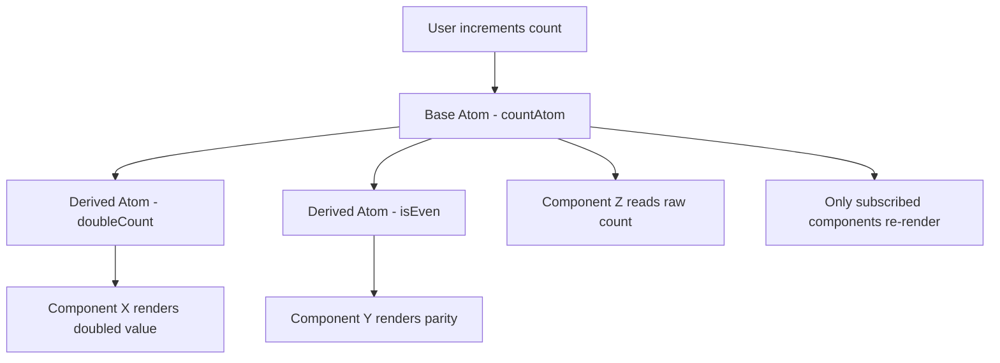

---

## 7. Real-World Considerations

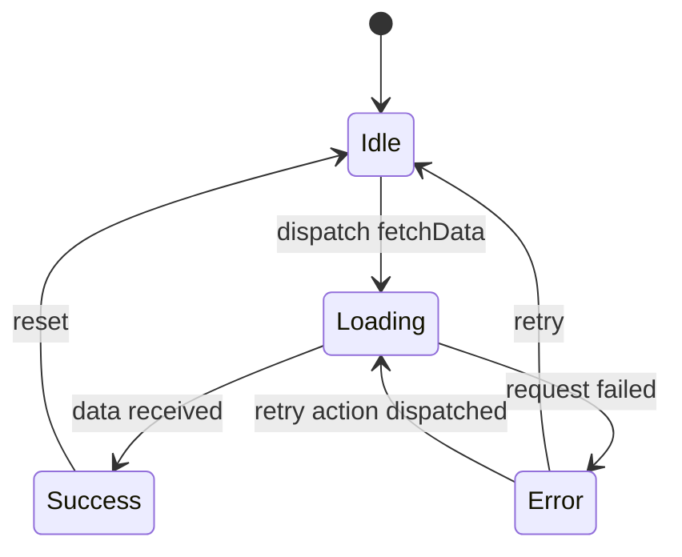

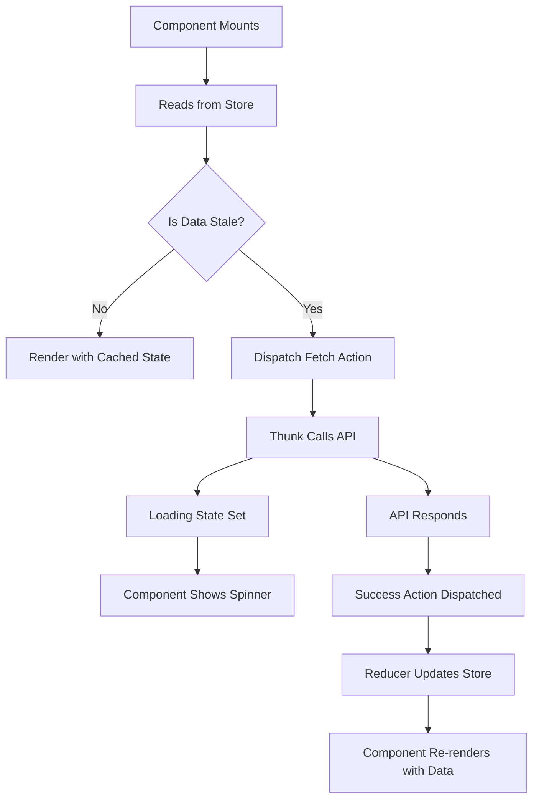

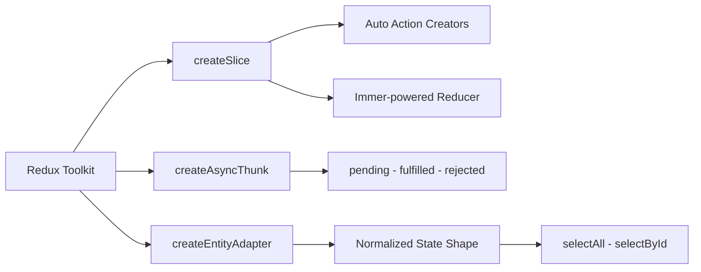

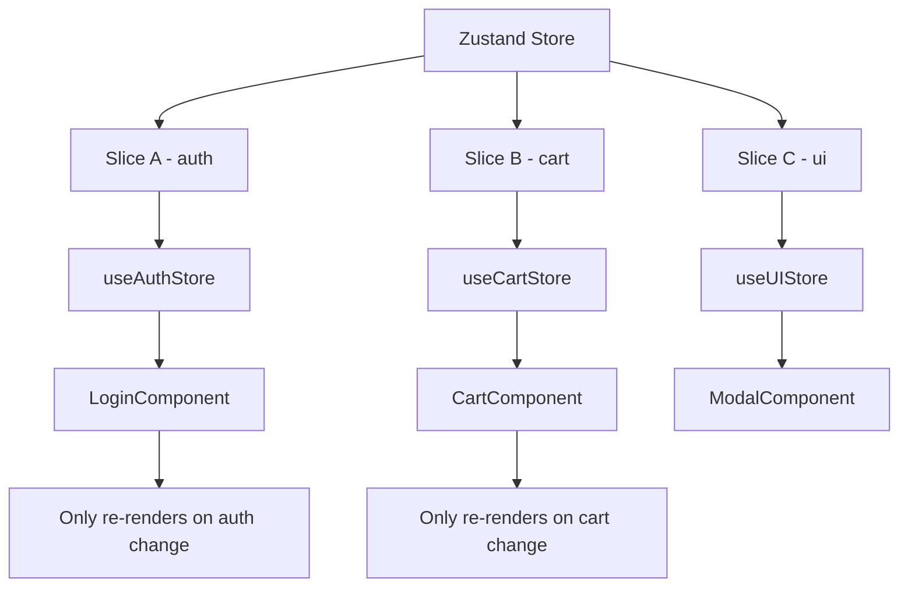

When choosing a state management library, consider:

- **Application Complexity**: Redux is battle-tested for large-scale applications, while Zustand and Jotai shine in smaller, more dynamic projects.
- **Team Experience**: If your team is well-versed in Redux patterns, its robustness might be preferred; however, teams new to global state management might benefit from the simpler APIs of Zustand or Jotai.
- **Future-Proofing**: Modern React features like concurrent mode and suspense align well with the minimalistic and reactive approaches of Zustand and Jotai.

---

State management is a critical aspect of modern web applications, and the landscape offers several compelling solutions. **Redux** remains the go-to choice for large applications with complex state interactions and a need for extensive middleware and debugging tools. In contrast, **Zustand** and **Jotai** offer refreshing alternatives that reduce boilerplate and improve performance by adopting a more granular, hook-based approach.

Ultimately, the best choice depends on your specific project needs, team expertise, and future scalability plans. By understanding the architectural differences, performance trade-offs, and developer experiences offered by Redux, Zustand, and Jotai, you can make an informed decision that aligns perfectly with your application’s requirements.

By integrating these insights and examples, you are now equipped to choose and implement the state management solution that best fits your modern web application’s needs. Whether you lean towards the time-tested patterns of Redux or the innovative, minimalist approaches of Zustand and Jotai, effective state management will empower you to build more scalable, maintainable, and performant applications.

---

## 8. Server state with TanStack Query

Client state (what the UI is doing) and server state (data from an API) are fundamentally different problems. Libraries like Redux, Zustand, and Jotai are designed for client state. TanStack Query (formerly React Query) is designed specifically for server state: fetching, caching, synchronizing, and updating remote data.

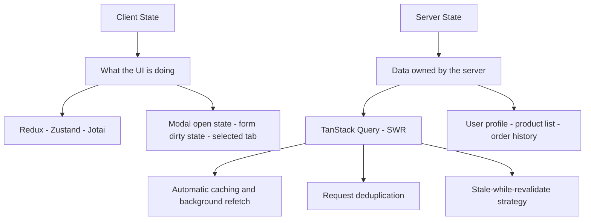

### 8.1. TanStack Query in practice

```tsx
// product-list.tsx: server state with TanStack Query
import { useQuery, useMutation, useQueryClient } from "@tanstack/react-query";

interface Product {
  id: string;
  name: string;
  price: number;
  stock: number;
}

// Typed query key factory - prevents key collisions across the app
const productKeys = {
  all: ["products"] as const,
  list: (filters: Record<string, unknown>) =>
    [...productKeys.all, "list", filters] as const,
  detail: (id: string) => [...productKeys.all, "detail", id] as const,
};

// Fetching with automatic caching, background refetch, and error handling
function useProducts(categoryId: string) {
  return useQuery({
    queryKey: productKeys.list({ categoryId }),
    queryFn: () =>
      fetch(`/api/products?category=${categoryId}`).then((r) => r.json()),
    staleTime: 60_000, // Data is fresh for 60 seconds
    gcTime: 5 * 60_000, // Cache entry survives 5 minutes after unmount
    refetchOnWindowFocus: true,
  });
}

// Optimistic mutation: update UI immediately, roll back on error
function useUpdateStock(productId: string) {
  const queryClient = useQueryClient();

  return useMutation({
    mutationFn: (newStock: number) =>
      fetch(`/api/products/${productId}/stock`, {
        method: "PATCH",
        body: JSON.stringify({ stock: newStock }),
      }),

    // Optimistic update before the server responds
    onMutate: async (newStock) => {
      await queryClient.cancelQueries({
        queryKey: productKeys.detail(productId),
      });
      const previous = queryClient.getQueryData<Product>(
        productKeys.detail(productId),
      );

      queryClient.setQueryData<Product>(productKeys.detail(productId), (old) =>
        old ? { ...old, stock: newStock } : old,
      );

      return { previous };
    },

    // On error: roll back to the previous value
    onError: (_err, _variables, context) => {
      if (context?.previous) {
        queryClient.setQueryData(
          productKeys.detail(productId),
          context.previous,
        );
      }
    },

    // Always refetch after mutation to reconcile with server
    onSettled: () => {
      queryClient.invalidateQueries({
        queryKey: productKeys.detail(productId),
      });
    },
  });
}
```

### 8.2. TanStack Query versus Redux for server state

| Concern                        | Redux                  | TanStack Query                         |
| ------------------------------ | ---------------------- | -------------------------------------- |
| Fetching                       | Manual (thunks, sagas) | Built-in                               |
| Caching                        | Manual                 | Automatic with configurable stale time |
| Background refetch             | Not included           | Built-in                               |
| Loading and error states       | Manual reducers        | Built-in per-query status              |
| Optimistic updates             | Manual rollback logic  | `onMutate` / `onError` callbacks       |
| Pagination and infinite scroll | Manual                 | `useInfiniteQuery` built-in            |
| Deduplication                  | Manual                 | Automatic - shared query key           |

The practical recommendation: use TanStack Query for any data that comes from an API, and reserve Redux, Zustand, or Jotai for local UI state that does not have a server counterpart.

---

## 9. URL state management

URL search parameters are a form of global state that survives page refreshes, can be bookmarked, and can be shared. For filters, sorting, pagination, and view modes, URL state is often the most appropriate home.

```tsx
// url-state.tsx: synchronize filter state with URL search params
import { useSearchParams } from "next/navigation";
import { useCallback } from "react";

interface FilterState {
  category: string | null;
  minPrice: number | null;
  maxPrice: number | null;
  sortBy: "price_asc" | "price_desc" | "newest" | null;
  page: number;
}

function useURLFilterState(): [
  FilterState,
  (updates: Partial<FilterState>) => void,
] {
  const searchParams = useSearchParams();

  const state: FilterState = {
    category: searchParams.get("category"),
    minPrice: searchParams.get("min_price")
      ? Number(searchParams.get("min_price"))
      : null,
    maxPrice: searchParams.get("max_price")
      ? Number(searchParams.get("max_price"))
      : null,
    sortBy: (searchParams.get("sort") as FilterState["sortBy"]) ?? null,
    page: Number(searchParams.get("page") ?? 1),
  };

  const setFilters = useCallback(
    (updates: Partial<FilterState>) => {
      const params = new URLSearchParams(searchParams.toString());

      if (updates.category !== undefined) {
        updates.category
          ? params.set("category", updates.category)
          : params.delete("category");
      }
      if (updates.page !== undefined) {
        updates.page > 1
          ? params.set("page", String(updates.page))
          : params.delete("page");
      }
      if (updates.sortBy !== undefined) {
        updates.sortBy
          ? params.set("sort", updates.sortBy)
          : params.delete("sort");
      }

      // Use history.pushState for shallow navigation
      window.history.pushState(null, "", `?${params.toString()}`);
    },
    [searchParams],
  );

  return [state, setFilters];
}
```

### 9.1. When to use URL state vs. other state homes

| State Type                  | Recommended Home                | Reason                                   |
| --------------------------- | ------------------------------- | ---------------------------------------- |
| Filter and sort preferences | URL params                      | Bookmarkable, shareable, survives reload |
| Current page number         | URL params                      | Shareable deep link                      |
| Modal open/close            | Local component state           | Not worth polluting the URL              |
| Selected list item          | Local component state           | Transient, not shareable                 |
| Shopping cart               | Zustand or Redux + localStorage | Needs persistence across tabs            |
| User authentication         | Zustand or Context              | Global but not shareable                 |
| API response data           | TanStack Query                  | Server-owned, needs caching              |
| Form field values           | React Hook Form (local)         | Not global, needs rich validation        |

---

## 10. State machines with XState

Complex UI flows - multi-step forms, upload wizards, document approval chains - often have states that branch based on conditions and need to express what transitions are legal. A flat boolean `isLoading` approach quickly becomes unmaintainable. XState models these flows as explicit finite state machines.

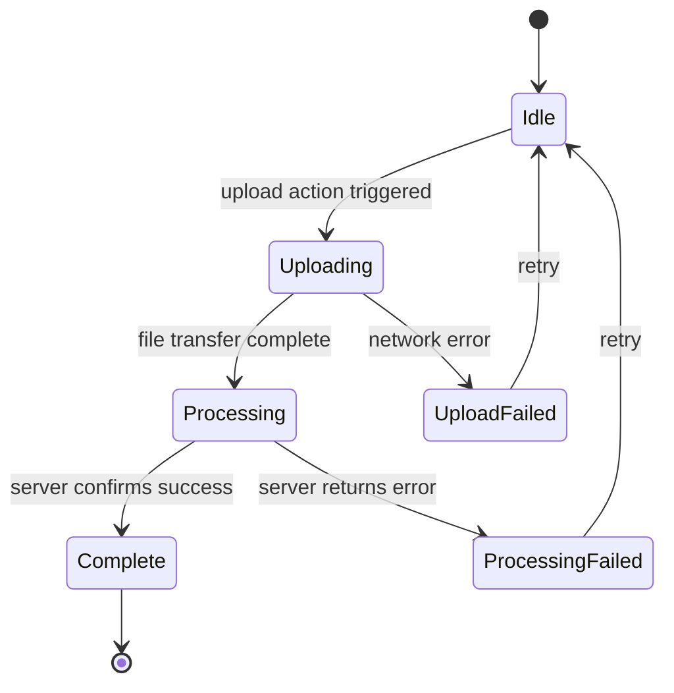

```typescript
// upload-machine.ts: XState v5 file upload state machine
import { createMachine, assign } from "xstate";

interface UploadContext {
  fileName: string | null;
  progress: number;
  error: string | null;
  fileUrl: string | null;
}

const uploadMachine = createMachine({
  id: "upload",
  initial: "idle",
  context: {
    fileName: null,
    progress: 0,
    error: null,
    fileUrl: null,
  } as UploadContext,

  states: {
    idle: {
      on: {
        UPLOAD: {
          target: "uploading",
          actions: assign({
            fileName: ({ event }) => event.fileName,
            progress: 0,
            error: null,
          }),
        },
      },
    },

    uploading: {
      on: {
        PROGRESS: {
          actions: assign({ progress: ({ event }) => event.percent }),
        },
        UPLOAD_COMPLETE: { target: "processing" },
        ERROR: {
          target: "uploadFailed",
          actions: assign({ error: ({ event }) => event.message }),
        },
      },
    },

    processing: {
      on: {
        PROCESSING_COMPLETE: {
          target: "complete",
          actions: assign({ fileUrl: ({ event }) => event.url }),
        },
        ERROR: {
          target: "processingFailed",
          actions: assign({ error: ({ event }) => event.message }),
        },
      },
    },

    uploadFailed: {
      on: { RETRY: "idle" },
    },

    processingFailed: {
      on: { RETRY: "idle" },
    },

    complete: {
      type: "final",
    },
  },
});

export { uploadMachine };
```

```tsx
// upload-component.tsx: consuming the state machine in React
import { useMachine } from "@xstate/react";
import { uploadMachine } from "./upload-machine";

export function FileUploader() {
  const [state, send] = useMachine(uploadMachine);

  const handleFileChange = async (
    event: React.ChangeEvent<HTMLInputElement>,
  ) => {
    const file = event.target.files?.[0];
    if (!file) return;

    send({ type: "UPLOAD", fileName: file.name });

    const formData = new FormData();
    formData.append("file", file);

    try {
      const xhr = new XMLHttpRequest();
      xhr.upload.addEventListener("progress", (e) => {
        if (e.lengthComputable) {
          send({
            type: "PROGRESS",
            percent: Math.round((e.loaded / e.total) * 100),
          });
        }
      });
      xhr.addEventListener("load", () => send({ type: "UPLOAD_COMPLETE" }));
      xhr.addEventListener("error", () =>
        send({ type: "ERROR", message: "Upload failed" }),
      );
      xhr.open("POST", "/api/upload");
      xhr.send(formData);
    } catch (err) {
      send({ type: "ERROR", message: String(err) });
    }
  };

  return (
    <div>
      {state.matches("idle") && (
        <input type="file" onChange={handleFileChange} />
      )}
      {state.matches("uploading") && (
        <progress value={state.context.progress} max={100} />
      )}
      {state.matches("processing") && <p>Processing file on server...</p>}
      {state.matches("complete") && (
        <a href={state.context.fileUrl!}>Download file</a>
      )}
      {(state.matches("uploadFailed") || state.matches("processingFailed")) && (
        <div>
          <p>Error: {state.context.error}</p>
          <button onClick={() => send({ type: "RETRY" })}>Retry</button>
        </div>
      )}
    </div>
  );
}
```

---

## 11. Persistence strategies

State that must survive page refreshes requires a persistence layer. The choice of persistence mechanism depends on the sensitivity of the data, its size, and whether it should be shared across tabs or devices.

### 11.1. Zustand with persistence middleware

```typescript
// persisted-store.ts: Zustand store with localStorage persistence
import { create } from "zustand";
import { persist, createJSONStorage } from "zustand/middleware";

interface UserPreferences {
  theme: "light" | "dark" | "system";
  language: string;
  compactMode: boolean;
  setTheme: (theme: UserPreferences["theme"]) => void;
  setLanguage: (lang: string) => void;
  toggleCompactMode: () => void;
}

export const usePreferencesStore = create<UserPreferences>()(
  persist(
    (set) => ({
      theme: "system",
      language: "en",
      compactMode: false,
      setTheme: (theme) => set({ theme }),
      setLanguage: (language) => set({ language }),
      toggleCompactMode: () =>
        set((state) => ({ compactMode: !state.compactMode })),
    }),
    {
      name: "user-preferences",
      storage: createJSONStorage(() => localStorage),
      // Only persist certain fields - exclude derived or sensitive state
      partialize: (state) => ({
        theme: state.theme,
        language: state.language,
        compactMode: state.compactMode,
      }),
    },
  ),
);
```

### 11.2. Persistence options comparison

| Storage          | Max Size            | Shared Across Tabs | Survives Browser Close | Use For                               |
| ---------------- | ------------------- | ------------------ | ---------------------- | ------------------------------------- |
| `localStorage`   | 5-10MB              | Yes                | Yes                    | User preferences, UI settings         |
| `sessionStorage` | 5-10MB              | No                 | No                     | Temporary form progress, session data |
| `IndexedDB`      | Hundreds of MB      | Yes                | Yes                    | Offline data, large datasets          |
| Cookie           | 4KB                 | Yes                | Configurable           | Server-readable session tokens        |
| URL params       | Practical limit 2KB | Via link sharing   | Yes                    | Filter state, pagination              |

---

## 12. Migrating between state libraries

Migrating a large codebase from one state library to another is a surgical process. A big-bang rewrite that changes all state management at once creates unacceptable risk. The practical approach is incremental extraction.

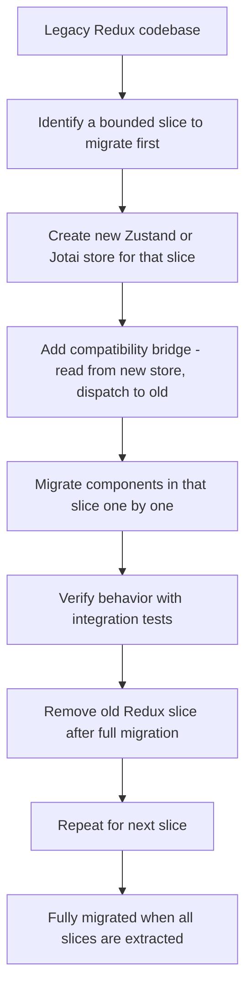

```typescript
// migration-bridge.ts: compatibility layer during Redux-to-Zustand migration
// This lets new code use Zustand while old code still dispatches to Redux

import { create } from "zustand";
import { store as reduxStore } from "./redux/store";
import type { RootState } from "./redux/store";

interface CartStore {
  items: CartItem[];
  total: number;
  addItem: (item: CartItem) => void;
  removeItem: (itemId: string) => void;
}

// New Zustand store for the cart slice
export const useCartStore = create<CartStore>((set) => ({
  items: reduxStore.getState().cart.items, // Initialize from Redux
  total: reduxStore.getState().cart.total,

  addItem: (item) => {
    // Update Zustand state
    set((state) => ({
      items: [...state.items, item],
      total: state.total + item.price,
    }));
    // Also dispatch to Redux for components not yet migrated
    reduxStore.dispatch({ type: "cart/addItem", payload: item });
  },

  removeItem: (itemId) => {
    set((state) => ({
      items: state.items.filter((i) => i.id !== itemId),
      total:
        state.total - (state.items.find((i) => i.id === itemId)?.price ?? 0),
    }));
    reduxStore.dispatch({ type: "cart/removeItem", payload: itemId });
  },
}));

// Subscribe Redux to Zustand for reverse sync
useCartStore.subscribe((state) => {
  // This keeps Redux DevTools accurate during the migration period
  if (reduxStore.getState().cart.items !== state.items) {
    reduxStore.dispatch({ type: "cart/syncFromZustand", payload: state });
  }
});
```

---

## 13. Conclusion

State management in modern web applications is not a solved problem with a single correct answer. The right approach emerges from understanding the category of state you are managing. Server state belongs in TanStack Query, not Redux. URL-serializable state belongs in search parameters. Complex flow state belongs in XState. User preferences that need persistence belong in a persisted Zustand store.

The progression from Redux toward smaller, more focused tools reflects a broader maturation in the React ecosystem. Redux was built when the alternatives were far worse. Today, the combination of TanStack Query for server data, Zustand or Jotai for client state, XState for complex flows, and URL params for shareable state covers the vast majority of real-world requirements with less code and better performance than a single global Redux store ever could.

---

## 14. Further Reading & Resources

- **Redux**:
  - [Redux Documentation](https://redux.js.org/)
  - [Redux Toolkit](https://redux-toolkit.js.org/)
- **Zustand**:
  - [Zustand GitHub Repository](https://github.com/pmndrs/zustand)
  - [Zustand Documentation](https://docs.pmnd.rs/zustand/)
- **Jotai**:
  - [Jotai GitHub Repository](https://github.com/pmndrs/jotai)
  - [Jotai Documentation](https://jotai.org/)
- **React**:
  - [React Official Documentation](https://reactjs.org/docs/getting-started.html)
