import MdxLayout from "@/components/MdxLayout";

export const metadata = {
  title: "Supabase: The Open Source Firebase Alternative",
  description:
    "A comprehensive, in-depth guide exploring Supabase's PostgreSQL architecture, special features, best practices, and real-world applications.",
  topics: [
    "Web Development",
    "Web Architecture",
    "Databases",
    "Authentication",
    "Edge Functions",
  ],
};

export default function SupabaseArticle({ children }) {
  return <MdxLayout>{children}</MdxLayout>;
}

# Supabase: The Deep Dive into the Open Source Firebase Alternative

### Author: Son Nguyen

> Date: 2024-11-28

Supabase is revolutionizing backend development as the open source alternative to Firebase. Leveraging the power of PostgreSQL along with real-time capabilities, built-in authentication, robust file storage, and edge functions, Supabase delivers a modern, scalable, and developer-friendly platform. This article provides an extensive deep dive into Supabase’s inner workings, complete with numerous code examples, advanced use cases, and best practices to help you harness its full potential.

---

## 1. Introduction

### 1.1. What is Supabase?

Supabase is an open source backend-as-a-service platform designed to simplify the development of scalable applications. By combining PostgreSQL with an ecosystem of tools that automatically generate RESTful and GraphQL APIs, real-time subscriptions, and integrated authentication, Supabase empowers developers to build full-stack applications quickly without vendor lock-in.

### 1.2. The Vision Behind Supabase

Supabase was born out of the need for a transparent, community-driven solution that offered the reliability of traditional databases with the agility of modern backend services. Its goal is to make it as simple to build complex applications as using Firebase - while keeping the code and data fully in your control.

---

## 2. Core Components and Architecture

Supabase is built on several key components that work together to offer a full-featured backend platform:

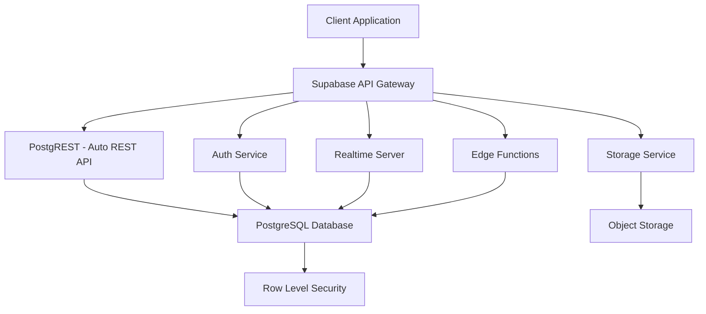

### 2.1. PostgreSQL: The Heart of Supabase

At its core, Supabase uses PostgreSQL - a powerful, ACID-compliant relational database known for its robustness and advanced features. Supabase leverages PostgreSQL’s extensibility with:

- **Advanced SQL Queries:** Support for joins, window functions, JSON operations, and full-text search.
- **Extensions:** Tools like PostGIS for geospatial queries and pg_cron for scheduling.
- **Auto-generated APIs:** Utilizing [PostgREST](https://postgrest.org/), every table is exposed as a RESTful endpoint instantly.

#### Example: Creating a Table and Querying Data

```sql
-- Create a table for user profiles
CREATE TABLE profiles (
  id UUID PRIMARY KEY DEFAULT uuid_generate_v4(),
  username TEXT UNIQUE NOT NULL,
  email TEXT UNIQUE NOT NULL,
  bio TEXT,
  created_at TIMESTAMPTZ DEFAULT NOW()
);

-- Example query to fetch profiles with a specific condition
SELECT id, username, email FROM profiles WHERE created_at > NOW() - INTERVAL '7 days';
```

### 2.2. Auto-Generated APIs

Supabase automatically creates RESTful endpoints for your PostgreSQL tables. This means that once your schema is defined, you have a complete API available without any additional code.

#### Example: Fetching Data via REST API (JavaScript)

```js
// Using fetch to retrieve profiles from the Supabase auto-generated API
async function getProfiles() {
  const response = await fetch(
    "https://your-supabase-url.supabase.co/rest/v1/profiles",
    {
      headers: {
        apiKey: "your-anon-key",
        Authorization: "Bearer your-anon-key",
        "Content-Type": "application/json",
      },
    },
  );
  const data = await response.json();
  console.log("Profiles:", data);
}

getProfiles();
```

### 2.3. Authentication & Authorization

Supabase provides a robust authentication system that supports multiple providers including email/password, OAuth (Google, GitHub, etc.), and third-party logins. It integrates seamlessly with PostgreSQL through Row Level Security (RLS) to enforce data access rules.

#### Features:

- **User Registration & Login**
- **Password Recovery & Email Confirmations**
- **Custom Claims and Role Management**

#### Example: User Authentication with Supabase Client

```js
import { createClient } from "@supabase/supabase-js";

const supabaseUrl = "https://your-supabase-url.supabase.co";
const supabaseKey = "your-anon-key";
const supabase = createClient(supabaseUrl, supabaseKey);

// Sign up a new user
async function signUp(email, password) {
  const { data, error } = await supabase.auth.signUp({
    email,
    password,
  });
  if (error) console.error("Sign-up error:", error);
  else console.log("Sign-up successful:", data);
}

// Log in an existing user
async function signIn(email, password) {
  const { data, error } = await supabase.auth.signInWithPassword({
    email,
    password,
  });
  if (error) console.error("Sign-in error:", error);
  else console.log("Logged in user:", data);
}

signUp("newuser@example.com", "SuperSecure123!");
signIn("newuser@example.com", "SuperSecure123!");
```

### 2.4. Real-Time Subscriptions

One of Supabase’s most powerful features is real-time data updates.

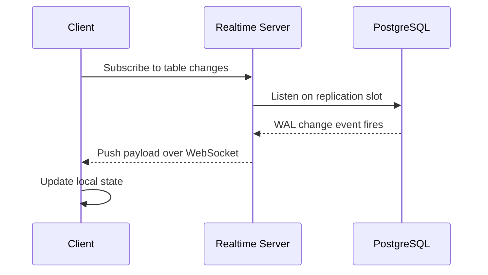

Using PostgreSQL’s replication and websockets, Supabase allows you to subscribe to changes on any table, enabling live updates for your application.

#### Example: Subscribing to Real-Time Changes in React

```jsx
import React, { useEffect, useState } from "react";
import { createClient } from "@supabase/supabase-js";

const supabaseUrl = "https://your-supabase-url.supabase.co";
const supabaseKey = "your-anon-key";
const supabase = createClient(supabaseUrl, supabaseKey);

export default function RealTimeMessages() {
  const [messages, setMessages] = useState([]);

  useEffect(() => {
    // Fetch initial messages
    async function fetchMessages() {
      const { data, error } = await supabase.from("messages").select("*");
      if (!error) setMessages(data);
    }
    fetchMessages();

    // Subscribe to changes on the "messages" table
    const subscription = supabase
      .channel("public:messages")
      .on(
        "postgres_changes",
        { event: "*", schema: "public", table: "messages" },
        (payload) => {
          console.log("Change received!", payload);
          setMessages((prev) => [...prev, payload.new]);
        },
      )
      .subscribe();

    // Cleanup subscription on unmount
    return () => {
      supabase.removeChannel(subscription);
    };
  }, []);

  return (
    <div>
      <h2>Real-Time Messages</h2>
      <ul>
        {messages.map((msg) => (
          <li key={msg.id}>{msg.content}</li>
        ))}
      </ul>
    </div>
  );
}
```

### 2.5. Storage: File Uploads and Management

Supabase includes a dedicated storage service for handling files and media. This service supports direct file uploads, secure access controls, and integrates with your authentication system.

#### Example: Uploading and Retrieving a File

```js
// Upload a file using the Supabase Storage API
async function uploadFile(file) {
  const { data, error } = await supabase.storage
    .from("avatars")
    .upload(`public/${file.name}`, file);
  if (error) {
    console.error("Upload error:", error);
    return;
  }
  console.log("File uploaded:", data);
}

// Get a public URL for a file
async function getPublicUrl(path) {
  const { data } = supabase.storage.from("avatars").getPublicUrl(path);
  console.log("Public URL:", data.publicUrl);
}

// Usage example:
// Assume `fileInput` is an input element of type file
document.getElementById("fileInput").addEventListener("change", (e) => {
  const file = e.target.files[0];
  uploadFile(file).then(() => getPublicUrl(`public/${file.name}`));
});
```

### 2.6. Edge Functions: Serverless at the Edge

Supabase Edge Functions allow you to write serverless functions that run close to your users, reducing latency. These functions are typically written in JavaScript or TypeScript and are ideal for custom API endpoints, webhooks, or background tasks.

#### Example: Creating an Edge Function

1. **Create a function file (`hello-world.ts`):**

```ts
// hello-world.ts
import { serve } from "std/server";

serve(async (req) => {
  const { searchParams } = new URL(req.url);
  const name = searchParams.get("name") || "World";
  return new Response(`Hello, ${name}!`, {
    headers: { "Content-Type": "text/plain" },
  });
});
```

2. **Deploy the function using the Supabase CLI:**

```bash
supabase functions deploy hello-world
```

3. **Call the function from your client:**

```js
async function callEdgeFunction() {
  const response = await fetch(
    "https://your-supabase-url.functions.supabase.co/hello-world?name=Alex",
  );
  const text = await response.text();
  console.log(text); // "Hello, Alex!"
}

callEdgeFunction();
```

---

## 3. Building a Full-Stack Application with Supabase

Supabase integrates seamlessly with modern front-end frameworks. Let’s walk through a complete example that ties together authentication, real-time data, and file storage using a React application.

### 3.1. Setting Up the Project

1. **Install Dependencies:**

```bash
npx create-react-app supabase-demo
cd supabase-demo
npm install @supabase/supabase-js
```

2. **Configure Supabase Client (`src/supabaseClient.ts`):**

```js
import { createClient } from "@supabase/supabase-js";

const supabaseUrl = process.env.REACT_APP_SUPABASE_URL;
const supabaseKey = process.env.REACT_APP_SUPABASE_ANON_KEY;
export const supabase = createClient(supabaseUrl, supabaseKey);
```

### 3.2. Implementing Authentication

Create a simple authentication form that allows users to sign up and log in.

```jsx
// src/Auth.js
import React, { useState } from "react";
import { supabase } from "./supabaseClient";

export default function Auth() {
  const [email, setEmail] = useState("");
  const [password, setPassword] = useState("");
  const [message, setMessage] = useState("");

  const handleSignUp = async () => {
    const { data, error } = await supabase.auth.signUp({ email, password });
    if (error) setMessage(error.message);
    else setMessage("Check your email for confirmation!");
  };

  const handleSignIn = async () => {
    const { data, error } = await supabase.auth.signInWithPassword({
      email,
      password,
    });
    if (error) setMessage(error.message);
    else setMessage("Successfully signed in!");
  };

  return (
    <div>
      <h2>Authentication</h2>
      <input
        type="email"
        placeholder="Email"
        value={email}
        onChange={(e) => setEmail(e.target.value)}
      />
      <input
        type="password"
        placeholder="Password"
        value={password}
        onChange={(e) => setPassword(e.target.value)}
      />
      <div>
        <button onClick={handleSignUp}>Sign Up</button>
        <button onClick={handleSignIn}>Sign In</button>
      </div>
      {message && <p>{message}</p>}
    </div>
  );
}
```

### 3.3. Real-Time Chat Component

Integrate a chat component that utilizes real-time subscriptions to update messages instantly.

```jsx
// src/Chat.js
import React, { useEffect, useState } from "react";
import { supabase } from "./supabaseClient";

export default function Chat() {
  const [messages, setMessages] = useState([]);
  const [newMsg, setNewMsg] = useState("");

  useEffect(() => {
    // Load initial messages
    async function loadMessages() {
      const { data, error } = await supabase
        .from("messages")
        .select("*")
        .order("created_at", { ascending: true });
      if (!error) setMessages(data);
    }
    loadMessages();

    // Subscribe to new messages
    const channel = supabase
      .channel("public:messages")
      .on(
        "postgres_changes",
        { event: "INSERT", schema: "public", table: "messages" },
        (payload) => {
          setMessages((prev) => [...prev, payload.new]);
        },
      )
      .subscribe();

    return () => {
      supabase.removeChannel(channel);
    };
  }, []);

  const sendMessage = async () => {
    const { error } = await supabase
      .from("messages")
      .insert([{ content: newMsg }]);
    if (!error) setNewMsg("");
  };

  return (
    <div>
      <h2>Chat Room</h2>
      <ul>
        {messages.map((msg) => (
          <li key={msg.id}>{msg.content}</li>
        ))}
      </ul>
      <input
        type="text"
        placeholder="Type your message..."
        value={newMsg}
        onChange={(e) => setNewMsg(e.target.value)}
      />
      <button onClick={sendMessage}>Send</button>
    </div>
  );
}
```

### 3.4. File Upload and Display

Create a component to handle avatar uploads and display the uploaded image.

```jsx
// src/AvatarUpload.js
import React, { useState } from "react";
import { supabase } from "./supabaseClient";

export default function AvatarUpload() {
  const [uploading, setUploading] = useState(false);
  const [avatarUrl, setAvatarUrl] = useState(null);

  const uploadAvatar = async (event) => {
    setUploading(true);
    const file = event.target.files[0];
    const fileExt = file.name.split(".").pop();
    const fileName = `${Math.random()}.${fileExt}`;
    const filePath = `avatars/${fileName}`;

    let { error } = await supabase.storage
      .from("avatars")
      .upload(filePath, file);
    if (error) {
      console.error("Upload error:", error);
      setUploading(false);
      return;
    }
    const { data } = supabase.storage.from("avatars").getPublicUrl(filePath);
    setAvatarUrl(data.publicUrl);
    setUploading(false);
  };

  return (
    <div>
      <h2>Avatar Upload</h2>
      <input type="file" onChange={uploadAvatar} />
      {uploading && <p>Uploading...</p>}
      {avatarUrl && (
        
      )}
    </div>
  );
}
```

### 3.5. Integrating All Components in Your App

Combine the authentication, chat, and file upload components in your main application.

```jsx
// src/App.js
import React from "react";
import Auth from "./Auth";
import Chat from "./Chat";
import AvatarUpload from "./AvatarUpload";

function App() {
  return (
    <div className="App">
      <h1>Supabase Full-Stack Demo</h1>
      <Auth />
      <Chat />
      <AvatarUpload />
    </div>
  );
}

export default App;
```

---

## 4. Advanced Topics and Best Practices

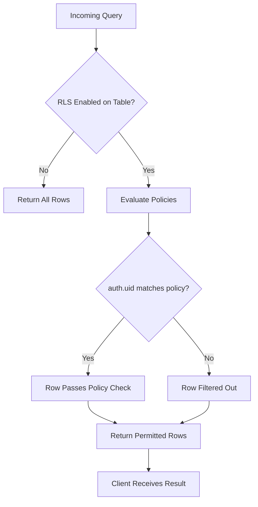

### 4.1. Database Optimization and Custom SQL

- **Indexing:** Create indexes on columns frequently used in queries.
- **Views and Materialized Views:** Use views for complex queries and materialized views for caching results.
- **Custom Functions and Triggers:** Write PostgreSQL functions and triggers to automate tasks.

#### Example: Creating an Index and a Trigger Function

```sql
-- Create an index on the "created_at" column of the messages table for faster sorting
CREATE INDEX idx_messages_created_at ON messages(created_at);

-- Create a trigger function to log new messages
CREATE OR REPLACE FUNCTION log_new_message() RETURNS trigger AS $$
BEGIN
  INSERT INTO message_logs(message_id, log_time)
  VALUES (NEW.id, NOW());
  RETURN NEW;
END;
$$ LANGUAGE plpgsql;

-- Attach the trigger to the messages table
CREATE TRIGGER new_message_log
AFTER INSERT ON messages
FOR EACH ROW EXECUTE FUNCTION log_new_message();
```

### 4.2. Error Handling, Logging, and Monitoring

- **Error Handling:** Always check for errors returned by Supabase client methods.
- **Logging:** Use logging libraries or Supabase’s built-in logging for monitoring API usage.
- **Monitoring:** Set up monitoring tools to track performance metrics and unauthorized access attempts.

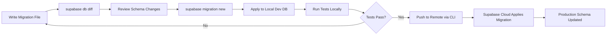

### 4.3. Continuous Integration and Deployment

- **Supabase CLI:** Use the Supabase CLI to manage migrations, local development, and deployment of edge functions.
- **CI/CD Pipelines:** Integrate tests and automated deployments using services like GitHub Actions, GitLab CI, or CircleCI.

#### Example: Running Supabase Locally

```bash
# Install the Supabase CLI
npm install -g supabase

# Start a local Supabase instance for development
supabase start
```

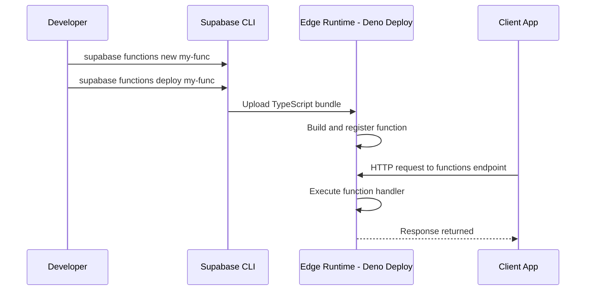

### 4.4. Integrating with Modern Frameworks

Supabase works well with frameworks like Next.js, Nuxt.js, and Svelte. Its flexibility allows you to use it for server-side rendering, static site generation, and client-side applications.

#### Example: Using Supabase in Next.js (Server-side Rendering)

```jsx
// pages/index.js
import { createClient } from "@supabase/supabase-js";

export async function getServerSideProps() {
  const supabase = createClient(
    process.env.SUPABASE_URL,
    process.env.SUPABASE_ANON_KEY,
  );
  const { data: profiles } = await supabase.from("profiles").select("*");
  return { props: { profiles } };
}

export default function Home({ profiles }) {
  return (
    <div>
      <h1>User Profiles</h1>
      <ul>
        {profiles.map((profile) => (
          <li key={profile.id}>
            {profile.username} - {profile.email}
          </li>
        ))}
      </ul>
    </div>
  );
}
```

---

## 5. Security and Performance Best Practices

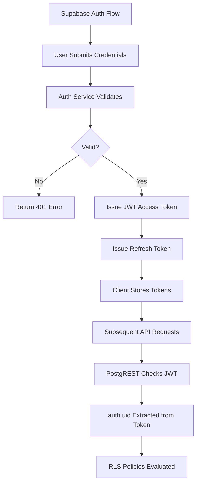

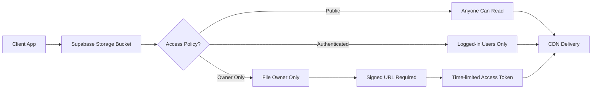

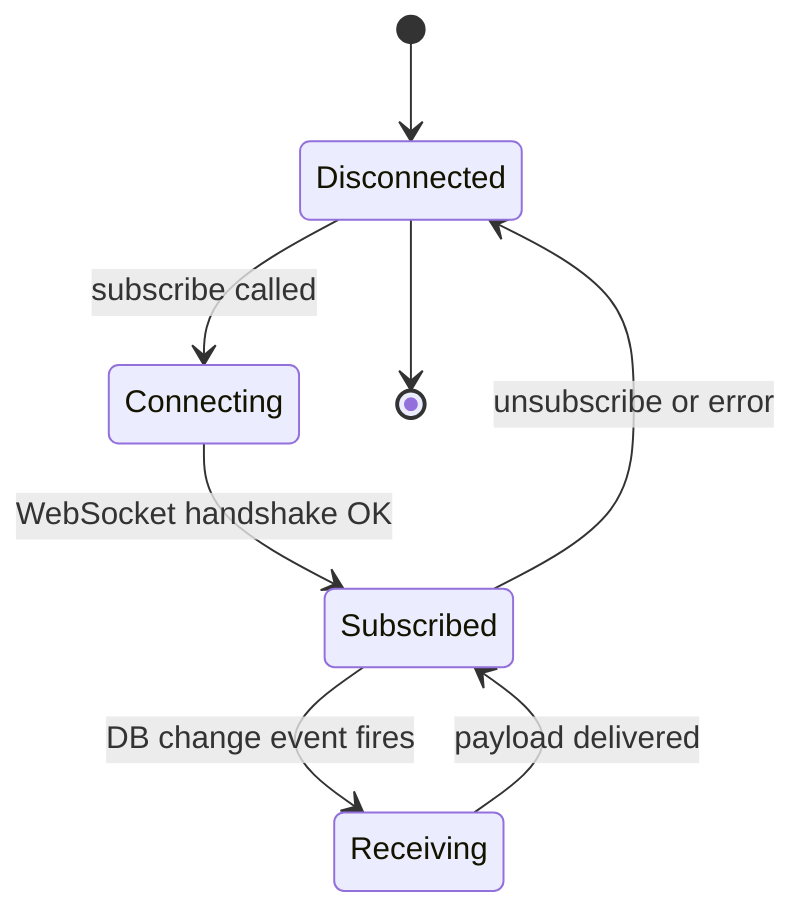

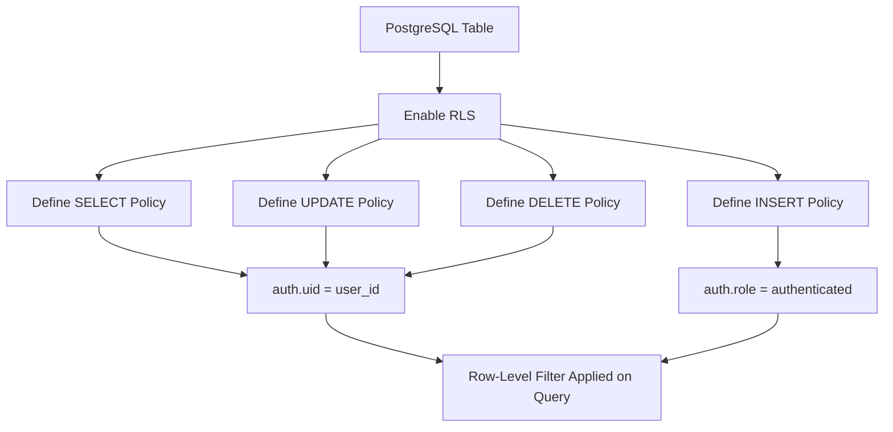

### 5.1. Enforce Row Level Security (RLS)

Always enable RLS on your tables and define policies to ensure that users can only access their own data. This is critical when exposing your database via auto-generated APIs.

```sql
-- Enable RLS on the profiles table
ALTER TABLE profiles ENABLE ROW LEVEL SECURITY;

-- Create a policy to allow users to only view their own profiles
CREATE POLICY "Users can view their own profile" ON profiles
FOR SELECT USING (auth.uid() = id);
```

### 5.2. Optimize Query Performance

- Use EXPLAIN ANALYZE to review and optimize slow queries.
- Cache frequent queries on the client side.
- Consider using materialized views for computationally expensive aggregations.

### 5.3. Secure API Keys and Environment Variables

Never expose your service role key on the client side. Use environment variables to store sensitive data and restrict permissions appropriately.

---

## 6. Supabase Branching and Database Webhooks

### 8.1 Supabase Branching

Supabase Branching (available on Pro and above) creates ephemeral preview databases for each pull request. Each branch gets its own Postgres instance with migrations applied, enabling isolated testing of schema changes before merging to production.

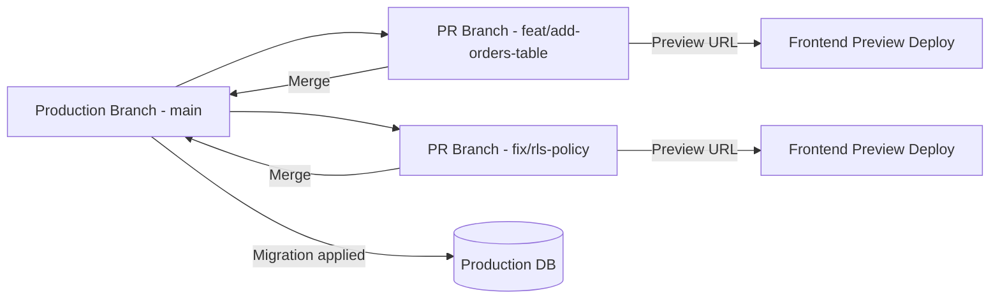

Branching integrates with GitHub via the Supabase GitHub App. When a PR is opened, Supabase automatically creates a new database branch, runs your migration files, and provides a branch-specific `SUPABASE_URL` for the preview deployment.

```bash
# Local development with Supabase CLI
supabase start                     # Start local instance
supabase db diff --schema public   # Diff local vs remote
supabase migration new add_orders  # Create a new migration file
supabase db push                   # Apply migrations to remote
```

### 8.2 Database Webhooks

Supabase Database Webhooks trigger HTTP requests when rows are inserted, updated, or deleted. This bridges your database events to external services like Slack, Stripe, or custom serverless functions without polling.

```sql
-- Create a webhook that fires on new order inserts
-- (configured via Supabase dashboard or via the Management API)
-- The webhook sends a POST to your edge function or external URL

-- Example: trigger when order status changes to 'shipped'
-- Webhook payload includes { type, table, record, old_record, schema }
```

```typescript
// Edge function that receives the webhook
// supabase/functions/order-shipped-webhook/index.ts
import { serve } from "std/server";

interface WebhookPayload {
  type: "INSERT" | "UPDATE" | "DELETE";
  table: string;
  record: { id: string; status: string; customer_email: string };
  old_record: { status: string } | null;
}

serve(async (req: Request) => {
  const payload: WebhookPayload = await req.json();

  // Only process status transitions to "shipped"
  if (
    payload.type === "UPDATE" &&
    payload.record.status === "shipped" &&
    payload.old_record?.status !== "shipped"
  ) {
    await sendShippingEmail(payload.record.customer_email, payload.record.id);
  }

  return new Response(JSON.stringify({ received: true }), { status: 200 });
});

async function sendShippingEmail(email: string, orderId: string) {
  // Call Resend, SendGrid, or any email provider
  await fetch("https://api.resend.com/emails", {
    method: "POST",
    headers: {
      Authorization: `Bearer ${Deno.env.get("RESEND_API_KEY")}`,
      "Content-Type": "application/json",
    },
    body: JSON.stringify({
      from: "orders@myshop.com",
      to: email,
      subject: `Order ${orderId} has shipped!`,
      html: `<p>Your order is on its way.</p>`,
    }),
  });
}
```

---

## 7. Custom JWT Claims and Role-Based Access

Supabase's auth system issues JWTs that can carry custom claims. These claims are accessible inside Row Level Security policies via `auth.jwt()`, enabling sophisticated role-based access control without a separate permissions table.

### 9.1 Adding Custom Claims via a Database Hook

```sql
-- Hook function that runs when a token is issued
-- Adds the user's role from the profiles table into the JWT
CREATE OR REPLACE FUNCTION custom_access_token_hook(event JSONB)
RETURNS JSONB
LANGUAGE plpgsql
AS $$
DECLARE
  claims JSONB;
  user_role TEXT;
BEGIN
  -- Fetch the user's role from the profiles table
  SELECT role INTO user_role
  FROM public.profiles
  WHERE id = (event->>'user_id')::UUID;

  claims := event->'claims';
  claims := jsonb_set(claims, '{user_role}', to_jsonb(COALESCE(user_role, 'viewer')));

  RETURN jsonb_set(event, '{claims}', claims);
END;
$$;

-- Register the hook in Supabase dashboard under Auth > Hooks
```

### 9.2 Using Custom Claims in RLS Policies

```sql
-- A documents table with role-based access
CREATE TABLE documents (
  id UUID PRIMARY KEY DEFAULT uuid_generate_v4(),
  title TEXT NOT NULL,
  content TEXT,
  visibility TEXT DEFAULT 'private' CHECK (visibility IN ('private', 'team', 'public')),
  owner_id UUID REFERENCES auth.users(id)
);

ALTER TABLE documents ENABLE ROW LEVEL SECURITY;

-- Admins can see all documents
CREATE POLICY "Admins see all" ON documents
FOR SELECT
USING ((auth.jwt()->>'user_role') = 'admin');

-- Users see their own private documents and all team documents
CREATE POLICY "Users see own and team docs" ON documents
FOR SELECT
USING (
  owner_id = auth.uid()
  OR visibility = 'public'
  OR (visibility = 'team' AND auth.role() = 'authenticated')
);
```

```mermaid
graph TD
    JWT[JWT Token] --> CLAIMS[Custom Claims: user_role=admin]
    CLAIMS --> RLS{RLS Policy Evaluation}
    RLS --> |auth.jwt() role check| ADMIN_CHECK{Is admin?}
    ADMIN_CHECK -->|Yes| ALL_ROWS[Return all rows]
    ADMIN_CHECK -->|No| OWNER_CHECK{Is owner or public?}
    OWNER_CHECK -->|Yes| OWN_ROWS[Return permitted rows]
    OWNER_CHECK -->|No| EMPTY[Return empty set]
```

---

## 8. Supabase AI: pgvector and Semantic Search

Supabase ships with the `pgvector` extension, turning your Postgres database into a vector store. This enables semantic search, RAG (Retrieval-Augmented Generation), and embedding-based recommendations without an external vector database.

### 10.1 Storing and Querying Embeddings

```sql
-- Enable the pgvector extension
CREATE EXTENSION IF NOT EXISTS vector;

-- Table to store document chunks with embeddings
CREATE TABLE document_embeddings (
  id BIGSERIAL PRIMARY KEY,
  content TEXT NOT NULL,
  embedding vector(1536),   -- OpenAI ada-002 dimension
  metadata JSONB DEFAULT '{}'
);

-- Create an IVFFlat index for approximate nearest neighbor search
CREATE INDEX ON document_embeddings
USING ivfflat (embedding vector_cosine_ops)
WITH (lists = 100);

-- Function: find similar documents by cosine similarity
CREATE OR REPLACE FUNCTION match_documents(
  query_embedding vector(1536),
  match_count INT DEFAULT 5,
  similarity_threshold FLOAT DEFAULT 0.78
)
RETURNS TABLE (id BIGINT, content TEXT, similarity FLOAT)
LANGUAGE sql STABLE
AS $$
  SELECT id, content, 1 - (embedding <=> query_embedding) AS similarity
  FROM document_embeddings
  WHERE 1 - (embedding <=> query_embedding) > similarity_threshold
  ORDER BY embedding <=> query_embedding
  LIMIT match_count;
$$;
```

### 10.2 RAG Pipeline with Supabase

```typescript
// lib/rag.ts - Full RAG pipeline using Supabase + OpenAI
import { createClient } from "@supabase/supabase-js";
import OpenAI from "openai";

const supabase = createClient(
  process.env.SUPABASE_URL!,
  process.env.SUPABASE_SERVICE_ROLE_KEY!,
);
const openai = new OpenAI({ apiKey: process.env.OPENAI_API_KEY });

// Step 1: Embed the user query
async function embedText(text: string): Promise<number[]> {
  const response = await openai.embeddings.create({
    model: "text-embedding-ada-002",
    input: text,
  });
  return response.data[0].embedding;
}

// Step 2: Retrieve relevant documents
async function retrieveDocuments(query: string, topK = 5) {
  const embedding = await embedText(query);
  const { data, error } = await supabase.rpc("match_documents", {
    query_embedding: embedding,
    match_count: topK,
    similarity_threshold: 0.75,
  });
  if (error) throw error;
  return data;
}

// Step 3: Generate an answer grounded in retrieved context
async function generateAnswer(query: string): Promise<string> {
  const docs = await retrieveDocuments(query);
  const context = docs.map((d: { content: string }) => d.content).join("\n\n");

  const completion = await openai.chat.completions.create({
    model: "gpt-4o-mini",
    messages: [
      {
        role: "system",
        content:
          "Answer questions using only the provided context. If the answer is not in the context, say so.",
      },
      {
        role: "user",
        content: `Context:\n${context}\n\nQuestion: ${query}`,
      },
    ],
  });
  return completion.choices[0].message.content ?? "";
}
```

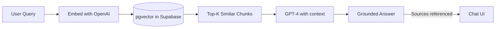

### 10.3 Ingesting Documents into pgvector

```typescript
// Chunk and embed a document for storage
async function ingestDocument(text: string, metadata: object = {}) {
  // Simple chunk strategy: 500-character sliding window with 100-char overlap
  const chunkSize = 500;
  const overlap = 100;
  const chunks: string[] = [];

  for (let i = 0; i < text.length; i += chunkSize - overlap) {
    chunks.push(text.slice(i, i + chunkSize));
  }

  for (const chunk of chunks) {
    const embedding = await embedText(chunk);
    await supabase.from("document_embeddings").insert({
      content: chunk,
      embedding,
      metadata,
    });
  }

  console.log(`Ingested ${chunks.length} chunks.`);
}
```

---

## 9. Conclusion

Supabase is a game-changer in backend development, offering an open source, scalable, and developer-friendly alternative to traditional backend-as-a-service solutions. By leveraging PostgreSQL, auto-generated APIs, real-time capabilities, integrated authentication, storage, and edge functions, Supabase provides a robust foundation for building full-stack applications quickly and securely. Whether you are developing a small MVP or a large-scale enterprise solution, Supabase's comprehensive feature set and extensive tooling empower you to focus on what matters - delivering a great user experience.

---

## 10. Further Resources

- **Supabase Official Documentation:** [https://supabase.com/docs](https://supabase.com/docs)
- **GitHub Repository:** [https://github.com/supabase/supabase](https://github.com/supabase/supabase)
- **Supabase Blog:** [https://supabase.com/blog](https://supabase.com/blog)
- **PostgreSQL Documentation:** [https://www.postgresql.org/docs/](https://www.postgresql.org/docs/)
- **Realtime with Supabase:** [https://supabase.com/blog/realtime](https://supabase.com/blog/realtime)
- **Community Discussions:** [https://github.com/supabase/supabase/discussions](https://github.com/supabase/supabase/discussions)

Happy coding! Explore the power of Supabase and build scalable, real-time applications with the confidence of full control and transparency.
