import MdxLayout from "@/components/MdxLayout";

export const metadata = {
  title: "Supervised vs. Unsupervised Learning",
  description:
    "An in-depth, comprehensive comparison of supervised and unsupervised learning, exploring theoretical foundations, algorithms, evaluation metrics, advanced articles, and real-world applications.",
  topics: ["Machine Learning", "Artificial Intelligence"],
};

export default function LearningContent({ children }) {
  return <MdxLayout>{children}</MdxLayout>;
}

# Supervised vs. Unsupervised Learning

### Author: Son Nguyen

> Date: 2024-04-01

Machine learning encompasses a wide range of methods to extract insights and make predictions from data. Two fundamental approaches are **Supervised Learning** and **Unsupervised Learning**. In this article, we will explore both paradigms in great detail - discussing their core concepts, popular algorithms, practical implementations, evaluation techniques, challenges, and applications - all without relying on explicit mathematical expressions.

---

## 1. Introduction

In machine learning, the choice of method depends largely on the type of data available and the problem you wish to solve. **Supervised learning** requires examples with known outcomes, teaching the model to predict or classify new data based on past observations. In contrast, **unsupervised learning** finds patterns, groupings, or structures within data when no specific outcomes are provided. This exploration will help you understand how to choose and apply the right approach for your projects.

---

## 2. Supervised Learning

Supervised learning involves training a model using data that includes both input features and known outcomes (labels). The goal is for the model to learn the relationship between inputs and outputs so that it can accurately predict outcomes for new, unseen data.

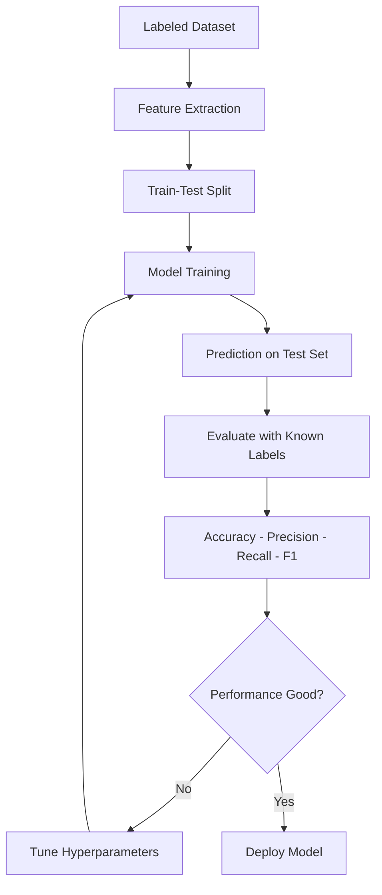

### 2.1 Core Concepts

- **Labeled Data:**
  The training data includes examples with corresponding outputs. For instance, a dataset of customer reviews where each review is labeled as positive or negative.

- **Prediction and Classification:**
  Models are designed to either predict continuous outcomes (such as house prices) or classify data into distinct categories (such as spam versus non-spam emails).

- **Learning Process:**
  The model adjusts its internal parameters based on the training data so that its predictions get closer to the actual labels. This adjustment happens through a process of trial and error until the model's performance is satisfactory.

### 2.2 Common Algorithms

- **Linear Regression:**
  A straightforward approach used for predicting continuous values. It models the relationship between the input features and the output as a straight-line approximation.

- **Logistic Regression:**
  Although similar in name to linear regression, this method is used for classification tasks by estimating the probability of an input belonging to a particular class.

- **Decision Trees and Random Forests:**
  These methods use a tree-like structure to split data into groups based on feature values. Decision trees are easy to interpret, and random forests combine multiple trees to improve accuracy.

- **Support Vector Machines (SVM):**
  SVMs work by finding the best boundary that separates different classes. They are effective in high-dimensional spaces and are widely used for classification tasks.

- **Neural Networks:**
  Inspired by the human brain, neural networks consist of layers of interconnected nodes. They are particularly powerful for tasks such as image and speech recognition, where patterns are complex.

### 2.3 Evaluation Metrics

For supervised learning, performance is measured using various metrics depending on the task:

- **For Classification:**
  Metrics such as accuracy, precision, recall, and F1 score help determine how well the model distinguishes between classes.
- **For Regression:**
  Metrics like mean squared error or mean absolute error indicate how close the predictions are to the actual values.

### 2.4 Practical Example: Linear Regression in Python

Below is a simple Python example using scikit-learn to train a linear regression model. This example demonstrates how a model can learn from labeled data and make predictions.

```python
from sklearn.linear_model import LinearRegression
from sklearn.model_selection import train_test_split
import numpy as np

# Create sample data: a list of single numbers as inputs and outputs that are double the input
X = np.array([[1], [2], [3], [4], [5]])
y = np.array([2, 4, 6, 8, 10])

# Split data into training and testing sets
X_train, X_test, y_train, y_test = train_test_split(X, y, test_size=0.2, random_state=42)

# Initialize and train the model
model = LinearRegression()
model.fit(X_train, y_train)

# Predict outcomes for the test set
predictions = model.predict(X_test)
print("Predictions:", predictions)
```

In this example, the model learns a simple relationship from the training data and is able to predict values for new inputs.

---

## 3. Unsupervised Learning

Unsupervised learning works with data that does not include explicit labels. The goal is to find patterns, groupings, or structures that naturally exist within the data.

### 3.1 Core Concepts

- **Unlabeled Data:**
  The input data does not come with predefined outputs. The algorithm must infer the structure on its own.

- **Discovering Patterns:**
  Unsupervised learning focuses on clustering similar data points, reducing the complexity of data by finding a simpler representation, or detecting anomalies that do not fit the general pattern.

- **Learning Process:**
  The model examines the data to identify similarities and differences, grouping similar instances together without any prior knowledge of what the output should be.

### 3.2 Common Algorithms

- **K-Means Clustering:**
  This algorithm partitions data into a predetermined number of clusters based on similarity. It iteratively assigns data points to the nearest cluster center and then updates the centers.

- **Hierarchical Clustering:**
  Instead of specifying the number of clusters in advance, hierarchical clustering builds a tree-like structure (dendrogram) that shows data grouped at different levels of similarity.

- **DBSCAN (Density-Based Spatial Clustering of Applications with Noise):**
  DBSCAN groups together points that are closely packed and marks points in sparse regions as outliers. It is particularly effective for data with irregular cluster shapes.

- **Dimensionality Reduction Techniques:**
  Methods such as Principal Component Analysis (PCA) and t-Distributed Stochastic Neighbor Embedding (t-SNE) simplify high-dimensional data into fewer dimensions, making it easier to visualize and interpret patterns.

### 3.3 Evaluation Metrics

Evaluating unsupervised learning can be more challenging because there are no ground truth labels:

- **Silhouette Score:**
  Measures how similar an object is to its own cluster compared to other clusters.
- **Davies-Bouldin Index:**
  A lower score indicates that clusters are well separated and compact.
- **Qualitative Assessment:**
  Often, visual inspection of clusters or reduced-dimension plots provides valuable insight into the quality of the grouping.

### 3.4 Practical Example: K-Means Clustering in Python

The following example demonstrates how to perform K-Means clustering using scikit-learn to group similar data points.

```python
from sklearn.cluster import KMeans
import numpy as np

# Create sample 2D data points
data = np.array([
    [1, 2],
    [1, 4],
    [1, 0],
    [10, 2],
    [10, 4],
    [10, 0]
])

# Initialize K-Means with 2 clusters and fit the data
kmeans = KMeans(n_clusters=2, random_state=42)
kmeans.fit(data)

# Retrieve and print cluster labels
labels = kmeans.labels_
print("Cluster labels:", labels)
```

This example shows how K-Means groups the data into clusters based on the inherent similarities between points.

---

## 4. Comparing Supervised and Unsupervised Learning

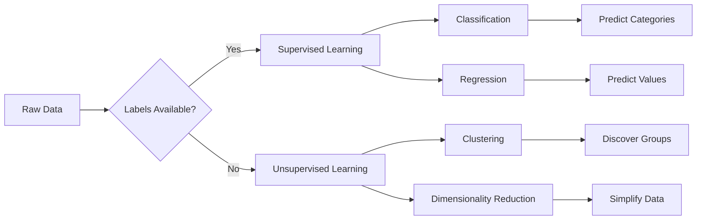

### 4.1 Fundamental Differences

- **Data Requirements:**
  Supervised learning relies on labeled examples, whereas unsupervised learning uses data without any labels.

- **Goals:**
  In supervised learning, the goal is to predict or classify new instances based on past examples. In unsupervised learning, the objective is to uncover hidden structures or groupings in the data.

- **Evaluation Methods:**
  Supervised learning benefits from well-defined metrics since the actual outcomes are known. Unsupervised learning often requires more subjective evaluation, relying on internal metrics or visual analysis.

- **Complexity and Preparation:**
  Supervised learning typically requires a significant investment in labeling data, while unsupervised learning may require careful preprocessing and domain expertise to interpret results.

### 4.2 When to Use Each Approach

- **Supervised Learning:**
  Best used when you have a large set of labeled data and need to make predictions about future events, such as classifying emails as spam or non-spam.

- **Unsupervised Learning:**
  Ideal when labels are unavailable or when you want to explore the underlying structure of the data, such as segmenting customers into different groups based on purchasing behavior.

---

## 5. Advanced Topics and Hybrid Approaches

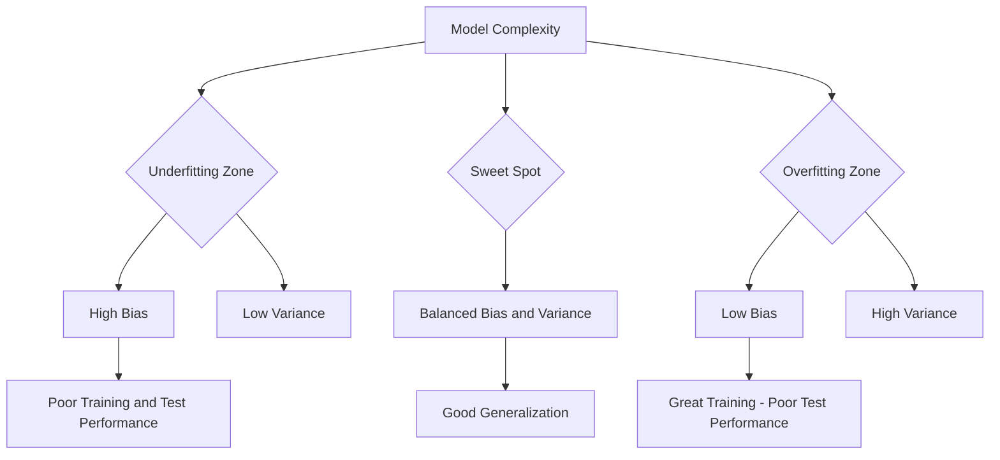

### 5.1 Semi-Supervised Learning

Semi-supervised learning takes advantage of a small amount of labeled data along with a larger pool of unlabeled data. This approach can improve model performance in situations where obtaining labels is expensive or time-consuming.

### 5.2 Self-Supervised Learning

Self-supervised learning generates surrogate labels from the data itself. For example, in natural language processing, a model might learn by predicting missing words in a sentence. This technique has shown promise in enabling models to learn useful representations without extensive manual labeling.

### 5.3 Reinforcement Learning Context

While not strictly supervised or unsupervised, reinforcement learning involves an agent learning to make decisions by receiving rewards or penalties from interactions with an environment. It is often combined with other learning techniques to handle complex, dynamic tasks.

### 5.4 Transfer Learning

Transfer learning involves adapting a pre-trained model to a new but related task. This technique is especially valuable when labeled data is limited, allowing a model to leverage knowledge gained from a different problem.

---

## 6. Challenges and Practical Considerations

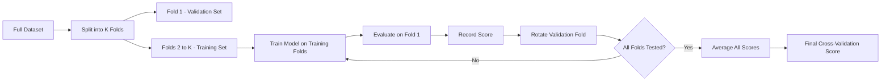

### 6.1 Data Quality and Labeling

- **For Supervised Learning:**
  The quality and quantity of labeled data greatly influence model performance. Poor or biased labels can lead to inaccurate predictions.
- **For Unsupervised Learning:**
  Interpreting the patterns discovered can be challenging, and the results often require domain knowledge to validate.

### 6.2 Scalability and Computation

As datasets grow, both supervised and unsupervised methods face challenges in processing large volumes of data efficiently. Leveraging distributed computing frameworks and efficient algorithms becomes critical.

### 6.3 Interpretability and Transparency

Understanding how a model makes decisions is crucial. Supervised models, especially deep neural networks, can be opaque, leading to the development of techniques such as explainable AI (XAI). Unsupervised learning results often need visualization and expert interpretation to be actionable.

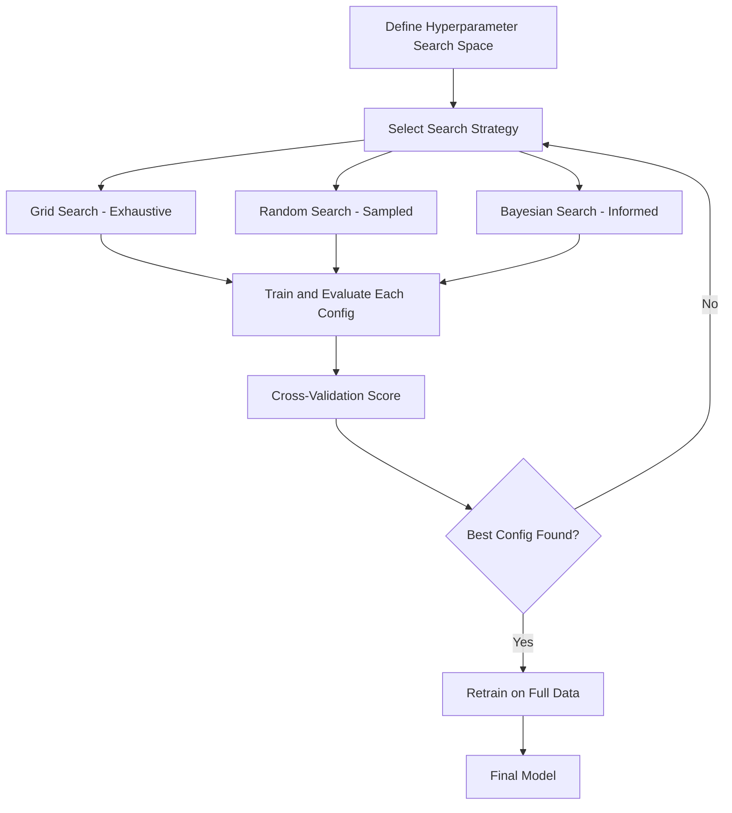

### 6.4 Future Trends

- **Hybrid Models:**
  Combining supervised and unsupervised methods is a growing trend. For instance, pre-training a model with unsupervised techniques and then fine-tuning it with labeled data can yield powerful results.
- **Automated Machine Learning (AutoML):**
  Tools that automatically select, tune, and evaluate models are becoming increasingly popular, helping to streamline the machine learning pipeline.

---

## 7. Real-World Applications

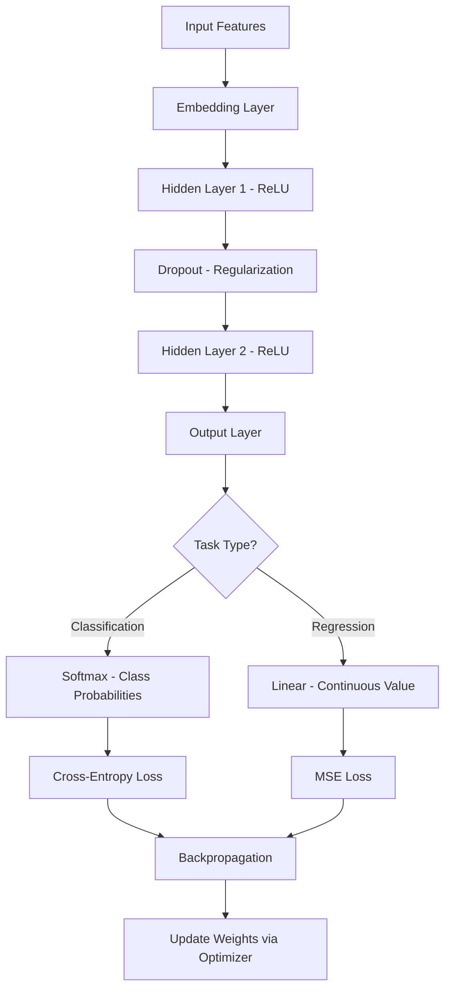

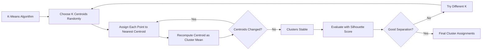

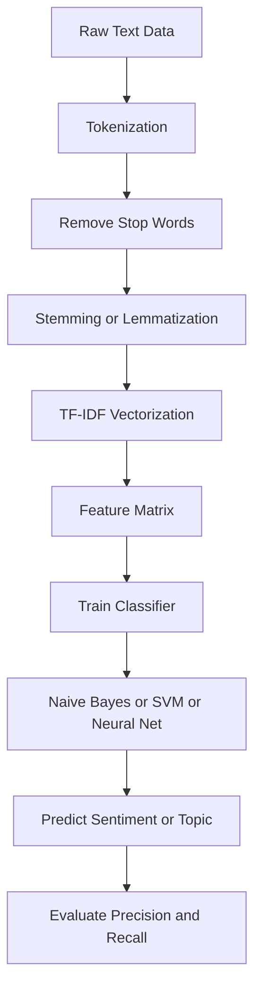

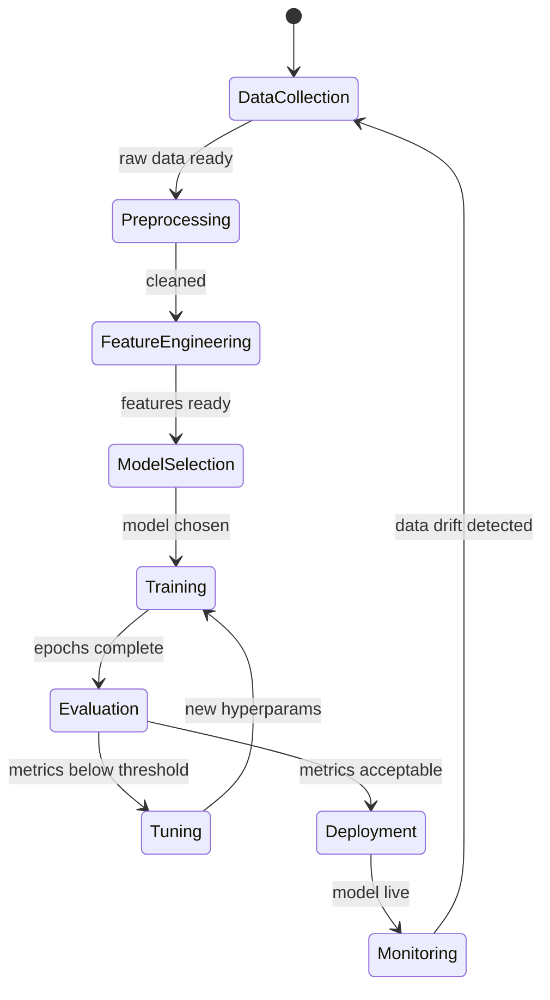

### 7.1 Applications of Supervised Learning

- **Medical Diagnosis:**
  Models that predict diseases based on patient data have improved early diagnosis and treatment planning.
- **Financial Forecasting:**
  Supervised models are used to predict market trends, assess risk, and automate trading strategies.
- **Image and Speech Recognition:**
  Deep learning models trained on vast amounts of labeled data enable accurate recognition systems for various applications.

### 7.2 Applications of Unsupervised Learning

- **Customer Segmentation:**
  Grouping customers based on behavioral data allows companies to tailor marketing strategies and improve customer experiences.
- **Anomaly Detection:**
  Detecting unusual patterns in network traffic or transactions helps in fraud detection and system security.
- **Data Visualization and Reduction:**
  Techniques like PCA or t-SNE help in reducing the dimensionality of data, making it easier to visualize complex datasets.

### 7.3 Industry Case Studies

- **Healthcare Analytics:**
  Hospitals use supervised learning for predicting patient outcomes and unsupervised learning for discovering patterns in patient data that lead to improved treatment protocols.
- **E-Commerce Personalization:**
  Retailers leverage supervised models to recommend products and unsupervised techniques to segment users and uncover purchasing trends.
- **Industrial IoT:**
  Predictive maintenance systems use supervised learning to forecast equipment failures while unsupervised learning identifies unexpected patterns in sensor data.

---

## 8. Ensemble Methods: From Bagging to Gradient Boosting

Ensemble methods combine multiple base learners to reduce variance, bias, or both. They consistently outperform single models on structured/tabular data and are the workhorse of competition-winning supervised learning pipelines.

### 8.1. Bagging (Bootstrap Aggregating)

Random Forest is the canonical bagging ensemble. Each tree trains on a bootstrap sample of the data, and a random subset of features is considered at each split. Predictions are averaged (regression) or majority-voted (classification).

```python
from sklearn.ensemble import RandomForestClassifier
from sklearn.datasets import make_classification
from sklearn.model_selection import train_test_split
from sklearn.metrics import classification_report

X, y = make_classification(
    n_samples=10_000, n_features=20, n_informative=10,
    n_redundant=5, random_state=42,
)
X_train, X_test, y_train, y_test = train_test_split(X, y, test_size=0.2, random_state=42)

rf = RandomForestClassifier(
    n_estimators=500,
    max_depth=None,           # grow full trees — bagging controls variance
    min_samples_leaf=1,
    max_features='sqrt',      # classic RF: sqrt(n_features) per split
    oob_score=True,           # out-of-bag accuracy estimate (free cross-validation)
    n_jobs=-1,
    random_state=42,
)
rf.fit(X_train, y_train)

print(f"OOB accuracy: {rf.oob_score_:.4f}")
print(classification_report(y_test, rf.predict(X_test)))
```

### 8.2. Gradient Boosting: XGBoost, LightGBM, CatBoost

Gradient boosting builds trees sequentially — each new tree fits the residuals of the previous ensemble. Modern implementations (XGBoost, LightGBM) achieve state-of-the-art results through histogram-based approximate splitting, level-wise or leaf-wise growth, and hardware acceleration.

```python
import lightgbm as lgb
from sklearn.model_selection import StratifiedKFold, cross_val_score
import numpy as np

lgb_model = lgb.LGBMClassifier(
    n_estimators=1000,
    learning_rate=0.05,
    num_leaves=63,
    max_depth=-1,
    min_child_samples=20,
    subsample=0.8,              # row sub-sampling per tree
    colsample_bytree=0.8,       # feature sub-sampling per tree
    reg_alpha=0.1,              # L1 regularization
    reg_lambda=0.1,             # L2 regularization
    early_stopping_rounds=50,   # stop if no improvement on eval set
    n_jobs=-1,
    random_state=42,
)

# Training with early stopping
lgb_model.fit(
    X_train, y_train,
    eval_set=[(X_test, y_test)],
    eval_metric='logloss',
    callbacks=[lgb.log_evaluation(100)],
)

cv_scores = cross_val_score(lgb_model, X, y, cv=StratifiedKFold(5), scoring='roc_auc')
print(f"CV ROC-AUC: {cv_scores.mean():.4f} ± {cv_scores.std():.4f}")
```

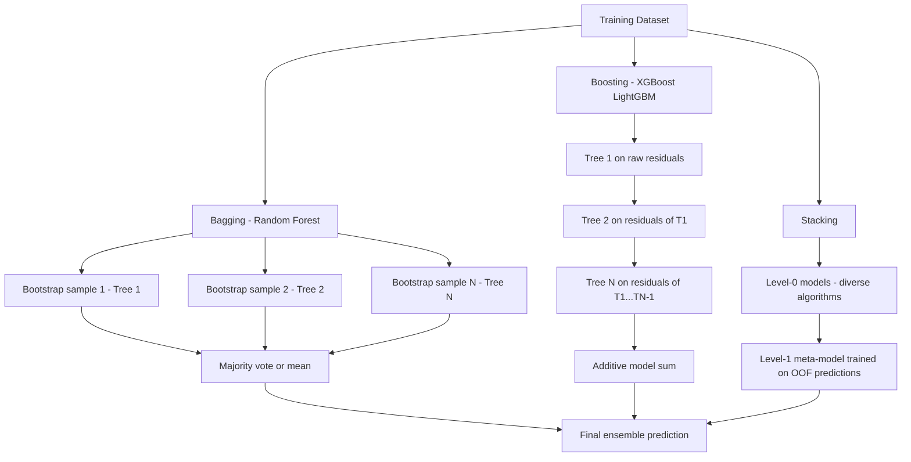

---

## 9. Feature Importance Analysis

Understanding which features drive predictions is critical for debugging, regulatory compliance, and feature selection.

### 9.1. Permutation Importance

Permutation importance is model-agnostic: shuffle one feature's values and measure the drop in performance. Large drops indicate important features.

```python
from sklearn.inspection import permutation_importance
import pandas as pd
import matplotlib.pyplot as plt

result = permutation_importance(
    rf, X_test, y_test,
    n_repeats=30,
    random_state=42,
    n_jobs=-1,
    scoring='roc_auc',
)

importance_df = pd.DataFrame({
    'feature':    [f"feature_{i}" for i in range(X.shape[1])],
    'importance': result.importances_mean,
    'std':        result.importances_std,
}).sort_values('importance', ascending=False)

# Plot top 15
top15 = importance_df.head(15)
plt.figure(figsize=(10, 6))
plt.barh(top15['feature'][::-1], top15['importance'][::-1],
         xerr=top15['std'][::-1], align='center', color='steelblue')
plt.xlabel('Mean AUC decrease')
plt.title('Permutation Feature Importance (test set)')
plt.tight_layout()
plt.savefig('feature_importance.png', dpi=150)
```

### 9.2. SHAP-based Feature Analysis

```python
import shap

# TreeExplainer is fast for tree-based models
explainer   = shap.TreeExplainer(lgb_model)
shap_values = explainer.shap_values(X_test)

# Global summary: mean absolute SHAP value per feature
shap.summary_plot(shap_values[1], X_test,
                  feature_names=[f"feature_{i}" for i in range(X.shape[1])],
                  plot_type='bar')

# Dependence plot: how feature_0 interacts with feature_1
shap.dependence_plot('feature_0', shap_values[1], X_test,
                     interaction_index='feature_1',
                     feature_names=[f"feature_{i}" for i in range(X.shape[1])])
```

---

## 10. Full scikit-learn Pipeline with Preprocessing

A Pipeline encapsulates preprocessing and modeling into a single estimator that can be cross-validated, serialized, and deployed as a unit.

```python
from sklearn.pipeline import Pipeline
from sklearn.compose import ColumnTransformer
from sklearn.preprocessing import StandardScaler, OneHotEncoder
from sklearn.impute import SimpleImputer
from sklearn.ensemble import GradientBoostingClassifier
from sklearn.model_selection import GridSearchCV
import joblib

# Example: mixed numerical and categorical features
numeric_features     = ['age', 'income', 'debt_ratio']
categorical_features = ['region', 'employment_type', 'loan_purpose']

numeric_transformer = Pipeline([
    ('imputer', SimpleImputer(strategy='median')),
    ('scaler',  StandardScaler()),
])

categorical_transformer = Pipeline([
    ('imputer', SimpleImputer(strategy='most_frequent')),
    ('encoder', OneHotEncoder(handle_unknown='ignore', sparse_output=False)),
])

preprocessor = ColumnTransformer([
    ('num', numeric_transformer,  numeric_features),
    ('cat', categorical_transformer, categorical_features),
])

full_pipeline = Pipeline([
    ('preprocessor', preprocessor),
    ('classifier',   GradientBoostingClassifier(random_state=42)),
])

# Hyperparameter search with cross-validation
param_grid = {
    'classifier__n_estimators':  [100, 300],
    'classifier__learning_rate': [0.05, 0.1],
    'classifier__max_depth':     [3, 5],
}
grid_search = GridSearchCV(
    full_pipeline,
    param_grid,
    cv=5,
    scoring='roc_auc',
    n_jobs=-1,
    verbose=1,
)
grid_search.fit(X_train, y_train)

print(f"Best params: {grid_search.best_params_}")
print(f"Best CV AUC: {grid_search.best_score_:.4f}")

# Save the best pipeline (preprocessor + model bundled)
joblib.dump(grid_search.best_estimator_, 'loan_model_v1.joblib')
```

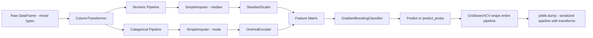

---

## 11. AutoML Approaches

AutoML systems automate the search over preprocessing, algorithm selection, and hyperparameter tuning. They are useful when you need a baseline quickly, when domain expertise is limited, or as a benchmark to beat.

### 11.1. Auto-sklearn

```python
import autosklearn.classification
from sklearn.model_selection import train_test_split
from sklearn.datasets import fetch_openml

# Fetch a real dataset
dataset = fetch_openml(data_id=1590, as_frame=True)  # Adult income
X, y    = dataset.data, dataset.target

X_train, X_test, y_train, y_test = train_test_split(
    X, y, test_size=0.2, stratify=y, random_state=42
)

automl = autosklearn.classification.AutoSklearnClassifier(
    time_left_for_this_task=600,    # 10-minute total budget
    per_run_time_limit=60,          # 1 minute per candidate
    n_jobs=-1,
    memory_limit=8192,              # MB
    metric=autosklearn.metrics.roc_auc,
)
automl.fit(X_train, y_train)

print(automl.leaderboard())
print(f"Test AUC: {automl.score(X_test, y_test):.4f}")
```

### 11.2. FLAML (Fast AutoML)

```python
from flaml import AutoML

automl = AutoML()
automl.fit(
    X_train, y_train,
    task='classification',
    time_budget=120,             # seconds
    metric='roc_auc',
    estimator_list=['lgbm', 'xgboost', 'rf', 'catboost'],
    log_file_name='flaml.log',
)

print(f"Best model: {automl.best_estimator}")
print(f"Best config: {automl.best_config}")
```

---

## 12. Conclusion

Supervised and unsupervised learning are two pillars of machine learning, each serving distinct purposes. Supervised learning excels when historical labeled data is available and precise predictions are needed. Unsupervised learning, on the other hand, shines in exploring data to uncover hidden structures and patterns.

Ensemble methods — particularly gradient boosting implementations like LightGBM and XGBoost — remain the most reliable approach for structured/tabular supervised tasks. Feature importance analysis via permutation importance and SHAP values bridges the gap between raw predictive power and actionable model understanding. Full scikit-learn pipelines bundle preprocessing and modeling into deployable, cross-validatable artifacts. AutoML tools accelerate experimentation and set competitive baselines, though domain expertise still determines which features to engineer and which business constraints to encode.

Understanding the core principles, challenges, and applications of these methodologies empowers you to choose and combine techniques effectively. As the field continues to evolve, hybrid approaches like semi-supervised and self-supervised learning are paving the way for even more powerful and adaptable models.

By keeping up with advances in these areas and leveraging modern tools, you can develop machine learning solutions that not only meet current needs but also adapt to future challenges and opportunities.

---

## 13. Further Reading and Resources

- **Books:**
  - _"Deep Learning"_ by Ian Goodfellow, Yoshua Bengio, and Aaron Courville – A comprehensive resource on modern deep learning techniques.
  - _"Machine Learning Yearning"_ by Andrew Ng – Insights on how to structure machine learning projects.
- **Online Courses:**
  - Coursera’s _Machine Learning_ by Andrew Ng – A foundational course that covers key concepts in supervised learning.
  - Fast.ai’s _Practical Deep Learning for Coders_ – A hands-on course to build and deploy deep learning models.
- **Tools and Libraries:**
  - scikit-learn for classical machine learning algorithms.
  - TensorFlow and PyTorch for deep learning applications.
  - Keras for an accessible interface to build neural networks.
- **Research and Blogs:**
  - The Machine Learning Mastery blog for practical guides.
  - Papers with Code for cutting-edge research and implementations.

---
