import MdxLayout from "@/components/MdxLayout";

export const metadata = {
  title: "TailwindCSS: A Comprehensive Guide",
  description:
    "An in-depth exploration of TailwindCSS, covering its core concepts, installation, configuration, customization, and best practices for building modern, responsive web designs.",
  topics: ["Web Development", "Design", "Web Frameworks", "Web Architecture"],
};

export default function TailwindCSSArticle({ children }) {
  return <MdxLayout>{children}</MdxLayout>;
}

# TailwindCSS: A Comprehensive Guide

### Author: Son Nguyen

> Date: 2025-02-14

TailwindCSS is a utility-first CSS framework that enables rapid UI development by providing a set of low-level utility classes. Instead of writing custom CSS for every component, TailwindCSS lets you build complex, responsive designs directly in your markup. This guide will walk you through the core concepts, installation, configuration, customization options, and best practices for using TailwindCSS in modern web development.

---

## 1. Introduction

Traditional CSS frameworks often come with pre-designed components that can limit your design flexibility. TailwindCSS takes a different approach by offering utility classes that you can combine to create custom designs without leaving your HTML. This approach offers:

- **Rapid Prototyping:** Quickly build and iterate on designs.
- **Consistency:** Use a standardized set of utility classes for consistent styling.
- **Customization:** Easily extend and modify the default configuration to suit your design needs.
- **Responsive Design:** Built-in responsive utilities make designing for various screen sizes straightforward.

---

## 2. Installation

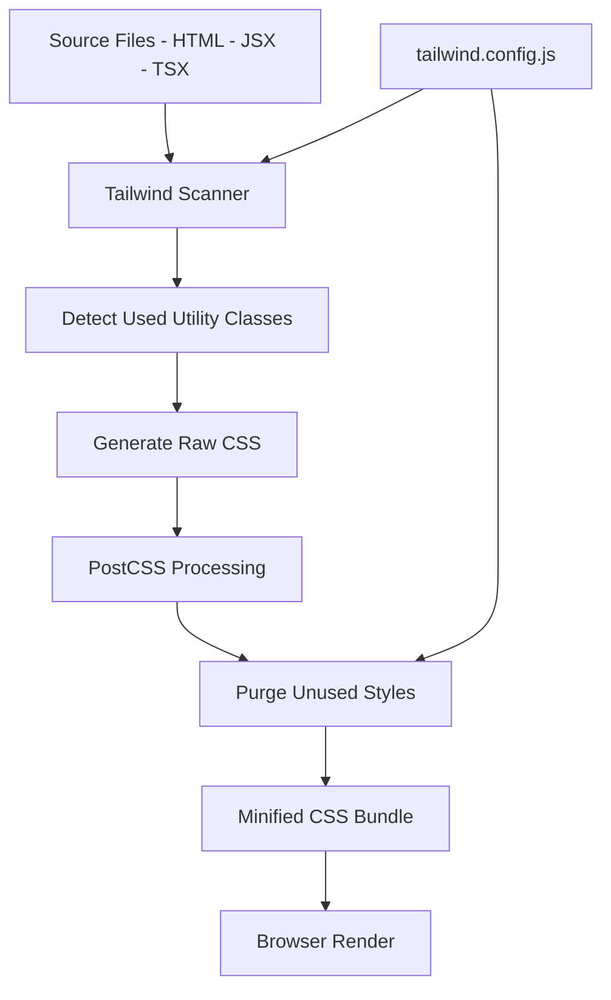

### Using npm

To install TailwindCSS in your project, run the following commands:

```bash
npm install -D tailwindcss postcss autoprefixer
npx tailwindcss init -p
```

This creates a `tailwind.config.js` file and a `postcss.config.js` file. The configuration files allow you to customize Tailwind’s default settings and integrate it with your build process.

### Setting Up Your CSS

Create a CSS file (e.g., `styles/globals.css`) and add the following Tailwind directives:

```css
@tailwind base;
@tailwind components;
@tailwind utilities;
```

Make sure to import this CSS file into your project (e.g., in your Next.js `_app.js` or equivalent).

---

## 3. Configuration

TailwindCSS is highly configurable. The `tailwind.config.js` file allows you to customize your theme, add plugins, and specify which files Tailwind should scan for class names.

### Example Configuration

```js
// tailwind.config.js
/** @type {import('tailwindcss').Config} */
module.exports = {
  content: [
    "./pages/**/*.{js,ts,jsx,tsx,mdx}",
    "./components/**/*.{js,ts,jsx,tsx,mdx}",
  ],
  theme: {
    extend: {
      colors: {
        "container-background": "#f9fafb",
        "text-color": "#111827",
        "link-color": "#3b82f6",
        "border-color": "#e5e7eb",
      },
      fontFamily: {
        sans: ["Inter", "sans-serif"],
      },
    },
  },
  plugins: [],
};
```

**Note:** If you are using a framework like Next.js or a library like React, ensure that you set your `styles.css` (or equivalent) file to:

```css
@import "tailwindcss";
```

This tells your build process to include TailwindCSS in your final CSS bundle, so it does not get purged.

### Key Configuration Options

- **`content`:**
  Specifies the file paths that Tailwind should scan for class names, ensuring that unused styles are purged in production.
- **`theme.extend`:**
  Allows you to add custom values to Tailwind’s default theme without completely replacing it.
- **`plugins`:**
  Integrate additional plugins to extend Tailwind’s functionality.

---

## 4. Utility-First Approach

TailwindCSS is built around utility classes. Instead of writing custom CSS, you use classes like `p-4`, `bg-blue-500`, `text-center`, and more to style your elements directly in your HTML.

### Example

```html
<div class="bg-container-background text-text-color p-6 rounded-lg shadow-md">
  <h1 class="text-3xl font-bold mb-4">Hello, TailwindCSS!</h1>
  <p class="text-lg">
    This is a simple example of how TailwindCSS can help you rapidly build a
    modern UI.
  </p>
</div>
```

Each class corresponds to a specific style:

- `bg-container-background`: Sets the background color.
- `text-text-color`: Sets the text color.
- `p-6`: Applies padding.
- `rounded-lg`: Rounds the corners.
- `shadow-md`: Applies a medium box-shadow.

---

## 5. Responsive Design

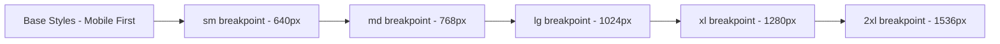

TailwindCSS makes responsive design simple with its mobile-first approach. Use prefixes like `sm:`, `md:`, `lg:`, and `xl:` to apply styles at different breakpoints.

### Example

```html
<div class="p-4 sm:p-6 md:p-8 lg:p-10 xl:p-12">
  <p class="text-base sm:text-lg md:text-xl lg:text-2xl xl:text-3xl">
    Responsive text that scales on different screen sizes.
  </p>
</div>
```

This example adjusts both padding and text size based on the viewport width.

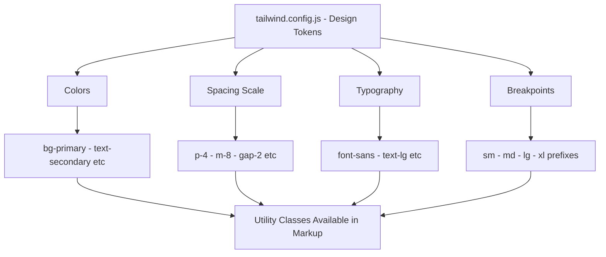

---

## 6. Customization and Extensibility

TailwindCSS is designed to be customized. You can extend the default theme, create your own utility classes, or even add plugins to handle custom functionalities.

### Extending the Theme

You can add custom colors, fonts, spacing values, and more in your `tailwind.config.js`:

```js
theme: {
  extend: {
    colors: {
      primary: "#1D4ED8",
      secondary: "#F43F5E",
    },
    spacing: {
      '128': '32rem',
    },
    borderRadius: {
      'xl': '1rem',
    },
  },
},
```

### Using Plugins

TailwindCSS has a growing ecosystem of plugins. For example, you can use the `@tailwindcss/forms` plugin to style forms consistently:

```bash
npm install @tailwindcss/forms
```

Then, add it to your configuration:

```js
plugins: [require('@tailwindcss/forms')],
```

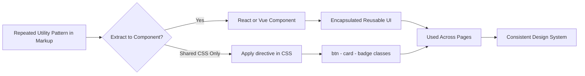

---

## 7. Best Practices

1. **Purge Unused CSS:**
   Ensure that your `content` paths in `tailwind.config.js` are correctly set up so that Tailwind can remove unused styles in production builds.

2. **Keep It Semantic:**
   Although Tailwind encourages inline styling with utility classes, try to maintain semantic HTML for accessibility and SEO.

3. **Component Extraction:**
   As your project grows, extract frequently used utility combinations into reusable components or apply the `@apply` directive in your CSS files.

4. **Consistent Naming:**
   Use consistent naming conventions in your configuration to keep your design system coherent.

5. **Responsive Design:**
   Always consider mobile-first design principles. Test your layouts on various devices to ensure they look great everywhere.

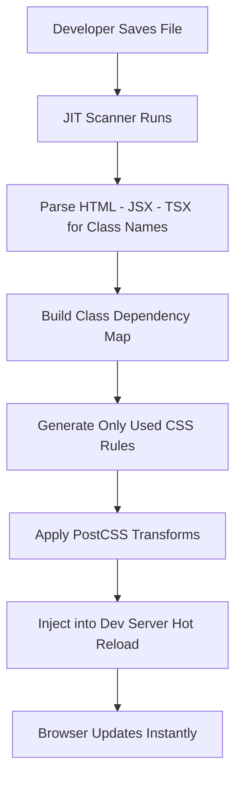

---

## 8. Real-World Examples

TailwindCSS is widely used in production by companies like GitHub, Discord, and more. Many modern web applications leverage its utility-first approach to build fast, responsive, and maintainable UIs.

### Example: Landing Page

Imagine a landing page built entirely with TailwindCSS:

```html
<section class="bg-blue-600 text-white py-20">
  <div class="container mx-auto px-4 text-center">
    <h1 class="text-5xl font-bold mb-6">Welcome to Our Product</h1>
    <p class="text-xl mb-8">
      Building responsive, modern web applications with ease.
    </p>
    <a
      href="#get-started"
      class="bg-white text-blue-600 py-3 px-6 rounded-full shadow hover:bg-gray-100 transition"
    >
      Get Started
    </a>
  </div>
</section>
```

This snippet uses Tailwind's utility classes to create a visually appealing and responsive landing page section.

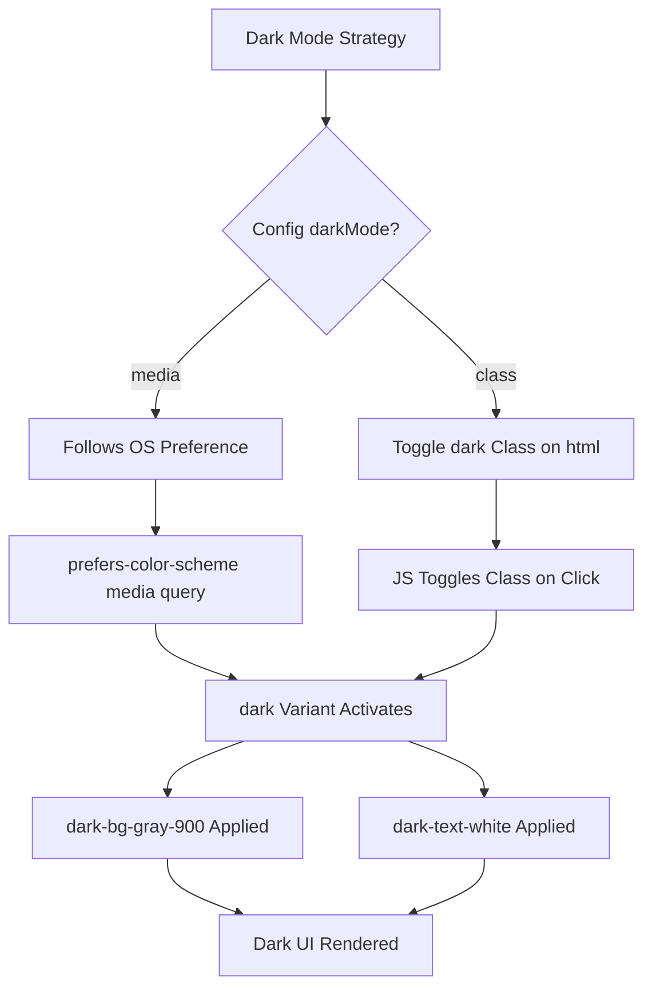

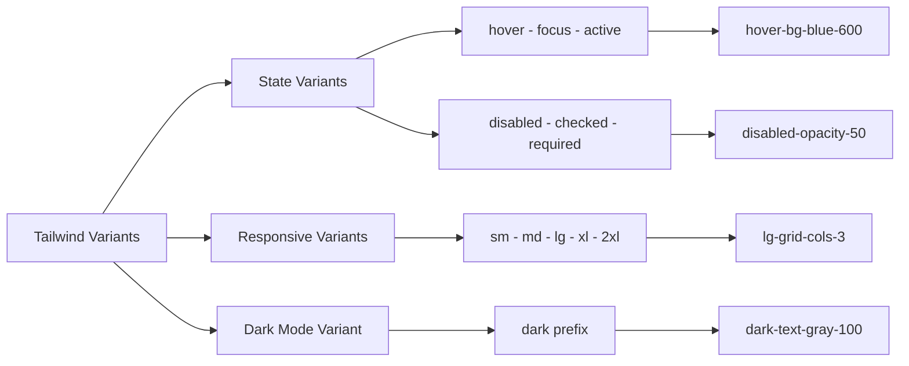

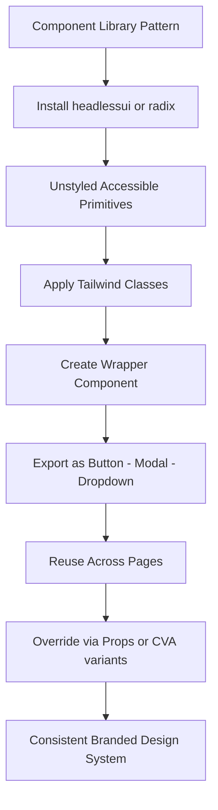

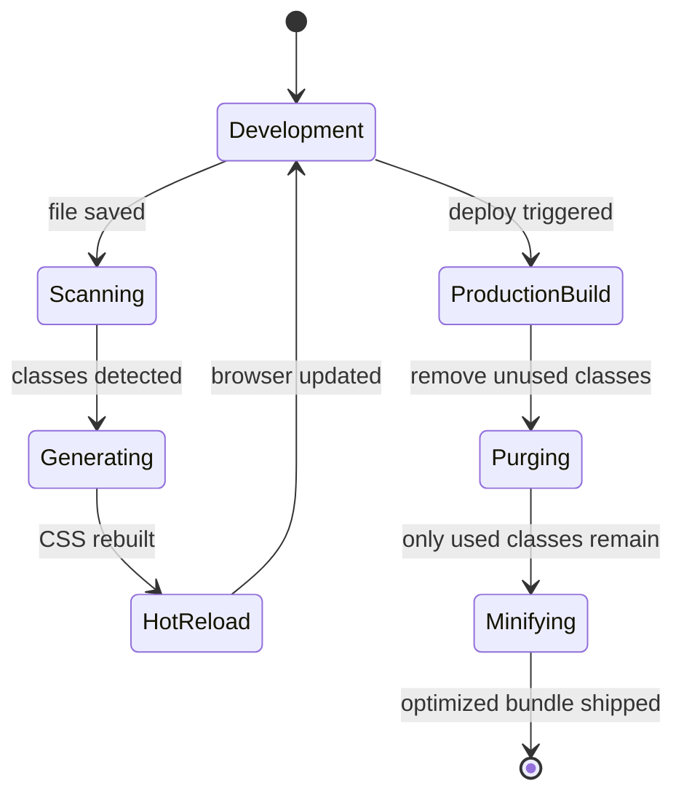

---

## 9. Group and Peer Modifiers

Two of Tailwind's most powerful but underused features are `group` and `peer`. They let you style children based on parent state, and siblings based on sibling state, without any JavaScript.

### The `group` Modifier

Apply `group` to a parent container, then use `group-hover:`, `group-focus:`, `group-aria-*:` on any descendant.

```html
<div
  class="group relative cursor-pointer rounded-xl border border-gray-200 p-6 hover:border-blue-500 hover:shadow-lg transition-all"
>
  <h2
    class="text-lg font-semibold text-gray-900 group-hover:text-blue-600 transition-colors"
  >
    Card Title
  </h2>
  <p class="mt-2 text-sm text-gray-500 group-hover:text-gray-700">
    Hover the card to see all children respond together.
  </p>
  <span
    class="absolute right-4 top-4 opacity-0 group-hover:opacity-100 transition-opacity text-blue-500 text-xs font-medium"
  >
    View →
  </span>
</div>
```

You can also name groups to avoid conflicts when nesting:

```html
<div class="group/card">
  <div class="group/header">
    <span class="group-hover/card:text-blue-500 group-hover/header:font-bold">
      Nested group targeting
    </span>
  </div>
</div>
```

### The `peer` Modifier

`peer` applies a class to a sibling element when the marked element is in a given state. This is especially useful for custom form controls.

```html
<form class="space-y-4">
  <div>
    <input
      type="email"
      id="email"
      placeholder=" "
      required
      class="peer block w-full rounded-lg border border-gray-300 px-4 py-3 text-sm
             focus:border-blue-500 focus:outline-none focus:ring-2 focus:ring-blue-200
             invalid:[&:not(:placeholder-shown)]:border-red-500"
    />
    <p
      class="mt-1 hidden text-xs text-red-500 peer-[&:not(:placeholder-shown)]:peer-invalid:block"
    >
      Please enter a valid email address.
    </p>
  </div>
</form>
```

---

## 10. Building a Custom Tailwind Plugin

Plugins let you extend Tailwind with your own utilities, components, and variants. They are plain JavaScript functions that tap into PostCSS internals through a provided API.

### Plugin Structure

```js
// tailwind.config.js
const plugin = require("tailwindcss/plugin");

module.exports = {
  plugins: [
    plugin(function ({ addUtilities, addComponents, addVariant, theme, e }) {
      // 1. Add custom utilities
      addUtilities({
        ".text-balance": { "text-wrap": "balance" },
        ".text-pretty": { "text-wrap": "pretty" },
        ".scrollbar-thin": {
          "scrollbar-width": "thin",
          "scrollbar-color": `${theme("colors.gray.400")} transparent`,
        },
      });

      // 2. Add component classes
      addComponents({
        ".btn": {
          display: "inline-flex",
          alignItems: "center",
          justifyContent: "center",
          borderRadius: theme("borderRadius.lg"),
          paddingLeft: theme("spacing.4"),
          paddingRight: theme("spacing.4"),
          paddingTop: theme("spacing.2"),
          paddingBottom: theme("spacing.2"),
          fontWeight: theme("fontWeight.semibold"),
          transition: "all 150ms ease",
        },
        ".btn-primary": {
          backgroundColor: theme("colors.blue.600"),
          color: theme("colors.white"),
          "&:hover": { backgroundColor: theme("colors.blue.700") },
        },
      });

      // 3. Add custom variants
      addVariant("hocus", ["&:hover", "&:focus"]);
      addVariant("children", "& > *");
      addVariant("not-first", "&:not(:first-child)");
    }),
  ],
};
```

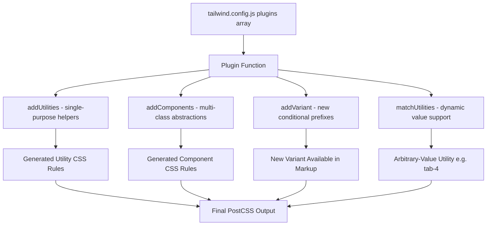

### Dynamic Utilities with `matchUtilities`

`matchUtilities` integrates your custom utility with Tailwind's arbitrary-value and `theme()` systems:

```js
plugin(function ({ matchUtilities, theme }) {
  matchUtilities(
    {
      tab: (value) => ({
        tabSize: value,
      }),
    },
    { values: theme("spacing") },
  );
});
```

This lets you write `tab-4`, `tab-8`, or even `tab-[3]` in markup.

---

## 11. Animation Utilities

Tailwind ships with `animate-spin`, `animate-ping`, `animate-pulse`, and `animate-bounce` out of the box, but the real power is in composing custom keyframe animations through config.

### Configuring Custom Keyframes

```js
// tailwind.config.js
module.exports = {
  theme: {
    extend: {
      keyframes: {
        "fade-in": {
          from: { opacity: "0", transform: "translateY(8px)" },
          to: { opacity: "1", transform: "translateY(0)" },
        },
        "slide-in-right": {
          from: { transform: "translateX(100%)", opacity: "0" },
          to: { transform: "translateX(0)", opacity: "1" },
        },
        shimmer: {
          "0%": { backgroundPosition: "-200% 0" },
          "100%": { backgroundPosition: "200% 0" },
        },
      },
      animation: {
        "fade-in": "fade-in 0.3s ease-out both",
        "slide-in-right": "slide-in-right 0.4s ease-out both",
        shimmer: "shimmer 1.5s infinite linear",
      },
    },
  },
};
```

Usage in markup:

```html
<!-- Skeleton loader with shimmer -->
<div
  class="h-4 w-full rounded bg-gradient-to-r from-gray-200 via-gray-100 to-gray-200
         bg-[length:200%_100%] animate-shimmer"
></div>

<!-- Page section entrance -->
<section class="animate-fade-in">
  <h1 class="text-4xl font-bold">Welcome</h1>
</section>
```

---

## 12. Tailwind with Component Libraries

Combining Tailwind's utility classes with unstyled, accessible primitives from libraries like Headless UI, Radix UI, or shadcn/ui gives you the best of both worlds: behavioral correctness and total styling freedom.

```mermaid
graph LR
    A[shadcn/ui or Radix UI] --> B[Unstyled Accessible Primitives]
    B --> C[Dialog, Dropdown, Tooltip, etc.]
    C --> D[Apply Tailwind Classes via className]
    D --> E[Branded Component]
    E --> F[Wrap in Your Own Component]
    F --> G[Export from design-system package]
    G --> H[Consumed across monorepo apps]
    H --> I[Override variants via CVA or clsx]
```

### Class Variance Authority (CVA) Pattern

CVA is a tiny library that manages class variants in a type-safe way, making it ideal for building Tailwind-based design systems:

```tsx
import { cva, type VariantProps } from "class-variance-authority";
import { cn } from "@/lib/utils";

const button = cva(
  "inline-flex items-center justify-center rounded-lg font-semibold transition-all focus-visible:outline-none",
  {
    variants: {
      intent: {
        primary: "bg-blue-600 text-white hover:bg-blue-700",
        secondary: "bg-gray-100 text-gray-900 hover:bg-gray-200",
        danger: "bg-red-600 text-white hover:bg-red-700",
        ghost: "text-gray-600 hover:bg-gray-100",
      },
      size: {
        sm: "h-8  px-3 text-xs",
        md: "h-10 px-4 text-sm",
        lg: "h-12 px-6 text-base",
        icon: "h-10 w-10",
      },
    },
    defaultVariants: {
      intent: "primary",
      size: "md",
    },
  },
);

type ButtonProps = React.ButtonHTMLAttributes<HTMLButtonElement> &
  VariantProps<typeof button>;

export function Button({ intent, size, className, ...props }: ButtonProps) {
  return (
    <button className={cn(button({ intent, size }), className)} {...props} />
  );
}
```

---

## 13. Performance: Bundle Size and Production Build

Tailwind v3 with JIT generates only the classes present in your scanned content files, so the final CSS bundle is almost always under 15 KB gzipped in production — far smaller than a typical custom stylesheet.

### Common Pitfalls That Bloat the Bundle

1. **Dynamic class construction** - Tailwind cannot detect strings assembled at runtime:

```js
// BAD: Tailwind's scanner will not find these classes
const color = userColor; // e.g. "blue"
return <div className={`text-${color}-500`}>...</div>;

// GOOD: Use a full class lookup map
const colorMap = {
  blue: "text-blue-500",
  green: "text-green-500",
  red: "text-red-500",
};
return <div className={colorMap[userColor]}>...</div>;
```

2. **Missing content paths** - If a file is not in the `content` glob, its classes will be purged.

3. **Third-party component packages** - Include the package's source files in `content` if they use Tailwind classes:

```js
content: [
  './src/**/*.{ts,tsx}',
  './node_modules/@my-org/design-system/dist/**/*.js', // add this
],
```

### CSS Layer Strategy

Use `@layer` to keep your custom CSS co-operating with Tailwind's specificity model:

```css
@layer base {
  /* Resets and defaults: lowest specificity */
  h1,
  h2,
  h3 {
    font-weight: 700;
  }
}

@layer components {
  /* Reusable multi-utility patterns */
  .card {
    @apply rounded-xl border border-gray-200 p-6 shadow-sm;
  }
}

@layer utilities {
  /* Custom single-purpose utilities: highest specificity */
  .content-auto {
    content-visibility: auto;
  }
}
```

---

## 14. Conclusion

TailwindCSS offers a powerful, utility-first approach to styling that can dramatically speed up your development process while keeping your designs consistent and responsive. With its extensive configuration options and rich plugin ecosystem, TailwindCSS is an ideal choice for modern web development.

From advanced modifiers like `group` and `peer` to custom plugin APIs and CVA-powered component systems, Tailwind scales from a single-page project all the way to an enterprise design system. The JIT compiler keeps production bundles lean, and the rich ecosystem of headless UI primitives means you never have to choose between accessibility and pixel-perfect designs.

By mastering TailwindCSS, you can build beautiful, performant, and maintainable web applications with ease. Whether you're a beginner or an experienced developer, TailwindCSS empowers you to bring your design vision to life without writing a lot of custom CSS.

---

## 15. Further Reading and Resources

- **Official Documentation:** [TailwindCSS Documentation](https://tailwindcss.com/docs)
- **Tailwind Play:** [Tailwind Play](https://play.tailwindcss.com/) – An interactive playground for experimenting with TailwindCSS.
- **Community & Tutorials:**
  - Check out tutorials on YouTube and blog posts on sites like [Tailwind Toolbox](https://www.tailwindtoolbox.com/).
- **Courses:**
  - Courses on Udemy, Egghead.io, and other platforms that focus on building UIs with TailwindCSS.

---

_This comprehensive guide provides an in-depth look at TailwindCSS, from installation and configuration to advanced customization and best practices. Dive into TailwindCSS and transform your approach to building modern, responsive web designs!_
