import MdxLayout from "@/components/MdxLayout";

export const metadata = {
  title:
    "Mastering Technical Interview Concepts: A Guide to DSA & Problem-Solving",
  description:
    "An exhaustive guide to technical interview concepts covering data structures, algorithms, dynamic programming, stacks, and more.",
  topics: [
    "Technical Interviews",
    "Algorithms",
    "Data Structures",
    "Problem Solving",
  ],
};

export default function TechnicalInterviewConceptsContent({ children }) {
  return <MdxLayout>{children}</MdxLayout>;
}

# Mastering Technical Interview Concepts: A Deep Guide to Data Structures, Algorithms, and Problem-Solving

### Author: Son Nguyen

> Date: 2024-04-30

Technical interviews are a fundamental step in the journey of a software engineer. They test not only your coding skills but also your understanding of essential computer science concepts. This guide covers everything you need to know - from basic data structures and algorithm techniques to advanced topics such as dynamic programming, backtracking, and graph theory. We have removed all complex mathematical notation to keep the explanations clear and accessible. Along with theory, you will find detailed example problems and step-by-step solutions that will help you prepare for your interviews.

---

## 1. Introduction

Technical interviews assess your ability to solve problems quickly and correctly. They are designed to evaluate:

- **Problem-Solving Skills:** Your capability to break down complex problems.
- **Data Structures and Algorithms Knowledge:** How well you understand and implement foundational techniques.
- **Coding Proficiency:** Writing clear, efficient, and maintainable code.
- **Analytical Thinking:** Approaching problems with logical reasoning and optimization in mind.

This guide explores key topics such as arrays, linked lists, stacks, queues, trees, graphs, hash tables, heaps, and tries. In addition, we discuss algorithmic approaches like brute force, recursion, divide and conquer, greedy algorithms, backtracking, and dynamic programming. We conclude with performance analysis explained in plain language and multiple example problems with detailed solutions.

---

## 2. Data Structures

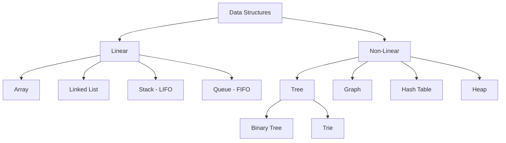

### 2.1 Arrays

Arrays are one of the most basic data structures. They allow you to store elements sequentially and provide immediate access to any element using its index.

- **Advantages:**
- Fast access to elements.
- Simple and straightforward to use.
- **Disadvantages:**
- Fixed size (in many languages).
- Insertion and deletion in the middle require shifting elements.

**Example Problem: Finding the Maximum Element**

```python
def find_max(arr):
    max_val = arr[0]
    for num in arr:
        if num > max_val:
            max_val = num
    return max_val

# Example usage:
print(find_max([3, 1, 4, 1, 5, 9]))  # Expected output: 9
```

### 2.2 Linked Lists

A linked list is a collection of nodes where each node holds a value and a pointer to the next node. This dynamic structure makes insertions and deletions efficient.

- **Advantages:**
- Dynamic size.
- Efficient insertions and deletions.
- **Disadvantages:**
- Sequential access (slower than arrays for random access).
- Extra memory for storing pointers.

**Example Problem: Reversing a Linked List**

```python
class ListNode:
    def __init__(self, value=0, next=None):
        self.value = value
        self.next = next

def reverse_list(head):
    previous = None
    current = head
    while current:
        next_node = current.next
        current.next = previous
        previous = current
        current = next_node
    return previous

# To test, create a linked list and call reverse_list(head)
```

### 2.3 Stacks

Stacks are data structures that follow a Last-In-First-Out (LIFO) order. They are commonly used for function calls, undo operations, and parsing expressions.

- **Advantages:**
- Fast operations for adding and removing the top element.
- **Disadvantages:**
- Limited access (only the top element is available).

**Example Problem: Checking Balanced Parentheses**

```python
def is_balanced(s):
    stack = []
    mapping = {")": "(", "}": "{", "]": "["}
    for char in s:
        if char in mapping.values():
            stack.append(char)
        elif char in mapping:
            if not stack or mapping[char] != stack.pop():
                return False
    return len(stack) == 0

# Example usage:
print(is_balanced("([]){}"))  # Expected output: True
print(is_balanced("([)]"))    # Expected output: False
```

### 2.4 Queues

Queues operate on a First-In-First-Out (FIFO) basis. They are useful in scenarios like task scheduling and buffering.

- **Advantages:**
- Processes elements in the order they arrive.
- **Disadvantages:**
- Access is limited to the front (for removal) and the rear (for addition).

**Example Implementation Using a Deque:**

```python
from collections import deque

queue = deque()
queue.append(1)  # Add to the queue
queue.append(2)
first_item = queue.popleft()  # Remove the first item (expected: 1)
```

### 2.5 Trees and Graphs

Trees and graphs represent hierarchical and networked data, respectively.

- **Trees:**
- Used in hierarchical data representation such as file systems.
- Example: Binary Trees, Binary Search Trees.
- **Graphs:**
- Used to model networks like social connections or city maps.
- Can be directed or undirected.

**Example Problem: Inorder Traversal of a Binary Tree**

```python
class TreeNode:
    def __init__(self, value=0, left=None, right=None):
        self.value = value
        self.left = left
        self.right = right

def inorder_traversal(root):
    result = []
    def traverse(node):
        if node:
            traverse(node.left)
            result.append(node.value)
            traverse(node.right)
    traverse(root)
    return result
```

### 2.6 Hash Tables

Hash tables (or dictionaries) store key-value pairs and allow fast retrieval of data using a key.

- **Advantages:**
- Very efficient lookups, insertions, and deletions.
- **Disadvantages:**
- Can consume extra memory.
- Performance depends on the hash function quality.

**Example Problem: Two Sum**

```python
def two_sum(nums, target):
    lookup = {}
    for i, num in enumerate(nums):
        complement = target - num
        if complement in lookup:
            return [lookup[complement], i]
        lookup[num] = i
    return []

# Example usage:
print(two_sum([2, 7, 11, 15], 9))  # Expected output: [0, 1]
```

### 2.7 Heaps

Heaps are specialized tree-based structures that allow quick access to the smallest or largest element, making them ideal for priority queues.

- **Advantages:**
- Efficient insertion and deletion.
- **Disadvantages:**
- Not designed for quick random access.

**Example Using Python's heapq:**

```python
import heapq

heap = []
heapq.heappush(heap, 3)
heapq.heappush(heap, 1)
heapq.heappush(heap, 2)
smallest = heapq.heappop(heap)  # Expected output: 1
```

### 2.8 Tries

Tries are specialized trees used to store strings, which makes them very effective for autocomplete and spell-check applications.

- **Advantages:**
- Fast retrieval of strings based on prefixes.
- **Disadvantages:**
- Can use a large amount of memory for sparse datasets.

---

## 3. Algorithmic Techniques

### 3.1 Brute Force

Brute force methods solve problems by checking all possible solutions. While simple, they are often inefficient for large inputs.

**Example:**
Finding the maximum sum of any contiguous subarray by checking every possible subarray.

### 3.2 Recursion

Recursion solves problems by having functions call themselves with a simpler or smaller version of the original problem.

**Example Problem: Computing Factorial**

```python
def factorial(n):
    if n == 0:
        return 1
    return n * factorial(n - 1)

# Example usage:
print(factorial(5))  # Expected output: 120
```

### 3.3 Divide and Conquer

This technique breaks problems into smaller subproblems, solves each one independently, and then combines the solutions. It is the basis for efficient sorting algorithms.

**Example: Merge Sort**

```python
def merge_sort(arr):
    if len(arr) <= 1:
        return arr
    mid = len(arr) // 2
    left = merge_sort(arr[:mid])
    right = merge_sort(arr[mid:])
    return merge(left, right)

def merge(left, right):
    result = []
    i = j = 0
    while i < len(left) and j < len(right):
        if left[i] < right[j]:
            result.append(left[i])
            i += 1
        else:
            result.append(right[j])
            j += 1
    result.extend(left[i:])
    result.extend(right[j:])
    return result

# Example usage:
print(merge_sort([3, 1, 4, 1, 5, 9]))  # Expected sorted output: [1, 1, 3, 4, 5, 9]
```

### 3.4 Greedy Algorithms

Greedy algorithms make the optimal choice at each step, aiming for a global optimum. They are simple and efficient for many problems, though they do not always yield the best solution for every case.

**Example: Coin Change Problem (Simplified Version)**
Select the largest coin possible at each step to reach the target amount. (Note: This approach works for certain coin systems.)

### 3.5 Backtracking

Backtracking systematically searches for a solution by exploring potential candidates and discarding those that do not meet the problem’s constraints.

**Example Problem: N-Queens Problem**
Place queens on a chessboard such that no two queens threaten each other. The solution involves placing a queen, checking for conflicts, and removing it if a dead end is reached.

### 3.6 Dynamic Programming

Dynamic programming (DP) is used for problems with overlapping subproblems and optimal substructure. It saves the results of smaller subproblems to avoid redundant work.

#### Key Concepts in DP:

- **Memoization:** A top-down approach using recursion with caching.
- **Tabulation:** A bottom-up approach that builds a table iteratively.

**Example Problem: Fibonacci Sequence Using DP**

```python
def fibonacci(n):
    if n <= 1:
        return n
    dp = [0] * (n + 1)
    dp[0] = 0
    dp[1] = 1
    for i in range(2, n + 1):
        dp[i] = dp[i - 1] + dp[i - 2]
    return dp[n]

# Example usage:
print(fibonacci(10))  # Expected output: 55
```

**Example Problem: Longest Common Subsequence**

```python
def longest_common_subsequence(text1, text2):
    m, n = len(text1), len(text2)
    dp = [[0] * (n + 1) for _ in range(m + 1)]
    for i in range(1, m + 1):
        for j in range(1, n + 1):
            if text1[i - 1] == text2[j - 1]:
                dp[i][j] = dp[i - 1][j - 1] + 1
            else:
                dp[i][j] = max(dp[i - 1][j], dp[i][j - 1])
    return dp[m][n]

# Example usage:
print(longest_common_subsequence("abcde", "ace"))  # Expected output: 3
```

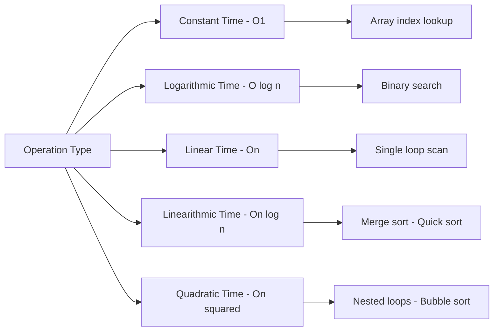

---

## 4. Performance Analysis Without Mathematical Notation

Understanding the efficiency of your solution is important. Instead of using formal mathematical symbols, we describe performance in plain language:

- **Constant Time:** Operations that take the same amount of time regardless of input size.
- **Linear Time:** Operations that increase in duration directly in proportion to the number of items.
- **Quadratic Time:** Operations where the time increases rapidly as the input size grows due to nested iterations.
- **Logarithmic Time:** Efficient operations where the processing time increases slowly as the input size increases.
- **Linearithmic Time:** A mix of linear and logarithmic behavior often found in efficient sorting techniques.

When designing your solutions, strive for approaches that are as efficient as possible, keeping in mind the trade-offs between speed and memory usage.

**Example: Binary Search in Plain Language**

```python
def binary_search(arr, target):
    low, high = 0, len(arr) - 1
    while low <= high:
        mid = (low + high) // 2
        if arr[mid] == target:
            return mid
        elif arr[mid] < target:
            low = mid + 1
        else:
            high = mid - 1
    return -1

# Example usage:
print(binary_search([1, 2, 3, 4, 5], 3))  # Expected output: 2
```

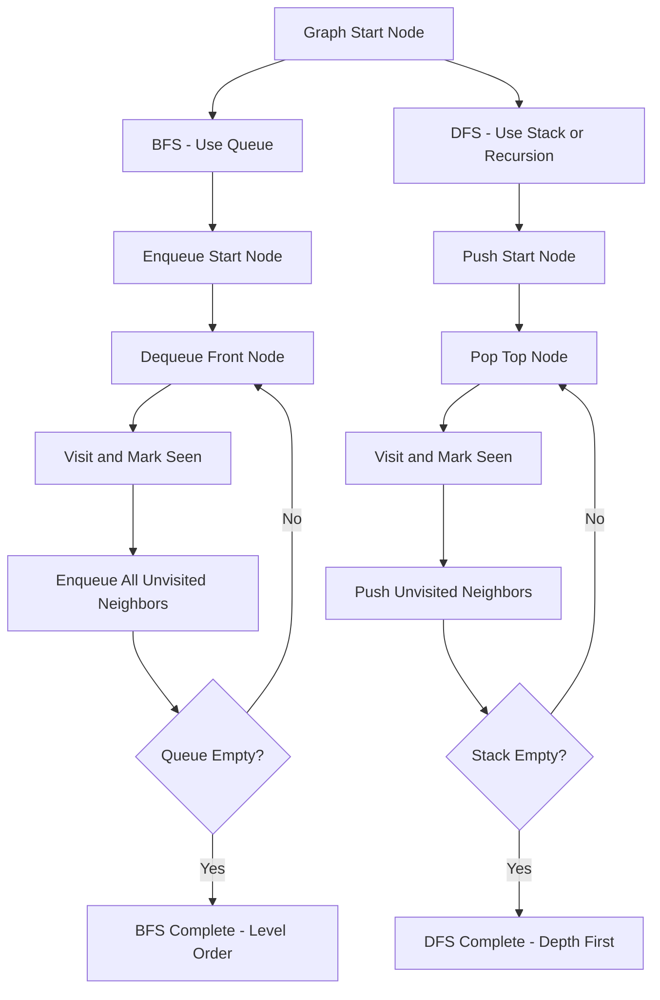

---

## 5. Additional Example Problems and Detailed Solutions

### 5.1 Two Sum

**Problem:** Given an array of integers and a target value, determine the indices of the two numbers that add up to the target.

**Solution:**

```python
def two_sum(nums, target):
    lookup = {}
    for index, num in enumerate(nums):
        complement = target - num
        if complement in lookup:
            return [lookup[complement], index]
        lookup[num] = index
    return []

# Example usage:
print(two_sum([2, 7, 11, 15], 9))  # Expected output: [0, 1]
```

### 5.2 Valid Parentheses

**Problem:** Check whether a string containing various types of brackets is valid. A valid string has every opening bracket properly closed in the correct order.

**Solution:**

```python
def is_valid_parentheses(s):
    stack = []
    pairs = {")": "(", "]": "[", "}": "{"}
    for char in s:
        if char in pairs.values():
            stack.append(char)
        elif char in pairs:
            if not stack or pairs[char] != stack.pop():
                return False
    return len(stack) == 0

# Example usage:
print(is_valid_parentheses("()[]{}"))  # Expected output: True
print(is_valid_parentheses("([)]"))    # Expected output: False
```

### 5.3 Maximum Subarray (Kadane's Method)

**Problem:** Find the contiguous subarray within a one-dimensional array of numbers which has the largest sum.

**Solution:**

```python
def maximum_subarray(nums):
    current_max = global_max = nums[0]
    for num in nums[1:]:
        current_max = max(num, current_max + num)
        if current_max > global_max:
            global_max = current_max
    return global_max

# Example usage:
print(maximum_subarray([-2, 1, -3, 4, -1, 2, 1, -5, 4]))  # Expected output: 6
```

---

## 6. Interview Preparation Tips

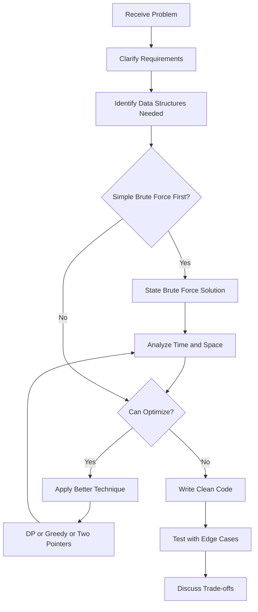

- **Practice Regularly:**
  Use platforms like LeetCode, HackerRank, CodeSignal, and Codewars to expose yourself to a wide variety of problems.

- **Understand the Concepts:**
  Focus on understanding how and why algorithms work instead of just memorizing solutions. Write your own code and explain your reasoning.

- **Conduct Mock Interviews:**
  Simulate real interview environments by practicing with peers or using interview coaching platforms.

- **Manage Your Time:**
  Practice solving problems within a set timeframe and learn to communicate your thought process clearly.

- **Review Fundamentals:**
  Regularly revisit core data structures and algorithmic techniques to strengthen your foundation.

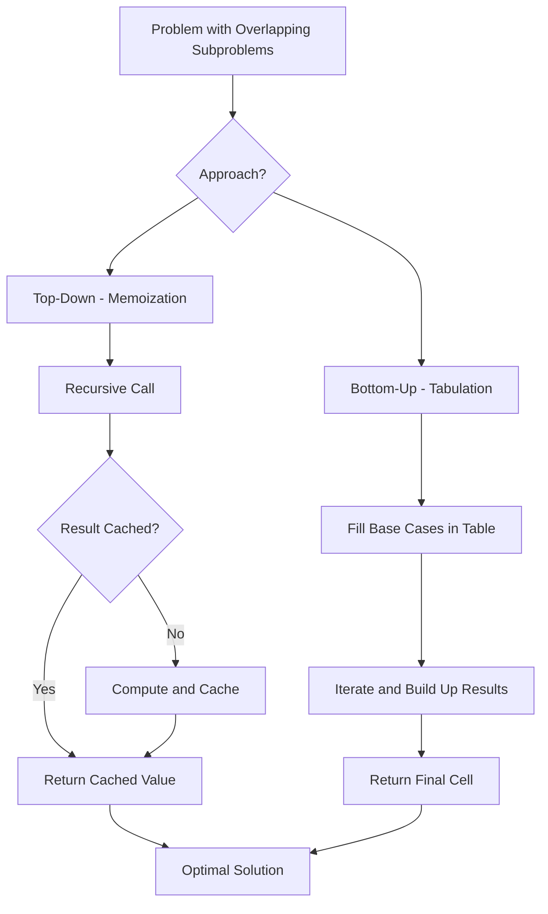

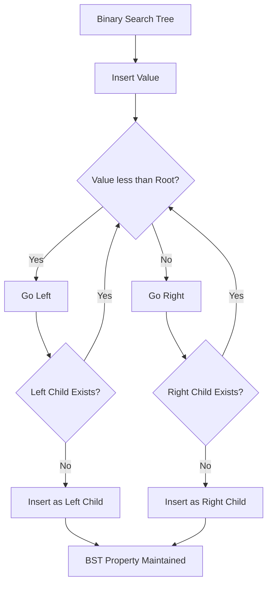

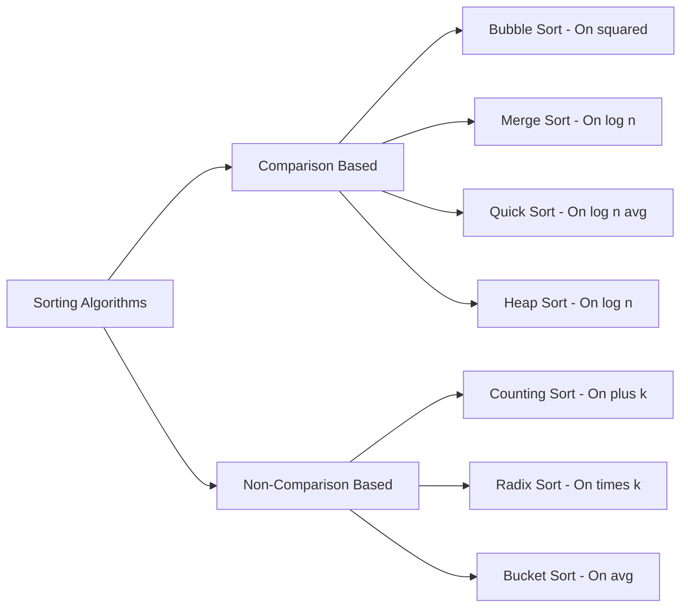

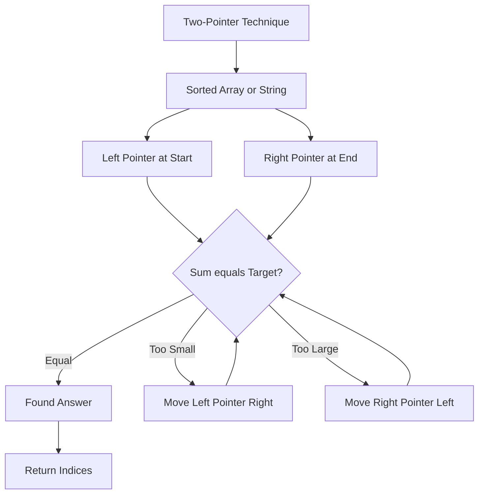

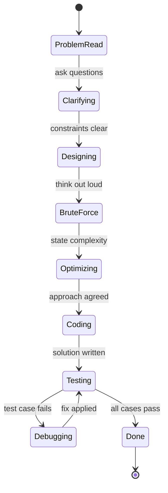

---

## 7. System Design Interview Patterns

System design interviews assess your ability to architect scalable, reliable, and maintainable distributed systems. Unlike algorithmic problems, they are intentionally open-ended and require you to drive the conversation.

### 7.1 The RESHADED Framework

A repeatable structure for system design answers:

- **R**equirements - functional and non-functional
- **E**stimation - scale, QPS, storage, bandwidth
- **S**torage schema - data model and database choice
- **H**igh-level design - components and data flow
- **A**PI design - key endpoints and contracts
- **D**etailed design - dive deep into two or three components
- **E**dge cases - failure modes, hot partitions, cascading failures
- **D**iscussion - tradeoffs and alternatives

### 7.2 Designing a URL Shortener

Classic warm-up problem. Walk through it as a reference scaffold.

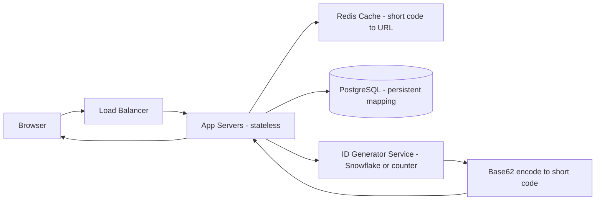

**Estimation for 100M URLs, 10B reads/day:**

- Read QPS: 10B / 86400 ≈ 115,000 reads/second
- Write QPS: 100M total, at creation time, roughly 1,200 writes/second at peak
- Storage: each row ≈ 500 bytes; 100M rows ≈ 50 GB
- Cache: store top 20% of URLs (Pareto), ≈ 10 GB RAM

**Key decisions:**

- Use base62 encoding of a 7-character code (62^7 = 3.5 trillion unique URLs).
- Read-through cache with TTL; write-through on creation.
- Database sharding by short code if write volume exceeds single-node limits.

### 7.3 Designing a Notification System

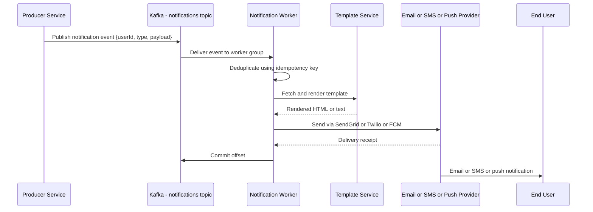

**Non-functional requirements to address:**

- At-least-once delivery (acceptable for notifications; idempotency key prevents duplicate sends).
- Rate limiting per user to prevent spam (e.g., max 10 emails/hour per user).
- Priority queues: transactional notifications go before marketing.

### 7.4 Common System Design Topics and Their Key Components

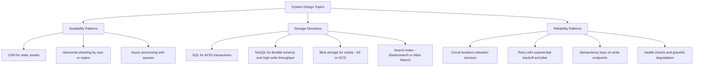

---

## 8. Behavioral Interview Framework

Technical skills alone do not win offers. Behavioral interviews assess how you collaborate, handle adversity, and align with company values. The STAR method is the standard structure.

### 8.1 STAR Method

- **S**ituation: Set the context briefly. What was the environment and the stakes?
- **T**ask: What was your specific responsibility or goal?
- **A**ction: What did you do? Use "I" statements, not "we."
- **R**esult: What was the measurable outcome? Quantify whenever possible.

### 8.2 Preparing a Story Bank

Prepare at least two stories per competency area before interviews:

| Competency           | Example Prompt                                                      |
| -------------------- | ------------------------------------------------------------------- |
| Leadership           | Tell me about a time you led a project without formal authority.    |
| Conflict resolution  | Describe a disagreement with a teammate and how you resolved it.    |
| Failure and learning | Tell me about a significant mistake and what you did afterward.     |
| Ambiguity            | Give an example of working effectively with incomplete information. |
| Technical judgment   | Describe a difficult technical decision you made and the tradeoff.  |
| Ownership            | Tell me about going above and beyond the requirements of a task.    |
| Collaboration        | Describe a time you helped a teammate who was struggling.           |

### 8.3 Common Follow-Up Questions

Interviewers probe depth after the initial STAR answer. Prepare for:

- "What would you do differently if you faced that situation again?"
- "What did you learn about yourself from that experience?"
- "How did other stakeholders perceive the outcome?"
- "How did you prioritize when you had conflicting deadlines?"
- "What data or signals did you use to make that decision?"

The following diagram shows how interviewers probe depth after a STAR answer, and what each follow-up question type signals to the hiring panel:

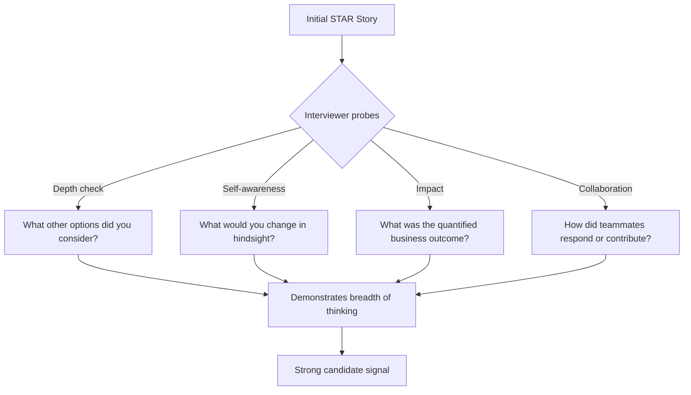

---

## 9. Mock Interview Structure and Time Management

### 9.1 Coding Interview Timing Guide (45-minute session)

| Phase                     | Time      | Goal                                          |
| ------------------------- | --------- | --------------------------------------------- |
| Clarify the problem       | 3-5 min   | Confirm input/output, constraints, edge cases |
| Brute force walkthrough   | 3-5 min   | Verbalize the naive approach and complexity   |
| Optimize                  | 5-8 min   | Discuss better approach before writing code   |
| Implement                 | 15-20 min | Write clean, working code                     |
| Test and trace            | 5 min     | Walk through examples, then edge cases        |
| Questions for interviewer | 2 min     | Show genuine curiosity                        |

### 9.2 Self-Assessment Rubric

Use this rubric after each practice session:

```python
def evaluate_session(session_notes: dict) -> str:
    """
    score each dimension 1 (needs work) to 4 (excellent)
    dimensions: problem_decomposition, code_quality, complexity_analysis,
                communication, edge_case_handling, time_management
    """
    scores = session_notes.get("scores", {})
    dimensions = [
        "problem_decomposition",
        "code_quality",
        "complexity_analysis",
        "communication",
        "edge_case_handling",
        "time_management",
    ]

    total = sum(scores.get(d, 1) for d in dimensions)
    avg = total / len(dimensions)

    if avg >= 3.5:
        verdict = "Strong hire signal"
    elif avg >= 2.5:
        verdict = "Hire with reservations"
    elif avg >= 1.5:
        verdict = "No hire - specific gaps identified"
    else:
        verdict = "Strong no hire - fundamentals need review"

    gaps = [d for d in dimensions if scores.get(d, 1) < 2]
    return f"Score: {avg:.1f}/4 | Verdict: {verdict} | Focus areas: {', '.join(gaps) or 'None'}"

# Example usage after a mock session:
result = evaluate_session({
    "scores": {
        "problem_decomposition": 4,
        "code_quality": 3,
        "complexity_analysis": 3,
        "communication": 4,
        "edge_case_handling": 2,
        "time_management": 3,
    }
})
print(result)
# Score: 3.2/4 | Verdict: Hire with reservations | Focus areas: edge_case_handling
```

### 9.3 Practice Interview Flow

The following state diagram shows the recommended flow through a full mock interview session, from problem reading to discussing tradeoffs:

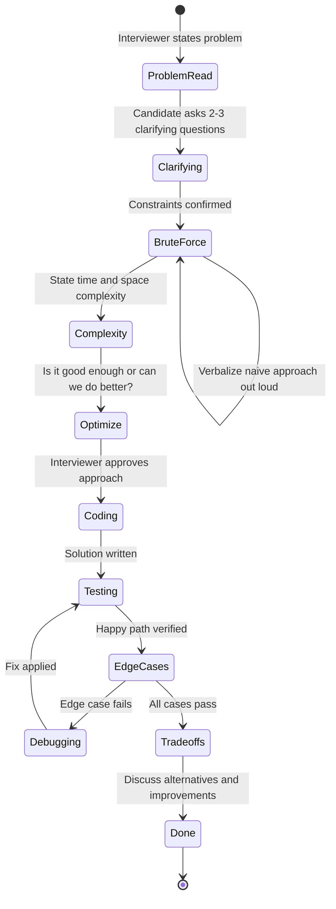

---

## 10. Advanced Algorithm Patterns Quick Reference

### 10.1 Sliding Window

```python
def max_sum_subarray_k(nums: list[int], k: int) -> int:
    """Find maximum sum of any subarray of length k in O(n) time."""
    window_sum = sum(nums[:k])
    max_sum = window_sum

    for i in range(k, len(nums)):
        window_sum += nums[i] - nums[i - k]  # Add new element, remove oldest
        max_sum = max(max_sum, window_sum)

    return max_sum

def longest_substring_no_repeat(s: str) -> int:
    """Longest substring without repeating characters using variable window."""
    char_index = {}
    left = 0
    max_len = 0

    for right, char in enumerate(s):
        if char in char_index and char_index[char] >= left:
            left = char_index[char] + 1  # Shrink window past the duplicate
        char_index[char] = right
        max_len = max(max_len, right - left + 1)

    return max_len
```

### 10.2 Union-Find for Graph Connectivity

```python
class UnionFind:
    def __init__(self, n: int):
        self.parent = list(range(n))
        self.rank = [0] * n
        self.components = n

    def find(self, x: int) -> int:
        if self.parent[x] != x:
            self.parent[x] = self.find(self.parent[x])  # Path compression
        return self.parent[x]

    def union(self, x: int, y: int) -> bool:
        px, py = self.find(x), self.find(y)
        if px == py:
            return False  # Already in the same component
        # Union by rank
        if self.rank[px] < self.rank[py]:
            px, py = py, px
        self.parent[py] = px
        if self.rank[px] == self.rank[py]:
            self.rank[px] += 1
        self.components -= 1
        return True

def count_islands(grid: list[list[str]]) -> int:
    """Number of islands using Union-Find instead of DFS."""
    rows, cols = len(grid), len(grid[0])
    uf = UnionFind(rows * cols)

    for r in range(rows):
        for c in range(cols):
            if grid[r][c] == "1":
                for dr, dc in [(0, 1), (1, 0)]:
                    nr, nc = r + dr, c + dc
                    if 0 <= nr < rows and 0 <= nc < cols and grid[nr][nc] == "1":
                        uf.union(r * cols + c, nr * cols + nc)

    return sum(1 for r in range(rows) for c in range(cols)
               if grid[r][c] == "1" and uf.find(r * cols + c) == r * cols + c)
```

---

## 11. Conclusion

Technical interviews can be challenging, but with thorough preparation and a deep understanding of data structures and algorithms, you can confidently tackle even the most complex problems. This guide has provided a detailed exploration of a wide range of topics - from basic arrays and linked lists to dynamic programming and backtracking - accompanied by practical example problems and step-by-step solutions.

Remember, preparation is key. Practice consistently, understand the underlying principles, and communicate your solutions clearly. With persistence and dedication, you will develop the skills necessary to excel in your technical interviews.

---

_This comprehensive guide is designed to serve as a one-stop resource for mastering technical interview concepts. From essential data structures and algorithmic techniques to detailed problem solutions and interview tips, we hope this guide empowers you to achieve success in your technical interviews. Happy coding and best of luck on your journey to mastering technical challenges!_
