import MdxLayout from "@/components/MdxLayout";

export const metadata = {
  title: "Vision Transformers for Image Classification",
  description:
    "A detailed guide on fine-tuning Vision Transformers (ViTs) for image classification tasks. This article delves into the underlying architecture, hyperparameter optimization, evaluation, and more.",
  topics: [
    "Artificial Intelligence",
    "Machine Learning",
    "Computer Vision",
    "Vision Transformers",
    "Deep Learning",
    "Image Classification",
  ],
};

export default function VisionTransformersArticle({ children }) {
  return <MdxLayout>{children}</MdxLayout>;
}

# Vision Transformers for Image Classification: A Detailed Analysis

### Author: Son Nguyen

> Date: 2025-04-08

The field of computer vision is experiencing a paradigm shift with the integration of transformer-based architectures originally devised for natural language processing. Vision Transformers (ViTs) have emerged as a formidable alternative to traditional convolutional neural networks (CNNs) for image classification. By harnessing self-attention mechanisms, ViTs capture long-range dependencies across image patches, enabling superior performance on complex visual tasks. This article presents an exhaustive exploration of fine-tuning Vision Transformers for image classification. We delve into every aspect - from architectural fundamentals and data preprocessing to hyperparameter optimization and advanced training techniques - providing a detailed roadmap for researchers and practitioners.

---

## 1. Introduction

### 1.1. The Evolution of Vision Transformers in Computer Vision

In recent years, the breakthrough of transformer models in NLP has spurred innovative adaptations to computer vision. Vision Transformers represent a significant departure from conventional CNN-based methods by:

- **Dividing Images into Patches:** Transforming 2D images into a sequence of flattened patches.
- **Global Contextualization:** Employing self-attention to capture global relationships between patches.
- **Scalability:** Achieving impressive performance on large-scale datasets such as ImageNet.

This architectural paradigm shift has unlocked new opportunities for developing more flexible, robust, and scalable visual recognition systems.

### 1.2. Motivation for Fine-Tuning Pre-Trained ViTs

Fine-tuning pre-trained models on large datasets (e.g., ImageNet) offers several key benefits:

- **Transfer Learning:** Leveraging rich, pre-learned representations reduces the need for vast amounts of task-specific labeled data.
- **Faster Convergence:** Fine-tuning accelerates the training process compared to training from scratch.
- **Enhanced Performance:** Tailoring a pre-trained ViT to a particular domain or dataset can significantly boost classification accuracy.

---

## 2. Theoretical Background and Architectural Insights

### 2.1. Fundamentals of Vision Transformer Architecture

Vision Transformers modify the standard transformer architecture to handle image data:

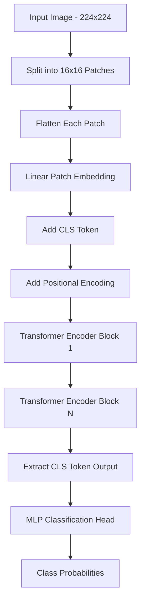

- **Patch Embedding:** An image is divided into fixed-size patches (e.g., 16×16 pixels). Each patch is flattened and projected into a high-dimensional embedding space.
- **Positional Encoding:** Since transformer models are permutation invariant, positional encodings are added to embed spatial information into the patch representations.
- **Transformer Encoder Layers:** Multiple layers of self-attention and feed-forward networks process the sequence of patch embeddings. Each layer refines the contextual relationships between patches.
- **Classification Token ([CLS]):** A special token is prepended to the sequence whose final hidden state is used for classification.

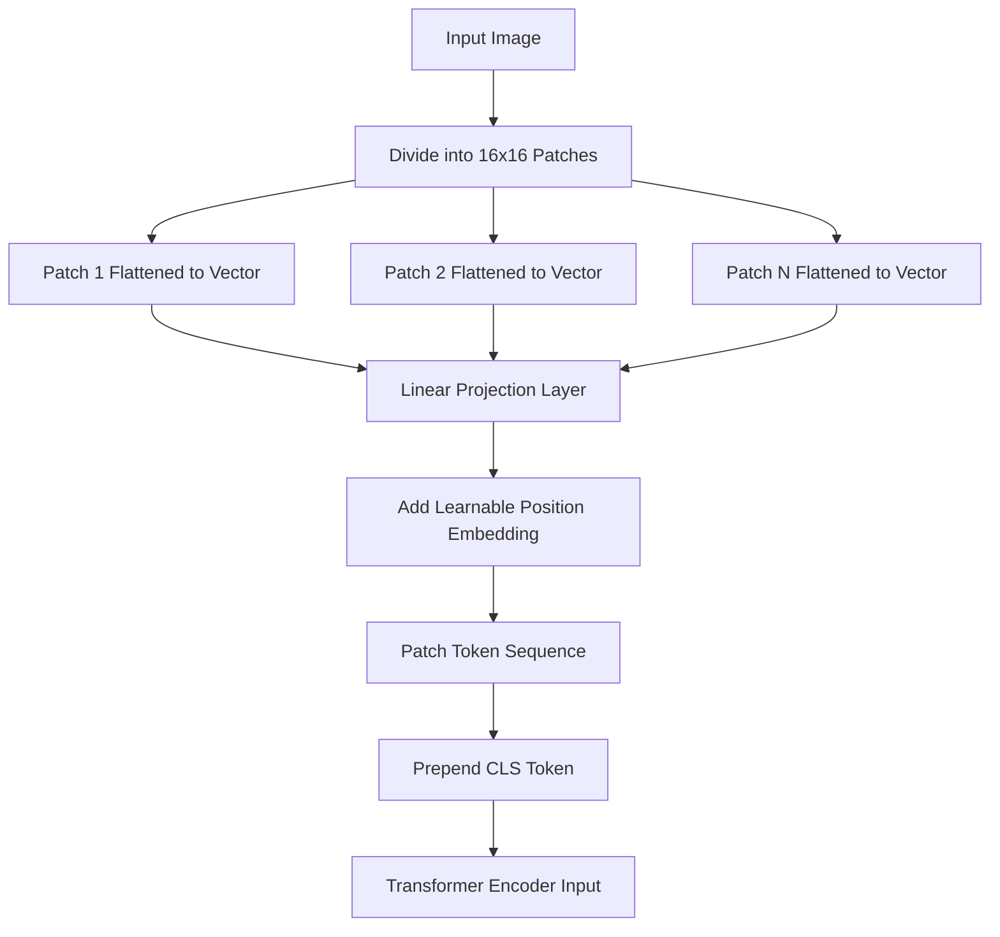

### 2.2. Pre-Training Regimen and Transferability

ViTs are typically pre-trained on massive datasets using unsupervised or self-supervised learning techniques. The pre-training stage includes:

- **Large-Scale Datasets:** Models such as the ViT-Base and ViT-Large are pre-trained on datasets containing millions of images.
- **Self-Supervised Objectives:** Techniques like masked patch prediction and contrastive learning help the model learn robust feature representations.
- **Transfer Learning Benefits:** The learned representations are highly transferable, allowing for effective fine-tuning on domain-specific or smaller datasets.

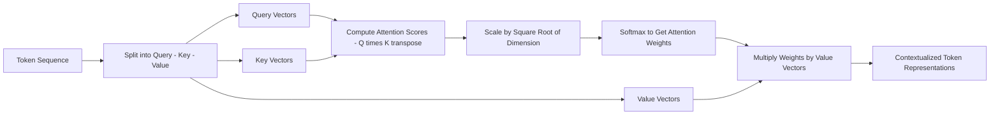

### 2.3. Comparison with Convolutional Neural Networks

While CNNs extract local features using convolutional kernels, ViTs have the advantage of global receptive fields from the outset. This difference leads to:

- **Enhanced Global Context:** ViTs capture long-range dependencies without the need for deep hierarchies.
- **Flexibility in Handling Varying Image Sizes:** With proper design adjustments, ViTs can be adapted for different input resolutions.
- **Trade-Offs:** Despite their advantages, ViTs typically require larger datasets and more computational resources during pre-training.

---

## 3. Detailed Data Preparation and Augmentation Strategies

### 3.1. Curating and Selecting Datasets

Successful image classification relies on high-quality and representative datasets. Consider:

- **Standard Datasets:** ImageNet, CIFAR-10, and CIFAR-100 are benchmarks for general object recognition.
- **Domain-Specific Collections:** For specialized applications (e.g., medical imaging, satellite imagery), curated datasets capture unique visual characteristics.
- **Data Diversity:** Ensure that the dataset contains sufficient variability in lighting, orientation, and background context to foster robust model performance.

### 3.2. Data Preprocessing Techniques

Data preprocessing is crucial for adapting raw images into a form suitable for ViTs:

- **Normalization:** Scale pixel values (typically to a [0, 1] range) and apply mean-variance normalization based on dataset-specific statistics.
- **Resizing:** Resize images to match the ViT model's expected input dimensions (commonly 224×224 or 384×384 pixels).
- **Data Augmentation:** Enhance model robustness by applying:
  - **Random Cropping and Resizing:** Simulate different scales and compositions.
  - **Horizontal and Vertical Flipping:** Introduce invariance to orientation.
  - **Color Jittering and Contrast Adjustments:** Account for variable lighting conditions.
  - **CutOut and MixUp:** Regularize the model by occluding or blending images.

#### Example: Preprocessing Pipeline in PyTorch

```python
from torchvision import transforms

transform = transforms.Compose([
    transforms.Resize((224, 224)),
    transforms.RandomHorizontalFlip(p=0.5),
    transforms.RandomVerticalFlip(p=0.2),
    transforms.ColorJitter(brightness=0.2, contrast=0.2, saturation=0.2, hue=0.1),
    transforms.ToTensor(),
    transforms.Normalize(mean=[0.485, 0.456, 0.406],
                         std=[0.229, 0.224, 0.225]),
])
```

### 3.3. Handling Imbalanced Data

Techniques to address dataset imbalance include:

- **Oversampling Minority Classes:** Duplicate samples from underrepresented classes.
- **Class-Aware Sampling:** Adjust the probability of sampling each class during training.
- **Synthetic Data Generation:** Use methods such as Generative Adversarial Networks (GANs) to generate new training images.

---

## 4. Advanced Training Strategies and Hyperparameter Optimization

### 4.1. Fine-Tuning Setup

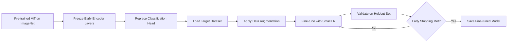

Fine-tuning a ViT involves a careful reconfiguration of the model:

- **Initialization:** Load a pre-trained ViT model (e.g., "google/vit-base-patch16-224-in21k").
- **Modifying the Classification Head:** Adapt the final linear layer to match the number of classes in your target dataset.
- **Layer-Wise Fine-Tuning:** Optionally freeze early layers to preserve low-level feature extraction while focusing on task-specific adaptation in later layers.

### 4.2. Hyperparameter Tuning

Key hyperparameters that impact performance include:

- **Learning Rate:** Fine-tuning typically requires a smaller learning rate (e.g., 1e-5 to 3e-5). Consider using learning rate warm-up strategies to stabilize initial training.
- **Batch Size:** Choose a batch size that balances training stability and computational efficiency. Often, batch sizes between 16 and 64 are optimal depending on GPU memory.
- **Epochs:** Fine-tuning may require 5–20 epochs. Early stopping based on validation performance can prevent overfitting.
- **Weight Decay and Regularization:** Implement weight decay (around 0.01) and dropout in the fully connected layers to reduce overfitting.

### 4.3. Advanced Training Techniques

Beyond standard fine-tuning, consider these advanced strategies:

- **Layer-Wise Learning Rate Decay:** Apply different learning rates to different layers, typically with higher learning rates for the later layers.
- **Mixed Precision Training:** Use FP16 precision to reduce memory usage and speed up training without compromising model accuracy.
- **Gradient Accumulation:** Simulate larger batch sizes when hardware constraints limit the batch size.

---

## 5. Practical Implementation: End-to-End Fine-Tuning Workflow

This section illustrates the practical steps for fine-tuning a Vision Transformer using PyTorch and Hugging Face Transformers.

### 5.1. Environment Setup

Install the necessary packages:

```bash
pip install transformers datasets torch torchvision
```

### 5.2. Loading Pre-Trained Model and Dataset

Below is a complete example that loads the CIFAR-10 dataset, applies preprocessing, and prepares the data for model training.

```python
from transformers import ViTForImageClassification, ViTFeatureExtractor
from datasets import load_dataset
import torch
from torch.utils.data import DataLoader

# Load the CIFAR-10 dataset
dataset = load_dataset("cifar10")

# Initialize the feature extractor for ViT
feature_extractor = ViTFeatureExtractor.from_pretrained("google/vit-base-patch16-224-in21k")

def transform(example):
    # Convert the PIL image to the required input format using the feature extractor
    example["pixel_values"] = feature_extractor(example["img"], return_tensors="pt")["pixel_values"][0]
    return example

# Apply transformation to the dataset
dataset = dataset.with_transform(transform)

# Create DataLoaders for the training and test sets
train_loader = DataLoader(dataset["train"], batch_size=32, shuffle=True)
val_loader = DataLoader(dataset["test"], batch_size=32)
```

### 5.3. Fine-Tuning the Model

The following script demonstrates how to set up and run the fine-tuning process.

```python
import torch.nn as nn
from transformers import TrainingArguments, Trainer
import numpy as np
from sklearn.metrics import accuracy_score

# Load the pre-trained Vision Transformer model with a modified classification head
model = ViTForImageClassification.from_pretrained(
    "google/vit-base-patch16-224-in21k",
    num_labels=10  # CIFAR-10 has 10 classes
)

# Define training arguments for the Trainer
training_args = TrainingArguments(
    output_dir="./vit_results",
    per_device_train_batch_size=32,
    evaluation_strategy="steps",
    eval_steps=100,
    save_steps=100,
    num_train_epochs=10,
    learning_rate=2e-5,
    weight_decay=0.01,
    logging_dir="./vit_logs",
    logging_steps=50,
    load_best_model_at_end=True,
)

# Define a metrics computation function
def compute_metrics(eval_pred):
    predictions, labels = eval_pred
    predictions = np.argmax(predictions, axis=1)
    return {"accuracy": accuracy_score(labels, predictions)}

# Initialize the Trainer for the fine-tuning process
trainer = Trainer(
    model=model,
    args=training_args,
    train_dataset=dataset["train"],
    eval_dataset=dataset["test"],
    compute_metrics=compute_metrics,
)

# Start the training process
trainer.train()

# Evaluate the model on the validation set
eval_results = trainer.evaluate()
print(f"Evaluation results: {eval_results}")
```

### 5.4. Saving and Exporting the Model

After fine-tuning, the trained model and feature extractor can be saved for deployment:

```python
model.save_pretrained("./fine_tuned_vit")
feature_extractor.save_pretrained("./fine_tuned_vit")
```

---

## 6. In-Depth Evaluation, Error Analysis, and Interpretability

### 6.1. Evaluation Metrics

A comprehensive evaluation of a fine-tuned ViT should include:

- **Accuracy:** Overall correctness of the model predictions.
- **Precision, Recall, and F1 Score:** Provide insight into class-wise performance, particularly when classes are imbalanced.
- **Confusion Matrix:** Visual tool to identify common misclassifications and understand class-specific performance.

### 6.2. Error Analysis Techniques

Performing a granular error analysis can guide further refinements:

- **Visual Inspection:** Examine misclassified images to detect recurring patterns (e.g., similar backgrounds, ambiguous objects).
- **Statistical Analysis:** Use metrics and visualizations to quantify class imbalances or biases.
- **Iterative Refinement:** Adjust data augmentation strategies or re-balance classes based on error trends.

### 6.3. Model Interpretability

Boosting confidence in model predictions through interpretability is crucial:

- **Attention Map Visualization:** Examine the attention weights in transformer layers to understand which patches contribute most to the final prediction.
- **Explainable AI Techniques:** Tools such as Grad-CAM and SHAP can provide insights into model decision processes.
- **User-Friendly Reports:** Generate automated reports that highlight strengths and weaknesses of the model for stakeholders.

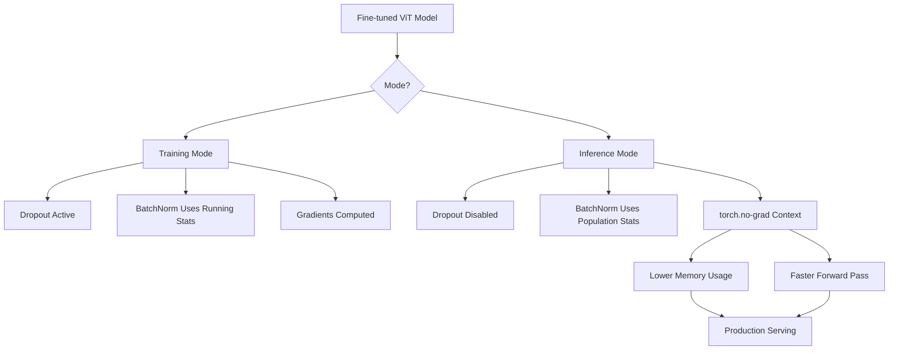

---

## 7. Deployment and Production Considerations

### 7.1. Model Optimization for Inference

Before deploying, consider techniques to optimize the model:

- **Model Pruning and Quantization:** Reduce model size and inference time while maintaining accuracy.
- **Batch Inference:** Optimize processing by grouping multiple images together during prediction.
- **Edge Deployment:** Adapt and compress the model for use on mobile or embedded devices if required.

### 7.2. Monitoring and Maintenance

Continuous monitoring ensures that the deployed model remains robust:

- **Performance Metrics:** Set up dashboards to monitor accuracy, latency, and throughput.
- **Feedback Loops:** Implement systems to gather feedback on model performance in the field and trigger re-training as needed.
- **A/B Testing:** Gradually roll out model updates and compare performance to validate improvements.

### 7.3. Scalability and Integration

Integrate your fine-tuned ViT into existing pipelines:

- **API Deployment:** Serve the model via RESTful APIs using frameworks such as FastAPI or Flask.
- **Cloud Services:** Leverage cloud infrastructures (AWS, GCP, Azure) for scalable and reliable inference.
- **Containerization:** Use Docker and orchestration tools like Kubernetes for deployment across distributed systems.

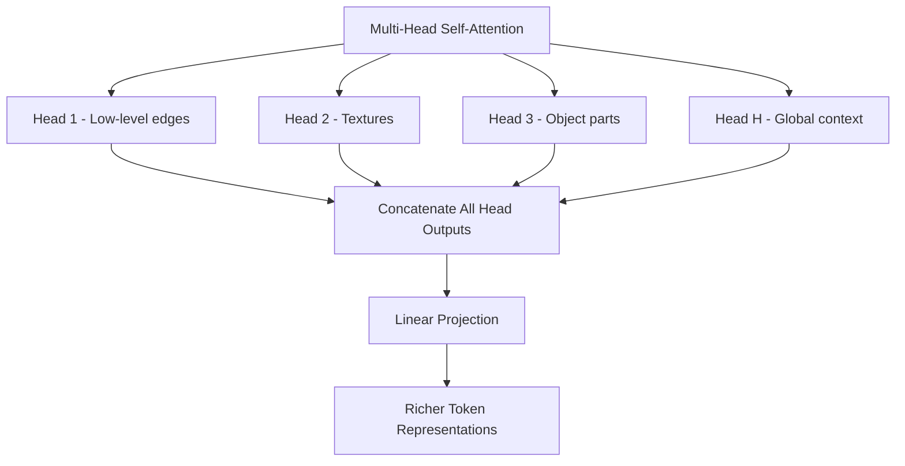

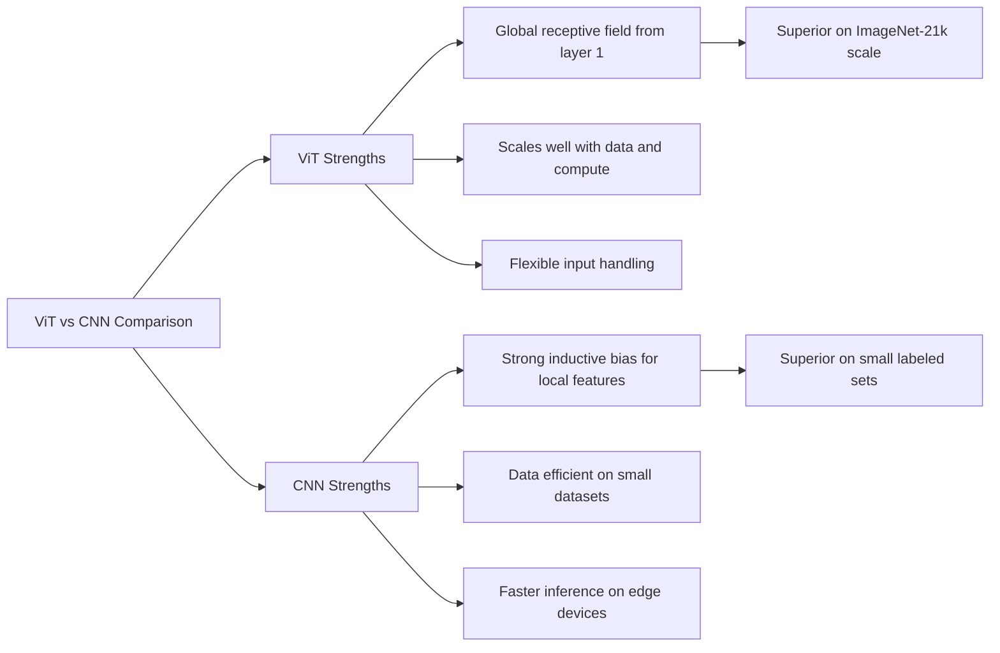

```mermaid
sequenceDiagram
    participant DS as Dataset
    participant FE as Feature Extractor
    participant Model as ViT Model
    participant Loss as Loss Function
    participant Opt as Optimizer
    DS->>FE: Raw image batch
    FE->>Model: Normalized pixel values
    Model->>Loss: Class logits
    Loss->>Opt: Compute cross-entropy loss
    Opt->>Model: Gradient update via backprop
    Model->>DS: Request next batch
```

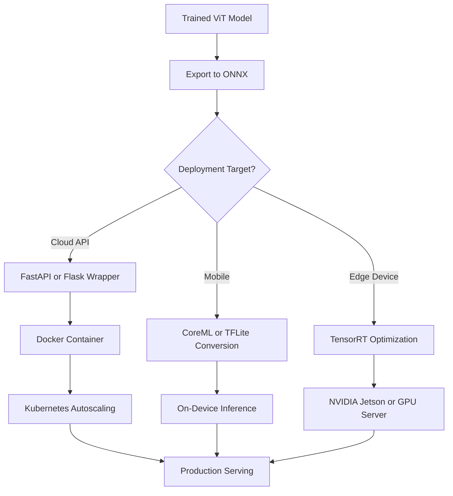

The original ViT required 300 million images (JFT-300M) for pre-training, which limits its applicability. Three follow-up architectures made transformers more practical for teams without Google-scale data.

### 7.4. DeiT: Data-Efficient Image Transformers

Facebook AI Research's DeiT (2020) showed that ViT-scale performance is achievable using only ImageNet-1k (1.28M images) by introducing a **distillation token** alongside the standard CLS token.

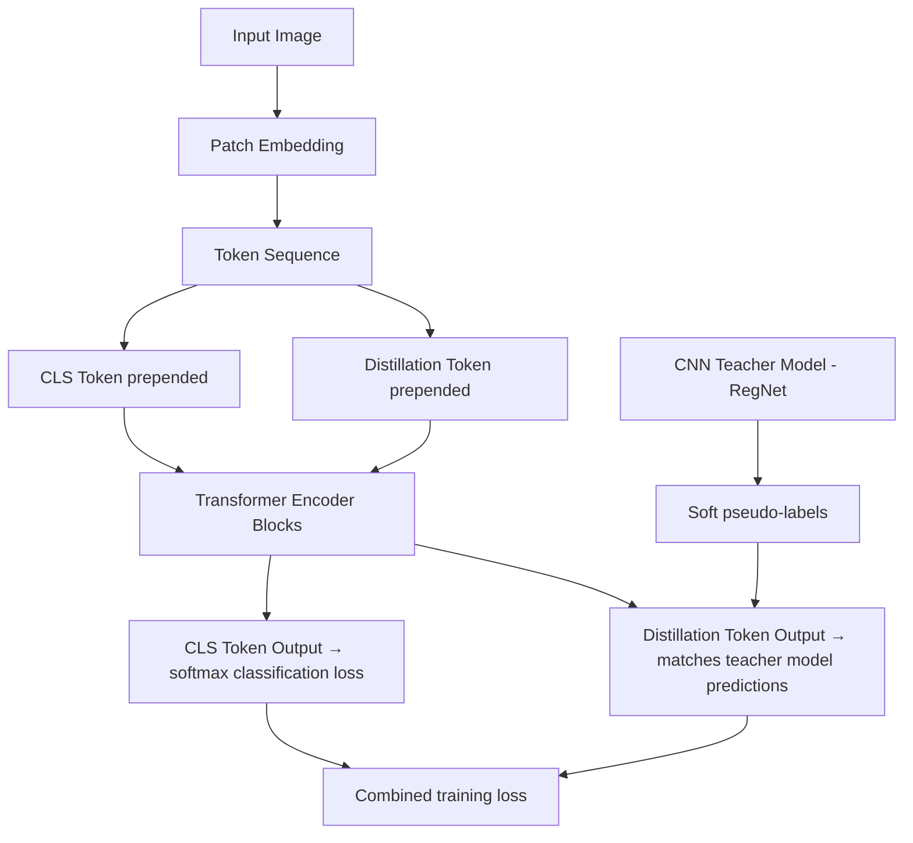

The distillation token learns to mimic a strong CNN teacher (e.g., RegNet-Y-16GF), injecting inductive bias about local features without changing the pure-transformer architecture. DeiT-B achieves 81.8% top-1 on ImageNet with a 5-day training on 8 GPUs.

```python
# Fine-tuning DeiT-B with Hugging Face
from transformers import DeiTForImageClassification, DeiTFeatureExtractor

feature_extractor = DeiTFeatureExtractor.from_pretrained(
    "facebook/deit-base-distilled-patch16-224"
)
model = DeiTForImageClassification.from_pretrained(
    "facebook/deit-base-distilled-patch16-224",
    num_labels=10,          # your target class count
    ignore_mismatched_sizes=True,
)
```

### 7.5. Swin Transformer: Hierarchical Vision Transformer

Microsoft Research's Swin Transformer (2021) introduced two key innovations: **shifted windows** for local attention, and a **hierarchical design** that produces multi-scale feature maps — enabling Swin to serve as a general-purpose backbone for both classification and dense prediction tasks (detection, segmentation).

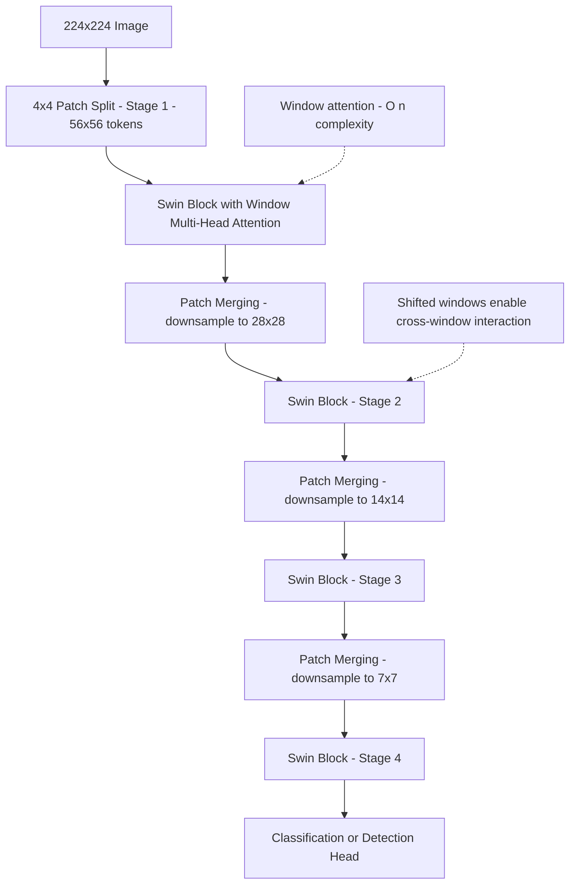

**Shifted window attention** computes self-attention within non-overlapping local windows (e.g., 7×7 patches), keeping complexity linear in image size. On alternating layers, windows are shifted by half the window size, allowing information to flow across window boundaries.

```python
from transformers import SwinForImageClassification, AutoFeatureExtractor

feature_extractor = AutoFeatureExtractor.from_pretrained("microsoft/swin-base-patch4-window7-224")
model = SwinForImageClassification.from_pretrained(
    "microsoft/swin-base-patch4-window7-224",
    num_labels=10,
    ignore_mismatched_sizes=True,
)
```

### 7.6. Architecture Comparison

| Model    | Params | ImageNet Top-1 | Complexity | Best Use Case                              |
| -------- | ------ | -------------- | ---------- | ------------------------------------------ |
| ViT-B/16 | 86M    | 81.8%          | O(n²)      | Large-data classification                  |
| DeiT-B   | 86M    | 81.8%          | O(n²)      | Limited data, knowledge distillation       |
| Swin-B   | 88M    | 83.5%          | O(n)       | Detection, segmentation, multi-scale tasks |
| Swin-L   | 197M   | 86.3%          | O(n)       | State-of-the-art dense prediction          |

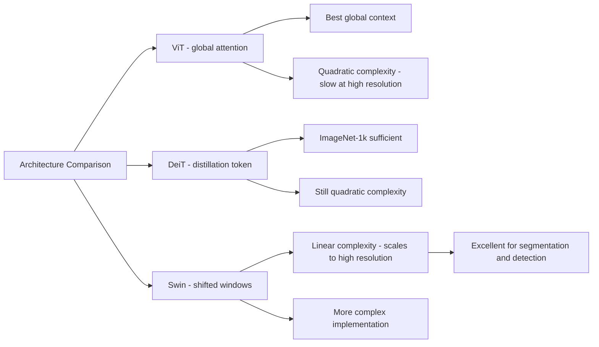

---

Transformers are not limited to classification. Detection Transformer (DETR) uses a ViT backbone plus a transformer decoder to perform end-to-end object detection without anchor boxes, non-maximum suppression, or multi-scale feature pyramids.

### 7.7. ViT for Object Detection with DETR

```python
from transformers import DetrForObjectDetection, DetrImageProcessor
from PIL import Image
import torch
import requests

# Load DETR fine-tuned on COCO
processor = DetrImageProcessor.from_pretrained("facebook/detr-resnet-50")
model = DetrForObjectDetection.from_pretrained("facebook/detr-resnet-50")

image = Image.open(requests.get("http://images.cocodataset.org/val2017/000000039769.jpg", stream=True).raw)

inputs = processor(images=image, return_tensors="pt")
outputs = model(**inputs)

# Post-process: filter detections above a confidence threshold
target_sizes = torch.tensor([image.size[::-1]])
results = processor.post_process_object_detection(
    outputs, target_sizes=target_sizes, threshold=0.9
)[0]

for score, label, box in zip(results["scores"], results["labels"], results["boxes"]):
    box = [round(b, 2) for b in box.tolist()]
    print(f"Detected {model.config.id2label[label.item()]} with score {score:.3f} at {box}")
```

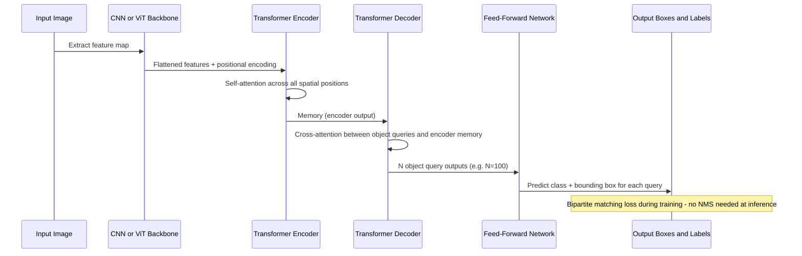

---

After fine-tuning, production deployment requires balancing accuracy, latency, and memory footprint across a range of hardware targets.

### 7.8. ONNX Export and TensorRT Optimization

```python
import torch
from transformers import ViTForImageClassification

model = ViTForImageClassification.from_pretrained("./fine_tuned_vit")
model.eval()

# Export to ONNX
dummy_input = torch.randn(1, 3, 224, 224)
torch.onnx.export(
    model,
    dummy_input,
    "vit_model.onnx",
    input_names=["pixel_values"],
    output_names=["logits"],
    dynamic_axes={"pixel_values": {0: "batch_size"}, "logits": {0: "batch_size"}},
    opset_version=14,
)
print("ONNX model exported")
```

```python
# Validate with ONNX Runtime
import onnxruntime as ort
import numpy as np

session = ort.InferenceSession("vit_model.onnx", providers=["CUDAExecutionProvider"])
dummy = np.random.randn(1, 3, 224, 224).astype(np.float32)
outputs = session.run(["logits"], {"pixel_values": dummy})
print("ONNX inference output shape:", outputs[0].shape)
```

### 7.9. INT8 Quantization

Post-training quantization reduces model size by ~4x and inference latency by 2–3x on CPU with minimal accuracy loss.

```python
from transformers import ViTForImageClassification
import torch
from torch.quantization import quantize_dynamic

model = ViTForImageClassification.from_pretrained("./fine_tuned_vit")
model.eval()

# Dynamic quantization — converts linear layers to INT8
quantized_model = quantize_dynamic(
    model,
    qconfig_spec={torch.nn.Linear},
    dtype=torch.qint8,
)

# Compare sizes
import os
torch.save(model.state_dict(), "vit_fp32.pt")
torch.save(quantized_model.state_dict(), "vit_int8.pt")

fp32_size = os.path.getsize("vit_fp32.pt") / 1024 / 1024
int8_size = os.path.getsize("vit_int8.pt") / 1024 / 1024
print(f"FP32: {fp32_size:.1f} MB  →  INT8: {int8_size:.1f} MB")
```

### 7.10. Serving with FastAPI

```python
# serve.py
from fastapi import FastAPI, UploadFile, File
from transformers import ViTForImageClassification, ViTFeatureExtractor
from PIL import Image
import torch
import io

app = FastAPI(title="ViT Image Classifier")

model = ViTForImageClassification.from_pretrained("./fine_tuned_vit")
feature_extractor = ViTFeatureExtractor.from_pretrained("./fine_tuned_vit")
model.eval()

LABELS = model.config.id2label

@app.post("/classify")
async def classify_image(file: UploadFile = File(...)):
    image_bytes = await file.read()
    image = Image.open(io.BytesIO(image_bytes)).convert("RGB")

    inputs = feature_extractor(images=image, return_tensors="pt")

    with torch.no_grad():
        outputs = model(**inputs)

    logits = outputs.logits
    predicted_class = logits.argmax(-1).item()
    confidence = torch.softmax(logits, dim=-1)[0, predicted_class].item()

    return {
        "label": LABELS[predicted_class],
        "confidence": round(confidence, 4),
        "class_id": predicted_class,
    }
```

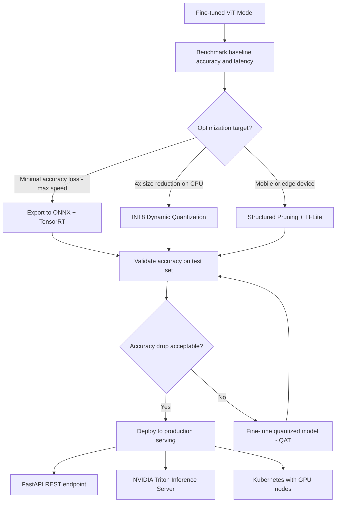

---

## 8. Future Directions and Research Challenges

### 8.1. Self-Supervised and Unsupervised Learning

Emerging self-supervised techniques can further reduce dependency on labeled data:

- **Contrastive Learning:** Learn robust features from unlabeled datasets through instance discrimination.
- **Masked Image Modeling:** Extend masked token prediction techniques to images for improved pre-training.

### 8.2. Multimodal and Cross-Domain Fusion

Integrating multiple data modalities (e.g., text, audio, sensor data) with vision can unlock richer models for context-aware classification and decision-making.

### 8.3. Real-Time Processing and Edge AI

Continued innovation in hardware accelerators and efficient model architectures will further enable real-time processing and deployment of ViTs in resource-constrained environments.

### 8.4. Ethical and Fair AI

Research must continue into mitigating biases in training data and ensuring that computer vision models operate fairly across diverse user populations.

---

## 9. Conclusion

Fine-tuning Vision Transformers for image classification represents an exciting frontier in deep learning. Through a comprehensive understanding of the architectural underpinnings, careful data preparation, advanced training techniques, and rigorous evaluation, practitioners can harness the power of ViTs to achieve state-of-the-art performance. This detailed analysis provides a foundational and advanced reference for deploying these models into real-world applications, with an eye toward continuous improvement and ethical considerations.

**Key Takeaways:**

- Choose your ViT variant based on your data budget and task: ViT-B/16 for large-scale classification, DeiT when only ImageNet-1k is available, Swin for detection and segmentation requiring multi-scale features.
- Distillation (DeiT approach) is a practical way to transfer inductive bias from CNNs into transformers without architectural changes.
- DETR demonstrates that transformers can replace the entire detection pipeline (anchors + NMS) with a simpler end-to-end formulation.
- For production deployment, always benchmark ONNX + TensorRT and INT8 quantization against your accuracy budget — a 4x reduction in model size with under 1% accuracy loss is routinely achievable.
- Serve fine-tuned ViTs behind FastAPI with Kubernetes autoscaling; use NVIDIA Triton Inference Server for batching at high throughput.
- Attention map visualization is the most effective explainability tool for ViTs — it directly shows which image regions the model focused on, making debugging misclassifications intuitive.

---

## 10. Further Resources

- **Hugging Face Transformers Documentation:** [https://huggingface.co/transformers](https://huggingface.co/transformers)
- **Vision Transformer Research Paper:** ["An Image is Worth 16x16 Words: Transformers for Image Recognition at Scale"](https://arxiv.org/abs/2010.11929)
- **PyTorch Official Documentation:** [https://pytorch.org/docs/stable/index.html](https://pytorch.org/docs/stable/index.html)
- **Data Augmentation Techniques:** Explore advanced augmentation methods on platforms such as [Albumentations](https://albumentations.ai).
- **Model Compression and Quantization:** Tutorials and research on model optimization from NVIDIA and TensorFlow.
- **Deep Learning Courses:** Platforms like Coursera, edX, and Udacity offer specialized courses in computer vision and transformers.

Embark on your journey to push the boundaries of image classification with Vision Transformers, and continue to explore and innovate in this rapidly evolving field. Happy coding and research!
