import MdxLayout from "@/components/MdxLayout";

export const metadata = {
  title: "Web Development Basics: A Deep Dive into Modern Web Technologies",
  description:
    "An exhaustive guide exploring every fundamental aspect of web development, from HTML structure and advanced CSS techniques to JS interactivity, responsive design, and accessibility.",
  topics: ["Web Development", "Design", "Web Architecture", "Web Frameworks"],
};

export default function WebDevDeepDiveArticle({ children }) {
  return <MdxLayout>{children}</MdxLayout>;
}

# Web Development Basics: A Deep Dive into Modern Web Technologies

### Author: Son Nguyen

> Date: 2025-03-05

In the ever-evolving landscape of digital technology, a solid grasp of web development fundamentals is essential. Whether you’re designing a personal blog, a corporate website, or a complex web application, the core building blocks - HTML, CSS, and JavaScript - form the backbone of every project. This article presents a comprehensive deep dive into modern web development. We explore the structure of HTML, the artistry of CSS, and the dynamism of JavaScript, alongside responsive design strategies and accessibility practices. By the end, you’ll have a detailed roadmap for building scalable, high-performance web experiences.

---

## 1. HTML: The Foundation of the Web

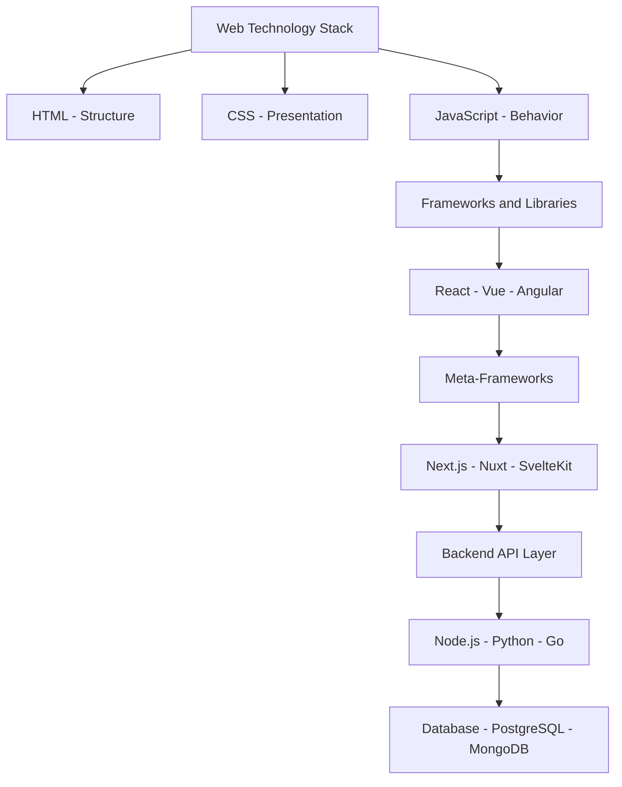

HTML (HyperText Markup Language) provides the semantic structure for web content. It tells the browser what to display and organizes your content into a readable and accessible format.

### 1.1. The Basic HTML Document Structure

Every HTML document follows a consistent structure. Consider this basic template:

```html
<!DOCTYPE html>
<html lang="en">
  <head>
    <!-- Meta tags for character encoding, viewport, SEO, and linking external resources -->
    <meta charset="UTF-8" />
    <meta name="viewport" content="width=device-width, initial-scale=1.0" />
    <title>Deep Dive into Web Dev</title>
    <link rel="stylesheet" href="styles.css" />
  </head>
  <body>
    <!-- Main content of your web page -->
    <header>
      <h1>Welcome to My Website</h1>
      <nav>
        <a href="#">Home</a>
        <a href="#">About</a>
        <a href="#">Services</a>
        <a href="#">Contact</a>
      </nav>
    </header>
    <main>
      <article>
        <h2>Understanding the Web</h2>
        <p>
          HTML is the skeleton of your website. It structures your content into
          headings, paragraphs, lists, and more.
        </p>
      </article>
    </main>
    <footer>
      <p>&copy; 2025 My Website. All rights reserved.</p>
    </footer>
    <script src="script.js"></script>
  </body>
</html>
```

- **`<!DOCTYPE html>`** tells the browser to render the document in HTML5.
- **`<html lang="en">`** defines the language of the document.
- **`<head>`** contains metadata and resource links.
- **`<body>`** holds the visible content.

### 1.2. Semantic HTML and Accessibility

Semantic HTML uses meaningful tags to convey the purpose of the content. For instance, `<header>`, `<nav>`, `<main>`, `<article>`, and `<footer>` improve both SEO and accessibility. Proper use of semantic elements aids screen readers and enhances overall user experience.

The semantic DOM tree of a typical HTML page looks like this:

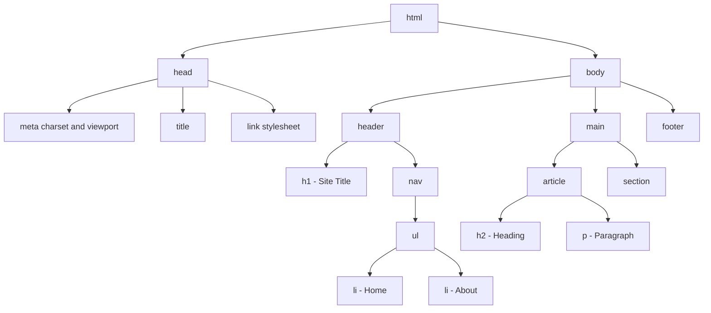

#### Example: Semantic Structure

```html
<header>
  <h1>My Portfolio</h1>
  <nav>
    <ul>
      <li><a href="#projects">Projects</a></li>
      <li><a href="#about">About</a></li>
      <li><a href="#contact">Contact</a></li>
    </ul>
  </nav>
</header>

<main>
  <article id="projects">
    <h2>Featured Projects</h2>
    <p>Here you'll find a collection of my most recent work.</p>
  </article>
  <section id="about">
    <h2>About Me</h2>
    <p>
      I am a passionate web developer with expertise in modern technologies.
    </p>
  </section>
</main>

<footer>
  <p>Contact me at <a href="mailto:email@example.com">email@example.com</a></p>
</footer>
```

### 1.3. Advanced HTML: Forms, Media, and APIs

#### Forms and Input Elements

Forms are the primary method for user interaction. HTML5 offers enhanced form elements and validation attributes that reduce the need for extra JavaScript.

```html
<form action="/submit" method="POST">
  <label for="email">Email:</label>
  <input type="email" id="email" name="email" required />

  <label for="password">Password:</label>
  <input type="password" id="password" name="password" minlength="8" required />

  <button type="submit">Register</button>
</form>
```

#### Embedding Multimedia

HTML5 provides native support for audio and video, eliminating the need for external plugins.

```html
<video width="600" controls>
  <source src="video.mp4" type="video/mp4" />
  Your browser does not support the video tag.
</video>

<audio controls>
  <source src="audio.mp3" type="audio/mpeg" />
  Your browser does not support the audio element.
</audio>
```

#### HTML5 APIs

Modern HTML5 APIs, such as the Geolocation API and Canvas API, extend the functionality of web pages, enabling interactive maps and dynamic graphics.

```js
// Geolocation Example
if (navigator.geolocation) {
  navigator.geolocation.getCurrentPosition((position) => {
    console.log("Latitude:", position.coords.latitude);
    console.log("Longitude:", position.coords.longitude);
  });
}
```

---

## 2. CSS: Styling, Layout, and Visual Presentation

CSS (Cascading Style Sheets) is responsible for the visual appearance of your website. It transforms raw HTML into a polished, interactive experience.

### 2.1. Ways to Apply CSS

There are three primary methods to add CSS to your project:

- **Inline CSS:** Directly within the HTML element via the `style` attribute.
- **Internal CSS:** Within a `<style>` tag inside the `<head>` section.
- **External CSS:** Linked via a `<link>` tag referencing a separate stylesheet.

#### External CSS Example

```css
/* styles.css */
body {
  font-family: "Helvetica Neue", Arial, sans-serif;
  margin: 0;
  padding: 0;
  background-color: #fafafa;
  line-height: 1.6;
}

header,
footer {
  background-color: #333;
  color: #fff;
  padding: 1rem;
  text-align: center;
}

nav a {
  color: #fff;
  margin: 0 15px;
  text-decoration: none;
}
```

### 2.2. CSS Selectors and Specificity

Selectors allow you to target HTML elements to apply styles. Understanding specificity helps resolve conflicts between multiple CSS rules.

- **Type selectors:** `p`, `h1`, `div`
- **Class selectors:** `.button`, `.nav-item`
- **ID selectors:** `#header`, `#footer`
- **Attribute selectors:** `input[type="text"]`

#### Specificity Example

```css
/* Element selector */
p {
  color: black;
}

/* Class selector */
.highlight {
  color: blue;
}

/* ID selector - highest specificity */
#intro {
  color: red;
}
```

### 2.3. CSS Box Model and Layout Techniques

The CSS Box Model is fundamental to understanding layout. Every element is a box comprising:

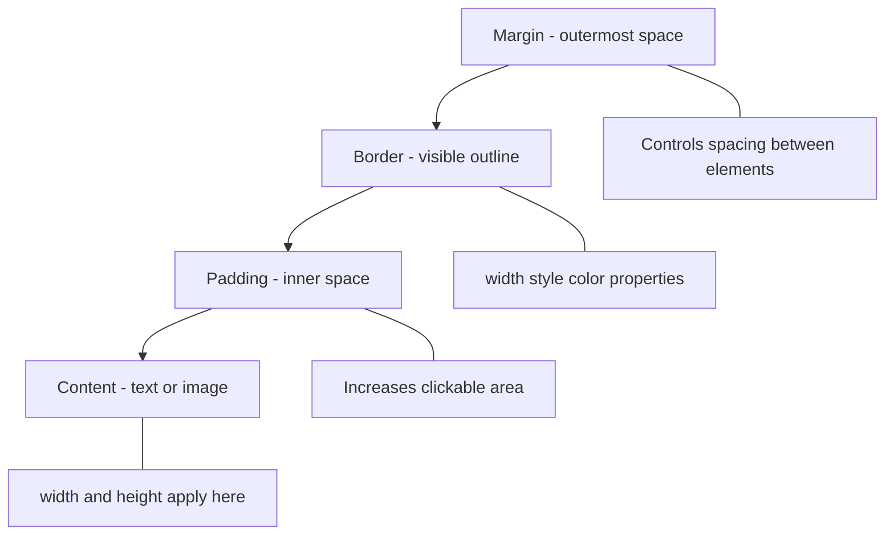

1. **Content:** The actual text, image, or other media.
2. **Padding:** Space between the content and the border.
3. **Border:** The outline around the padding and content.
4. **Margin:** Space outside the border that separates the element from others.

#### Visualizing the Box Model

```
+---------------------------+
|         Margin            |
|  +---------------------+  |
|  |      Border       |  |
|  |  +-------------+  |  |
|  |  |  Padding    |  |  |
|  |  |  Content    |  |  |
|  |  +-------------+  |  |
|  +---------------------+  |
+---------------------------+
```

#### Advanced Box Model Techniques

- **Centering Elements:**

Horizontally center a block-level element:

```css
.centered {
  width: 50%;
  margin: 0 auto;
}
```

- **Overflow Control:**

Handle content that exceeds its container:

```css
.overflow-container {
  width: 300px;
  height: 150px;
  overflow: auto;
}
```

### 2.4. CSS Pseudo-Classes and Pseudo-Elements

Pseudo-classes and pseudo-elements allow you to style dynamic or specific parts of elements without additional HTML.

#### Pseudo-Class Examples

```css
a:hover {
  text-decoration: underline;
}

input:focus {
  border-color: green;
}
```

#### Pseudo-Element Examples

```css
p::first-letter {
  font-size: 2em;
  color: #ff4500;
}

blockquote::before {
  content: "“";
  font-size: 3rem;
  vertical-align: top;
}
```

### 2.5. Advanced CSS Layout: Flexbox and Grid

#### Flexbox

Flexbox simplifies one-dimensional layouts.

```css
.flex-container {
  display: flex;
  justify-content: space-between;
  align-items: center;
  flex-wrap: wrap;
}

.flex-item {
  flex: 1;
  padding: 10px;
}
```

#### CSS Grid

CSS Grid offers powerful two-dimensional layouts.

```css
.grid-container {
  display: grid;
  grid-template-columns: repeat(3, 1fr);
  grid-gap: 20px;
  padding: 20px;
}

.grid-item {
  background: #e0e0e0;
  padding: 20px;
  border: 1px solid #ccc;
}
```

---

## 3. JavaScript: Adding Interactivity

JavaScript transforms static pages into dynamic, interactive experiences. It manipulates the Document Object Model (DOM), responds to user events, and integrates with APIs.

### 3.1. DOM Manipulation and Event Handling

JavaScript event bubbling and capturing describe the two phases in which events propagate through the DOM tree:

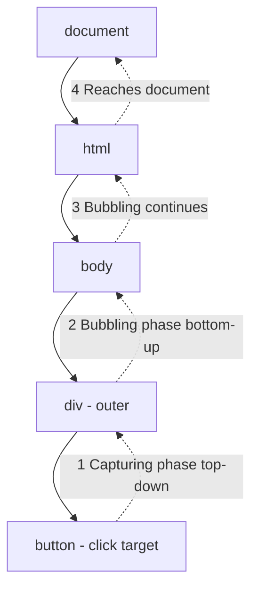

A simple example to change content on a button click:

```javascript
// script.js
document.addEventListener("DOMContentLoaded", () => {
  const button = document.getElementById("changeTextButton");
  button.addEventListener("click", () => {
    document.getElementById("textContainer").textContent =
      "You just changed the text!";
  });
});
```

And the HTML:

```html
<div id="textContainer">Original text goes here.</div>
<button id="changeTextButton">Click Me!</button>
```

### 3.2. AJAX and Fetch API

JavaScript also lets you fetch data asynchronously:

```javascript
fetch("https://api.example.com/data")
  .then((response) => response.json())
  .then((data) => {
    console.log("Data fetched:", data);
  })
  .catch((error) => console.error("Error:", error));
```

---

## 4. Responsive Web Design: One Site, Many Devices

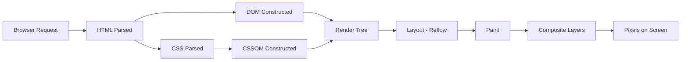

Responsive design ensures your site adapts gracefully to any device. Techniques include fluid grids, flexible images, and media queries.

### 4.1. Fluid Grids and Flexible Images

Use percentages or relative units to define dimensions so that elements resize dynamically.

```css
.container {
  width: 90%;
  max-width: 1200px;
  margin: 0 auto;
  padding: 1rem;
}

img {
  max-width: 100%;
  height: auto;
}
```

### 4.2. Media Queries

Media queries let you apply different styles based on screen size.

```css
@media (max-width: 768px) {
  .grid-container {
    grid-template-columns: 1fr;
  }

  nav {
    flex-direction: column;
  }
}
```

### 4.3. Responsive Typography

Relative units like `em` and `rem` help maintain readable text across devices.

```css
html {
  font-size: 16px;
}

h1 {
  font-size: 2.5rem; /* Scales relative to the root font size */
}

p {
  font-size: 1rem;
}
```

---

## 5. Best Practices and Advanced Techniques

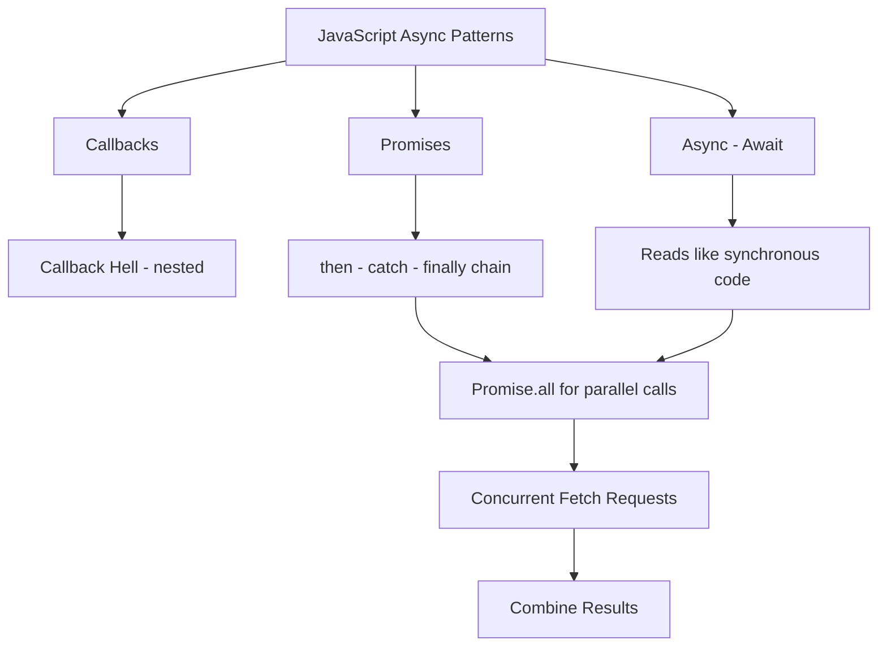

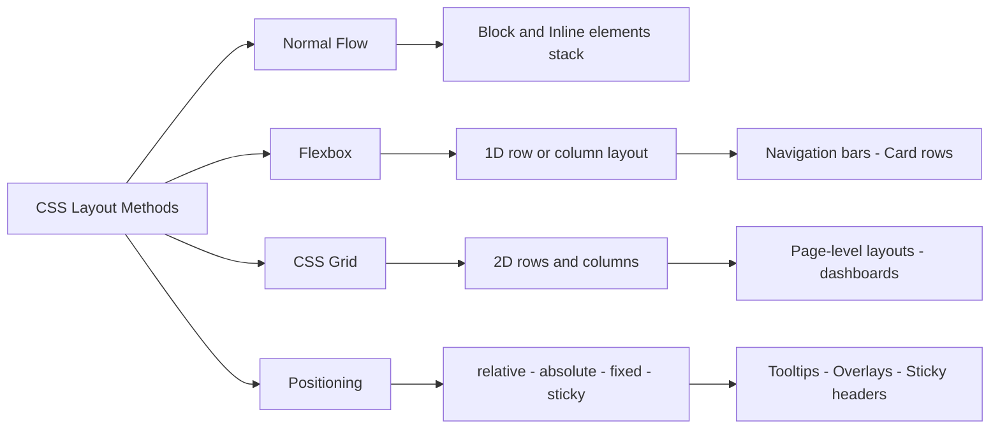

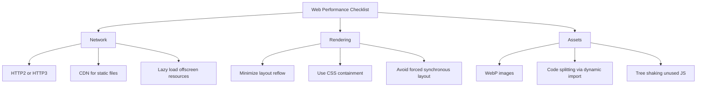

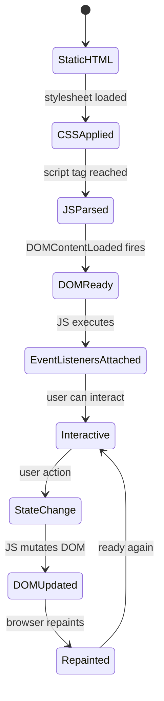

### 5.1. Semantic and Accessible Code

- **Semantic HTML:** Use meaningful tags to improve SEO and accessibility.
- **Accessibility (a11y):** Ensure keyboard navigation, proper labels for form elements, and sufficient color contrast.
- **ARIA Roles:** Enhance dynamic content for assistive technologies.

### 5.2. Performance Optimization

- **Minification:** Compress CSS and JavaScript files.
- **Caching:** Utilize browser caching and CDNs.
- **Image Optimization:** Compress images and use modern formats (WebP).

### 5.3. Version Control and Workflow

- **Git:** Track changes and collaborate effectively.
- **Modular Code:** Keep your code organized with components and reusable modules.

### 5.4. Advanced CSS: Animations and Transitions

CSS animations and transitions add polish to your web projects.

#### Animation Example

```css
@keyframes slideIn {
  0% {
    transform: translateX(-100%);
    opacity: 0;
  }
  100% {
    transform: translateX(0);
    opacity: 1;
  }
}

.animated-element {
  animation: slideIn 1s ease-out forwards;
}
```

#### Transition Example

```css
.button {
  background-color: #008cba;
  transition: background-color 0.3s ease;
}

.button:hover {
  background-color: #005f5f;
}
```

---

## 6. Web APIs: Fetch, Web Storage, and Service Workers

Modern browsers expose powerful APIs that go far beyond DOM manipulation. Understanding these APIs unlocks offline capability, persistent client storage, and sophisticated network control.

### 6.1 The Fetch API in Depth

The Fetch API supersedes XMLHttpRequest with a promise-based interface that composes cleanly with async/await. It gives you granular control over requests and responses.

```javascript
// A production-grade fetch wrapper with timeout, retry, and error handling
async function apiFetch(url, options = {}, retries = 3) {
  const controller = new AbortController();
  const timeoutId = setTimeout(() => controller.abort(), 8000);

  try {
    const response = await fetch(url, {
      ...options,
      signal: controller.signal,
      headers: {
        "Content-Type": "application/json",
        ...options.headers,
      },
    });
    clearTimeout(timeoutId);

    if (!response.ok) {
      throw new Error(`HTTP ${response.status}: ${response.statusText}`);
    }
    return await response.json();
  } catch (error) {
    clearTimeout(timeoutId);
    if (retries > 0 && error.name !== "AbortError") {
      await new Promise((r) => setTimeout(r, 500));
      return apiFetch(url, options, retries - 1);
    }
    throw error;
  }
}

// POST example with JSON body
async function createUser(userData) {
  return apiFetch("/api/users", {
    method: "POST",
    body: JSON.stringify(userData),
  });
}
```

### 6.2 Web Storage: localStorage and sessionStorage

Web Storage provides synchronous key-value storage in the browser. Use `localStorage` for data that should persist across sessions and `sessionStorage` for tab-scoped data.

```javascript
// A typed storage helper that handles serialization and expiry
const storage = {
  set(key, value, ttlSeconds = null) {
    const item = {
      value,
      expiry: ttlSeconds ? Date.now() + ttlSeconds * 1000 : null,
    };
    localStorage.setItem(key, JSON.stringify(item));
  },

  get(key) {
    const raw = localStorage.getItem(key);
    if (!raw) return null;
    const item = JSON.parse(raw);
    if (item.expiry && Date.now() > item.expiry) {
      localStorage.removeItem(key);
      return null;
    }
    return item.value;
  },

  remove(key) {
    localStorage.removeItem(key);
  },
};

// Cache API responses for 5 minutes
storage.set("user_profile", { name: "Alex", role: "admin" }, 300);
const profile = storage.get("user_profile"); // returns null after 5 min
```

### 6.3 Service Workers and Offline Capability

Service workers are JavaScript files that run in a separate browser thread, intercepting network requests and enabling offline functionality, push notifications, and background sync.

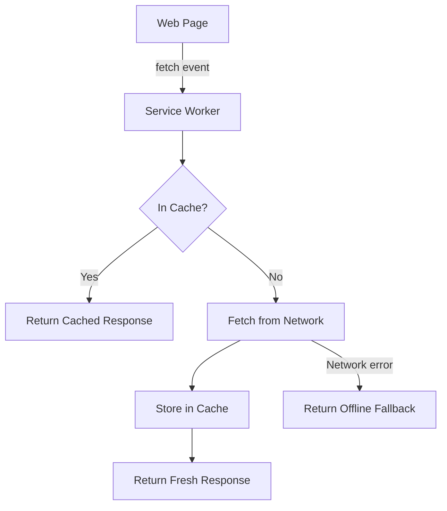

```javascript
// service-worker.js - Cache-first strategy with network fallback
const CACHE_NAME = "app-v1";
const STATIC_ASSETS = ["/", "/index.html", "/styles.css", "/app.js"];

self.addEventListener("install", (event) => {
  event.waitUntil(
    caches.open(CACHE_NAME).then((cache) => cache.addAll(STATIC_ASSETS)),
  );
});

self.addEventListener("fetch", (event) => {
  event.respondWith(
    caches.match(event.request).then((cached) => {
      if (cached) return cached;
      return fetch(event.request).then((response) => {
        const clone = response.clone();
        caches
          .open(CACHE_NAME)
          .then((cache) => cache.put(event.request, clone));
        return response;
      });
    }),
  );
});

// Register the service worker from your main JS
if ("serviceWorker" in navigator) {
  navigator.serviceWorker
    .register("/service-worker.js")
    .then((reg) => console.log("SW registered:", reg.scope))
    .catch((err) => console.error("SW registration failed:", err));
}
```

---

## 7. Modern CSS: Container Queries, Subgrid, and CSS Custom Properties

CSS has evolved rapidly beyond Flexbox and Grid. Container queries, subgrid, and custom properties enable design systems that were previously only achievable with JavaScript.

### 7.1 Container Queries

Media queries respond to the viewport. Container queries respond to the size of a parent element. This is transformative for truly reusable components: a card component can now adapt its own layout based on its container, not the screen.

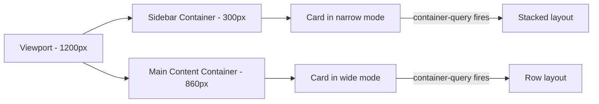

```css
/* Define a containment context */
.card-wrapper {
  container-type: inline-size;
  container-name: card;
}

/* Style the card based on its container width, not the viewport */
.card {
  display: flex;
  flex-direction: column;
  gap: 1rem;
}

@container card (min-width: 500px) {
  .card {
    flex-direction: row;
    align-items: center;
  }

  .card__image {
    width: 200px;
    flex-shrink: 0;
  }
}
```

### 7.2 CSS Grid Subgrid

Subgrid allows nested grid items to align to the tracks of the parent grid. This solves the long-standing problem of aligning content across sibling cards in a grid.

```css
/* Parent grid */
.product-grid {
  display: grid;
  grid-template-columns: repeat(3, 1fr);
  gap: 2rem;
}

/* Each card spans 3 implicit rows: image, title, price */
.product-card {
  display: grid;
  grid-row: span 3;
  grid-template-rows: subgrid; /* inherit parent track sizing */
  gap: 0.5rem;
}

/* Now image, title, and price align across all cards automatically */
.product-card__image {
  aspect-ratio: 4 / 3;
  object-fit: cover;
}
```

### 7.3 CSS Custom Properties for Design Tokens

CSS custom properties (variables) enable design token systems that update the entire UI from a single source of truth, including dynamic theming with JavaScript.

```css
/* Design token definitions */
:root {
  --color-primary: #0066cc;
  --color-surface: #ffffff;
  --color-text: #1a1a2e;
  --spacing-base: 8px;
  --radius-md: 6px;
  --shadow-card: 0 2px 8px rgba(0, 0, 0, 0.08);
}

/* Dark mode tokens override root tokens */
[data-theme="dark"] {
  --color-primary: #4d9fff;
  --color-surface: #1a1a2e;
  --color-text: #e0e0e0;
  --shadow-card: 0 2px 8px rgba(0, 0, 0, 0.4);
}

.card {
  background: var(--color-surface);
  color: var(--color-text);
  border-radius: var(--radius-md);
  box-shadow: var(--shadow-card);
  padding: calc(var(--spacing-base) * 3);
}
```

```javascript
// Toggle theme dynamically without any class conflicts
function setTheme(theme) {
  document.documentElement.setAttribute("data-theme", theme);
  localStorage.setItem("theme", theme);
}
```

---

## 8. TypeScript for Web Developers

TypeScript adds static typing to JavaScript, catching errors at compile time rather than runtime. For web projects beyond a few hundred lines, TypeScript pays for itself quickly.

### 8.1 Typing DOM Interactions

```typescript
// Typed event handler - no runtime surprises
function setupForm(formId: string): void {
  const form = document.getElementById(formId) as HTMLFormElement | null;
  if (!form) return;

  form.addEventListener("submit", async (event: SubmitEvent) => {
    event.preventDefault();
    const data = new FormData(form);
    const email = data.get("email") as string;
    const password = data.get("password") as string;
    await loginUser({ email, password });
  });
}

interface LoginPayload {
  email: string;
  password: string;
}

interface LoginResponse {
  token: string;
  user: { id: string; name: string };
}

async function loginUser(payload: LoginPayload): Promise<LoginResponse> {
  const response = await fetch("/api/auth/login", {
    method: "POST",
    headers: { "Content-Type": "application/json" },
    body: JSON.stringify(payload),
  });
  if (!response.ok) throw new Error("Login failed");
  return response.json() as Promise<LoginResponse>;
}
```

### 8.2 TypeScript and the Fetch API

Typing API responses ensures that shape mismatches between the server contract and frontend usage are caught during development.

```typescript
// Generic typed fetch helper
async function typedFetch<T>(url: string, options?: RequestInit): Promise<T> {
  const res = await fetch(url, options);
  if (!res.ok) throw new Error(`Request failed: ${res.status}`);
  return res.json() as Promise<T>;
}

// Usage - TypeScript verifies all property accesses
interface Article {
  id: number;
  title: string;
  author: string;
  publishedAt: string;
}

const articles = await typedFetch<Article[]>("/api/articles");
console.log(articles[0].title); // autocomplete works, typo is a compile error
```

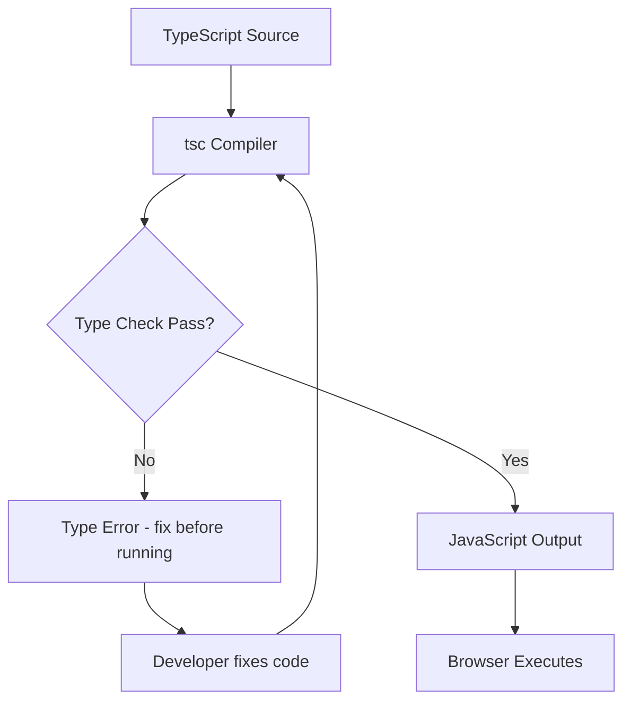

### 8.3 Type-Safe CSS Module Imports

When using CSS Modules with TypeScript, you get autocomplete for class names and compile-time safety for renamed or removed classes.

```typescript
// styles.module.css.d.ts - generated by tools like typed-css-modules
export const container: string;
export const header: string;
export const card: string;

// Component.tsx
import styles from "./styles.module.css";

function Card({ title }: { title: string }) {
  return (
    <div className={styles.card}>
      {" "}
      {/* autocomplete, typo = compile error */}
      <h2 className={styles.header}>{title}</h2>
    </div>
  );
}
```

---

## 9. Conclusion and Further Resources

Web development is a multifaceted discipline that combines creativity with technical rigor. This deep dive has covered the essentials - from structuring content with HTML and crafting styles with CSS to building interactivity with JavaScript and ensuring your site looks great on every device. Modern additions like the Fetch API, Service Workers, Container Queries, and TypeScript push the discipline further, enabling offline-capable, type-safe, and truly responsive experiences that adapt at the component level rather than just the viewport level.

Embracing semantic coding, accessibility, and performance optimization not only improves user experience but also future-proofs your projects.

For even more in-depth study and practical examples, please refer to the detailed [Web Design & Development Study Notes](https://hoangsonw.notion.site/Web-Design-Development-Study-Notes-2ec7107162734af980ff80edc52a530e?pvs=74).

Happy coding, and may your websites be robust, accessible, and beautifully responsive!
